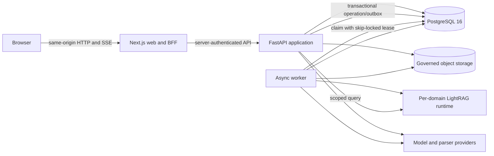

# Production Adaptation Blueprint

This document defines how Context Engine should evaluate and adapt candidate engineering patterns in Local Studio without inheriting Local Studio's product authority, local-first persistence, agent filesystem, inference lifecycle, or desktop trust assumptions. Every adapted pattern requires Context Engine-native verification; Local Studio is not production evidence for this product.

## Adaptation rule

Reuse a Local Studio element only when it strengthens a Context Engine boundary. Product truth remains the Context Engine PRD, API/SSE contracts, PostgreSQL schema, and security invariants.

| Local Studio element | Context Engine adaptation | Disposition |
| --- | --- | --- |
| Explicit `AppContext` dependency container | `ApplicationContext` containing settings, stores, adapters, orchestration services, audit, event publisher, and clock/ID providers | Port the pattern; implement in Python/FastAPI |
| Ordered HTTP middleware and normalized errors | trusted-proxy/host/origin -> request ID/error wrapper -> safe log -> body/rate limits -> authentication/CSRF -> route dependencies -> service authorization | Derive a Context Engine policy and verify it; do not copy Local Studio ordering blindly |
| `controller/contracts/` and `shared/agent/` | generated OpenAPI client plus hand-maintained versioned SSE event schemas and contract fixtures | Port the contract boundary, not the TypeScript controller DTOs |
| Modular `createApiClient` | browser-safe clients grouped by auth, domains, sources, chat, settings, and operations | Port; server/BFF injects credentials and deployment targets |
| Canonical live/replay event application | one chat stream reducer consumes both live SSE and durable replay, with separate received/applied cursors | Port for deterministic reconnect and idempotent replay |
| External stores and Effect-managed subscriptions | module stores expose `subscribe/getSnapshot`; subscriptions own cancellation, retry, and reconnect | Port where it reduces React lifecycle races; do not make browser state authoritative |
| `src/app` / `src/features` / `src/ui` layering | thin route shells, feature-owned orchestration, shared browser-safe clients, reusable primitives | Port with structural checks |
| ZCode tokens and UI primitives | fork the tokens and approved primitives into Context Engine-owned packages with provenance and accessibility tests | Adapt; do not import the Local Studio frontend at runtime |
| Standalone Next launcher and streaming sidecar lesson | production image must prove unbuffered SSE through the deployed reverse-proxy path | Port the verification requirement; a separate agent runtime is not required |
| Root contract/structure/type/test gates | one reproducible root command validates backend, frontend, migrations, contracts, privacy, and integration tests | Port and extend |
| Electron preload bridge | possible future desktop host with a minimal capability bridge | Defer; web production is the v1 acceptance target |
| SQLite/JSON/JSONL stores | none | Reject; Context Engine uses PostgreSQL, migrations, and governed object storage |
| Pi tools, plugins, terminal, filesystem, browser automation | none | Reject; they violate the shared-workspace RAG scope and browser trust boundary |
| Controller-selected runtime URL/API key | server-resolved provider, parser, LightRAG, storage, and worker configuration | Reject browser selection; retain the server-only resolution pattern |

## Target runtime topology



The browser has one origin and never receives infrastructure addresses or service credentials. The BFF is an anti-corruption boundary, not a second product backend.

Normative authentication flow: FastAPI issues and validates the opaque session cookie. The ingress routes `/api/v1/*` through Next BFF handlers that forward that cookie and the allowlisted browser `Origin` over the private application network; the BFF strips caller-supplied identity, forwarding, public-host/proto, and infrastructure headers and never synthesizes a principal. After validating the ingress-normalized request against its server-configured public origin, the BFF adds trusted server-derived public host/proto headers. FastAPI accepts those headers only from the private BFF peer, validates the configured public Origin/Host and its internal upstream Host, and requires a session-bound double-submit CSRF token on every unsafe method, including streaming POST. Login rotates any existing session, logout revokes it before clearing cookies, and direct FastAPI access is private-network-only. Next middleware may redirect for UX but is never an authorization boundary. Integration tests cover ingress login/mutation/stream/logout, forged identity/forwarding/public-host headers, missing/wrong Origin or CSRF token, session fixation, and direct public API denial.

Production source binaries and derived governed objects live behind an object-storage port. A filesystem adapter is development-only. Per-domain LightRAG/runtime directories are ephemeral, rebuildable caches and never backup authority. PostgreSQL stores object version/key metadata so deletion, restore, and reconciliation operate on one recorded consistency point.

## Backend production structure

```text
app/context_engine/
  app.py                    application factory and lifespan
  context.py                explicit dependency container
  contracts/                public DTOs, errors, SSE schemas
  http/                     middleware, dependencies, route registration
  domains/<capability>/     routes, service, repository, state machine
  orchestration/            chat, ingestion, indexing, deletion workflows
  adapters/                 LightRAG, model, parser, object-store implementations
  workers/                  lease claims, heartbeats, cancellation, recovery
  operations/               safe logging, health, service metrics, audit-write policy
```

Rules:

- Route handlers validate transport, call one application service, and project a public DTO.
- Services own transactions and state transitions; repositories do not authorize.
- Adapters return typed results and safe error codes. Provider payloads never cross the adapter boundary.
- Every background operation is created with a transactional operation/outbox record and has an idempotency key, lease owner/expiry, generation fence, bounded retry policy, and terminal recovery path. Workers claim with database locking, pass stable operation keys to adapters, and reconcile uncertain remote outcomes before retry.
- Audit-required mutations commit the protected state and audit row in one transaction.
- OpenAPI is generated from registered routes and compared with a committed snapshot; SSE has a separate versioned schema and fixture suite.

## Frontend production structure

```text
app/client/src/
  app/                      thin route/layout and BFF handlers
  features/                 auth, chat, evidence, documents, domains, operations
  lib/api/                  generated HTTP core plus capability clients
  lib/stream/               SSE parser, reconnect policy, cursor and reducer contracts
  stores/                   external stores for non-authoritative interaction state
  ui/                       Context Engine-owned primitives
  styles/tokens.css         forked and documented design tokens
```

The primary shell uses a collapsible discovery rail, a central work surface, and an optional inspector. Chat specializes that shell into conversation navigation, transcript/composer, and a turn-scoped Evidence/Refs/Source inspector. Mobile collapses navigation and inspector into drawers; it does not silently remove evidence or administrative status.

The frontend must implement four states for each data surface: loading, empty, safe failure with request ID, and ready. Optimistic updates are limited to reversible presentation state. Domain/source lifecycle, deletion, and chat terminal state always reconcile from server truth. Authenticated server clients are request-scoped; personalized API/BFF responses are `no-store`, private, and never captured in module singletons. Two-user cache-isolation and logout/back-navigation tests are mandatory.

## Streaming contract

Chat uses fetch streaming, not native `EventSource`. `POST /api/v1/conversations/{conversation_id}/turns:stream` starts a turn with a client request ID, message, optional domain and composer-reference tokens, and CSRF token. The server computes the canonical request fingerprint from the normalized effective input; the browser does not send a fingerprint field. `(conversation_id, client_request_id)` is unique: the same server-computed fingerprint attaches/replays; a different fingerprint returns `409 idempotency_conflict`. `GET /api/v1/conversations/{conversation_id}/turns/{turn_id}/events?after=<sequence>` resumes an authorized active or terminal turn.

The stream envelope contains `schemaVersion`, globally unique `eventId`, `turnId`, turn-scoped monotonically increasing `sequence` starting at 1, `type`, `occurredAt`, and a type-specific safe payload. CamelCase is the canonical SSE JSON wire shape. The minimum domain-RAG lifecycle is:

```text
turn.accepted -> route.selected -> retrieval.started -> evidence.delta*
-> retrieval.completed -> answer.delta* -> turn.completed
```

Direct, no-hit, evidence-only, failure, cancellation, and redaction sequences follow `contracts/sse-event-catalog.md`, which is canonical for event order and reducer behavior.

Any path may end in `turn.failed`; cancellation ends in `turn.cancelled`. The server retains event projections for the conversation retention period. A cursor older than retained events returns `410 cursor_expired` with an authorized terminal snapshot when one exists. The client rejects sequence regressions, ignores exact duplicates, resumes after the last applied sequence with bounded exponential backoff and jitter, and never invents completion from a closed socket. Ingress must preserve `text/event-stream`, disable buffering/transformation/cache, and flush incrementally. One fixture suite drives initial live, resumed live, and durable replay through the same reducer.

## Operational baseline

- Separate liveness, startup readiness, and dependency diagnostics. Global readiness covers PostgreSQL, schema compatibility, and indispensable shared services; a provider or domain runtime failure degrades only affected eligibility.
- Graceful shutdown stops new claims, signals cancellation, drains streams/work within a bound, and checkpoints interruption. Release only work proven quiescent; uncertain remote work keeps its lease until expiry and is reconciled by idempotency and generation fencing.
- JSON logs use allowlisted fields. Minimum service metrics use bounded-cardinality labels; domain/source/user IDs do not become labels.
- Migrations run as an explicit release step. Destructive changes require expand/migrate/contract sequencing plus backup and restore evidence.
- Define API/SSE/schema min/max compatible versions and additive-first rollout order for web, API, workers, and migrations. Clients ignore unknown additive SSE events but reject unsupported major versions.
- Production verification exercises the real ingress/BFF/API/SSE path, worker restart during a leased job, provider timeout, LightRAG unavailability, and database restore.

## Definition of production-ready

Production-ready means the deployed topology, not only local components, proves: deny-by-default authorization; deterministic migration and rollback; bounded background recovery; idempotent chat and ingestion; reconnectable unbuffered SSE; the minimum operational-safety baseline; source/domain redaction; backup restoration; accessibility; and a release manifest tying build inputs, schema version, contract version, and verification evidence to one artifact.

Before production approval, operators must set and test environment-specific SLOs and limits: availability/latency targets, concurrent streams per user and instance, upload and queue bounds, database/HTTP connection budgets, provider quotas, load-shed thresholds, RPO/RTO, backup cadence/retention, and restore frequency. The initial internal target is RPO <= 15 minutes and RTO <= 4 hours. A quarterly restore drill must recover PostgreSQL and matching object versions from a recorded consistency point, restore keys through separately controlled KMS/escrow, run reconciliation, and verify citations, redactions, governed-ref invalidations, and audit continuity.

Retention policy is configuration with approved defaults, not an implementation guess. It separately covers sessions, conversations/turns, source objects, redacted private links, audit partitions, and deleted/offboarded users; legal hold overrides purge. Purge/anonymization jobs are FK-safe, audited, capacity-tested, and never resurrect data into LightRAG or public projections.

## Source anchors

Local Studio patterns were reviewed under `.references/code/local-studio/`, including controller composition/security, frontend API/runtime/UI/token seams, agent-runtime service boundaries, and quality scripts. Exact files used by an adaptation must receive a deterministic digest and provenance entry. These are design references, not runtime dependencies.
