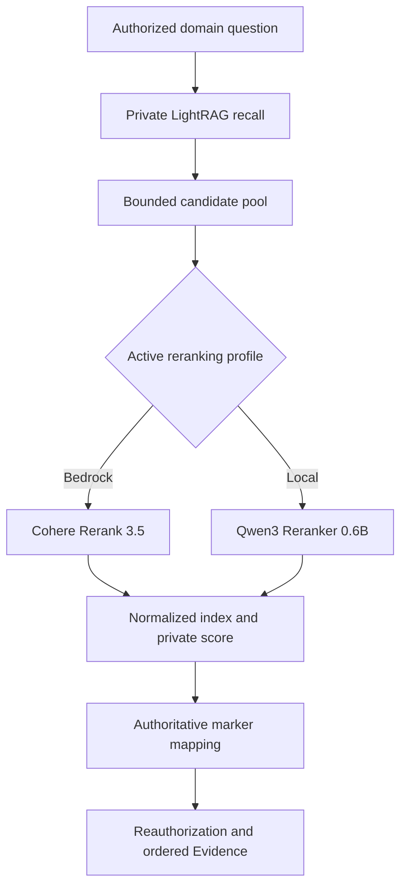

# Future Feature Brief: Cloud and Local Text Reranking

Status: non-normative future implementation plan. Release assignment is intentionally unapproved.

Candidate implementation branch: `feature/retrieval-reranking` (create only after Phase 1 production acceptance and approval of the contract, threat model, deployment budget, and release placement).

## Scope boundary

This brief preserves a two-mode text-reranking plan without authorizing Phase 1 implementation. It creates no Phase 1 provider kind, model-profile kind, schema field, endpoint, environment variable, container, fixture, test, estimate, or release gate.

The initial capability reranks private text candidates returned by the existing one-domain LightRAG retrieval path before authoritative Source Block mapping. It does not create a second retriever, alter domain selection, expose relevance scores, or permit the browser to select a provider, model, endpoint, or fallback policy.

ColPali and related visual late-interaction models are excluded from this initial capability. They require page-image embeddings, a large multi-vector index, page-to-block score propagation, and a separately approved multimodal retrieval contract. Adding them as a nominal reranker would create the second retrieval stack prohibited by the current PRD.

## Retained product intent

Administrators may eventually configure one active reranking profile from the closed server-owned catalog:

- **Cloud:** Cohere Rerank 3.5 through the Amazon Bedrock `Rerank` API, using the existing `bedrock` provider credential and egress boundary.
- **Local:** `Qwen/Qwen3-Reranker-0.6B` through a private Cohere-compatible rerank service colocated with the deployment.

`BAAI/bge-reranker-v2-m3` remains a benchmarked local alternative, not a second simultaneously active local path. Direct Cohere SaaS, Jina SaaS, Aliyun, browser-selected endpoints, and LLM-prompt-based ranking are outside the initial plan.

The user-visible Evidence contract remains unchanged. Reranking affects only private candidate order; citation labels are still assigned after successful provenance mapping, authorization, and deterministic deduplication.

## Candidate requirements

- R1. Query exactly one authorized, running, runtime-ready Knowledge Domain and use only candidates returned by its private LightRAG runtime.
- R2. Retrieve a bounded recall pool larger than the final Evidence budget, rerank it once, then pass at most the approved candidate limit into authoritative provenance mapping.
- R3. Preserve candidate content and provenance markers byte-for-byte; a reranker may score, reorder, and select but never rewrite a candidate.
- R4. Support the cloud profile only through the existing Bedrock trust and credential boundary using Cohere Rerank 3.5.
- R5. Support the local profile through a private deployment-owned service using Qwen3-Reranker-0.6B; it must have no public ingress and must not depend on an experimental Ollama rerank API.
- R6. Keep reranker model, endpoint, credential, raw score, provider response, and candidate text out of browser DTOs, SSE, logs, audit payloads, and metrics.
- R7. Include admission control, a bounded sub-deadline, cancellation, payload limits, safe error mapping, and tested saturation behavior inside the existing retrieval budget.
- R8. Define an explicit server-owned failure policy. Silent fallback from reranked to original order is forbidden.
- R9. Preserve identical-turn replay semantics: replay must use persisted terminal Evidence and must not repeat retrieval or reranking.
- R10. Prove quality and latency against deterministic domain corpora before enabling either profile; no provider is production-supported from packaging alone.
- R11. Freeze the effective reranker profile for each newly accepted turn so concurrent configuration changes cannot change in-flight execution.
- R12. Keep ColPali, ColQwen, page-image indexes, and visual retrieval outside this implementation until a separate multimodal contract is approved.

## Candidate technical decisions

### KTD1. Rerank inside the private retrieval dependency

The preferred placement is inside the private per-domain LightRAG runtime, before candidates cross the `ScopedRetrievalPort`. Vendored LightRAG already accepts a custom `rerank_model_func` and can preserve original candidate fields while attaching private scores. Context Engine remains authoritative for bounds, safe failures, provenance mapping, and reauthorization.

The adapter result must normalize to candidate index plus relevance score. The original candidate object remains the source passed to mapping; provider-returned document text is never trusted as replacement content.

### KTD2. Use Bedrock rather than direct Cohere SaaS

Bedrock keeps cloud reranking under the existing provider catalog, encrypted credential handling, regional controls, and approved model-egress boundary. The adapter uses the `bedrock-agent-runtime` `Rerank` operation and normalizes `index` and `relevanceScore` without exposing model ARNs or provider payloads.

### KTD3. Use a dedicated local reranker service rather than Ollama

Ollama does not currently provide a stable production reranking API. The local profile should use a pinned private image serving Qwen3-Reranker-0.6B through a Cohere-compatible endpoint, subject to an approved topology amendment. The runtime image, model revision, tokenizer, quantization, serving engine, and hardware compatibility must be locked in the release manifest.

### KTD4. Add a distinct reranking configuration concept

Do not overload `synthesis` or `embedding` profiles. Activation must first decide whether reranking becomes a third `model_profiles.profile_kind` with an `active_reranking_profile_id`, or a separate closed reranker profile table. The decision must account for provider-specific configuration, immutable model revisions, local service metadata, audit events, migration compatibility, and whether a global default is sufficient.

The browser may receive safe profile labels and readiness metadata only if approved contracts add them. Runtime endpoints, ARNs, container addresses, credentials, and raw scores remain private.

### KTD5. Fail explicitly

Before activation, the product contract must choose one policy:

1. **Required reranking:** dependency failure produces a safe retryable retrieval failure and no Evidence.
2. **Configured degradation:** the server records a private safe reason and continues with original retrieval order only when the active profile explicitly permits that behavior.

Vendored LightRAG's current catch-and-continue behavior cannot decide this product policy. Empty reranker output, invalid indexes, duplicates, non-finite scores, timeout, authorization failure, and model unavailability require closed typed outcomes.

## Performance and quality gate

Headline model benchmarks are not acceptance evidence. The implementation must benchmark the complete deployed path using seeded Context Engine corpora and real candidate lengths.

Candidate starting bounds, to be validated rather than treated as contract:

- recall pool: 20-30 text candidates;
- final private candidates: at most 10;
- one rerank invocation per domain-RAG retrieval operation;
- reranking sub-deadline: no more than one-third of the total retrieval deadline;
- local steady-state model memory: measured and recorded for the pinned image and quantization;
- quality: improve or preserve nDCG@10 and citation-support rate over the no-rerank baseline without increasing unmapped-hit rate;
- latency: set p50/p95 budgets from representative concurrent load before activation.

The benchmark matrix must compare no reranker, Bedrock Cohere Rerank 3.5, Qwen3-Reranker-0.6B, and BGE-reranker-v2-m3 on the same candidate sets. It must include short factual queries, ambiguous terminology, multilingual content, tables, long blocks, duplicate-near-duplicate passages, and deliberately irrelevant distractors.

ColPali performance must not be compared as though it were an interchangeable text cross-encoder. Its reported low query latency assumes precomputed page-image multi-vector embeddings, while its storage and GPU profile belong to a visual retrieval architecture.

## Candidate delivery slices

### U1. Contract, threat model, and architecture activation

**Goal:** Approve the release placement, failure policy, configuration ownership, egress rules, local topology, and performance budgets before code or schema changes.

**Requirements:** R1-R12.

**Files:**
- Modify: `docs/prd.md`
- Modify: `docs/interaction-behavior-prd.md`
- Modify: `docs/architecture/data-and-lifecycle.md`
- Modify: `docs/architecture/deployment-topology.md`
- Modify: `docs/contracts/dto-schema-catalog.md`
- Modify: `docs/contracts/http-api-catalog.md`
- Create: approved reranking ADR under `docs/architecture/`

**Test scenarios:** Test expectation: none -- this slice approves normative behavior and stop conditions.

**Verification:** The approved contracts define one-domain placement, configuration authority, closed failures, privacy classification, profile lifecycle, and the explicit exclusion of visual retrieval.

### U2. Persistence and trusted runtime configuration

**Goal:** Add the approved reranking profile representation, active default, audit events, migration, and safe admin projection.

**Requirements:** R4-R6, R8, R11.

**Files:**
- Modify: `docs/database-schema.txt`
- Modify: `app/context_engine/models.py`
- Modify: `app/context_engine/services/runtime_config.py`
- Modify: `app/context_engine/api/routes.py`
- Modify: `app/context_engine/api/catalog_schemas.py`
- Create: `app/migrations/versions/<revision>_reranking_profiles.py`
- Modify: `app/tests/test_runtime_config_service.py`
- Modify: `app/tests/test_postgres_runtime_config.py`
- Modify: runtime-settings HTTP and migration contract tests under `app/tests/`

**Test scenarios:**
1. An administrator creates and activates each approved profile only when its existing provider or local runtime is ready.
2. Unknown provider/model fields and mismatched profile kinds fail closed.
3. Credential rotation and profile activation commit with their required audit events or both roll back.
4. An in-use or default reranking profile cannot be deleted.
5. Fresh install, supported upgrade, previous-image rollback window, and restore preserve active configuration without exposing secrets.

**Verification:** PostgreSQL constraints, services, API schemas, OpenAPI snapshots, and safe frontend contracts agree.

### U3. Bedrock Cohere adapter

**Goal:** Implement a bounded Bedrock `Rerank` adapter that returns normalized private ranking results.

**Requirements:** R3, R4, R6-R8.

**Files:**
- Create: `app/context_engine/adapters/reranking.py`
- Modify: `app/pyproject.toml`
- Create: `app/tests/test_reranking_adapters.py`
- Modify: provider packaging and staging-smoke scripts under `app/scripts/`
- Modify: `docs/operations/provider-deployment-profiles.md`

**Test scenarios:**
1. A valid Bedrock response produces stable original indexes in descending relevance order.
2. Duplicate, out-of-range, missing, non-finite, or malformed scores fail with a closed safe code.
3. Timeout, throttling, access denial, unavailable model, and transport loss expose no ARN, credential, candidate content, or provider payload.
4. The adapter truncates requests and results to approved bounds before allocation grows unbounded.
5. Credential-gated staging smoke proves the pinned model in each claimed region before production-supported status.

**Verification:** Fixture tests remain network-free; staging evidence records the exact region, model ID, package lock, and artifact digest.

### U4. Local Qwen reranker service

**Goal:** Package and operate a private Qwen3-Reranker-0.6B service with a normalized Cohere-compatible contract.

**Requirements:** R3, R5-R8.

**Files:**
- Create: a pinned reranker image definition under `app/`
- Modify: `app/compose.stack.yml`
- Modify: production-like Compose overlays under `app/`
- Create: private readiness and client adapter tests under `app/tests/`
- Modify: `docs/architecture/deployment-topology.md`
- Modify: `docs/operations/compose-stack-runbook.md`

**Test scenarios:**
1. The service is reachable only from the private application/runtime network and has no public ingress.
2. Missing model artifacts, incompatible GPU/CPU profile, readiness failure, saturation, timeout, and shutdown map to closed safe outcomes.
3. Candidate content and query text do not appear in container logs, health output, metrics, or failure artifacts.
4. The pinned model revision produces deterministic ordering within the documented numerical tolerance.
5. CPU-only and GPU deployment profiles are labelled from measured evidence; unsupported profiles refuse startup rather than silently degrading.

**Verification:** Image build, SBOM, vulnerability scan, offline model-artifact policy, readiness, graceful shutdown, and concurrent-load evidence are attached to one immutable artifact manifest.

### U5. LightRAG integration and authoritative mapping

**Goal:** Rerank a larger private recall pool before bounded candidates are mapped to Source Blocks.

**Requirements:** R1-R3, R7-R9, R11.

**Files:**
- Modify: `app/context_engine/tools/ce_lightrag_shim.py`
- Modify: `app/context_engine/services/indexing.py`
- Modify: `app/context_engine/adapters/lightrag_http_client.py`
- Modify: `app/context_engine/services/evidence.py`
- Modify: `app/context_engine/services/chat_turns.py`
- Modify: `app/tests/test_lightrag_real_runtime_integration.py`
- Modify: `app/tests/test_lightrag_http_client.py`
- Modify: `app/tests/test_evidence_http_contract.py`
- Modify: conversation replay and privacy tests under `app/tests/`

**Test scenarios:**
1. Reranking changes private candidate order while preserving every provenance marker and maps Evidence in the new order.
2. Cross-domain, stale-generation, unmapped, altered-marker, duplicate, and unauthorized candidates are discarded after reranking exactly as before.
3. Configuration changes after turn acceptance do not change that turn's frozen effective profile.
4. Identical terminal replay performs no LightRAG, reranker, or synthesis call.
5. The selected failure policy behaves identically for HTTP and in-process LightRAG clients.
6. Deadline exhaustion, cancellation, worker shutdown, and concurrency saturation release resources and never infer success from a closed connection.

**Verification:** Real PostgreSQL and private-runtime tests prove ordering, reauthorization, replay, deletion/redaction, and safe failure behavior.

### U6. Evaluation, rollout, and production acceptance

**Goal:** Prove relevance gains and acceptable resource cost before enabling a default.

**Requirements:** R6, R7, R10.

**Files:**
- Create: deterministic reranking evaluation fixtures under `app/tests/fixtures/`
- Create: evaluation tooling under `app/scripts/`
- Modify: `docs/quality/seeded-demo-and-test-data.md`
- Modify: `docs/quality/definition-of-done.md`
- Modify: deployment profile and release runbooks under `docs/operations/`

**Test scenarios:**
1. Each profile runs against identical frozen queries, candidates, expected relevant blocks, and distractors.
2. Quality reports include nDCG@10, recall@10, citation-support rate, no-context accuracy, and unmapped-hit rate.
3. Load reports include p50/p95 latency, timeout/saturation rate, throughput, memory, cold start, and provider quota behavior.
4. A shadow or disabled-by-default rollout cannot change member Evidence until the acceptance decision activates the profile.
5. Rollback disables reranking without re-indexing domains or changing persisted Evidence for completed turns.

**Verification:** The release decision names the winning local model, approved cloud regions, final bounds, failure policy, capacity envelope, and rollback trigger.

## Activation and stop conditions

Activate this work only after:

1. Phase 1 is production-accepted.
2. A release owner assigns this capability to a release and branch.
3. The PRD and interaction cases approve reranking semantics and failure behavior.
4. The architecture approves the private local inference service and confirms it is not a second retrieval stack.
5. Security review approves sending candidate text to Bedrock in the configured regions.
6. Benchmarks define measurable quality and latency gates.

Stop and obtain a new decision if:

- Bedrock cannot provide the required regional or data-governance guarantees.
- The local service requires browser-visible endpoints or an unapproved orchestrator.
- The reranker rewrites candidate text or breaks provenance markers.
- Quality gains require page-image embeddings, a visual index, or page-level retrieval.
- Silent fallback is the only feasible failure behavior.
- The larger recall pool violates the approved retrieval deadline or capacity envelope.

## Definition of done

The future capability is complete only when both modes share one closed private contract, preserve one-domain authorization and provenance mapping, meet the approved quality and latency gates, pass credential-gated/deployed-path evidence, expose no new private data, replay without repeated work, and can be disabled or rolled back without domain re-indexing.

## Sources

- `docs/prd.md`
- `docs/architecture/data-and-lifecycle.md`
- `docs/architecture/deployment-topology.md`
- `docs/contracts/dto-schema-catalog.md`
- `docs/contracts/http-api-catalog.md`
- `app/vendor/lightrag/lightrag.py`
- `app/vendor/lightrag/rerank.py`
- `app/context_engine/tools/ce_lightrag_shim.py`
- [Amazon Bedrock Rerank API](https://docs.aws.amazon.com/bedrock/latest/APIReference/API_agent-runtime_Rerank.html)
- [Amazon Bedrock supported reranker models and regions](https://docs.aws.amazon.com/bedrock/latest/userguide/rerank-supported.html)
- [Qwen3-Reranker-0.6B model card](https://huggingface.co/Qwen/Qwen3-Reranker-0.6B)
- [ColPali documentation](https://huggingface.co/docs/transformers/main/en/model_doc/colpali)
- [ColPali paper](https://arxiv.org/abs/2407.01449)
