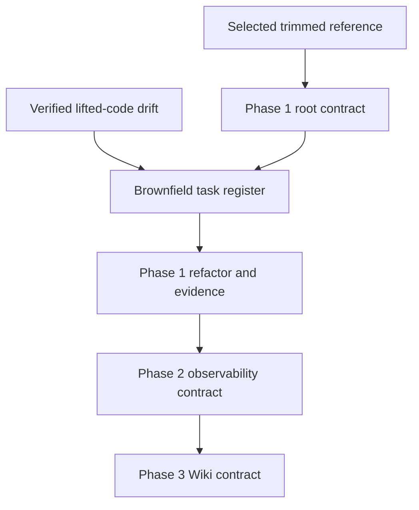
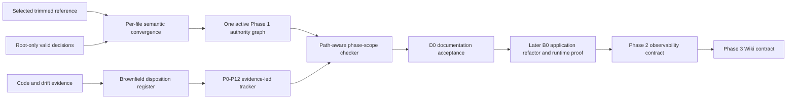
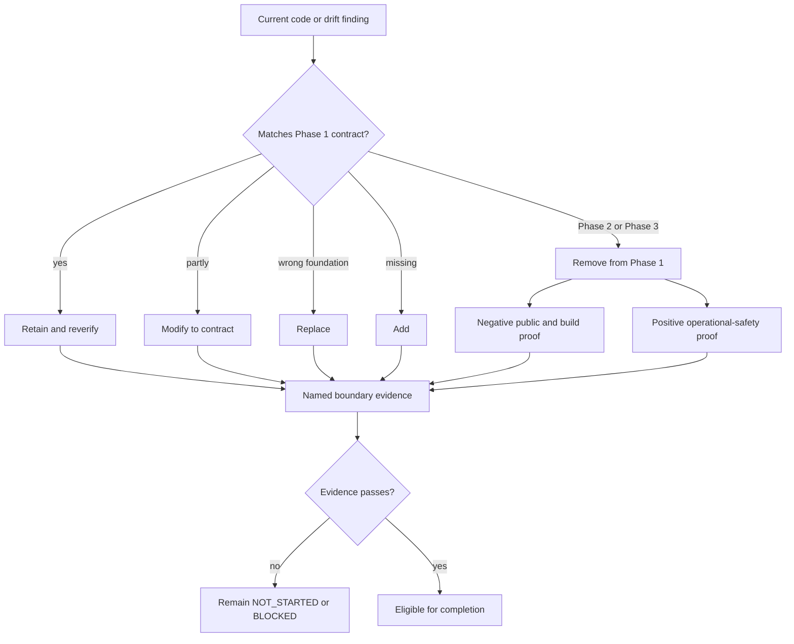

# Brownfield Phase Contract Alignment - Plan

## Goal Capsule

- **Objective:** Align the root documentation with the trimmed Phase 1 product contract and make the build tracker an evidence-led brownfield refactor of the lifted application.
- **Authority:** Apply the precedence in `AGENTS.md`; use the selected trimmed reference for phase scope, the Product Contract below for intent, and the lifted code plus drift review only as current-state evidence.
- **Stop conditions:** Stop rather than invent when a public field/event/endpoint, Evidence-suggestion contract, destructive legacy-data disposition, or future-layer re-entry decision is absent; stop if the documentation cannot be made atomic without leaving contradictory higher-authority guidance.
- **Execution profile:** Documentation and one deterministic application-tree preflight only, followed by U1-U7 in dependency order. Do not edit `app/` or claim future runtime evidence.
- **Tail ownership:** The executor owns D0 syntax, fixture, live-scan, cold-reader, and traceability evidence. Application refactoring, B-gates, commit/push/PR, and deployed acceptance remain outside this plan unless separately authorized.

---

## Product Contract

### Summary

The root documentation will become one consistent Phase 1 authority for the grounded RAG workstation and its minimum operational-safety baseline.
Its build plan will start from the lifted application's verified state, preserve conforming foundations, remove deferred surfaces, and turn every material drift finding into traceable remediation and acceptance work.

### Problem Frame

The root package currently makes Wiki and product-facing observability part of the active v1 contract across requirements, data, API, frontend, test, and release documents.
The selected reference instead limits Phase 1 to grounded retrieval, durable chat, governed source/evidence/template context, core administration, and operational safety; it defers observability to Phase 2 and Wiki to Phase 3.

The lifted application is also not a blank slate.
It already contains Wiki persistence and APIs, Wiki composer references, audit and LightRAG diagnostic APIs, and a Logs frontend, while other Phase 1 capabilities range from reusable foundations to contract-breaking or missing implementations.
The current greenfield tracker hides that distinction and cannot guide a safe refactor or prove what existing behavior was retained, replaced, removed, or newly built.

The detailed trim review named by the request contains only the workstation's compact dark/light product goal.
The verified implementation findings therefore come from `docs/_scratch/code-docs-drift-review.md` and direct inspection of the lifted application.

### Key Decisions

- **Release order:** Observability is Phase 2 and Wiki is Phase 3. (session-settled: user-directed — chosen over Wiki in Phase 2 and observability in Phase 3: this order matches the selected reference package and preserves its dependency sequence.)
- **Deferred code treatment:** Existing Wiki and product-observability surfaces must be removed from the Phase 1 runtime, build, contracts, and release evidence rather than hidden behind dormant flags. (session-settled: user-approved — chosen over retaining unreachable scaffolding: an enforceable phase boundary prevents deferred contracts from shaping Phase 1.)
- **Documentation strategy:** Reconcile each normative root document selectively and preserve valid root-only material. (session-settled: user-directed — chosen over wholesale replacement or an amendment overlay: selective convergence removes contradictions without discarding useful reviewed decisions.)
- **Operational safety boundary:** Phase 1 retains transactional audit writes, allowlisted server logs, request and trace correlation, liveness and readiness, bounded-cardinality service metrics, privacy checks, and runbooks. (session-settled: user-approved — chosen over deferring all operational telemetry: the core release still needs a safe production baseline.)
- **Brownfield evidence model:** Existing code is classified and reverified before a task receives credit; presence alone is never completion evidence.

<!-- ce-section: work-relationships -->
### How This Work Fits Together

This plan owns the root documentation convergence and the brownfield work requirements that Phase 1 planning must consume.
The broader sequence is the current approved direction, not authorization to implement future layers early.

- **Phase 1 documentation and brownfield alignment**
  - Depends on the selected trimmed reference for scope and on verified code review evidence for current state.
  - Enables the core application refactor, contract convergence, and Phase 1 production evidence.
- **Phase 2 observability layer**
  - Depends on Phase 1 production acceptance and a newly approved observability contract and threat model.
  - Must not contribute Phase 1 schema, DTOs, routes, UI, fixtures, estimates, or release gates.
- **Phase 3 Wiki layer**
  - Depends on Phase 2 acceptance and a newly approved Wiki contract and threat model.
  - Must not contribute Phase 1 or Phase 2 schema, DTOs, routes, composer references, UI, fixtures, estimates, or release gates.



### Actors

- A1. Documentation maintainers reconcile the normative package and keep its authority graph consistent.
- A2. Implementation agents use the brownfield tracker to retain, modify, remove, replace, or add application behavior without inventing scope.
- A3. Product, security, and release reviewers verify the phase boundary, traceability, and required evidence before accepting Phase 1.

### Requirements

**Phase authority and future direction**

- R1. Every normative root document must describe the same Phase 1 product boundary and must not require Wiki or product-facing observability behavior.
- R2. The documentation must preserve observability as a Phase 2 direction and Wiki as a Phase 3 direction in future briefs that are non-normative for earlier releases.
- R3. Each future brief must state its re-entry criteria, required contract and threat-model approval, predecessor acceptance gate, and prohibition on earlier scaffolding.
- R4. Repository guidance with higher precedence than `docs/`, including `AGENTS.md`, must use the same active routes, capabilities, invariants, testing gates, and future-phase vocabulary.
- R5. Phase 1 governed context must support only approved source, evidence, and template references; Wiki references and Wiki-specific invalidation must not remain an earlier-phase dependency.
- R6. Phase 1 must retain its minimum operational-safety baseline while excluding log, usage, server-status, audit-browser, diagnostics-browser, analytics, export, retention, and live-log product surfaces.

**Cross-document convergence**

- R7. Product requirements, interaction cases, contracts, database schema, architecture, frontend specifications, quality gates, technology guidance, and the master build plan must be reconciled as one change set so no lower-authority document revives deferred scope.
- R8. The active Phase 1 route inventory must include the approved core routes and deliberate unavailable states, and must exclude `/logs`, `/usage`, `/server`, and `/wiki` as product routes.
- R9. Deletion, redaction, composer-reference, audit, backup, privacy, and release language must be rewritten around the Phase 1 contract rather than retaining hidden Wiki or observability dependencies.
- R10. The compact Local Studio-style workstation goal, dark and light themes, accessibility obligations, and responsive behavior must remain active Phase 1 frontend requirements.
- R11. Valid root-only decisions may remain when they do not conflict with the selected phase boundary, security model, or approved contracts.

**Brownfield task model**

- R12. The master build plan must describe `P0` through `P12` as work packages within release Phase 1 and must not confuse them with the Phase 2 and Phase 3 release sequence.
- R13. Each Phase 1 work package must begin with a current-state inventory and assign affected lifted code one disposition: retain and reverify, modify to contract, remove from Phase 1, replace, or add because missing.
- R14. Existing Wiki and product-observability persistence, services, APIs, composer references, navigation, pages, fixtures, tests, and build dependencies must receive explicit removal tasks and negative verification gates.
- R15. Reusable authentication, authorization queries, request IDs, safe errors and logs, generation and lease concepts, hashed composer tokens, pinned frontend dependencies, theme foundations, and shell primitives must receive retain-and-reverify tasks rather than automatic rebuild credit.
- R16. Broken manifests, launch paths, imports, type checks, tests, Compose topology, and contract-generation gaps must be treated as early brownfield blockers before feature-level completion can be claimed.
- R17. Every validated finding in `docs/_scratch/code-docs-drift-review.md` must map to one or more Phase 1 tasks, an explicit rationale for exclusion, or a superseding authoritative requirement.
- R18. Brownfield tasks must cover contract and security boundaries, persistence and concurrency, lifecycle and recovery, frontend behavior, adapters and external calls, deployment, and release verification instead of grouping drift as generic cleanup.

**Traceability and acceptance evidence**

- R19. The build tracker must connect each brownfield task to its governing requirement or interaction case, current-code evidence, intended disposition, dependencies, and completion evidence.
- R20. Task status must reflect verified behavior at the required boundary; the existence of lifted source files, mocks, or passing narrow tests must not mark a task complete.
- R21. The documentation change must include a repeatable consistency check that detects active Phase 1 Wiki or product-observability requirements outside the future briefs.
- R22. Phase 1 acceptance must prove that removed deferred surfaces are absent from public contracts, generated clients, the Phase 1 clean-install schema and active migration head, runtime registration, navigation, fixtures, tests, and release gates. Immutable historical or quarantined compatibility migrations may describe retired artifacts only until KTD9's approved retirement gate completes; they must not register or expose those surfaces.
- R23. Phase 1 acceptance must separately prove that the operational-safety baseline remains functional and private after product-facing observability is removed.

### Key Flows

- F1. Authority convergence
  - **Trigger:** A1 begins the root documentation alignment.
  - **Actors:** A1, A3
  - **Steps:** Compare each normative root artifact with the selected reference, preserve compatible root-only decisions, remove active deferred scope, add future references, and check the authority graph for contradictions.
  - **Outcome:** A cold reader derives one Phase 1 scope and one future release sequence from any documented entry point.
  - **Covered by:** R1-R11, R21
- F2. Brownfield disposition
  - **Trigger:** A2 plans a Phase 1 work package against the lifted application.
  - **Actors:** A2, A3
  - **Steps:** Inventory current behavior, assign a disposition, connect verified drift and reusable foundations to tasks, sequence prerequisites, and name evidence that can earn completion.
  - **Outcome:** Existing code is neither discarded blindly nor accepted without contract proof.
  - **Covered by:** R12-R20
- F3. Deferred-surface removal
  - **Trigger:** A2 reaches a lifted Wiki or product-observability surface during Phase 1 alignment.
  - **Actors:** A2, A3
  - **Steps:** Remove the surface and its dependencies from the Phase 1 build, verify absence at every public and persistence boundary, preserve only the approved future brief, and recheck the safety baseline.
  - **Outcome:** Phase 1 ships no dormant future feature and remains operationally safe.
  - **Covered by:** R2-R6, R14, R21-R23

### Acceptance Examples

- AE1. **Covers R1-R9, R21.** Given any root PRD, contract, schema, architecture, frontend, quality, or tracker entry point, when a reader follows its Phase 1 requirements, then Wiki and product-facing observability are absent and the same future sequence is stated or linked.
- AE2. **Covers R2-R3.** Given a future brief, when an implementation agent reads it during an earlier release, then it authorizes no schema, DTO, route, UI, fixture, estimate, dependency, or release gate.
- AE3. **Covers R6, R23.** Given product-facing observability is deferred, when Phase 1 operational acceptance runs, then transactional audit writes, safe server logs, correlation, health, bounded metrics, privacy checks, and runbooks remain required and testable.
- AE4. **Covers R13-R18.** Given an existing lifted-code capability, when it enters the tracker, then it has one explicit disposition and cannot receive completion credit until its governing contract and boundary evidence pass.
- AE5. **Covers R14, R22.** Given the lifted app currently registers Wiki and Logs or diagnostic surfaces, when Phase 1 alignment is complete, then those surfaces and their transitive Phase 1 dependencies are absent rather than merely hidden from navigation.
- AE6. **Covers R15, R20.** Given a reusable foundation such as session-token hashing or request IDs, when it conforms to the approved contract, then the tracker preserves it but still requires targeted verification before marking its work complete.
- AE7. **Covers R16-R20.** Given a drift finding such as a broken launch path, unsafe browser trust boundary, handwritten contract, socket-coupled stream, or missing recovery proof, when the master plan is reviewed, then a traceable task or documented exclusion accounts for it.
- AE8. **Covers R10.** Given the feature trim, when frontend scope is reviewed, then compact Local Studio-style geometry, dark and light themes, responsive behavior, and accessibility remain active rather than being mistaken for deferred functionality.

### Success Criteria

- The root authority graph contains no active Phase 1 requirement for Wiki or product-facing observability and no contradictory release ordering.
- Every verified drift finding and reusable foundation has a traceable brownfield disposition in the development tracker.
- Phase 1 tasks distinguish removal, adaptation, replacement, addition, and reverification work and name evidence that can earn completion.
- Future briefs preserve enough intent and re-entry criteria for later contract work without creating earlier release obligations.
- A reviewer can explain the Phase 1 safety baseline and the Phase 2 and Phase 3 boundaries without consulting the lifted code.

### Scope Boundaries

**In scope**

- Reconciliation of the root documentation package and any higher-authority repository guidance that would otherwise contradict it.
- Future observability and Wiki briefs with explicit non-normative boundaries and re-entry criteria.
- Brownfield requirements and task coverage derived from the selected reference, direct code inspection, and the verified drift review.
- Preservation of compatible root-only product, security, accessibility, and visual decisions.

**Deferred for later**

- Executing the application refactor and proving its runtime acceptance evidence.
- Designing or implementing the Phase 2 observability contract and product layer.
- Designing or implementing the Phase 3 Wiki contract and product layer.

**Excluded**

- Dormant, placeholder, feature-flagged, or partially wired Wiki and product-observability scaffolding in Phase 1.
- A documentation amendment that leaves contradictory active contracts in place.
- Treating the lifted codebase as either authoritative completion evidence or disposable reference code.

### Dependencies and Assumptions

- The selected reference under `.references/ce-local-studio-no-wiki-observability/docs/` is the phase-scope source for this convergence, with the user-confirmed order of Phase 2 observability followed by Phase 3 Wiki.
- `docs/_scratch/code-docs-drift-review.md` is the current verified drift inventory, but planning may discover additional drift and must route it through the same disposition model.
- `.references/ce-local-studio-trim-feature-review.md` contributes only the compact dark/light workstation goal and is not treated as an implementation audit.
- The workspace lacks Git provenance, so current task completion cannot be inferred from commit history and must remain evidence-based.

### Sources and Research

- `.references/ce-local-studio-no-wiki-observability/docs/`
- `.references/ce-local-studio-no-wiki-observability/docs/future/README.md`
- `.references/ce-local-studio-no-wiki-observability/docs/future/observability-layer.md`
- `.references/ce-local-studio-no-wiki-observability/docs/future/wiki-layer.md`
- `.references/ce-local-studio-trim-feature-review.md`
- `docs/_scratch/code-docs-drift-review.md`
- `docs/master-build-plan.md`
- `app/server/models.py`
- `app/server/api/routes.py`
- `app/client/src/features/logs-observability/LogsPage.tsx`

## Planning Contract

### Key Technical Decisions

- KTD1. Phase 1 is the grounded RAG workstation plus the minimum private operational-safety baseline; product observability is Phase 2 and Wiki is Phase 3. (session-settled: user-directed — chosen over reversing the two future layers: this matches the selected trimmed package and preserves its dependency order.)
- KTD2. Active Wiki and product-observability code is scheduled for transitive removal from the Phase 1 runtime and build, not dormant retention. (session-settled: user-approved — chosen over feature flags or unreachable scaffolding: absence is the only enforceable earlier-phase boundary.)
- KTD3. Reconcile shared documents per file and per semantic section. Do not copy the reference directory wholesale. (session-settled: user-directed — chosen over wholesale replacement or an overlay: the repository has valid root-only plans, ideation, scratch evidence, and local decisions.)
- KTD4. Preserve transactional audit writes, allowlisted structured logs, request/trace correlation, health/readiness, bounded metrics, privacy scans, and runbooks while removing public audit, diagnostics, Logs, Usage, and Server product surfaces. (session-settled: user-approved — chosen over deferring all telemetry: Phase 1 still needs a safe operating baseline.)
- KTD5. Use two acceptance layers: D0 proves documentation authority and traceability and authorizes planning only; B0 and later gates prove application behavior. The current build remains release-blocked and cannot be promoted as Phase 1 until B0 proves deferred surfaces absent and retained safety behavior present. (session-settled: user-approved — chosen over treating runtime absence checks as immediate docs completion: the confirmed scope keeps application refactoring deferred.)
- KTD6. Keep the lean-agent-shell artifact as a subordinate Phase 1 child Product Contract. It cannot authorize an endpoint, DTO, SSE event, ref kind, or persistence model; those require the PRD and versioned contracts. Fold sealed SSE, grounded terminals, the Evidence/Refs/Source workbench, and closed capabilities into the core brownfield packages; keep Evidence suggestions non-executable until the core baseline and a contract amendment pass. (session-settled: user-approved — chosen over folding the artifact unchanged or excluding it entirely: the pressure test found a viable staged subset and removed its Phase 3 Wiki assumptions.)
- KTD7. Preserve stable interaction IDs. Removing Wiki and public-observability cases may leave gaps; do not silently renumber unaffected cases such as A-13.
- KTD8. Keep `docs/_scratch/code-docs-drift-review.md` immutable as dated review evidence. Record supersession and execution disposition in a new brownfield register rather than rewriting historical findings.
- KTD9. Treat retirement of the legacy Wiki persistence closure as an application-planning gate: Wiki rows, dependent Evidence links, composer tokens, accepted turn refs, target vocabulary, constraints, and immutable audit history. D0 records a static closure hypothesis from repository evidence; it cannot claim completeness for any populated deployment. The Phase 1 schema is a clean-install target only. No populated upgrade may expire, invalidate, redact, preserve, migrate, quarantine, or drop any part of that closure until live PostgreSQL catalogs, recovered migration history, ORM metadata, and documented schema reconcile with no unaccounted object and compatibility scope, write fencing, export/archive, backup/restore, rollback, and per-object disposition are approved. If populated legacy upgrade is unsupported, the read-only release-migration preflight accepts only an empty database or the exact current target schema/head and refuses recognized, partial, renamed, or unknown source state before writes. Normal startup separately accepts the exact current target catalog/Alembic signature with valid populated current-version data and refuses behind, ahead, or unknown schema state; documentation alone is not a safety gate.
- KTD10. Enforce phase scope with a path-aware checker, a closed manifest-owned literal lexeme inventory, and adversarial fixtures. The checker independently discovers every governed candidate including every artifact under `docs/plans/`, validates and removes only exact one-line removal-evidence records, then scans `active` and `mixed-removal` bytes literally. It distinguishes future/historical material and enforces child-plan ceiling records without inventing regex or natural-language semantics.
- KTD11. Freeze a canonical `docs/phase-scope-manifest.md` before parallel convergence. It uses the exact grammar below to enumerate active routes, governed-ref kinds, removed public surfaces, retained safety capabilities, phase order, stable case tombstones, child-plan ceilings, scanned files, and the sole evidence output; U2-U6 consume it, and none of U1-U4 is independently mergeable.
- KTD12. The pressure-tested frontend-factory plan is a subordinate `phase-1-child`. D0 may add CE-owned DESIGN, frontend-agent guidance, and parity/catalog rules, but no application credit. Later work migrates or reverifies Button/Input/StatusPill in canonical `src/ui`, keeps SettingsRow and the contract-blocked fifth Domain accordion as Settings-owned compositions, and treats those five pairs as starter coverage rather than a complete UI allowlist. HTML is safe non-product visual guidance, React owns behavior/accessibility, and live `/settings?section=domains` proof uses real server DTOs through the production Next/BFF/FastAPI boundary without request interception or mocked product responses.

### High-Level Technical Design

The documentation change has two inputs and two outputs: the selected phase authority supplies the target contract; the lifted application and its review supply current-state evidence. They meet through selective convergence, never through directory replacement.



Each lifted implementation seam receives exactly one disposition before it can become work. Deferred surfaces are a special branch: remove them transitively and prove both absence and preservation of the safety baseline.



### Implementation Constraints

- Preserve the Product Contract above. Planning detail may explain when its future runtime examples are proved, but must not weaken or silently rewrite R1-R23.
- U1 freezes `docs/phase-scope-manifest.md` as the structural source for U2-U6. Text scans supplement that manifest; they do not guess phase meaning from arbitrary prose.
- Use the reference as the target phase contract, then localize provenance and current-state statements to this repository's `app/`, `app/compose.stack.yml`, and `scripts/dev.sh` layout.
- Preserve `docs/_scratch/`, `docs/ideation/`, and `docs/plans/`. The ideation artifact remains historical and non-normative; the linked lean-shell plan remains a Phase 1 child contract.
- Update `AGENTS.md` in the same change set as normative docs because it outranks them. U1-U4 are one atomic documentation change and are not independently mergeable or acceptable.
- Before trimming active schema text, capture the legacy persistence closure in `docs/architecture/legacy-persistence-retirement.md` from the pre-change schema and current models/migrations. Then reconcile `docs/interaction-behavior-prd.md`, `docs/database-schema.txt`, and every file under `docs/contracts/` atomically. Removed cases and public artifacts receive tombstones; stable surviving IDs do not shift.
- Do not edit `app/` or claim that runtime, migrations, clients, tests, or containers conform. Their known red baseline remains an explicit P0 input to the future refactor. D0 cannot authorize a release while that divergence remains.
- Do not authorize destructive migration behavior. The tracker must stop before dropping populated legacy Wiki data unless KTD9's decision and recovery evidence exist.
- Future briefs may describe intent and re-entry gates but cannot define earlier schema, DTO, endpoint, route, fixture, estimate, dependency, or acceptance obligations.
- Documentation tests must be deterministic, network-free, and runnable from the repository root.

### Phase-Scope Classification Grammar

`docs/phase-scope-manifest.md` is UTF-8 Markdown with exactly one machine-read table whose header is `recordClass | subject | value | notes`. Each data row has exactly four cells; surrounding ASCII space is trimmed; literal or escaped pipes, embedded newlines, HTML, and continuation rows are forbidden. Rows are sorted bytewise by `(recordClass, subject)`. Record-class names and enum values are lowercase kebab-case ASCII. The `notes` cell is non-authoritative prose and may be empty.

Subjects are unique within a record class. Repository paths use `/`, are relative to the repository root, use exact on-disk case, and contain no leading slash, backslash, empty segment, `.` segment, or `..` segment. Routes start with one `/` and contain no query or fragment. Interaction IDs retain uppercase `M-`, `A-`, or `C-` spelling. The checker rejects unknown columns, record classes, enum values, duplicate keys, unsorted rows, malformed paths, and unmet cardinalities.

| Record class | Subject and value contract | Required cardinality / checker meaning |
| --- | --- | --- |
| `phase-order` | subject `release-order`; value `phase-1>phase-2-observability>phase-3-wiki` | Exactly one |
| `scan-file` | subject is a normalized path; value is `active`, `mixed-removal`, `future`, `historical`, `manifest`, `review-required`, or `evidence-output` | Exactly one row per governed candidate; exactly one `manifest` and evidence output; no `review-required` row at final D0 |
| `active-route` | subject is a route; value `phase-1` | Exact set: `/login`, `/chat`, `/documents`, `/database-visualize`, `/settings` |
| `governed-ref-kind` | subject is a ref kind; value `phase-1` | Exact set: `source`, `evidence`, `template` |
| `removed-public-surface` | subject is a stable slug; value is `route`, `http`, `dto`, `ref`, `table`, or `case-family` | One or more rows; unique negative Phase 1 inventory |
| `prohibited-lexeme` | subject is a stable slug; value is one exact case-sensitive UTF-8 substring with no pipe or newline | One or more rows; every removed surface has at least one lexeme and U6 scans only this closed set |
| `retained-safety-capability` | subject is a capability slug; value `phase-1-private` | Exact set: `transactional-audit`, `allowlisted-logs`, `correlation`, `health-readiness`, `bounded-metrics`, `privacy-checks`, `runbooks` |
| `case-tombstone` | subject is a removed stable interaction ID; value `phase-2`, `phase-3`, or `removed` | Exact Phase 1 removal set: `M-12`, `M-13`, `A-11`, `A-12`; surviving IDs are never renumbered |
| `child-ceiling` | subject is `<manifest-listed-plan-path>#<declaration-class>`; value `prohibited` | Exact deny records required by KTD6 and KTD12 |

The `child-ceiling` set must deny plan 002 `public-http-dto-sse-ref-persistence-authority` and `phase-boundary-override`. It must deny plan 003 `new-route-authority`, `live-stub-product-state`, `uncontracted-shared-primitive`, and `d0-application-completion`. U6 maps these closed declaration-class tokens to required ceiling anchors and bounded forbidden-positive patterns; its fixtures prove each denial.

Every regular artifact returned by ignore-independent `rg --files -uu docs/plans` is a governed candidate regardless of extension or hidden/ignored status and must have exactly one `scan-file` row; an unclassified new plan fails D0. Plans classified as active governance or children must declare compatible `phase_compatibility`; plans explicitly classified `future` or `historical` retain their non-active treatment. `review-required` is a pre-freeze discovery value only: U1 assigns an owner and resolves every such row before the manifest can freeze or U2-U4 can start, and U6 rejects it at final D0. A `mixed-removal` file may use only a single-line ASCII record of the exact form `<!-- phase-scope:removal-evidence id=<stable-id> lexeme=<prohibited-lexeme-subject> disposition=<removed|phase-2|phase-3> -->`. IDs are unique, referenced lexeme subjects must exist, no additional text or prohibited literal is allowed inside the record, and the record exempts no surrounding prose. U1 classifies this parent and plan 002 as `mixed-removal`, plan 003 as `active`, and replaces permitted current-state/removal wording with these records or non-prohibited stable slugs before freeze. The sole `manifest` row is `docs/phase-scope-manifest.md`; U6 parses its table structurally but does not lexeme-scan the table that defines those lexemes. `future` and `historical` files are checked for classification and links but not scanned for lexemes. The single `evidence-output` path may be absent before U7 and is the only classified file allowed to change after the fixed-point scan.

### Sequencing

1. Before U1, record one deterministic digest of non-volatile `app/` inputs with standard repository tools.
2. U1 freezes the authority boundary, future-only vocabulary, and canonical phase-scope manifest.
3. U2, U3, and U4 consume that manifest and may proceed in parallel when edits do not overlap, but none is independently mergeable; U2's contract/schema set lands atomically.
4. U5 consumes the converged contract, legacy-persistence manifest, and code evidence to rewrite the tracker and disposition register.
5. U6 implements the phase-scope checker against the canonical manifest after wording stabilizes.
6. U7 reaches a fixed point: reopen the owning unit for any defect, finalize every scanned file, rerun the complete D0 and app-tree checks, then write results only to excluded evidence output.

### System-Wide Impact

- Authority: `AGENTS.md`, product requirements, contracts, schema, architecture, frontend guidance, quality gates, and the tracker will agree on one release boundary.
- Public contract: Wiki plus public audit/diagnostic/Logs/Usage/Server surfaces disappear from active Phase 1 specifications; source/evidence/template governed refs and the private safety baseline remain.
- Planning: the former greenfield tracker becomes an evidence-led brownfield program with explicit current-state dispositions and proof.
- Runtime: unchanged and explicitly release-blocked by this plan's execution. Wiki, observability, trust-boundary, packaging, migration, streaming, adapter, and frontend gaps remain future implementation work until B0 and later B-gates pass.
- Future direction: Phase 2 and Phase 3 retain intentional briefs and re-entry requirements without creating dormant dependencies.

### Risks and Mitigations

- Reference provenance drift: copying text about another checkout would make the root docs factually wrong. Mitigation: localize every as-built statement against the drift review and current paths.
- Non-atomic authority updates: a partial change would leave implementers with contradictory instructions. Mitigation: treat U1-U4 as one documentation change set and make U7 block on any unresolved active conflict.
- Checker false positives: Wiki and observability must remain discussable in future briefs and removal ledgers. Mitigation: path-aware scopes, explicit historical/future handling, and both positive and negative fixtures.
- Destructive data assumptions: the legacy closure may include Wiki rows, dependent refs/tokens/Evidence links, and append-only audit history even though no upgrade contract is proven. Mitigation: inventory it before U2 trims active schema, preserve historical audit without cascade or public exposure, and require the staged compatibility/restore gate in U5 before any irreversible action.
- Over-crediting lifted code: present files can still violate contracts or fail to launch. Mitigation: disposition plus boundary evidence are mandatory; all imported task statuses begin `NOT_STARTED`.
- Lean-shell scope creep: suggestion behavior could revive Wiki or become ambient memory. Mitigation: the child contract is baseline-first, Evidence-only for suggestions, explicit-accept, and contract-gated.

### Research Applied

- All 39 authoritative files shared by the root and selected reference differ; the plan groups them by authority, contracts, architecture, frontend, and quality rather than replacing `docs/` wholesale.
- The selected reference contains checkout-specific provenance and one broken external reference, so it must be localized.
- The drift review records 33 validated implementation findings and a red baseline: 47/55 client tests passed, client type checking failed, backend import failed, and Compose was statically blocked. These are P0 planning evidence, not failures of D0.
- The lifted Wiki and public-observability seams are distributed across backend models/services/routes/composer/prompt/deletion logic and frontend routes/navigation/chat kinds; removal therefore needs transitive tasks.
- No `CONCEPTS.md` or `docs/solutions/` corpus exists, so no institutional learning was imported.
- External research was unnecessary because the selected local reference, reviewed drift report, and direct repository inspection fully determine this documentation change.

### Deferred Implementation Decisions

- Whether a release is fresh-install only or supports populated legacy upgrade. If upgrade is supported, the future plan must define per-object disposition, write fencing/drain, export/archive privacy, a rollback-compatible quarantine window, and later irreversible contraction.
- The exact ranking and cap for Evidence suggestions after their public contract defines the eligible candidate set.
- Runtime technology decisions that already have stop conditions in the authoritative architecture, including parser/provider/native-LightRAG behavior not proven by the lifted code.

## Output Structure

```text
DESIGN.md
docs/
  phase-scope-manifest.md
  brownfield-refactor-register.md
  architecture/
    legacy-persistence-retirement.md
  _scratch/
    docs-phase-alignment-app-baseline.sha256
    docs-phase-alignment-evidence.md
  frontend/
    AGENTS.md
  future/
    README.md
    observability-layer.md
    wiki-layer.md
scripts/
  check-doc-phase-scope.sh
  tests/
    check-doc-phase-scope.sh
```

Existing normative files are modified in place. No new application source directory or competing documentation package is created.

## Implementation Units

### U1. Establish phase authority and future briefs

**Goal:** Make every top-level entry point state the active Phase 1 boundary, the Phase 2 observability direction, and the Phase 3 Wiki direction without authorizing future scaffolding.

**Requirements:** R1-R6, R8, R10-R11; F1, F3; AE1-AE3, AE8.

**Dependencies:** Application-tree preflight.

**Files:**

- `AGENTS.md`
- `docs/README.md`
- `docs/prd.md`
- `docs/phase-scope-manifest.md`
- `docs/future/README.md`
- `docs/future/observability-layer.md`
- `docs/future/wiki-layer.md`
- `docs/plans/2026-07-22-001-docs-brownfield-phase-contract-alignment-plan.md`
- `docs/plans/2026-07-22-002-feat-lean-agent-shell-umbrella-plan.md`
- `docs/plans/2026-07-22-003-feat-ce-frontend-factory-plan.md`
- `docs/ideation/2026-07-22-lean-agent-shell-ideation.html`

**Approach:**

- Adapt the selected reference's active boundary, then preserve compatible root-only product/security language.
- Discover and classify every plan and governed document, resolve every `review-required` row, then freeze the canonical manifest before U2-U4 start: active routes, source/evidence/template ref kinds, removed public surfaces and exact prohibited lexemes, retained private safety capabilities, Phase 1/2/3 order, stable case tombstones, child-plan ceilings, governed-file classifications, and the sole evidence-output path. Classify this plan and plan 002 as `mixed-removal`, plan 003 as `active`, and replace permitted prohibited wording with strict one-line removal-evidence records or stable slugs before freeze.
- Remove active `/wiki` and `/logs` route obligations, Wiki workflow/composer/inspector obligations, and public observability UI/API obligations from `AGENTS.md` and product entry points.
- Add localized future briefs with predecessor gates, required contract and threat-model approval, and explicit no-scaffolding language.
- Keep the lean-shell plan as a linked `phase-1-child` contract using the pressure-tested baseline-first and Evidence-only scope. Make `docs/prd.md` the sole closed-capability-manifest owner and require `AGENTS.md`, frontend microcopy, tracker tasks, and tests to reference rather than redefine it.
- Preserve the pressure-tested frontend-factory plan as a subordinate `phase-1-child` with the KTD12 boundary; it cannot authorize a new route, stub product state, shared primitive, or application completion. Root `AGENTS.md` must route frontend tasks to `docs/frontend/AGENTS.md`, because the latter does not automatically govern `app/client` by directory scope.
- Add a prominent historical/non-normative banner to the ideation HTML; do not rewrite its exploration as if it were current authority.

**Patterns to follow:** The selected reference's `docs/future/` boundary language; the authority precedence and stop-condition style already used in `AGENTS.md`.

**Test scenarios:**

- Test expectation: none - this unit changes documentation authority only; U6 fixtures and U7's cold-reader audit provide executable proof.
- Manually trace from `AGENTS.md` and `docs/README.md` to the PRD and future briefs and confirm the same phase order and active route set.
- Confirm root-only `docs/_scratch/`, `docs/ideation/`, and `docs/plans/` content remains present.

**Verification:** A reader entering through repository guidance, the docs index, the PRD, or either plan derives the same Phase 1/2/3 boundary and cannot mistake the ideation artifact for authority.

### U2. Converge interaction, HTTP, DTO, SSE, and data contracts atomically

**Goal:** Produce one closed Phase 1 public and persistence contract with source/evidence/template refs, private operational audit writes, and no Wiki or product-observability surface.

**Requirements:** R1, R5-R9, R22-R23; F1, F3; AE1-AE3, AE5.

**Dependencies:** U1.

**Files:**

- `docs/interaction-behavior-prd.md`
- `docs/database-schema.txt`
- `docs/architecture/legacy-persistence-retirement.md`
- `docs/contracts/http-api-catalog.md`
- `docs/contracts/dto-schema-catalog.md`
- `docs/contracts/sse-event-catalog.md`
- `docs/contracts/document-and-evidence-contract.md`

**Approach:**

- Before removing active definitions, record a static pre-change legacy-persistence closure hypothesis in `docs/architecture/legacy-persistence-retirement.md`: Wiki columns/tables, FKs and cycles, checks/unique/index/immutability rules, ref-kind constraints, owning services, dependent Evidence links, composer tokens, accepted turn refs, and audit target/event vocabulary. Label every source and uncertainty; do not present repository evidence as a live-database census.
- Reconcile the interaction, schema, legacy-retirement manifest, and four contract catalogs as one indivisible slice.
- Define `docs/database-schema.txt` as the Wiki-free Phase 1 clean-install target and cross-link the blocking populated-upgrade decision; it is not authority to issue destructive DROP migrations.
- Remove Wiki tables/enums/ref kinds/endpoints/DTOs/events/cases and public audit/diagnostic/Logs/Usage/Server artifacts from the active target contract.
- Retain source/evidence/template composer refs, grounded Evidence, safe error/page envelopes, private transactional audit requirements, and the contracted SSE terminal set.
- Preserve stable interaction identifiers. Remove M-12, M-13, A-11, and A-12 without renumbering the surviving A-13 runtime-settings case; record each tombstone in U5's removal ledger.
- Rewrite deletion/redaction/invalidation language so no Phase 1 flow depends on Wiki while source/evidence/template effects remain complete.
- Treat the Evidence-suggestion child behavior as blocked until an explicit future amendment lands; do not invent its endpoint or DTO during this convergence.

**Patterns to follow:** Closed camelCase DTOs, opaque refs, safe error envelopes, and separate SSE versioning already required by `AGENTS.md` and the selected reference.

**Test scenarios:**

- Test expectation: none - these are contract documents; U6 validates forbidden/required artifacts and U7 checks cross-file coherence.
- Trace each retained composer kind through schema, HTTP/DTO, SSE, and interaction behavior.
- Trace each removed case/endpoint/DTO/table to a tombstone and future/removal disposition without renumbering survivors.

**Verification:** The schema, four catalogs, and interaction cases can be read together without an absent field, stale case ID, resurrected Wiki dependency, or public-observability contract; the retirement document is explicitly a static hypothesis awaiting the populated-upgrade catalog gate.

### U3. Localize architecture, security, lifecycle, deployment, and technology guidance

**Goal:** Align architecture with the trimmed contract and current brownfield layout while preserving production safety and explicit adapter stop conditions.

**Requirements:** R1-R7, R9, R11, R15-R18, R23; F1-F3; AE1, AE3-AE6.

**Dependencies:** U1.

**Files:**

- `docs/tech-stack.md`
- `docs/architecture/overview.md`
- `docs/architecture/components.md`
- `docs/architecture/api-and-integration-flows.md`
- `docs/architecture/data-and-lifecycle.md`
- `docs/architecture/deployment-topology.md`
- `docs/architecture/frontend-security-boundary.md`
- `docs/architecture/production-adaptation-blueprint.md`
- `docs/architecture/security-operations-and-quality.md`

**Approach:**

- Adapt reference architecture language to the actual `app/client`, `app/server`, `app/vendor/lightrag`, Compose, and root script evidence.
- Remove Wiki lifecycle and public observability dependencies without weakening session, CSRF, BFF, authorization, deletion/redaction, audit-write, privacy, lease/generation, or recovery invariants.
- Add an explicit allow/deny surface matrix: retained private safety foundations versus removed product observability.
- State that local filesystem storage and per-domain runtime directories are development/ephemeral boundaries, not production source-of-truth storage.
- Preserve stop conditions for parser/provider/native-LightRAG provenance, idempotency, readiness, deletion, and external-call uncertainty.
- Consume `docs/phase-scope-manifest.md` so topology and safety language use the same route/ref/surface inventory as the contracts and frontend.
- Carry KTD9 into lifecycle/deployment guidance: clean-install target now, complete legacy-closure handling only after a separate approved compatibility decision.

**Patterns to follow:** Modular-monolith ports, transaction/outbox intent, PostgreSQL leases, and BFF trust-boundary patterns in the selected architecture package.

**Test scenarios:**

- Test expectation: none - docs-only architecture changes are validated by U6 and U7.
- Trace one authenticated chat turn, one source deletion, and one worker lease from browser boundary through persistence and adapters.
- Verify public observability removal does not remove internal audit writes, safe logs, correlation, health/readiness, bounded metrics, privacy checks, or runbooks.

**Verification:** The architecture describes the actual repository layout, one Phase 1 topology, and complete safety/lifecycle behavior without claiming unproven lifted implementations conform.

### U4. Converge frontend and quality contracts

**Goal:** Keep the compact Local Studio-inspired workstation and complete frontend/quality states while removing Phase 1 Wiki and product-observability UI obligations.

**Requirements:** R1, R5-R11, R14-R16, R20-R23; F1-F3; AE1-AE3, AE5, AE8.

**Dependencies:** U1.

**Files:**

- `DESIGN.md`
- `docs/frontend/AGENTS.md`
- `docs/frontend/accessibility-contract.md`
- `docs/frontend/api-client-and-stream-runtime.md`
- `docs/frontend/browser-e2e-scenarios.md`
- `docs/frontend/chat-and-evidence-workbench.md`
- `docs/frontend/component-contracts.md`
- `docs/frontend/content-and-microcopy.md`
- `docs/frontend/design-token-contract.md`
- `docs/frontend/document-viewer-spec.md`
- `docs/frontend/frontend-state-ownership.md`
- `docs/frontend/implementation-slices.md`
- `docs/frontend/interaction-state-catalog.md`
- `docs/frontend/motion-and-feedback-spec.md`
- `docs/frontend/navigation-and-url-state.md`
- `docs/frontend/responsive-and-desktop-matrix.md`
- `docs/frontend/route-and-workspace-spec.md`
- `docs/frontend/source-adaptation-map.md`
- `docs/frontend/ui-parity-spec.md`
- `docs/frontend/visual-regression-plan.md`
- `docs/quality/definition-of-done.md`
- `docs/quality/seeded-demo-and-test-data.md`

**Approach:**

- Consume `docs/phase-scope-manifest.md` as the route/ref/surface boundary for every frontend and quality matrix.
- Adopt the trimmed route/workspace/state model: no `/wiki` or `/logs` product route; keep deliberate unavailable `/database-visualize` behavior.
- Define chat as conversation discovery + transcript/composer + Evidence/Refs/Source inspector. Preserve selection, drawer, focus, reconnect, refusal, evidence-only, redaction, and draft rules.
- Preserve `zai-dark`/`zai-light`, compact density, responsive drawers, keyboard/touch parity, zoom, reduced motion, sanitized Markdown, and visual-regression coverage.
- Retain source/evidence/template governed context and remove Wiki tabs, labels, invalidation states, fixtures, and release gates.
- Replace Settings/Logs and Wiki implementation slices with Settings plus hardening/release slices, while U5 separately schedules removal of the existing client code.
- Keep layering authority at `src/app` -> `src/features` -> `src/lib`/`src/ui`; fix `src/ui` as the final physical home for product-neutral primitives. Treat `components/ui` and `_shared/ui` as migration inventory only: a temporary specifier may alias the same `src/ui` implementation, and the Phase 1 structural gate rejects a competing physical implementation tree or new legacy import.
- Create subordinate `DESIGN.md` and `docs/frontend/AGENTS.md` guidance that points to higher product/security/accessibility/route/state/DTO/token/component contracts and cannot authorize behavior. Consume and verify U1's root `AGENTS.md` routing change; U4 does not edit that U1-owned file.
- Integrate the frontend-factory child boundary: D0 documents catalog/parity rules only. The starter set is Button, Input, StatusPill, SettingsRow, plus a Settings-owned Domain accordion catalog entry fixed at `BLOCKED_CONTRACT` until its interaction contract is approved; it is not a complete UI allowlist, and uncovered roles keep using contracted canonical CE controls rather than local chrome.
- Make `docs/frontend/ui-parity-spec.md` the sole normative owner of the versioned manifest schema, catalog states, and readiness rules at D0; other frontend documents link to it and cannot duplicate the schema. All target-specific manifest contents and fixtures remain `NOT_STARTED` until P9 disposition, and the accordion remains `BLOCKED_CONTRACT`. The schema separates shared content/labels/variants/theme/viewport/token/geometry assertions, HTML-static visual assertions, and React-only interaction/focus/semantic/accessibility assertions. HTML fixtures are script-free, network-free, synthetic, non-routable, excluded from production bundles, and non-authoritative for behavior.
- Specify the live proof at `/settings?section=domains` through the production Next build, same-origin BFF, and FastAPI with real server DTOs. Preserve lifecycle, confirmation, conflict, role-revocation, refresh/reconciliation, responsive, zoom, keyboard, touch, and cache-isolation behavior; intercepted or mocked product responses cannot satisfy acceptance.
- Make D0 documentation proof distinct from later browser E2E/runtime proof.

**Patterns to follow:** Vertical-slice inputs/implementation/proof/stop-condition packets in `docs/frontend/implementation-slices.md` and token ownership rules in the frontend contracts.

**Test scenarios:**

- Test expectation: none - this unit changes frontend specifications and quality gates; executable phase checks land in U6.
- Build a route-by-state documentation matrix preserving loading, empty, ready, stale/refresh, safe failure with request ID, conflict, forbidden/not-found, reconnecting/offline, cancelled, deleted/redacted, grounded refusal, invalid reference, draft recovery, and source inspection wherever reachable at desktop and 320 CSS pixels.
- Define schema fields that later P9 scenarios must cover for Button, Input, StatusPill, and SettingsRow: applicable focus-visible, disabled, busy, validation, semantic-status, keyboard, touch, screen-reader, focus-return, zoom, reduced-motion, dark/light, and narrow-layout behavior. Do not create target manifests or fixtures in D0. Keep the fifth Settings Domain accordion target `BLOCKED_CONTRACT` with only its Settings ownership and missing interaction-contract prerequisite recorded; disclosure scenarios and implementation follow approval in the later application package.
- Confirm every future Wiki/observability state is absent from Phase 1 matrices while safety, accessibility, and theme rows remain.

**Verification:** Frontend and quality documents describe one buildable Phase 1 workstation, retain every reachable core state, and contain no active deferred route, tab, fixture, or release gate.

### U5. Build the brownfield tracker and complete disposition register

**Goal:** Replace greenfield task assumptions with a dependency-ordered P0-P12 program that accounts for every reviewed finding, reusable foundation, deferred surface, and evidence gate.

**Requirements:** R12-R20, R22-R23; F2-F3; AE4-AE7.

**Dependencies:** U2, U3, U4.

**Files:**

- `docs/master-build-plan.md`
- `docs/brownfield-refactor-register.md`
- `docs/architecture/as-built-gaps-and-decisions.md`

**Approach:**

- Rewrite `docs/master-build-plan.md` around the selected reference's Phase 1 P0-P12 sequence, but replace greenfield creation language with inventory, disposition, remediation, and evidence.
- Create a 33-row `DRIFT-01` through `DRIFT-33` ledger with governing requirement/case, current-code evidence, disposition, P-package mapping, dependencies, completion proof, and supersession notes.
- Preserve the dated drift review unchanged. Explicitly supersede its old Wiki recommendations: DRIFT-03 retains Evidence/Refs/Source inspection only; DRIFT-04 removes Wiki/Logs while retaining not-found and graph-unavailable work; DRIFT-20 removes public audit reads but retains transactional audit writes; DRIFT-33 removes Wiki service/persistence coupling rather than repairing Phase 1 edit concurrency.
- Add a reusable-foundations register for authentication, authorization queries, request IDs, safe errors/logs, generation/leases, hashed composer tokens, pinned dependencies, themes, and shell primitives. Every entry remains `NOT_STARTED` until targeted proof.
- Preserve dependency order: repository/gate; trust/session; generated HTTP/SSE contract spine; migrations/operations; durable events and reducer; adapter decisions; frontend slices.
- Add a contract-removal/tombstone matrix. The tracker records only task/status/evidence mappings to U3's normative operational-safety allow/deny matrix; it does not duplicate that matrix's semantics.
- Map the lean-shell child contract across core P7/P9/P11 work: sealed pipeline and durable replay, grounded-refusal/evidence-only terminals, and the Evidence/Refs/Source workbench form the baseline; `docs/prd.md` solely owns the closed-capability manifest, with `AGENTS.md`, microcopy, tasks, and tests linking to it. Before Evidence suggestions can start, P11 requires a product-owner-approved validation record whose evidence demonstrates a real repeated-reattachment need, comprehension of explicit accept/dismiss behavior, and no pressure to weaken the baseline; a failed decision defers the extension. Only after approval does P11 own the HTTP/DTO/interaction/accessibility amendment covering eligibility/order/cap, explicit accept, the in-memory compose-epoch dismissal lifecycle, focus order/return, keyboard/touch operations, non-color states, bounded announcements, recovery, cross-tab behavior, and 320 CSS-pixel layout. Suggestions remain contract-gated and cannot block baseline acceptance.
- Map the frontend-factory child explicitly to P9-01. Inventory every file and call site under `app/client/src/components/**` and `app/client/src/_shared/ui/**`; disposition product-neutral primitives to `src/ui`, SettingsRow/accordion to `src/features/settings-panel`, and shell/layout compositions to `src/features/shell`; permit compatibility files only as temporary aliases to the same implementation; and define the exact structural test plus scenario-manifest, safe HTML-fixture, React-test, and browser-test output paths before component work. P9-01 then owns the four unblocked parity targets, safe gallery assets, and migration enforcement. Split P9-04 into an interaction-contract amendment owning `docs/interaction-behavior-prd.md`, `docs/frontend/component-contracts.md`, `docs/frontend/interaction-state-catalog.md`, and `docs/frontend/accessibility-contract.md`, with explicit approval evidence; only then may dependent tasks create the accordion scenario manifest and `/settings?section=domains` composition/state work. Map P12 to production-build browser/BFF/FastAPI acceptance. D0 DESIGN/agent/catalog docs are documentation deliverables only; the fifth target remains `BLOCKED_CONTRACT` until approval. Existing factory and Settings tests are brownfield evidence to adapt or replace, not completion proof; synthetic data is limited to isolated gallery/test fixtures and cannot satisfy product acceptance.
- Record current red checks and broken launch/Compose paths as P0 blockers rather than silently fixing or marking them complete.
- Add D0 documentation acceptance and future B-gates for application absence, positive safety behavior, PostgreSQL/migration evidence, generated clients, runtime registration, navigation, fixtures, tests, and deployed-ingress proof.
- Split persistence delivery into two explicit tracks behind a compatibility barrier: Phase 1 clean install and either unsupported populated upgrade with enforced refusal plus documented decommission/export obligations, or a supported populated upgrade.
- For an unsupported populated legacy upgrade, require a read-only PostgreSQL preflight in the migration release step and a separate application schema-compatibility check at startup. The migration preflight accepts only an empty database or the exact current target catalog/Alembic head; it reconciles application-owned `pg_catalog`/`information_schema` objects, migration history, ORM metadata, and application tables, using a versioned allowlist for system schemas and approved extensions, and refuses recognized legacy, partial, renamed, unknown-object, or unknown-history source state before migration writes. Startup accepts the exact current target catalog/head with data satisfying current constraints, including a normally populated Phase 1 database, and refuses behind, ahead, or unknown schema state before product writes. Both emit only secret-safe operator errors. Prove empty-install and populated-current-target restart success plus populated-legacy, partial, renamed, unknown-object, unknown-history, behind, and ahead refusal fixtures; B0 remains blocked until the guards and decommission/export handoff pass.
- For a supported upgrade, require this future sequence: recover release migration history and snapshot `pg_catalog`, `information_schema`, Alembic current/history, ORM metadata, and the documented closure; block on every unaccounted table, column, enum, sequence, index, constraint, trigger, function, view, or dependency; fence Wiki writes/claims and drain in-flight work; census and take a transactionally consistent protected backup/export; migrate or explicitly expire/invalidate/redact/preserve every dependent object; deploy runtime removal while legacy storage remains quarantined and rollback-compatible; rehearse prior-version rollback and isolated restore; only then authorize a later contract/drop step.
- Preserve historical audit rows without cascade or public exposure. Require per-object pre/post counts, checksums where stable, FK/orphan/constraint checks, audit count/hash continuity, and affected-conversation replay/read proof.
- Define backup scope and consistency point; an approved key-management source; separate artifact/key custody; least-privileged, audited backup and restore roles; key rotation and revocation across retention; secret-safe commands and logs; retention/deletion; verified cleanup of temporary export/restore material; restore PostgreSQL/application versions; the validation set; rollback owner; and a recorded go/no-go cutoff. Restore failure or inability to recover the required key keeps contraction blocked.

**Patterns to follow:** The selected reference's P0-P12 tracker vocabulary; the vertical-slice proof model; the ordering in `docs/_scratch/code-docs-drift-review.md`.

**Test scenarios:**

- Every DRIFT ID from 01 through 33 appears exactly once as a primary ledger row and maps to at least one disposition and proof.
- Every retained foundation has a targeted reverify gate rather than completion credit.
- Every Wiki/public-observability code seam maps to a removal task and both negative and positive proof.
- The lean-shell baseline explicitly covers sealed live/resume/replay, grounded-refusal/evidence-only terminals, the PRD-owned closed-capability manifest, and the Evidence/Refs/Source workbench before Evidence suggestions; the P11 suggestion row requires the product validation decision, names its HTTP/DTO/interaction/accessibility blocker, and tests dismissal-epoch, focus, announcement, recovery, touch, narrow-layout, and cross-tab rules.
- No application task is marked complete merely because lifted code exists.
- A populated-upgrade dry run blocks before fencing or contraction when live catalogs, migration history, ORM metadata, and the static closure hypothesis do not reconcile exactly.

**Verification:** A future executor can start at P0, identify exact current files, understand why each is retained/modified/removed/replaced/added, and know the boundary evidence required before advancing.

### U6. Add a deterministic phase-scope consistency gate

**Goal:** Make active deferred-surface resurrection and safety-baseline erosion mechanically detectable without rejecting legitimate future or historical discussion.

**Requirements:** R1-R9, R17, R21-R23; F1, F3; AE1-AE3, AE5, AE7.

**Dependencies:** U1, U2, U3, U4, U5.

**Files:**

- `scripts/check-doc-phase-scope.sh`
- `scripts/tests/check-doc-phase-scope.sh`

**Approach:**

- Follow `scripts/dev.sh` conventions: Bash shebang, `set -euo pipefail`, repository-root resolution, bounded diagnostics, and non-zero failure.
- Parse `docs/phase-scope-manifest.md` using the exact four-column grammar, normalization, ordering, enums, uniqueness keys, exact sets, and cardinalities above; reject malformed Markdown rows rather than repairing or guessing them. Fail if a removed surface lacks a `prohibited-lexeme` or a lexeme is not an exact literal.
- Independently discover governed candidates ignore-independently. Use `rg --files -uu docs/plans` to include every regular plan artifact regardless of extension, hidden status, or ignore rules. Use `rg --files -uu` for `AGENTS.md`, `DESIGN.md`, `STRATEGY.md`, and approved Markdown/text/HTML under the rest of `docs/`, excluding the non-normative roots `docs/_scratch/` and `docs/ideation/`, then add exactly the named drift review and lean-shell ideation source. Require set equality with non-`evidence-output` `scan-file` rows. A missing, duplicate, nonexistent, or newly unclassified governed candidate—including any hidden, ignored, non-Markdown, or new plan—fails.
- Enforce each `scan-file` classification: parse the sole `manifest` structurally without self-scanning its lexeme values; future briefs are future-only; the named drift/ideation inputs are historical; and the sole `evidence-output` path may be absent until U7. In `mixed-removal` files, validate/remove only exact single-line removal-evidence records with unique IDs, known lexeme subjects, and closed dispositions; reject malformed, multiline, duplicate, nested, or extra-content forms. Then reject every exact prohibited lexeme in all remaining bytes of `active` and `mixed-removal` files. No record exempts surrounding prose, and no prose classifier or unlisted regex is allowed.
- Assert Phase 1 -> Phase 2 observability -> Phase 3 Wiki ordering.
- Reject active Wiki route/ref/table/DTO/endpoint/case/inspector declarations and public Logs/Usage/Server/audit/diagnostic product surfaces.
- Assert source/evidence/template refs and the retained operational-safety baseline remain present.
- Assert `docs/prd.md` contains the sole closed-capability manifest anchor and that `AGENTS.md`, frontend microcopy guidance, and tracker language point to that anchor rather than defining a competing set.
- Enforce every plan-002 `child-ceiling` denial: require its subordinate/contract-gated anchors and reject positive claims of new HTTP, DTO, SSE, ref-kind, persistence, or phase-boundary authority.
- Enforce every plan-003 `child-ceiling` denial: require its subordinate docs-versus-application staging anchors and reject positive claims for new routes, live stub product state, uncontracted shared primitives, or D0 application completion; also require real production-boundary Settings proof.
- Validate required future files and key repo-relative links.
- Provide `--print-inputs` mode that emits only the bytewise-sorted, normalized paths hashed by U7: the manifest, every classified file except the `evidence-output`, the checker, and its fixture suite.

**Patterns to follow:** Strict Bash setup and root-path handling in `scripts/dev.sh`; table-driven positive/negative checks rather than one global keyword grep.

**Test scenarios:**

- The converged repository passes.
- Injecting an active `/wiki` route, Wiki composer kind, Wiki table, or Wiki inspector declaration into a scanned fixture fails.
- Injecting an active `/logs`, public audit-read, or diagnostics surface fails.
- A prohibited lexeme in a classified future/historical path passes. In a `mixed-removal` file only a valid one-line record referencing that lexeme's subject passes; placing the literal in the record or surrounding prose fails.
- Fixtures use verbatim legitimate text from all three plans. The record-normalized parent and plan 002 plus active plan 003 pass; malformed/multiline/duplicate/unknown-subject records, a prohibited literal anywhere in active/mixed prose, `review-required` at freeze, an unclassified new plan, or a forbidden positive child declaration fails.
- Reversing Phase 2 and Phase 3 fails.
- Removing source/evidence/template governed-ref language fails.
- Removing the PRD closed-capability manifest anchor or adding a competing capability definition in a required consumer fails.
- Removing transactional audit, safe logs, correlation, health/readiness, bounded metrics, privacy, or runbook requirements fails.
- Restoring the lean-shell plan's former active Wiki inspector wording fails.
- Malformed manifest headers/cells, escaped pipes, unknown enums, duplicate or unsorted keys, path aliases/traversal, missing exact-set rows, more or fewer than one `manifest` row, and a final `review-required` row each fail. Lexemes declared inside the manifest do not self-trigger.
- Adding any unclassified governed document or plan outside the excluded non-normative roots fails; hidden, ignored, JSON, YAML, and extensionless plan fixtures fail identically. A plan becomes future/historical only through an explicit manifest row.
- Each plan-002 and plan-003 `child-ceiling` fixture fails independently when its prohibited declaration class is asserted positively.
- A broken required relative link or missing future brief fails.

**Verification:** Parser, malformed-row, closed-world discovery, phase-boundary, safety-anchor, and child-ceiling fixtures pass; the repository scan passes; `--print-inputs` is stable; and each deliberate violation produces a focused error naming the path and rule.

### U7. Run the atomic authority audit and record D0 evidence

**Goal:** Prove that the completed documentation package is internally coherent, locally grounded, traceable to all 33 findings, and honest about the still-unmodified application.

**Requirements:** R1-R23; F1-F3; AE1-AE8.

**Dependencies:** U5, U6.

**Files:**

- `docs/_scratch/docs-phase-alignment-evidence.md`
- All U1-U6 files and the preflight digest as verification inputs. Reopen the owning unit for corrections before the final scan; do not mutate scanned authority after it passes.

**Approach:**

- Perform the cold-reader trace and shared-file comparison first. If either finds a defect, reopen the owning U1-U6 unit, correct it, and rerun all downstream checks rather than patching only an evidence note.
- Finalize the brownfield register, all normative docs, manifests, plans, and checker inputs before the final D0 run.
- Verify all 33 drift rows, tombstones, foundations, lean-shell mappings, D0/B0 split, static legacy-persistence closure hypothesis plus live-catalog gate, and current red-baseline notes.
- Remove abandoned draft text, duplicate overlays, obsolete copied provenance, temporary files, and checker fixtures accidentally left outside the test harness before finalization.
- Before D0, create a sorted SHA-256 inventory of the manifest, every classified file except the `evidence-output`, the checker, and its fixture suite. Run the complete checker syntax, fixtures, live repository scan, and app-tree verification, regenerate that authority-input inventory, and require byte-identical comparison. Any mismatch reopens the owning unit and restarts D0; after it passes, prohibit further changes to those inputs.
- Record command outcomes, artifact paths, and the explicit non-release conclusion only in `docs/_scratch/docs-phase-alignment-evidence.md`, which is excluded from the active phase scan. Do not mark B-gates or application P-packages complete.

**Patterns to follow:** Evidence packets and boundary-first completion criteria in `docs/quality/definition-of-done.md`.

**Test scenarios:**

- Covers AE1-AE3: every entry point yields the same active scope, future order, and safety boundary.
- Covers AE4-AE7: every lifted-code finding/foundation has a disposition and no runtime proof is claimed.
- Covers AE8: compact dark/light, accessibility, and responsive requirements survive the trim.
- Test expectation: no new behavioral test beyond U6; this unit verifies the integrated documentation artifact.

**Verification:** The final fixed-point D0 and app-tree checks pass; the excluded evidence file is reproducible; and the handoff states that the current build is release-blocked until application refactoring and B0 proof complete.

## Verification Contract

### Application-tree preflight

Before U1, use standard GNU `tar` and `sha256sum` to record one deterministic digest of tracked application inputs under `app/`. The explicit volatile-output denylist covers installed dependencies, framework/build output, coverage, caches, virtual environments, bytecode, logs, TypeScript build info, and browser-test result/report directories:

```bash
test ! -e docs/_scratch/docs-phase-alignment-app-baseline.sha256
(
  set -o noclobber
  LC_ALL=C tar --sort=name --format=gnu --mtime='UTC 1970-01-01' \
    --owner=0 --group=0 --numeric-owner \
    --exclude='node_modules' --exclude='.next' --exclude='dist' \
    --exclude='build' --exclude='coverage' --exclude='.venv' \
    --exclude='__pycache__' --exclude='.pytest_cache' \
    --exclude='.cache' --exclude='.turbo' \
    --exclude='test-results' --exclude='playwright-report' --exclude='blob-report' \
    --exclude='*.pyc' --exclude='*.log' --exclude='*.tsbuildinfo' \
    -cf - app | sha256sum > docs/_scratch/docs-phase-alignment-app-baseline.sha256
)
```

The digest still includes client, server, vendored LightRAG, container/environment files, package and lock files, migrations/configuration, source, and tests. U7 computes the final digest on a separate process-substitution stream and compares it without opening the baseline for writing:

```bash
cmp -s docs/_scratch/docs-phase-alignment-app-baseline.sha256 <(
  LC_ALL=C tar --sort=name --format=gnu --mtime='UTC 1970-01-01' \
    --owner=0 --group=0 --numeric-owner \
    --exclude='node_modules' --exclude='.next' --exclude='dist' \
    --exclude='build' --exclude='coverage' --exclude='.venv' \
    --exclude='__pycache__' --exclude='.pytest_cache' \
    --exclude='.cache' --exclude='.turbo' \
    --exclude='test-results' --exclude='playwright-report' --exclude='blob-report' \
    --exclude='*.pyc' --exclude='*.log' --exclude='*.tsbuildinfo' \
    -cf - app | sha256sum
)
```

Any delta is a blocker that must be attributed and resolved. Baseline creation fails if the file already exists, and no later command may rewrite it.

### Documentation gate D0

Run from the repository root:

```bash
ce_d0_tmp="$(mktemp -d)"
trap 'rm -rf -- "$ce_d0_tmp"' EXIT

bash scripts/check-doc-phase-scope.sh --print-inputs |
  while IFS= read -r ce_input; do sha256sum "$ce_input"; done \
  > "$ce_d0_tmp/before.sha256"

bash -n scripts/check-doc-phase-scope.sh
bash -n scripts/tests/check-doc-phase-scope.sh
bash scripts/tests/check-doc-phase-scope.sh
bash scripts/check-doc-phase-scope.sh

bash scripts/check-doc-phase-scope.sh --print-inputs |
  while IFS= read -r ce_input; do sha256sum "$ce_input"; done \
  > "$ce_d0_tmp/after.sha256"
cmp -s "$ce_d0_tmp/before.sha256" "$ce_d0_tmp/after.sha256"

# Then run the exact read-only application-tree cmp command above.
```

The fixture suite must prove both rejection and allowance behavior. The live scan must report zero active Phase 1 Wiki/product-observability declarations and must confirm the retained governed-ref and operational-safety anchors.

### Manual authority audit

- Confirm `AGENTS.md` and every normative docs family agrees on routes, composer kinds, public surfaces, phase order, and minimum safety.
- Confirm all shared reference files were intentionally reconciled and all root-only directories remain.
- Confirm every DRIFT ID from 01 through 33, each superseded recommendation, and each reusable foundation is represented in the register.
- Confirm `docs/prd.md` owns one closed-capability manifest and required consumer documents link without redefining it.
- Confirm `docs/plans/2026-07-22-002-feat-lean-agent-shell-umbrella-plan.md` is a baseline-first `phase-1-child` with Evidence/Refs/Source inspection and no active Wiki scope.
- Confirm `docs/plans/2026-07-22-003-feat-ce-frontend-factory-plan.md` is a subordinate `phase-1-child` with canonical `src/ui`, the five-pair starter boundary, safe non-product HTML, authoritative React behavior, real Settings proof, and no D0 application credit.
- Confirm no `app/` file changed and no application task or B-gate is marked complete.

### Acceptance trace

| Acceptance example | Documentation proof |
| --- | --- |
| AE1 | U1-U4 convergence plus U6 active-scope checks |
| AE2 | U1 future briefs plus U6 future-only allowances |
| AE3 | U1/U3 normative safety matrix plus U5 task/evidence mappings and U6 positive anchors |
| AE4 | U5 disposition and foundation registers |
| AE5 | U5 removal tasks and future B-gates; not claimed by D0 |
| AE6 | U5 retain-and-reverify evidence model |
| AE7 | U5 33-row ledger and current red-baseline blockers |
| AE8 | U4 frontend/quality convergence and U7 cold-reader audit |

### Boundary between D0 and application proof

D0 proves documentation convergence, checker behavior, and task traceability only. It does not satisfy R22/R23's future runtime acceptance. The rewritten master plan must define later B-gates that prove:

- public OpenAPI/generated-client/runtime/navigation/fixture absence for deferred surfaces, plus absence from the clean-install schema and active migration head; historical/quarantined compatibility artifacts remain governed by KTD9 until retirement;
- retained transactional audit, safe logging, correlation, health/readiness, bounded metrics, privacy, and runbook behavior;
- real PostgreSQL 16 fresh-install behavior; when populated legacy upgrade is unsupported, empty-install and populated-current-target restart success plus before-write migration/startup refusal for legacy, partial, renamed, unknown-object, unknown-history, behind, and ahead fixtures; and, when supported, a deterministic populated-legacy upgrade that first reconciles live catalogs, recovered migration history, ORM metadata, and the static closure hypothesis with no unaccounted object, then proves write fencing, per-object disposition, compatibility-window rollback, isolated restore, counts/checksums, constraint/orphan checks, audit continuity, affected-conversation reads, approved key management, separate artifact/key custody, least-privileged audited roles, key rotation/revocation, secret-safe operations, and cleanup of temporary backup/restore material;
- concurrency, lease/generation, idempotency, deletion/redaction, and recovery behavior;
- production-build frontend, BFF, FastAPI, worker, object-store, LightRAG, and ingress evidence.

The existing red client/backend/Compose baseline remains a tracked P0 blocker until those later units execute.

## Definition of Done

### Global completion

- The artifact metadata is `artifact_readiness: implementation-ready` and all required sections and stable IDs are present.
- U1-U7 are complete with no contradictory active authority and no temporary overlay.
- All 39 shared authoritative files were selectively reconciled; root-only plans, ideation, and scratch evidence were preserved.
- `docs/future/` contains localized non-normative briefs for Phase 2 observability and Phase 3 Wiki.
- `docs/phase-scope-manifest.md` is complete and `AGENTS.md`, contracts, schema, architecture, frontend, quality, and tracker agree with it on Phase 1 scope.
- The brownfield register accounts for DRIFT-01 through DRIFT-33, supersessions, reusable foundations, removed contracts, safety boundaries, and the lean-shell child work.
- The phase-scope checker and its adversarial fixtures pass from the repository root.
- D0 evidence is recorded outside the active scan without marking application P-packages or B-gates complete, and the current build remains explicitly release-blocked until B0.
- The final standard-tool app-tree digest matches the preflight baseline; no non-volatile `app/` source, migration, test, container, or runtime configuration changed.
- Dead-end drafts, copied checkout provenance, unused helper code, and temporary test artifacts are removed.

### Per-unit completion

- U1: all authority entry points and future briefs state one phase order; ideation is visibly non-normative.
- U2: interaction, clean-install schema, legacy-persistence manifest, HTTP, DTO, SSE, and evidence contracts are atomic and closed; stable surviving IDs remain stable.
- U3: architecture is localized to the lifted layout and preserves the operational-safety baseline and migration stop conditions.
- U4: DESIGN/frontend-agent/frontend/quality docs retain the compact accessible workstation, fix canonical `src/ui` ownership, define the five-pair starter and safe shared-scenario parity model, require real Settings proof, preserve complete route/component state matrices, and contain no active deferred UI or stub-product obligation.
- U5: P0-P12 and the brownfield register provide complete disposition, dependency, evidence, fail-closed unsupported-upgrade proof, supported-upgrade backup/restore, and irreversible-cutoff coverage.
- U6: parser, closed-world discovery, exact-set, phase/safety, and child-ceiling fixtures demonstrate deterministic path-aware behavior, and `--print-inputs` is stable.
- U7: pre/post authority-input inventories, cold-reader audit, D0, and standard-tool app-tree evidence pass; the runtime handoff is explicitly release-blocked pending B0.

