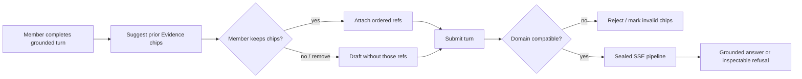
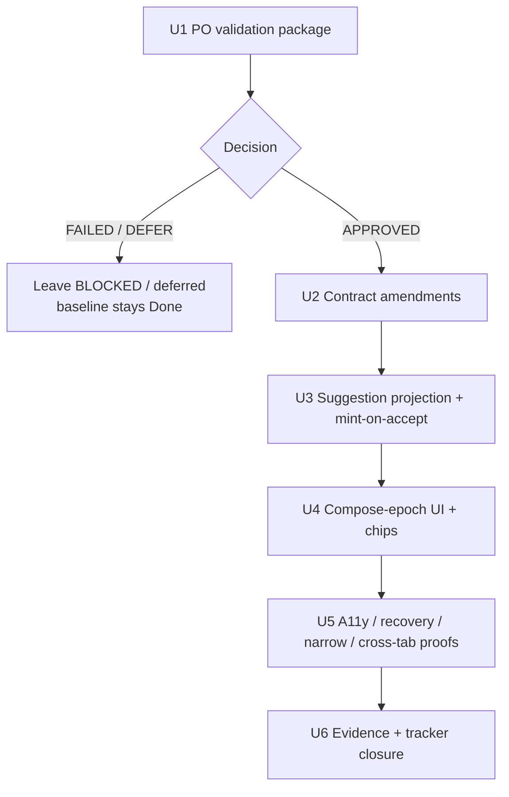
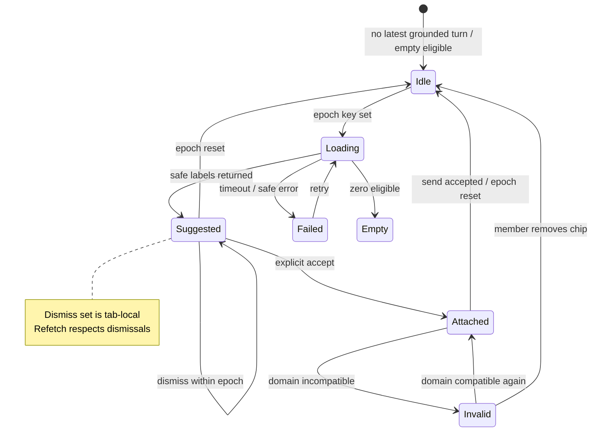

# Lean Agent Shell Umbrella / P11-04 Evidence Reattachment - Plan

## Goal Capsule

- **Objective:** Complete master-build-plan slice P11-04: record product-owner hypothesis-validation evidence for Evidence suggest-and-confirm reattachment; only on APPROVED, amend HTTP/DTO/interaction-state/component/accessibility (and related frontend) contracts and implement compose-epoch dismissals, focus/touch/announcement/recovery/narrow-layout/cross-tab rules — without weakening the sealed-chat baseline.
- **Authority:** Root `AGENTS.md`; closed Phase 1 chat capability manifest + FR-07 in `docs/prd.md`; M-02 / M-09 / M-10 / M-11 in `docs/interaction-behavior-prd.md`; HTTP/DTO catalogs under `docs/contracts/`; frontend workbench, state-ownership, interaction-state, component, accessibility, responsive, and microcopy contracts under `docs/frontend/`; this Product Contract (R6–R13); P9-04 amendment precedent; P11-01..03 evidence residuals.
- **Execution profile:** Gate-first. Unit 1 (validation decision package) may start immediately. Contract amendment and all implementation units are hard-gated on an APPROVED decision record. FAILED/DEFER leaves sealed baseline Done and suggestions unimplemented.
- **Readiness checkpoint:** Implementation-ready after 2026-07-28 scoping confirmation (gate-first; UI-over-M-09 manifest disposition; References picker residual; latest-turn candidate set).
- **Stop conditions:** Stop if DONE pressure ships suggestion UI or invents public fields before APPROVED + contract amendment; reuses eager `composer-refs:discover` minting as the unconfirmed suggestion projection; persists dismissals or syncs them across tabs; claims References picker unlock as P11-04 Done; weakens sealed SSE / grounded-terminal / workbench acceptance; introduces tools, memory stores, Wiki refs, or fat-agent controls.
- **Tail ownership:** Full browser References discover picker unlock and P12 E2E/ingress remain residuals unless a later APPROVED decision explicitly bundles them. Auto-suggest for source/template and knowledge-publication kinds stay deferred.

---

## Product Contract

### Summary

Baseline sealed SSE, grounded terminals, and the three-region workbench are already Done (P7/P9). This enrichment executes the remaining dependent Phase 1 behavior: product-owner validation first, then — only if APPROVED — contract-gated suggest-and-confirm Evidence carry-forward with compose-epoch dismissals and explicit accept before ordered composer refs.

Product Contract preservation: Product Contract unchanged (R1–R13, F1–F5, AE1–AE7, Key Decisions, Scope Boundaries three-way split preserved). Planning Contract and Implementation Units narrow execution to remaining P11-04 work; baseline R3–R5 / R9–R10 / F3–F5 / AE3–AE5 are preserved as already-satisfied constraints, not re-implemented.

### Problem Frame

Evidence carry-forward is a product hypothesis for reducing repeated manual reattachment, not a proven prerequisite for baseline chat. The server already discovers, consumes, fingerprints, and replays opaque composer refs (P11-01..03), and `/chat` already presents the sealed workbench (P9-02), but the browser still submits empty `composerRefTokens`, keeps References disabled, and has no suggestion surface. Eager discover minting is unsafe for browse-then-confirm suggestions. Shipping chips before a recorded PO validation and contract amendment would invent browser-visible behavior and risk weakening the sealed-chat baseline.

### Key Decisions

- **Approach A - staged normative completion plus a contract-gated extension.** Treat the pipeline, workbench, grounded outcomes, and M-09 attach path as completion of existing authority. Add Evidence suggestions only after those foundations pass and the public contract is approved.
- **Staged acceptance.** Core sealed-chat and workbench restoration can earn baseline acceptance independently. Evidence suggestions are a dependent Phase 1 work package and do not block that baseline.
- **Suggest, then explicitly attach.** A suggested Evidence item is not an ordered composer ref. Only an explicit member add/accept action turns it into an attached chip that can enter the turn fingerprint.
- **Domain stays per next turn.** No conversation-level domain lock. On domain change, refresh or remove unconfirmed suggestions; retain already attached incompatible refs in an invalid state, preserve the draft, and block send until the member removes them or selects a compatible domain.
- **Evidence-first suggestions.** Auto-suggest targets eligible Evidence from completed turns in the conversation. Phase 1 composer discovery remains source/evidence/template only; knowledge-publication discovery, refs, and inspection belong to the separately contracted third release phase.

### Actors

| Actor | Role in this slice |
| --- | --- |
| Member | Owns conversations; runs `domain_rag` / `direct_llm` turns; confirms suggested Evidence chips; inspects turn Evidence/Refs |
| Product owner | Approves or defers the hypothesis-validation decision that unblocks contract/UI work |
| FastAPI / TurnOrchestrator | Server-owned route, retrieve, synthesize-or-refuse, SSE projection/replay, composer-ref validation |
| Administrator | Out of primary flows for this slice (domain/source ops unchanged) |

### Key Flows

**F1 - Suggest, explicitly attach, then send.** After a completed grounded turn with eligible Evidence, the composer surfaces unconfirmed suggestions from this conversation. The member explicitly accepts or dismisses each suggestion. Only accepted items become ordered attached refs; the server consumes their one-use tokens, fingerprints them, and rejects expired, reused, incompatible, or unauthorized refs before provider work.

**F2 - Domain change preserves member intent.** When the next-turn domain changes, the UI removes or refreshes only unconfirmed suggestions. Attached incompatible refs remain visible as invalid, the draft is preserved, and send is blocked until the member resolves the incompatibility.

**F3 — Sealed turn pipeline.** Submit starts fetch-based SSE with the contracted event order and one live/resume/replay reducer. Terminal identical retry replays without retrieval/provider/composer re-entry.

**F4 — Inspectable grounded outcomes.** `no_grounded_context` and `evidence_only` are first-class terminals: no general-knowledge fallback for domain questions; inspector/transcript show safe refusal or evidence-only state, not a broken empty answer.

**F5 - Case-file workbench.** `/chat` is discovery rail + transcript/composer + turn-scoped Evidence/Refs/Source inspector. Selecting a turn atomically swaps the inspector projection (M-06). Knowledge-publication inspection is outside Phase 1.

### Requirements

**Identity and anti-sprawl**

- **R1.** `docs/prd.md#closed-phase-1-chat-capability-manifest` is the single normative owner of the member-chat capability boundary. This child plan, `AGENTS.md`, frontend microcopy, tracker tasks, and tests reference that anchor and cannot redefine or expand it.
- **R2.** No second agent/chat-RAG memory store. Continuity is durable conversations/turns, bounded prior user-question context already used at synthesis, and suggest-and-confirm composer refs — never persisted assembled prompts.

**Sealed pipeline and grounded outcomes**

- **R3.** Live, resume, and durable replay use the versioned SSE envelope and legal sequences in `docs/contracts/sse-event-catalog.md`, including `no_grounded_context` and `evidence_only` terminals; pilot `stage/token/evidence/done` is not the product contract.
- **R4.** Domain questions with no mapped Evidence refuse synthesis from general model knowledge and present an inspectable grounded-refusal outcome.
- **R5.** Identical terminal retries with the same `(conversation, client_request_id)` and server fingerprint attach/replay without another retrieval or provider call; changed effective input conflicts.

**Carry-forward**

- **R6.** After a completed grounded turn that produced currently eligible Evidence, the product may offer unconfirmed suggestions for the next compose in that conversation. A suggestion enters the ordered attached-ref set only after an explicit member add/accept action.
- **R7.** Suggestion discovery reauthorizes conversation ownership and current turn, Evidence, source, and domain eligibility before returning safe labels or opaque tokens. It excludes redacted, deleted, revoked, expired, or unavailable targets. Attached refs still obey M-09 one-use token, ordering, fingerprint, duplicate, compatibility, and pre-provider validation rules.
- **R8.** When the next-turn domain changes, unconfirmed suggestions refresh or disappear. Attached incompatible Evidence remains visible as invalid, the message draft is preserved, and send is blocked until the member removes the ref or selects a compatible domain.

**Workbench**

- **R9.** `/chat` implements the Phase 1 three-region case-file workbench: conversation discovery rail, transcript/composer primary surface, and optional turn-scoped Evidence/Refs/Source inspector bound to `selectedTurn`. No later-release inspection surface is a Phase 1 capability.
- **R10.** Closing the inspector does not clear turn/evidence selection; narrow layouts use drawers per the frontend contracts — Evidence and conversation history do not disappear.
- **R11.** Suggestion loading, empty, stale, and safe-failure states never block drafting or sending without suggestions. Failures stay local to the suggestion surface, preserve the draft, allow retry, clear invalidated items, and expose no private identifiers.
- **R12.** A dismissal applies only to the current in-memory compose epoch (conversation, selected domain, and latest completed turn) in that browser tab. Refetch within the epoch respects it; a conversation/domain change, newer completed turn, identity change/logout, or reload starts a new epoch. Dismissals are not synchronized across tabs and never enter server persistence, local storage, session storage, a composer token, or a second memory store.
- **R13.** Suggested, attached, invalid, loading, empty, stale, failure, accepted, and dismissed states have keyboard and touch operations, non-color distinctions, visible focus, deterministic focus preservation/return, bounded screen-reader announcements, error recovery, and usable 320 CSS-pixel behavior before the suggestion amendment is approved.

### Acceptance Examples

- **AE1 (R6, R7).** Given Mina completed a grounded turn with eligible Evidence E in conversation C, when suggestions load, E appears as unconfirmed. Mina explicitly accepts E, dismisses another suggestion, and sends; only E enters the ordered fingerprint, and history stores safe accepted-ref labels rather than raw tokens.
- **AE2 (R8).** Given attached Evidence from domain A, when Mina selects domain B for the next turn, the attached ref remains visible as invalid, send is blocked, and the draft remains. After Mina removes the ref, she can send without any silent cross-domain attachment.
- **AE3 (R4).** Given an eligible domain with no mapped Evidence for Q, when Mina submits a domain question, the turn completes with grounded refusal (`no_grounded_context`), inspector explains empty Evidence safely, and no general-knowledge answer appears.
- **AE4 (R3, R5).** Given a completed turn, when Mina refreshes or retries with the same client request ID and identical effective input, she sees replayed terminal projection without a second LightRAG or provider call.
- **AE5 (R1, R9).** Given `/chat` at desktop width, when Mina works a turn, she sees discovery + transcript + turn inspector without tool-approval, terminal, or model-picker controls.
- **AE6 (R7, R11, R13).** Given suggestion discovery times out or an earlier suggestion becomes redacted or unavailable, when Mina continues composing, the draft and send path remain usable without suggestions; the failure is localized and retryable, focus and announcements remain bounded, and no stale label or private identifier is disclosed.
- **AE7 (R12).** Given Mina dismisses a suggestion in one tab, when discovery refetches within the same compose epoch, it stays dismissed in that tab; a new domain, newer completed turn, identity change/logout, or reload resets the epoch, and no dismissal state appears in another tab or durable storage.

### Success Criteria

- Core sealed-chat, grounded-terminal, and workbench restoration earns baseline acceptance before Evidence suggestions are enabled.
- After the extension contract is approved and the re-attachment hypothesis is classified APPROVED, members can explicitly carry eligible prior Evidence into a later turn without making it ambient memory.
- Lean-shell identity is enforceable: closed capability manifest language lands in product authority, and forbidden fat-agent controls are absent from `/chat`.
- Sealed SSE sequences and three-region workbench match normative contracts for live, resume, and replay (no pilot-only stream shape as the ship target).
- The closed capability boundary applies to both stages; Evidence suggestions cannot introduce tools, memory stores, cross-domain attachment, or hidden context.
- A FAILED/DEFER validation leaves P11-04 deferred with sealed baseline still Done; no invented suggestion fields remain in contracts or UI.

### Scope Boundaries

#### In scope

- Product-owner hypothesis-validation decision package for P11-04
- After APPROVED: HTTP/DTO/interaction-state/component/accessibility (+ workbench/state-ownership/microcopy as required) amendments for Evidence suggestions
- Suggest-and-confirm carry-forward, compose-epoch dismissals, domain-change invalid attached chips, failure isolation, a11y/narrow/cross-tab rules
- Minimal attached-chip surface required for accepted suggestions and invalid domain chips

#### Deferred for later

- Visible Continuity Budget (public DTO for prior-question / assembly scope)
- Single-Shot Grounded Repair (`repair_attempt_count` behavior)
- Auto-suggest for source or template refs
- All knowledge-publication discovery, composer refs, inspection, and suggestions (separately contracted third release phase only)

#### Deferred to Follow-Up Work

- Browser References discover picker unlock (Sources/Evidence/Templates tabs) and E2E-M09 full picker path — residual unless a later APPROVED decision explicitly bundles it
- P12 adversarial privacy breadth, deployed-ingress drain, and full visual-matrix Playwright

#### Outside this product's identity

- Fat-agent runtime: plugins, arbitrary tools, terminal, filesystem, browser automation, tool-approval queues
- Conversation-level domain lock / Domain Thread Anchor
- Agent memory platforms or chat-RAG stores competing with domain Evidence
- WebSockets or a second streaming protocol
- Browser-selected runtime/provider/LightRAG targets
- Agent-first accept/dismiss or headless suggestion automation in Phase 1

### Dependencies / Assumptions

- Normative SSE, composer-ref, and Phase 1 three-region workbench contracts remain authority; this plan does not reopen one-domain retrieval or grounded-refusal invariants.
- The lifted `_discover_evidence` / `composer-refs:discover` path is brownfield evidence, not contract authority. It may be adapted only after the HTTP/DTO/interaction amendment defines the suggestion projection and trust boundary.
- Domain selection remains composer next-turn state (M-02), not a conversation column.
- P7-04, P9-02, and P11-03 are Done dependencies for the post-APPROVED units; Unit 1 does not require them beyond sealed-baseline honesty in the validation record.

### Outstanding Questions

**Resolve Before Planning**

_None remaining — gate-first posture and scoping defaults confirmed 2026-07-28._

**Deferred to implementation (post-APPROVED contract unit)**

- Exact microcopy strings for R13 states (must land in the contract amendment, not as ad-hoc UI copy).
- Exact DTO field names for tokenless suggestion vs mint-on-accept response shape (must be chosen in U2 and mirrored in OpenAPI/generated client).
- Ranking/cap overrides only if the APPROVED decision explicitly replaces KTD10 (citation/display order; cap 5; accept-order fingerprint).

### Sources / Research

- Ideation: `docs/ideation/2026-07-22-lean-agent-shell-ideation.html`
- Tracker: `docs/master-build-plan.md` P11-04
- Brownfield parent: `docs/plans/2026-07-22-001-docs-brownfield-phase-contract-alignment-plan.md`
- Decision-file precedent: `docs/_scratch/p6-02-evidence-contract-decision.md`
- Contract-amendment precedent: `docs/plans/2026-07-27-011-feat-settings-domain-accordion-plan.md`, `docs/_scratch/p9-04-settings-domains-{inventory,evidence}.md`
- Composer-ref foundation: `docs/plans/2026-07-27-016-feat-p11-01-composer-ref-schema-seeds-plan.md`, `docs/plans/2026-07-27-017-feat-p11-02-composer-ref-discover-consume-plan.md`, `docs/plans/2026-07-27-018-feat-p11-03-assembly-fingerprint-replay-plan.md`; scratch artifacts `docs/_scratch/p11-01-composer-ref-schema-{inventory,evidence}.md`, `docs/_scratch/p11-02-composer-ref-discover-consume-evidence.md`, `docs/_scratch/p11-03-assembly-fingerprint-replay-evidence.md`
- Chat workbench: `docs/plans/2026-07-27-009-feat-chat-workbench-reducer-plan.md`, `docs/_scratch/p9-02-chat-workbench-evidence.md`
- Authority: `AGENTS.md`; `docs/prd.md#closed-phase-1-chat-capability-manifest`; interaction cases M-02/M-09/M-10/M-11; HTTP/DTO catalogs; `docs/frontend/chat-and-evidence-workbench.md`, `frontend-state-ownership.md`, `interaction-state-catalog.md`, `accessibility-contract.md`

---

## Planning Contract

### Key Technical Decisions

- KTD1. **Gate-first execution.** Unit 1 produces a recorded PO validation decision. Units U2–U6 must not amend contracts or ship UI until Status is APPROVED. FAILED/DEFER closes the slice as deferred without inventing fields. (session-settled: user-approved — chosen over pausing all planning or assuming approval already exists: matches master-build-plan P11-04 wording)
- KTD2. **Manifest disposition = UI over FR-07/M-09.** APPROVED must state that suggestions are a confirm-gated composer UI over existing governed-ref attach authority, not a new competing closed-capability bullet and not a tool/memory expansion. Optional one-line PRD clarify is allowed only if it preserves the sole-manifest rule and does not add tools/plugins/agent surfaces. (session-settled: user-approved — chosen over adding a new capability-manifest bullet by default: avoids competing lists)
- KTD3. **Unconfirmed suggestions must not use eager token mint.** Contract amendment requires a tokenless (or mint-on-accept) suggestion projection. Reusing `POST /composer-refs:discover` unchanged for browse/refetch burns one-use tokens and contradicts R6. Chosen over adapting discover without mint-rule change.
- KTD4. **Candidate set = latest completed grounded turn.** Suggestions draw from eligible Evidence on the conversation’s latest completed grounded turn for the selected next-turn domain (exclude redacted/unavailable). Broader multi-turn conversation browse stays out unless a later contract amend expands it. (session-settled: user-approved — chosen over all conversation+domain Evidence: matches compose-epoch “latest completed turn” key)
- KTD5. **References picker remains a residual.** P11-04 implements the minimal attached-chip surface for accepted suggestions + invalid domain chips + send block; it does not unlock Sources/Evidence/Templates picker tabs or flip “References unavailable” unless a later APPROVED decision bundles that work. (session-settled: user-approved — chosen over bundling full picker unlock: keeps P11-02/03 residual honest)
- KTD6. **Compose-epoch dismissals are tab memory only.** Key = `(conversationId, selectedDomainId|direct, latestCompletedTurnId)`. Store dismissed suggestion ids in feature tab state only; never localStorage/sessionStorage/server/composer token. Cross-tab divergence is expected; server one-use rules resolve accept races.
- KTD7. **Extend chat-shell; do not invent a parallel feature tree.** Build on `app/client/src/features/chat-shell/*`, inspector generation fences, and existing turn-start consume/fingerprint. Flip `app/client/tests/chat.test.mjs` empty-token/disabled-picker gates only for surfaces this slice contracts.
- KTD8. **Member-only accept/dismiss.** No agent/tool actor for suggestion lifecycle in Phase 1. Agent-native access is out of product identity.
- KTD9. **P9-04 + P6-02 artifact shapes.** Use `docs/_scratch/p6-02-evidence-contract-decision.md` for the validation record and `p9-04-settings-domains-{inventory,evidence}.md` for post-APPROVED inventory → amendment → evidence.
- KTD10. **Default ranking and cap (contract must pin).** Within the latest grounded turn, order suggestions by existing turn Evidence citation/display order; hard cap **5** visible suggestions (remainder omitted, not “load more”). Multi-accept order = member accept order (participates in fingerprint). U2 may tighten but must not leave ranking/cap to implementer invention.
- KTD11. **Accept = mint + attach in one gesture.** Explicit accept calls the mint-on-accept path and appends the chip; there is no separate “confirm mint” step. Failed mint leaves the item suggested (or failed) and does not partially attach.

### High-Level Technical Design

#### Gate and delivery sequence

#### Compose-epoch state machine (directional)

Epoch resets on conversation change, selected-domain change, newer completed turn, identity/logout, or full reload. Refetch inside the same epoch filters dismissed ids client-side.

### Assumptions

_None — scoping call-outs were confirmed via continue on 2026-07-28 defaults and recorded as labeled KTDs._

### Implementation Constraints

- Do not invent browser-visible fields absent from approved contracts (AGENTS stop #1).
- Do not persist assembled prompts, raw tokens, or dismissal state.
- Suggestion failure must not block draft/send without suggestions.
- Public errors stay on closed vocabulary; no private IDs in UI chrome, storage, fixtures, or announcements.
- Characterization tests in `chat.test.mjs` currently encode the pre-P11-04 gate; update only after contracted unlock for the surfaces this slice owns.

### Sequencing

1. U1 validation package (unblocked now).
2. Hard gate: APPROVED required.
3. U2 contracts → U3 backend projection → U4 chat-shell UI → U5 proofs → U6 evidence/trackers.
4. If FAILED/DEFER after U1: skip U2–U5; U6 records deferral evidence and tracker residual honesty only.

---

## Implementation Units

### U1. Product-owner validation decision package

**Goal:** Produce a recorded hypothesis-validation decision that either APPROVES P11-04 contract/UI work or FAILED/DEFERs suggestions without touching sealed baseline.

**Requirements:** R1, R2, Success Criteria staged acceptance; master-build-plan P11-04 gate; KTD1, KTD2

**Dependencies:** None

**Files:**
- Create: `docs/_scratch/p11-04-evidence-reattachment-validation.md` (decision record)
- Create: `docs/_scratch/p11-04-evidence-reattachment-inventory.md` (readiness inventory only; no contract edits)
- Modify (pointer only, after decision): `docs/master-build-plan.md` P11-04 row status note if process requires interim annotation — prefer leaving BLOCKED until U6

**Approach:**
- Follow `docs/_scratch/p6-02-evidence-contract-decision.md` shape: Status, Approved/Failed decision, Rejected alternative, Blocking contradiction / evidence sections.
- Required evidence axes (all three must be addressed):
  1. Repeated Evidence reattachment need (observed pain or explicit PO statement that the hypothesis is worth the contract risk).
  2. Comprehension of explicit accept/dismiss (member must opt in; dismiss is epoch-local; suggestion ≠ attach).
  3. No pressure to weaken sealed-chat baseline (suggestions cannot block SSE/grounded-terminal/workbench acceptance; FAILED leaves baseline Done).
- Record KTD2 manifest disposition explicitly in the APPROVED text (UI over FR-07/M-09).
- Inventory may list contract files to amend and brownfield gaps (eager mint, no suggestion states) but must not edit contracts.

**Execution note:** This unit is documentation/product-gate only. Do not amend HTTP/DTO/frontend contracts or unlock UI here.

**Patterns to follow:** `docs/_scratch/p6-02-evidence-contract-decision.md`; umbrella Open blockers; master-build-plan P11-04 wording.

**Test scenarios:**
- Happy path: Decision file exists with Status APPROVED or FAILED/DEFER, all three evidence axes filled, rejected alternative named, manifest disposition stated when APPROVED.
- Edge: Partial evidence (missing an axis) → Status cannot be APPROVED.
- Error: Attempt to start U2 without APPROVED → stop condition fires; no contract diffs.

**Verification:** Decision file is reviewable; U2 checklist refuses to proceed without Status APPROVED.

---

### U2. Contract amendments after APPROVED

**Goal:** Normatively define suggestion eligibility, ordering/cap, confirmation, compose-epoch dismissal, focus/keyboard/touch, bounded announcements, recovery, narrow-layout, and cross-tab rules — plus HTTP/DTO trust boundary for tokenless / mint-on-accept projection.

**Requirements:** R6–R8, R11–R13, AE1, AE2, AE6, AE7; KTD2–KTD6

**Dependencies:** U1 Status APPROVED

**Files:**
- Modify: `docs/contracts/http-api-catalog.md`
- Modify: `docs/contracts/dto-schema-catalog.md`
- Modify: `docs/frontend/chat-and-evidence-workbench.md`
- Modify: `docs/frontend/frontend-state-ownership.md`
- Modify: `docs/frontend/interaction-state-catalog.md`
- Modify: `docs/frontend/component-contracts.md`
- Modify: `docs/frontend/accessibility-contract.md`
- Modify: `docs/frontend/content-and-microcopy.md`
- Modify: `docs/frontend/responsive-and-desktop-matrix.md` (if narrow suggestion surface needs an explicit row)
- Modify (only if KTD2 clarify requires): `docs/prd.md` closed-capability section — non-expansive clarify only
- Modify (if interaction case needed): `docs/interaction-behavior-prd.md` (new or extended M-* case for suggest/dismiss/epoch; do not redefine M-09 attach)
- Update: `docs/_scratch/p11-04-evidence-reattachment-inventory.md` amendment checklist

**Approach:**
- Mirror P9-04 inventory → amend → checklist discipline.
- HTTP/DTO: define suggestion projection that returns safe labels + stable suggestion keys without minting one-use tokens until accept; define accept → token issuance (or equivalent) that then feeds existing turn-start `composerRefTokens` consume/fingerprint.
- Eligibility: latest completed grounded turn; exclude redacted/deleted/unavailable; domain-compatible with next-turn selection.
- Interaction-state rows for suggested / attached / invalid / loading / empty / stale / failure / accepted / dismissed.
- Accessibility: keyboard + touch targets, non-color state, focus preserve/return, one polite live-region budget for suggestion lifecycle (not token stream), 320 CSS-px usable.
- State ownership: compose-epoch dismiss set as tab memory; explicit non-sync across tabs; clear on identity epoch.
- Ranking/cap: pin KTD10 in the contract (citation/display order; cap 5; accept-order fingerprint).
- Interaction case: extend or add an M-* case for suggest/dismiss/epoch that references AE1/AE6/AE7 without redefining M-09 consume rules.

**Execution note:** Prefer contract-first reviewable diff; regenerate OpenAPI/client only in U3 when routes/schemas are implemented.

**Patterns to follow:** P9-04 amendment set; workbench chip/invalid-draft language already present for attached refs; accessibility live-region bounds already used for stream stages.

**Test scenarios:**
- Happy path: Amendment checklist marks every required contract file; suggestion states named; mint-on-accept / tokenless rule explicit; compose-epoch key and cross-tab non-sync explicit.
- Edge: PRD clarify (if any) still points to sole manifest anchor and adds no tool/plugin language.
- Error: Any public field absent from catalogs → rejected; no Wiki/publication kinds introduced.
- Integration: Contract text states accepted suggestions enter existing M-09 turn-start path unchanged for consume/fingerprint.

**Verification:** Inventory checklist complete; no implementation UI merged in this unit; APPROVED decision cited at top of inventory.

---

### U3. Backend suggestion projection and mint-on-accept

**Goal:** Implement the contracted suggestion projection and accept/mint path so unconfirmed browse does not consume one-use tokens; accepted tokens remain valid for existing turn-start consume/fingerprint.

**Requirements:** R6, R7, AE1, AE6; KTD3, KTD4

**Dependencies:** U2

**Files:**
- Modify: `app/context_engine/services/composer_refs.py` (and related repositories as needed)
- Modify: `app/context_engine/api/routes.py` (thin handlers only)
- Modify: generated OpenAPI / client artifacts as required by repo contract generation flow
- Create/Modify tests: `app/tests/test_composer_refs_suggest_*.py` (name to match repo convention)
- Modify seeds/fixtures only if U2 requires suggestion demo rows: `app/context_engine/dev/seed_composer_refs.py`, `docs/quality/seeded-demo-and-test-data.md`

**Approach:**
- Add contracted suggest endpoint or discover mode that returns safe labels + suggestion keys without setting `consumed`-ready one-use tokens for mere listing.
- Accept path mints short-lived opaque token bound to the same authorization checks as M-09 evidence refs.
- Reauthorize ownership, domain eligibility, and target availability on suggest and on accept.
- Keep turn-start consume/fingerprint/replay behavior from P11-02/03 unchanged for minted tokens.
- Map failures to closed error codes only.

**Execution note:** Start with failing HTTP contract tests for tokenless list + mint-on-accept + denial matrix before production edits.

**Patterns to follow:** `discover_composer_refs` / `_discover_evidence` / `_issue_ref_token` / `_safe_result`; P11-02 HTTP contract tests; privacy classification rules.

**Test scenarios:**
- Happy path: Suggest after grounded turn returns eligible latest-turn Evidence labels without creating consumable tokens; accept returns a token that turn-start consumes once.
- Edge: Empty eligible set → empty suggestions; redacted/unavailable targets excluded; domain mismatch excluded.
- Error: Other member’s conversation → same 404 shape; expired/unauthorized accept → closed error; listing does not burn one-use inventory.
- Integration: After accept+send, fingerprint/replay behavior matches P11-03 (identical attach does not reconsume).

**Verification:** New HTTP/service tests green; existing discover browse (if still present for picker residual) does not silently become the suggestion API without mint-rule compliance.

---

### U4. Chat-shell compose-epoch UI

**Goal:** Surface unconfirmed suggestions, explicit accept/dismiss, ordered attached chips (including invalid domain state), and wire accepted tokens into turn-start — without unlocking the full References picker.

**Requirements:** R6, R8, R11, R12, AE1, AE2, AE6, AE7; KTD5–KTD7

**Dependencies:** U3

**Files:**
- Modify: `app/client/src/features/chat-shell/ChatShell.tsx`
- Modify: `app/client/src/features/chat-shell/use-chat-shell.ts`
- Modify: `app/client/src/features/chat-shell/api.ts`
- Modify (as needed): `app/client/src/features/chat-shell/EvidencePanel.tsx` (no auto-attach from inspector)
- Modify: `app/client/tests/chat.test.mjs`
- Create/Modify: `app/client/tests/chat-suggestions*.test.tsx` (or equivalent RTL suite)

**Approach:**
- Track compose-epoch key and dismissed suggestion id set in tab memory.
- Fetch suggestions with generation fence (mirror inspector generation discard).
- Accept → append ordered attached chip with minted token; dismiss → epoch-local hide.
- Domain change: clear/refresh unconfirmed suggestions; mark incompatible attached chips invalid; preserve draft; block send until resolved.
- Submit includes ordered accepted tokens only (not dismissed/unaccepted suggestions).
- Keep References picker disabled/unavailable per KTD5; do not call legacy discover from the picker.
- Clear epoch + dismissals + tokens on identity/logout; do not write dismissals to web storage.

**Patterns to follow:** Existing draft retention until `turn.accepted`; inspector `generation` fence; workbench invalid-selection rules; disabled `ref-picker` residual honesty.

**Test scenarios:**
- Covers AE1. Accept one + dismiss one → only accepted token submitted; safe labels in history path unchanged server-side.
- Covers AE2. Domain switch leaves invalid attached chip, blocks send, preserves draft; remove chip → send allowed.
- Covers AE6. Suggestion fetch failure leaves composer/send usable; retry restores suggestions without private ids.
- Covers AE7. Dismiss then in-epoch refetch hides item; new epoch (domain/turn/reload) can show it again; no storage keys for dismissals.
- Edge: Empty suggestions → empty state, draft still works; accept order preserved in fingerprint inputs.
- Error: Stale generation response discarded; identity change clears suggestion/attached tab state.
- Integration: Characterization tests updated only for contracted suggestion/chip surfaces; picker remains unavailable.

**Verification:** RTL/unit coverage for epoch/accept/dismiss/domain-invalid; manual smoke that sealed send path still works with zero suggestions.

---

### U5. Accessibility, recovery, narrow layout, cross-tab proofs

**Goal:** Prove R13 interaction matrix and R12 cross-tab non-sync for suggestion states against the amended accessibility/responsive contracts.

**Requirements:** R10, R11, R12, R13, AE6, AE7; KTD6

**Dependencies:** U4

**Files:**
- Modify/Create: frontend a11y/RTL tests under `app/client/tests/` (suggestion focus/announce/touch)
- Modify if needed: parity fixtures only when catalog requires static appearance — prefer React tests for behavior
- Update: `docs/_scratch/p11-04-evidence-reattachment-inventory.md` proof matrix rows

**Approach:**
- Cover keyboard accept/dismiss/remove, visible focus return, non-color state, 24/44 touch targets, bounded polite announcements (no stream-token spam), recovery after failure, 320 CSS-px composer usability with suggestion strip, drawer substitution preserving draft/chips.
- Cross-tab: two tabs same conversation — dismiss in A does not dismiss in B; neither writes storage; accept race resolved by server one-use rules.
- Reduced-motion: no essential information only in motion.

**Execution note:** Prefer component/RTL proofs in this slice; full Playwright visual matrix remains P12 unless already cheap locally.

**Patterns to follow:** `docs/frontend/accessibility-contract.md` live-region budget; P9-02 privacy (no tokens in storage); responsive drawer rules.

**Test scenarios:**
- Happy path: Keyboard-only accept + dismiss + send; announcement fires once per lifecycle transition, not per refetch noise.
- Edge: 320px width keeps accept/dismiss reachable without horizontal viewport push; inspector drawer does not clear chips.
- Error: Failure state announces safely and offers retry without trapping focus.
- Integration: Tab B still shows a suggestion dismissed in Tab A within the same epoch; no `localStorage`/`sessionStorage` keys for dismissals or raw tokens.

**Verification:** A11y/RTL suite green; inventory matrix rows checked for R13 states.

---

### U6. Evidence record and tracker closure

**Goal:** Publish honest completion or deferral evidence for P11-04 and update trackers without over-claiming References unlock or weakening baseline.

**Requirements:** Success Criteria; KTD1, KTD5; residual honesty

**Dependencies:** U1; if APPROVED then U2–U5 else skip to deferral evidence

**Files:**
- Create: `docs/_scratch/p11-04-evidence-reattachment-evidence.md`
- Modify: `docs/master-build-plan.md` P11-04 status
- Modify: `docs/brownfield-refactor-register.md` residual row if it names P11-04
- Modify as needed: `docs/_scratch/p11-03-assembly-fingerprint-replay-evidence.md` residual pointers (honesty only)

**Approach:**
- APPROVED path: evidence lists commands, AE mapping (AE1/AE2/AE6/AE7), privacy scans (no tokens/dismissals in storage/logs), contract sync, residuals (References picker, P12 E2E).
- FAILED/DEFER path: evidence cites validation decision, confirms no contract/UI suggestion fields shipped, baseline remains Done, tracker stays deferred/BLOCKED with reason.
- Never mark References picker unlock Done from this slice under KTD5.

**Patterns to follow:** `docs/_scratch/p11-03-assembly-fingerprint-replay-evidence.md`; `docs/quality/definition-of-done.md`.

**Test scenarios:**
- Happy path (APPROVED): Evidence file maps AE1/AE2/AE6/AE7 to tests; tracker P11-04 Done; residuals named.
- Happy path (DEFER): Evidence file maps to validation FAILED/DEFER; tracker not Done; no suggestion DTO fields in catalogs.
- Edge: Partial implementation without evidence → not Done.

**Verification:** Tracker and evidence agree; sealed-baseline acceptance language unchanged.

---

## Verification Contract

| Gate | What proves it |
| --- | --- |
| Product gate | `docs/_scratch/p11-04-evidence-reattachment-validation.md` Status APPROVED before any U2+ merge |
| Contracts | U2 checklist complete; HTTP/DTO/frontend docs name suggestion projection, compose-epoch, a11y matrix |
| Backend | Suggest list does not mint consumable tokens; accept mints; turn-start consume/fingerprint/replay still pass P11-03 suite |
| Frontend | Chat suggestion RTL + updated characterization tests; picker remains unavailable |
| A11y / epoch | R13 keyboard/touch/announce/recovery/320px + AE7 cross-tab non-sync proofs |
| Privacy | No raw tokens, dismissals, or private ids in storage, UI chrome, or fixtures |
| Tracker | P11-04 evidence + master-build-plan row; residuals honest |

Interaction cases: map new tests to M-02 / M-09 and any U2-added suggest/dismiss case IDs; keep AE1/AE2/AE6/AE7 in evidence.

Root verification / `release:validate` applies when the repo gate includes frontend+API for this slice; otherwise document boundary reason in evidence (Compose-only / unit subset) without claiming P12 ingress Done.

---

## Definition of Done

### Global

- [ ] U1 decision recorded with all three PO evidence axes
- [ ] If FAILED/DEFER: no suggestion contract/UI shipped; baseline remains Done; evidence explains deferral
- [ ] If APPROVED: U2–U6 complete; AE1/AE2/AE6/AE7 proven; R13 matrix covered
- [ ] Eager discover is not the unconfirmed suggestion projection
- [ ] Dismissals are tab-local compose-epoch only (no storage/server sync)
- [ ] References picker unlock not claimed Done
- [ ] Closed capability manifest remains sole owner; no fat-agent controls
- [ ] Abandoned experiment code removed from the diff
- [ ] Evidence artifact + tracker updated

### Per unit

| Unit | Done when |
| --- | --- |
| U1 | Validation file has Status + three axes + manifest disposition (if APPROVED) |
| U2 | Amendment checklist complete; mint-on-accept / epoch / a11y rules normative |
| U3 | HTTP/service tests prove tokenless list + mint-on-accept + denials |
| U4 | Suggest/accept/dismiss/invalid-domain UI + tests; picker still residual |
| U5 | A11y/narrow/cross-tab proofs green |
| U6 | Evidence + tracker honesty for Done or Defer |

---

## System-Wide Impact

- **Members:** Optional composer convenience after grounded turns; draft/send never depends on suggestions.
- **Contracts / generated clients:** HTTP/DTO churn only after APPROVED; regenerate in lockstep.
- **Privacy:** New temptation surface for token leakage in tab state — keep tokens out of storage/logs; dismissals memory-only.
- **P12:** Cross-tab and a11y proofs here reduce later E2E scope but do not replace deployed-ingress acceptance.
- **Agent surface:** None — accept/dismiss remain human-only (KTD8).

---

## Risks & Dependencies

| Risk | Mitigation |
| --- | --- |
| PO never APPROVES | U1 FAILED/DEFER path is a successful plan outcome; baseline stays Done |
| Eager mint reused under schedule pressure | KTD3 + U3 tests that listing creates no consumable tokens |
| Manifest / competing capability list | KTD2 recorded in APPROVED text; PRD clarify non-expansive only |
| Scope creep into References picker | KTD5 residual; characterization tests keep picker unavailable |
| Cross-tab accept race | Server one-use consume; no BroadcastChannel dismissal sync |
| Weak PO evidence rubber-stamps APPROVED | U1 refuses APPROVED unless all three axes are filled; reviewers treat missing axis as FAILED |
| Cap/ranking bikeshed blocks U2 | KTD10 default (order + cap 5) is normative unless APPROVED decision explicitly overrides |

---

## Dependencies / Prerequisites

- Done: P7-04 sealed SSE, P9-02 chat workbench, P11-01..03 composer-ref schema/discover/consume/fingerprint
- Blocking for U2+: U1 APPROVED decision file
- Residual: browser References picker unlock; P12 E2E/ingress
