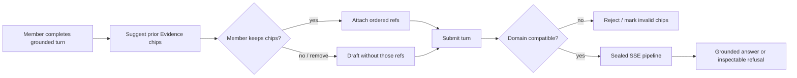

# Lean Agent Shell Umbrella - Plan

## Goal Capsule

**Objective.** Deliver Context Engine `/chat` as a dependency-ordered Phase 1 child contract: first restore the sealed turn pipeline, three-region case-file workbench, inspectable grounded outcomes, and closed capability manifest; then add contract-gated, suggest-and-confirm Evidence carry-forward without turning the product into a fat agent.

**Product authority.** `AGENTS.md`, `docs/prd.md`, `docs/interaction-behavior-prd.md` (esp. M-02, M-03, M-06, M-09, M-11), `docs/contracts/sse-event-catalog.md`, `docs/contracts/http-api-catalog.md`, `docs/frontend/chat-and-evidence-workbench.md`, plus this Product Contract for the net-new suggest-chip behavior.

**Brownfield parent.** `docs/plans/2026-07-22-001-docs-brownfield-phase-contract-alignment-plan.md` owns sequencing, disposition, and completion evidence. This child contract is subordinate to the PRD and versioned HTTP/DTO/SSE contracts; it cannot independently authorize an endpoint, DTO, event, ref kind, persistence model, or a different Phase 1/2/3 boundary.

**Open blockers.** Evidence suggestions cannot enter implementation until a product owner approves a recorded hypothesis-validation decision and the HTTP/DTO/interaction/accessibility contracts define discovery eligibility, ordering, cap, confirmation, dismissal lifecycle, focus/keyboard/touch behavior, bounded announcements, and recovery semantics. A failed validation defers suggestions without blocking the core. Core SSE, grounded-terminal, and workbench restoration remains independently acceptable and must land first.

## Product Contract

### Summary

Restore the already-approved sealed SSE turn pipeline, three-region case-file workbench, and grounded-outcome terminals as the core brownfield chat baseline. Then add one dependent Phase 1 behavior: after a grounded turn, offer eligible prior-turn Evidence as unconfirmed composer suggestions that the member explicitly accepts before send. Bind both stages with a closed capability manifest.

### Problem Frame

The lifted chat implementation still drifts from the approved sealed pipeline and case-file workbench. Evidence carry-forward is a product hypothesis for reducing repeated manual attachment, not a proven prerequisite for baseline repair; it must be validated and contracted without introducing a second memory store or a Local Studio-style tool agent.

### Key Decisions

- **Approach A - staged normative completion plus a contract-gated extension.** Treat the pipeline, workbench, grounded outcomes, and M-09 attach path as completion of existing authority. Add Evidence suggestions only after those foundations pass and the public contract is approved.
- **Staged acceptance.** Core sealed-chat and workbench restoration can earn baseline acceptance independently. Evidence suggestions are a dependent Phase 1 work package and do not block that baseline.
- **Suggest, then explicitly attach.** A suggested Evidence item is not an ordered composer ref. Only an explicit member add/accept action turns it into an attached chip that can enter the turn fingerprint.
- **Domain stays per next turn.** No conversation-level domain lock. On domain change, refresh or remove unconfirmed suggestions; retain already attached incompatible refs in an invalid state, preserve the draft, and block send until the member removes them or selects a compatible domain.
- **Evidence-first suggestions.** Auto-suggest targets eligible Evidence from completed turns in the conversation. Phase 1 composer discovery remains source/evidence/template only; knowledge-publication discovery, refs, and inspection belong to the separately contracted third release phase.

### Actors

| Actor | Role in this slice |
| --- | --- |
| Member | Owns conversations; runs `domain_rag` / `direct_llm` turns; confirms suggested Evidence chips; inspects turn Evidence/Refs |
| FastAPI / TurnOrchestrator | Server-owned route, retrieve, synthesize-or-refuse, SSE projection/replay, composer-ref validation |
| Administrator | Out of primary flows for this slice (domain/source ops unchanged) |

### Key Flows

**F1 - Suggest, explicitly attach, then send.** After a completed grounded turn with eligible Evidence, the composer surfaces unconfirmed suggestions from this conversation. The member explicitly accepts or dismisses each suggestion. Only accepted items become ordered attached refs; the server consumes their one-use tokens, fingerprints them, and rejects expired, reused, incompatible, or unauthorized refs before provider work.

**F2 - Domain change preserves member intent.** When the next-turn domain changes, the UI removes or refreshes only unconfirmed suggestions. Attached incompatible refs remain visible as invalid, the draft is preserved, and send is blocked until the member resolves the incompatibility.

**F3 — Sealed turn pipeline.** Submit starts fetch-based SSE with the contracted event order and one live/resume/replay reducer. Terminal identical retry replays without retrieval/provider/composer re-entry.

**F4 — Inspectable grounded outcomes.** `no_grounded_context` and `evidence_only` are first-class terminals: no general-knowledge fallback for domain questions; inspector/transcript show safe refusal or evidence-only state, not a broken empty answer.

**F5 - Case-file workbench.** `/chat` is discovery rail + transcript/composer + turn-scoped Evidence/Refs/Source inspector. Selecting a turn atomically swaps the inspector projection (M-06). Knowledge-publication inspection is outside Phase 1.

### Requirements

**Identity and anti-sprawl**

- **R1.** `docs/prd.md#closed-phase-1-chat-capability-manifest` is the single normative owner of the member-chat capability boundary. This child plan, `AGENTS.md`, frontend microcopy, tracker tasks, and tests reference that anchor and cannot redefine or expand it.
- **R2.** No second agent/chat-RAG memory store. Continuity is durable conversations/turns, bounded prior user-question context already used at synthesis, and suggest-and-confirm composer refs — never persisted assembled prompts.

**Sealed pipeline and grounded outcomes**

- **R3.** Live, resume, and durable replay use the versioned SSE envelope and legal sequences in `docs/contracts/sse-event-catalog.md`, including `no_grounded_context` and `evidence_only` terminals; pilot `stage/token/evidence/done` is not the product contract.
- **R4.** Domain questions with no mapped Evidence refuse synthesis from general model knowledge and present an inspectable grounded-refusal outcome.
- **R5.** Identical terminal retries with the same `(conversation, client_request_id)` and server fingerprint attach/replay without another retrieval or provider call; changed effective input conflicts.

**Carry-forward**

- **R6.** After a completed grounded turn that produced currently eligible Evidence, the product may offer unconfirmed suggestions for the next compose in that conversation. A suggestion enters the ordered attached-ref set only after an explicit member add/accept action.
- **R7.** Suggestion discovery reauthorizes conversation ownership and current turn, Evidence, source, and domain eligibility before returning safe labels or opaque tokens. It excludes redacted, deleted, revoked, expired, or unavailable targets. Attached refs still obey M-09 one-use token, ordering, fingerprint, duplicate, compatibility, and pre-provider validation rules.
- **R8.** When the next-turn domain changes, unconfirmed suggestions refresh or disappear. Attached incompatible Evidence remains visible as invalid, the message draft is preserved, and send is blocked until the member removes the ref or selects a compatible domain.

**Workbench**

- **R9.** `/chat` implements the Phase 1 three-region case-file workbench: conversation discovery rail, transcript/composer primary surface, and optional turn-scoped Evidence/Refs/Source inspector bound to `selectedTurn`. No later-release inspection surface is a Phase 1 capability.
- **R10.** Closing the inspector does not clear turn/evidence selection; narrow layouts use drawers per the frontend contracts — Evidence and conversation history do not disappear.
- **R11.** Suggestion loading, empty, stale, and safe-failure states never block drafting or sending without suggestions. Failures stay local to the suggestion surface, preserve the draft, allow retry, clear invalidated items, and expose no private identifiers.
- **R12.** A dismissal applies only to the current in-memory compose epoch (conversation, selected domain, and latest completed turn) in that browser tab. Refetch within the epoch respects it; a conversation/domain change, newer completed turn, identity change/logout, or reload starts a new epoch. Dismissals are not synchronized across tabs and never enter server persistence, local storage, session storage, a composer token, or a second memory store.
- **R13.** Suggested, attached, invalid, loading, empty, stale, failure, accepted, and dismissed states have keyboard and touch operations, non-color distinctions, visible focus, deterministic focus preservation/return, bounded screen-reader announcements, error recovery, and usable 320 CSS-pixel behavior before the suggestion amendment is approved.

### Acceptance Examples

- **AE1 (R6, R7).** Given Mina completed a grounded turn with eligible Evidence E in conversation C, when suggestions load, E appears as unconfirmed. Mina explicitly accepts E, dismisses another suggestion, and sends; only E enters the ordered fingerprint, and history stores safe accepted-ref labels rather than raw tokens.
- **AE2 (R8).** Given attached Evidence from domain A, when Mina selects domain B for the next turn, the attached ref remains visible as invalid, send is blocked, and the draft remains. After Mina removes the ref, she can send without any silent cross-domain attachment.
- **AE3 (R4).** Given an eligible domain with no mapped Evidence for Q, when Mina submits a domain question, the turn completes with grounded refusal (`no_grounded_context`), inspector explains empty Evidence safely, and no general-knowledge answer appears.
- **AE4 (R3, R5).** Given a completed turn, when Mina refreshes or retries with the same client request ID and identical effective input, she sees replayed terminal projection without a second LightRAG or provider call.
- **AE5 (R1, R9).** Given `/chat` at desktop width, when Mina works a turn, she sees discovery + transcript + turn inspector without tool-approval, terminal, or model-picker controls.
- **AE6 (R7, R11, R13).** Given suggestion discovery times out or an earlier suggestion becomes redacted or unavailable, when Mina continues composing, the draft and send path remain usable without suggestions; the failure is localized and retryable, focus and announcements remain bounded, and no stale label or private identifier is disclosed.
- **AE7 (R12).** Given Mina dismisses a suggestion in one tab, when discovery refetches within the same compose epoch, it stays dismissed in that tab; a new domain, newer completed turn, identity change/logout, or reload resets the epoch, and no dismissal state appears in another tab or durable storage.

### Success Criteria

- Core sealed-chat, grounded-terminal, and workbench restoration earns baseline acceptance before Evidence suggestions are enabled.
- After the extension contract is approved and the re-attachment hypothesis is validated, members can explicitly carry eligible prior Evidence into a later turn without making it ambient memory.
- Lean-shell identity is enforceable: closed capability manifest language lands in product authority, and forbidden fat-agent controls are absent from `/chat`.
- Sealed SSE sequences and three-region workbench match normative contracts for live, resume, and replay (no pilot-only stream shape as the ship target).
- The closed capability boundary applies to both stages; Evidence suggestions cannot introduce tools, memory stores, cross-domain attachment, or hidden context.

### Scope Boundaries

**In scope**

- Sealed turn pipeline (contract SSE + reducer)
- Three-region case-file workbench
- Inspectable `no_grounded_context` / `evidence_only` outcomes
- Closed capability manifest (product identity gate)
- Evidence suggest-and-confirm carry-forward + domain-change chip invalidation

**Deferred for later**

- Visible Continuity Budget (public DTO for prior-question / assembly scope)
- Single-Shot Grounded Repair (`repair_attempt_count` behavior)
- Auto-suggest for source or template refs
- All knowledge-publication discovery, composer refs, inspection, and suggestions (separately contracted third release phase only)

**Outside this product's identity**

- Fat-agent runtime: plugins, arbitrary tools, terminal, filesystem, browser automation, tool-approval queues
- Conversation-level domain lock / Domain Thread Anchor
- Agent memory platforms or chat-RAG stores competing with domain Evidence
- WebSockets or a second streaming protocol
- Browser-selected runtime/provider/LightRAG targets

### Dependencies / Assumptions

- Normative SSE, composer-ref, and Phase 1 three-region workbench contracts remain authority; this plan does not reopen one-domain retrieval or grounded-refusal invariants.
- The lifted `_discover_evidence` / `composer-refs:discover` path is brownfield evidence, not contract authority. It may be adapted only after the HTTP/DTO/interaction amendment defines the suggestion projection and trust boundary.
- Domain selection remains composer next-turn state (M-02), not a conversation column.

### Outstanding Questions

**Resolve Before Planning**

_None._

**Deferred to Planning**

- Deterministic suggestion ranking and cap after the contract sets the eligible candidate set.
- Exact microcopy for the R13 states; focus, keyboard/touch, announcement, recovery, and narrow-layout behavior are contract prerequisites rather than deferred implementation choices.
- Consumer documents and tests must retain a direct reference to `docs/prd.md#closed-phase-1-chat-capability-manifest`; none may redefine the set.
- Implementation/demo sequencing across the parent plan's P7, P9, and P11 work packages, preserving the baseline-first dependency.

### Sources / Research

- Ideation: `docs/ideation/2026-07-22-lean-agent-shell-ideation.html` (ideas #1–#5 umbrella)
- Authority: `AGENTS.md`; `docs/interaction-behavior-prd.md` M-02/M-03/M-06/M-09; `docs/contracts/sse-event-catalog.md`; `docs/contracts/http-api-catalog.md`; `docs/frontend/chat-and-evidence-workbench.md`; `docs/architecture/production-adaptation-blueprint.md`
