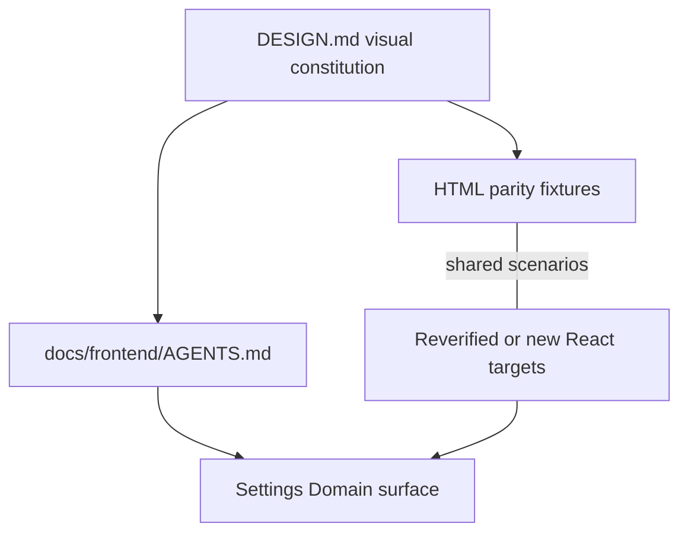
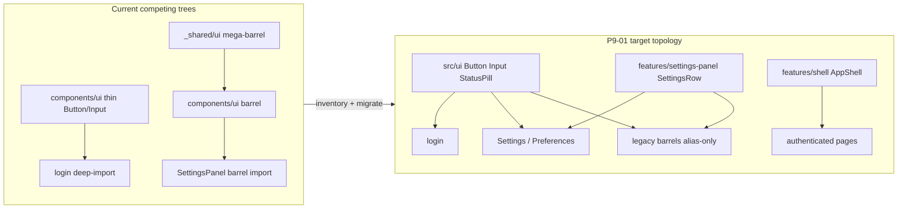
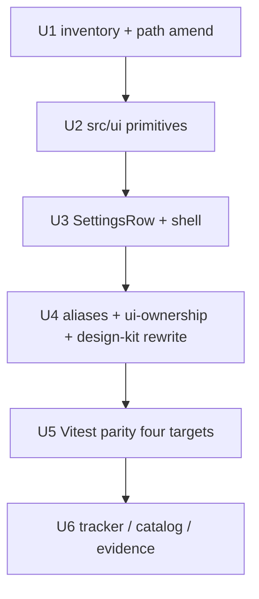

# CE Frontend Factory - Plan

## Goal Capsule

- **Objective:** Complete master-build-plan slice P9-01: inventory competing UI trees, migrate Button/Input/StatusPill into canonical `src/ui`, move SettingsRow under Settings and AppShell under `features/shell`, land structural ownership + four-target parity scaffolding, and eliminate competing physical kits for those five owned surfaces — without claiming Domain accordion, live Settings domains proof, or full FE-01 mega-kit demolition.
- **Authority:** Root `AGENTS.md`; `DESIGN.md`; `docs/frontend/AGENTS.md`; `docs/frontend/ui-parity-spec.md`; `docs/frontend/component-contracts.md`; `docs/frontend/design-token-contract.md`; `docs/frontend/source-adaptation-map.md`; `docs/master-build-plan.md` P9-01 + Frontend-factory evidence staging; brownfield parent `docs/plans/2026-07-22-001-docs-brownfield-phase-contract-alignment-plan.md` (KTD12 / U5); this Product Contract. This child plan cannot authorize a new route, stubbed product state, shared primitive, or completion credit outside higher product/security/accessibility/DTO contracts.
- **Execution profile:** Inventory-first brownfield disposition; retain/reverify the live `_shared` Button/Input/StatusPill APIs into `src/ui`; alias-only legacy barrels; Vitest + Testing Library for React parity; master-build-plan output paths with coordinated `ui-parity-spec` path amendment.
- **Readiness checkpoint:** Implementation-ready after 2026-07-27 scoping confirmation (P9-01 slice; accordion/live Settings deferred; residual mega-kit alias-only).
- **Stop conditions:** Stop if the slice requires approving/implementing the Domain accordion interaction contract (P9-04), claiming live `/settings?section=domains` production-boundary acceptance, inventing a second kit under `components/ui` or `_shared/ui`, importing Local Studio at runtime, or expanding into full FE-01 catalog migration.
- **Tail ownership:** P9-04 owns accordion interaction-contract amendment and `/settings?section=domains` implementation; P9-05 owns broader import-direction/CI validators; P9-02/P9-03 own chat/documents feature work beyond retargeting migrated imports; P12-07 owns production-boundary F3/R12/AE1 acceptance and full visual-matrix beyond starter-target parity.

---

## Product Contract

### Summary

Ship a thin CE frontend factory in two stages. Documentation convergence creates `DESIGN.md`, `docs/frontend/AGENTS.md`, and parity/catalog rules. Later Phase 1 frontend work migrates or reverifies Button, Input, and StatusPill in canonical `src/ui`, keeps SettingsRow owned by the Settings feature, and completes a fifth Settings Domain accordion parity target only after its interaction contract is approved. These five targets are starter coverage, not an exhaustive UI allowlist. HTML fixtures may use deterministic synthetic data; the live `/settings?section=domains` proof must use contracted DTO/BFF states.

Product Contract preservation: changed R8–R9 — clarify Settings-owned import homes and inventoried alias targets (coherence with KTD4/KTD5; no new product scope). R1–R7, R10–R12, F1–F3, AE1–AE4 otherwise preserved. Execution narrowed to the P9-01 application slice via Planning Contract and Implementation Units; D0 documentation stage is already landed. Scope confirmed 2026-07-27.

### Problem Frame

Backend contracts already steer agents reliably, but frontend authority is split across contracts and competing lifted component trees. The brownfield goal is to create one CE-owned visual and composition path without duplicating existing primitives, treating fixtures as product evidence, or letting a design document override security, accessibility, route, state, or DTO contracts.

### Key Decisions

- **Approach A — staged brownfield factory.** D0 establishes DESIGN, frontend-agent guidance, and parity/catalog rules. Later frontend work inventories, reverifies, migrates, or adds components under the canonical layer; no application factory is considered shipped during D0.
- **Shared scenarios, distinct authority.** Each target uses one versioned deterministic scenario/state manifest. Shared fields define content, variant/state label, theme, viewport, and expected token/geometry outcomes. Script-free HTML proves only static visual snapshots; React is authoritative for interaction, focus, semantics, and accessibility. Catalog readiness requires matching shared labels/content/variants/tokens/geometry across both plus React-only component and browser assertions. Existing React components are evidence to reverify, not automatic completion.
- **Existing foundations before new abstractions.** Button, Input, and StatusPill already exist in the lifted tree and must be dispositioned into `src/ui` before replacement. SettingsRow and the fifth accordion target remain Settings-owned feature compositions. The accordion cannot become factory-ready before its interaction contract, and cannot become a shared primitive until a second real consumer and a contract change justify that move.
- **DESIGN guides within higher authority.** CE-owned `DESIGN.md` resolves visual choices only after repository governance, product/security/accessibility contracts, and tokens. It cannot authorize data, routes, states, or browser capability.
- **Canonical ownership is fixed; migration topology is staged.** Product-neutral primitives live physically in `src/ui`. A temporary legacy import may only alias that same implementation; the final Phase 1 tree has no physical `components/ui` or `_shared/ui` implementation fork. Existing older barrels are migration inputs, not permission for new chrome or a second kit.

### Actors

| Actor | Role in this slice |
| --- | --- |
| Coding agent | Primary consumer; implements CE UI slices from DESIGN, AGENTS, and the kit |
| Human builder / reviewer | Iterates look via HTML mockups; reviews agent UI for invent-chrome drift |
| Administrator (Settings → Domain) | End user of the later proof surface; sees contracted Domain content inside the approved `/settings` information architecture |

### Key Flows

**F1 — Agent implements UI from the factory.** Root guidance sends the agent to `docs/frontend/AGENTS.md`, DESIGN, and the catalog. It composes factory-covered roles from factory-ready targets. An uncovered role uses an existing canonical CE component permitted by the component contracts and cites the catalog gap; a missing primitive or state is routed through the owning contract or brownfield task rather than invented locally.

**F2 — Human adjusts look via HTML.** Human edits a deterministic, script-free HTML parity fixture using CE tokens and the target's shared scenario manifest. The matching React target is updated and verified in the same later application slice before the catalog marks it factory-ready; the HTML never becomes behavioral or product authority.

**F3 — Contracted Settings proof.** After the frontend brownfield prerequisites pass, an administrator opens `/settings?section=domains`. The route preserves its contracted domain lifecycle, confirmation, conflict, failure, authorization, refresh, and server-reconciliation behavior while using the canonical composition layer. Acceptance runs through the production Next build, same-origin BFF, and FastAPI with server-produced DTOs; request interception or mocked product responses cannot satisfy it. Stub data is allowed only in isolated gallery fixtures, never as a live product state.

### Requirements

**Authority and agent path**

- R1. CE owns a root `DESIGN.md` that states visual non-negotiables (dense workstation, `zai-dark` / `zai-light`, Geist, tokens-only). Repository governance and approved product, security, accessibility, route/state, DTO, token, and component contracts always take precedence; DESIGN decides visual questions only where they are silent.
- R2. Root `AGENTS.md` requires frontend tasks to read `docs/frontend/AGENTS.md`; that guidance defines the remaining read order, compose-from-kit-first behavior for covered roles, cite-not-invent handling for gaps, and anti-patterns (page-local chrome, a second token system, or copying known-wrong live markup).
- R3. Agents must not introduce a second design language or raw color/spacing outside the CE token system when implementing factory-covered surfaces.

**HTML ↔ React kit**

- R4. The starter parity target set contains exactly five pairs: shared Button, Input, and StatusPill primitives; Settings-owned SettingsRow; and a Settings-owned Domain accordion feature composition. The fifth pair remains blocked until its interaction contract is approved and does not become a shared primitive merely by entering the catalog.
- R5. Each target receives a brownfield disposition: retain and reverify, migrate, replace, or add. Its versioned manifest separates shared content/labels/variants/theme/viewport/token/geometry assertions, HTML-static visual assertions, and React-only interaction/focus/semantic/accessibility assertions. A factory-ready target passes every applicable modality without pretending static HTML proves behavior. The five-pair starter set is not authority to discard or locally reinvent Select, Toggle, Progress, ConfirmDialog, or another contracted role it does not cover.
- R6. D0 may create DESIGN, frontend-agent guidance, and catalog rules, but no React component or live Settings surface receives completion credit until its later application slice and boundary tests pass.

**Settings proof and import boundary**

- R7. The live Settings Domain proof uses `/settings?section=domains`, contracted server-produced DTO/BFF data, and every reachable loading, empty, ready, stale/refresh-failure, fatal failure, conflict, forbidden, invalid-selection, history/reload, role-revocation, and lifecycle state. It preserves confirmation and server reconciliation. Synthetic or stubbed data is restricted to isolated non-product gallery and deterministic test fixtures.
- R8. Factory-covered product-neutral roles import their physical implementations from `src/ui`. The Settings proof composes those primitives plus Settings-owned compositions that remain under the Settings feature. For uncovered roles, agents use existing canonical CE implementations allowed by the component contract and cite the parity gap. Inventing page-local chrome or creating a second token/component system is out of contract.
- R9. Temporary legacy import specifiers may remain only as inventoried aliases to the single physical home for that symbol (`src/ui` for product-neutral primitives; `src/features/settings-panel` for SettingsRow; `src/features/shell` for AppShell; residual non-starter mega-kit exports per inventory) while dependency-ordered migration proceeds. They cannot contain a competing physical implementation for an already-migrated symbol or serve new work; the Phase 1 structural gate rejects competing physical bodies for Button, Input, StatusPill, SettingsRow, and AppShell behind `@/components/ui` / `@/_shared/ui`, not wholesale deletion of every `src/components/**` file.
- R10. Button, Input, StatusPill, SettingsRow, and the contracted Settings Domain accordion document applicable focus-visible, disabled, busy, validation, disclosure, semantic-status, keyboard, touch, screen-reader, focus-return, zoom, reduced-motion, dark/light, and narrow-layout behavior before factory-ready status.
- R11. HTML gallery assets are synthetic, script-free, network-free, non-routable in production, excluded from production bundles, and contain no credentials, private identifiers, runtime/storage locations, or copied server responses.
- R12. Live Settings acceptance is a deterministic browser test through the production Next build, same-origin BFF, and FastAPI. It forbids intercepted or mocked product responses as acceptance evidence and covers 320 CSS-pixel layout, desktop layout, 200%/400% zoom, keyboard, touch, and identity-partitioned cache behavior.

### Acceptance Examples

- AE1. Agent builds the contracted Settings → Domain composition
  - **Covers:** R2, R4, R7-R10, R12
  - **Given:** DESIGN, frontend guidance, contracted components, and DTO/BFF states exist
  - **When:** an agent implements or polishes the Domain section inside `/settings`
  - **Then:** the production browser flow uses real server DTOs, preserves lifecycle and reconciliation behavior, covers the required role/state/responsive matrix, and introduces no route, stub product data, page-local chrome, or second token system

- AE2. Target completeness gate
  - **Covers:** R4-R6, R10-R11
  - **Given:** a primitive or feature composition is claimed factory-ready
  - **When:** catalog coverage is checked
  - **Then:** its disposition, shared scenario manifest, safe HTML guidance, React implementation, applicable accessibility/state matrix, and rendered/component/browser evidence are all present; the catalog cannot claim all five until the contracted accordion pair passes

- AE3. DESIGN stays within its authority
  - **Covers:** R1, R3
  - **Given:** DESIGN or a fixture conflicts with product, security, accessibility, route, state, DTO, or token authority
  - **When:** an agent chooses behavior or presentation
  - **Then:** the higher contract wins and DESIGN is corrected rather than used to expand product capability

- AE4. Documentation convergence does not claim runtime completion
  - **Covers:** R6
  - **Given:** D0 creates DESIGN, frontend guidance, and catalog rules
  - **When:** documentation acceptance runs
  - **Then:** every React migration, new component, and live Settings proof remains NOT_STARTED in the brownfield frontend package

### Success Criteria

- D0 produces one subordinate DESIGN/frontend-agent/catalog authority without claiming application completion.
- DESIGN resolves visual choices only within higher product, security, accessibility, route/state, DTO, and token authority.
- Later factory-ready targets have explicit dispositions and shared-scenario HTML/React/accessibility proof, with React authoritative for behavior.
- The live `/settings?section=domains` proof uses real contracted data at the production browser/BFF/FastAPI boundary, while synthetic data remains isolated to safe gallery/test fixtures.

### Scope Boundaries

**In v1**

- D0: root `DESIGN.md`, `docs/frontend/AGENTS.md`, parity/catalog rules, and brownfield task mapping.
- Later Phase 1 frontend package: migrate/reverify Button, Input, and StatusPill in `src/ui`; retain or add SettingsRow in the Settings feature; contract and implement the fifth Settings Domain accordion pair; create versioned scenario manifests and deterministic parity fixtures; prove `/settings?section=domains` with real contracted data.

**P9-01 execution subset (this enrichment)**

- Four unblocked targets + AppShell ownership + structural/parity scaffolding only. Accordion contract, domains implementation, and F3/R7/R12/AE1 production proof remain initiative In v1 but out of this slice (see Outstanding Questions / KTD1).

**Deferred for later**

- Full FE-01 primitive catalog (table, modal, drawer, markdown, etc.).
- Removal of every temporary legacy import alias beyond the dependency-ordered brownfield package; aliases may point only to the single inventoried physical home for that symbol.
- Storybook-as-authority (fixture/HTML gallery is sufficient for v1).
- Generalizing a Settings accordion composition into a shared primitive before contracted behavior and a second real consumer justify it.

**Superseded for gallery scope (P9-06 / Option A — 2026-07-28)**

- The former deferral that held “Future CE-owned chat, document, or graph parity work” out of the HTML gallery is superseded by `docs/plans/2026-07-28-002-feat-full-workstation-html-gallery-plan.md` and `docs/master-build-plan.md` P9-06. Chat, documents, shell, login, and graph-**unavailable** are first-class HTML gallery targets. Graph **canvas** enablement remains blocked until an approved graph DTO. Product/threat-model adaptation rules for copying Local Studio still apply; HTML never authorizes product behavior.

**Outside this initiative’s identity**

- Turning Context Engine into a generic design-system product unrelated to CE workstation UI.
- Runtime dependency on Local Studio or importing reference trees into the app bundle.
- Browser-selectable themes/runtimes beyond the contracted `zai-dark` / `zai-light` system.
- Stubbed or fixture-only loaded states in the live `/settings` product surface.

### Dependencies / Assumptions

- CE token contract (`docs/frontend/design-token-contract.md`) remains the token source of truth; DESIGN narrates and points, it does not fork a second palette.
- Local Studio `.references/ce-local-studio-docs/` (including accordion/KG packs) is evidence for grammar and parity, not copy-paste authority when CE contracts diverge.
- The approved `/settings` route exists, but its Domain composition and data must be verified against the converged route, state, HTTP, and DTO contracts before implementation.
- `STRATEGY.md` CE Frontend Factory remains the initiative anchor.

### Outstanding Questions

**Resolved in Planning Contract (2026-07-27)**

- Dependency order, temporary compatibility aliases, call-site inventory, and structural enforcement → KTD1–KTD5, U1–U4.
- Deterministic synthetic fixture shape and React harness → KTD2, KTD6, U5.
- Compose-only enforcement in v1 → structural `ui-ownership` gate in P9-01; broader import CI → P9-05.

**Deferred (blocking for AE1 / F3 / fifth catalog pair only)**

- Settings Domain accordion interaction grammar and `/settings?section=domains` implementation → P9-04. Production-boundary F3/R12/AE1 acceptance → P12-07. Not a P9-01 exit blocker.

### Sources / Research

- `STRATEGY.md` — CE Frontend Factory tracks and metrics
- `.references/ce-local-studio-docs/DESIGN.md` — LS visual parity evidence
- `.references/ce-local-studio-docs/frontend/AGENTS.md` — agent operating pattern
- `.references/ce-local-studio-docs/frontend/shared/accordion-storage-kit.md` — accordion kit gap (“not exported yet”)
- `docs/frontend/component-contracts.md` — required primitives and Settings compositions
- `docs/frontend/design-token-contract.md` — CE token authority
- `docs/frontend/implementation-slices.md` — FE-01 tokens/primitives slice
- `docs/_scratch/code-docs-drift-review.md` — competing `components` / `_shared/ui` vs `src/ui`
- `docs/_scratch/p0-01-layout-inventory.md` — inventory pattern + historical Button/`className` lesson
- `app/client/tests/design-kit-contract.test.mjs` — current barrel/`_shared` allowlist lock that must be rewritten with migration

---

## Planning Contract

### Key Technical Decisions

- KTD1. **P9-01 executes the application half of this Product Contract.** D0 docs already exist. This enrichment lands inventory, four unblocked targets, shell ownership, structural gate, and parity scaffolding. Accordion + domains implementation stay P9-04; F3/R12/AE1 production acceptance stays P12-07. Governs R4–R6, R8–R11; defers R7/R12/AE1.
- KTD2. **Parity output paths follow master-build-plan P9-01; amend `ui-parity-spec` in the same slice.** Use `app/client/tests/structure/ui-ownership.test.ts`, `app/client/tests/parity/manifests/<target>.json`, `app/client/tests/parity/fixtures/<target>.html`, `app/client/tests/parity/react/<target>.test.tsx`, and `app/client/tests/e2e/` scaffolding. Update the path strings in `docs/frontend/ui-parity-spec.md` so the D0 schema owner stays consistent. Same-slice readiness clarify: starter-target `FACTORY_READY` is earned by shared + HTML-static + React (Vitest/RTL) + applicable R10 a11y assertions; Playwright route/visual matrix stays P12-07. `(session-settled: user-approved — chosen over keeping ui-parity-spec html/components paths and correcting only the tracker: confirmed in P9-01 scoping)`
- KTD3. **Retain/reverify the live `_shared` Button/Input/StatusPill APIs as the `src/ui` physical home.** Delete or alias-away divergent thin `components/ui` copies. Login deep-imports must resolve to the same implementations as the Settings barrel. During U1, choose rename-to-`component-contracts` names or keep live public API with an explicit approved divergence/mapping table — no silent partial renames. Governs R5, R8–R9.
- KTD4. **Residual mega-kit may keep sole physical homes until FE-01.** P9-01 migrates the four starter targets + AppShell ownership. Alias-only applies to symbols that already have a canonical home. Non-starter `_shared` implementations may remain as their sole physical home (mega-file or split modules), inventoried as `defer-FE-01`, with no new legacy call sites and no second bodies for Button/Input/StatusPill/SettingsRow/AppShell. Full FE-01 demolition is deferred. `(session-settled: user-approved — chosen over requiring the whole mega-file gone in this slice: confirmed in P9-01 scoping)`
- KTD5. **Ownership homes.** Product-neutral primitives → `src/ui`. SettingsRow → `src/features/settings-panel`. AppShell → `src/features/shell` (NavigationSidebar feature = contract role NavigationRail; remains a feature dependency, not merged into chat-shell). Preferences consumes SettingsRow from the Settings feature export. Legacy `@/components/ui` and `@/_shared/ui` become alias-only for migrated symbols; no new legacy call sites. Governs R8–R9.
- KTD6. **React parity harness is Vitest + Testing Library; structural gate stays node:test.** Introduce a minimal Vitest config for `app/client/tests/parity/react/**/*.test.tsx`. Keep filesystem/allowlist structure + design-kit suites on `node:test` (+ `--experimental-strip-types` for `app/client/tests/structure/ui-ownership.test.ts`). Composite npm `test` runs both. Playwright remains e2e-only; P9-01 does not claim F3 domains acceptance. `(session-settled: user-approved — chosen over Playwright-only component proofs or staying on node:test without .tsx: confirmed in P9-01 scoping)`
- KTD7. **Rewrite `design-kit-contract` with migration.** The current suite requires barrel `export * from "@/_shared/ui"` and freezes an allowlist. Same-slice rewrite asserts canonical `src/ui` ownership, alias-only legacy for migrated symbols, and monotonic allowlist shrinkage. Governs R9.
- KTD8. **Accordion hard stop.** Catalog state for Settings Domain accordion remains `BLOCKED_CONTRACT`. No accordion manifest, fixture, React parity test, or `FACTORY_READY` claim in P9-01. Governs R4, AE2.
- KTD9. **P9-01 `FACTORY_READY` modalities.** For the four unblocked targets, `FACTORY_READY` requires the applicable R10 subset at the Vitest/RTL layer (keyboard/touch, focus/return, screen-reader, reduced-motion, validation/busy/disabled/status, zoom, dark/light, narrow where claimed). Route-level visual matrix and F3 domains remain P12/P9-04. HTML fixtures may assert only static snapshot/token/geometry — never focus/ARIA/keyboard/state transitions.

### Assumptions

- P8 operational-safety gate is available per tracker dependency; this slice does not reopen sink privacy.
- `npm run typecheck` is currently green; login/`className` historical red is not reintroduced by a non-`className` Button.
- CE-only surfaces (`AppLogo`, `ErrorBox`, `PageState`) are dispositioned in inventory; they need not become starter parity targets in P9-01.
- Existing `frontend-uiux-factory.test.mjs` D0 authority checks remain green and are adapted only if this plan’s readiness metadata would break string assertions.

### High-Level Technical Design

Migration collapses dual Button/Input bodies onto one `src/ui` home, then fences the result with structural tests and four-target parity artifacts. Accordion and live Settings domains remain outside the graph.

### System-Wide Impact

- **Surfaces:** login Button/Input visual/API unify to the retained kit; Settings/Preferences/Chat/Documents StatusPill imports retarget; authenticated pages import AppShell from `features/shell`.
- **Tooling:** adds Vitest + Testing Library for parity React tests; extends npm test orchestration beyond top-level `tests/*.mjs`.
- **Agents:** F1 path becomes truthful — covered roles import `@/ui` (or documented alias) instead of inventing chrome.
- **Downstream:** unblocks P9-05 structural CI expansion and P9-02/DRIFT-02 kit dependency; does not unblock P9-04 accordion without contract amendment.

### Risks and Dependencies

| Risk | Mitigation |
| --- | --- |
| Dual Button/Input APIs break login or Settings during unify | KTD3 + characterization; login smoke scenarios in U2/U5 |
| `design-kit-contract` fights migration | KTD7 same-slice rewrite |
| Scope creep into full mega-kit deletion | KTD4 residual alias policy |
| Accordion treated as factory-ready | KTD8 + catalog/state assertions |
| Path doc drift (parity-spec vs tracker) | KTD2 coordinated amend |
| Vitest adds lockfile/advisory churn | Pin minimal deps; record npm advisory posture like P0-05 |
| Preferences ↔ settings-panel feature import | KTD5 explicit consumer path; no upward `src/ui` import of SettingsRow |

**Depends on:** P1 layout/canonical paths; P8 per tracker; D0 DESIGN/AGENTS/parity schema.
**Blocks:** Honest P9-01 exit; P9-05 ownership CI; P9-04 still blocked on accordion contract (not on this slice’s kit migration).

### Open Questions

- None blocking for plan readiness.
- Deferred: accordion interaction grammar + domains implementation (P9-04); F3 production acceptance (P12-07).
- Deferred: full removal of every temporary alias and residual non-starter kit exports (post P9-01 / FE-01).
- Deferred: whether Preferences should eventually share a settings-kit barrel vs import SettingsRow directly — either is fine if Settings owns the physical file (KTD5).

---

## Implementation Units

### U1. UI inventory and path-authority freeze

**Goal:** Produce `docs/_scratch/p9-01-ui-inventory.md` covering every `components/**` and `_shared/ui/**` file/call site with disposition, and align parity output path strings to master-build-plan.

**Requirements:** R5, R6, R9 — KTD1, KTD2, KTD4, KTD5

**Dependencies:** None

**Files:**
- Create: `docs/_scratch/p9-01-ui-inventory.md`
- Modify: `docs/frontend/ui-parity-spec.md` (output path strings to `parity/fixtures` + `parity/react` + `structure/ui-ownership.test.ts`; clarify starter-target readiness per KTD2/KTD9 — React harness earns `FACTORY_READY`, Playwright route matrix stays P12-07)
- Read evidence: `app/client/src/components/**`, `app/client/src/_shared/ui/**`, `app/client/tests/design-kit-contract.test.mjs`, `docs/master-build-plan.md` P9-01 row
- Test expectation: none — documentation/inventory gate

**Approach:** Mirror `p0-01-layout-inventory.md` style: file register, import call-site matrix (`@/components/ui`, deep imports, `@/_shared/ui`, layout), disposition per file (`retain-and-reverify` / `migrate` / `alias-only` / `delete` / `defer-FE-01` / `blocked-P9-04`), Button/Input dual-body note, shell vs chat-shell naming, accordion hard stop. Amend `ui-parity-spec` path bullets to match master-build-plan without rewriting the schema or claiming fixtures exist yet.

**Execution note:** Inventory before any component move; dispositions freeze the winner APIs for U2.

**Patterns to follow:** `docs/_scratch/p0-01-layout-inventory.md`, `docs/_scratch/p8-02-telemetry-inventory.md`

**Test scenarios:**
- Test expectation: none — inventory artifact review only

**Verification:** Inventory lists every competing-tree file and call site with a disposition; path amend makes `ui-parity-spec` and master-build-plan P9-01 agree; accordion remains `BLOCKED_CONTRACT` with no fixture obligation.

---

### U2. Canonical `src/ui` Button, Input, StatusPill

**Goal:** Create physical `src/ui` implementations by retain/reverify of the live `_shared` APIs; eliminate divergent thin copies; retarget login and StatusPill consumers to one home.

**Requirements:** R3, R5, R8–R10 — KTD3, KTD4

**Dependencies:** U1

**Files:**
- Create: `app/client/src/ui/Button.tsx`, `app/client/src/ui/Input.tsx`, `app/client/src/ui/StatusPill.tsx`, `app/client/src/ui/index.ts` (and shared helpers/`cx` as needed without forking tokens)
- Modify: `app/client/src/_shared/ui/index.tsx` (remove or re-export migrated symbols only — no second bodies)
- Modify or delete: `app/client/src/components/ui/Button.tsx`, `Input.tsx`, `StatusPill.tsx` (alias-only or remove)
- Modify: `app/client/src/app/login/page.tsx` and StatusPill call sites (`ChatShell`, `DocumentsPage`, `SettingsPanel`, `PreferencesPanel`, etc.)
- Modify as needed: `app/client/src/lib/cx.ts` or consolidate `_shared` `cx`
- Test: covered by U4/U5; typecheck must stay green after unify

**Approach:** Promote `_shared` Button/Input/StatusPill (size/loading/error/icon contracts) into `src/ui`. Map StatusPill tones toward `component-contracts.md` names if inventory records drift. Login must stop deep-importing thin divergent bodies. Do not migrate Table/Modal/Drawer/etc. bodies in this unit beyond keeping residual exports alias-safe.

**Execution note:** Before deleting thins, record a short characterization matrix (Button loading/`aria-busy`/disabled; Input label/help/error/disabled; StatusPill non-color-only + tones in use) in inventory or a U2 scratch note that U5 manifests must cover.

**Patterns to follow:** `_shared/ui` Button/Input/StatusPill implementations; `docs/frontend/component-contracts.md` required variants/states; token-only classes per `DESIGN.md`

**Test scenarios:**
- Happy path: `@/ui` exports Button/Input/StatusPill; login imports resolve to those implementations
- Edge: barrel deep-import `@/components/ui/Button` (if kept) aliases the same module identity as `@/ui/Button`
- Error: typecheck fails if a non-alias second Button/Input body remains with divergent props
- Integration: Settings StatusPill and login Button coexist on the unified API without `className` regressions on controls that need it

**Verification:** `src/ui` owns the three primitives; no competing physical Button/Input/StatusPill bodies; login and StatusPill consumers compile and use the canonical home.

---

### U3. SettingsRow and AppShell ownership

**Goal:** Move SettingsRow into `features/settings-panel` and AppShell into `features/shell`; retarget authenticated pages and Preferences.

**Requirements:** R8 — KTD5

**Dependencies:** U2

**Files:**
- Create: `app/client/src/features/settings-panel/SettingsRow.tsx` (or equivalent export module)
- Create: `app/client/src/features/shell/AppShell.tsx` (+ barrel if needed)
- Modify: `app/client/src/features/settings-panel/SettingsPanel.tsx`, `app/client/src/features/user-preferences/PreferencesPanel.tsx`
- Modify: authenticated pages currently importing `components/layout/AppShell`
- Modify or delete: `app/client/src/components/layout/AppShell.tsx` (relocate; leave alias only if inventory requires)
- Modify or delete: `app/client/src/components/ui/SettingsLayout.tsx` so it no longer hosts a physical SettingsRow (disposition orphan ListGroup/PageHeader chain in inventory)
- Leave: `app/client/src/features/navigation-sidebar/**` (contract role NavigationRail) as dependency of shell; do not merge `chat-shell`
- Test: structural assertions in U4; no accordion parity files

**Approach:** SettingsRow becomes a Settings-owned composition over ListRow/tokens as today. Preferences imports from the Settings feature module. AppShell continues to mount NavigationSidebar and main slot; auth gate stays in `AppLayout` (not shell). Login must not mount AppShell. Preserve existing below-breakpoint rail→drawer behavior and Escape/close focus return on shell chrome.

**Patterns to follow:** existing `AppShell.tsx` / `SettingsPanel` composition; `component-contracts.md` AppShell vs NavigationRail ownership split

**Test scenarios:**
- Happy path: `/settings` and preferences render SettingsRow from the Settings feature path
- Happy path: chat/documents/settings/forbidden/database-visualize pages import AppShell from `features/shell`
- Edge: login route does not import or mount AppShell/rail
- Edge: `chat-shell` remains a separate feature; not relocated into `features/shell`
- Edge: narrow-layout rail drawer / focus-return behavior preserved after relocate (lightweight RTL or existing shell characterization)
- Error: SettingsRow is not exported from `src/ui` as a product-neutral primitive; thin SettingsLayout no longer defines a second SettingsRow body

**Verification:** Catalog owners match physical homes; shell vs chat-shell remain distinct; Preferences consumes Settings-owned SettingsRow; no second SettingsRow body.

---

### U4. Alias barrels and structural ownership gate

**Goal:** Make legacy barrels alias-only, rewrite design-kit contract tests, and land `ui-ownership` structural enforcement.

**Requirements:** R9 — KTD4, KTD5, KTD7

**Dependencies:** U2, U3

**Files:**
- Modify: `app/client/src/components/ui/index.ts`
- Modify: `app/client/src/_shared/ui/index.tsx` (thin alias / residual re-exports only)
- Create: `app/client/tests/structure/ui-ownership.test.ts` (node:test + `--experimental-strip-types`; filesystem/allowlist style like design-kit — no `@/` runtime imports in the suite)
- Modify: `app/client/tests/design-kit-contract.test.mjs`
- Modify: `app/client/package.json` — composite `"test": "node --experimental-strip-types --test tests/*.mjs tests/structure/**/*.test.ts && vitest run"` (vitest may be a no-op/stub until U5 lands; or gate vitest behind U5 with `test:parity` then fold in)
- Modify if needed: `app/client/tests/frontend-uiux-factory.test.mjs` readiness string expectations

**Approach:** Barrel may re-export `@/ui` plus CE-only helpers; must not host competing implementations for migrated symbols. Residual non-starter `_shared` bodies may remain as sole homes per KTD4. Allowlist for `@/_shared/ui` shrinks monotonically; new legacy call sites fail. Structural test fails on second physical Button/Input/StatusPill/SettingsRow/AppShell bodies and on Domain accordion parity artifacts under `app/client/tests/parity/**`. Rewrite design-kit assertions that currently require `export * from "@/_shared/ui"`.

**Execution note:** Land failing structural assertions first where practical, then make aliases satisfy them.

**Patterns to follow:** existing allowlist freeze in `design-kit-contract.test.mjs`; `docs/frontend/AGENTS.md` temporary-legacy rules

**Test scenarios:**
- Happy path: `@/components/ui` and `@/ui` resolve Button/Input/StatusPill to one implementation
- Happy path: allowlisted residual `@/_shared/ui` importers are inventoried; empty entries removed
- Edge: adding a new `@/_shared/ui` import outside the allowlist fails the gate
- Edge: restoring a non-alias `components/ui/Button.tsx` body fails the gate
- Edge: residual non-starter `_shared` sole-home exports do not fail the gate solely by existing
- Error: presence of `app/client/tests/parity/manifests` (or fixtures/react) for Domain accordion target fails the gate
- Integration: design-kit + ui-ownership both green after migration

**Verification:** Structural gate and rewritten design-kit suite pass; competing physical kits for the five owned surfaces are gone.

---

### U5. Four-target parity scaffolding and Vitest harness

**Goal:** Add Vitest + Testing Library and versioned parity manifests/fixtures/React tests for Button, Input, StatusPill, and SettingsRow toward factory-ready evidence.

**Requirements:** R5, R10, R11, AE2 — KTD2, KTD6, KTD8

**Dependencies:** U4

**Files:**
- Create: `app/client/vitest.config.ts` (or equivalent minimal config)
- Modify: `app/client/package.json` (devDependencies + scripts)
- Create: `app/client/tests/parity/manifests/{button,input,status-pill,settings-row}.json`
- Create: `app/client/tests/parity/fixtures/{button,input,status-pill,settings-row}.html`
- Create: `app/client/tests/parity/react/{button,input,status-pill,settings-row}.test.tsx`
- Ensure: `app/client/tests/e2e/` remains present; add only a short README note that Settings domains production-boundary acceptance is P12-07 (implementation P9-04) — do not author intercepted F3 acceptance here; do not perpetuate stale `frontend/` paths
- Modify: `docs/frontend/ui-parity-spec.md` catalog states for the four targets to `IN_PROGRESS` when scaffolding lands (U6 alone promotes `FACTORY_READY`)
- Modify: `app/client/package.json` / Vitest config for jsdom + `@/` alias; extend tsconfig include for parity tests if typecheck must cover them

**Approach:** Each manifest carries schemaVersion, targetId, owner, catalogState, disposition, shared assertions, HTML-static assertions, and React assertions per `ui-parity-spec` + KTD9. HTML-static assertions may include only snapshot/token/geometry outcomes — forbid focus, ARIA, keyboard, touch, and state-transition claims in fixtures. React assertions own the applicable R10 matrix (keyboard/touch, focus/return, screen-reader, reduced-motion, validation/busy/disabled/status, zoom, dark/light, narrow where claimed). Do not create accordion parity files. Full route visual matrix remains P12-07. AE2 per-target modalities apply to the four unblocked targets; the all-five catalog claim remains impossible per AE2/KTD8.

**Patterns to follow:** `docs/frontend/ui-parity-spec.md` schema; Local Studio visual density only as evidence via tokens already in CE

**Test scenarios:**
- Happy path: each of four manifests validates required shared fields; HTML fixtures render without script/network
- Happy path: React tests prove Button loading/`aria-busy`, Input error/help, StatusPill non-color-only status, SettingsRow keyboard focus on actionable control — plus every other applicable R10 row for that target
- Edge: zai-dark and zai-light; narrow/zoom/reduced-motion where claimed for the target
- Edge: fixtures contain no credentials, private IDs, runtime URLs, or copied server payloads
- Error: accordion target files absent; catalog still `BLOCKED_CONTRACT`; catalog remains `IN_PROGRESS` until U6
- Integration: composite `npm test` (node:test structure/design-kit + `vitest run`) green

**Verification:** Four targets have manifests + fixtures + React tests green with applicable R10 coverage; catalog stays `IN_PROGRESS` until U6; accordion remains blocked; no F3 live Settings claim.

---

### U6. Tracker, brownfield, and closure evidence

**Goal:** Record P9-01 completion evidence and update tracker/register rows without overclaiming P9-04/P12.

**Requirements:** R6, AE2, AE4 — KTD1, KTD8

**Dependencies:** U5

**Files:**
- Create: `docs/_scratch/p9-01-ui-ownership-evidence.md`
- Modify: `docs/master-build-plan.md` (P9-01 status after proof)
- Modify: `docs/brownfield-refactor-register.md` (shell/UI primitives row; DRIFT-07 scaffolding note; do not close DRIFT-02)
- Modify: `docs/frontend/ui-parity-spec.md` catalog table states for the four targets
- Test expectation: none beyond citing commands already green from U4/U5

**Approach:** Evidence lists inventory path, dispositions, commands run, privacy/fixture hygiene assertions, residual `defer-FE-01` list, and explicit non-claims (accordion, F3 live Settings, full FE-01). After U4/U5 green, this unit alone promotes the four catalog targets to `FACTORY_READY` per KTD2/KTD9.

**Patterns to follow:** `docs/_scratch/p7-02-intent-route-evidence.md`, `docs/_scratch/p8-02-*` evidence shape

**Test scenarios:**
- Test expectation: none — evidence/doc closure after green gates

**Verification:** P9-01 marked DONE only with inventory + structural + four-target parity evidence attached; four catalog targets `FACTORY_READY`; P9-04 remains BLOCKED; no live Settings acceptance claimed.

---

## Verification Contract

- Inventory review: `docs/_scratch/p9-01-ui-inventory.md` complete before merge of migration units.
- Frontend gate: from `app/client`, composite `npm test` runs `node --experimental-strip-types --test tests/*.mjs tests/structure/**/*.test.ts && vitest run` (structure + design-kit + parity React).
- Typecheck/build: `npm run typecheck` and production build remain green (extend tsconfig/Vitest typecheck coverage for parity tests if required).
- Authority docs: `frontend-uiux-factory` D0 checks remain green; `ui-parity-spec` paths and starter readiness rules match landed files (KTD2/KTD9).
- Non-claims: no Domain accordion parity artifacts; no intercepted `/settings?section=domains` acceptance treated as P9-01 exit.
- Evidence: `docs/_scratch/p9-01-ui-ownership-evidence.md` records commands and residuals before tracker DONE.

---

## Definition of Done

- Product Contract R3–R6, R8–R11 advanced for the four unblocked targets; R7/R12/AE1 explicitly deferred to P9-04/P12.
- Competing physical kits for Button, Input, StatusPill, SettingsRow, and AppShell are gone; legacy imports are alias-only.
- `ui-ownership` structural gate and rewritten design-kit contract pass.
- Four-target manifests, HTML fixtures, and React parity tests exist and pass under master-build-plan paths with applicable R10 coverage (KTD9).
- Catalog marks at most the four unblocked targets `FACTORY_READY` (U6); accordion stays `BLOCKED_CONTRACT`.
- Tracker/register/evidence updated without overclaiming live Settings or full FE-01.
- Abandoned experimental kit forks from the migration attempt are removed from the diff.
- Full route E2E / visual matrix remains P12-07; F3 domains acceptance remains P12-07.
