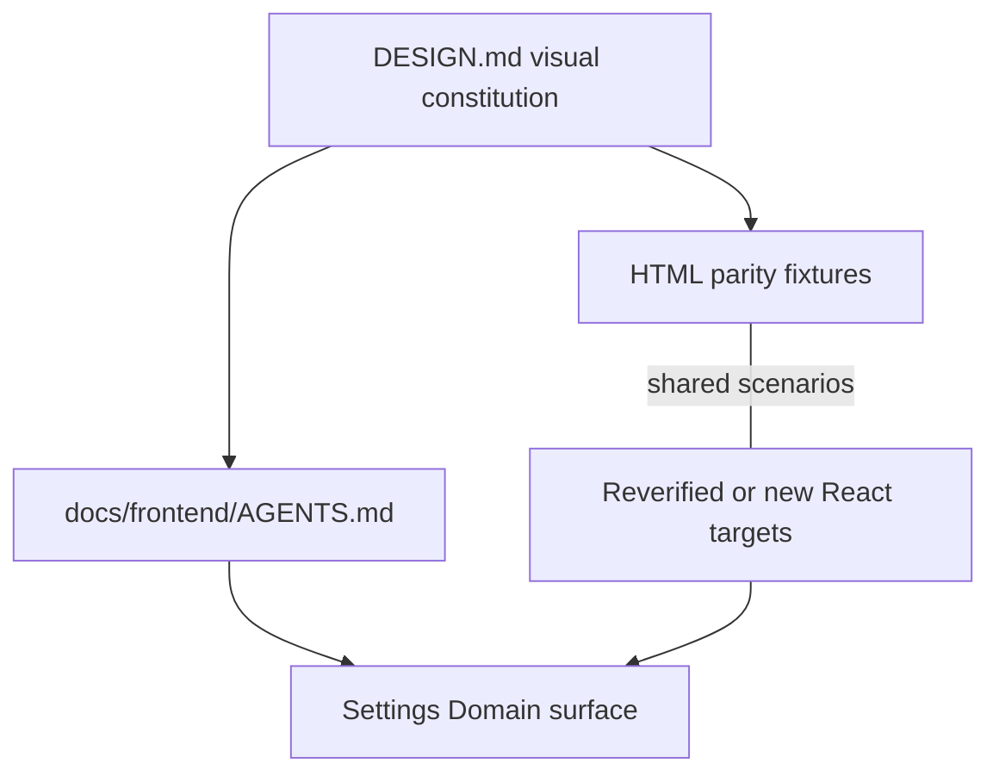

# CE Frontend Factory - Plan

## Goal Capsule

**Objective.** Give coding agents a CE-owned frontend factory without bypassing brownfield authority: establish DESIGN and frontend-agent guidance during documentation convergence, then reverify or migrate existing primitives and prove contracted `/settings` composition in the later frontend package.

**Product authority.** `STRATEGY.md` (CE Frontend Factory), root `AGENTS.md`, `docs/frontend/design-token-contract.md`, `docs/frontend/component-contracts.md`, `docs/frontend/ui-parity-spec.md`, `docs/frontend/source-adaptation-map.md`, plus this Product Contract. Local Studio docs under `.references/ce-local-studio-docs/` are read-only evidence, not runtime or visual authority.

**Brownfield parent.** `docs/plans/2026-07-22-001-docs-brownfield-phase-contract-alignment-plan.md` owns sequencing, disposition, and evidence. This child is subordinate to the PRD, route/state/accessibility contracts, and generated DTO/BFF boundary; it cannot authorize a new route, stubbed product state, shared primitive, or completion credit on its own.

**Open blockers.** `src/ui` is the final physical home for product-neutral primitives. The brownfield package must still decide dependency-ordered migration, temporary compatibility aliases, and the call-site inventory for the existing `components/ui` and `_shared/ui` trees. The fifth starter parity target, a Settings Domain accordion feature composition, remains blocked until its interaction contract is approved; any live Settings proof must use contracted DTO/BFF states rather than stub product data.

## Product Contract

### Summary

Ship a thin CE frontend factory in two stages. Documentation convergence creates `DESIGN.md`, `docs/frontend/AGENTS.md`, and parity/catalog rules. Later Phase 1 frontend work migrates or reverifies Button, Input, and StatusPill in canonical `src/ui`, keeps SettingsRow owned by the Settings feature, and completes a fifth Settings Domain accordion parity target only after its interaction contract is approved. These five targets are starter coverage, not an exhaustive UI allowlist. HTML fixtures may use deterministic synthetic data; the live `/settings?section=domains` proof must use contracted DTO/BFF states.

### Problem Frame

Backend contracts already steer agents reliably, but frontend authority is split across contracts and competing lifted component trees. The brownfield goal is to create one CE-owned visual and composition path without duplicating existing primitives, treating fixtures as product evidence, or letting a design document override security, accessibility, route, state, or DTO contracts.

### Key Decisions

- **Approach A — staged brownfield factory.** D0 establishes DESIGN, frontend-agent guidance, and parity/catalog rules. Later frontend work inventories, reverifies, migrates, or adds components under the canonical layer; no application factory is considered shipped during D0.
- **Shared scenarios, distinct authority.** Each target uses one versioned deterministic scenario/state manifest. Shared fields define content, variant/state label, theme, viewport, and expected token/geometry outcomes. Script-free HTML proves only static visual snapshots; React is authoritative for interaction, focus, semantics, and accessibility. Catalog readiness requires matching shared labels/content/variants/tokens/geometry across both plus React-only component and browser assertions. Existing React components are evidence to reverify, not automatic completion.
- **Existing foundations before new abstractions.** Button, Input, and StatusPill already exist in the lifted tree and must be dispositioned into `src/ui` before replacement. SettingsRow and the fifth accordion target remain Settings-owned feature compositions. The accordion cannot become factory-ready before its interaction contract, and cannot become a shared primitive until a second real consumer and a contract change justify that move.
- **DESIGN guides within higher authority.** CE-owned `DESIGN.md` resolves visual choices only after repository governance, product/security/accessibility contracts, and tokens. It cannot authorize data, routes, states, or browser capability.
- **Canonical ownership is fixed; migration topology is staged.** Product-neutral primitives live physically in `src/ui`. A temporary legacy import may only alias that same implementation; the final Phase 1 tree has no physical `components/ui` or `_shared/ui` implementation fork. Existing older barrels are migration inputs, not permission for new chrome or a second kit.

### Actors

| Actor | Role in this slice |
| --- | --- |
| Coding agent | Primary consumer; implements CE UI slices from DESIGN, AGENTS, and the kit |
| Human builder / reviewer | Iterates look via HTML mockups; reviews agent UI for invent-chrome drift |
| Administrator (Settings → Domain) | End user of the later proof surface; sees contracted Domain content inside the approved `/settings` information architecture |

### Key Flows

**F1 — Agent implements UI from the factory.** Root guidance sends the agent to `docs/frontend/AGENTS.md`, DESIGN, and the catalog. It composes factory-covered roles from factory-ready targets. An uncovered role uses an existing canonical CE component permitted by the component contracts and cites the catalog gap; a missing primitive or state is routed through the owning contract or brownfield task rather than invented locally.

**F2 — Human adjusts look via HTML.** Human edits a deterministic, script-free HTML parity fixture using CE tokens and the target's shared scenario manifest. The matching React target is updated and verified in the same later application slice before the catalog marks it factory-ready; the HTML never becomes behavioral or product authority.

**F3 — Contracted Settings proof.** After the frontend brownfield prerequisites pass, an administrator opens `/settings?section=domains`. The route preserves its contracted domain lifecycle, confirmation, conflict, failure, authorization, refresh, and server-reconciliation behavior while using the canonical composition layer. Acceptance runs through the production Next build, same-origin BFF, and FastAPI with server-produced DTOs; request interception or mocked product responses cannot satisfy it. Stub data is allowed only in isolated gallery fixtures, never as a live product state.

### Requirements

**Authority and agent path**

- R1. CE owns a root `DESIGN.md` that states visual non-negotiables (dense workstation, `zai-dark` / `zai-light`, Geist, tokens-only). Repository governance and approved product, security, accessibility, route/state, DTO, token, and component contracts always take precedence; DESIGN decides visual questions only where they are silent.
- R2. Root `AGENTS.md` requires frontend tasks to read `docs/frontend/AGENTS.md`; that guidance defines the remaining read order, compose-from-kit-first behavior for covered roles, cite-not-invent handling for gaps, and anti-patterns (page-local chrome, a second token system, or copying known-wrong live markup).
- R3. Agents must not introduce a second design language or raw color/spacing outside the CE token system when implementing factory-covered surfaces.

**HTML ↔ React kit**

- R4. The starter parity target set contains exactly five pairs: shared Button, Input, and StatusPill primitives; Settings-owned SettingsRow; and a Settings-owned Domain accordion feature composition. The fifth pair remains blocked until its interaction contract is approved and does not become a shared primitive merely by entering the catalog.
- R5. Each target receives a brownfield disposition: retain and reverify, migrate, replace, or add. Its versioned manifest separates shared content/labels/variants/theme/viewport/token/geometry assertions, HTML-static visual assertions, and React-only interaction/focus/semantic/accessibility assertions. A factory-ready target passes every applicable modality without pretending static HTML proves behavior. The five-pair starter set is not authority to discard or locally reinvent Select, Toggle, Progress, ConfirmDialog, or another contracted role it does not cover.
- R6. D0 may create DESIGN, frontend-agent guidance, and catalog rules, but no React component or live Settings surface receives completion credit until its later application slice and boundary tests pass.

**Settings proof and import boundary**

- R7. The live Settings Domain proof uses `/settings?section=domains`, contracted server-produced DTO/BFF data, and every reachable loading, empty, ready, stale/refresh-failure, fatal failure, conflict, forbidden, invalid-selection, history/reload, role-revocation, and lifecycle state. It preserves confirmation and server reconciliation. Synthetic or stubbed data is restricted to isolated non-product gallery and deterministic test fixtures.
- R8. Factory-covered product-neutral roles and the Settings proof import their physical implementations from `src/ui`; Settings-owned compositions stay under the Settings feature. For uncovered roles, agents use existing canonical CE implementations allowed by the component contract and cite the parity gap. Inventing page-local chrome or creating a second token/component system is out of contract.
- R9. Temporary legacy import specifiers may remain only as inventoried aliases to the same `src/ui` implementation while dependency-ordered migration proceeds. They cannot contain a competing physical implementation or serve new work; the Phase 1 structural gate rejects a second `src/components` implementation tree.
- R10. Button, Input, StatusPill, SettingsRow, and the contracted Settings Domain accordion document applicable focus-visible, disabled, busy, validation, disclosure, semantic-status, keyboard, touch, screen-reader, focus-return, zoom, reduced-motion, dark/light, and narrow-layout behavior before factory-ready status.
- R11. HTML gallery assets are synthetic, script-free, network-free, non-routable in production, excluded from production bundles, and contain no credentials, private identifiers, runtime/storage locations, or copied server responses.
- R12. Live Settings acceptance is a deterministic browser test through the production Next build, same-origin BFF, and FastAPI. It forbids intercepted or mocked product responses as acceptance evidence and covers 320 CSS-pixel layout, desktop layout, 200%/400% zoom, keyboard, touch, and identity-partitioned cache behavior.

### Acceptance Examples

- AE1. Agent builds the contracted Settings → Domain composition
  - **Covers:** R2, R4, R7-R10, R12
  - **Given:** DESIGN, frontend guidance, contracted components, and DTO/BFF states exist
  - **When:** an agent implements or polishes the Domain section inside `/settings`
  - **Then:** the production browser flow uses real server DTOs, preserves lifecycle and reconciliation behavior, covers the required role/state/responsive matrix, and introduces no route, stub product data, page-local chrome, or second token system

- AE2. Target completeness gate
  - **Covers:** R4-R6, R10-R11
  - **Given:** a primitive or feature composition is claimed factory-ready
  - **When:** catalog coverage is checked
  - **Then:** its disposition, shared scenario manifest, safe HTML guidance, React implementation, applicable accessibility/state matrix, and rendered/component/browser evidence are all present; the catalog cannot claim all five until the contracted accordion pair passes

- AE3. DESIGN stays within its authority
  - **Covers:** R1, R3
  - **Given:** DESIGN or a fixture conflicts with product, security, accessibility, route, state, DTO, or token authority
  - **When:** an agent chooses behavior or presentation
  - **Then:** the higher contract wins and DESIGN is corrected rather than used to expand product capability

- AE4. Documentation convergence does not claim runtime completion
  - **Covers:** R6
  - **Given:** D0 creates DESIGN, frontend guidance, and catalog rules
  - **When:** documentation acceptance runs
  - **Then:** every React migration, new component, and live Settings proof remains NOT_STARTED in the brownfield frontend package

### Success Criteria

- D0 produces one subordinate DESIGN/frontend-agent/catalog authority without claiming application completion.
- DESIGN resolves visual choices only within higher product, security, accessibility, route/state, DTO, and token authority.
- Later factory-ready targets have explicit dispositions and shared-scenario HTML/React/accessibility proof, with React authoritative for behavior.
- The live `/settings?section=domains` proof uses real contracted data at the production browser/BFF/FastAPI boundary, while synthetic data remains isolated to safe gallery/test fixtures.

### Scope Boundaries

**In v1**

- D0: root `DESIGN.md`, `docs/frontend/AGENTS.md`, parity/catalog rules, and brownfield task mapping.
- Later Phase 1 frontend package: migrate/reverify Button, Input, and StatusPill in `src/ui`; retain or add SettingsRow in the Settings feature; contract and implement the fifth Settings Domain accordion pair; create versioned scenario manifests and deterministic parity fixtures; prove `/settings?section=domains` with real contracted data.

**Deferred for later**

- Full FE-01 primitive catalog (table, modal, drawer, markdown, etc.).
- Removal of every temporary legacy import alias beyond the dependency-ordered brownfield package; aliases may point only to the same `src/ui` implementation.
- Future CE-owned chat, document, or graph parity work only after an approved product contract and threat model, per-file adaptation disposition, minimum-source copying, and proof that no Local Studio runtime, controller, credential, filesystem, browser, or private-data assumption enters the bundle.
- Storybook-as-authority (fixture/HTML gallery is sufficient for v1).
- Generalizing a Settings accordion composition into a shared primitive before contracted behavior and a second real consumer justify it.

**Outside this initiative’s identity**

- Turning Context Engine into a generic design-system product unrelated to CE workstation UI.
- Runtime dependency on Local Studio or importing reference trees into the app bundle.
- Browser-selectable themes/runtimes beyond the contracted `zai-dark` / `zai-light` system.
- Stubbed or fixture-only loaded states in the live `/settings` product surface.

### Dependencies / Assumptions

- CE token contract (`docs/frontend/design-token-contract.md`) remains the token source of truth; DESIGN narrates and points, it does not fork a second palette.
- Local Studio `.references/ce-local-studio-docs/` (including accordion/KG packs) is evidence for grammar and parity, not copy-paste authority when CE contracts diverge.
- The approved `/settings` route exists, but its Domain composition and data must be verified against the converged route, state, HTTP, and DTO contracts before implementation.
- `STRATEGY.md` CE Frontend Factory remains the initiative anchor.

### Outstanding Questions

**Deferred to Planning**

- Dependency order, temporary compatibility aliases, call-site inventory, and structural enforcement for migration from `components/ui` and `_shared/ui` to canonical `src/ui`.
- Settings Domain accordion interaction grammar. It is a feature composition in this initiative; later shared-primitive promotion requires a second real consumer and a contract change.
- Deterministic synthetic fixture shape for the non-product gallery; the live surface uses only contracted fields/states.
- Whether compose-only enforcement is lint/gate in v1 or checklist-only until gates exist.

### Sources / Research

- `STRATEGY.md` — CE Frontend Factory tracks and metrics
- `.references/ce-local-studio-docs/DESIGN.md` — LS visual parity evidence
- `.references/ce-local-studio-docs/frontend/AGENTS.md` — agent operating pattern
- `.references/ce-local-studio-docs/frontend/shared/accordion-storage-kit.md` — accordion kit gap (“not exported yet”)
- `docs/frontend/component-contracts.md` — required primitives and Settings compositions
- `docs/frontend/design-token-contract.md` — CE token authority
- `docs/frontend/implementation-slices.md` — FE-01 tokens/primitives slice
- `docs/_scratch/code-docs-drift-review.md` — competing `components` / `_shared/ui` vs `src/ui`
