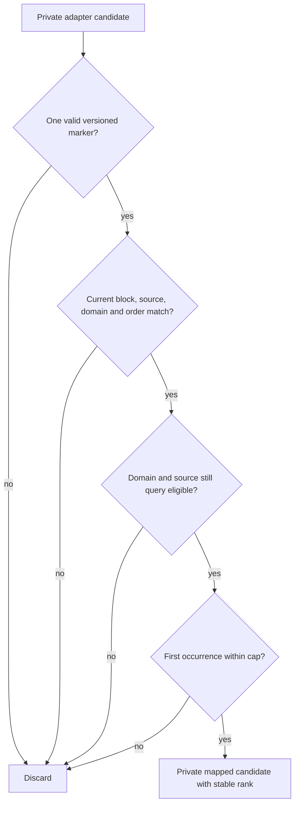

# Scoped Retrieval Provenance - Plan

## Goal Capsule

- **Objective:** Complete master-build-plan slice P6-01 by establishing a bounded, one-domain scoped-retrieval port that maps only current authorized local Source Blocks from private LightRAG candidates.
- **Authority:** Root `AGENTS.md`, `docs/master-build-plan.md` P6-01, FR-05 in `docs/prd.md`, `docs/contracts/document-and-evidence-contract.md`, and the scoped-retrieval/privacy rules in `docs/architecture/data-and-lifecycle.md`.
- **Execution profile:** Internal backend slice with deterministic unit coverage and PostgreSQL 16 race evidence; no migration or public contract change is planned.
- **Stop conditions:** Stop if native LightRAG cannot preserve unambiguous versioned block provenance, if implementation needs a public field/error outside approved contracts, or if freshness cannot be proven across the external-call boundary.
- **Tail ownership:** P6-02 owns the public Evidence DTO, citation ordering, excerpts/labels/anchors/document refs, and HTTP failure projection; P7 owns chat orchestration and grounded refusal.

---

## Product Contract

### Summary

P6-01 turns the existing lifted retrieval scaffold into a proven internal boundary: one eligible domain enters, a bounded private candidate set returns, and only candidates with exact current local provenance survive. Raw hits, provider payloads, public Evidence projection, and chat behavior remain outside this slice.

### Problem Frame

The codebase already renders `CE_SOURCE` and `CE_BLOCK` markers and contains an unproven mapper in `app/context_engine/services/evidence.py`. That scaffold does not yet earn P6-01 credit: retrieval remains coupled to the indexing protocol, the local adapter is not bounded, no focused mapper tests exist, and post-call mapping can reuse stale ORM objects because sessions use `expire_on_commit=False`.

The missing proof is security-sensitive. A source or domain may be fenced while LightRAG is running, provider text may contain malformed or injected marker-like content, and one adapter may return candidates outside the selected domain or beyond its advertised top-k. Every such candidate must be discarded without exposing or persisting the raw hit.

### Requirements

**Scope and bounded execution**

- R1. A retrieval operation accepts exactly one server-selected domain and starts external work only when the domain is running, runtime-ready, free of conflicting lifecycle operations, and has at least one current query-eligible source.
- R2. One server-owned deadline covers admission wait, adapter execution, cancellation, and result normalization. The service admits work through bounded process-level global and per-domain gates, rejects saturation with a retrieval-specific typed failure, limits results to 10 candidates, and enforces configurable per-candidate and aggregate encoded-byte limits before marker parsing or database work. Adapters apply the same limits before materializing their result as defense in depth.
- R3. The indexing lifecycle protocol and scoped-retrieval protocol are separate typed boundaries, while the local and native LightRAG adapters may implement both.

**Provenance and freshness**

- R4. Every indexed block uses a self-contained schema-v2 first-line provenance envelope containing the source ID, source content SHA-256, block ID, and block order. A candidate maps only when that exact envelope is preserved and matches an existing Source Block and the selected domain. Schema-v1 ready content is ineligible for P6 retrieval until it has been reindexed under schema v2; no compatibility heuristic is permitted.
- R5. Before the external call, the service freezes the domain lifecycle/runtime generation and every eligible source's preparation/index generation, current index request ID, indexed content hash, and source content SHA-256. After the call it validates all surviving identities and maps blocks through one joined SQL statement so one PostgreSQL snapshot proves that the frozen state still exists. Stop/restart, reindex/new-ready, delete, preparation replacement, or source ineligibility during the call discards the affected result.
- R6. A malformed result envelope, wrong candidate type, invalid encoding, or payload that cannot be safely bounded is a typed dependency failure. Within an otherwise valid bounded result, a candidate with malformed, multiple, injected, missing, source-order-mismatched, unmapped, cross-domain, stale, or empty-block provenance is discarded without fuzzy fallback.
- R7. Valid candidates preserve adapter order after filtering and deduplication and receive dense survivor ranks starting at 1 for P6-02; an all-discarded or no-hit result is an empty mapped result.

**Privacy and failures**

- R8. The member question is content-sensitive and exists only as call-scoped adapter input. Raw LightRAG hits and provider payloads remain inside the private adapter/service boundary. Questions and raw dependency content never enter public DTOs, product persistence, logs, audit rows, traces, snapshots, captured real-provider fixtures, failure artifacts, or failure messages. Deterministic synthetic private adapter-input fixtures may contain invented questions, opaque IDs, and candidate payloads solely to test the internal boundary.
- R9. Timeout, unavailable runtime, and malformed dependency output become retrieval-specific typed internal failures; this slice does not add public HTTP error codes.
- R10. Concurrent requests for the same domain keep query, candidate, and mapped-result context isolated.

### Acceptance Examples

- **AE1 — Exact mapping:** Given a running domain with one prepared, ready, current source, when the adapter returns one candidate with the source block's exact marker, then the mapper returns one private candidate with that block/source linkage and rank 1.
- **AE2 — Mixed hostile candidates:** Given valid, unmapped, wrong-domain, duplicate, mismatched-order, and multiple-marker candidates, when mapping runs, then only the first valid occurrence survives and no raw candidate text appears outside the port.
- **AE3 — Fence during retrieval:** Given a source or domain that becomes unavailable while the adapter is running, when retrieval returns, then fresh post-call reads discard its candidates.
- **AE4 — Adapter overrun:** Given an adapter that returns more than 10 candidates or exceeds an individual/aggregate encoded-byte limit, when the service handles the response, then count overrun considers at most the first 10 candidates, while an unsafe payload shape or byte overrun becomes a safe typed dependency failure before marker parsing or database work.
- **AE5 — Concurrent isolation:** Given two members querying the same eligible domain concurrently, when adapters return distinct candidate sets, then each call maps only its own candidates and neither result contains the other's linkage.

### Scope Boundaries

#### Deferred to Follow-Up Work

- P6-02: full `EvidenceItemDto`, safe labels/excerpts, document refs, anchors, citation ordering, member route behavior, and closed HTTP failure mapping.
- P7: intent classification, bounded repair/retrieval orchestration, persistence, grounded refusal, and SSE events.
- P8: broad cross-sink privacy scans and operational telemetry coverage.
- P9: Evidence panel and document navigation.

#### Outside This Slice

- No database migration, per-domain ACL model, second retrieval stack, provider retry loop, browser-selectable retrieval mode/budget, or ungrounded fallback. The schema-v2 handoff rollout requires deterministic reindexing of existing schema-v1 ready test/development content; it must not silently treat schema-v1 content as current.
- No completion credit from the existing `POST /domains/{domainId}/evidence` response or the P7-owned `P6RetrievalPort` scaffold in `app/context_engine/services/chat_turns.py`.

---

## Planning Contract

### Key Technical Decisions

- KTD1. **The service owns scope and reauthorization.** The adapter receives one already selected domain and query, performs bounded external work, and never authorizes, chooses a domain, or maps public Evidence. This follows the scoped-retrieval outbound-port contract in `docs/architecture/data-and-lifecycle.md` and governs R1, R3, R5, and R10.
- KTD2. **Provenance mapping is exact, self-contained, and fail-closed.** Render a schema-v2 first-line block envelope (`schema`, `source_id`, `source_sha256`, `block_id`, `order`) that local/native retrieval must preserve. Parse only that anchored line and reject a second reserved provenance token anywhere in the candidate body; never infer identity from filename, canonical text, provider rank, or fuzzy matching. Bumping the handoff changes its content hash, so schema-v1 ready sources must be reindexed before retrieval. This follows `docs/contracts/document-and-evidence-contract.md` and governs R4 and R6.
- KTD3. **Freshness compares frozen identities in one post-call database snapshot.** Freeze domain lifecycle/runtime generation and source preparation/index generation, current request ID, indexed content hash, and content SHA-256 before provider work. After retrieval, use one joined SQL statement with all frozen domain/source/block predicates; do not compose freshness from identity-map objects or multiple `READ COMMITTED` snapshots. This closes the `expire_on_commit=False`, stop/restart, and reindex/new-ready races and governs R5.
- KTD4. **The service owns admission, deadline, count, and byte bounds.** A bounded process-local global gate and keyed per-domain gate use the same monotonic deadline as native lock acquisition and the async query. Saturation and timeout are typed safe failures; a timed-out/late result is discarded, cancellation/loop cleanup is bounded, and no worker thread or native global lock may outlive the call. Adapters enforce the 10-candidate, per-candidate byte, and aggregate byte limits before result construction, while the service revalidates the closed result shape and bounds. This governs R2, R6, R7, and R10.
- KTD5. **P6-01 returns private mapped candidates, not partial public Evidence.** The result contains private source/block linkage and rank plus only the canonical values P6-02 needs to create its safe projection. Public labels, excerpts, refs, anchors, citations, and HTTP codes remain P6-02-owned. This governs R7-R9.

### High-Level Technical Design

```mermaid
sequenceDiagram
  participant S as Scoped retrieval service
  participant DB as PostgreSQL
  participant P as Retrieval port
  S->>DB: freeze domain/source generation and index identities
  S->>P: admit one domain; query under one deadline and byte/count bounds
  P-->>S: bounded private typed candidates
  S->>DB: one joined query with frozen predicates
  DB-->>S: one current provenance/state snapshot
  S-->>S: exact marker match, fence checks, dedupe, rank
  S-->>S: discard raw candidates
```



### Assumptions

- P5-02 owns the handoff renderer; P6-01 may version that private handoff to schema v2 without changing canonical Source Block semantics or any public DTO.
- Ten candidates is the P6-01 hard cap because the native adapter already requests top-k 10; changing this value later remains server-only configuration and cannot alter public contracts.
- P6-01 can close without a migration because all required linkage and eligibility state already exists in `domains`, `source_documents`, and `source_blocks`.
- Retrieval limits are server-only positive settings with conservative defaults; changing them cannot alter public contracts.

### Risks and Dependencies

- Native LightRAG may transform or omit the schema-v2 envelope. If fixture/native evidence cannot prove exact preservation, the repository stop condition requires an explicit decision rather than a heuristic.
- Marker-like canonical content can create ambiguous provenance. Adversarial tests must prove multiple or malformed markers fail closed.
- ORM identity-map reuse can defeat post-call fencing. PostgreSQL barrier tests must mutate source/domain state from a separate transaction before mapping resumes.
- Batch mapping must preserve adapter order after database retrieval; database row order must not become retrieval rank.
- P6-01 depends on the P5-02 handoff and P5-03 query-eligibility rules remaining green.

---

## Implementation Units

### U1. Inventory the lifted retrieval seam

- **Goal:** Record the mandatory retain/modify/defer decisions before code changes.
- **Requirements:** R1-R10.
- **Dependencies:** None.
- **Files:** `docs/_scratch/p6-01-scoped-retrieval-inventory.md`, `docs/brownfield-refactor-register.md`.
- **Approach:**
  1. Inventory call sites in `services/evidence.py`, `services/indexing.py`, `services/chat_turns.py`, API routes, application wiring, and tests.
  2. Mark P5 renderer/eligibility/timeout behavior retain-and-reverify; mark the conflated protocol, stale mapper, unbounded local retrieval, and P7 wrapper modify/defer as appropriate.
  3. Pin P6-02/P7 exclusions and the native-provenance stop condition.
- **Patterns to follow:** `docs/_scratch/p5-03-index-eligibility-inventory.md`.
- **Test scenarios:** Test expectation: none — this unit records the brownfield disposition required before implementation.
- **Verification:** The inventory names every current call site, disposition, owning requirement/case, proof boundary, and residual owner.

### U2. Establish the bounded scoped-retrieval port

- **Goal:** Separate retrieval from index lifecycle and normalize local/native adapters behind a bounded private protocol.
- **Requirements:** R1-R3, R8-R10; KTD1 and KTD4.
- **Dependencies:** U1.
- **Files:** `app/context_engine/services/evidence.py`, `app/context_engine/services/indexing.py`, `app/context_engine/config.py`, `app/tests/test_scoped_retrieval.py`, `app/tests/test_lightrag_renderer_adapter.py`.
- **Approach:**
  1. Define retrieval-specific candidate/result/failure types and a scoped-retrieval protocol in the P6-owned service boundary.
  2. Remove retrieval ownership from the index lifecycle protocol while allowing the existing local/native clients to satisfy both structural protocols.
  3. Add retrieval-specific timeout, global/per-domain admission, candidate-count, per-candidate byte, and aggregate-byte settings. Make one monotonic deadline include gate/native-lock wait, async query, cancellation, and cleanup; discard late completion.
  4. Align local/native adapters with the same count and byte limits before tuple/result construction, then revalidate the closed result shape at the service boundary.
  5. Keep questions and raw candidate payloads private and translate adapter/index internals into retrieval-specific failures before they reach callers.
- **Execution note:** Start with failing unit tests for adapter overrun, typed failures, and single-domain invocation.
- **Patterns to follow:** Typed outbound protocols and safe adapter failures in `app/context_engine/adapters/parsers.py` and `app/context_engine/services/indexing.py`.
- **Test scenarios:**
  1. A local/native fixture receives only the requested domain and query and returns at most 10 private candidates.
  2. An adapter returning 11 or more candidates causes only the first 10 to enter mapping.
  3. Admission saturation, lock/adapter timeout, unavailable runtime, malformed result envelopes, wrong candidate types, and individual/aggregate byte overruns return retrieval-specific failures without question/raw/provider content.
  4. Empty and whitespace-only queries fail before provider work under the existing validation boundary.
  5. Two concurrent service calls using distinct fixture responses do not mix candidate lists.
- **Verification:** Focused unit tests prove the separated protocol, stable bound, typed error translation, and request isolation without changing OpenAPI.

### U3. Make provenance mapping exact and fresh

- **Goal:** Replace stale per-hit ORM lookup with bounded, snapshot-current provenance mapping.
- **Requirements:** R4-R8, R10; KTD2, KTD3, and KTD5.
- **Dependencies:** U2.
- **Files:** `app/context_engine/services/evidence.py`, `app/tests/test_scoped_retrieval.py`, `app/tests/test_postgres_scoped_retrieval.py`.
- **Approach:**
  1. Version the private LightRAG handoff to a self-contained schema-v2 first-line block envelope and prove local/native preservation; refuse schema-v1 candidates and document the required reindex rollout.
  2. Parse only the anchored first line, reject any additional reserved provenance token in the body, and extract/deduplicate only bounded identities.
  3. Freeze domain lifecycle/runtime generation and eligible-source preparation/index generation, request ID, index content hash, and content SHA-256 before the call.
  4. Validate selected-domain ownership, source order, every frozen identity, current eligibility, and block identity with one joined post-call SQL statement.
  5. Rebuild surviving candidates in adapter order with dense survivor ranks; do not derive public labels/excerpts or persist raw hit text.
- **Execution note:** Add characterization/adversarial unit coverage before replacing the lifted mapper, then prove the fence race with PostgreSQL transaction barriers.
- **Patterns to follow:** Current-generation checks in `source_is_query_eligible`, P5 PostgreSQL barrier fixtures, and allowlist projection rules in `docs/architecture/data-and-lifecycle.md`.
- **Test scenarios:**
  1. Exact block ID/order/source/domain provenance maps one candidate with rank 1.
  2. Missing block/source, wrong domain, wrong source order, stale index request/generation, empty canonical content, and unmapped hits are discarded.
  3. A valid result with malformed/missing/ambiguous candidate provenance discards that candidate; an invalid/unbounded result envelope is a typed failure. Candidate text never substitutes for canonical source data.
  4. Duplicate block hits keep only the first provider-ranked candidate and surviving candidates retain relative order.
  5. More than 10 valid-looking candidates still produce at most 10 mapped candidates.
  6. PostgreSQL barriers prove stop/restart and reindex/new-ready cycles, plus stop, delete, and preparation replacement, before the original call returns; the single joined post-call query cannot assemble rows from different committed snapshots.
  7. Wrong-domain and `unmapped_hit` fault fixtures yield no mapped result, while a mixed set preserves only valid selected-domain candidates.
  8. Concurrent P6 calls map disjoint results for C-01 and do not share rank, query, or linkage.
- **Verification:** Unit and PostgreSQL tests prove one-domain isolation, exact provenance, stale-fence discard, deterministic order, no-hit behavior, and privacy at the real state boundary.

### U4. Rewire callers and record closure evidence

- **Goal:** Make current internal callers consume the P6-owned boundary without claiming P7/P6-02 behavior, then attach task-owned completion evidence.
- **Requirements:** R1-R10.
- **Dependencies:** U3.
- **Files:** `app/context_engine/services/chat_turns.py`, `app/tests/test_scoped_retrieval.py`, `docs/_scratch/p6-01-scoped-retrieval-evidence.md`, `docs/master-build-plan.md`.
- **Approach:**
  1. Remove or reduce the P7-owned concrete retrieval wrapper so current wiring delegates to the P6 service without duplicating eligibility/call/mapping logic.
  2. Leave the existing public route, partial DTO, registration, and failure projection untouched and explicitly P6-02-owned.
  3. Record commands, results, privacy/security decisions, applicable A-08/C-01/C-02 evidence, retained exclusions, and tested source revision.
  4. Mark P6-01 `DONE` only after all focused and regression gates pass.
- **Patterns to follow:** `docs/_scratch/p5-03-index-eligibility-evidence.md` and the P5 closure entry in `docs/master-build-plan.md`.
- **Test scenarios:**
  1. Existing P7/chat scaffold delegates to one P6 retrieval path and cannot bypass its cap or freshness checks.
  2. Registered routes and generated artifacts remain byte-identical because P6-01 adds no public contract.
  3. Privacy assertions use sentinel questions and raw hits to detect leakage in captured logs, exceptions, snapshots, and failure artifacts. Existing public responses remain unchanged; their P6-02 projection tests are not claimed here.
- **Verification:** Documentation evidence names the exact tested boundary and remaining P6-02/P7 gaps; master-plan status changes only after green proof.

---

## Verification Contract

| Gate | Command | Proves |
| --- | --- | --- |
| Focused unit | `cd app; .\.venv\Scripts\python.exe -m pytest tests/test_scoped_retrieval.py tests/test_lightrag_renderer_adapter.py tests/test_source_index_eligibility.py -q` | protocol split, cap, exact marker mapping, failures, local/native regression |
| PostgreSQL 16 | Set the approved disposable-database variables, then run `cd app; .\.venv\Scripts\python.exe -m pytest tests/test_postgres_scoped_retrieval.py tests/test_postgres_source_index_eligibility.py -q` | fresh state, stop/delete/replacement fences, cross-domain isolation, eligibility |
| Backend lint | `cd app; .\.venv\Scripts\python.exe -m ruff check context_engine/services/evidence.py context_engine/services/indexing.py context_engine/services/chat_turns.py context_engine/config.py tests/test_scoped_retrieval.py tests/test_postgres_scoped_retrieval.py` | Python correctness and style |
| Contract stability | `bash scripts/check-generated-contracts.sh` | P6-01 introduced no HTTP/DTO/SSE drift |
| Phase scope | `bash scripts/check-doc-phase-scope.sh` | no deferred Phase 2/3 surface entered Phase 1 |
| Regression | Run the applicable backend portion of `scripts/verify.sh`; document any unavailable Docker/frontend boundary rather than substituting weaker proof | current backend, contracts, scope, and integration seams remain green |

PostgreSQL concurrency tests use barriers/latches rather than sleeps. If the environment cannot run the approved disposable PostgreSQL 16 boundary, P6-01 remains incomplete rather than accepting SQLite or mocks as race evidence.

---

## Definition of Done

- [ ] U1-U4 are complete with no abandoned or duplicate retrieval scaffold left in the diff.
- [ ] One server-selected eligible domain is the only retrieval boundary and every adapter call/result is request-isolated.
- [ ] The service independently enforces admission, one end-to-end deadline, candidate count, and per-candidate/aggregate encoded-byte bounds.
- [ ] Exact versioned provenance maps only current selected-domain blocks and sources; all malformed, unmapped, cross-domain, duplicate, stale, or fenced candidates are discarded.
- [ ] Post-call PostgreSQL 16 tests prove stop/delete/replacement fences despite `expire_on_commit=False`.
- [ ] Questions and raw hits/provider payloads/private IDs do not appear in public responses, persistence, logs, traces, audit, captured real-provider fixtures, snapshots, failure artifacts, or failure text; synthetic private adapter fixtures remain allowed.
- [ ] P5-02 handoff and P5-03 eligibility regressions remain green.
- [ ] OpenAPI/DTO/SSE snapshots remain unchanged, or implementation stops for the owning P6-02 contract change.
- [ ] `docs/_scratch/p6-01-scoped-retrieval-evidence.md` records requirements/cases, changed files, exact commands/results, privacy and concurrency decisions, exclusions, and tested revision.
- [ ] `docs/master-build-plan.md` marks only P6-01 complete and leaves P6-02/P7/P8/P9 residuals with their approved owners.
