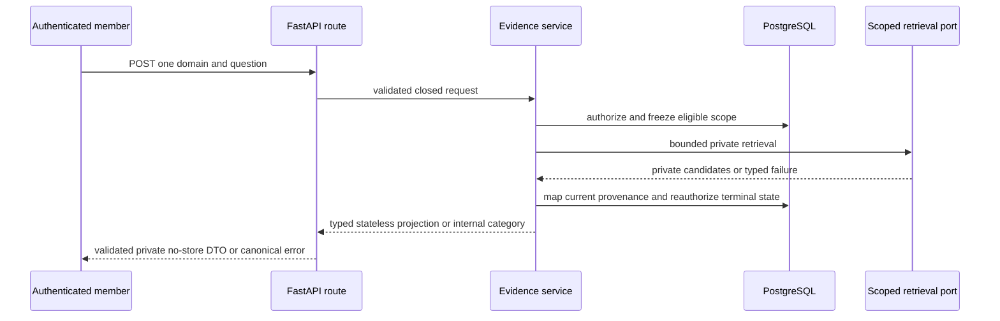
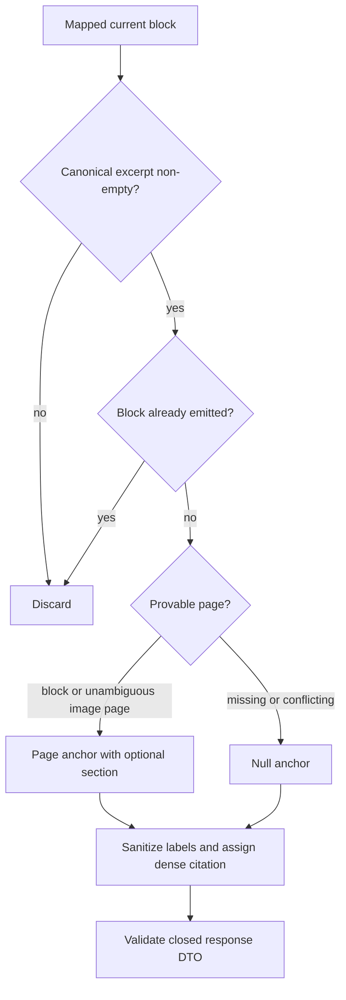

# Stateless Evidence Projection - Plan

## Goal Capsule

- **Objective:** Complete master-build-plan slice P6-02 by returning an authorized, closed, stateless Evidence projection from one scoped retrieval request without minting durable turn evidence references.
- **Authority:** Root `AGENTS.md`; the user-approved decision in `docs/_scratch/p6-02-evidence-contract-decision.md`; FR-05 in `docs/prd.md`; M-02, M-03, C-01, and C-02 in `docs/interaction-behavior-prd.md`; and the HTTP, DTO, document/Evidence, data-lifecycle, and quality contracts under `docs/`.
- **Execution profile:** Security-sensitive backend/API contract slice with generated-artifact synchronization, deterministic unit and HTTP proof, and PostgreSQL 16 lifecycle-fence evidence.
- **Stop conditions:** Stop if implementation requires a public evidence ID, private block/source identifier, fabricated page anchor, per-domain ACL model, or error code outside the approved contract.
- **Tail ownership:** P7 owns durable conversation/turn evidence refs, replay-stable citations, location resolution, and redaction. P9 owns document-viewer behavior.

---

## Product Contract

### Summary

P6-02 replaces the lifted two-field retrieval response with a generated, allowlisted stateless Evidence DTO. The endpoint remains read-only: it returns safe canonical projections for current authorized mapped blocks, or an explicit no-grounded-context result, without creating conversations, turns, evidence rows, composer refs, or navigation-capable evidence IDs.

### Problem Frame

P6-01 now proves bounded one-domain retrieval and exact current provenance mapping, but `POST /api/v1/domains/{domainId}/evidence` still emits a handwritten `{excerpt,sourceLabel}` item and forwards internal failure codes that are outside the closed HTTP vocabulary. The full `EvidenceItemDto` cannot be reused because its `id` is a persisted, owner-bound turn evidence ref and the endpoint is explicitly non-mutating.

Canonical blocks can prove text/table/figure kind, canonical excerpt, document ref, and sometimes page/section metadata. They cannot always prove a page and currently cannot prove normalized regions. The public projection must preserve that uncertainty rather than inventing a location.

### Key Decision

- KD1. **Use a distinct stateless retrieval projection.** (session-settled: user-approved — chosen over deferring the endpoint until P7 persistence: the approved read-only P6 capability needs safe Evidence now without manufacturing an unresolvable turn evidence ID.) This decision governs R1-R8.

### Requirements

**Closed contract and projection**

- R1. `POST /api/v1/domains/{domainId}/evidence` accepts only `{question}` with a trimmed length of 1..2,000 and returns only a generated closed `RetrievalEvidenceResponseDto`.
- R2. Each `RetrievalEvidenceItemDto` contains response-scoped `citationLabel`, sanitized `sourceLabel`, canonical `excerpt`, authoritative `kind`, opaque `documentRef`, sanitized `documentLabel`, and nullable closed `RetrievalEvidenceAnchorDto`; it contains no evidence ID, region, or private identifier.
- R3. `excerpt` collapses canonical whitespace before truncation to 500 characters, labels are non-empty and bounded by their safe public scalar limits, and the mapper never uses raw retrieval text as public content.
- R4. An anchor uses a provable block page plus optional bounded section, or an unambiguous linked-image page for a figure; region remains absent and any missing/conflicting page evidence yields `anchor:null`.

**Ordering and successful outcomes**

- R5. The response preserves the first valid mapped candidate for each block, assigns dense citation labels after filtering, and promises ordering stability only within that response.
- R6. A valid bounded retrieval with no surviving mapped Evidence returns `200 {"result":"no_grounded_context","evidence":[]}` only while the selected domain still has current eligible sources; `evidence_found` always contains at least one item and `no_grounded_context` always contains none.

**Authorization, failures, and privacy**

- R7. Every authenticated member or administrator may query a domain only while current domain/runtime/source query eligibility holds before and after dependency work; lifecycle or eligibility loss returns `409 domain_not_query_eligible`.
- R8. Unknown domains return `404 not_found`, retrieval saturation returns `503 capacity_unavailable`, dependency timeout/unavailability/malformed output returns `503 dependency_unavailable`, validation returns `422 validation_error`, and every success/error is `private, no-store` with the canonical request ID and no question, raw hit, private ID, provider detail, or exception text.

### Acceptance Examples

- AE1. **Ordered Evidence:** Given two current mapped blocks returned in provider order with a duplicate of the first, the response contains two safe items in first-occurrence order labeled `[1]` and `[2]`, uses document public refs, and exposes no private IDs.
- AE2. **Provable and unknown anchors:** Given a block with page/section metadata and another with no provable page, the first item carries a page/section anchor while the second has `anchor:null`; neither fabricates a region or page 1.
- AE3. **Grounded empty result:** Given a still-eligible domain whose bounded candidates all fail provenance mapping, the endpoint returns `200 no_grounded_context` with an empty Evidence array.
- AE4. **Fence wins:** Given a domain, runtime, or source that becomes ineligible while retrieval is active, the late result is not projected and the endpoint returns `409 domain_not_query_eligible`.
- AE5. **Safe dependency failure:** Given saturation, timeout, malformed dependency output, or a health-check exception, the response uses the approved safe code/envelope and contains no internal failure text or submitted question.

### Scope Boundaries

#### Deferred to Follow-Up Work

- P7-01 through P7-05: durable evidence refs, owner-bound persistence, replay-stable citation order, full `EvidenceItemDto`, location resolution, SSE evidence events, and redaction.
- P8: system-wide privacy scans beyond P6-02's endpoint-specific response, logging, tracing, audit, snapshot, fixture, failure-artifact, and persistence sentinel checks; service metrics; and resilience/load acceptance.
- P9: document library, governed preview, deep-link, and Evidence inspector behavior.

#### Outside This Slice

- No evidence-row mutation, new ACL/entity, block public ref, ephemeral evidence token, presigned content URL, region inference, fuzzy source mapping, retrieval retry loop, direct-LLM fallback, or browser behavior.

---

## Planning Contract

### Key Technical Decisions

- KTD1. **Generate a separate request/response component family.** (session-settled: user-approved — chosen over reusing `EvidenceItemDto`: the full DTO's persisted `id` semantics cannot apply to a stateless call.) Add closed `RetrievalEvidenceRequestDto`, no-region `RetrievalEvidenceAnchorDto`, `RetrievalEvidenceItemDto`, and `RetrievalEvidenceResponseDto` components beside the authoritative catalog models, and bind the route directly to them. Governs R1-R2, R6, and R8.
- KTD2. **Project only from the joined current block/source rows already proven by P6-01.** Extend the private mapped result with the canonical kind, document public ref, and conservative anchor inputs while raw candidates remain discarded. Reuse `sanitize_original_filename` defensively for legacy rows and validate the final response model before constructing the private JSON response. Governs R2-R5 and R8.
- KTD3. **Reauthorize the terminal state explicitly.** After dependency work, re-read current domain/source eligibility and runtime health before distinguishing a legitimate no-hit result from a lifecycle fence. A health result of unhealthy is domain ineligibility; a health-check exception is dependency failure. Governs R6-R8.
- KTD4. **Translate internal failures through an exhaustive route map.** Retrieval/service categories remain internal and `_evidence_api_error` maps every known category to the approved status/code/message. Unknown internal categories fail closed without forwarding their code or text. Governs R7-R8.
- KTD5. **Synchronize all generated consumers in one slice.** Contract docs, Pydantic components, OpenAPI, standalone JSON Schema, generated TypeScript, route response models, fixtures, and snapshot tests change together. Governs R1-R2 and R8.

### High-Level Technical Design

### Assumptions

- Phase 1 intentionally authorizes every authenticated member for every query-eligible domain; no domain-grant schema exists or is introduced.
- The sanitized filename is the approved source and document label until a separate safe title field is contracted.
- `source.public_ref` is already a random opaque public document ref and remains non-authorizing by itself.
- The approved nullable stateless anchor does not change the required non-null anchor on persisted `EvidenceItemDto`.

### System-Wide Impact

- **HTTP and generated consumers:** The registered route, authoritative component catalog, OpenAPI, standalone public schema, and generated browser types move together; SSE event payloads continue using durable `EvidenceItemDto`.
- **Authorization lifecycle:** P6-01 provenance freshness remains the mapping authority, while P6-02 adds a terminal query-eligibility decision before any public success.
- **Privacy and caching:** The new projection is content-sensitive but public-safe only after allowlist mapping; both success and failure remain private no-store and no mutation creates a new retention or redaction surface.
- **Downstream ownership:** P7 can consume the same internal mapped Evidence but must create separate owner-bound durable refs and snapshots rather than treating the stateless response as persisted state. The existing `app/context_engine/services/chat_turns.py` caller already uses this shared internal seam, so its contracted failure translation and durable Evidence persistence must remain unchanged during P6-02.

### Risks and Dependencies

| Risk | Mitigation |
| --- | --- |
| A second post-call eligibility pass could misclassify a valid no-hit or bypass P6-01 fences. | Reuse current eligibility predicates after mapping; compare the retrieval-frozen domain generation/runtime identity and each source identity tuple against current rows; keep provenance filtering authoritative; and prove each lifecycle/generation outcome with PostgreSQL barriers. |
| Figure image metadata may name conflicting pages. | Emit an image-derived page only when every usable linked image agrees; otherwise emit `anchor:null`. |
| `JSONResponse` can bypass FastAPI response-model validation and leak an added field. | Validate the complete authoritative response DTO before constructing the private response, then assert exact keys with private-field sentinels. |
| Internal exception chaining or error categories could expose dependency text. | Normalize service categories before the route boundary, map exhaustively to fixed public messages, and scan bodies/log captures/tracebacks used as test artifacts. |
| A shared cache could replay one member's content-sensitive projection. | Require the existing private no-store helper on success and canonical no-store error handler on failure; assert headers for every terminal class. |
| Generated HTTP and standalone schema artifacts can drift independently. | Regenerate all six artifacts and run live plus adversarial stale-artifact gates before closure. |
| SQLite or mocks could give false confidence about terminal authorization. | Require the approved PostgreSQL 16 barrier and cross-domain concurrency proof for P6 completion. |

---

## Implementation Units

### U1. Approve and generate the stateless Evidence contract

- **Goal:** Replace the decision gate with synchronized normative and generated public schemas.
- **Requirements:** R1-R2, R4, R8; KD1.
- **Dependencies:** None.
- **Files:** `docs/contracts/http-api-catalog.md`, `docs/contracts/dto-schema-catalog.md`, `docs/contracts/document-and-evidence-contract.md`, `docs/_scratch/p6-02-evidence-contract-decision.md`, `docs/phase-scope-manifest.md`, `app/context_engine/api/catalog_schemas.py`, `app/tests/test_authoritative_dto_components.py`, `app/tests/test_generated_contract_gate.py`, `app/contracts/openapi.json`, `app/contracts/public-dtos.schema.json`, `app/contracts/sse-events.openapi.json`, `app/contracts/sse-events.schema.json`, `app/client/src/lib/api/generated/openapi.ts`, `app/client/src/lib/api/generated/sse.ts`.
- **Approach:**
  1. Amend the three normative catalogs with the approved stateless item/result, nullable-anchor semantics, successful result enum, and exact failure table.
  2. Add authoritative Pydantic request/anchor/item/result components with closed fields, camelCase aliases, bounded scalars, trim-before-bounds question validation, a stateless anchor that cannot carry a region or `fallback:"region"`, and a response-level result/Evidence consistency invariant.
  3. Register the new public components and regenerate every affected artifact instead of hand-editing generated output.
- **Execution note:** Start with failing authoritative-component and generated-contract assertions before changing the catalog models.
- **Patterns to follow:** `EvidenceItemDto`, `EvidenceAnchorDto`, and `authoritative_component_schemas` in `app/context_engine/api/catalog_schemas.py`; P0 generated-contract gates.
- **Test scenarios:**
  1. The request schema accepts only `question`, trims before applying the contracted bounds, accepts padded normalized values at lengths 1 and 2,000, and rejects unknown fields.
  2. The item schema has exactly the approved seven fields, no `id`, and a nullable `RetrievalEvidenceAnchorDto` that rejects regions and `fallback:"region"`.
  3. The result schema allows only `evidence_found` or `no_grounded_context`, contains only the result and Evidence array, and rejects both result/Evidence contradictory pairings.
  4. OpenAPI, standalone JSON Schema, and generated TypeScript contain the same component shapes with no handwritten substitute.
- **Verification:** All authoritative-component tests and generated snapshot comparisons agree with the amended catalogs.

### U2. Build the safe projection and terminal reauthorization

- **Goal:** Convert P6-01 private mapped rows into deterministic safe stateless Evidence only while the selected scope remains eligible.
- **Requirements:** R2-R8; KTD2-KTD3.
- **Dependencies:** U1.
- **Files:** `app/context_engine/services/evidence.py`, `app/context_engine/services/chat_turns.py`, `app/tests/test_scoped_retrieval.py`, `app/tests/test_postgres_scoped_retrieval.py`, `app/tests/test_canonical_turn_event_behavior.py`.
- **Approach:**
  1. Carry canonical kind, opaque document ref, sanitized labels, and block/image anchor inputs through the private joined mapping without retaining raw candidate text.
  2. Derive a page/section anchor conservatively, normalize/truncate canonical excerpts, deduplicate by block, and assign citations after all filtering.
  3. Reauthorize domain/runtime/source eligibility after retrieval. Compare the frozen domain generation/runtime identity and every frozen eligible-source identity tuple (source ref, source state, index generation, and preparation generation) with the current rows; any mismatch that invalidates the retrieval scope is internal domain ineligibility rather than a valid empty mapping.
  4. Reuse the already-resolved controller for the terminal health check, classify unhealthy separately from a thrown health dependency error, and avoid a second retrieval call.
  5. Return an internal typed projection/result for the route; keep public HTTP codes outside the service.
  6. Preserve the existing chat-turn caller's durable Evidence persistence and safe error translation when adapting shared internal result or error categories.
- **Execution note:** Add characterization and adversarial unit coverage before replacing the lifted two-field mapper, then add PostgreSQL barriers for terminal authorization races.
- **Patterns to follow:** P6-01 joined post-call provenance query and barrier fixtures; `sanitize_original_filename` in `app/context_engine/services/sources.py`.
- **Test scenarios:**
  1. Covers AE1. Mixed valid, duplicate, empty, and unmapped candidates produce dense first-occurrence order with canonical content and public document refs.
  2. Covers AE2. Text/table block page and bounded section project safely; figure image pages project only when unambiguous; conflicting/missing pages and section-without-page return a null anchor.
  3. Canonical whitespace is collapsed before the 500-character limit and control-character/empty legacy filenames become non-empty bounded safe labels.
  4. Covers AE3. All-discarded candidates return no grounded context only when current eligible sources remain.
  5. Covers AE4. Post-call domain stop/delete/active operation, runtime unhealthy result, source state/index/preparation generation change, or loss of all eligible sources becomes internal domain ineligibility.
  6. A post-call runtime health exception becomes an internal dependency failure and never exposes exception text.
  7. The existing chat-turn path still translates retrieval failures and persists durable Evidence exactly as its current contract requires.
- **Verification:** Unit tests prove mapping/anchors/order/limits; PostgreSQL 16 barriers prove terminal state wins over late retrieval.

### U3. Adopt the closed HTTP boundary

- **Goal:** Make the registered member route validate the authoritative DTO and exhaustively translate safe failures.
- **Requirements:** R1, R6-R8; KD1, KTD1, and KTD4.
- **Dependencies:** U1-U2.
- **Files:** `app/context_engine/api/routes.py`, `app/tests/test_evidence_http_contract.py`, `app/tests/test_api_conventions.py`, `app/tests/test_csrf_and_request_security.py`.
- **Approach:**
  1. Remove the handwritten Evidence request/response models and bind the route to the authoritative generated component classes.
  2. Validate the final response model before using the private no-store JSON helper.
  3. Map every internal retrieval category to the approved status/code/message and fail closed for unexpected categories.
  4. Preserve current session, Origin, CSRF, request-ID, validation-envelope, and administrator-inherits-member behavior.
- **Execution note:** Begin with an authenticated HTTP contract test that fails on the lifted two-field response and non-contract error code.
- **Patterns to follow:** `_private_json_response`, capability-specific route error mappers, and request-security fixtures in `app/tests/`.
- **Test scenarios:**
  1. Member and administrator requests return the exact closed DTO and `Cache-Control: private, no-store, no-transform`.
  2. Unauthenticated, disabled-user, revoked-session, expired-session, hostile-Origin, missing/invalid CSRF, whitespace-only, normalized-over-2,000-character, padded normalized 1/2,000-character, and unknown-field requests return the contracted result; authoritative identity denials occur before any retrieval dependency call.
  3. Covers AE5. Unknown domain, current ineligibility, saturation, dependency timeout/unavailability/malformed output, health exception, and unexpected internal category map to only approved codes without internal text.
  4. A response containing an extra/private field, a stateless region, `fallback:"region"`, or a result/Evidence contradiction fails validation instead of being serialized, and validation failure does not echo the invalid value.
  5. Success and every error class carry private no-store headers so an identity-sensitive projection cannot be reused from a shared cache.
  6. The request leaves conversation, turn, evidence-ref, composer-ref, and audit mutation counts unchanged.
- **Verification:** Real app/TestClient tests prove authentication, request security, strict response shape, failure translation, request-ID correlation, and no mutation.

### U4. Prove integration and close P6

- **Goal:** Establish full task-owned evidence, remove the decision blocker, and hand a clean P6 boundary to P7.
- **Requirements:** R1-R8 and AE1-AE5.
- **Dependencies:** U1-U3.
- **Files:** `app/tests/test_postgres_scoped_retrieval.py`, `app/tests/test_generated_contract_gate.py`, `docs/_scratch/p6-02-evidence-inventory.md`, `docs/_scratch/p6-02-evidence.md`, `docs/master-build-plan.md`.
- **Approach:**
  1. Record retain/modify/defer dispositions for the lifted route, service projection, generated components, and P7-owned durable evidence seams.
  2. Run focused unit/HTTP/PostgreSQL proof, generated contract gates, privacy assertions, phase-scope checks, and applicable backend regressions.
  3. Record exact commands/results, tested revision, remaining P7/P8/P9 owners, and the Windows-only boundary of any unavailable gate.
  4. Mark P6-02 and phase P6 `DONE` only after all applicable evidence is green.
- **Patterns to follow:** `docs/_scratch/p6-01-scoped-retrieval-inventory.md`, `docs/_scratch/p6-01-scoped-retrieval-evidence.md`, and prior closure entries in `docs/master-build-plan.md`.
- **Test scenarios:**
  1. PostgreSQL concurrent selected-domain requests retain independent order, refs, and projections with no cross-domain leakage.
  2. Contract artifacts regenerate byte-identically after the committed update.
  3. Privacy sentinels for the submitted question, raw hit, private source/block IDs, object key, dependency exception, safe excerpt, and document label are scanned across responses, logs, audit rows, traces, metrics, snapshots, fixtures, failure artifacts, and persisted mutation surfaces. Forbidden sentinels are absent everywhere; the safe excerpt and document label appear only in the authorized response. Any non-applicable sink has an explicit boundary reason in the closure evidence.
  4. P5 indexing eligibility and P6-01 provenance/fence regressions remain green.
- **Verification:** Closure evidence names every requirement/case, green gate, exclusion, and residual owner; the master tracker advances only P6.

---

## Verification Contract

| Gate | Command | Proves |
| --- | --- | --- |
| Focused service and HTTP | `cd app; .\.venv\Scripts\python.exe -m pytest tests/test_scoped_retrieval.py tests/test_evidence_http_contract.py tests/test_authoritative_dto_components.py tests/test_generated_contract_gate.py tests/test_canonical_turn_event_behavior.py -q` | projection, anchors, ordering, strict HTTP/DTO boundary, generated component adoption, and shared chat-turn Evidence persistence/error translation |
| PostgreSQL 16 | With the approved disposable-database variables set: `cd app; .\.venv\Scripts\python.exe -m pytest tests/test_postgres_scoped_retrieval.py -q` | current-snapshot mapping, terminal lifecycle/source fences, concurrency isolation |
| Retrieval regressions | `cd app; .\.venv\Scripts\python.exe -m pytest tests/test_lightrag_renderer_adapter.py tests/test_source_index_eligibility.py tests/test_postgres_source_index_eligibility.py -q` | P5 renderer/index eligibility and P6-01 boundary remain intact |
| Backend lint | `cd app; .\.venv\Scripts\python.exe -m ruff check context_engine/api/catalog_schemas.py context_engine/api/routes.py context_engine/services/evidence.py context_engine/services/chat_turns.py tests/test_scoped_retrieval.py tests/test_evidence_http_contract.py tests/test_postgres_scoped_retrieval.py tests/test_authoritative_dto_components.py tests/test_generated_contract_gate.py tests/test_canonical_turn_event_behavior.py` | Python correctness and style for the slice |
| Generated contracts | `& 'C:\Program Files\Git\bin\bash.exe' scripts/check-generated-contracts.sh` | OpenAPI, JSON Schema, SSE generation views, and TypeScript are synchronized |
| Phase scope | `& 'C:\Program Files\Git\bin\bash.exe' scripts/check-doc-phase-scope.sh` | no Phase 2/3 or unapproved capability enters Phase 1 |
| Broad regression | Run the applicable backend portion of `scripts/verify.sh` and record any environment-boundary exclusion rather than substituting weaker evidence | current backend/application contracts remain green |

PostgreSQL concurrency tests use barriers/latches rather than sleeps. If the approved disposable PostgreSQL 16 boundary is unavailable, P6-02 remains incomplete.

---

## Definition of Done

- [x] U1-U4 are complete with no handwritten competing retrieval DTO or abandoned projection path.
- [x] The endpoint remains stateless and emits no evidence ID, private ID, raw hit, or fabricated anchor.
- [x] Every item uses canonical content, sanitized labels, opaque document refs, nullable provable anchors, deterministic deduplication, and dense response-scoped citations.
- [x] Pre/post authorization proves current selected-domain/runtime/source eligibility, including PostgreSQL lifecycle and generation races.
- [x] Every public failure uses the approved status/code/message envelope with request-ID correlation and private no-store caching.
- [x] OpenAPI, public JSON Schema, SSE generation artifacts, and generated browser types are synchronized and verified.
- [x] PostgreSQL 16 retrieval and lifecycle-race proof passes; focused unit, HTTP, indexing/retrieval regression, lint, privacy, phase-scope, and applicable broad gates pass or carry an explicit authoritative environment boundary only where that gate permits one.
- [x] Decision-gate documentation is resolved in place; P7 remains the sole owner of durable evidence refs, location resolution, replay, and redaction.
- [x] `docs/_scratch/p6-02-evidence-inventory.md` and `docs/_scratch/p6-02-evidence.md` identify the exact tested revision and remaining owners.
- [x] `docs/master-build-plan.md` marks only P6/P6-02 complete after the evidence record is final.
- [x] Dead-end or experimental code introduced during implementation is removed before closure.
