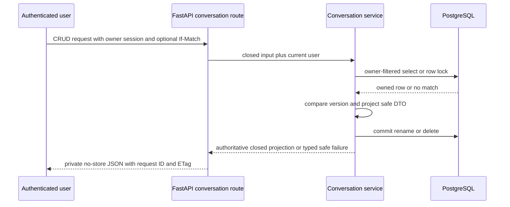

# Conversation Ownership and Durable Turn Foundations - Plan

## Goal Capsule

- **Objective:** Complete master-build-plan slice P7-01 by reconciling the lifted chat persistence with the approved Phase 1 schema, exposing strict owner-scoped conversation CRUD, and proving that durable turns and Evidence references remain private, opaque, and correctly isolated.
- **Authority:** Root `AGENTS.md`; FR-06 and the closed Phase 1 chat capability manifest in `docs/prd.md`; M-03, M-06, M-08, M-10, M-11, and C-04 in `docs/interaction-behavior-prd.md`; the conversation rows in `docs/contracts/http-api-catalog.md`, `docs/contracts/dto-schema-catalog.md`, and `docs/database-schema.txt`; and the data-lifecycle and quality contracts under `docs/`.
- **Execution profile:** Security-sensitive PostgreSQL/API vertical slice with a forward Alembic migration, strict generated DTO adoption, deterministic service/HTTP tests, and real PostgreSQL ownership/concurrency evidence.
- **Readiness checkpoint:** Implementation-ready after the user-approved 2026-07-26 D1-D6 amendment: nested detail envelope, persisted versions, global `(createdAt,id)` pagination, closed conversation audit events, explicit create-idempotency deferral, and dedicated public conversation/turn refs.
- **Stop conditions:** Stop if the slice requires exposing database IDs, raw retrieval/provider data, administrator access to member conversations, a new public field/error/endpoint, or implementing the separately deferred shared durable `Idempotency-Key` store.
- **Tail ownership:** P7-02 owns server intent classification; P7-03 owns bounded retrieval/synthesis orchestration; P7-04 owns sealed SSE, attach/replay/cancel, and terminal event persistence; P7-05 owns source/domain redaction integration. P7-01 may change those lifted seams only to replace private conversation/turn IDs at every current HTTP/SSE boundary and to add the shared parent lock required for delete/submit serialization; all later behavioral semantics remain pinned.

---

## Product Contract

### Summary

P7-01 establishes the authoritative member-owned conversation boundary before later chat execution work. An authenticated user can create, list, open, rename, and delete only their own conversations through closed camelCase DTOs. Conversation detail safely projects existing durable turns and owner-bound Evidence references without exposing private linkage. Mutations use the contracted optimistic version, ownership is rechecked in the committing transaction, and delete serializes against turn creation so the database cannot retain an orphan turn.

### Problem Frame

The brownfield tree already contains conversation, turn, event, Evidence-reference, and composer-reference models plus pilot CRUD and streaming routes. Those seams are implementation evidence, not P7 completion: conversation responses omit the contracted `version`, CRUD routes are not bound to authoritative response models, authenticated responses do not consistently use the private no-store boundary, rename/delete ignore `If-Match`, list omits the closed paging envelope, and the current read/delete paths do not prove indistinguishable cross-owner behavior or submission/delete serialization at PostgreSQL 16.

The baseline and follow-up migrations already contain most chat tables and opaque Evidence refs. P7-01 must retain useful schema rather than recreate it, add only the missing conversation concurrency field required by the approved DTO/HTTP contracts, and leave orchestration/SSE semantics to their named later tasks.

### Requirements

**Persistence and opaque references**

- R1. The migration chain and SQLAlchemy models reproduce the approved `conversations`, `conversation_turns`, and `conversation_turn_evidence_refs` ownership, public-ref, route/domain, status, ordering, redaction, uniqueness, foreign-key, and index invariants on PostgreSQL 16.
- R2. Conversations carry a positive monotonically increasing optimistic `version` used by the approved `ConversationSummaryDto` and strong `ETag`; rename increments it exactly once and delete compares it while holding the authoritative row lock.
- R3. Public conversation, turn, and Evidence identifiers use their dedicated `public_ref` columns only. Turn Evidence projections use `conversation_turn_evidence_refs.public_ref`; private row IDs, conversation owner IDs, source/block IDs, trace IDs, raw events, and redacted labels/excerpts never cross the API boundary.

**Owner-scoped CRUD**

- R4. `POST /api/v1/conversations` accepts only the optional closed `{title}` input, normalizes the title to null or 1..120 safe characters, creates a conversation owned by the current authenticated user, and returns `201 {conversation}` with a strong `ETag`.
- R5. `GET /api/v1/conversations` returns only the current user's rows in stable `(createdAt,id)` order as `{conversations,nextCursor}`; its versioned cursor carries only the prior public conversation ref, re-resolves it under the current owner, and returns `cursor_expired` when malformed, deleted, or cross-owner.
- R6. `GET /api/v1/conversations/{conversationId}` returns the nested `ConversationDetailResponseDto` only to the owner, orders turns deterministically, maps domain and durable Evidence through approved DTOs, and projects redacted turns with no answer, Evidence, accepted refs, or private error detail.
- R7. `PATCH /api/v1/conversations/{conversationId}` and `DELETE /api/v1/conversations/{conversationId}` require `If-Match`; missing preconditions return `428`, stale revisions return `409 stale_revision`, and successful rename/delete reauthorize ownership inside the transaction.
- R8. Unknown and other-owned conversation refs use the same canonical `404 not_found` envelope and no observable response field reveals whether another user's row exists. Administrator role grants no implicit conversation access.

**Concurrency, privacy, and contract synchronization**

- R9. Rename races serialize so only a request holding the current version commits. Delete/delete converges to one `204` plus an indistinguishable not-found outcome, and delete/turn-insert races yield either a committed turn in a live conversation or a rejected insert, never an orphan. Every mutation revalidates the current enabled session/user in its transaction.
- R10. Every conversation success and error is `private, no-store`, carries the canonical request ID behavior, rejects unknown body/query fields, and is registered against the authoritative Pydantic/OpenAPI/JSON Schema/generated TypeScript components.
- R11. P7-01 does not claim later chat behavior: it may resolve and emit dedicated public conversation/turn refs throughout current HTTP/SSE paths and add the parent lock required for delete/submit serialization, but it does not alter route classification, provider/retrieval orchestration, SSE sequencing/replay/cancel semantics, composer-token consumption, or source/domain redaction workflows.
- R12. Conversation create, rename, and delete commit atomically with `conversation.created`, `conversation.renamed`, and `conversation.deleted`; audit failure rolls back product state and no audit/log/trace/metric metadata contains title, question, answer, Evidence excerpt, or other conversation content.

### Acceptance Examples

- AE1. **Owner CRUD:** Given Mina and Noah are authenticated separately, Mina creates and renames a conversation using the returned ETag; Mina sees the updated version while Noah and an administrator receive the same `404 not_found` projection for Mina's ref.
- AE2. **Stale rename:** Given two requests read version 1, the first rename commits version 2 and the second receives `409 stale_revision` without overwriting the first title.
- AE3. **Safe detail:** Given a completed grounded turn with durable Evidence plus a redacted turn, the owner detail response contains only approved opaque refs and safe Evidence for the completed turn; the redacted turn preserves its question and omits answer, Evidence, and accepted refs.
- AE4. **Delete convergence:** Given two delete requests for the same version, one commits `204`; the other receives the same not-found shape used for an unknown or other-owned conversation, and no turn survives without its parent.
- AE5. **Paging isolation:** Given more than one page of conversations for Mina plus newer rows for Noah, Mina's cursor returns only Mina's next rows in stable order and reveals neither Noah's rows nor private sort/owner values.
- AE6. **Submission/delete race:** Given a turn insertion and conversation deletion contend on the same owned conversation, PostgreSQL locking and the foreign key produce one of the two legal terminal outcomes with no orphan turn.

### Scope Boundaries

#### Deferred to Follow-Up Work

- P7-02 through P7-05 own intent gating, orchestration, canonical SSE live/resume/replay, terminal persistence behavior, cancellation, and redaction integration.
- The user-approved D5 Option A explicitly defers conversation-create `Idempotency-Key` behavior until a shared durable create-idempotency record contract is approved; turn idempotency remains governed by `(conversation_id, client_request_id)` in P7-04.
- P8 owns system-wide audit-denial coverage and cross-sink privacy scanning; P9 owns browser conversation discovery and transcript behavior; P11 owns governed composer-reference discovery and consumption.

#### Outside This Slice

- No new workspace/domain ACL, administrator conversation browser, provider call, retrieval call, prompt assembly, raw-event endpoint, graph behavior, browser UI, or future observability/publication surface.

---

## Planning Contract

### Key Technical Decisions

- KTD1. **Reconcile the brownfield schema forward.** Retain the existing baseline chat tables and Evidence public-ref migration, add one focused Alembic revision for conversation/turn `public_ref`, conversation `version`, and the three conversation audit events, and update `docs/database-schema.txt` in lockstep. Do not recreate tables or rewrite migration history. Governs R1-R3, R9, and R12.
- KTD2. **Make the service transaction the ownership boundary.** Re-read and lock the current enabled session/user plus owner-filtered conversation row for each mutation, compare the expected version after the lock, invoke `commit_protected_mutation`, and rely on the parent-row lock plus database foreign key for delete/turn serialization. The minimal turn-creation change permitted in P7-01 is acquiring the same parent-row lock immediately before insert and translating a deletion loss to the safe owner-not-found outcome; route classification, retrieval, synthesis, and SSE behavior remain pinned. Governs R7-R9 and R12.
- KTD3. **Use one closed projection path.** Add authoritative request/response envelope models around the existing catalog DTOs, build conversation/turn/Evidence mappers that intentionally omit private fields, and validate route outputs before returning private no-store responses. Redacted turns take the omission path regardless of stale relationship contents. Governs R3-R6, R8, and R10.
- KTD4. **Use owner-bound keyset pagination without a new secret.** Order by `(created_at DESC,id DESC)` and encode only a version plus prior public conversation ref. Re-resolve that ref with the current owner before deriving its position, fetch `limit + 1`, and return `cursor_expired` for malformed, deleted, or cross-owner cursors. Governs R5, R8, and R10.
- KTD5. **Make only public-ref and parent-lock compatibility changes to later chat seams.** Resolve every current conversation/turn route through `public_ref`, emit only public refs in SSE envelopes and newly persisted safe payloads, and acquire the owner-scoped parent lock immediately before new turn insertion. Preserve the append-only historical event ledger and its digests; the replay projector recognizes legacy `turn.accepted` payloads and substitutes the owner-authorized conversation public ref before emission. Stream ordering, replay/cancel semantics, event types, retrieval/provider work, and composer behavior remain pinned. Governs R3, R6, R9, and R11.

Public refs use `conv_` or `turn_` plus 32 lowercase hexadecimal characters generated from a cryptographically random UUID4, never derived from a private key. Database uniqueness is authoritative; creation retries a bounded collision before failing closed. The migration retains PostgreSQL server defaults for both refs so the pre-change application can still insert during migration-first rollout and after application rollback.

### High-Level Technical Design

### Assumptions

- The authoritative DTO's `version` and the HTTP `If-Match` requirement authorize adding the matching internal persistence column and updating the schema catalog in the same vertical slice.
- Dedicated conversation and turn public refs are new additive safe identifiers; private UUID primary keys remain internal.
- Existing P7-02 through P7-05 scaffolding may fail later-phase tests outside the P7-01 scope; P7-01 preserves its public signatures and records those gates as not yet applicable rather than weakening them.
- The shared durable create-operation idempotency store is explicitly deferred by the user-approved D5 Option A and is not invented inside the conversation schema.

### System-Wide Impact

- **Database:** One additive revision backfills unique conversation/turn public refs, adds the positive conversation version, and extends the closed audit event set without mutating append-only event rows or digests; existing chat foreign keys and partial indexes receive fresh-install and upgrade inspection.
- **HTTP/contracts:** Conversation routes gain authoritative schemas, ETags, precondition handling, paging envelope, closed errors, and private no-store responses; generated OpenAPI and TypeScript move in lockstep.
- **Chat compatibility:** Current stream/resume/cancel routes resolve and emit public refs, the replay projector substitutes public refs for legacy accepted-event payloads without mutating the ledger, and turn insertion gains the shared parent lock; event ordering/types, provider boundaries, and later chat semantics remain unchanged.
- **Privacy:** Owner filtering occurs at every query; redaction and safe projection are independent of browser state and role labels.

### Risks and Dependencies

| Risk | Mitigation |
| --- | --- |
| Lifted schemas differ from the approved catalog | Record a retain/modify/defer inventory before editing and prove named PostgreSQL constraints/indexes after migration. |
| ORM relationship loading leaks private linkage | Build explicit allowlist mappers and validate the final closed DTO; add sentinel leak assertions. |
| A stale request overwrites a newer rename | Lock the owner-scoped row, compare the parsed version in the transaction, and increment once. |
| Delete races a turn insert | Use PostgreSQL barriers around the parent lock/insert and assert only live-parent or rejected-insert outcomes. |
| Cursor permits cross-owner traversal | Bind pagination queries to current owner regardless of cursor content and reject malformed/expired cursors safely. |
| P7-01 accidentally advances later chat behavior | Limit current chat-seam changes to public-ref resolution/emission, legacy-event read projection, and the parent lock; pin stored event rows/digests, orchestration, event types/order, replay/cancel semantics, providers, retrieval, and composer behavior. |
| Public-ref rollout breaks the previous application | Add nullable columns plus PostgreSQL cryptographic server defaults, backfill and verify uniqueness/non-null, then enforce constraints while retaining the defaults; prove old-app/new-schema inserts and rollback. |

### Sequencing

1. Inventory the existing chat schema, services, routes, DTOs, tests, and migration history against the P7-01 contracts.
2. Land the additive conversation/turn public refs, conversation version, and closed audit events with PostgreSQL schema proof; preserve historical event rows and prove legacy replay projection.
3. Rebuild conversation service operations around owner-scoped locks, version checks, paging, and safe turn/Evidence projections.
4. Bind the HTTP surface to closed schemas, ETag/If-Match, private no-store behavior, and canonical errors; regenerate contracts.
5. Run focused unit/HTTP/PostgreSQL race proof, broader backend/contract regressions, and record P7-01 closure evidence and tracker status.

---

## Implementation Units

### U1. Inventory and reconcile the durable chat foundation

- **Goal:** Establish the exact retain/modify/defer boundary and add conversation/turn public refs, optimistic conversation versioning, closed conversation audit events, and safe legacy-event replay projection without disturbing later chat semantics.
- **Files:**
  - `docs/_scratch/p7-01-conversation-foundation-inventory.md`
  - `docs/database-schema.txt`
  - `app/context_engine/models.py`
  - `app/context_engine/api/sse_schemas.py`
  - `app/migrations/versions/<new_revision>_conversation_ownership_foundation.py`
  - `app/tests/test_postgres_conversations.py`
- **Patterns:** Follow the additive version migrations and named check/index conventions in `app/migrations/versions/e3a1c8d04f21_domain_optimistic_versions.py` and `app/migrations/versions/f4b2c9e18a70_source_versions_and_object_keys.py`; preserve the existing baseline and public-ref migration history.
- **Test scenarios:**
  1. Fresh PostgreSQL migration head contains all approved conversation/turn/Evidence columns, foreign keys, named checks, uniqueness, partial indexes, and opaque public-ref indexes.
  2. Upgrade from the prior head backfills unique conversation/turn public refs, adds `conversations.version = 1`, and extends the closed audit allowlist without changing historical event payloads/digests or losing turns/Evidence refs.
  3. Public refs use the approved prefix plus UUID4 entropy, are not correlated with private IDs, retain server defaults for rollback compatibility, and fail closed after a bounded collision retry.
  4. The pre-change application can insert conversations/turns against the migrated schema; migration rollback is rehearsed after verifying no unsafe dependency.
  5. Invalid route/domain, negative counters, duplicate client request, duplicate Evidence order/label/ref, and invalid redaction fields fail at the database boundary.
  6. Cascade delete removes child turn/Evidence rows and leaves no orphan.
- **Verification:** Focused PostgreSQL schema test plus Alembic current/head inspection and migration-chain checks.
- **Covers:** R1-R3, R9, R12; AE3-AE4; KTD1, KTD5.

### U2. Build owner-scoped, versioned conversation services

- **Goal:** Make listing, creation, detail, rename, and delete authoritative, owner-filtered, deterministic, and concurrency-safe.
- **Files:**
  - `app/context_engine/services/conversations.py`
  - `app/context_engine/services/chat_turns.py`
  - `app/context_engine/services/audit.py`
  - `app/tests/test_conversations_service.py`
  - `app/tests/test_postgres_conversations.py`
- **Patterns:** Reuse `parse_if_match_version`, `strong_etag`, typed service errors, row-locking, and authoritative-refresh patterns from domain/source/runtime-config services; reuse safe domain and Evidence DTO mappers without exposing their internal rows.
- **Test scenarios:**
  1. Create/title normalization accepts null/trimmed safe titles and rejects control characters, oversize titles, and unknown input.
  2. Owner list/detail excludes another member's rows and orders conversations/turns deterministically.
  3. Detail maps completed direct and grounded turns to closed DTOs and forces the redacted omission contract.
  4. Rename increments one version; a stale version cannot overwrite it.
  5. Unknown, other-owned, and admin-access attempts use the same not-found error.
  6. Mutation transactions revalidate the enabled session/user; a concurrent disablement rejects the mutation.
  7. Concurrent session revocation or expiry rejects the mutation before commit.
  8. Each successful mutation creates the approved content-free audit event, and forced audit failure rolls back product state.
  9. Existing stream/resume/cancel/composer paths accept and emit only public conversation/turn refs, reject private primary keys, project legacy accepted events through current owner-authorized public refs, and preserve stored event rows, digests, order, and behavior.
  10. Delete/delete and delete/turn-insert barrier races converge without orphan rows.
- **Verification:** Deterministic unit tests plus PostgreSQL owner/concurrency tests using barriers rather than sleeps.
- **Covers:** R2-R9, R11-R12; AE1-AE6; KTD2-KTD5.

### U3. Seal the conversation HTTP and generated-contract boundary

- **Goal:** Register strict conversation DTOs and envelopes, add ETag/If-Match and paging transport, and make all personalized responses private no-store.
- **Files:**
  - `app/context_engine/api/catalog_schemas.py`
  - `app/context_engine/api/public_schemas.py`
  - `app/context_engine/api/routes.py`
  - `app/contracts/openapi.json`
  - `app/contracts/public-api.schema.json`
  - `app/client/src/lib/api/generated.ts`
  - `app/tests/test_conversation_http_contract.py`
  - `app/tests/test_authoritative_dto_components.py`
  - `app/tests/test_generated_contract_gate.py`
- **Patterns:** Follow the P6-02 registered-model and final-validation pattern, `_private_json_response`, canonical `ApiError`, and existing strong-ETag parsing helpers.
- **Test scenarios:**
  1. Create/list/detail/rename/delete emit only the documented status/envelope and authoritative component refs.
  2. Create/detail/rename return matching strong ETags; rename/delete return `428` without `If-Match` and `409 stale_revision` for stale values.
  3. Unknown and other-owned refs have indistinguishable status/code/message shapes.
  4. Unknown and other-owned refs traverse the same owner-filtered service/query path; a coarse repeated latency regression check detects material disclosure drift without treating timing as an authorization boundary.
  5. Unknown JSON/query fields, invalid limit/cursor/title/ref, and malformed If-Match fail closed.
  6. POST/PATCH/DELETE reject absent or invalid Origin, missing/mismatched CSRF, and expired/revoked sessions.
  7. Success and every error carry `private, no-store` plus the canonical request ID.
  8. OpenAPI, JSON Schema, and generated TypeScript contain `version` and dedicated public refs with no private fields.
- **Verification:** HTTP contract tests, authoritative-component tests, generated artifact regeneration, and snapshot gate.
- **Covers:** R3-R10; AE1-AE5; KTD3-KTD4.

### U4. Prove integration and close P7-01

- **Goal:** Demonstrate the slice at the correct boundaries, preserve later-phase behavior, and attach durable completion evidence.
- **Files:**
  - `docs/_scratch/p7-01-conversation-foundation-evidence.md`
  - `docs/master-build-plan.md`
  - `app/tests/test_chat_sse_http_contract.py`
  - `app/tests/test_canonical_turn_event_behavior.py`
  - `app/tests/test_phase_one_schema_scope.py`
  - `app/tests/test_phase_one_route_scope.py`
- **Patterns:** Follow the P6 closure evidence format: exact commands/results, privacy assertions, migration notes, residual ownership, and tracker update only after gates pass.
- **Test scenarios:**
  1. Focused service/HTTP/PostgreSQL suites pass with M-08 and C-04 case IDs in test names or traceable evidence.
  2. Existing SSE/event/redaction compatibility tests remain green without broadening P7-01 behavior.
  3. Broad backend, Ruff, generated-contract, schema-scope, and route-scope gates pass.
  4. Privacy sentinels do not appear in errors, logs, audit rows, traces, metrics, OpenAPI/generated types, snapshots, fixtures, or failure artifacts; authorized owner response content is checked separately from forbidden operational sinks.
  5. Evidence records the additive upgrade/rollback boundary and the durable create-operation idempotency residual without claiming it complete.
- **Verification:** Run the Verification Contract and mark P7-01 `DONE` only when every applicable gate and evidence artifact is complete.
- **Covers:** R1-R12; AE1-AE6; KTD1-KTD5.

---

## Verification Contract

| Gate | Scope | Applies to | Done signal |
| --- | --- | --- | --- |
| Focused service tests | Conversation validation, owner filtering, projection, paging, version conflicts | U2 | All deterministic tests pass. |
| HTTP contract tests | Closed envelopes, ETag/If-Match, cache/request ID, denial equivalence, generated component binding | U3 | All conversation HTTP cases pass. |
| PostgreSQL 16 tests | Migration/backfill shape, named invariants, owner/session races, atomic audit rollback, delete/turn serialization | U1-U2 | Real PostgreSQL tests pass with barriers and no sleeps. |
| Contract generation | OpenAPI, public JSON Schema, generated TypeScript | U3 | Regeneration is clean and snapshot gate passes. |
| Compatibility regressions | Existing chat event/SSE/redaction seams and phase route/schema scopes | U4 | No regression or unapproved route/schema expansion. |
| Static quality | Ruff over changed Python and root phase-scope checks | U1-U4 | Zero applicable findings. |
| Privacy evidence | Errors, logs, audit rows, traces, metrics, OpenAPI/generated types, snapshots, fixtures, and failure artifacts; authorized owner responses assessed separately | U2-U4 | No private ID, trace, raw payload, token, path, redacted content, or conversation content leaks into a forbidden sink. |

---

## Definition of Done

- P7-01's conversation, turn, and durable Evidence-ref schema invariants are synchronized across `docs/database-schema.txt`, Alembic, SQLAlchemy, and PostgreSQL 16 evidence.
- Owner-scoped create/list/detail/rename/delete behavior matches the approved HTTP and DTO catalogs, including conversation version, strong ETag, required If-Match, stable paging envelope, and private no-store caching.
- Unknown and other-owned identifiers are indistinguishable, and administrator role provides no implicit member-conversation access.
- Detail projection uses only approved opaque refs, orders turns/Evidence deterministically, and omits every redacted/private field required by FR-08.
- PostgreSQL barrier tests prove stale rename rejection, delete convergence, and delete/turn-insert serialization without orphan rows.
- Conversation create/rename/delete emit the approved content-free audit events in the same transaction; forced audit failure rolls back the mutation.
- OpenAPI, public JSON Schema, generated TypeScript, fixtures, and snapshots remain synchronized and closed.
- Focused, broad regression, lint, schema/route scope, migration, privacy, and compatibility gates pass or have a written authority-based non-applicability reason.
- `docs/_scratch/p7-01-conversation-foundation-evidence.md` records exact results, rollback/upgrade notes, residual ownership, and the tested source revision; `docs/master-build-plan.md` marks P7-01 done only after that evidence exists.
