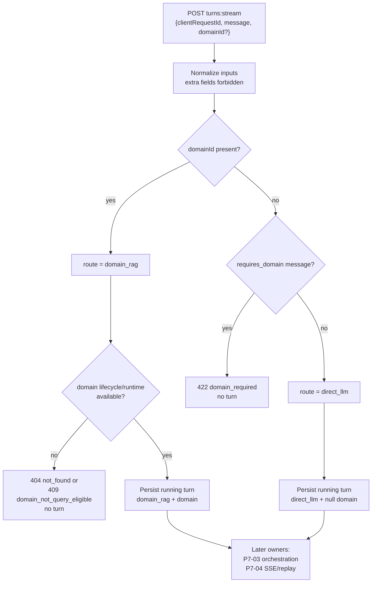

# Server Intent Gate and Turn-Start Route Invariants - Plan

## Goal Capsule

- **Objective:** Complete master-build-plan slice P7-02 by making the server the sole authority for turn route classification, enforcing direct/domain route invariants at turn start, and proving `domain_required` / `direct_llm` / `domain_rag` outcomes without advancing retrieval, SSE, or redaction ownership.
- **Authority:** Root `AGENTS.md`; FR-06 and the closed Phase 1 chat capability manifest in `docs/prd.md`; M-02 and M-07 in `docs/interaction-behavior-prd.md`; turn-stream request and chat error rows in `docs/contracts/http-api-catalog.md` and `docs/contracts/dto-schema-catalog.md`; grounded-turn lifecycle in `docs/architecture/data-and-lifecycle.md`; component ownership of `services/chat_intent.py` in `docs/architecture/components.md`.
- **Execution profile:** Security-sensitive brownfield retain/modify/reverify of the existing intent and turn-start seams, with characterization-first HTTP/service proof and closed ErrorCode mapping. No migration expected unless inventory finds a schema contradiction.
- **Readiness checkpoint:** Implementation-ready after the 2026-07-27 scoping confirmation: keep the pattern-based classifier; bound the slice to turn-start classification, route/domain invariants, and turn-start eligibility mapping for selected domains.
- **Stop conditions:** Stop if the slice requires a new public field, client-sent `route`, ML/LLM classifier, new ErrorCode, orchestration/SSE/redaction behavior, or exposing private conversation/turn identifiers.
- **Tail ownership:** P7-03 owns bounded retrieve/repair/synthesize and grounded refusal; P7-04 owns sealed SSE, attach/replay/cancel, and terminal persistence; P7-05 owns source/domain redaction; P9 owns draft-preserve UX for `domain_required`.

---

## Product Contract

### Summary

P7-02 seals the server-owned decision that turns every chat submit into either a `direct_llm` turn, a `domain_rag` turn, or a pre-persist rejection. With an explicit `domainId`, the server always selects `domain_rag` and rejects the turn when that domain is not currently query-eligible. Without a domain, the retained Phase 1 pattern gate allows only narrow general chat or returns `domain_required`. The client never chooses or silently switches routes.

Product Contract preservation: Product Contract authored in this bootstrap; no upstream brainstorm file.

### Problem Frame

P7-01 closed owner-scoped conversation foundations and public refs, but left route classification unproven. Lifted code already classifies on the server, yet there are no M-07 / `domain_required` tests, turn-start chat errors can escape as unapproved codes, and later orchestration/SSE work must not become the route authority. Without this slice, later chat work cannot trust that direct and domain routes are decided and fenced before provider work.

### Requirements

- R1. The server classifies every new turn from normalized `(message, domainId?)` and never accepts a client-supplied `route`.
- R2. An explicit selected domain always yields `domain_rag` for that domain, regardless of whether the message looks general or domain-seeking.
- R3. With no domain, a domain-seeking message matching the closed Phase 1 pattern list returns `422 domain_required` and creates no turn.
- R4. With no domain, a narrow general message allowed by the pattern gate creates a `direct_llm` turn with `domain_id` null and no Evidence.
- R5. `domain_rag` turns persist with a non-null domain; `direct_llm` turns persist with null domain; impossible pairs fail closed before insert.
- R6. A selected domain that is unknown or not lifecycle/runtime-available at submit returns an approved public error (`404 not_found` or `409 domain_not_query_eligible`) and creates no turn; the server never rewrites the request to `direct_llm` or another domain. Empty-corpus grounded refusal remains P7-03 unless U1 proves one shared predicate already covers both.
- R7. Pre-stream classification and eligibility failures use the closed ErrorCode vocabulary and private no-store JSON envelopes with request ID.
- R8. Inventory records retain/modify/defer for the intent gate, turn-start path, error mapping, and later-phase seams before behavior changes land.
- R9. Focused service/HTTP proof covers M-07 and the M-02 stop-before-submit race at the turn-start seam; orchestration, SSE sealing, and redaction remain deferred.
- R10. Closure evidence and the master-build-plan P7-02 row update only after verification passes.

### Acceptance Examples

- AE1. No domain and `"What is 2+2?"` creates a `direct_llm` turn with null domain.
- AE2. No domain and `"According to the manual, where is the valve?"` returns `422 domain_required` with unchanged turn count.
- AE3. Query-eligible domain A plus any message creates a `domain_rag` turn bound to A.
- AE4. Domain A selected in the request but stopped before submit returns `409 domain_not_query_eligible` and creates no turn.
- AE5. A body containing `route` (or another unknown field) fails closed with `422 validation_error`.
- AE6. The closed pattern matrix without a domain yields `domain_required` for each positive fixture and `direct_llm` for a fixed non-matching general set.
- AE7. Domain-seeking message plus stopped explicit `domainId` returns `409 domain_not_query_eligible` (not `domain_required`) and creates no turn.
- AE8. Member B submitting against member A's conversation public ref returns ownership-safe `404 not_found` with no turn disclosure.

AE6 fixture table (normative for U2/U3):

| Kind | Message fixture |
| --- | --- |
| positive | `According to the manual, where is the valve?` |
| positive | `Summarize the SOP for lockout.` |
| positive | `What does the policy say about PPE?` |
| positive | `Find the procedure in the document.` |
| positive | `Where is that covered in the knowledge domain?` |
| negative | `What is 2+2?` |
| negative | `Explain recursion in plain language.` |
| negative | `Help me brainstorm a meeting agenda.` |

### Scope Boundaries

#### In scope

- Retain/reverify `chat_intent.py` pattern gate and `classify_turn_route`.
- Harden turn-start domain-id validation and route/domain pairing invariants.
- Map turn-start eligibility and classification failures to approved public ErrorCodes.
- Prove no turn row on gate failure and correct route/domain persistence on success.
- Pin non-authoritative helpers that accept caller-supplied route so they cannot become a second classification entry.

#### Deferred for later

- Bounded plan/retrieve/repair/synthesize and grounded refusal (P7-03).
- Sealed SSE live/resume/replay, terminal persistence, and full M-10 attach/replay races (P7-04).
- Source/domain delete redaction (P7-05).
- Composer-ref consume/fingerprint correctness beyond what turn-start already requires (P11).
- Browser draft-preserve and domain-prompt UX for `domain_required` (P9).

#### Deferred to Follow-Up Work

- Requiring “no eligible sources” as a turn-start failure if inventory shows that would change grounded-refusal timing; keep lifecycle/runtime eligibility at turn-start and leave empty-corpus grounded refusal with P7-03 unless the inventory proves they already share one predicate.
- Broad privacy-scan breadth across all sinks remains P8.

#### Outside this product's identity

- Client-chosen route, silent domain auto-selection, ungrounded fallback for domain questions, ML/LLM intent classification, tool/plugin/agent routing, or Phase 2/3 observability/wiki chat capabilities.

### Key Flows

- F1. Narrow general submit with no domain → classify `direct_llm` → persist running turn with null domain.
- F2. Domain-seeking submit with no domain → `domain_required` → no persist.
- F3. Submit with selected eligible domain → classify `domain_rag` → eligibility pass → persist running turn with that domain.
- F4. Submit with selected ineligible/unknown domain → approved denial → no persist and no rewrite to direct chat.

---

## Planning Contract

### Key Technical Decisions

- KTD1. **Keep the pattern-based classifier as the Phase 1 closed rule.** Retain `DOMAIN_REQUIRED_PATTERNS` / `requires_domain` as the sole domain-seeking gate; reverify with an explicit fixture matrix rather than inventing NLU or provider classification. `(session-settled: user-approved — chosen over introducing a new classifier approach: confirmed in the P7-02 scoping synthesis)` Governs R3, R4, and R8.
- KTD2. **Bound P7-02 to the turn-start seam.** Own classification, route/domain invariants, turn-start eligibility mapping, and pre-persist rejection only; leave orchestrator body, SSE sealing, attach/replay, and redaction pinned for later owners even when they share `chat_turns.py`. `(session-settled: user-approved — chosen over expanding into orchestration/SSE in this slice: confirmed in the P7-02 scoping synthesis)` Governs R9 and Scope Boundaries.
- KTD3. **Make `start_or_replay_turn` the only production classification entry.** Keep `classify_turn_route` as the pure decision function; inventory and tests must treat any helper that accepts caller-supplied `route` as non-authoritative characterization/test scaffolding, not a second HTTP path. Governs R1 and R5.
- KTD4. **Classify before persist; eligibility before insert for `domain_rag`.** Explicit domain selects `domain_rag` before pattern evaluation matters; `domain_required` and eligibility failures never create a turn row and never rewrite route/domain. Prefer this pre-insert fence even where informal lifecycle diagrams place eligibility later. Governs R2, R3, R5, and R6.
- KTD5. **Mirror Evidence HTTP error mapping for turn-start failures.** Replace passthrough `_chat_turn_api_error` with an allowlisted projector for every pre-insert failure inventored in U1 so private/internal codes never escape as unapproved ErrorCodes. Classification/eligibility map to `domain_required`, `domain_not_query_eligible`, `not_found`, and `validation_error` with Evidence-parity safe messages. Fingerprint mismatch maps to `idempotency_conflict`; one-running-turn conflict maps to `operation_conflict`. Other pre-insert codes inventored in U1 map to already-approved union members (for example `dependency_unavailable`) or are explicitly pinned to a later owner with no HTTP passthrough. No catalog amendments. Full attach/replay races remain P7-04. Governs R6, R7, and R9.
- KTD6. **Reuse current domain availability resolution for turn-start eligibility.** Turn-start eligibility means lifecycle/runtime availability via the existing available-domain resolver, not the Evidence endpoint's no-eligible-sources predicate. Map unknown identity to ownership-safe `not_found` and stopped/transitioning/runtime-not-ready outcomes to `domain_not_query_eligible` with Evidence-parity safe messages. Do not invent a second eligibility stack. Governs R6, AE4, and AE7.

### High-Level Technical Design

Decision table for the turn-start gate:

| `domainId` | Pattern gate | Result |
| --- | --- | --- |
| present + lifecycle/runtime available | ignored | persist `domain_rag` |
| present + unknown or not lifecycle/runtime available | ignored | approved denial, no turn |
| absent | domain-seeking | `422 domain_required`, no turn |
| absent | narrow general | persist `direct_llm` |

### Assumptions

- The closed Phase 1 pattern list already present in `chat_intent.py` is the normative classifier content unless inventory finds a documented contradiction with PRD examples; this slice may refine fixtures and fail-closed validation around it, not replace the rule family.
- TurnStreamRequest already forbids unknown fields; P7-02 proves that contract rather than inventing a new request shape.
- Domain identifiers remain the public domain slug already used by member/admin domain APIs; P7-01 public-ref work does not introduce a second domain-ref scheme.
- Existing orchestration/SSE tests may still exercise later seams; P7-02 treats those as compatibility checks and records non-applicable gates rather than weakening them.

### System-Wide Impact

- **Chat authority:** Route selection becomes a proven server invariant before provider work, unblocking P7-03/P7-04 without letting the client become the classifier.
- **HTTP/contracts:** Turn-start pre-stream JSON failures converge on the closed ErrorCode union; generated OpenAPI/TypeScript change only if an approved mapping requires catalog/schema sync, which this plan forbids unless a stop condition fires.
- **Frontend:** No browser work in this slice; P9 continues to own draft preservation and domain-prompt UX after `domain_required`.
- **Privacy:** Failures remain content-free enough for operational sinks; authorized owner success still may create a durable user question on accepted turns, which later slices already own.

### Risks and Dependencies

| Risk | Mitigation |
| --- | --- |
| Pattern false positives/negatives feel product-wrong | Keep the settled pattern family; prove an explicit matrix and stop rather than invent NLU if PRD examples contradict the list. |
| Error-mapping accidentally claims full M-10 | Map only turn-start codes that fire before stream attach semantics; leave attach/replay races with P7-04. |
| Shared `chat_turns.py` pulls orchestration into the diff | Inventory pins later seams; unit goals forbid changing provider/retrieval/SSE/redaction behavior except for error-code projection at the HTTP boundary. |
| Eligibility depth changes grounded-refusal timing | Limit turn-start eligibility to the current available-domain resolver; defer empty-corpus refusal to P7-03 unless one predicate already covers both. |
| Non-authoritative `claim_turn` keeps accepting caller route in tests | Mark it non-authoritative and route new route-classification tests through `classify_turn_route` / `start_or_replay_turn`. |
| Depends on P7-01 public conversation refs | Consume owner-scoped `conv_…` paths already sealed by P7-01; do not reopen conversation CRUD. |

### Sequencing

1. Inventory the intent gate, turn-start path, error mapping, and later-phase seams.
2. Prove and harden classifier + `classify_turn_route` + route/domain invariants with characterization-first tests.
3. Seal turn-start HTTP mapping for classification/eligibility denials and prove no-turn / correct-route outcomes.
4. Run focused and compatibility gates, write evidence, and mark P7-02 done.

### Open Questions

- None blocking. U1 must record as an exit criterion that turn-start eligibility excludes no-eligible-sources checks unless the current resolver already includes that predicate; empty-corpus grounded refusal otherwise stays with P7-03.

---

## Implementation Units

### U1. Inventory the intent-gate and turn-start boundary

- **Goal:** Record retain/modify/defer dispositions for the classifier, turn-start path, error mapping, and later chat seams before behavior changes.
- **Files:**
  - `docs/_scratch/p7-02-intent-route-inventory.md`
  - `docs/brownfield-refactor-register.md` (only if an existing DRIFT row must be disposition-updated)
  - `app/context_engine/services/chat_intent.py`
  - `app/context_engine/services/chat_turns.py`
  - `app/context_engine/api/routes.py`
- **Approach:** Mirror the P7-01/P6 inventory columns. Confirm the pattern list, call graph (`requires_domain` → `classify_turn_route` → `start_or_replay_turn`), `TurnStreamRequest` closed shape, current eligibility call, passthrough `_chat_turn_api_error`, and every `claim_turn` caller with retain/modify/defer. Enumerate every pre-insert failure code reachable from `start_or_replay_turn` for the U3 projector table. Capture a baseline of existing SSE suite outcomes before edits. Explicitly defer orchestration/SSE/redaction. Record the empty-corpus eligibility exit criterion (exclude no-eligible-sources unless already in the resolver).
- **Patterns to follow:** `docs/_scratch/p7-01-conversation-foundation-inventory.md`, `docs/_scratch/p6-02-evidence-inventory.md`.
- **Test scenarios:**
  1. Inventory names every production caller of `requires_domain` / `classify_turn_route` / `claim_turn` and states whether each is retain, modify, or defer.
  2. Inventory records the current public error codes emitted for `domain_required`, unknown domain, and stopped domain at turn start, plus every other pre-insert failure code on the path.
  3. Inventory states the empty-corpus eligibility exit criterion and the SSE baseline outcome set used by later compatibility checks.
- **Verification:** Inventory exists, cites R1-R9 / KTD1-KTD6, lists zero unexplained production `claim_turn` callers, and is complete enough that later units do not invent new public behavior.
- **Covers:** R8; KTD1-KTD6.

### U2. Harden classifier and route/domain invariants

- **Goal:** Make the pure classification and route/domain pairing decisions deterministic, fail-closed, and independently testable.
- **Files:**
  - `app/context_engine/services/chat_intent.py`
  - `app/context_engine/services/chat_turns.py`
  - `app/tests/test_chat_intent.py`
  - `app/tests/test_chat_turn_route.py`
- **Approach:** Retain the pattern family and the AE6 fixture table. Normalize optional domain IDs against the existing domain-id pattern. Keep `classify_turn_route` as the sole decision function: domain present → `domain_rag`; else pattern gate → `domain_required` or `direct_llm`. Enforce `_validate_effective_route` before persist. Keep `claim_turn` non-authoritative: zero production callers, or a hard guard rejecting caller-supplied route outside test scaffolding; new route proof must use `classify_turn_route` / `start_or_replay_turn`. Do not change orchestrator provider/retrieval behavior.
- **Execution note:** Start from failing characterization/unit tests for the pattern matrix and classify-table outcomes before hardening production code.
- **Patterns to follow:** Existing `classify_turn_route` / `requires_domain` shape; domain-id validation style from `services/domains.py`.
- **Test scenarios:**
  1. Covers AE6. Each closed positive pattern fixture without a domain requires a domain; fixed general fixtures do not.
  2. Covers AE1 / AE3. Classify table: no domain + general → `direct_llm`; domain present + general message → `domain_rag` with that domain.
  3. Covers AE2. Domain-seeking message without domain raises `domain_required` and does not return `direct_llm`.
  4. Malformed domain id fails validation before classification success.
  5. Impossible route/domain pairs fail closed in the effective-route validator.
  6. HTTP turn-start never invokes `claim_turn`; production call-graph inventory remains empty for that helper.
- **Verification:** Focused unit suite passes; no orchestrator/SSE/redaction behavior changes are required for green.
- **Covers:** R1-R5; AE1-AE3, AE6; KTD1, KTD3, KTD4.

### U3. Seal turn-start HTTP eligibility and error projection

- **Goal:** Prove the HTTP turn-start boundary returns approved pre-stream errors, creates no turn on gate failure, and persists the correct route/domain on success.
- **Files:**
  - `app/context_engine/api/routes.py`
  - `app/context_engine/services/chat_turns.py`
  - `app/tests/test_chat_turn_route_http_contract.py`
  - `app/tests/test_chat_sse_http_contract.py` (compatibility only)
  - `app/contracts/openapi.json` / `app/client/src/lib/api/generated/openapi.ts` (only if regeneration is required by an approved mapping already in catalog)
- **Approach:** Map every inventory-listed pre-insert failure through an allowlisted chat error projector modeled on `_evidence_api_error`, including Evidence-parity safe messages. Keep `TurnStreamRequest` closed. Reuse the available-domain resolver for selected-domain checks. Split proof: HTTP tests own pre-stream denials; success persistence/route invariants are proved via `start_or_replay_turn` service tests, or HTTP with the existing deterministic synthesis/adapter monkeypatch pattern from `test_chat_sse_http_contract.py` that fails closed if orchestration unexpectedly expands. Do not seal full SSE order or provider completion.
- **Execution note:** Prefer HTTP denial tests that assert status, ErrorCode, safe message, request ID, private no-store, and zero turn rows; prove success route/domain persistence without requiring provider success.
- **Patterns to follow:** `routes.py` `_evidence_api_error`; P6-02 Evidence HTTP contract tests; P7-01 conversation HTTP privacy/header assertions.
- **Test scenarios:**
  1. Covers AE2 / M-07. Domain-seeking message without `domainId` returns `422 domain_required`, private no-store JSON, safe message, and creates no turn.
  2. Covers AE1 / M-07. Narrow general message without domain creates a `direct_llm` running turn with null domain (service-level or monkeypatched HTTP).
  3. Covers AE3. Lifecycle/runtime-available `domainId` creates a `domain_rag` turn bound to that domain even when the message looks general.
  4. Covers AE4 / M-02. Stopped selected domain returns `409 domain_not_query_eligible` with Evidence-parity safe message, creates no turn, and does not fall back to `direct_llm`. Prefer a barrier/latch race when practical; static stopped-domain denial is the minimum.
  5. Covers AE7. Domain-seeking message plus stopped `domainId` returns `409 domain_not_query_eligible`, not `domain_required`.
  6. Unknown domain id returns ownership-safe `404 not_found` shape and creates no turn.
  7. Covers AE8. Cross-owner conversation public ref returns ownership-safe `404 not_found` with no turn disclosure.
  8. Covers AE5. Unknown request field `route` fails closed with `422 validation_error`.
  9. Fingerprint/input conflict at the start seam projects `409 idempotency_conflict` without claiming full attach/replay coverage.
  10. SSE compatibility may only cite U1 baseline non-applicability for post-start orchestration tests; new SSE failures caused by turn-start edits block closure.
- **Verification:** Focused HTTP/route suite passes; no new ErrorCode is introduced; no unlisted pre-insert code escapes; generated contracts remain synchronized if touched.
- **Covers:** R6, R7, R9; AE2-AE5; KTD2, KTD5, KTD6.

### U4. Prove integration and close P7-02

- **Goal:** Attach durable completion evidence and update the tracker only after focused and compatibility gates pass.
- **Files:**
  - `docs/_scratch/p7-02-intent-route-evidence.md`
  - `docs/master-build-plan.md`
  - `app/tests/test_chat_intent.py`
  - `app/tests/test_chat_turn_route.py`
  - `app/tests/test_chat_turn_route_http_contract.py`
  - `app/tests/test_generated_contract_gate.py`
  - `app/tests/test_phase_one_route_scope.py`
- **Approach:** Follow the P6/P7-01 evidence format: exact commands/results, privacy assertions for failure envelopes, residual ownership for P7-03–P7-05/P8/P9, and tracker update only after gates pass. Do not claim the closed Phase 1 chat capability manifest complete.
- **Patterns to follow:** `docs/_scratch/p7-01-conversation-foundation-evidence.md`, `docs/_scratch/p6-02-evidence.md`.
- **Test scenarios:**
  1. Focused intent/route/HTTP suites pass with M-07 and M-02 case IDs in names or evidence.
  2. Generated-contract / route-scope gates pass or have written non-applicability reasons.
  3. Privacy sentinels do not appear in classification/eligibility error envelopes, logs asserted by the focused suite, OpenAPI/generated types, or failure artifacts.
  4. Evidence records residuals: orchestration, SSE/replay, redaction, empty-corpus grounded refusal if deferred, and browser UX.
- **Verification:** Evidence artifact complete; master-build-plan marks P7-02 `DONE` only after that evidence exists.
- **Covers:** R8-R10; AE1-AE6; KTD1-KTD6.

---

## Verification Contract

| Gate | Scope | Applies to | Done signal |
| --- | --- | --- | --- |
| Focused unit tests | Pattern matrix, classify table, route/domain invariants | U2 | All deterministic intent/route unit tests pass. |
| HTTP contract tests | `domain_required`, direct/domain persistence, eligibility denials, unknown fields, approved ErrorCodes | U3 | All turn-start HTTP cases pass. |
| Compatibility regressions | Existing SSE/conversation/Evidence suites and phase route/schema scopes | U3-U4 | No regression or unapproved route/schema expansion. |
| Contract generation | OpenAPI / public schema / generated TypeScript only if touched | U3-U4 | Regeneration clean and snapshot gate passes, or explicitly untouched. |
| Static quality | Ruff over changed Python and root phase-scope checks | U1-U4 | Zero applicable findings. |
| Privacy evidence | Pre-stream error envelopes, focused logs/artifacts, generated contracts | U3-U4 | No private IDs, raw provider/retrieval payloads, or forbidden sink leaks in denial paths. |

---

## Definition of Done

- Inventory records retain/modify/defer for the intent gate and turn-start boundary, including later-phase pins and the empty-corpus eligibility finding.
- Server classification from `(message, domainId?)` is the only production route authority; client-supplied `route` cannot succeed.
- Explicit eligible domain always creates `domain_rag`; no-domain domain-seeking returns `domain_required` with no turn; no-domain narrow general creates `direct_llm`.
- Selected unknown/ineligible domains return approved public errors and never rewrite to direct chat or another domain.
- Turn-start failures owned by this slice project only approved ErrorCodes through private no-store JSON.
- Focused unit/HTTP proof covers M-07 and M-02 at the turn-start seam, including ownership-safe conversation denial and domain-seeking-plus-stopped-domain; orchestration, SSE sealing, redaction, and browser draft UX remain explicitly residual.
- `docs/_scratch/p7-02-intent-route-evidence.md` records exact results and residuals; `docs/master-build-plan.md` marks P7-02 done only after that evidence exists.

## Appendix

### Sources and research

- Local pattern research of `chat_intent.py`, `chat_turns.py` turn-start path, `TurnStreamRequest`, Evidence error-mapping precedent, and P7-01/P6 inventory structure.
- Flow analysis for M-07 / M-02 turn-start outcomes and explicit non-claims for P7-03–P7-05.
- No external research: local production seams and contract authority were sufficient; classifier approach was already settled in scoping.

### Session-settled decisions carried forward

- Plan P7-02 before implementing (`user-directed` over bare-prompt implement or finishing P7-01 shipping first).
- Keep the pattern-based classifier (`user-approved`).
- Bound the slice to turn-start classification and route invariants (`user-approved`).
