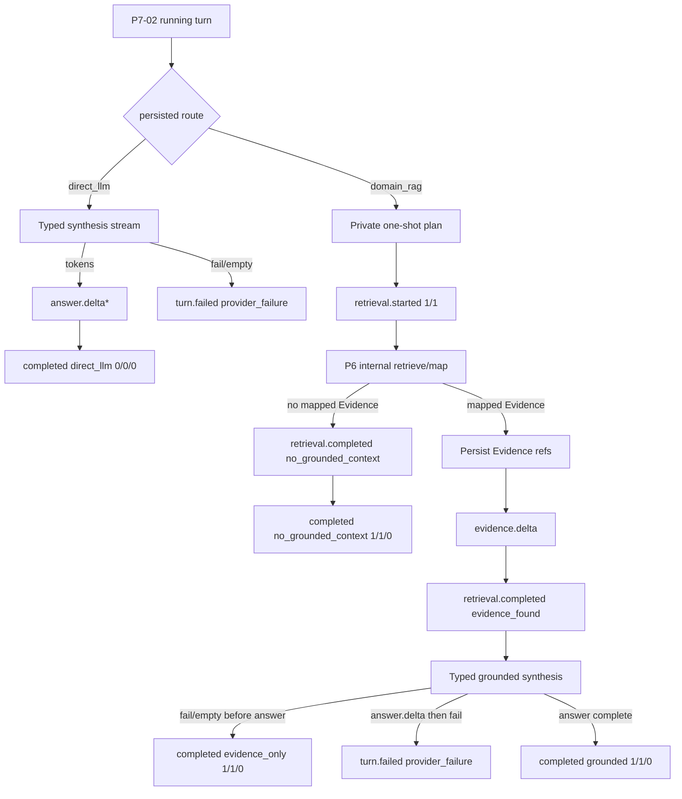

# Bounded Plan Retrieve Repair Synthesize Orchestration - Plan

## Goal Capsule

- **Objective:** Complete master-build-plan slice P7-03 by proving private post-start plan → retrieve → map Evidence → synthesize-or-refuse orchestration for server-classified turns, replacing the synthesis stand-in with a typed fail-closed provider adapter, without claiming sealed SSE/replay or redaction ownership.
- **Authority:** Root `AGENTS.md`; FR-06 and the closed Phase 1 chat capability manifest in `docs/prd.md`; M-03 and M-07 in `docs/interaction-behavior-prd.md`; SSE legal sequences and stop reasons in `docs/contracts/sse-event-catalog.md`; synthesis outbound port in `docs/architecture/data-and-lifecycle.md`; component ownership of `services/chat_turns.py` in `docs/architecture/components.md`; DRIFT-22 remaining half in `docs/brownfield-refactor-register.md`; P7-02 residuals in `docs/_scratch/p7-02-intent-route-inventory.md`.
- **Execution profile:** Security- and privacy-sensitive brownfield retain/modify of `TurnOrchestrator` and the synthesis boundary, with characterization-first service/HTTP proof and injected no-network adapter fixtures. No migration expected unless inventory finds a schema contradiction.
- **Readiness checkpoint:** Implementation-ready after the 2026-07-27 scoping confirmation: keep SSE sealing with P7-04; replace the synthesis stand-in with a real typed provider adapter; treat empty-corpus / no-Evidence as a post-start grounded refusal.
- **Stop conditions:** Stop if the slice requires a new public field/ErrorCode/event type, multi-attempt query-rewrite repair without an approved contract, client-visible plan/reasoning text, ungrounded domain fallback, sealed SSE/attach/replay/cancel ownership, redaction ownership, or exposing private conversation/turn/provider identifiers.
- **Tail ownership:** P7-04 owns sealed SSE live/resume/replay, attach races, cancel semantics, and grounded-refusal/evidence-only terminal projection sealing; P7-05 owns source/domain redaction; P8 owns system-wide privacy/audit breadth; P9 owns chat UI; P11 owns deeper composer-ref assembly correctness beyond current turn fencing.

---

## Product Contract

### Summary

P7-03 owns the private orchestration that runs after P7-02 has classified and persisted a running turn. Domain RAG selects one retrieval operation, retrieves from exactly that turn’s domain through the P6 internal Evidence seam, synthesizes only from mapped Evidence, and refuses with `no_grounded_context` when the bounded retrieval yields no mapped Evidence (including empty corpus). Direct LLM synthesizes without Evidence. The deterministic synthesis stand-in is replaced by a typed provider port with timeout/error/privacy fixtures. Existing stream emission remains compatible, but sealed replay and terminal projection claims stay with P7-04.

Product Contract preservation: Product Contract authored in this bootstrap; no upstream brainstorm file.

### Problem Frame

P7-02 proved server route authority and turn-start eligibility, and explicitly deferred empty-corpus grounded refusal and orchestration body work. The lifted `TurnOrchestrator` already performs one retrieval and placeholder synthesis, but synthesis is a deterministic stand-in (DRIFT-22), repair counters are hardcoded with no proven single-shot budget fence, grounded provider failure can complete `evidence_only` after answer deltas have already escaped, and there is no focused M-03 orchestration proof. Without this slice, P7-04 cannot trust that durable turn outcomes are produced by Evidence-only synthesis or grounded refusal rather than ungrounded model knowledge.

### Requirements

**Orchestration authority**

- R1. After a turn is created by P7-02, the server owns a private single-shot plan that selects the retrieval operation/intent for `domain_rag` turns and records budget counters; plan reasoning is never emitted to the browser.
- R2. `direct_llm` turns never call retrieval or emit retrieval/evidence events; they synthesize through the typed provider boundary and complete with `stopReason: direct_llm` and budget `0/0/0`.
- R3. `domain_rag` turns retrieve from exactly the turn’s persisted domain through the internal P6 Evidence seam (`retrieve_internal_scoped_evidence` / `P6RetrievalPort`), never the public Evidence HTTP projector that converts empty corpus into pre-stream `domain_no_eligible_sources`.

**Grounding and refusal**

- R4. Synthesis for `domain_rag` may use only mapped, authorized Evidence (and approved private assembly context already accepted for the turn). Raw LightRAG hits, unmapped candidates, and cross-domain content never enter the provider request.
- R5. A successful bounded retrieval with no mapped Evidence — including no eligible sources — completes the already-created turn with `stopReason: no_grounded_context`, no answer, and no citations; the server never rewrites the turn to `direct_llm` or answers from general model knowledge.
- R6. When mapped Evidence exists but synthesis fails or returns empty before any `answer.delta` is persisted, complete `evidence_only` with Evidence retained and no answer. If one or more `answer.delta` events were already persisted and synthesis later fails or ends empty, fail the turn with the safe provider-failure terminal rather than rewriting to `evidence_only`.

**Synthesis adapter**

- R7. Replace the deterministic `SynthesisStreamAdapter` stand-in with a typed synthesis outbound port and at least one concrete provider adapter for the default OpenAI synthesis profile path; unimplemented configured provider kinds fail closed with safe typed errors. CI proves timeout, auth/config, malformed stream, empty output, and privacy via injectable transport — no network required.
- R8. Provider calls use call-scoped trusted runtime credentials, bounded timeout/output settings, and never persist or emit assembled prompts, provider payloads, credentials, runtime URLs, or raw hits.

**Compatibility and evidence**

- R9. Inventory records retain/modify/defer for orchestration, synthesis, retrieval, event emission vs P7-04/P7-05, and DRIFT-22 before behavior changes land.
- R10. Focused orchestration proof covers M-03 grounding/refusal paths and direct synthesis; sealed SSE attach/replay/cancel races remain deferred to P7-04 with compatibility-only baselines.
- R11. Closure evidence and the master-build-plan P7-03 row update only after verification passes; DRIFT-22 is closed only when the synthesis half is proven.

### Acceptance Examples

- AE1. Eligible domain + question with mapped Evidence creates/streams a `domain_rag` turn that emits retrieval start (`attempt:1`, `maxAttempts:1`), Evidence before any answer delta, then completes `grounded` with budget `planStepCount:1`, `retrievalOperationCount:1`, `repairAttemptCount:0`.
- AE2. Eligible domain with no eligible sources or no surviving mapped Evidence completes `no_grounded_context` after retrieval start/completed, with null answer, zero citations, and no rewrite to direct chat.
- AE3. Mapped Evidence present but synthesis timeout/empty/typed failure before any answer delta completes `evidence_only` with Evidence retained and no answer events.
- AE4. Mapped Evidence present, at least one answer delta persisted, then provider failure → `turn.failed` with safe provider-failure projection; terminal is not rewritten to `evidence_only`.
- AE5. Narrow general `direct_llm` turn synthesizes with zero retrieval/evidence events and budget `0/0/0`.
- AE6. Domain synthesis request never contains unmapped retrieval text or private block/object identifiers; privacy sentinels injected into adapter transport do not appear in events, persisted public fields, or focused log assertions.
- AE7. Active synthesis profile configured for an unimplemented provider kind fails closed with safe provider failure (direct) or `evidence_only`/safe failure (domain per R6), never a deterministic stand-in success string.
- AE8. Orchestration never increments `repairAttemptCount` above 0 and never emits a second retrieval attempt in this Phase 1 single-shot posture.

### Scope Boundaries

#### In scope

- Private single-shot plan/retrieve/map/synthesize/refuse control flow in `TurnOrchestrator`.
- Typed synthesis port, OpenAI concrete adapter, fail-closed registry for other synthesis provider kinds, settings for synthesis timeout/output bounds, injectable fixtures.
- Post-start empty-corpus / no-Evidence grounded refusal and Evidence-only completion rules above.
- Compatible event emission through the existing orchestrator seam without claiming P7-04 sealing.
- Inventory, focused tests, DRIFT-22 closure, and P7-03 evidence/tracker update.

#### Deferred for later

- Sealed SSE live/resume/replay, attach races, cancel semantics, and terminal projection sealing (P7-04).
- Source/domain delete redaction (P7-05).
- Multi-attempt / single-shot grounded query-rewrite repair beyond the Phase 1 `repairAttemptCount:0` budget fence (deferred in the lean-agent-shell plan; inventing triggers would invent product behavior).
- Bedrock/Ollama production SDK proof beyond fail-closed registration (follow-on once OpenAI path is proven, unless inventory shows an existing approved adapter).
- Composer-ref assembly depth beyond current turn fencing (P11).
- Chat UI / draft UX (P9).

#### Deferred to Follow-Up Work

- Emitting `turn_budget_exhausted` merely because the enum exists; Phase 1 single-shot paths do not require it.
- Broad sink privacy scanning across all audit/log sinks (P8).
- Full provider-timeout reconciliation workflow if remote outcome is unknown after disconnect; record the seam and fail safely, leave broader reconciliation machinery to later operational hardening if not already present.

#### Outside this product's identity

- Open tool registry, plugins, terminal/filesystem/browser automation, agent approval queues, browser-selected model/provider/controller, ungrounded fallback for domain questions, client-visible chain-of-thought / plan text, or Phase 2/3 observability/wiki chat capabilities.

### Key Flows

- F1. Direct LLM → typed synthesis → answer deltas → completed `direct_llm`.
- F2. Domain RAG with mapped Evidence → private plan → retrieval started/completed → evidence deltas → grounded synthesis → completed `grounded`.
- F3. Domain RAG with empty corpus or no mapped Evidence → retrieval started/completed(`no_grounded_context`) → completed `no_grounded_context`.
- F4. Domain RAG with Evidence but synthesis fails before answer → completed `evidence_only`.
- F5. Domain RAG with Evidence, answer started, then provider failure → `turn.failed` safe provider failure.

### Actors

- A1. Authenticated member — owns the conversation/turn; never chooses route or provider.
- A2. Server orchestration — sole authority for plan/retrieve/synthesize/refuse after turn start.
- A3. Synthesis provider adapter — private outbound port; returns token stream or typed safe failure.

---

## Planning Contract

### Key Technical Decisions

- KTD1. **Keep P7-03 on private orchestration outcomes; leave sealed SSE/replay/cancel with P7-04.** Retain compatible `_persist_event` / `_complete_turn` / `_fail_turn` emission so existing streams do not break, but do not claim sealed sequence validation, attach races, cursor expiry, or terminal DTO sealing. `(session-settled: user-approved — chosen over pulling sealed SSE/terminal projections into this plan: confirmed in the P7-03 scoping synthesis)` Governs R9–R10 and Scope Boundaries.
- KTD2. **Replace the synthesis stand-in with a real typed provider port and OpenAI concrete adapter.** Mirror `adapters/parsers.py`: protocol, typed request/result, injectable transport, timeout/auth/malformed normalization, privacy fixtures, fail-closed unsupported kinds. Bedrock/Ollama remain fail-closed registry entries until separately proven. `(session-settled: user-approved — chosen over forever-fixture-only deterministic synthesis: confirmed in the P7-03 scoping synthesis)` Governs R7–R8, AE6–AE7, DRIFT-22.
- KTD3. **Empty-corpus / no-Evidence refusal remains post-start.** Continue mapping `had_eligible_sources=False` and empty mapped Evidence to `[]` in `P6RetrievalPort`, then complete `no_grounded_context` on the already-created turn. Do not move no-eligible-sources into P7-02 turn-start denial. `(session-settled: user-approved — chosen over turn-start HTTP rejection: confirmed in the P7-03 scoping synthesis; carries P7-02 exit criterion)` Governs R5, AE2, F3.
- KTD4. **Phase 1 “repair” is a single-shot budget fence, not a multi-attempt rewrite loop.** Private plan selects one retrieval operation; emit `retrieval.started` with `attempt:1`/`maxAttempts:1`; persist budgets `domain 1/1/0` or `direct 0/0/0`; never increment `repairAttemptCount`. Multi-attempt Single-Shot Grounded Repair stays deferred until contracted. Governs R1, AE1, AE8.
- KTD5. **Honor SSE legal sequences for `evidence_only` vs streaming failure.** Stream answer deltas on the success path. Use `evidence_only` only when no answer delta has been persisted. After any answer delta, later empty/error outcomes use safe `turn.failed` / provider-failure, never a contradictory `evidence_only` rewrite. Governs R6, AE3–AE4, F4–F5.
- KTD6. **Reuse the internal P6 Evidence seam; never synthesize from public Evidence HTTP results or raw hits.** Keep `P6RetrievalPort` → `retrieve_internal_scoped_evidence` → persist safe Evidence refs → pass only approved mapped material into the private synthesis request. Governs R3–R4, AE6.
- KTD7. **External synthesis runs outside long-held database write transactions.** Freeze synthesis inputs and commit retrieval/Evidence intent before the provider stream; do not hold an open product write transaction across unbounded provider I/O. Directional guidance only — exact session/commit helper shape is implementation-time. Governs R8 and architecture outbound-port rules.
- KTD8. **“Plan” means private closed control-flow selection, not an agent plan.** Retain/refine `operation_for_message` / intent mapping as an internal one-shot plan value that feeds retrieval intent and `planStepCount`; never emit plan text, tool calls, or browser-visible reasoning. Agent-native tool surfaces are out of Phase 1 identity. Governs R1 and Outside this product's identity.

### High-Level Technical Design

### Assumptions

- Approved contracts authorize the Phase 1 single-shot budget example (`repairAttemptCount:0`, one retrieval) without a multi-attempt rewrite algorithm; inventing rewrite triggers would violate the no-invented-behavior stop condition.
- Default catalog synthesis profile `openai-synthesis-default` is the first concrete adapter path; other kinds fail closed until separately proven.
- Existing event persistence helpers remain the compatibility seam; P7-04 will later seal/validate them without requiring P7-03 to freeze a second event protocol.

### Sequencing

1. Inventory and pin later owners (U1).
2. Typed synthesis port/adapter/settings/fixtures (U2).
3. Orchestration control-flow and grounding/refusal rules (U3).
4. Focused orchestration tests + compatibility baselines (U4).
5. Evidence artifact, DRIFT-22 closure, tracker update (U5).

---

## Implementation Units

### U1. Inventory orchestration and synthesis seams

- **Goal:** Record retain/modify/defer for `TurnOrchestrator`, synthesis stand-in, retrieval port, event emission vs P7-04/P7-05, DRIFT-22, and the single-shot budget/exit criteria before behavior edits.
- **Requirements:** R9
- **Dependencies:** None
- **Files:**
  - Create: `docs/_scratch/p7-03-orchestration-inventory.md`
  - Modify if needed: `docs/brownfield-refactor-register.md` (DRIFT-22 note only; status flips in U5)
- **Approach:** Mirror P7-02 inventory columns. Capture current `_stream_direct` / `_stream_domain_rag` outcomes, `P6RetrievalPort` empty-corpus → `[]` behavior, hardcoded budgets, eager answer-delta then `evidence_only` contradiction, synthesis stand-in strings, and SSE compatibility baseline commands/results. Explicitly defer sealed SSE/cancel/redaction. Record KTD4 single-shot exit criterion and KTD5 evidence_only sequencing rule as implementation constraints.
- **Patterns to follow:** `docs/_scratch/p7-02-intent-route-inventory.md`, `docs/_scratch/p4-03-parser-adapters-inventory.md`
- **Test scenarios:**
  1. Inventory lists every production caller of `TurnOrchestrator.stream_turn` / `SynthesisStreamAdapter` / `P6RetrievalPort.retrieve`.
  2. Inventory records the empty-corpus post-start path and the answer-delta/`evidence_only` contradiction as modify items.
  3. Inventory pins P7-04/P7-05 surfaces as defer with no ownership claim.
- **Verification:** Inventory exists and is referenced by later units before orchestration/adapter behavior changes land.
- **Covers:** R9; KTD1, KTD3, KTD4.

### U2. Typed synthesis port and OpenAI adapter

- **Goal:** Close the DRIFT-22 synthesis half with a parser-style typed outbound port, OpenAI concrete adapter, fail-closed registry, and no-network fixtures.
- **Requirements:** R7, R8, AE6, AE7
- **Dependencies:** U1
- **Files:**
  - Create: `app/context_engine/adapters/synthesis.py` (or equivalent adapters module name matching local convention)
  - Modify: `app/context_engine/services/chat_turns.py` (replace stand-in with port injection)
  - Modify: `app/context_engine/config.py` (synthesis timeout / max output bounds)
  - Create/modify: `app/tests/test_synthesis_adapters.py`
  - Modify as needed: package extras / dependency notes only if an approved OpenAI SDK is already the repo’s intended synthesis extra; otherwise keep injectable transport and document the optional extra the same way parsers do
- **Approach:** Define private `SynthesisRequest` / stream result / `SynthesisAdapterError` with safe codes only. Adapter receives trusted runtime config plus approved mapped evidence/assembly context — never a DB session or authorization inputs. OpenAI path uses injectable transport for CI. Unsupported provider kinds raise typed safe failure. Preserve `app.state.synthesis_stream_adapter` injection used by existing SSE tests, or update those tests to the new port seam in U4. Add positive synthesis timeout/output settings with fail-closed validation analogous to retrieval/parser timeouts.
- **Execution note:** Start with failing adapter fixture tests for timeout, auth/config failure, malformed stream, empty output, and privacy sentinel leakage before wiring the orchestrator.
- **Patterns to follow:** `app/context_engine/adapters/parsers.py`, `app/tests/test_parser_adapters.py`, `TrustedRuntimeResolver` credential scoping in `runtime_config.py`
- **Test scenarios:**
  1. Happy path: injected OpenAI transport yields ordered tokens; adapter yields the same tokens and no forbidden keys.
  2. Timeout: transport exceeds bound → typed timeout error with safe message; no credential/prompt in exception text.
  3. Auth/config failure: missing/invalid credential path → typed safe failure.
  4. Malformed stream / unexpected exception → typed safe failure; privacy sentinels absent from raised surfaces.
  5. Empty token stream → typed empty/safe failure distinguishable by orchestrator.
  6. Unsupported provider kind (e.g. Bedrock/Ollama until implemented) → fail closed, never deterministic stand-in success copy.
  7. Privacy: transport returning URL/job/payload-like fields cannot leak into yielded public tokens or error messages.
- **Verification:** Focused synthesis adapter suite passes without network; stand-in success strings are no longer the production default path.
- **Covers:** R7, R8; AE6, AE7; KTD2.

### U3. Single-shot orchestration, grounding, and refusal rules

- **Goal:** Make `TurnOrchestrator` enforce private one-shot plan/retrieve/map/synthesize/refuse outcomes and legal evidence_only vs failure sequencing.
- **Requirements:** R1–R6, R8, AE1–AE5, AE8
- **Dependencies:** U1, U2
- **Files:**
  - Modify: `app/context_engine/services/chat_turns.py`
  - Modify as needed: helpers for committing Evidence before provider I/O
- **Approach:** Formalize the private one-shot plan value from operation/intent selection. Domain path: emit retrieval started `1/1`, call `P6RetrievalPort` once, persist Evidence before grounded synthesis, emit evidence before answers, set budgets `1/1/0`. Empty mapped Evidence → `no_grounded_context`. Track whether any answer delta was persisted to choose `evidence_only` vs provider-failure terminal (KTD5). Direct path keeps zero retrieval and budget `0/0/0`. Keep provider streaming outside long write transactions (KTD7). Do not add second retrieval attempts, repair increments, or `turn_budget_exhausted` for this posture.
- **Patterns to follow:** Existing `_stream_domain_rag` / `_persist_evidence_refs` structure; P6 internal retrieval result semantics from `evidence.py`
- **Test scenarios:** Covered primarily in U4; this unit lands the behavior those tests lock.
- **Verification:** Manual/service-level red → green against U4 scenarios; no new public contract fields.
- **Covers:** R1–R6, R8; AE1–AE5, AE8; KTD3–KTD8.

### U4. Focused orchestration proof and compatibility baselines

- **Goal:** Prove M-03/M-07 orchestration outcomes at the service/HTTP boundary with injected adapters/retrieval ports, and keep existing SSE suites from regressing.
- **Requirements:** R10, AE1–AE8
- **Dependencies:** U2, U3
- **Files:**
  - Create: `app/tests/test_chat_orchestration.py` (or extend an existing focused chat service test module if inventory shows a better home)
  - Modify: `app/tests/test_chat_sse_http_contract.py` as needed for new injection seam
  - Modify/extend: `app/tests/test_chat_turn_route.py` / HTTP contract only if direct/domain orchestration assertions belong there
  - Modify: `docs/_scratch/p7-03-orchestration-inventory.md` with SSE compatibility baseline results
- **Approach:** Prefer deterministic service-level tests with injected retrieval port + synthesis adapter for domain success, empty corpus, no mapped hits, evidence_only, post-answer provider failure, direct success/failure, one-call retrieval counting, and privacy sentinels. Use HTTP/SSE only where needed for envelope compatibility; cite non-applicability for attach/replay/cancel sealing owned by P7-04.
- **Execution note:** Add failing orchestration tests for AE2/AE3/AE4 before changing control flow where practical.
- **Patterns to follow:** `app/tests/test_chat_sse_http_contract.py` monkeypatch/injection style; `app/tests/test_scoped_retrieval.py` privacy/provenance fixtures; P7-02 HTTP vs service split
- **Test scenarios:**
  1. Covers AE1 / M-03. Domain mapped Evidence → Evidence before answer → completed `grounded` budget `1/1/0`; retrieval port called once.
  2. Covers AE2. Empty corpus / no mapped Evidence → `no_grounded_context`; no answer; no direct rewrite; retrieval called once.
  3. Covers AE3. Synthesis typed failure before answer → `evidence_only`; Evidence retained; zero answer events.
  4. Covers AE4. One answer delta then provider failure → `turn.failed` safe provider failure; not `evidence_only`.
  5. Covers AE5 / M-07. Direct turn → no retrieval events; budget `0/0/0`; completed `direct_llm`.
  6. Covers AE6. Raw-hit / sentinel strings in retrieval or provider transport never appear in persisted public answer/evidence/events/focused logs.
  7. Covers AE7. Unsupported provider kind fails closed without stand-in success copy.
  8. Covers AE8. No second retrieval attempt; `repairAttemptCount` remains 0.
  9. Compatibility: existing SSE HTTP suite still passes or records P7-04-owned non-applicability without new failures caused by P7-03 edits.
- **Verification:** Focused orchestration suite green; SSE compatibility baseline recorded; no new ErrorCodes/public fields.
- **Covers:** R10; AE1–AE8; KTD1, KTD5.

### U5. Close P7-03 evidence, DRIFT-22, and tracker

- **Goal:** Attach durable completion evidence and update tracker/brownfield status only after gates pass.
- **Requirements:** R11
- **Dependencies:** U1–U4
- **Files:**
  - Create: `docs/_scratch/p7-03-orchestration-evidence.md`
  - Modify: `docs/master-build-plan.md` (P7-03 row + closure note)
  - Modify: `docs/brownfield-refactor-register.md` (DRIFT-22 → DONE when synthesis half proven)
  - Modify if still accurate: `docs/architecture/as-built-gaps-and-decisions.md` model-provider bullet to note OpenAI synthesis adapter proof boundary without over-claiming Bedrock/Ollama
- **Approach:** Follow P7-02 evidence format: exact commands/results, privacy assertions, residual owners (P7-04/P7-05/P8/P9/P11), and explicit non-claim that the closed Phase 1 chat capability manifest is not complete until later P7 tasks finish. Mark P7-03 DONE only after evidence exists.
- **Patterns to follow:** `docs/_scratch/p7-02-intent-route-evidence.md`, `docs/_scratch/p4-03-parser-adapters-evidence.md`
- **Test scenarios:**
  1. Focused orchestration + synthesis adapter suites pass with M-03/M-07 identifiers in names or evidence.
  2. Compatibility/SSE/generated-contract/phase-scope gates pass or have written non-applicability reasons.
  3. Privacy sentinels absent from focused artifacts.
  4. Evidence records residuals for sealed SSE, redaction, multi-attempt repair, and remaining provider kinds.
- **Verification:** Evidence artifact complete; master-build-plan marks P7-03 `DONE` only after that evidence exists; DRIFT-22 closed for synthesis.
- **Covers:** R11; KTD1–KTD2.

---

## Verification Contract

| Gate | Scope | Applies to | Done signal |
| --- | --- | --- | --- |
| Inventory | Retain/modify/defer + baselines | U1 | `docs/_scratch/p7-03-orchestration-inventory.md` complete before behavior edits. |
| Synthesis adapter tests | Timeout/auth/malformed/empty/privacy/fail-closed registry | U2 | `test_synthesis_adapters` (or equivalent) green without network. |
| Orchestration tests | M-03/M-07 grounding, refusal, evidence_only vs failed, one-shot budget | U3–U4 | Focused orchestration suite green. |
| Compatibility | Existing SSE/chat HTTP suites | U4–U5 | No P7-03-caused regressions; P7-04 sealing non-claims recorded. |
| Contract generation | OpenAPI/SSE/generated TS only if touched | U5 | Snapshots clean or explicitly untouched. |
| Static quality | Ruff on changed Python; phase-scope docs gate | U1–U5 | Zero applicable findings. |
| Privacy evidence | Events, persisted public fields, focused logs/artifacts | U2–U5 | No credentials, prompts, raw hits, provider payloads, or private IDs. |

---

## Definition of Done

- Inventory pins orchestration/synthesis/retrieval/event ownership and the single-shot + evidence_only sequencing constraints.
- Deterministic synthesis stand-in is no longer the production path; typed OpenAI adapter + fail-closed registry are proven with no-network fixtures.
- Domain RAG synthesizes only from mapped Evidence or refuses with `no_grounded_context`; never falls back to direct/general knowledge.
- Empty corpus is a post-start grounded refusal on an already-created turn.
- `evidence_only` never follows persisted answer deltas; post-answer provider failure uses safe `turn.failed`.
- Phase 1 budgets remain single-shot (`domain 1/1/0`, `direct 0/0/0`) with no invented multi-attempt repair.
- Focused M-03/M-07 orchestration proof passes; sealed SSE/replay/cancel and redaction remain explicit residuals.
- `docs/_scratch/p7-03-orchestration-evidence.md` records commands/results/privacy/residuals; `docs/master-build-plan.md` marks P7-03 done only after that evidence exists; DRIFT-22 synthesis half is closed.

---

## Appendix

### Sources and research

- Local pattern research of `TurnOrchestrator`, `P6RetrievalPort`, `retrieve_internal_scoped_evidence`, parser adapter fail-closed pattern, trusted synthesis runtime resolution, SSE legal sequences, and P7-02 residuals.
- Institutional evidence from P6/P7 scratch docs and DRIFT-22; no `docs/solutions/` corpus present.
- Flow analysis for direct/domain success, no-context refusal, evidence_only, and post-answer failure sequencing.
- Agent-native assessment: not material for Phase 1 — closed chat capability manifest forbids tool/agent surfaces; “plan” remains private control flow.
- No external research: local production seams, parser precedent, and contract authority were sufficient; OpenAI-first adapter follows the default catalog profile rather than an unsettled landscape choice.

### Session-settled decisions carried forward

- Keep sealed SSE / terminal projection claims with P7-04 (`user-approved`).
- Replace deterministic synthesis with a real typed provider adapter (`user-approved`).
- Empty-corpus / no-Evidence refusal is post-start grounded refusal (`user-approved`).

### System-wide impact

- **Chat authority:** Grounded answers become Evidence-only by construction before P7-04 seals replay.
- **Runtime config:** Synthesis timeout/output settings join the existing bounds family; credentials remain call-scoped.
- **Brownfield:** Completes DRIFT-22 synthesis half; Bedrock/Ollama production proof remains residual unless implemented here as fail-closed-only.
- **Downstream:** P7-04 can assume durable stop reasons `direct_llm` / `grounded` / `no_grounded_context` / `evidence_only` / provider-failure are produced by orchestration rather than stand-ins.

### Risks and dependencies

| Risk | Mitigation |
| --- | --- |
| Shared `chat_turns.py` pulls P7-04 sealing into the diff | Inventory pins defer surfaces; unit goals forbid redesigning attach/replay/cancel/redaction. |
| Inventing multi-attempt repair without contract | KTD4 single-shot fence; defer rewrite repair explicitly. |
| Answer deltas then `evidence_only` contract contradiction | KTD5 sequencing rule + AE4 test. |
| Provider SDK/network flakiness | Injectable transport fixtures; optional extras pattern like parsers. |
| Long DB transactions across provider I/O | KTD7 freeze/commit-before-stream guidance. |
| Over-claiming Bedrock/Ollama | Fail closed + residual ownership in evidence. |

### Open questions

- None blocking. Deferred: multi-attempt grounded repair triggers/limits await an approved contract; Bedrock/Ollama concrete adapters await a follow-on proof slice after OpenAI path lands.
