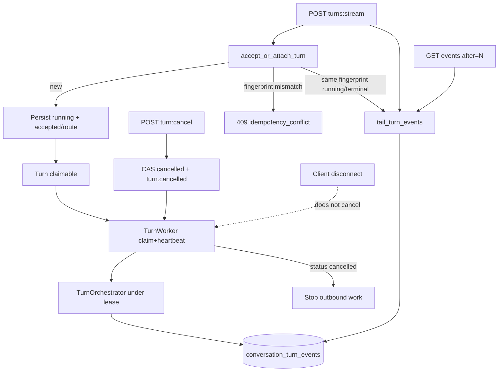
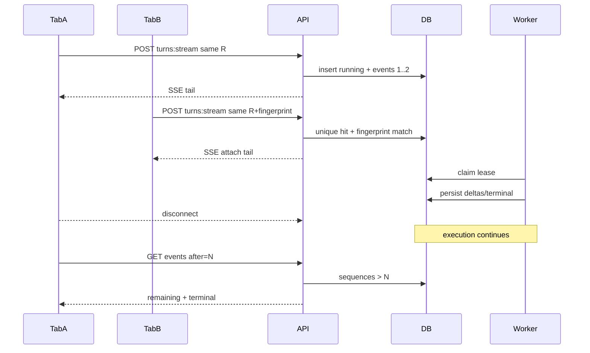

# Sealed Versioned SSE Live Resume Replay Pipeline - Plan

## Goal Capsule

- **Objective:** Complete master-build-plan slice P7-04 by sealing the versioned chat SSE pipeline: durable worker-leased turn execution that survives client disconnect, live attach/resume from the last applied sequence, terminal replay without re-calling retrieval or providers, cooperative cancel, atomic terminal persistence, idempotent attach for identical `(conversationId, clientRequestId)` fingerprints, and sealed grounded-refusal / evidence-only terminal projections.
- **Authority:** Root `AGENTS.md`; FR-06 and the closed Phase 1 chat capability manifest in `docs/prd.md`; M-03, M-10, C-01, and C-04 in `docs/interaction-behavior-prd.md`; `docs/contracts/sse-event-catalog.md` and turn rows in `docs/contracts/http-api-catalog.md`; `docs/database-schema.txt`; lease/worker rules in `docs/architecture/data-and-lifecycle.md` and `docs/architecture/deployment-topology.md`; DRIFT-23/24/25 in `docs/brownfield-refactor-register.md`; P7-03 residuals in `docs/_scratch/p7-03-orchestration-inventory.md` and `docs/_scratch/p7-03-orchestration-evidence.md`.
- **Execution profile:** Security- and concurrency-sensitive brownfield retain/modify of the turn stream producer, event ledger, and cancel path, with a forward Alembic migration for turn leases, database-leased turn worker registration, characterization-first HTTP/SSE proof, and real PostgreSQL attach/cancel/disconnect barrier tests. No invented public fields, ErrorCodes, or event types.
- **Readiness checkpoint:** Implementation-ready after the 2026-07-27 scoping confirmation: durable worker/lease disconnect-survives; cooperative cancel that stops provider/retrieval work; browser canonical reducer and `/chat` UI remain with P9.
- **Stop conditions:** Stop if the slice requires a new public field/ErrorCode/event type absent from approved contracts, cancel-on-disconnect, ungrounded domain fallback, a second stream protocol (WebSocket/`EventSource` for turn-start), Redis/Celery/message-broker queue, browser reducer ownership, redaction ownership, or exposing private conversation/turn/provider identifiers or prompts.
- **Tail ownership:** P7-05 owns source/domain delete redaction hooks and public omission; P8 owns system-wide privacy/audit breadth; P9 owns the browser live/resume/replay reducer and chat UI; P11 owns deeper composer-ref assembly beyond current turn fencing; P12 owns deployed-ingress stream-drain proof beyond local/API worker evidence.

---

## Product Contract

### Summary

P7-04 seals the producer side of versioned chat SSE after P7-03 has proven orchestration outcomes. Turn execution moves onto a database-leased worker so closing the client socket neither cancels nor completes the turn. HTTP start/attach and resume only authorize and tail the durable event ledger; identical concurrent submits attach without a second retrieval/provider call; changed fingerprints conflict; explicit cancel cooperatively stops outbound work and seals one cancelled terminal; terminal replay reconstructs from safe persisted state with `replay:true`; grounded-refusal and evidence-only terminals remain durable sealed projections. Browser reduction stays with P9.

Product Contract preservation: Product Contract authored in this bootstrap; no upstream brainstorm file. Scope confirmed 2026-07-27 (durable worker/lease; cooperative cancel; browser reducer deferred to P9).

### Problem Frame

P7-01–P7-03 delivered owner-scoped conversations, server route authority, durable event rows, and Evidence-only / grounded-refusal orchestration outcomes. The stream path still couples execution to the POST generator: disconnect closes the work generator (DRIFT-25), identical running retries dump stored events then end rather than live-attach (DRIFT-23), cancel seals the DB without stopping provider/retrieval, resume is a finite historical dump with no running-turn tail, terminal payloads always carry `replay:false`, and turn-event `cursor_expired` / `terminalSnapshot` is catalog-normative but unimplemented. Schema snapshots from P0-06 are not sealing evidence. Without this slice, P7-05/P9 cannot trust live/resume/replay equivalence or disconnect ≠ cancel.

### Requirements

**Durable execution and disconnect survival**

- R1. After turn accept, provider/retrieval execution runs under a database lease claimed by a turn worker registered in the existing worker process boundary; the HTTP request never owns synthesis/retrieval.
- R2. Closing a live stream connection neither cancels nor completes the turn; a later authorized resume/attach observes sequences persisted after the disconnect (`M-03`, DRIFT-25).
- R3. Expired leases are reclaimable; reclaim never undoes a sealed terminal and never starts a second concurrent executor for the same turn.

**Attach, resume, and terminal replay**

- R4. `POST .../turns:stream` with the same `(conversationId, clientRequestId)` and server-computed fingerprint attaches to the existing turn and tails the durable ledger without another retrieval or provider call; a changed fingerprint returns `409 idempotency_conflict` (`M-10`, DRIFT-23).
- R5. `GET .../turns/{turnId}/events?after=N` returns only sequences greater than `after` for an owner-authorized turn; for a still-running turn it live-tails until a terminal is available or the connection ends, without inferring completion from socket close.
- R6. Terminal replay is built only from persisted safe turn/evidence/ref state, marks terminal payloads with `replay:true`, and never calls retrieval, LightRAG, providers, or expired composer tokens.
- R7. When `after` is older than retained/reconstructable events, return `410 cursor_expired` with an authorized `terminalSnapshot` when available; the client replaces rather than merges.

**Cancel and single terminal**

- R8. Explicit cancel via the contracted cancel endpoint cooperatively stops in-flight retrieval/provider work for that turn, persists exactly one `turn.cancelled` terminal atomically with status `cancelled`, and refuses further non-terminal event appends after the terminal.
- R9. Disconnect is never treated as cancel. Cancel of one turn never cancels another member’s work (`C-01`).
- R10. An execution emits exactly one of completed/failed/cancelled. Terminal turn state and terminal event commit atomically. Persist each safe event before acknowledging its sequence as resumable.

**Sealed grounded terminals and privacy**

- R11. Preserve P7-03 outcomes: `no_grounded_context` and `evidence_only` complete as sealed durable terminals with legal prefixes; `evidence_only` only when no `answer.delta` was persisted; post-answer provider failure remains safe `turn.failed`.
- R12. Public SSE and HTTP error/snapshot projections remain private no-store and never emit prompts, plan/reasoning text, raw hits, provider payloads, credentials, runtime URLs, private IDs, traces, or stack traces.
- R13. Inventory records retain/modify/defer for stream producer, ledger, cancel, worker registration, and DRIFT-23/24/25 before behavior changes land; closure evidence and master-build-plan update only after verification passes.

### Acceptance Examples

- AE1. Eligible grounded turn: POST starts stream; worker emits legal grounded sequence; client disconnect mid-answer; worker finishes; GET `after=N` returns remaining sequences through `turn.completed` / `grounded` without a second retrieval/provider call.
- AE2. Concurrent identical tabs: two POSTs with same `clientRequestId` and fingerprint create one turn; both attach/tail the same ledger; exactly one retrieval/provider execution occurs (`M-10`).
- AE3. Same `clientRequestId` with changed message/domain/refs returns `409 idempotency_conflict` and does not start a second turn or provider call.
- AE4. Explicit cancel during synthesis: turn seals `cancelled`; no further `answer.delta` after the terminal; provider/retrieval loop stops cooperatively; other users’ turns unaffected.
- AE5. Terminal GET/attach of a completed refusal or evidence-only turn returns sealed events with terminal `replay:true`, null/absent answer as contracted, and zero provider/retrieval calls.
- AE6. Resume with an unreconstructable `after` returns `410 cursor_expired` plus authorized `terminalSnapshot` when available.
- AE7. Privacy sentinels injected into worker/provider fixtures do not appear in streamed events, terminal snapshots, persisted public fields, or focused log assertions.
- AE8. Producer fixture transcripts cover disconnect/resume, terminal replay, cancel, grounded refusal, evidence-only, duplicate delivery, and sequence gap for P9 reducer consumption later; this slice does not claim browser reducer DoD.

### Scope Boundaries

#### In scope

- Turn lease columns/indexes, schema contract update, and Alembic migration.
- Database-leased turn worker claim/heartbeat/reclaim registered beside prep/index/delete workers.
- Split accept/attach vs execute vs event-tail seams; live attach/resume; terminal `replay:true` on emit; `cursor_expired` + `terminalSnapshot` for turn events.
- Cooperative cancel fence and single-terminal CAS; sequence append under turn lock/CAS recovery.
- Sealed projection of P7-03 grounded-refusal / evidence-only / failure terminals over live/resume/replay.
- Inventory, focused HTTP/SSE/service tests, PostgreSQL race barriers, SSE fixture transcripts, DRIFT-23/24/25 closure notes, P7-04 evidence/tracker update.

#### Deferred for later

- Browser canonical reducer, chunking parser, and `/chat` UI states (P9 / DRIFT-03/06 consumer side).
- Source/domain delete redaction append/`turn.redacted` ownership (P7-05).
- System-wide privacy/audit sink scanning (P8).
- Deployed-ingress unbuffered SSE and stream-drain release evidence (P12).
- Multi-attempt repair beyond P7-03 single-shot budgets.
- Conversation-list pagination `cursor_expired` changes (already owned by P7-01; different surface).

#### Deferred to Follow-Up Work

- Capacity `429`/`503` shedding for concurrent turn starts beyond existing admission patterns (C-01 load path); record non-claim unless already present.
- Long-term event purge/retention jobs beyond “retention at least conversation retention” catalog rule.
- SSE comment keep-alive (`: keep-alive`) polish if short-poll tails are sufficient for proof.
- Broad BFF/Next streaming proxy hardening beyond current private FastAPI contract proof.

#### Outside this product's identity

- Open tool registry, plugins, terminal/filesystem/browser automation, agent approval queues, browser-selected model/provider/controller, WebSocket migration, Redis/RQ/Celery/message broker, ungrounded fallback for domain questions, or Phase 2/3 observability/wiki chat capabilities.

### Key Flows

- F1. New turn → accept/route persisted → worker claims lease → orchestration emits → completed/failed; HTTP tails ledger.
- F2. Disconnect mid-stream → worker continues → resume/attach from `after=N` → terminal.
- F3. Identical concurrent submit → one turn → both attach/tail → one execution.
- F4. Explicit cancel → cooperative stop → `turn.cancelled` sealed; no post-terminal deltas.
- F5. Terminal replay of grounded / `no_grounded_context` / `evidence_only` / failed / cancelled with `replay:true`.
- F6. Unreconstructable cursor → `410 cursor_expired` + `terminalSnapshot`.

### Actors

- A1. Authenticated member — owns conversation/turn; may disconnect, reconnect, or cancel explicitly.
- A2. HTTP stream projector — authorizes and tails durable events only.
- A3. Turn worker — sole leased executor of retrieval/synthesis after accept.
- A4. Orchestration outcomes (P7-03) — produce legal stop reasons; not rewritten by this slice.

---

## Planning Contract

### Key Technical Decisions

- KTD1. **Move turn execution onto a database-leased worker; HTTP only tails the ledger.** Register a turn worker in `app/context_engine/worker.py` alongside prep/index/delete. After accept, POST/GET stream projectors authorize and live-tail durable events; they never call retrieval or synthesis. `(session-settled: user-approved — chosen over request-scoped resume-only: confirmed in the P7-04 scoping synthesis)` Governs R1–R2, DRIFT-25.
- KTD2. **Extend `conversation_turns` with lease fields and update `docs/database-schema.txt` in the same slice.** Add `lease_owner` / `lease_expires_at` (and the minimal reclaim fence needed to mirror indexing/prep claim patterns). No Redis/outbox table unless inventory proves reclaim cannot work on the turn row. Governs R1, R3, R13.
- KTD3. **Cooperative cancel is a status fence observed by the worker before each persist and between outbound chunks.** Cancel endpoint CAS-seals `cancelled` + `turn.cancelled` when still running; worker re-reads status and refuses further non-terminal appends; synthesis/retrieval loops are driven so cancel can stop further work without cancel-on-disconnect. `(session-settled: user-approved — chosen over stream-detach-only cancel: confirmed in the P7-04 scoping synthesis)` Governs R8–R10, AE4.
- KTD4. **Idempotent attach uses unique `(conversation_id, client_request_id)` conflict + fingerprint compare.** Prefer transactional claim under the existing conversation lock, with IntegrityError fallback; identical fingerprint → attach/tail; mismatch → public `idempotency_conflict` (existing route mapping from `client_request_conflict`). Do not build attach on obsolete `claim_turn`. Governs R4, AE2–AE3, DRIFT-23.
- KTD5. **Terminal `replay:true` is applied on emit for attach/GET of terminal turns; historical rows stay as stored.** Reconstruct public terminal payloads from current safe turn/evidence/ref state when serving terminal replay; never re-call providers. Governs R6, AE5.
- KTD6. **Implement turn-event `410 cursor_expired` + authorized `terminalSnapshot` from the SSE catalog.** Distinct from conversation-list pagination expiry. Register/response-shape only as already catalogued — no invented browser fields. Governs R7, AE6.
- KTD7. **Reconstruct worker execution inputs from durable turn state at claim time.** Resolve synthesis via `TrustedRuntimeResolver`, prior questions from conversation history, and accepted composer-ref linkage already on the turn. Do not persist prompts, assembled context, or credentials. If lease reclaim finds `answer.delta` already persisted without a terminal, fail closed with safe provider-failure rather than double-synthesizing. Governs R1, R12, and privacy invariants.
- KTD8. **Keep browser reducer and redaction out of this slice.** Ship producer, ledger, resume/cancel HTTP, and fixture transcripts P9 can later consume; redaction remains P7-05. `(session-settled: user-approved — chosen over pulling browser reducer sealing into P7-04: confirmed in the P7-04 scoping synthesis)` Governs R13, AE8, Scope Boundaries.
- KTD9. **Preserve P7-03 orchestration outcomes; seal delivery, do not rewrite grounding rules.** Reuse `TurnOrchestrator` under the worker with cancel/lease checks around persist; keep `evidence_only` vs post-answer failure sequencing (P7-03 KTD5). Governs R11.

### High-Level Technical Design

### Assumptions

- Approved SSE catalog and HTTP turn routes already authorize the public surface; this slice implements producer/worker behavior and schema leases without inventing endpoints.
- P7-03 stop reasons and legal prefixes remain authoritative inputs; sealing does not reopen synthesis-provider selection.
- Conversation retention is sufficient event retention for Phase 1 cursor expiry proof; a dedicated purge job is not required to claim R7 if unreconstructable cursors can still be demonstrated (e.g., synthetic gap / retention stub in tests).
- Existing `ErrorCode` union already includes `cursor_expired`, `idempotency_conflict`, and `turn_not_cancellable`; prefer existing codes over new ones.

### Sequencing

1. Inventory and pin DRIFT-23/24/25 plus retain/modify/defer (U1).
2. Migration + schema lease fields (U2).
3. Split accept/attach vs worker execute vs event tail; register worker (U3).
4. Cooperative cancel, single-terminal, sequence fencing (U4).
5. Terminal replay / cursor expiry / grounded-terminal sealing (U5).
6. Focused tests, PostgreSQL races, fixtures, evidence, tracker (U6).

### System-Wide Impact

- **API/SSE consumers:** POST attach and GET resume change from finite dumps to durable tails; clients must keep treating socket close as non-terminal (P9 reducer already required). Pre-stream JSON errors remain unchanged.
- **Worker process:** Turn claims join the existing round-robin worker budget; tune lease/heartbeat settings so long synthesis does not starve prep/index/delete, and so reclaim remains shorter than user-visible stall tolerance.
- **Orchestration boundary:** TurnOrchestrator moves under the worker; P7-03 adapter injection and grounding outcomes must keep working without request-scoped DB sessions held across provider I/O.
- **BFF/ingress:** Still must pass 	ext/event-stream unbuffered; this slice proves API/worker behavior, not P12 deployed ingress.
- **Downstream slices:** P7-05 redaction must append after a single sealed terminal; P9 consumes producer fixtures; P11 must not assume request-thread assembly during execution.

### Risks & Dependencies

| Risk | Mitigation |
| --- | --- |
| Partial answer after worker death → double synthesis | KTD7: if any nswer.delta exists without a terminal, reclaim fails closed with safe provider-failure. |
| Cancel seals DB but provider keeps streaming | Drive synthesis/retrieval token-by-token (or abort-aware wrapper); check status before each persist (U4 barrier). |
| Dual writers race on sequence/terminal | Turn-row lock or CAS around append; uniqueness as backstop; PostgreSQL cancel-vs-worker proof. |
| Schema lease columns drift from public contracts | Leases stay private; schema.txt + migration land together; DTO/SSE snapshot gates catch leakage. |
| Live-tail holds HTTP connections too long | Bounded wait/poll with client reconnect authority; optional keep-alive later; never infer completion on close. |
| Test false confidence on SQLite | Attach/cancel/disconnect races require PostgreSQL barriers only. |

**Dependencies:** P7-03 DONE (orchestration outcomes); existing worker process and lease patterns; versioned SSE schema from P0-06. **Blocks:** P7-05 redaction acceptance that assumes sealed terminals; P9-02 reducer acceptance that needs producer transcripts; P11-04 product gate naming P7-04.

### Open Questions

- Deferred: Exact live-tail wait/poll interval and keep-alive comment emission — implementer chooses within catalog reconnect rules; not product-blocking.
- Deferred: Whether illegal cancel of a non-running turn stays silent/idempotent or returns 	urn_not_cancellable — follow inventory against HTTP catalog; do not invent a new code.
- Deferred: Synthetic strategy for proving cursor_expired if real retention purge is absent — test double or retention stub acceptable; must still return authorized snapshot shape.

---

## Implementation Units

### U1. Inventory stream, ledger, cancel, and worker seams

- **Goal:** Record retain/modify/defer for the request-coupled stream producer, event ledger helpers, cancel path, resume projector, idempotent start/attach, and worker registry before behavior edits; pin DRIFT-23/24/25 and confirmed scope.
- **Requirements:** R13
- **Dependencies:** None
- **Files:**
  - Create: `docs/_scratch/p7-04-sse-pipeline-inventory.md`
  - Modify if needed: `docs/brownfield-refactor-register.md` (note only; status flips in U6)
- **Approach:** Mirror P7-03 inventory columns. Capture `stream_turn_events`, `_streaming_sse_response` finally-close, `_persist_event` max+1 race, `_cancel_running_turn` non-cooperative seal, `_stored_events` finite dump, `replay=false` terminal payloads, missing turn leases, and `worker.py` prep/index/delete-only registration. Explicitly defer browser reducer (P9) and redaction (P7-05). Pin KTD1–KTD3 and KTD8 as implementation constraints.
- **Patterns to follow:** `docs/_scratch/p7-03-orchestration-inventory.md`, `docs/_scratch/p7-02-intent-route-inventory.md`
- **Test scenarios:**
  1. Inventory lists production callers of `stream_turn_events`, `stream_turn_events_by_turn`, `cancel_turn`, `_persist_event`, and `build_workers`.
  2. Inventory records disconnect-aborts-generator and non-live attach as modify items for DRIFT-25/23.
  3. Inventory pins P9 reducer and P7-05 redaction as defer with no ownership claim.
- **Verification:** Inventory exists and is referenced by later units before stream/worker behavior changes land.
- **Covers:** R13; KTD1, KTD8.

### U2. Turn lease migration and schema contract

- **Goal:** Add reclaimable lease fields on `conversation_turns` and keep ORM + `docs/database-schema.txt` synchronized.
- **Requirements:** R1, R3, R13
- **Dependencies:** U1
- **Files:**
  - Create: `app/migrations/versions/<revision>_turn_execution_leases.py` (name per Alembic convention)
  - Modify: `app/context_engine/models.py` (`ConversationTurn`)
  - Modify: `docs/database-schema.txt` (`conversation_turns`)
  - Create/modify: focused migration/model test if the repo pattern requires one for new chat columns
- **Approach:** Expand-only migration: nullable `lease_owner`, `lease_expires_at`, and any minimal reclaim/generation fence required to mirror prep/index claim safely. Do not expose leases on public DTOs. Update schema contract in the same unit. No rewrite of historical migrations.
- **Execution note:** Prefer migration + model characterization before wiring the worker claim path.
- **Patterns to follow:** Index/prep lease columns and claim indexes; recent chat migrations `c7d91e5a2f04_*`, `d07141ac7d95_*`
- **Test scenarios:**
  1. Fresh migration applies; `ConversationTurn` exposes lease columns; schema text mentions them.
  2. Public turn DTO / SSE envelope still omit lease owner/expiry.
  3. Upgrade from prior head succeeds without rewriting old revisions.
- **Verification:** Migration head includes turn leases; schema contract and ORM agree; no public DTO leakage.
- **Covers:** R1, R3; KTD2.

### U3. Accept/attach, worker execute, and event-tail split

- **Goal:** Decouple HTTP streaming from orchestration by introducing accept/attach, leased worker execution, and durable event-tail projectors.
- **Requirements:** R1–R5, R10, AE1–AE3
- **Dependencies:** U2
- **Files:**
  - Modify: `app/context_engine/services/chat_turns.py`
  - Modify: `app/context_engine/worker.py`
  - Modify: `app/context_engine/api/routes.py` (thin wiring only if projector entrypoints change)
  - Modify: `app/context_engine/config.py` (turn lease/heartbeat settings mirroring prep/index)
  - Create/modify: `app/tests/test_chat_sse_http_contract.py`, `app/tests/test_chat_turn_route_http_contract.py`, `app/tests/test_postgres_conversations.py` (or dedicated turn-lease PG test)
- **Approach:** `accept_or_attach_turn` owns classification/idempotency (reuse P7-02 `start_or_replay_turn` authority) and leaves the turn claimable. `ConversationTurnWorker` claims with `FOR UPDATE SKIP LOCKED`, heartbeats during outbound I/O on a separate session, and runs `TurnOrchestrator` under the lease. `tail_turn_events(after)` is the sole SSE body for POST attach and GET resume: poll/wait for new durable sequences while running, then end after terminal. Reconstruct worker inputs per KTD7. Preserve adapter injection seams used by tests.
- **Execution note:** Start with a failing disconnect-survives integration test: abort the client stream, run one worker pass, resume `after=N`, assert terminal without second provider call.
- **Patterns to follow:** `SourceIndexWorker` claim/heartbeat/generation fencing; `start_or_replay_turn` fingerprint matching; P7-03 orchestrator injection
- **Test scenarios:**
  1. Happy path: POST accepts; worker completes grounded/direct turn; SSE tail observes full legal sequence.
  2. Disconnect-survives: client closes after early sequences; worker finishes; GET `after=N` returns remainder through terminal; provider call count remains one.
  3. Identical concurrent attach: two POSTs → one turn row → both tails see same terminal; one execution.
  4. Fingerprint conflict: second POST with changed message → `409 idempotency_conflict`; no second execution.
  5. GET resume on running turn eventually observes newly persisted sequences without re-orchestration in the request thread.
  6. Lease reclaim: expired lease is taken by a second worker only while status is still `running` and no terminal exists.
- **Verification:** HTTP generators no longer invoke synthesis/retrieval; worker path owns execution; attach/resume consume the ledger.
- **Covers:** R1–R5, R10; AE1–AE3; KTD1, KTD4, KTD7, KTD9.

### U4. Cooperative cancel and single-terminal fencing

- **Goal:** Make cancel stop outbound work and guarantee exactly one terminal event/state.
- **Requirements:** R8–R10, AE4
- **Dependencies:** U3
- **Files:**
  - Modify: `app/context_engine/services/chat_turns.py` (cancel + `_persist_event` / finalize CAS)
  - Modify: synthesis/retrieval call sites as needed for cancel checks between chunks
  - Create/modify: `app/tests/test_canonical_turn_event_behavior.py`, `app/tests/test_chat_sse_http_contract.py`, PostgreSQL cancel-vs-worker barrier test
- **Approach:** Cancel CAS-transitions `running → cancelled` and appends `turn.cancelled` atomically when still running. Worker checks status before each event persist and between token/retrieval steps. After a terminal exists, non-terminal appends fail closed. Sequence allocation uses turn-row lock or equivalent CAS recovery so concurrent cancel/worker writers cannot dual-terminal. Non-running cancel remains safe/idempotent using existing error mapping (`turn_not_cancellable` only if contracts require a conflict response for illegal state — prefer current owner-safe behavior unless inventory finds a contract gap).
- **Execution note:** Prove with a PostgreSQL barrier: worker blocked before next persist; cancel commits; worker resume attempts persist and must not append deltas after terminal.
- **Patterns to follow:** Existing `_cancel_running_turn` / `_complete_turn` / `_fail_turn` CAS; index worker “result is current” fences
- **Test scenarios:**
  1. Cancel during synthesis → `turn.cancelled` terminal; no later `answer.delta`; status `cancelled`.
  2. Cancel then worker finalize race → exactly one terminal event; turn status matches that terminal.
  3. Disconnect without cancel → turn continues and can complete successfully.
  4. Cancel turn A does not affect turn B for another conversation/user.
  5. Double cancel is safe (no second terminal / no 500).
- **Verification:** Cooperative stop proven; single-terminal invariant holds under cancel/worker concurrency.
- **Covers:** R8–R10; AE4; KTD3.

### U5. Terminal replay, cursor expiry, and grounded-terminal sealing

- **Goal:** Seal terminal projections for live/resume/replay, including grounded refusal and evidence-only, plus catalog cursor expiry.
- **Requirements:** R6, R7, R11, R12, AE5–AE7
- **Dependencies:** U3, U4
- **Files:**
  - Modify: `app/context_engine/services/chat_turns.py` (emit-time `replay:true`, terminal reconstruction, cursor expiry)
  - Modify: `app/context_engine/api/routes.py` / error projection if `terminalSnapshot` envelope needs wiring
  - Modify as needed: `app/context_engine/api/public_schemas.py` or SSE/OpenAPI registration only for catalogued `terminalSnapshot`
  - Create/modify: `app/tests/fixtures/sse/*`, `app/tests/test_generated_sse_contract.py`, `app/tests/test_chat_orchestration.py` (regression), `app/tests/test_chat_sse_http_contract.py`
- **Approach:** On attach/GET for terminal turns, serve public events with terminal `replay:true` without mutating historical privacy-sensitive rows unnecessarily; reconstruct from safe turn/evidence/ref state when required by catalog. Implement `410 cursor_expired` with authorized `terminalSnapshot` for unreconstructable `after`. Add producer transcripts for no-grounded-context, evidence-only, terminal replay, disconnect/resume, cancel, and cursor expiry. Keep OpenAPI/SSE schema changes limited to catalogued shapes; regenerate client only if contracts change.
- **Patterns to follow:** SSE catalog examples; existing `app/tests/fixtures/sse/`; P7-03 AE2/AE3 outcome tests
- **Test scenarios:**
  1. Covers AE5. Completed `no_grounded_context` and `evidence_only` GET/attach mark terminal `replay:true` and invoke zero provider/retrieval calls.
  2. Covers AE6. Unreconstructable `after` → `410 cursor_expired` + authorized snapshot fields only.
  3. Grounded completed replay preserves citation/Evidence order and omits forbidden keys.
  4. Covers AE7. Privacy sentinels absent from events, snapshots, and focused logs.
  5. Fixture transcripts validate against the versioned SSE schema; schema gate still passes.
- **Verification:** Catalog resume/replay/cursor rules held for producer; P7-03 terminals remain legal under sealed delivery.
- **Covers:** R6, R7, R11, R12; AE5–AE7; KTD5, KTD6, KTD9.

### U6. Race proof, fixtures matrix, evidence, and tracker closure

- **Goal:** Prove attach/cancel/disconnect races at PostgreSQL, land fixture matrix for P9, close DRIFT-23/24/25 producer ownership, and record P7-04 completion evidence.
- **Requirements:** R4, R8, R12, R13, AE2, AE4, AE8
- **Dependencies:** U3, U4, U5
- **Files:**
  - Modify: `app/tests/test_postgres_conversations.py` and/or new `app/tests/test_postgres_turn_leases.py`
  - Modify: `app/tests/fixtures/sse/`
  - Create: `docs/_scratch/p7-04-sse-pipeline-evidence.md`
  - Modify: `docs/master-build-plan.md` (P7-04 row + closure note)
  - Modify: `docs/brownfield-refactor-register.md` (DRIFT-23/24/25 statuses; DRIFT-03/06 residual note for P9)
- **Approach:** Barrier tests for dual-tab identical attach, fingerprint conflict, cancel-vs-worker, disconnect-survives + resume, and lease reclaim. Keep reducer execution out; fixtures are producer/schema-valid transcripts. Evidence doc records commands, privacy assertions, residuals (P7-05/P8/P9/P12), and DRIFT closures. Update master-build-plan only after gates pass.
- **Execution note:** Prefer real PostgreSQL barriers over sleeps; SQLite is not concurrency evidence.
- **Patterns to follow:** `docs/_scratch/p7-03-orchestration-evidence.md`; `app/tests/test_postgres_source_index_claim.py`; definition-of-done chat/SSE row
- **Test scenarios:**
  1. PostgreSQL dual-insert/attach race yields one turn and one execution.
  2. PostgreSQL cancel-vs-worker race yields one terminal and no post-terminal deltas.
  3. Disconnect-survives + resume yields identical terminal projection to an uninterrupted live stream.
  4. Covers AE8. Fixture set includes disconnect/resume, terminal replay, cancel, grounded refusal, evidence-only, duplicate delivery, sequence gap.
  5. Focused suite + changed-file Ruff pass; generated SSE contract gate green if schemas touched.
- **Verification:** Evidence artifact exists; P7-04 marked DONE with residuals named; DRIFT-23/24/25 producer closures recorded; P9 residuals explicit.
- **Covers:** R4, R8, R12, R13; AE2, AE4, AE8; KTD1, KTD3, KTD4, KTD8.

---

## Verification Contract

- Inventory before behavior edits (U1).
- Migration fresh-install/upgrade proof for turn leases (U2).
- Focused HTTP/SSE contract tests for start/attach, resume, cancel, terminal replay, cursor expiry (U3–U5).
- Orchestration regression for `no_grounded_context` / `evidence_only` / post-answer failure (U5).
- PostgreSQL barrier tests for attach, cancel-vs-worker, disconnect-survives, lease reclaim (U3, U4, U6).
- SSE fixture schema validation / generated SSE contract gate (U5–U6).
- Privacy sentinel assertions on events, snapshots, and focused logs (U5).
- Changed-file Ruff; no public DTO leakage of leases/private IDs.
- Closure evidence + master-build-plan + brownfield register updates (U6).

## Definition of Done

- [ ] P7-04 inventory records retain/modify/defer and DRIFT pins before stream/worker edits.
- [ ] Turn leases exist in migration, ORM, and `docs/database-schema.txt`; not exposed publicly.
- [ ] HTTP stream paths only authorize and tail durable events; worker owns retrieval/synthesis.
- [ ] Disconnect-survives + resume proven; cancel is cooperative and single-terminal.
- [ ] Identical fingerprint attach and changed-fingerprint conflict proven at PostgreSQL.
- [ ] Terminal replay uses `replay:true` without provider/retrieval; grounded refusal and evidence-only remain sealed.
- [ ] `410 cursor_expired` + authorized `terminalSnapshot` implemented for turn events.
- [ ] Producer fixtures/transcripts landed for later P9 reducer consumption; browser reducer not claimed.
- [ ] Privacy assertions hold; DRIFT-23/24/25 producer closures recorded; P7-05/P8/P9/P12 residuals explicit.
- [ ] `docs/_scratch/p7-04-sse-pipeline-evidence.md` and master-build-plan P7-04 row updated only after verification passes.

## Sources & Research

- Master-build-plan P7-04 deliverable; P7-03 plan/inventory/evidence residuals for sealed SSE ownership.
- `docs/contracts/sse-event-catalog.md` legal sequences, resume/replay/cursor rules, fixture matrix.
- `docs/interaction-behavior-prd.md` M-03, M-10, C-01, C-04; `docs/prd.md` FR-06 and closed Phase 1 chat capability manifest.
- Brownfield DRIFT-23/24/25; P0-06 note that schema generation ≠ sealed producer behavior.
- Local patterns: `chat_turns.py` ledger/cancel; `routes.py` stream wrapper; `worker.py`; indexing/prep/domain lease claim+heartbeat; existing SSE HTTP and canonical turn tests.
- External research: skipped — local lease-worker and SSE-catalog patterns are sufficient; no unsettled external option set.
- Agent-native expansion: out of Phase 1 identity (closed chat capability manifest; no open tool registry).
