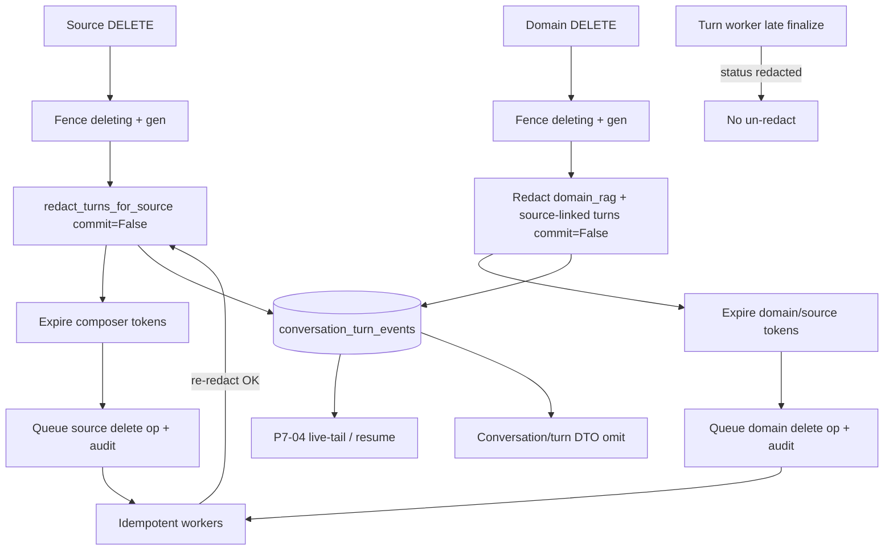
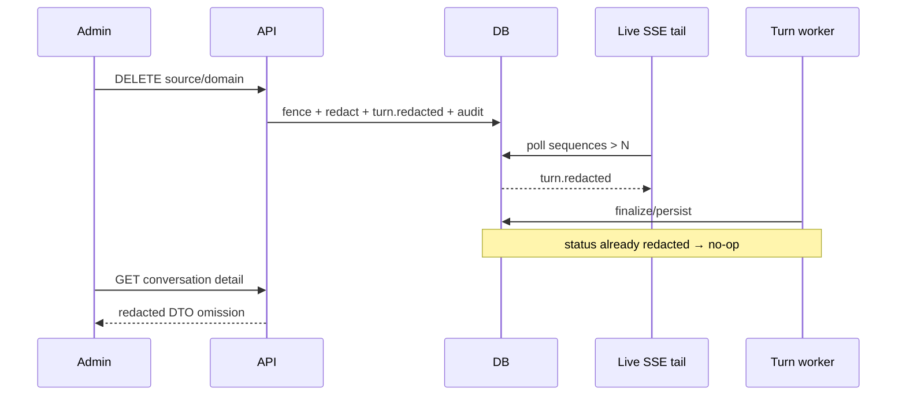

# Source and Domain Delete Redaction Omission - Plan

## Goal Capsule

- **Objective:** Complete master-build-plan slice P7-05 by proving that source and domain deletion redacts every affected turn as a unit inside the delete fence transaction, appends a durable superseding `turn.redacted` event, fences late turn-worker completion so it cannot un-redact, and that conversation detail / SSE live-tail / resume / replay / terminalSnapshot public surfaces omit redacted answer, evidence, citations, and accepted refs while preserving the user question.
- **Authority:** Root `AGENTS.md`; FR-08 and the closed Phase 1 chat capability manifest in `docs/prd.md`; M-11, A-09, A-10 in `docs/interaction-behavior-prd.md`; `docs/contracts/sse-event-catalog.md`, turn/conversation rows in `docs/contracts/http-api-catalog.md` and `docs/contracts/dto-schema-catalog.md`; `docs/database-schema.txt` deletion/redaction invariants; DRIFT-29 chat-redaction half in `docs/brownfield-refactor-register.md`; P7-04 residuals in `docs/_scratch/p7-04-sse-pipeline-inventory.md` and `docs/_scratch/p7-04-sse-pipeline-evidence.md`; P4-04 source fence+redact pattern in `docs/_scratch/p4-04-source-outline-delete-inventory.md`.
- **Execution profile:** Privacy- and concurrency-sensitive brownfield retain/modify of existing redaction helpers and delete enqueue paths, with inventory-first disposition, characterization and PostgreSQL barrier proof for delete-driven public omission, and no new public fields, ErrorCodes, or SSE event types.
- **Readiness checkpoint:** Implementation-ready after the 2026-07-27 scoping confirmation: durable ledger append for live observation; running-turn mid-delete redaction with fence; domain-delete redaction first-class parity with source-delete at enqueue.
- **Stop conditions:** Stop if the slice requires a new public field/ErrorCode/event type, a separate SSE fanout channel, browser redaction UI ownership, system-wide privacy/audit sink scanning, deeper composer-ref assembly ownership, implementing missing evidence/document HTTP routes solely to claim M-11 location denial, undoing retrieval fencing on cleanup retry, or exposing private conversation/turn/provider identifiers or prompts.
- **Tail ownership:** P8 owns system-wide privacy/audit breadth and DRIFT-29 audit half; P9 owns browser redaction/viewer UI and reducer application of `turn.redacted`; P9-03 owns evidence/document location/content route implementation and M-11 open-panel denial at those routes; P11 owns deeper composer-ref assembly beyond token expiry already on delete fences; P12 owns deployed-ingress adversarial deletion review.

---

## Product Contract

### Summary

P7-05 closes the chat half of deletion: when an admin deletes a source or domain, affected turns become `redacted` in the same protected fence transaction that blocks retrieval, a higher-sequence `turn.redacted` is appended to the durable ledger, public projections omit derived content, and cleanup/retry never restores answers or eligibility. Source delete already calls redaction at enqueue; domain delete still redacts only in the worker and lacks delete-driven public-omission proof. This slice hardens helpers, moves domain redaction to enqueue parity, and proves omission over detail and SSE surfaces that exist today.

Product Contract preservation: Product Contract authored in this bootstrap; no upstream brainstorm file. Scope confirmed 2026-07-27 (durable live observation; running-turn fence; domain parity).

### Problem Frame

P7-01–P7-04 delivered owner conversations, route authority, orchestration outcomes, and a sealed durable SSE ledger with worker leases. Redaction helpers and source-delete fence hooks already exist, and a unit test sanitizes the ledger for a direct `_redact_turns` call, but domain delete fences without redacting, `redact_turns_for_domain` always auto-commits (blocking atomic fence+audit), delete-driven HTTP/SSE omission is unproven, and running-turn redaction vs late worker completion has fence code without barrier tests. Without this slice, FR-08 / M-11 / A-09 / A-10 chat outcomes remain incomplete and P8/P9 cannot treat redaction as durable server truth.

### Requirements

**Delete-fence redaction**

- R1. Source delete enqueue retains fence → redact affected turns → expire governed tokens → queue cleanup → audit intent in one protected transaction (`A-09`); cleanup retry must not undo redaction or restore eligibility.
- R2. Domain delete enqueue redacts dependent turns and expires governed composer tokens for every source in the domain in the same protected fence transaction that sets `deleting` and queues the delete operation (`A-10`), not only later in `DomainDeleteWorker`.
- R3. Dependent turns for domain delete include `domain_rag` turns for that domain and turns linked by evidence or composer refs to any source in that domain; per-source re-redact during purge remains an idempotent safety net.
- R4. Every affected turn is redacted as a unit: preserve `user_message`; clear assistant answer and public evidence/citation/accepted-ref fields; stamp evidence/composer `redacted_at`; retain private linkage for audit/mapping (`FR-08`).
- R5. Redaction is idempotent: already-`redacted` turns are skipped (no second `turn.redacted` append).

**Durable ledger and live observation**

- R6. Redaction appends exactly one superseding `turn.redacted` with approved payload shape after sanitizing forbidden public projections in prior answer/evidence/completed events (`sse-event-catalog.md`).
- R7. Attached live SSE tails observe redaction only via the durable ledger append (P7-04 live-tail); no separate fanout channel. `(session-settled: user-approved — chosen over separate live push: confirmed in the P7-05 scoping synthesis)`
- R8. Running turns are in scope: mid-delete redaction moves status to `redacted` and late turn-worker finalize/persist must not overwrite redacted status or append non-`turn.redacted` events. `(session-settled: user-approved — chosen over completed-only redaction first: confirmed in the P7-05 scoping synthesis)`

**Public omission**

- R9. Conversation detail / turn DTO projection for redacted turns returns `status=redacted`, `assistantAnswer:null`, `evidence:[]`, `acceptedRefs:[]`, preserves the user question, and never emits cleared private excerpts.
- R10. SSE resume/replay and terminalSnapshot after redaction omit superseded answer/evidence/citations and surface `turn.redacted` / redacted terminal fields as contracted; historical sanitized payloads must not reintroduce cleared text.
- R11. Inventory records retain/modify/defer before behavior edits; closure evidence and master-build-plan update only after verification passes.

### Acceptance Examples

- AE1. Admin deletes source S cited by completed turn T: fence transaction redacts T; GET conversation detail omits answer/evidence/acceptedRefs; user question remains (`M-11`, `A-09`).
- AE2. Admin deletes domain A with `domain_rag` turns and source-cited turns: enqueue transaction redacts both classes before worker cleanup; member selection already excludes A; turns stay redacted after cleanup retry (`A-10`).
- AE3. Member already attached on a live tail for turn T; admin delete redacts T; the live-tail delivers `turn.redacted`. Separately, GET resume `after=N` (cursor before sensitive events) and terminal attach/replay omit superseded answer/evidence/citations; when applicable, `410 cursor_expired` `terminalSnapshot` shows redacted null/empty derived fields. No second retrieval/provider call.
- AE4. Running turn T is redacted mid-execution; late worker finalize/persist cannot restore `completed` or append further `answer.delta` / terminal non-redacted events.
- AE5. Re-delete / re-redact path is idempotent: second redact changes zero rows and does not append a second `turn.redacted`.
- AE6. Privacy sentinels in answer/evidence excerpts before redaction do not appear in post-redaction detail, SSE replay payloads, or terminalSnapshot.
- AE7. Evidence/document location/content HTTP denial after redaction remains an explicit residual until those routes exist (P9-03); this slice does not invent routes to claim that half of M-11.

### Scope Boundaries

#### In scope

- Retain/modify of `_redact_turns`, sanitize helper, `redact_turns_for_source`, `redact_turns_for_domain` (`commit=` parity).
- Domain enqueue fence+redact+token-expiry alignment with source delete pattern.
- Idempotent worker/purge re-redact as safety net only.
- Public omission proof for conversation/turn detail and SSE live-tail/resume/replay/terminalSnapshot.
- Running-turn vs late-worker barrier proof.
- Inventory, focused tests, PostgreSQL delete-redaction barriers, evidence docs, DRIFT-29 chat-redaction note, master-build-plan P7-05 update.

#### Deferred for later

- Browser redaction UI / open Evidence panel close UX (P9).
- System-wide privacy/audit sink scanning and broad DRIFT-29 audit allowlist breadth (P8).
- Evidence/document location and content route implementation + open-panel denial (P9-03).
- Deeper composer-ref assembly / fingerprint invalidation beyond delete-path token expiry (P11).
- Deployed-ingress adversarial deletion review (P12-03).

#### Deferred to Follow-Up Work

- Expanding sanitize rewrite to additional historical event types only if omission proofs show leakage through resume; do not broaden without a failing test.
- Capacity or batching optimizations for domains with very large turn sets beyond correct transactional redaction.

#### Outside this product's identity

- Open tool registry, plugins, terminal/filesystem/browser automation, WebSocket migration, Redis/RQ/Celery, ungrounded domain fallback, Phase 2 observability browse/export, Phase 3 wiki publication.

### Key Flows

- F1. Admin source delete → fence+redact+token expiry+queue → member detail/SSE omit derived content.
- F2. Admin domain delete → enqueue fence+redact dependent turns+expire governed tokens → worker cleanup idempotent → redaction preserved.
- F3. Live-tail or resume after redaction → observe `turn.redacted` / omitted derived fields.
- F4. Running turn redacted → late worker cannot un-redact.
- F5. Cleanup failure/retry → continues cleanup; never restores answer or eligibility.

### Actors

- A1. Administrator — confirms source/domain delete.
- A2. Conversation owner — observes redacted projections on detail/SSE; question preserved.
- A3. Delete fence transaction — authoritative redaction boundary.
- A4. Turn worker — must honor redacted fence; must not un-redact.
- A5. Domain/source delete workers — idempotent cleanup after fence; may re-redact safely.

---

## Planning Contract

### Key Technical Decisions

- KTD1. **Extend existing redaction helpers; do not invent a parallel redaction service or event protocol.** Retain `_redact_turns` / sanitize / source helper shapes; add `commit=` to `redact_turns_for_domain` to match source; modify only what inventory proves broken. Governs R4–R6, R11.
- KTD2. **Domain delete redacts at enqueue inside `commit_protected_mutation`, first-class parity with source delete.** Also expire governed composer tokens for every source in the domain in that same transaction (today only `enqueue_delete_source` / purge call `_expire_composer_tokens_for_source`; domain enqueue does not). Worker/purge re-redact stays idempotent safety; primary A-10 timing is the fence transaction. `(session-settled: user-approved — chosen over worker-only domain redaction / source-only hardening: confirmed in the P7-05 scoping synthesis)` Governs R2–R3, AE2.
- KTD3. **Dependent domain turns = `domain_rag` by `domain_id` union source-linked evidence/composer turns for all sources in the domain.** Prefer composing existing helpers with `commit=False` over a new query API unless inventory shows a clearer single helper; avoid double `turn.redacted` via existing status skip. Governs R3, AE2, AE5.
- KTD4. **Live observation is durable ledger append + P7-04 live-tail only.** No Redis pub/sub or in-process fanout. `(session-settled: user-approved)` Governs R7, AE3.
- KTD5. **Running-turn redaction relies on existing P7-04 status/execution fences; prove with PostgreSQL barriers rather than redesigning the worker.** Late finalize must no-op when status is already `redacted`. `(session-settled: user-approved)` Governs R8, AE4.
- KTD6. **Public omission proofs ride existing conversation/SSE routes; evidence/document location denial is an explicit residual to P9-03.** Do not scaffold missing routes in this slice. Governs R9–R10, AE7.
- KTD7. **Cleanup retry must never undo redaction, token invalidation, or retrieval fencing.** Align assertions with P4-04 A-09 race/failure rule. Governs R1, F5.

### High-Level Technical Design

### Assumptions

- P7-04 sealed terminals and live-tail are DONE and remain stable; this slice appends after that ledger contract.
- Source enqueue redaction call site is largely correct; primary behavior gap is domain enqueue timing plus delete-driven omission/race proof.
- Existing `ErrorCode` / SSE schemas already include `turn.redacted` and redacted turn status; no contract generation change expected unless projection drift surfaces.
- Evidence/document HTTP routes remain catalog-allowed missing surfaces owned by P9-03; M-11 open-panel half is residual, not a P7-05 blocker.

### Sequencing

1. Inventory retain/modify/defer and pin KTDs (U1).
2. Helper `commit=` parity and domain dependent-turn selection (U2).
3. Domain enqueue fence+redact+token expiry wiring (U3).
4. Public omission + running-turn barrier tests and evidence/tracker (U4).

### System-Wide Impact

- **Delete latency:** Domain enqueue may redact many turns and expire many composer tokens inside the protected mutation; keep work transactional and correct, not prematurely batched unless barriers prove timeout risk.
- **Governed refs:** Token expiry must move into domain enqueue parity with source delete so live tokens cannot assemble deleted-domain context after the fence; deeper assembly/fingerprint rules remain P11.
- **SSE consumers / P9:** Live clients already must treat `turn.redacted` as superseding; this slice proves producer delivery, not browser reducer DoD.
- **Workers:** Domain delete worker must tolerate already-redacted turns and already-expired tokens; turn worker must honor redacted fence.
- **Audit:** Per-turn `chat.turn_redacted` remains; domain delete queued audit stays; broad allowlist/privacy scans stay P8.
- **Downstream:** P8/P9/P9-03/P11/P12 residuals must stay explicit in evidence.

### Risks & Dependencies

| Risk | Mitigation |
| --- | --- |
| Domain enqueue auto-commit splits fence from redact | KTD2/`commit=False` inside `commit_protected_mutation` (U2–U3). |
| Domain fence redacts turns but leaves live composer tokens | Expire tokens per domain source in the same mutate() using existing source helper (U3). |
| Double redact appends duplicate `turn.redacted` | Existing status skip; AE5 assertion. |
| Late worker un-redacts completed answer | Retain P7-04 CAS; PostgreSQL AE4 barrier. |
| Resume re-emits unsanitized historical payloads | Sanitize + omission tests AE3/AE6; widen sanitize only on fail. |
| Large domain makes fence transaction too long | Prove correctness first; if timeouts appear, record follow-up batching — do not weaken atomic fence+redact+audit. |
| Claiming M-11 location denial without routes | KTD6 residual AE7. |
| SQLite false confidence on races | Running-turn and concurrent delete proofs on PostgreSQL 16 only. |

**Dependencies:** P7-04 DONE; P4-04 source enqueue fence+redact+token-expiry *code pattern* (PostgreSQL delete-driven redaction/omission proof is owned by this slice’s U4, not assumed pre-satisfied). **Blocks:** honest P7 phase chat redaction exit; P8/P9 assumptions that delete-driven omission is server-true.

### Open Questions

- None blocking. Deferred: whether sanitize must rewrite additional historical event types — only if omission tests fail (follow-up work).

---

## Implementation Units

### U1. Inventory retain/modify/defer for delete redaction

**Goal:** Record brownfield disposition and pin KTDs before behavior edits.

**Requirements:** R11; Scope Boundaries; KTD1–KTD7

**Dependencies:** None

**Files:**
- Create: `docs/_scratch/p7-05-delete-redaction-inventory.md`
- Modify: `docs/brownfield-refactor-register.md` (DRIFT-29 chat-redaction note only if inventory changes disposition text)

**Approach:** Mirror `docs/_scratch/p7-04-sse-pipeline-inventory.md` and `docs/_scratch/p4-04-source-outline-delete-inventory.md`. Capture source enqueue redact (retain), domain enqueue missing redact (modify), `redact_turns_for_domain` missing `commit=` (modify), worker/purge re-redact (retain as idempotent safety), P7-04 finalize/persist fences (retain/prove), detail omission helpers (retain/prove), evidence/document routes (defer P9-03), UI/P8/P11 (defer). Pin session-settled KTD2/KTD4/KTD5.

**Patterns to follow:** Prior P7 inventory tables with retain/modify/defer and explicit non-claims.

**Test scenarios:**
1. Inventory lists every redaction helper and both delete enqueue paths with a disposition.
2. Inventory pins live=durable-tail, running-turn in scope, domain enqueue parity, and P9-03 location residual.
3. Inventory forbids inventing public fields/events or a second fanout channel.

**Verification:** Inventory exists and is cited by later units; no behavior PR without it.

---

### U2. Redaction helper commit parity and dependent-turn selection

**Goal:** Make domain redaction safely composable inside a protected mutation and select all dependent turns.

**Requirements:** R3–R6, R8; KTD1, KTD3, KTD5; AE5

**Dependencies:** U1

**Files:**
- Modify: `app/context_engine/services/chat_turns.py`
- Test: `app/tests/test_canonical_turn_event_behavior.py` (and/or a focused new `app/tests/test_delete_redaction.py` if clearer)

**Approach:** Add `commit: bool = True` to `redact_turns_for_domain` and thread it to `_redact_turns`. Add a small domain-dependent selection path (compose domain_rag query + per-source evidence/composer union, or one helper used by enqueue) that redacts with `commit=False`. Keep sanitize + single `turn.redacted` append behavior; do not redesign ledger sequencing. Confirm running-turn status transition still relies on existing `_persist_event` / finalize fences.

**Execution note:** Start from failing unit coverage for `commit=False` no-commit behavior and idempotent second redact.

**Patterns to follow:** `redact_turns_for_source(..., commit=False)` used by `enqueue_delete_source`.

**Test scenarios:**
1. Happy path: `redact_turns_for_domain(..., commit=False)` redacts in-session without committing; outer commit publishes `turn.redacted`.
2. Edge: second redact on already-redacted turn returns 0 and does not append another `turn.redacted` (AE5).
3. Edge: domain selection includes a `domain_rag` turn, a turn linked only via evidence ref to a domain source (including `direct_llm` if linked), and a turn linked only via composer ref to a domain source.
4. Error/fence: after redaction, `_persist_event` of `answer.delta` raises / rolls back per existing terminal fence (`RuntimeError` on terminal turn), and `_execution_fence_open` is false for the redacted turn.

**Verification:** Helpers support atomic enqueue composition and full dependent-turn union; unit suite green for selection/idempotency/commit flag before U3.

---

### U3. Domain delete enqueue fence+redact wiring

**Goal:** Move authoritative domain redaction into the delete fence transaction beside source parity.

**Requirements:** R1–R3; KTD2, KTD7; AE2, F5

**Dependencies:** U2

**Files:**
- Modify: `app/context_engine/services/domains.py` (`enqueue_delete_domain`)
- Optionally touch: `app/context_engine/services/sources.py` only if shared token-expiry/redact composition needs a thin helper reuse
- Test: `app/tests/test_postgres_domains.py` and/or `app/tests/test_postgres_delete_redaction_barriers.py` for enqueue-time domain redact+token expiry

**Approach:** Inside domain delete `mutate()` (under `commit_protected_mutation`), after setting `deleting` / generation bump and before/with operation queue, call dependent-turn redaction with `commit=False` (U2 union), then for each source in the domain call the existing `_expire_composer_tokens_for_source` helper so every composer-token kind bound to that source (including evidence-kind tokens) fails validation after the fence. Keep `DomainDeleteWorker` re-redact + `purge_domain_sources_local` as idempotent cleanup. Do not move remote runtime delete into the request transaction. Delete-driven source omission proof is owned by U4 (not assumed retained from P4-04).

**Patterns to follow:** `enqueue_delete_source` fence+redact+token expiry in `sources.py`.

**Test scenarios:**
1. Happy path (PostgreSQL): domain delete enqueue redacts dependent turns before worker runs (AE2).
2. Race: concurrent member detail/SSE read after fence never returns pre-redaction excerpts.
3. Worker path: delete worker success after enqueue redact does not append duplicate `turn.redacted` and does not undo redaction.
4. Integration: after domain enqueue fence, previously issued source-kind and evidence-kind composer tokens for sources in that domain fail validation / are expired before worker cleanup finishes.

**Verification:** Domain HTTP/service delete proof shows redaction + token expiry at enqueue; worker re-redact remains idempotent.

---

### U4. Public omission, live/resume proof, running-turn barrier, and closure evidence

**Goal:** Prove delete-driven public omission and mid-delete fences; record evidence and close the tracker task.

**Requirements:** R7–R11; KTD4–KTD6; AE3–AE7

**Dependencies:** U3

**Files:**
- Test: `app/tests/test_conversation_http_contract.py`
- Test: `app/tests/test_chat_sse_http_contract.py` and/or `app/tests/test_canonical_turn_event_behavior.py`
- Test: `app/tests/test_postgres_delete_redaction_barriers.py` (new; Barrier/latch patterns from existing postgres suites) for AE1–AE4 delete-driven races
- Create: `docs/_scratch/p7-05-delete-redaction-evidence.md`
- Modify: `docs/master-build-plan.md` (P7-05 status/evidence only after green)
- Modify: `docs/brownfield-refactor-register.md` (DRIFT-29 chat-redaction half note only; do not claim full M-11 or full DRIFT-29 closed; leave P8 audit residual explicit)
- Optionally add producer fixture transcript for post-completion redaction if missing for P9 consumption

**Approach:** U4 is the primary delete-driven proof unit. Add new assertions that call real source/domain delete enqueue (not hand-seeded-only status): conversation detail omission; already-attached live-tail; GET resume with pre-sensitive cursor; terminal attach/replay; `terminalSnapshot` redacted shape on `cursor_expired` when exercised; privacy sentinel absence in each payload sequence; running-turn vs late finalize barrier; source- and evidence-kind token expiry after delete. Treat `test_m08_*` / `test_m11_*` as baselines, not retained delete-path coverage. Record AE7 residual for evidence/document routes. Evidence doc mirrors `docs/_scratch/p7-04-sse-pipeline-evidence.md`. Update master-build-plan only after gates pass.

**Execution note:** Prefer PostgreSQL barriers for AE1–AE4; keep unit/HTTP for pure projection omission.

**Patterns to follow:** P7-04 evidence structure; Barrier patterns from `app/tests/test_postgres_conversations.py` / scoped-retrieval postgres suites.

**Test scenarios:**
1. Covers AE1. Source delete enqueue → detail omission + question preserved + cleanup retry does not restore answer (F5).
2. Covers AE2. Domain enqueue redact → domain_rag and source-linked turn classes omitted before cleanup finishes.
3. Covers AE3. Already-attached live-tail delivers `turn.redacted`; GET resume and terminal replay omit superseded derived fields; terminalSnapshot redacted when `cursor_expired` is exercised; sentinels absent from each sequence.
4. Covers AE4. Running-turn redact vs late worker finalize cannot un-redact (PostgreSQL barriers module).
5. Covers AE5–AE6. Idempotent re-redact; privacy sentinels absent from detail/SSE/terminalSnapshot.
6. Covers AE7. Evidence doc explicitly residuals location/content route denial and browser panel/cache half of M-11 to P9/P9-03; tracker must not mark full M-11 or full DRIFT-29 closed.

**Verification:** Focused suites green; evidence doc complete; P7-05 marked DONE only with residual owners named.

---

## Verification Contract

- Inventory U1 written before behavior edits.
- Focused unit/HTTP redaction and omission tests green.
- PostgreSQL 16 barrier proofs for domain enqueue redact, source delete-driven omission, and running-turn late-worker fence.
- Privacy sentinels absent from detail/SSE/terminalSnapshot in focused assertions (not full P8 sink scan).
- No new public DTO/SSE fields; generated contract gate remains green if snapshots untouched, or regenerated only if an approved catalog fix is required.
- Evidence doc + master-build-plan P7-05 update after green.
- Explicit residuals: P8 privacy/audit breadth, P9 UI/reducer, P9-03 location/content routes, P11 composer assembly depth, P12 adversarial deletion review.

## Definition of Done

- [ ] FR-08 / A-09 / A-10 chat redaction outcomes and the server chat-projection half of M-11 (detail/SSE omission) proven for existing public surfaces; open-panel location/content denial remains P9-03 (AE7).
- [ ] Domain delete redacts at enqueue parity with source delete; worker re-redact is idempotent only.
- [ ] Durable `turn.redacted` append + public omission on detail and SSE live/resume/replay/terminalSnapshot.
- [ ] Running-turn late-worker un-redact race proven closed on PostgreSQL.
- [ ] Inventory + evidence recorded; DRIFT-29 chat-redaction half noted; P7-05 tracker updated only after verification.
- [ ] Residuals for P8/P9/P9-03/P11/P12 explicit; closed Phase 1 chat capability manifest linked, not redefined.
