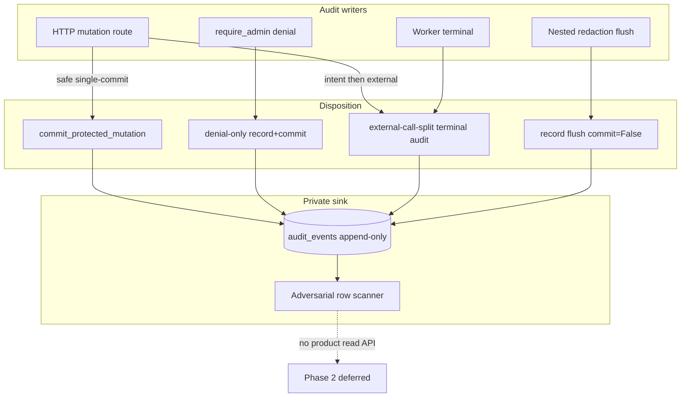

# Transactional Audit Allowlist Denial Privacy - Plan

## Goal Capsule

- **Objective:** Complete master-build-plan slice P8-01 by inventorying every Phase 1 audit writer, migrating safe protected-mutation call sites onto `commit_protected_mutation`, proving contracted authorization-denial audit coverage (`security.admin_route_denied`), and landing adversarial privacy scans over persisted `audit_events` rows — without a product audit-read surface or P8-02/P8-03 log/metric work.
- **Authority:** Root `AGENTS.md`; FR-09 in `docs/prd.md`; C-02 and C-05 in `docs/interaction-behavior-prd.md`; `docs/architecture/security-operations-and-quality.md` Phase 1 operational-safety baseline; `docs/architecture/data-and-lifecycle.md` privacy classes; `docs/database-schema.txt` audit append-only invariants; DRIFT-20 and DRIFT-29 audit/privacy residual in `docs/brownfield-refactor-register.md`; P1-06 residuals in `docs/_scratch/p1-06-audit-inventory.md` and `docs/_scratch/p1-06-audit-evidence.md`; P7-05 residuals keeping DRIFT-29 audit half with P8-01.
- **Execution profile:** Inventory-first brownfield retain/modify of existing `AuditService` / `commit_protected_mutation` call sites, with characterization of exemption classes, focused unit + PostgreSQL 16 barrier proof, and no new public HTTP/DTO/SSE contracts.
- **Readiness checkpoint:** Implementation-ready after 2026-07-27 scoping confirmation: migrate unsafe ad-hoc protected mutations onto the helper; keep privacy scans on audit rows only; expand the denial matrix for contracted authz denials without inventing browse APIs or ownership-404 audit events.
- **Stop conditions:** Stop if the slice requires a Phase 2 audit-read/list/export API or DTO, ownership-404 denial event names that create a disclosure side channel, wrapping external controller/object/LightRAG I/O inside `commit_protected_mutation`, scanning structured logs or metric labels (P8-02/P8-03), inventing a user disable/enable product API solely to exercise orphan events, or expanding closed metadata keys with content-bearing fields absent from the approved allowlist.
- **Tail ownership:** P8-02 owns safe JSON logs, request/trace correlation, and bounded-cardinality metrics; P8-03 owns liveness/readiness plus broader privacy/resilience gate evidence; Phase 2 owns any product audit browser; P12 owns deployed-ingress adversarial review breadth beyond this slice's focused audit-row proofs.

---

## Product Contract

### Summary

P8-01 closes the accountability gap left after P1-06 (append-only schema + helper) and P7 (chat mutations with uneven audit adoption): every protected Phase 1 mutation is either on the transactional audit-write path or explicitly exempted with a named class; contracted admin-route denials remain audited; adversarial tests prove `audit_events` never retain forbidden content. Phase 1 stays write-only for audit history.

Product Contract preservation: Product Contract authored in this bootstrap; no upstream brainstorm file. Scope confirmed 2026-07-27 (migrate call-site gaps; audit-row privacy only; contracted denial matrix without browse APIs).

### Problem Frame

P1-06 proved append-only triggers and `commit_protected_mutation`, then explicitly deferred broad call-site adoption, denial-matrix breadth, and sink privacy scans to P8-01. Conversations and runtime-config adopted the helper; domain/source delete enqueue use it for queue intent; many other writers still use ad-hoc `AuditService.record` + `db.commit()`, optional `audit_context is None` bypasses can skip audit, the only denial event is `security.admin_route_denied`, and no adversarial scanner covers persisted audit rows. Without this slice, FR-09 / DoD “Audit writes” and DRIFT-20 remain incomplete, and DRIFT-29's audit/privacy half stays open after P7-05 closed only the chat-redaction half.

### Requirements

**Allowlist coverage and transactional writes**

- R1. Inventory every closed `AUDIT_EVENT_NAMES` entry and every production `AuditService.record` / `commit_protected_mutation` call site with a disposition: `protected-helper`, `denial-only`, `worker-terminal`, `nested-redaction-flush`, `external-call-split`, `open-txn-object-put`, or `orphan-reserved`.
- R2. Every request-path protected mutation that already pairs product change and audit in one database commit (no mandatory external I/O between mutate and audit) uses `commit_protected_mutation` so both commit or neither does (`FR-09`).
- R3. Documented exemptions remain fail-closed for their durable audit step: denial-only commits, worker terminal audits, nested `chat.turn_redacted` flush inside an outer protected delete fence, external-call-split lifecycles (intent commit → external work → terminal audit), and open-txn object-put paths (flush product+audit → object I/O → single commit) which must not be wrapped in `commit_protected_mutation`.
- R4. HTTP mutation routes that require audit pass a non-null `AuditContext` with request correlation; `audit_context is None` bypasses are limited to documented worker/test/internal callers.
- R5. Orphan closed events (`source.deleted`, `user.disabled`, `user.enabled`) stay in the CHECK allowlist as reserved/test-only with no new Phase 1 product writers invented in this slice.

**Denial events**

- R6. Contracted authorization denials on `/admin/*` via `require_admin` write `security.admin_route_denied` with `outcome=denied`, safe error code, and request correlation, without product mutation (`C-05` recipe). When the denial audit cannot be persisted, access is still denied and the response is contracted `503 audit_unavailable` (never 200, never admin effect, never raw stack). `(session-settled: user-approved — chosen over characterize-only optional harden: locked in review walkthrough 2026-07-27)`
- R7. The denial matrix covers representative admin mutation routes (not only list/read) and role-downgrade mid-session; intentional non-audit paths (ownership/cross-owner identical `404`, unauthenticated `401`, CSRF/Origin ingress `403`, state `409`) are recorded as non-rows with rationale and proven to emit zero `security.admin_route_denied` rows — no new denial event names in this slice. Keep denial-row fields role-safe only (actor, outcome, safe error code, request correlation); do not add resource existence/`target_id` that would turn the private sink into a probe oracle.

**Privacy / adversarial audit tests**

- R8. Adversarial privacy scans assert that persisted `audit_events` fields and `metadata_json` never contain content_sensitive/secret material from FR-09 and `data-and-lifecycle` (prompts, questions, answers, excerpts, assembled context, raw hits, template bodies, credentials, session/composer tokens, paths, runtime URLs, stack traces, provider payloads, titles/filenames). Scanned `metadata_json` keys must be a subset of `ALLOWED_AUDIT_METADATA_KEYS`.
- R9. Only inventory-approved private audit identifiers are allowed in the sink (`actor_user_id` and existing writer `target_id` shapes such as public refs / operation ids already used). Object keys, runtime/controller/provider identifiers, block IDs, and paths remain forbidden even when classified `private_operational` elsewhere. Public projections remain opaque-ref only.
- R10. Phase 1 public audit-read/list/export surfaces remain absent; `test_phase_one_observability_scope.py` stays green.
- R11. Inventory and evidence land under `docs/_scratch/`; DRIFT-20 / DRIFT-29 notes and master-build-plan P8-01 update only after verification.

### Acceptance Examples

- AE1. Inventory lists every closed event and every production writer with a disposition class; no undocumented ad-hoc `record`+`commit` on request-path protected mutations remains.
- AE2. A migrated request-path mutation (e.g. source preparation retry/cancel) commits product change and audit together; injected audit rejection leaves product state unchanged and raises `audit_unavailable` / `AuditError`.
- AE3. Domain or source delete enqueue with N affected turns yields one transaction containing `*.delete_queued` plus N `chat.turn_redacted` flushes; outer audit failure rolls back fence, redaction, nested audits, and queue intent.
- AE4. Member (and downgraded ex-admin) hitting representative `/admin/*` mutation routes receives identical `403` and durable `security.admin_route_denied` rows; no product mutation (`C-05`). When denial audit persistence fails, response is `503 audit_unavailable` with access still denied and no product mutation (KTD8).
- AE5. Ownership probe against another member's conversation returns identical `404` with no denial audit row (documented non-audit path).
- AE6. After credential rotate, conversation rename, source upload, and turn redaction fixtures that plant content sentinels, serialized `audit_events` rows contain none of the planted forbidden substrings/keys.
- AE7. No audit-read route, DTO list method, or Phase 2 observability symbol appears; deferred log/metric sink scans remain explicit P8-02/P8-03 residuals.

### Scope Boundaries

#### In scope

- `docs/_scratch/p8-01-audit-inventory.md` disposition register and post-proof evidence doc.
- Migrate safe single-commit request-path ad-hoc writers onto `commit_protected_mutation`.
- Document exemption classes; harden HTTP `AuditContext` presence expectations.
- Denial matrix tests for contracted `security.admin_route_denied` coverage; intentional non-audit documentation.
- Adversarial privacy tests over `audit_events` only.
- Retain P1-06 append-only / helper regressions; keep observability-scope absence tests green.
- DRIFT-20 / DRIFT-29 audit residual notes and master-build-plan P8-01 status after proof.

#### Deferred for later

- Safe JSON logs, correlation, bounded metrics (P8-02).
- Liveness/readiness and cross-sink privacy/resilience gate (P8-03).
- Product audit browser / export / retention UI (Phase 2 / `docs/future/observability-layer.md`).
- User disable/enable product API wiring for `user.disabled` / `user.enabled`.
- Deployed-ingress adversarial breadth beyond focused audit-row proofs (P12).

#### Deferred to Follow-Up Work

- Mechanical static lint forbidding new bare `AuditService.record(` outside inventory-approved patterns — only if the allowlist matrix test proves brittle without it.
- Metadata key expansions beyond the current closed set — only with an approved contract change.
- Migrating worker terminals onto `commit_protected_mutation` when a shared worker helper pattern emerges; this slice may document them as exemptions first.

#### Outside this product's identity

- Phase 2 observability store, audit browser, log streams, usage analytics, Redis/RQ/Celery, WebSocket migration, multi-tenant Workspace entity, ungrounded domain fallback.

### Key Flows

- F1. Admin protected mutation → transactional product+audit commit (or documented split lifecycle with terminal audit).
- F2. Member hits `/admin/*` → `403` + `security.admin_route_denied`; no product change.
- F3. Delete enqueue → outer protected `*.delete_queued` + nested redaction audit flushes in one txn.
- F4. Forced audit failure → product mutation rolled back; no durable orphan audit/product split.
- F5. Adversarial fixture mutations → audit-row scan reports clean.

### Actors

- A1. Administrator — performs protected Settings/domain/source mutations.
- A2. Member — receives admin-route denials; owns conversations.
- A3. Worker — records terminal delete/index outcomes under documented exemption class.
- A4. Audit fence (`commit_protected_mutation` / append-only `audit_events`) — accountability boundary.
- A5. Release operator — verifies write integrity via tests/ops DB access; no product audit UI.

---

## Planning Contract

### Key Technical Decisions

- KTD1. **Inventory-first dispositions before code moves.** Every closed event and writer gets a retain/migrate/exempt class before edits, mirroring P1-06 / P7-05 scratch registers. Governs R1, R11. `(session-settled: user-approved — chosen over inventory-and-test-only without migrations: confirmed in P8-01 scoping)`
- KTD2. **Migrate only safe single-commit request paths onto `commit_protected_mutation`.** Do not wrap external controller/object/LightRAG calls inside the helper; do not nest a second `commit_protected_mutation` around per-turn redaction inside delete enqueue. Governs R2–R3.
- KTD3. **Exemption classes are first-class outcomes, not leftovers.** Named classes: `denial-only`, `worker-terminal`, `nested-redaction-flush`, `external-call-split`, `open-txn-object-put`, `orphan-reserved`. Do not collapse upload’s flush→put_key→commit pattern into domain’s intent→external→terminal recipe. Each class must state how fail-closed audit still holds. Governs R3, R5.
- KTD4. **Denial matrix uses the existing `security.admin_route_denied` event only.** Expand route coverage and C-05 role-downgrade proof; document intentional non-audit for ownership `404`, `401`, ingress CSRF/Origin, and `409`. Do not invent ownership-denial events or Phase 2 read APIs. Governs R6–R7, R10. `(session-settled: user-approved — chosen over inventing new denial event families: confirmed in P8-01 scoping)`
- KTD8. **`require_admin` denial-audit failure is mandatory fail-closed.** On record/commit failure: deny admin access, return `503 audit_unavailable` via the existing `AuditError` envelope (map commit failures into the same path), no product mutation, no stack leak; prove with a mandatory injected-failure test. Happy path remains `403` + durable denial row. Governs R6. `(session-settled: user-approved — chosen over characterize-only optional harden: locked in review walkthrough 2026-07-27)`
- KTD5. **Privacy scans target persisted `audit_events` only.** Plant content/secret sentinels through representative mutations; assert absence in serialized audit rows. Log/metric/trace sinks stay P8-02/P8-03. Private operational IDs in the audit sink are allowed. Governs R8–R9. `(session-settled: user-approved — chosen over folding log/metric sink scans into P8-01: confirmed in P8-01 scoping)`
- KTD6. **Keep orphan event names in the schema allowlist.** Document as reserved/test-only; retain P1-06 synthetic `user.disabled` helper proof; do not ship user admin mutation APIs in this slice. Governs R5.
- KTD7. **HTTP routes must not silently skip audit.** Inventory asserts production mutation routes supply `AuditContext`; optional None remains only for documented non-HTTP callers.

### Assumptions

- Existing closed event vocabulary and metadata key allowlist are sufficient for P8-01 without a schema expansion.
- Domain create/start/stop and index cancel remain `external-call-split` by architecture; terminal audits may stay ad-hoc or use the helper only on the final DB commit that already pairs state+audit.
- C-02 concurrency semantics are unchanged; this slice proves audit atomicity/denial coverage, not a new admin/member read race protocol.

### High-Level Technical Design

Disposition classes decide migration vs exemption; the scanner reads only the private table.

### System-Wide Impact

- **Services touched:** sources, domains, indexing, chat redaction, conversations (already compliant), runtime-config (already compliant), `require_admin` denial path. Workers remain exemption-class writers, not a second audit protocol.
- **Failure propagation:** `AuditError` / `503 audit_unavailable` must roll back the protected product change. For denial-only path, audit persistence failure must not leave a durable product mutation (there is none) and must not leak stack traces; prefer fail-closed `403`/`503` without inventing a browseable denial log.
- **Privacy boundary:** adversarial scans cover the private `audit_events` table only. Public DTOs/SSE already have separate sentinel tests; log/metric sinks stay P8-02/P8-03 so this slice cannot “pass privacy” by scanning the wrong sink.
- **Contract surface:** no OpenAPI, DTO, or SSE changes. Ownership `404` non-disclosure stays intact — denial audits must not become a probe oracle.
- **Downstream:** P8-02 may assume call-site allowlist + audit-row privacy are closed; do not leave silent `audit_context is None` holes on HTTP mutation routes.

### Risks and Dependencies

| Risk | Mitigation |
| --- | --- |
| Blind helper wrap strands remote object/runtime state | Inventory tags `external-call-split`; migrate only post-external terminal DB pairs or leave exempt |
| Nested redaction + outer helper double-commit | Keep `_redact_turns(..., commit=False)` flush-only; prove single-txn rollback |
| Over-flagging private UUIDs as leaks | Scanner rules follow privacy classes; audit sink may hold `private_operational` targets |
| Claiming full DRIFT-29 / cross-sink privacy | Evidence residuals explicitly leave logs/metrics/P12; close DRIFT-20 write/privacy-audit half carefully |
| Optional `audit_context` silently skips audit | Matrix test fails if HTTP mutation paths omit context |
| Denial audit write fails before `403` | U3 mandatory harden: map record/commit failure to `503 audit_unavailable`, always deny, no product mutation, no stack leak; mandatory injected-failure test (KTD8) |

**Depends on:** P1-06 helper/triggers; P7 conversation/delete-fence audit patterns (DONE).
**Blocks:** P8-02 / P8-03 operational-safety continuation that assumes audit-write coverage is closed.

### Open Questions

- None blocking. Deferred: whether a future mechanical lint should forbid new bare `record(` call sites outside the inventory allowlist (follow-up only if matrix tests prove insufficient).

---

## Implementation Units

### U1. Audit writer inventory and disposition register

**Goal:** Produce the authoritative P8-01 inventory that maps every closed event and production writer to a disposition class before code moves.

**Requirements:** R1, R3, R5, R7, R11

**Dependencies:** None

**Files:**
- Create: `docs/_scratch/p8-01-audit-inventory.md`
- Modify (read-only evidence refs): `app/context_engine/services/audit.py`, `app/context_engine/models.py`, `app/context_engine/api/dependencies.py`, `app/context_engine/services/sources.py`, `app/context_engine/services/domains.py`, `app/context_engine/services/indexing.py`, `app/context_engine/services/chat_turns.py`, `app/context_engine/services/conversations.py`, `app/context_engine/services/runtime_config.py`
- Test expectation: none — documentation gate; behavioral tests begin in U2–U4

**Approach:** Mirror P1-06 / P7-05 scratch structure: scope, disposition table (surface → evidence → retain/migrate/exempt → proof), retained invariants, gaps this task will close, evidence design. Explicit columns for exemption class and HTTP vs worker. List intentional non-audit denial paths. Pin orphan events as `orphan-reserved`.

**Execution note:** Inventory-first; do not migrate call sites in this unit.

**Patterns to follow:** `docs/_scratch/p1-06-audit-inventory.md`, `docs/_scratch/p7-05-delete-redaction-inventory.md`

**Test scenarios:**
- Test expectation: none -- inventory/documentation unit; completeness checked in U4 evidence gate against the disposition table.

**Verification:** Inventory names every `AUDIT_EVENT_NAMES` entry and every production `record` / `commit_protected_mutation` site with a disposition; out-of-scope P8-02/P8-03 and Phase 2 read are explicit.

---

### U2. Migrate safe request-path writers onto the helper

**Goal:** Move inventory-tagged migrate sites onto `commit_protected_mutation` and leave documented exemptions untouched.

**Requirements:** R2, R3, R4 — KTD2, KTD3, KTD7

**Dependencies:** U1

**Files:**
- Modify: `app/context_engine/services/sources.py` (default migrate: prep retry/cancel; default exempt: upload as `open-txn-object-put`, SourceDeleteWorker terminals as `worker-terminal`)
- Modify: `app/context_engine/services/domains.py` (default exempt: `_fail_operation` and DomainDeleteWorker terminals as lifecycle/worker classes; migrate only if U1 proves a safe single-commit pair with no external I/O)
- Modify: `app/context_engine/services/indexing.py` (default migrate: terminal index retry/cancel DB pairs that already pair state+audit with no remote call inside that txn; keep pre-remote intermediate cancel commit and remote deletes outside the helper)
- Modify: `app/context_engine/services/chat_turns.py` only if inventory finds a standalone redaction commit that should use the helper; nested delete-fence path stays flush-only
- Create or modify: `app/tests/test_audit_call_site_matrix.py` (or extend `app/tests/test_audit_service.py`)
- Modify as needed: focused service tests that assert audit rows for migrated paths

**Approach:** For each U1-tagged migrate site, replace ad-hoc `record`+`commit` with `commit_protected_mutation` preserving event name, actor, target, outcome, and metadata. Where the current path maps `IntegrityError` on commit to a contracted conflict (e.g. prep retry → `409 operation_conflict`), keep that mapping around the helper call (same pattern as delete enqueue). Preserve nested redaction flush inside delete enqueue. Do not pull object `put_key`, runtime controller, or LightRAG remote calls into the helper transaction. Default posture when U1 is ambiguous: prefer a named exemption over a blind wrap. Assert HTTP mutation entrypoints pass `AuditContext`.

**Execution note:** Prefer a failing matrix/characterization test for one migrate site before editing that site.

**Patterns to follow:** `app/context_engine/services/conversations.py`, `app/context_engine/services/runtime_config.py` `_commit_runtime_mutation`, source/domain `enqueue_delete_*` helper usage

**Test scenarios:**
1. Happy path: migrated prep retry/cancel (or inventory-chosen peer) persists product state and matching audit row in one commit.
2. Error path: monkeypatched/`audit_write_failure` rejection rolls back product state; no durable audit row; surfaces `AuditError` / `503 audit_unavailable` at the HTTP boundary where applicable.
3. Edge: nested delete enqueue still emits outer `*.delete_queued` plus N `chat.turn_redacted` without nested helper commits.
4. Integration: matrix test fails if a production module on the migrate list still performs bare `record` followed by `commit` outside exemptions.
5. Edge: documented exemption sites remain callable and still write their terminal/denial audit (characterization, not forced rewrite).

**Verification:** Inventory migrate rows are code-complete; exemption rows unchanged in behavior; focused unit tests for migrated paths pass.

---

### U3. Denial matrix coverage and intentional non-audit documentation

**Goal:** Prove contracted authz denial audits across representative admin routes and C-05 role downgrade; freeze intentional non-audit paths in the inventory.

**Requirements:** R6, R7, R10 — KTD4

**Dependencies:** U1

**Files:**
- Modify: `app/tests/test_postgres_foundation.py` and/or create `app/tests/test_audit_denial_matrix.py`
- Modify: `docs/_scratch/p8-01-audit-inventory.md` (non-audit path section)
- Modify: `app/context_engine/api/dependencies.py` (`require_admin`: retain happy-path `403` + denial audit; harden record/commit failure to fail-closed `503 audit_unavailable` per KTD8)
- Keep green: `app/tests/test_phase_one_observability_scope.py`

**Approach:** Parameterize member (and downgraded admin) requests against representative `/admin/*` mutation routes already gated by `require_admin`. Assert identical `403`, durable `security.admin_route_denied`, `outcome=denied`, safe error code, request_id present, and no product row change. Harden denial-audit persistence failure to always deny with contracted `503 audit_unavailable` (map commit failures into `AuditError` / existing handler; never leak stacks). Document AE5-style ownership `404` as intentional non-audit. Do not add new event names or read APIs.

**Execution note:** Extend P1-03 PostgreSQL denial proof rather than inventing a parallel denial stack.

**Patterns to follow:** `app/tests/test_postgres_foundation.py` role-recheck denial audit; `require_admin` in `app/context_engine/api/dependencies.py`

**Test scenarios:**
1. Happy/denial path: member POST/PATCH/DELETE on a representative admin mutation route → `403` + one new `security.admin_route_denied` row; target product unchanged.
2. Covers AE4 / C-05: administrator role revoked mid-session → next admin mutation denied and audited; already-committed prior work remains.
3. Edge: GET `/admin/users` (or equivalent list) still audits denial — regression from P1-03.
4. Covers AE5: cross-owner conversation access → `404 conversation_not_found` (or contracted identical shape) with zero new denial audit rows; denial rows that do exist for admin-route cases carry no resource-existence `target_id`.
5. Edge: unauthenticated `401`, CSRF/Origin ingress `403`, and state `409` paths produce zero `security.admin_route_denied` rows.
6. Error path (KTD8): inject denial-audit record or commit failure on a member `/admin/*` hit → `503 audit_unavailable` safe envelope, no admin effect, no durable denial row (or rolled back), no stack in body.

**Verification:** Denial matrix rows in inventory are proven; non-audit paths documented; observability absence test still passes.

---

### U4. Adversarial audit-row privacy scans and closure evidence

**Goal:** Prove audit sinks stay free of forbidden content; record evidence; update DRIFT and master-build-plan only after green proofs.

**Requirements:** R8, R9, R10, R11 — KTD5

**Dependencies:** U1, U2, U3

**Files:**
- Create: `app/tests/test_audit_privacy_scan.py` (name may vary; keep under `app/tests/`)
- Create: `docs/_scratch/p8-01-audit-evidence.md`
- Modify: `docs/brownfield-refactor-register.md` (DRIFT-20; DRIFT-29 audit/privacy residual note — do not overclaim full M-11)
- Modify: `docs/master-build-plan.md` (P8-01 status + short closure evidence)
- Retain regressions: `app/tests/test_postgres_audit.py`, `app/tests/test_audit_service.py`, `app/tests/test_phase_one_observability_scope.py`

**Approach:** Drive fixtures that would tempt leakage (credential rotate with planted plaintext sentinel in inputs, conversation rename with title sentinel, source upload with filename/content sentinels, redaction of a turn that previously held answer/excerpt sentinels). Serialize resulting `audit_events` rows (all columns + parsed metadata); assert `metadata_json` keys ⊆ `ALLOWED_AUDIT_METADATA_KEYS`; assert FR-09 / `data-and-lifecycle` forbidden classes absent via sentinel substrings. Allow only inventory-approved `actor_user_id` / `target_id` shapes — forbid object keys, runtime URLs, provider identifiers, block IDs, and paths. PostgreSQL barrier for nested delete enqueue rollback remains if not already covered in U2. Write evidence with commands, counts, and residuals (P8-02/P8-03, Phase 2 read, orphan reserved, P12 ingress).

**Execution note:** Privacy tests are adversarial and deterministic — plant sentinels, do not depend on live providers.

**Patterns to follow:** `app/tests/test_chat_orchestration.py` privacy sentinels; `dump_prepared_source_for_privacy_scan` pattern; P1-06 / P7-05 evidence doc shape

**Test scenarios:**
1. Covers AE6. Credential rotate fixture: plaintext credential sentinel absent from all new audit rows/metadata.
2. Covers AE6. Conversation rename with title sentinel: title absent from audit metadata and target fields beyond public_ref rules already used by conversations.
3. Covers AE6. Source upload / prep path: filename/body sentinels absent from audit metadata.
4. Covers AE6. Turn redaction after answer/excerpt sentinels existed: post-redaction audit rows for `chat.turn_redacted` / delete_queued contain no excerpt/answer/prompt text.
5. Covers AE3 (if not in U2). PostgreSQL: forced failure of outer delete_queued audit rolls back nested redaction audits and fence.
6. Covers AE7. Observability scope: no audit list/read API; deferred events remain disjoint from Phase 1 allowlist.
7. Integration: focused pytest suite for U2–U4 + P1-06 regressions passes on disposable PostgreSQL 16 where required.

**Verification:** Evidence doc records commands and residuals; DRIFT-20 write/privacy-audit half advanced honestly; P8-01 marked DONE only after green verification; P8-02/P8-03 residuals explicit.

---

## Verification Contract

- Inventory gate: `docs/_scratch/p8-01-audit-inventory.md` complete before claiming migrate/exempt done.
- Focused unit/matrix/privacy tests under `app/tests/` for call-site matrix, denial matrix, and audit-row privacy.
- Disposable PostgreSQL 16 proofs for append-only regressions, migrated mutation rollback, nested delete-fence audit atomicity, and denial audits (reuse `CONTEXT_ENGINE_ALLOW_DISPOSABLE_DATABASE_TESTS=1` harness pattern from P1-06).
- Keep green: `app/tests/test_phase_one_observability_scope.py`, `app/tests/test_postgres_audit.py`, `app/tests/test_audit_service.py`.
- No OpenAPI/generated client changes expected; if a change appears, stop — public contract drift is out of scope.
- Evidence: `docs/_scratch/p8-01-audit-evidence.md` with commands, counts, residuals.
- Tracker: `docs/master-build-plan.md` P8-01 + `docs/brownfield-refactor-register.md` DRIFT-20 / DRIFT-29 notes.

## Definition of Done

- [ ] U1 inventory dispositions complete for every closed event and production writer.
- [ ] U2 migrate sites use `commit_protected_mutation`; exemptions documented and characterized.
- [ ] U3 denial matrix proves contracted `security.admin_route_denied` coverage; intentional non-audit paths recorded.
- [ ] U4 adversarial audit-row privacy scans pass; P1-06 / observability-absence regressions pass.
- [ ] No Phase 2 audit-read surface introduced.
- [ ] Evidence + DRIFT + master-build-plan updated without overclaiming P8-02/P8-03 or full M-11.
- [ ] Applicable DoD capability row “Audit writes” satisfied for allowlists, protected-mutation rollback, denial coverage, and audit privacy scan.

---

## Appendix

### Sources and research

- Master task: `docs/master-build-plan.md` P8-01
- Foundation: `docs/_scratch/p1-06-audit-inventory.md`, `docs/_scratch/p1-06-audit-evidence.md`
- Residuals: P7-05 evidence keeping DRIFT-29 audit half with P8; DRIFT-20 in `docs/brownfield-refactor-register.md`
- Implementation: `app/context_engine/services/audit.py`, call sites in sources/domains/indexing/chat_turns/conversations/runtime_config/`dependencies.py`
- Tests: `app/tests/test_audit_service.py`, `app/tests/test_postgres_audit.py`, `app/tests/test_postgres_foundation.py`, `app/tests/test_phase_one_observability_scope.py`
- External research: skipped — local P1-06/P7 patterns and closed vocabulary are sufficient
- `docs/solutions/`: absent; residuals distilled from scratch evidence instead
