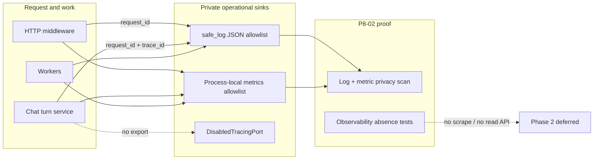

# Safe JSON Logs Correlation Bounded Metrics - Plan

## Goal Capsule

- **Objective:** Complete master-build-plan slice P8-02 by inventorying allowlisted JSON log emission, retaining server-owned HTTP `request_id` correlation, closing chat terminal `request_id`+`trace_id` co-logging gaps, adding process-local bounded-cardinality service metrics, and proving adversarial privacy on log and metric sinks — without a scrape endpoint, observability read API/UI, or P8-03 health/cross-sink work.
- **Authority:** Root `AGENTS.md`; FR-09 and Operability NFR in `docs/prd.md`; `docs/architecture/security-operations-and-quality.md` Phase 1 operational-safety baseline; `docs/architecture/data-and-lifecycle.md` privacy classes and `operational telemetry` port; `docs/architecture/deployment-topology.md` minimum service-metric labels; DRIFT-20 / DRIFT-29 log/metric residuals in `docs/brownfield-refactor-register.md`; P1-04 and P8-01 residuals in `docs/_scratch/p1-04-*` and `docs/_scratch/p8-01-*`; `docs/quality/definition-of-done.md` reliability/operational-safety gates.
- **Execution profile:** Inventory-first brownfield retain/extend of `safe_log` / `JsonLogFormatter`, sibling process-local metrics helper mirroring audit/trace allowlist posture, focused unit + sink privacy proofs, no new public HTTP/DTO/SSE contracts.
- **Readiness checkpoint:** Implementation-ready after 2026-07-27 scoping confirmation: log/metric privacy proofs in this slice; process-local metrics only; extend existing safe-log family (sibling metrics helper), not a telemetry redesign.
- **Stop conditions:** Stop if the slice requires a Prometheus/OpenTelemetry scrape or product metrics/log read API, Phase 2 Logs/Usage/Server/audit-browser surface, health/readiness expansion (P8-03), enabling a real external tracer exporter, stuffing high-cardinality identity IDs into metric labels, or inventing public DTOs for operational telemetry.
- **Tail ownership:** P8-03 owns liveness/readiness plus cross-sink privacy/resilience gate evidence; Phase 2 owns any product observability browser; P12 owns deployed-ingress adversarial breadth beyond this slice's focused log/metric proofs.

---

## Product Contract

### Summary

P8-02 closes the write-side operational telemetry gap left after P0-03/P1-04 (request IDs + allowlisted JSON logs) and P8-01 (audit-row privacy): every structured log stays on the closed field allowlist; HTTP retains server-owned `request_id` correlation; newly executed chat turns join via private `trace_id` plus `request_id` on critical safe logs; process-local service metrics expose only bounded labels; adversarial tests prove log and metric sinks never retain forbidden content. Phase 1 stays free of observability product surfaces.

Product Contract preservation: Product Contract authored in this bootstrap; no upstream brainstorm file. Scope confirmed 2026-07-27 (log/metric privacy in-slice; process-local metrics; extend safe-log family).

### Problem Frame

P1-04 proved `safe_log` drops forbidden kwargs and collapses unclassified records to a bounded `event=unclassified`, then deferred broad sink privacy and metrics to P8. P8-01 closed audit-write allowlists and `audit_events` privacy, explicitly leaving log/metric sinks to P8-02/P8-03. Today metrics are entirely absent; `TracingPort` is a disabled no-op; chat terminal logs omit `request_id` while claim/replay include it; no adversarial scanner covers formatted JSON logs or metric label dumps. Without this slice, FR-09 / DoD “Logs are structured/allowlisted; metrics have bounded labels; request/operation/turn correlation works without content” and DRIFT-20/29 log/metric halves remain incomplete.

### Requirements

**Allowlisted JSON logs**

- R1. Inventory every production `safe_log` event and field usage with disposition `retain`, `correlate-fix`, or `emit-metric-peer`, plus explicit out-of-scope (CLI `print`, dead `getLogger` leftovers, Phase 2 surfaces).
- R2. Structured logs continue to emit only `SAFE_LOG_FIELDS` (plus formatter structural `timestamp`/`level`/`logger`); unknown kwargs remain dropped; unclassified raw logger messages never become `event` or free-text payload (`FR-09`, P1-04 invariant).
- R3. JSON logging remains configured at API and worker entry points; no second log pipeline or library redesign.

**Request / trace correlation**

- R4. Every HTTP response continues to carry server-owned `X-Request-ID`; caller-supplied request IDs are ignored (P0-03 invariant retained).
- R5. Newly executed chat turns retain private `trace_id`; critical chat log events used for ops join (`chat.turn_claimed`, `chat.turn_replayed`, `chat.turn_persisted`, `chat.turn_failed`) include both `request_id` and `trace_id` when available.
- R6. Phase 1 correlation is allowlisted logs plus persisted IDs; `DisabledTracingPort` stays disabled — no external tracer exporter in this slice.

**Bounded-cardinality service metrics**

- R7. Introduce a process-local metrics helper with a closed metric-name set and a closed label-key set limited to bounded dimensions: `http_method` (or method), route template, operation type, outcome, actor kind, chat route kind (closed enum), and safe error code / status class (`deployment-topology.md`). Label **values** must also stay bounded (route templates only — never concrete path IDs; closed enums for outcomes/codes).
- R8. Identity-bearing `private_operational` values (`domain_id`, `source_id`, `conversation_turn_id`, user ids, `request_id`, `trace_id`) may remain in the log allowlist where already approved but must never appear as metric labels (`data-and-lifecycle.md`).
- R9. Metric emission is best-effort: failures must not break product mutations (mirror `SafeTracingWrapper` posture).
- R10. No scrape endpoint, metrics HTTP route, OpenAPI DTO, or browser surface for metrics.

**Privacy / absence**

- R11. Adversarial privacy scans assert that captured formatted JSON logs and metric name/label dumps never contain content_sensitive/secret material from FR-09 and `data-and-lifecycle` (prompts, questions, answers, excerpts, assembled context, raw hits, template bodies, credentials, session/composer tokens, paths, runtime URLs, stack traces, provider payloads, titles/filenames).
- R12. Scanned log keys ⊆ `SAFE_LOG_FIELDS` ∪ structural formatter keys; scanned metric labels ⊆ the closed metric-label allowlist.
- R13. `test_phase_one_observability_scope.py` (and related absence checks) stay green; no Phase 2 observability read symbols or scrape routes appear.
- R14. Inventory and evidence land under `docs/_scratch/`; DRIFT-20 / DRIFT-29 log/metric notes and master-build-plan P8-02 update only after verification.

### Acceptance Examples

- AE1. Inventory lists every production `safe_log` site with disposition; metric name/label catalog is frozen before emitters land.
- AE2. HTTP request with planted body/credential/title sentinels yields `http_request` JSON containing `request_id` matching `X-Request-ID` and no planted forbidden substrings.
- AE3. Chat turn claim → persist/fail path: logs join on the same `trace_id` and include `request_id` on claim and terminal events.
- AE4. Process-local metrics increment for HTTP and at least one chat terminal and one worker outcome; snapshot shows only allowlisted names/labels; identity IDs absent from labels.
- AE5. Injected metrics helper failure leaves a protected mutation or HTTP response path successful (best-effort).
- AE6. After representative mutations that plant content sentinels, serialized log sink + metric dump contain none of the planted forbidden substrings/keys.
- AE7. No `/metrics` (or equivalent) route, no log/audit browser, no Phase 2 observability symbol; P8-03 health/cross-sink residuals remain explicit.

### Scope Boundaries

#### In scope

- `docs/_scratch/p8-02-telemetry-inventory.md` and post-proof evidence doc.
- Retain/extend `structured_logging.py`; close chat terminal `request_id` correlation gaps; optional closed `safe_error_code` on HTTP success-path failures when already available without logging bodies.
- New process-local metrics helper + minimum emitters (HTTP, chat terminal, representative worker claim/fail).
- Adversarial privacy tests over log JSON and metric dumps only.
- Retain P1-04 structured-logging and observability-scope absence regressions.
- DRIFT-20 / DRIFT-29 log/metric residual notes and master-build-plan P8-02 status after proof.

#### Deferred for later

- Liveness/readiness re-proof and cross-sink privacy/resilience gate (P8-03).
- Product Logs / Usage / Server / audit-browser / live streams / exports (Phase 2 / `docs/future/observability-layer.md`).
- Enabling a real external tracing exporter or OTel pipeline.
- Deployed-ingress adversarial breadth beyond focused log/metric proofs (P12).
- Shared process-wide metric aggregation across API + worker processes (each process keeps its own registry).

#### Deferred to Follow-Up Work

- Expanding `SAFE_LOG_FIELDS` beyond the closed set — only with an approved contract change.
- Mechanical lint forbidding raw `logger.*` outside `safe_log` — only if sink tests prove brittle without it.
- Enriching every worker log with both `request_id` and `index_request_id` when not required for the minimum correlation set.

#### Outside this product's identity

- Phase 2 observability store, Redis/RQ/Celery, WebSocket migration, multi-tenant Workspace entity, ungrounded domain fallback, browser-selectable telemetry backends.

### Key Flows

- F1. HTTP request → middleware assigns `request_id` → JSON `http_request` log + process-local HTTP metric → response header `X-Request-ID`.
- F2. Chat turn claim/replay/persist/fail → private `trace_id` + `request_id` on critical safe logs; metrics for terminal outcome only with bounded labels.
- F3. Worker claim/fail → allowlisted safe log + bounded operation metric; no paths/payloads.
- F4. Telemetry failure → product path still succeeds; optional safe outage log.
- F5. Adversarial fixture mutations → log + metric sink scan reports clean.

### Actors

- A1. Release / ops engineer — reads process JSON logs; metrics are in-process test/assert surfaces only — no product observability UI.
- A2. Member / administrator — generate traffic that must not leak into sinks.
- A3. Worker process — emits allowlisted operational logs/metrics for leased work.
- A4. Privacy adversary (test) — plants sentinels and inspects sinks.
- A5. Operational telemetry port — best-effort allowlisted emission boundary.

---

## Planning Contract

### Key Technical Decisions

- KTD1. **Inventory-first before emitters.** Freeze the `safe_log` event register and the closed metric name/label catalog in scratch inventory before wiring new increments or correlation edits. Governs R1, R7, R14.
- KTD2. **Sibling process-local metrics helper, not a log-line redesign.** Keep extending the allowlist + best-effort + no-product-API pattern; add `app/context_engine/services/metrics.py` (name may vary) beside `structured_logging.py`. Do not encode counters as free-form JSON log fields. Governs R3, R7–R10. `(session-settled: user-approved — chosen over telemetry redesign or stuffing metrics into safe_log lines: confirmed in P8-02 scoping)`
- KTD3. **Dual allowlists with stricter metric labels.** Logs retain approved `private_operational` correlation IDs; metric labels are a strict bounded subset (`http_method`, route template, operation type, outcome, actor kind, chat route kind, safe error code / status class) that rejects identity-bearing **keys** and identity-bearing **values** stuffed into allowlisted keys. Governs R2, R7–R8. `(session-settled: user-approved — chosen over identical allowlists for logs and metrics: implied by confirmed process-local metrics + privacy posture)`
- KTD4. **Correlation via logs/DB; keep TracingPort disabled.** Prove HTTP `request_id` header/log alignment (R4); prove chat claim/replay/persist/fail joinability with `request_id` + `trace_id` on those safe logs (R5); do not enable an external tracer. Governs R4–R6.
- KTD5. **Privacy scans target log JSON and metric dumps only.** Mirror P8-01's planted-sentinel pattern; leave audit-row re-scans and cross-sink/health to already-closed P8-01 / deferred P8-03. Governs R11–R13. `(session-settled: user-approved — chosen over deferring all sink privacy to P8-03: confirmed in P8-02 scoping)`
- KTD6. **No scrape / no product read surface.** Metrics are assertable only via in-process registry snapshot/reset helpers for tests. Do not add HTTP scrape aliases, OpenMetrics routes, or non-test export helpers. Governs R10, R13. `(session-settled: user-approved — chosen over private scrape-style endpoint: confirmed in P8-02 scoping)`
- KTD7. **Best-effort emission.** Wrap metric increments so exceptions never fail HTTP/worker product paths; optional `metrics.outage` safe_log with closed `safe_error_code` only. Governs R9.
- KTD8. **Minimum metric series for acceptance.** Emit at least: HTTP request counter/timer labels (method, route template, outcome, optional status class / safe error code); chat turn terminal (route kind/outcome/safe error code); one worker operation claim/fail (operation type, outcome, safe error code). Histograms optional if cardinality stays closed. Governs R7, AE4.

### Assumptions

- Existing `SAFE_LOG_FIELDS` is sufficient without expansion for P8-02; correlation fixes reuse already-allowlisted keys.
- API and worker each own a process-local registry; tests reset the registry in the process under test.
- P1-04 health/readiness remains untouched; P8-03 re-proves health in the broader gate.
- P8-01 audit-row privacy stays green and is not reopened.

### High-Level Technical Design

Logs may carry approved private correlation IDs; metrics never label by identity-bearing IDs. TracingPort stays disabled.

### System-Wide Impact

- **Services touched:** `structured_logging`, new metrics helper, `app.py` middleware, `chat_turns` terminal logs, representative worker claim/fail sites (`sources` / `indexing` / `domains` / `worker.py` as inventory directs).
- **Failure propagation:** metrics/log helper failures must not change HTTP status or worker lease outcomes; product mutations remain authoritative.
- **Privacy boundary:** adversarial scans cover formatted JSON logs and metric dumps only. Audit rows stay P8-01; cross-sink + health stay P8-03.
- **Contract surface:** no OpenAPI, DTO, or SSE changes. Public responses continue to expose only `X-Request-ID` for correlation — never private `trace_id`.
- **Downstream:** P8-03 may assume log/metric emission + sink privacy are closed; do not leave scrape routes or identity-bearing metric labels as residuals inside P8-02.

### Risks and Dependencies

| Risk | Mitigation |
| --- | --- |
| Identity IDs copied into metric labels | Dual allowlist + unit rejection tests for `domain_id`/`source_id`/turn/user/`request_id`/`trace_id` labels |
| Weak log capture (`getMessage()` only) | Privacy tests must capture `JsonLogFormatter` output (mirror `test_structured_logging.py`) |
| Overclaiming DRIFT-20/29 / cross-sink | Evidence residuals explicitly leave health + cross-sink to P8-03 |
| Enabling TracingPort “for completeness” | KTD4 stop condition; keep disabled |
| Best-effort wrapper hides metric bugs | Unit tests still assert increments on happy path; failure injection is a separate case |
| API vs worker registry confusion | Document process-local semantics; reset helpers per process in tests |

**Depends on:** P8-01 DONE (audit allowlist/denial/audit-row privacy); P0-03/P1-04 request-ID + `safe_log` baseline.
**Blocks:** P8-03 operational-safety gate that assumes log/metric emission and sink privacy are closed.

### Open Questions

- None blocking for plan readiness. **U1 owns (implementation-time):** choose chat terminal `request_id` plumbing — (a) persist private HTTP `request_id` on the turn at claim (schema/model/migration + worker reconstruct), or (b) narrow AE3/R5 so terminals join via `trace_id` when `request_id` is absent. Document the choice in the inventory before U3 edits.
- Deferred follow-up: whether a future mechanical lint should forbid raw `logger.*` outside `safe_log` (only if sink tests prove insufficient).

---

## Implementation Units

### U1. Telemetry inventory and dual-allowlist freeze

**Goal:** Produce the authoritative P8-02 inventory of `safe_log` events, correlation gaps, and the closed metric name/label catalog before code moves.

**Requirements:** R1, R7, R8, R14 — KTD1, KTD3

**Dependencies:** None

**Files:**
- Create: `docs/_scratch/p8-02-telemetry-inventory.md`
- Modify (read-only evidence refs): `app/context_engine/services/structured_logging.py`, `app/context_engine/services/tracing.py`, `app/context_engine/app.py`, `app/context_engine/worker.py`, `app/context_engine/services/chat_turns.py`, `app/context_engine/services/sources.py`, `app/context_engine/services/indexing.py`, `app/context_engine/services/domains.py`
- Test expectation: none — documentation gate; behavioral tests begin in U2–U4

**Approach:** Mirror P8-01 / P1-04 scratch structure: scope, disposition table (surface → evidence → retain/correlate-fix/emit-metric-peer → proof), retained invariants, metric name/label catalog, gaps this task will close, evidence design. Explicitly list OF-2 correlation holes (`chat.turn_persisted` / `chat.turn_failed` missing `request_id`). Freeze metric labels to bounded ops dimensions from `deployment-topology.md`. Mark health/cross-sink and Phase 2 read as out of scope.

**Execution note:** Inventory-first; do not add emitters in this unit.

**Patterns to follow:** `docs/_scratch/p8-01-audit-inventory.md`, `docs/_scratch/p1-04-health-readiness-inventory.md`

**Test scenarios:**
- Test expectation: none -- inventory/documentation unit; completeness checked in U4 evidence gate against the disposition table.

**Verification:** Inventory names every production `safe_log` site with disposition; metric catalog frozen; out-of-scope P8-03 and Phase 2 read are explicit.

---

### U2. Process-local metrics helper with closed labels

**Goal:** Land the sibling metrics helper with closed names/labels, best-effort wrapper, and in-process snapshot/reset for tests.

**Requirements:** R7, R8, R9, R10 — KTD2, KTD3, KTD6, KTD7

**Dependencies:** U1

**Files:**
- Create: `app/context_engine/services/metrics.py` (name may vary; keep under `services/`)
- Create: `app/tests/test_service_metrics.py`
- Keep green: `app/tests/test_phase_one_observability_scope.py`

**Approach:** Implement a process-local registry (counters and optional timers) that accepts only inventory-frozen metric names and label keys. Reject or drop identity-bearing labels even if they are legal log fields. Provide `snapshot()` / `reset()` for tests. Wrap emission so exceptions never propagate to callers (best-effort). Do not register HTTP routes. Do not depend on Prometheus/OTel libraries unless inventory proves an already-approved in-repo dependency — default is stdlib/simple in-process structures.

**Execution note:** Start with failing unit tests for allowlist rejection and snapshot increments before implementing the helper.

**Patterns to follow:** `app/context_engine/services/structured_logging.py` allowlist drop; `app/context_engine/services/tracing.py` `SafeTracingWrapper`; `app/context_engine/services/audit.py` closed metadata keys

**Test scenarios:**
1. Happy path: increment an allowlisted metric with bounded labels; snapshot shows the expected count.
2. Edge: unknown metric name or unknown label key is rejected/dropped; snapshot unchanged for that illegal emit.
3. Edge: identity-bearing label **keys** (`domain_id`, `source_id`, `conversation_turn_id`, `request_id`, `trace_id`, user id) never appear in snapshot label sets.
4. Edge: identity-bearing **values** stuffed into allowlisted keys (concrete path IDs, opaque refs, UUIDs in `route`/outcome fields) are rejected/dropped; HTTP emitters must use route templates.
5. Error path: forced failure inside emit path does not raise to the caller (best-effort); any `metrics.outage` log omits exception sentinel/Traceback.
6. Integration: no metrics/scrape route aliases appear in registered FastAPI routes / observability-scope absence remains green.

**Verification:** Helper exists with closed catalog; unit tests prove cardinality/privacy of labels; no scrape surface.

---

### U3. Correlation fixes and minimum emitters

**Goal:** Close request/trace co-logging gaps on critical chat terminals and wire minimum HTTP/chat/worker metric emissions beside existing safe logs.

**Requirements:** R4, R5, R6, R7, KTD4, KTD8

**Dependencies:** U1, U2

**Files:**
- Modify: `app/context_engine/services/chat_turns.py` (add `request_id` to `chat.turn_persisted` / `chat.turn_failed`; keep `trace_id`)
- Modify: `app/context_engine/app.py` (increment HTTP metric beside `http_request` safe_log; optionally attach closed `safe_error_code` when already available on the response path without reading bodies)
- Modify: representative worker sites from inventory (`app/context_engine/services/sources.py`, `indexing.py`, `domains.py`, and/or `worker.py`) for one claim/fail metric peer each as catalogued
- Modify: `app/tests/test_structured_logging.py` and/or create focused correlation/emitter tests under `app/tests/`
- Keep `DisabledTracingPort` behavior unchanged in `app/context_engine/services/tracing.py`

**Approach:** For each U1 `correlate-fix` row, add missing allowlisted correlation fields only. Terminal `chat.turn_persisted` / `chat.turn_failed` currently run in `_complete_turn` / `_fail_turn` without a `request_id` parameter, and `ConversationTurn` persists `client_request_id`/`trace_id` only — so a call-site-only kwarg edit is insufficient for the worker path. U1 must choose and U3 must implement one concrete plumbing option: (a) persist private HTTP `request_id` on the turn at claim (schema/model/migration + reconstruct into worker `TurnStartResult`) and thread into `_complete_turn`/`_fail_turn`, or (b) narrow AE3/R5 so terminals join claim↔persist via `trace_id` when `request_id` is absent, and only require `request_id` on in-process paths that still hold it. For each `emit-metric-peer` row, increment the matching closed metric with bounded labels derived from already-safe dimensions (route **template** from FastAPI path template — never concrete `request.url.path`, operation type, outcome, safe error code). Do not enable TracingPort. Do not log query strings, bodies, filenames, or titles.

**Execution note:** Prefer a failing correlation test for chat terminal logs (including the worker finalize path) before editing `chat_turns.py`.

**Patterns to follow:** existing `http_request` middleware logging; claim/replay safe_log field sets in `chat_turns.py`; `_route_template(request)` for metric label values

**Test scenarios:**
1. Covers AE3. Chat turn path on the production finalize route chosen in U1: claim and terminal persist/fail logs share `trace_id` and include `request_id` when that option requires it (or document `trace_id`-only join under option b).
2. Covers AE2 (correlation half). HTTP response `X-Request-ID` equals logged `request_id` for a successful and a failed request.
3. Covers AE4. After one HTTP request and one chat terminal and one worker fail/claim fixture, metric snapshot shows the three series with only allowlisted labels; HTTP series uses route templates, not concrete resource paths.
4. Covers AE5. Injected metrics failure during HTTP middleware logging path still returns the original response status; optional `metrics.outage` log has no exception sentinel/Traceback.
5. Edge: private `trace_id`/`traceId` never appears in public response headers, canonical error envelopes, turn/conversation JSON DTOs, or SSE start/resume/replay payloads for a newly executed turn.

**Verification:** Inventory correlate-fix and emit-metric-peer rows are code-complete; focused tests pass; TracingPort remains disabled.

---

### U4. Adversarial log/metric privacy scans and closure evidence

**Goal:** Prove log and metric sinks stay free of forbidden content; record evidence; update DRIFT and master-build-plan only after green proofs.

**Requirements:** R11, R12, R13, R14 — KTD5, KTD6

**Dependencies:** U1, U2, U3

**Files:**
- Create: `app/tests/test_log_metric_privacy_scan.py` (name may vary; keep under `app/tests/`)
- Create: `docs/_scratch/p8-02-telemetry-evidence.md`
- Modify: `docs/brownfield-refactor-register.md` (DRIFT-20 / DRIFT-29 log/metric residual notes — do not overclaim cross-sink or full M-11)
- Modify: `docs/master-build-plan.md` (P8-02 status + short closure evidence)
- Retain regressions: `app/tests/test_structured_logging.py`, `app/tests/test_phase_one_observability_scope.py`, `app/tests/test_audit_privacy_scan.py`

**Approach:** Drive fixtures that tempt leakage across R11 classes (login/credential rotate, conversation rename with title sentinel, source upload with filename/content sentinels, chat turn with question/answer/excerpt sentinels, failed path that would tempt Traceback/`str(exc)`, and wherever fixtures already exist for composer/session token or runtime URL/path). Capture **formatted JSON** log lines via `JsonLogFormatter`/handler stream (not bare `getMessage()`). Snapshot metrics including label **values**. Assert log keys ⊆ allowlist ∪ structural keys; metric label keys/values ⊆ closed catalogs; FR-09 forbidden classes absent via a P8-01-parity sentinel set. Assert no scrape aliases (`/metrics`, `/prometheus`, OpenMetrics content-type routes) or non-test export helpers. Write evidence with commands, counts, and residuals (P8-03 health/cross-sink, Phase 2 read, P12 ingress).

**Execution note:** Privacy tests are adversarial and deterministic — plant sentinels; do not depend on live providers. Prefer reusing existing P8-01/P6 sentinel fixtures where they already exercise a class.

**Patterns to follow:** `app/tests/test_audit_privacy_scan.py`; `app/tests/test_structured_logging.py` StringIO + `JsonLogFormatter`; P8-01 evidence doc shape

**Test scenarios:**
1. Covers AE6. Credential/login path: planted secret sentinel absent from captured JSON logs and metric dumps.
2. Covers AE6. Conversation rename with title sentinel: title absent from logs/metrics.
3. Covers AE6. Source upload / prep path: filename/body sentinels absent from logs/metrics.
4. Covers AE6. Chat turn with question/answer/excerpt sentinels: content absent from logs/metrics; correlation IDs may remain only in log allowlisted fields.
5. Covers AE6. Forced metrics/log failure path: Traceback / exception-message sentinel absent from formatted JSON (only closed `safe_error_code` if `metrics.outage` emits).
6. Covers AE7. Observability absence: no metrics scrape/read route or non-test export helper; Phase 2 symbols remain absent.
7. Integration: focused pytest suite for U2–U4 + P1-04 structured-logging regression passes.

**Verification:** Evidence doc records commands and residuals; DRIFT-20/29 log/metric half advanced honestly; P8-02 marked DONE only after green verification; P8-03 residuals explicit.

---

## Verification Contract

- Inventory gate: `docs/_scratch/p8-02-telemetry-inventory.md` complete before claiming emitters/correlation done.
- Focused unit tests under `app/tests/` for metrics allowlist, correlation, and log/metric privacy.
- Keep green: `app/tests/test_structured_logging.py`, `app/tests/test_phase_one_observability_scope.py`, `app/tests/test_audit_privacy_scan.py`.
- No OpenAPI/generated client changes expected; if a change appears, stop — public contract drift is out of scope.
- Evidence: `docs/_scratch/p8-02-telemetry-evidence.md` with commands, counts, residuals.
- Tracker: `docs/master-build-plan.md` P8-02 + `docs/brownfield-refactor-register.md` DRIFT-20 / DRIFT-29 log/metric notes.

## Definition of Done

- [ ] U1 inventory dispositions and metric catalog complete.
- [ ] U2 process-local metrics helper enforces closed names/labels and best-effort emission.
- [ ] U3 correlation fixes and minimum HTTP/chat/worker emitters land; TracingPort stays disabled.
- [ ] U4 adversarial log + metric privacy scans pass; structured-logging / observability-absence regressions pass.
- [ ] No scrape endpoint or Phase 2 observability read surface introduced.
- [ ] Evidence + DRIFT + master-build-plan updated without overclaiming P8-03 or full cross-sink privacy.
- [ ] Applicable DoD reliability/operational-safety bullets for allowlisted logs, bounded metric labels, and content-free correlation satisfied for this slice.

---

## Appendix

### Sources and research

- Master task: `docs/master-build-plan.md` P8-02
- Authority: `docs/prd.md` FR-09; `docs/architecture/security-operations-and-quality.md`; `docs/architecture/data-and-lifecycle.md`; `docs/architecture/deployment-topology.md`
- Residuals: `docs/_scratch/p8-01-audit-evidence.md`, `docs/_scratch/p1-04-health-readiness-evidence.md`, `docs/_scratch/p0-03-api-conventions.md`, `docs/_scratch/p0-04-foundation-conventions.md`, DRIFT-20/29 in `docs/brownfield-refactor-register.md`
- Implementation: `app/context_engine/services/structured_logging.py`, `tracing.py`, `app.py`, `worker.py`, `chat_turns.py`, worker `safe_log` sites in sources/indexing/domains
- Tests: `app/tests/test_structured_logging.py`, `app/tests/test_phase_one_observability_scope.py`, `app/tests/test_audit_privacy_scan.py`, `app/tests/test_api_conventions.py`
- External research: skipped — architecture + local allowlist/telemetry-port patterns fully specify the shape; metrics follow sibling-helper posture rather than adopting a scrape/OTel stack
- `docs/solutions/`: absent; residuals distilled from scratch evidence instead
