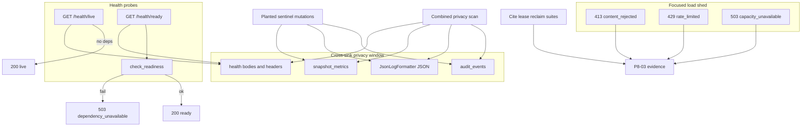

# Health Privacy Resilience Operational Safety Gate - Plan

## Goal Capsule

- **Objective:** Complete master-build-plan slice P8-03 by re-proving process liveness vs readiness, landing one combined cross-sink adversarial privacy scan (audit + JSON logs + metrics + health), and recording focused resilience/load-shed evidence — without an observability read API/UI, scrape endpoint, or full deployed-ingress load gate.
- **Authority:** Root `AGENTS.md`; FR-09 and Operability/Resilience/Privacy NFRs in `docs/prd.md`; `docs/architecture/security-operations-and-quality.md` Phase 1 operational-safety baseline; `docs/architecture/deployment-topology.md` Boot/health/shutdown and Capacity/load shedding; `docs/architecture/data-and-lifecycle.md` privacy classes; DRIFT-20 / DRIFT-29 / DRIFT-15 residuals in `docs/brownfield-refactor-register.md`; P1-04 and P8-01/P8-02 residuals in `docs/_scratch/p1-04-*`, `docs/_scratch/p8-01-*`, `docs/_scratch/p8-02-*`; `docs/quality/definition-of-done.md` reliability/operational-safety gates.
- **Execution profile:** Inventory-first brownfield re-proof and gate evidence; extend existing health/privacy/capacity tests rather than redesign probes; one new combined cross-sink scanner; no new public product surfaces.
- **Readiness checkpoint:** Implementation-ready after 2026-07-27 scoping confirmation: re-prove existing DB/schema/bootstrap readiness (object-store stays P10-02); focused local capacity/recovery evidence (not P12); one combined cross-sink privacy scan.
- **Stop conditions:** Stop if the slice requires a Phase 2 Logs/Usage/Server/audit-browser surface, scrape/OpenMetrics route, enabling `DisabledTracingPort`, inventing object-store readiness here, inventing a new global rate-limiter/stream-concurrency product, or claiming full deployed-ingress load/shutdown proof owned by P12.
- **Tail ownership:** P10-02 owns governed object-store readiness composition (DRIFT-15); P12 owns deployed-ingress load, SIGTERM/stream-drain, backup/restore, and production acceptance; Phase 2 owns product observability browsers.

---

## Product Contract

### Summary

P8-03 closes the Phase 1 operational-safety gate left after P8-01 (audit-row privacy) and P8-02 (log/metric emission + sink privacy): liveness stays process-only; readiness stays the bounded aggregate (database, exact Alembic head, enabled administrator) with safe correlated failures; one adversarial scan proves forbidden content never appears across audit rows, formatted JSON logs, metric dumps, and health responses together; focused evidence proves existing 413/429/503 shed paths and cites representative lease recovery. Phase 1 remains free of observability product surfaces.

Product Contract preservation: Product Contract authored in this bootstrap; no upstream brainstorm file. Scope confirmed 2026-07-27 (re-prove existing health aggregate; focused local resilience; combined cross-sink scan).

### Problem Frame

P1-04 proved `/health/live` and `/health/ready` against PostgreSQL 16, then deferred object-store readiness and broad sink privacy. P8-01 and P8-02 closed per-sink privacy for audit rows and for logs+metrics, explicitly leaving cross-sink + health to P8-03. Today there is no joint scanner covering all four sinks; provider/domain isolation for global readiness is claimed but under-proven; capacity shed paths (413/429/503) exist in feature suites but are not gathered as P8 gate evidence; DRIFT-20/29 cross-sink/health halves and master-build-plan P8 remain open. Without this slice, FR-09’s aggregate health + privacy-scan + resilience gate and the Phase 1 operational-safety baseline stay incomplete.

### Requirements

**Liveness / readiness**

- R1. Inventory every health/readiness surface, internal reason code, public projection, and deferred storage boundary with disposition `retain-and-reverify`, `extend-proof`, `cite-evidence`, or `out-of-scope` (object-store → P10-02; provider/domain → never global ready).
- R2. `GET /health/live` remains process-only: closed `{status: live}`, succeeds when readiness dependencies fail, and performs no database/storage/provider/runtime probe (`FR-09`, `deployment-topology.md`).
- R3. `GET /health/ready` verifies configuration-relevant bootstrap viability via the existing aggregate: database connectivity, exact `SUPPORTED_ALEMBIC_HEAD`, and at least one enabled administrator; success returns closed `{status: ready}` only.
- R4. Ready failures always project the same safe correlated `503 dependency_unavailable` envelope with `X-Request-ID` and `private, no-store`; internal reasons (`database_unavailable`, `schema_incompatible`, `bootstrap_incomplete`) never cross the HTTP boundary.
- R5. Provider outages and individual domain/runtime failures never fail global readiness; query eligibility owns those degradations.
- R6. Object-store readiness remains deferred to P10-02 / DRIFT-15; this slice must not invent a storage probe or claim full readiness closed.

**Cross-sink privacy**

- R7. One combined adversarial privacy scan plants FR-09 / `data-and-lifecycle` forbidden sentinels through representative mutations, then asserts absence across: persisted `audit_events` rows, `JsonLogFormatter` JSON lines, process-local metric name/label dumps, and health live/ready response bodies and correlation headers.
- R8. Unify a single forbidden-substring/key set for the combined scan (superset of P8-01 and P8-02 sentinel classes, including stack-trace temptation).
- R9. Scanned health success bodies remain closed (`status` only); failure bodies remain the canonical safe envelope with empty `fields` and no topology/revision/bootstrap username/exception text.
- R10. `test_phase_one_observability_scope.py`, route/production scope absence, and no-scrape metric checks stay green; no Phase 2 observability read symbols or scrape routes appear.
- R10a. Inventory dispositions `DisabledTracingPort`/traces as `retain-absence` and test snapshots/fixtures as cite-evidence hygiene residuals — not product sinks opened or closed by this slice.

**Resilience / load evidence**

- R11. Focused evidence proves existing capacity shed paths already contracted in Phase 1: upload/body `413 content_rejected`, login-throttle `429 rate_limited` with integer `Retry-After`, and retrieval/admission `503 capacity_unavailable` where already mapped.
- R12. Evidence cites (or lightly re-runs) representative lease/recovery PostgreSQL proofs already closed in P3/P5/P7 (domain delete, index claim, turn lease) — do not rebuild those suites.
- R13. Graceful SIGTERM / ingress stream-drain / deployed load remain P12-05/P12-07 residuals; optional local characterization of worker `should_continue=False` stop-claiming is allowed but not required for gate close.
- R14. Inventory and evidence land under `docs/_scratch/`; DRIFT-20 / DRIFT-29 cross-sink/health notes and master-build-plan P8-03 (and P8 phase) update only after verification — without overclaiming DRIFT-15 or P12.

### Acceptance Examples

- AE1. Inventory freezes health surfaces, privacy sink union, resilience cite matrix, and explicit out-of-scope (object-store ready, Phase 2 read, P12 load).
- AE2. With readiness broken (schema mismatch or no enabled admin), `/health/live` is `200 {status:live}` and `/health/ready` is safe correlated `503`; live performs no DB probe.
- AE3. Exact head + enabled administrator yields `/health/ready` `200 {status:ready}` with no diagnostic payload.
- AE4. Stopped/unhealthy domain and/or unready provider present still leave global ready `200` when DB/schema/bootstrap are healthy.
- AE5. After planted-sentinel mutations, one scan reports clean across audit rows + formatted JSON logs + metric dumps + health live/ready bodies/headers.
- AE6. Focused matrix demonstrates existing upload/body `413`, login-throttle `429`+Retry-After, and retrieval `503 capacity_unavailable` shed paths without unbounded allocation. It does not prove concurrent-stream `429` or deployed SIGTERM/stream-drain.
- AE7. No observability read API/UI, no scrape aliases; DRIFT-15 storage residual remains explicit; P8-03 marked DONE only after green verification.

### Scope Boundaries

#### In scope

- `docs/_scratch/p8-03-operational-safety-inventory.md` and post-proof evidence doc.
- Re-proof and thin extensions of P1-04 health/live/ready behavior (including provider/domain isolation fixture and Alembic edge coverage where inventory shows gaps).
- One combined cross-sink privacy test over audit + logs + metrics + health.
- Focused resilience/load-shed evidence matrix citing existing 413/429/503 and lease suites; thin HTTP 413 case only if early Content-Length gate is under-proven.
- Absence regressions for Phase 1 observability scope and scrape routes.
- DRIFT-20 / DRIFT-29 cross-sink/health residual notes and master-build-plan P8-03 / P8 status after proof.

#### Deferred for later

- Governed object-store readiness composition (P10-02 / DRIFT-15).
- Product Logs / Usage / Server / audit-browser / live streams / exports (Phase 2).
- Enabling a real external tracing exporter or OTel pipeline.
- Deployed-ingress load, SIGTERM/stream-drain, backup/restore, production acceptance (P12).
- New per-principal concurrent-stream limiters beyond existing login throttle (A-13 residual / P12 if required).

#### Deferred to Follow-Up Work

- Tightening readiness from “any enabled administrator” to “configured `admin_username` specifically” — only with an explicit product decision (as-built is any enabled admin).
- Worker SIGTERM signal wiring for `should_continue` — P12/P10-03 unless a focused local characterization is free.

#### Outside this product's identity

- Phase 2 observability store, Redis/RQ/Celery, WebSocket migration, multi-tenant Workspace entity, ungrounded domain fallback, browser-selectable telemetry backends.

### Key Flows

- F1. Operator probes `/health/live` during dependency failure → process-only `200 live`.
- F2. Operator probes `/health/ready` when DB/schema/bootstrap healthy → closed `200 ready`; when not → identical safe `503`.
- F3. Provider/domain degradation present → global ready stays green; eligibility owns product impact.
- F4. Adversarial fixture mutations → one scan over audit + log + metric + health sinks reports clean.
- F5. Capacity exhaustion on upload / login / retrieval admission → contracted 413 / 429 / 503 before unbounded work.
- F6. Lease expiry / reclaim paths → cite existing PostgreSQL proofs as resilience evidence.

### Actors

- A1. Release / ops engineer — uses liveness/readiness probes; no product observability UI.
- A2. Member / administrator — generate traffic that must not leak into sinks.
- A3. Privacy adversary (test) — plants sentinels and inspects all four sinks.
- A4. Ingress / capacity controls — shed load with contracted codes before resource exhaustion.
- A5. Worker / lease reclaim paths — prove recoverable work without duplicate/stale authority (cited).

---

## Planning Contract

### Key Technical Decisions

- KTD1. **Inventory-first gate freeze.** Freeze health surfaces, privacy sink union, resilience cite matrix, and residuals in scratch inventory before new tests land. Governs R1, R14.
- KTD2. **Re-prove P1-04 aggregate; do not expand readiness.** Keep `check_readiness` as database + exact Alembic head + any enabled administrator; leave object-store to P10-02; never fail ready for provider/domain outages. Governs R2–R6. `(session-settled: user-approved — chosen over pulling object-store readiness into P8-03: confirmed in P8-03 scoping)`
- KTD3. **As-built bootstrap semantics.** Re-prove current code (any enabled administrator), not the stricter “configured username only” inventory wording, unless a separate product decision reopens it. Document the wording drift in inventory. Governs R3.
- KTD4. **One combined cross-sink privacy scan.** Add a joint adversarial test that plants once and asserts all four sinks; do not close P8-03 by citing P8-01/P8-02 alone. Include health bodies/headers in the scan set. Governs R7–R10. `(session-settled: user-approved — chosen over declaring per-sink proofs sufficient: confirmed in P8-03 scoping)`
- KTD5. **Focused local resilience evidence, not P12 load.** Bundle existing 413/429/503 proofs plus lease citations into a focused matrix/evidence selection; invent no new global limiter. Full deployed load/shutdown stays P12. Governs R11–R13. `(session-settled: user-approved — chosen over treating full deployed load as in-scope: confirmed in P8-03 scoping)`
- KTD6. **No observability product surface.** Retain absence of scrape routes, audit/log browsers, and Phase 2 observability symbols. Governs R10, AE7.
- KTD7. **Honest DRIFT closure.** Close DRIFT-20/29 cross-sink/health halves after green proof; keep DRIFT-15 IN_PROGRESS until P10-02; mark P8 phase DONE only when P8-03 evidence lands.

### Assumptions

- P8-01 audit-row privacy and P8-02 log/metric privacy remain green and are reused as plant helpers / sentinel sources, not reopened for redesign.
- `SUPPORTED_ALEMBIC_HEAD` and PG test `HEAD_REVISION` pins stay synchronized with the current Alembic head at implementation time.
- Login-throttle `429` is the Phase 1 rate-limit shed path evidenced in this gate. Concurrent-stream `429` and SIGTERM/stream-drain remain A-13 / P12 residuals and are not claimed as Operability-complete here.
- Worker `should_continue` exists but lacks SIGTERM wiring; leaving full graceful shutdown to P12 is acceptable for this gate.

### High-Level Technical Design

Health probes stay closed projections. Privacy proof is one window over four sinks. Resilience evidence aggregates existing shed and lease proofs without inventing new product controls.

### System-Wide Impact

- **Services touched:** primarily tests + scratch/evidence/docs; `readiness.py` / health routes only if a proven gap requires a retain/modify fix (not expected under confirmed scope).
- **Failure propagation:** health failures remain safe envelopes; privacy/resilience tests must not weaken product mutation authority.
- **Privacy boundary:** joint scan closes the remaining Phase 1 gap across audit, JSON logs, metrics, and health after P8-01/P8-02. Traces stay `DisabledTracingPort` (`retain-absence`); snapshot/fixture privacy remains test-artifact hygiene — not a product sink opened here.
- **Contract surface:** no new OpenAPI/DTO/SSE contracts; closed `LiveHealthResponse` / `ReadyHealthResponse` retained.
- **Downstream:** P9 may assume P8 operational-safety gate closed; P10-02 still owns storage readiness; P12 still owns deployed load/shutdown.

### Risks and Dependencies

| Risk | Mitigation |
| --- | --- |
| Overclaiming object-store readiness | KTD2 + DRIFT-15 residual explicit in evidence |
| Closing via per-sink citation only | KTD4 requires one combined test file |
| Expanding into P12 load/shutdown | KTD5 + residual list; cite leases instead of rebuilding |
| Bootstrap wording vs as-built drift | KTD3 documents as-built; do not silently tighten |
| Alembic head pin drift during slice | Inventory records current head; update pins if migration lands elsewhere |
| Provider/domain isolation unproven | U2 adds thin ready=200 fixture with stopped domain / unready provider present |
| HTTP early Content-Length 413 under-tested | U4 adds thin HTTP case only if inventory confirms gap |

**Depends on:** P8-02 DONE (log/metric emission + sink privacy); P8-01 DONE; P1-04 health baseline.
**Blocks:** Honest P8 phase exit; P9-01 may depend on P8; P12-03 adversarial breadth assumes Phase 1 sink privacy closed.

### Open Questions

- None blocking for plan readiness.
- Residual (do not overclaim at close): readiness as-built = any enabled administrator; P1-04 “configured `admin_username`” tightening stays a product decision. Closure blurbs may claim as-built bootstrap re-proof only — not full configured-bootstrap viability.
- Deferred: worker SIGTERM → `should_continue` wiring (P10-03 / P12-05).
- Deferred: concurrent-stream `429` shed (A-13 / P12) — not invented or claimed Operability-complete in this gate.

---

## Implementation Units

### U1. Operational-safety inventory freeze

**Goal:** Produce the authoritative P8-03 inventory of health surfaces, privacy sink union, resilience cite matrix, and residuals before new tests land.

**Requirements:** R1, R6, R14 — KTD1, KTD2, KTD3, KTD7

**Dependencies:** None

**Files:**
- Create: `docs/_scratch/p8-03-operational-safety-inventory.md`
- Modify (read-only evidence refs): `app/context_engine/services/readiness.py`, `app/context_engine/api/routes.py`, `app/context_engine/api/public_schemas.py`, `app/tests/test_health_contract.py`, `app/tests/test_postgres_foundation.py`, `app/tests/test_audit_privacy_scan.py`, `app/tests/test_log_metric_privacy_scan.py`, `app/tests/test_phase_one_observability_scope.py`, capacity/lease test peers listed in inventory
- Test expectation: none — documentation gate; behavioral tests begin in U2–U4

**Approach:** Mirror P8-01/P8-02 scratch structure: scope, disposition classes (`retain-and-reverify` / `extend-proof` / `cite-evidence` / `out-of-scope`), health register (live/ready/internal reasons/public projections), privacy sink union + sentinel supersets, resilience cite matrix (413/login-429/capacity-503/lease suites with paths), bootstrap wording drift note (as-built any enabled admin; configured-username residual), object-store → P10-02, P12 residuals (including concurrent-stream 429 and SIGTERM/stream-drain). Explicitly disposition `DisabledTracingPort`/traces as `retain-absence` and snapshots/fixtures as cite-evidence hygiene. Freeze current `SUPPORTED_ALEMBIC_HEAD`.

**Patterns to follow:** `docs/_scratch/p8-02-telemetry-inventory.md`, `docs/_scratch/p1-04-health-readiness-inventory.md`

**Test scenarios:**
- Test expectation: none — inventory artifact review only

**Verification:** Inventory names every health surface, four privacy sinks, shed/lease citations, trace retain-absence, and explicit out-of-scope; records as-built any-enabled-admin semantics and lists configured-username tightening as an explicit residual (not closed).

---

### U2. Liveness and readiness re-proof

**Goal:** Re-verify P1-04 live/ready invariants and close under-proven edges: provider/domain isolation and Alembic failure shapes that must share one safe `503`.

**Requirements:** R2–R6, AE2–AE4 — KTD2, KTD3

**Dependencies:** U1

**Files:**
- Modify: `app/tests/test_health_contract.py`
- Modify: `app/tests/test_postgres_foundation.py` (P1-04 case / helpers as needed)
- Modify only if a real gap forces it: `app/context_engine/services/readiness.py`, `app/context_engine/api/routes.py`
- Create or extend focused cases inside the above (prefer extend over new file unless isolation needs a dedicated module)

**Approach:** Retain closed projections and safe failure envelope. Add thin fixture proof that ready stays `200` when a stopped/unhealthy domain and/or unready provider configuration is present while DB/schema/bootstrap are healthy. Extend Alembic edge coverage (ahead/malformed/absent) to the same safe `503` shape where inventory shows gaps. Keep live dependency-free. Do not add object-store checks.

**Execution note:** Prefer characterization of existing readiness behavior before any production edit; production changes only if a re-proof finds a contract violation.

**Patterns to follow:** `test_p1_04_readiness_requires_exact_schema_and_bootstrap_on_postgresql_16`, `_assert_safe_readiness_failure`, `LiveHealthResponse` / `ReadyHealthResponse`

**Test scenarios:**
- Happy path: exact head + enabled admin → ready `200 {status:ready}`; live `200 {status:live}`
- Edge: readiness broken → live still `200`; ready identical safe `503` with request ID + no-store
- Edge: Alembic ahead/malformed/absent (as inventory directs) → same safe `503`, never migrate from API
- Edge: no enabled administrator → `bootstrap_incomplete` internally, safe `503` publicly
- Integration: stopped/unhealthy domain present → ready still `200` when aggregate healthy
- Integration: unready/disabled provider config present → ready still `200` when aggregate healthy
- Error: ready failure body has empty `fields`, no revision/username/topology/exception text

**Verification:** Focused health + PostgreSQL readiness cases green; inventory’s `extend-proof` rows closed or residualed honestly.

---

### U3. Combined cross-sink privacy scan

**Goal:** Land one adversarial privacy scan that plants forbidden sentinels once and asserts absence across audit rows, formatted JSON logs, metric dumps, and health responses.

**Requirements:** R7–R10, AE5 — KTD4, KTD6

**Dependencies:** U1

**Files:**
- Create: `app/tests/test_cross_sink_privacy_scan.py`
- Modify (reuse helpers/patterns only as needed): `app/tests/test_audit_privacy_scan.py`, `app/tests/test_log_metric_privacy_scan.py`
- Re-verify: `app/tests/test_phase_one_observability_scope.py`, `app/tests/test_service_metrics.py` (no scrape)

**Approach:** Unify forbidden sentinel set (P8-01 ∪ P8-02, including stack-trace temptation). Drive representative mutations that tempt leakage (credential rotate, title/filename/body, chat question/answer/excerpt, exception path). Capture: serialized `audit_events`, `JsonLogFormatter` output (not bare `getMessage()`), `snapshot_metrics()` including label values, and `/health/live` + `/health/ready` bodies/headers (success and, where fixture allows, safe `503`). Assert no planted substrings/keys; health success remains `{status}` only. Keep absence tests green.

**Execution note:** Implement the combined scan test-first; reuse plant fixtures from P8-01/P8-02 where practical rather than inventing a second mutation harness.

**Patterns to follow:** `app/tests/test_audit_privacy_scan.py`, `app/tests/test_log_metric_privacy_scan.py`, `JsonLogFormatter` capture in `test_structured_logging.py`

**Test scenarios:**
- Happy path: after planted mutations, all four sinks clean for the unified forbidden set
- Edge: health success bodies contain only closed `status`; headers carry `X-Request-ID` without diagnostic topology
- Edge: health `503` body is safe envelope only (when fixture produces ready failure in the same window)
- Edge: metric label values and log JSON keys stay within existing allowlists (no identity stuffing regressions)
- Error: exception-tempting path does not place stack traces or raw exception text into any scanned sink
- Integration: observability absence / no-scrape checks remain green alongside the new scan

**Verification:** Combined scan passes; phase-one observability absence remains green; no new read/scrape routes.

---

### U4. Resilience evidence matrix and P8 closure

**Goal:** Record focused 413/429/503 + lease-recovery evidence, write scratch evidence, advance DRIFT-20/29 honestly, and mark P8-03 / P8 done only after green verification.

**Requirements:** R11–R14, AE6–AE7 — KTD5, KTD7

**Dependencies:** U1, U2, U3

**Files:**
- Create: `docs/_scratch/p8-03-operational-safety-evidence.md`
- Create (optional aggregator for discoverability): `app/tests/test_resilience_load_shed.py` — thin matrix that exercises 413/429/503 paths (may wrap or call into existing suites)
- Modify: `docs/master-build-plan.md` (P8-03 DONE + closure blurb; P8 phase DONE when gate closes)
- Modify: `docs/brownfield-refactor-register.md` (DRIFT-20/29 cross-sink/health; DRIFT-15 remains storage residual)
- Thin HTTP case only if inventory confirms gap: upload Content-Length `413` route test near `app/tests/test_source_upload_validation.py` or the new matrix file

**Approach:** Build an evidence matrix that selects existing suites (`test_source_upload_validation.py`, `test_postgres_ingress_security.py`, `test_evidence_http_contract.py` / `test_scoped_retrieval.py`, lease PG suites) and adds only missing thin cases. Evidence commands must **execute** the selected 413/429/503 tests and at least one named lease reclaim/recovery test in the recorded pytest selection — path citation alone is insufficient for P8-03 DONE. Optionally add a small aggregator module for discoverability. Document P12 residuals (deployed load, SIGTERM/stream-drain). Write evidence with commands and counts. Update DRIFT and master-build-plan only after green.

**Execution note:** Prefer executing existing shed/lease proofs over inventing new product limiters; packaging without a green command run does not close the gate.

**Patterns to follow:** `docs/_scratch/p8-02-telemetry-evidence.md`, `docs/_scratch/p1-04-health-readiness-evidence.md`

**Test scenarios:**
- Happy path: oversize upload / Content-Length gate → `413 content_rejected` (unit and/or thin HTTP)
- Happy path: login throttle saturation → `429 rate_limited` + integer `Retry-After`
- Happy path: retrieval admission saturation → `503 capacity_unavailable`
- Integration: evidence doc cites at least one domain-delete, index-claim, and turn-lease reclaim/recovery proof as resilience residual closure-by-citation
- Edge: no new scrape/read observability surface introduced by evidence helpers
- Error: capacity responses remain safe envelopes (no paths/payloads/stack traces)

**Verification:** Evidence doc records commands, counts, and residuals; DRIFT-20/29 cross-sink/health advanced honestly; DRIFT-15 still open; P8-03 and P8 marked DONE only after green verification.

---

## Verification Contract

- [ ] U1 inventory freezes health, privacy sinks, resilience citations, and out-of-scope residuals.
- [ ] U2 live/ready re-proof + provider/domain isolation + safe `503` edges pass (unit + PostgreSQL where required).
- [ ] U3 combined cross-sink privacy scan passes; observability absence / no-scrape stay green.
- [ ] U4 resilience matrix (413/429/503 + lease citations) and evidence doc land; DRIFT-20/29 and master-build-plan updated without overclaiming DRIFT-15 or P12.
- [ ] Changed-file Ruff / focused pytest selection recorded in evidence; no OpenAPI regeneration required unless a health contract bug forces a DTO fix (unexpected).

## Definition of Done

- [ ] Applicable FR-09 / Privacy / Resilience outcomes for this gate are satisfied for the scoped shed matrix (413 / login-429 / capacity-503) and cited lease recovery; full Operability capacity (concurrent-stream 429) and SIGTERM/stream-drain remain P12 residuals.
- [ ] As-built any-enabled-admin readiness is re-proven; closure does not claim configured-`admin_username` bootstrap viability fully closed.
- [ ] Backend authority, authorization, privacy classifications, and public contract boundaries remain intact — no observability read API/UI; traces stay `DisabledTracingPort` retain-absence.
- [ ] Cross-sink privacy (audit + logs + metrics + health), health projections, and scoped capacity shed evidence are proven at the appropriate real boundary (PostgreSQL where readiness/bootstrap require it).
- [ ] HTTP/DTO contracts for health remain closed and synchronized; no scrape/metrics export added.
- [ ] Scratch inventory + evidence identify artifact/source revision tested; residuals name P10-02, configured-bootstrap tightening, concurrent-stream 429, and P12 shutdown/load explicitly.
- [ ] Master-build-plan P8-03 DONE and P8 phase complete only after the above are green.

---

## Appendix

### Sources and research

- Master-build-plan deliverable P8-03; P8-02 residuals in `docs/_scratch/p8-02-telemetry-inventory.md` / evidence.
- P1-04 health inventory/evidence; `app/context_engine/services/readiness.py`; `app/tests/test_health_contract.py`; `app/tests/test_postgres_foundation.py`.
- Privacy peers: `app/tests/test_audit_privacy_scan.py`, `app/tests/test_log_metric_privacy_scan.py`.
- Capacity peers: upload validation, ingress login throttle, evidence/retrieval capacity mapping.
- Lease peers: domain leases, index claim, turn leases (cite, do not rebuild).
- Authority: `docs/prd.md` FR-09; `docs/architecture/deployment-topology.md`; `docs/architecture/security-operations-and-quality.md`.
- External research: skipped — local P1-04/P8-01/P8-02 patterns are sufficient and load-bearing for this gate.
- Institutional `docs/solutions/`: absent in this repo; no learnings corpus to mine.
