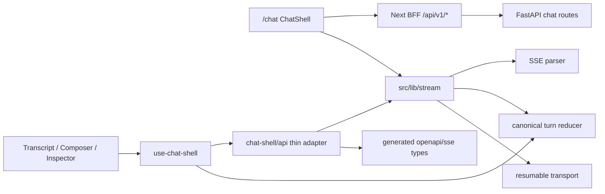
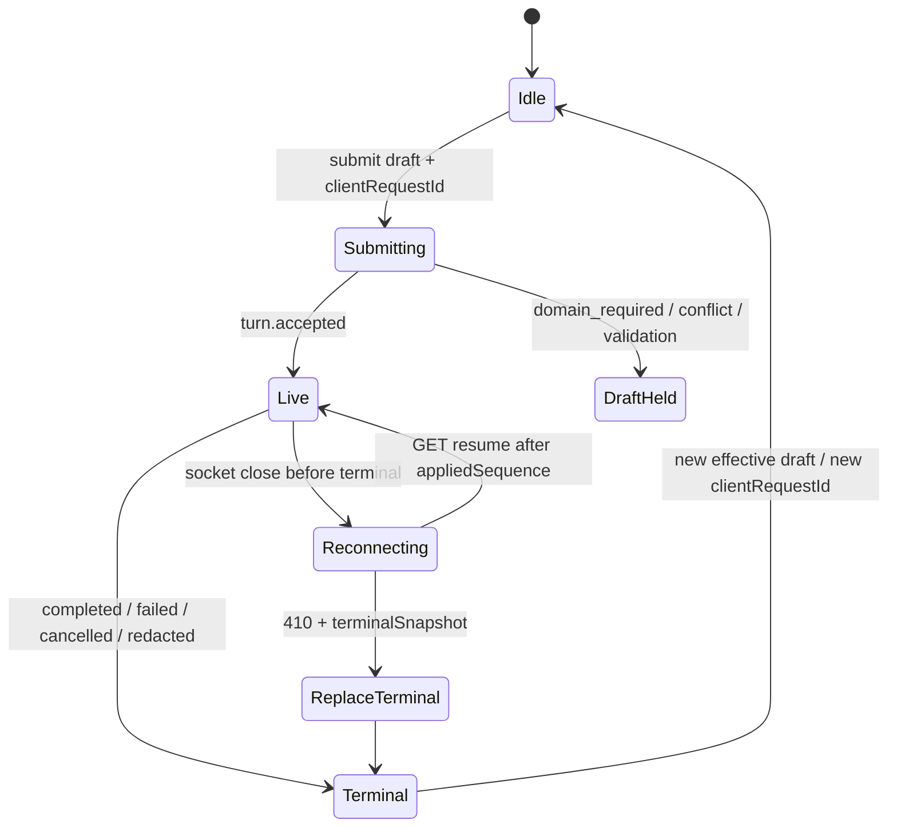

# Chat Workbench Canonical Stream Reducer - Plan

## Goal Capsule

- **Objective:** Complete master-build-plan slice P9-02 by retiring handwritten chat/SSE substitutes for the member `/chat` surface, extracting one canonical live/resume/replay stream reducer, and shipping conversation discovery, transcript/composer (domain selector + draft/idempotency), and the turn-scoped Evidence/Refs/Source workbench against approved contracts.
- **Authority:** Root `AGENTS.md`; FR-06 / FR-10 and the closed Phase 1 chat capability manifest in `docs/prd.md`; M-02–M-11 and C-01–C-04 in `docs/interaction-behavior-prd.md`; `docs/contracts/sse-event-catalog.md`, `docs/contracts/http-api-catalog.md`, `docs/contracts/dto-schema-catalog.md`, `docs/contracts/document-and-evidence-contract.md`; `docs/frontend/chat-and-evidence-workbench.md`, `docs/frontend/api-client-and-stream-runtime.md`, `docs/frontend/AGENTS.md`, root `DESIGN.md`; DRIFT-01/02/03/06/24 in `docs/brownfield-refactor-register.md`; P7-04 producer residuals in `docs/_scratch/p7-04-sse-pipeline-*.md`; P9-01 ownership evidence in `docs/_scratch/p9-01-ui-ownership-evidence.md`.
- **Execution profile:** Brownfield retain/modify of `features/chat-shell` and stream helpers toward `src/lib/stream/` + generated OpenAPI/SSE types; inventory-first; characterization of failing `stream-protocol` fixtures before reducer extraction; fixture-driven reducer proof plus focused React/browser coverage. No invented public fields, ErrorCodes, event types, or second stream protocol.
- **Readiness checkpoint:** Implementation-ready after 2026-07-27 scoping confirmation: full Sources/Evidence/Templates token discovery deferred to P11; proof altitude is fixtures/unit/component/focused browser (not P12 ingress); Evidence “Open in Library” emits opaque query params only (documents preview stays P9-03).
- **Stop conditions:** Stop if the slice requires WebSocket/`EventSource` for turn-start, browser-chosen route/domain/provider, ungrounded domain fallback, new public DTO/event fields absent from contracts, claiming deployed-ingress stream-drain, implementing P11 composer-ref discovery/assembly, implementing documents preview (P9-03), Settings domains accordion (P9-04), or Phase 2/3 surfaces.
- **Tail ownership:** P11 owns governed-ref token discovery/validation/assembly and `ComposerRefDto.token` vs runtime `refToken` catalog repair; P9-03 owns document library/preview; P9-05 owns broader import-boundary CI; P12 owns deployed-ingress reconnect/drain and full visual-matrix E2E; P11-04 remains product-gated for Evidence reattachment.

---

## Product Contract

### Summary

P9-02 closes the browser half of sealed chat after P7 sealed the producer and P9-01 settled shell/kit ownership: generated HTTP/SSE types drive thin chat adapters; one reducer consumes live POST, resume GET, and durable replay identically; `/chat` presents the three-region workbench with conversation discovery, transcript/composer (domain selector, draft retention, idempotent `clientRequestId`), and turn-scoped Evidence/Refs/Source inspector including opaque Library deep links. Interactive composer-ref discovery stays deliberately unavailable until P11.

Product Contract preservation: Product Contract authored in this bootstrap; no upstream brainstorm file. Scope confirmed 2026-07-27 (picker → P11; proof altitude local; Library deep-link params only).

### Problem Frame

P7-01–P7-05 delivered owner conversations, server route authority, bounded orchestration, sealed SSE producer/ledger, and delete redaction. P9-01 migrated starter kit ownership and left chat on a partial stream stack. The browser still embeds a parallel `applyTurnStreamEvent` path, fails five `stream-protocol` subtests against producer fixtures, uses lifted `ChatTurn`/`EvidenceRow` shapes that drop public `documentRef`/anchors, lacks `410 cursor_expired` / `terminalSnapshot` handling, keeps an interactive `@` ref picker ahead of P11, and ships an evidence-only aside instead of the contracted Evidence/Refs/Source inspector. Without this slice, DRIFT-02/03/06/24 consumer residuals and P9-02 stay open, and P11-04 cannot assume a sealed workbench baseline.

### Requirements

**Generated client and stream runtime**

- R1. Inventory chat-shell, stream helpers, BFF SSE proxy, generated OpenAPI/SSE artifacts, fixture coverage, and DRIFT-01/02/03/06/24 consumer residuals with retain/modify/defer dispositions before behavior changes land.
- R2. Chat HTTP/SSE adapters consume generated OpenAPI/SSE component types for conversation, turn, evidence, accepted-ref, and turn-stream events; retire handwritten substitute fields that conflict with catalog DTOs for this surface.
- R3. Extract parser, canonical turn consumer/reducer, and resumable transport into `src/lib/stream/` (or equivalent contracted layout); live POST, resume GET, and durable replay feed one reducer with separate `receivedSequence` / `appliedSequence`.
- R4. Honor catalog cursor rules: ignore exact duplicates only; stop on gap/regression; never infer completion from socket close; on `410 cursor_expired` replace (never merge) from authorized `terminalSnapshot`, else an authorized existing conversation/turn projection via `getConversation` (or equivalent catalog GET already registered — invent no new snapshot endpoint); otherwise show contracted unavailable copy.
- R5. Align resume policy with `api-client-and-stream-runtime.md` (five attempts, contracted backoff/jitter, visibility/online nudge). Keep BFF as the existing catch-all streaming proxy; do not add a second chat-specific BFF protocol.

**Conversation discovery, transcript, composer**

- R6. Conversation discovery remains in the authenticated shell rail (list/search/create/select/rename/delete) using owner-scoped APIs; switching conversations never cancels another turn’s server work.
- R7. Transcript renders sanitized assistant Markdown, turn selection with active semantics, redacted turns (question preserved, answer/citations/evidence absent), scroll anchoring within 64 px of bottom, and Jump to latest.
- R8. Composer captures message, optional domain, and one `clientRequestId` per effective draft; Enter submits (IME-safe); Shift+Enter newline; preserve draft until `turn.accepted`; clear only the submitted snapshot after acceptance; allow newer typing during flight.
- R9. Domain selector shows Direct chat plus server-returned query-eligible domains with safe labels only; never silently change domain, drop refs, or rewrite a domain-seeking question to direct chat. Map `domain_required`, `domain_not_query_eligible`, and `409 idempotency_conflict` to contracted UI with draft retained and request ID shown.
- R10. Gate/remove interactive Sources/Evidence/Templates token discovery for this slice; submit with empty `composerRefTokens` is valid. Show a deliberate unavailable/stub state for references rather than a working discover picker. Do not claim closed-manifest composer-ref discovery complete.

**Evidence/Refs/Source workbench**

- R11. Turn inspector exposes Evidence, Refs, and Source tabs with contextual empty states; selection is turn-scoped (M-06); closing the inspector does not clear `selectedTurn` / `selectedEvidence`.
- R12. Evidence cards are keyboard-reachable buttons (DRIFT-02): focus, selected state, trap/return in the narrow drawer, and no pointer-only activation.
- R13. “Open in Library” builds `/documents?document=<documentRef>&evidence=<evidenceRef>&page=…` from approved opaque fields only; never put paths, object URLs, raw block IDs, or trusted excerpts in the URL. Documents preview/reauth remain P9-03; missing refs or unavailable library surface render disabled/unavailable with safe copy (and request ID when applicable).
- R14. Refs tab projects safe accepted-ref metadata for the selected turn; Source tab projects safe document metadata for the selected evidence plus Open in Library.

**Privacy, parity, and closure**

- R15. Private projections stay tab-memory only: no local/session persistence of prompts, answers, evidence excerpts, raw composer tokens, CSRF, or session material. Caches partition by identity epoch; logout/auth expiry clears private view and does not auto-resume.
- R16. Compose chrome from P9-01 kit (`@/ui` / Settings-owned rows where applicable); migrate chat call sites off residual `@/_shared/ui` for covered primitives; no second token system.
- R17. Prove M-02, M-03, M-06, M-07, M-08, M-10, M-11, C-03, C-04 at fixture/unit/component and focused browser altitude. Explicit deferrals: M-04/M-05 end-to-end viewer → P9-03 (this slice proves opaque href construction + disabled/unavailable only); M-09 discover → P11 (empty-token submit + References unavailable stub); C-01 multi-member domain isolation and deployed-ingress drain → P12 / backend concurrency suites. Update inventory/evidence, DRIFT notes, and master-build-plan only after verification.

### Acceptance Examples

- AE1. Producer fixture `direct-success.sse` (chunked 1-byte / random / whole-frame) reduces to the same terminal projection via live, resume-after-disconnect, and durable replay paths.
- AE2. Fixtures `sequence-gap.sse` / `duplicate-delivery.sse` stop-and-resume or ignore-exact-duplicate per cursor rules without inventing answer text.
- AE3. Fixtures `no-grounded-context.sse` / `evidence-only.sse` / `redacted.sse` / `cancel.sse` / `terminal-replay.sse` / `disconnect-resume.sse` reduce to contracted terminals; `replay:true` does not re-call providers.
- AE4. Simulated `410 cursor_expired` with `terminalSnapshot` replaces the turn projection; without snapshot/history, UI shows contracted unavailable copy and invents no answer.
- AE5. Submit without domain for a domain-seeking question surfaces `domain_required`, retains draft, and does not silently route to direct chat (M-02/M-07).
- AE6. Uncertain POST before `turn.accepted` retries the identical body/`clientRequestId`; after `409 idempotency_conflict`, draft is retained and a new ID is issued only on explicit user resubmit.
- AE7. Selecting an assistant turn atomically swaps Evidence/Refs/Source; keyboard activates an evidence card; Open in Library href (when enabled) uses only opaque `document`/`evidence`/`page` params per the document/evidence contract (M-06). End-to-end viewer open remains P9-03.
- AE8. Narrow viewport: inspector is a focus-trapped drawer below 1024 px with return focus; discovery uses the shell drawer below 768 px; no horizontal viewport push at 320 CSS px.
- AE9. Forbidden privacy sentinels (prompts, answers, raw composer tokens, paths, object URLs, raw block IDs, excerpts) do not appear in browser storage, URL query strings, or rendered error detail beyond safe messages/request IDs. Approved opaque Library params from R13 are exempt.
- AE10. Inventory + evidence docs land; DRIFT-02 closed; DRIFT-03/06/24 consumer halves closed; DRIFT-01 chat-surface handwritten substitutes retired for this surface; P9-02 marked DONE only after green verification — without claiming P11 picker or P12 ingress.

### Scope Boundaries

#### In scope

- `docs/_scratch/p9-02-chat-workbench-inventory.md` and post-proof evidence doc.
- Generated-type adoption for chat conversation/turn/evidence/SSE events; thin `features/chat-shell/api.ts` adapters.
- `src/lib/stream/` extraction: parser, canonical reducer/consumer, reconnect/resume including `410` / `terminalSnapshot`.
- `/chat` three-region workbench: discovery (shell rail), transcript/composer/domain, Evidence/Refs/Source inspector.
- Gate/remove interactive composer-ref discover UI; draft/idempotency/`clientRequestId` lifecycle; error-code UI mapping.
- Opaque Library deep-link construction; DRIFT-02 Evidence keyboard/focus/drawer behavior.
- Fixture-driven stream tests (all nine producer transcripts + cursor_expired), focused React/component tests, focused browser coverage; kit import cleanup for covered primitives.
- DRIFT/master-build-plan updates after verification.

#### Deferred for later

- Governed Sources/Evidence/Templates token discovery, `token`/`refToken` catalog repair, one-use validation UX (P11-01–P11-03).
- Documents library/preview/content range (P9-03).
- Settings Domain accordion (P9-04 BLOCKED).
- Broader import-direction/CI validators (P9-05).
- Deployed-ingress unbuffered SSE / stream-drain / full visual matrix (P12).
- Evidence reattachment compose-epoch workflow (P11-04 BLOCKED).
- Full `src/lib/api/capabilities/*` migration for non-chat surfaces.
- Bedrock/Ollama synthesis adapters (backend residual).

#### Deferred to Follow-Up Work

- Multiline `data:` / keepalive comment polish in the parser if producer frames never exercise them in fixtures — record gap; implement only if fixture or catalog proof requires it.
- Cross-tab shared `clientRequestId` via any browser storage — rejected; server idempotency is the correctness boundary.
- Claiming closed Phase 1 chat capability manifest complete while P11 composer-ref discovery remains open.

#### Outside this product's identity

- Open tool registry, plugins, terminal/filesystem/browser automation, browser-selected model/provider/controller/runtime.
- WebSocket migration or a second streaming protocol.
- Phase 2 observability routes/APIs/UI; Phase 3 wiki composer refs/UI.

### Key Flows

- F1. Member opens `/chat`, discovers/creates a conversation, composes with optional domain, submits, observes streamed stages through one reducer.
- F2. Mid-stream disconnect → reconnecting presentation → GET resume after applied cursor → same terminal as uninterrupted live.
- F3. Member selects a prior grounded turn → inspector shows that turn’s Evidence/Refs/Source; Open in Library navigates with opaque params.
- F4. Failure/redaction paths retain or clear projections exactly as contracted (`domain_required`, conflict, redacted, cancelled, cursor expired).

### Actors

- A1. Authenticated member — owns conversations; uses `/chat` workbench.
- A2. Administrator — not granted private conversation/Evidence access by this slice; no Settings domains work here.

---

## Planning Contract

### Key Technical Decisions

- **KTD1. Gate interactive composer-ref discovery; keep domain selector and empty-token submit.** `(session-settled: user-directed — chosen over pulling P11 discovery into P9-02: P11 owns token schema/validation; submit must not require refs.)` Remove or disable `@` discover UI and `discoverComposerRefs` call sites; stub References unavailable; rewrite tests that currently require a live picker.
- **KTD2. Proof altitude is fixture/unit/component/focused browser — not P12 ingress.** `(session-settled: user-directed — chosen over claiming deployed-ingress drain here: P12 owns ingress stream-drain.)`
- **KTD3. Evidence Open in Library emits opaque query params only.** `(session-settled: user-directed — chosen over implementing documents preview in chat: P9-03 owns viewer/reauth.)` Build `/documents?document=&evidence=&page=` from public refs via a new outbound helper (do not overload return-to-chat `libraryDeepLink.ts`). When refs are missing or the documents surface is still unavailable, keep the control disabled with honest copy rather than navigating to a broken preview. Flip tests that forbid helpers only for the opaque-href construction proof.
- **KTD4. One extracted stream package owns parser + canonical reducer + resume transport.** Move logic out of `use-chat-shell` / `features/chat-shell/stream-*` into `src/lib/stream/`; the hook becomes a projection consumer. Live, resume, and replay must share the identical reduce function.
- **KTD5. Generated types + thin adapters for chat; not a repo-wide capabilities rewrite.** Adopt `lib/api/generated/openapi.ts` / `sse.ts` component types for chat DTOs/events; keep `ceFetch`/`postSse`/`getSse` wrappers until a generated endpoint function layer exists. Do not expand into domains/sources/settings capability modules.
- **KTD6. Frontend evidence projection must carry catalog public fields.** Expand beyond stripped `{id, citationLabel, sourceLabel, excerpt}` to include `documentRef`, kind, and anchor fields required for deep links and Source tab — matching `EvidenceItemDto` / SSE `evidence.delta` items. Backend already emits `documentRef`.
- **KTD7. Cross-tab correctness is server idempotency only.** Do not share `clientRequestId` via `sessionStorage`/`localStorage`. Each tab may select different turns (C-03); caches key by identity epoch (C-04).
- **KTD8. Defer `ComposerRefDto.token` vs runtime `refToken` repair with P11.** Gating discover means P9-02 must not depend on discover responses. Record the mismatch as an explicit P11 residual; stop if a forced discover call remains after gating.
- **KTD9. Inventory-first, then characterization of failing stream tests, then extraction.** Mirror P7/P8 slice discipline: freeze retain/modify/defer before moving modules; make `stream-protocol.test.mjs` the characterization harness for reducer extraction.

### High-Level Technical Design

Three-region composition (contract widths): shell discovery rail + conversation workbench + optional turn inspector (drawer below 1024 px). Inspector tabs read only the selected turn’s projection.

### Assumptions

None beyond the session-settled KTDs above — interactive scoping confirmation accepted those bets.

### Open Questions

#### Deferred to implementation

- Exact module filenames under `src/lib/stream/` and whether `createCanonicalTurnConsumer` remains the public name after extraction.
- Whether Source tab metadata is satisfied solely from selected evidence DTO fields or needs an additional authorized document metadata GET already in catalog — prefer evidence projection first; add GET only if Source empty-state cannot meet contract.
- How much of multiline/`keepalive` parser surface is exercised by current producer fixtures before expanding parser tests.

#### Blocking

None.

### Risks and Dependencies

| Risk | Mitigation |
| --- | --- |
| Producer/consumer fixture mismatch after extraction | Characterization-first: all nine `app/tests/fixtures/sse/*` must pass before UI claims |
| Existing picker + tests fight KTD1 | Inventory lists every picker assertion; gate UI and rewrite tests in the same unit |
| Deep-link tests currently forbid navigation | Flip assertions with KTD3; keep privacy forbids for paths/object URLs |
| Partial kit migration (`@_shared/ui`) | Migrate covered primitives only; residual mega-kit imports tracked for P9-05 |
| Overclaiming chat capability manifest | Evidence doc must state P11 discovery residual explicitly |
| Depends on P7 producer + P9-01 kit | Both DONE; stop if producer fixtures missing or unreadable |

### System-Wide Impact

- **Members:** `/chat` becomes the durable grounded workbench — discovery, streaming stages, turn-scoped inspector, and recoverable draft/error states must match sealed producer semantics or members will distrust reconnect/replay.
- **Navigation shell:** Conversation list/search in `NavigationSidebar` shares chat adapters; type/shape changes in U2 must not break ⌘K discovery or identity-epoch cache clearing on logout.
- **Documents route (P9-03):** Opaque Library deep links become the handoff contract; broken or over-rich query params create either dead navigation or privacy leaks. Chat must degrade to disabled/unavailable when refs are missing rather than inventing preview behavior.
- **BFF / cache boundary:** Catch-all streaming proxy already forwards SSE; this slice must preserve `private, no-store`, abort propagation, and allowlisted headers. No new browser-selectable upstream.
- **P11 governed context:** Gating discover creates an honest unavailable surface; later P11 work re-enables picker without rewriting the reducer or inspector tab model. `token`/`refToken` repair must land before any discover client regeneration.
- **P12 release proof:** Local fixture/component green is necessary but not sufficient for ingress drain; do not treat P9-02 evidence as P12-05/P12-07 closure.
- **Failure propagation:** Socket close → reconnecting (not cancel); `410` → replace projection; auth expiry → clear private view; never mix another user’s events into the reducer (C-04).
- **Agent/tool surface:** Closed Phase 1 chat capability manifest forbids open tool registry — this slice must not add browser-facing agent tools or controller selection while adapting Local Studio chat chrome.

---

## Implementation Units

### U1. Chat workbench inventory and residual freeze

**Goal:** Freeze retain/modify/defer for every chat-shell, stream, generated-client, BFF, fixture, and DRIFT consumer surface before behavior changes.

**Requirements:** R1, R17

**Dependencies:** None

**Files:**
- Create: `docs/_scratch/p9-02-chat-workbench-inventory.md`
- Modify (read-only cites): `app/client/src/features/chat-shell/*`, `app/client/src/lib/api/sse*.ts`, `app/client/src/lib/api/generated/*`, `app/client/src/app/api/v1/[...path]/route.ts`, `app/client/tests/stream-protocol.test.mjs`, `app/client/tests/chat.test.mjs`, `docs/brownfield-refactor-register.md`, `docs/_scratch/p7-04-sse-pipeline-evidence.md`, `docs/_scratch/p9-01-ui-ownership-evidence.md`

**Approach:** Mirror P7-04/P9-01 inventory columns. Capture handwritten vs generated DTO gaps (`ChatTurn`/`EvidenceRow`/`ComposerRef`), reducer embedding in `use-chat-shell`, missing `410` handling, picker call sites, inspector tab absence, deep-link test forbids, and fixture coverage matrix (which of the nine SSE files already run). Pin KTD1–KTD9 as constraints. Explicitly defer P11 discover field repair and P12 ingress.

**Patterns to follow:** `docs/_scratch/p7-04-sse-pipeline-inventory.md`, `docs/_scratch/p9-01-ui-inventory.md`

**Test scenarios:**
- Happy path: Inventory lists every chat-shell module, stream helper, generated artifact, BFF proxy path, and fixture file with a disposition.
- Edge: Documents that picker deferral does not break empty-token submit; documents `token`/`refToken` as P11 residual.
- Error: Flags any missing producer fixture required by AE1–AE3 as a blocker before U3.

**Verification:** Inventory exists, cites authorities, and is the only sequencing input for U2–U6.

---

### U2. Generated chat DTO adoption and thin adapters

**Goal:** Retire conflicting handwritten chat substitutes for conversation/turn/evidence/SSE event shapes on the `/chat` path.

**Requirements:** R2, R15; KTD5, KTD6, KTD8

**Dependencies:** U1

**Files:**
- Modify: `app/client/src/features/chat-shell/api.ts`, `app/client/src/features/chat-shell/types.ts`
- Modify (as needed): `app/client/src/lib/api/client.ts`, `app/client/src/lib/api/errors.ts`
- Test: `app/client/tests/chat.test.mjs` (and/or new Vitest adapter tests under `app/client/tests/`)
- Optionally regenerate: `scripts/generate_openapi.py` outputs under `app/client/src/lib/api/generated/` only if catalog/producer drift requires it — stop and surface if regeneration invents fields

**Approach:** Map list/get/create/rename/delete conversation and turn history projections to generated component types. Expand evidence rows to catalog public fields (`documentRef`, kind, anchor, labels, excerpt) so U5 can build deep links. Keep SSE event type alias from generated `sse.ts`. Leave discover unused and `token`/`refToken` repair to P11. Preserve thin `ceFetch` wrappers.

**Execution note:** Prefer failing adapter/type tests against generated schemas before deleting lifted fields.

**Patterns to follow:** `features/domains/api.ts` generated-type usage; `docs/frontend/api-client-and-stream-runtime.md` thin-adapter rule

**Test scenarios:**
- Happy path: Conversation list/detail adapters type-check against generated DTOs; evidence items expose `documentRef` when present in fixture payloads.
- Edge: Redacted turn projection has null answer and empty evidence/acceptedRefs.
- Error: Invalid success payload surfaces safe `contract_violation` with request ID when runtime validation exists; otherwise document residual explicitly.
- Integration: Navigation sidebar `listConversations` still compiles against the thinned adapter.

**Verification:** No chat-shell handwritten fields that contradict catalog DTOs for in-scope surfaces; discover client unused.

---

### U3. Canonical stream package and fixture-driven reducer

**Goal:** Extract one stream runtime that proves live/resume/replay equivalence on all producer fixtures, including `410` replace semantics.

**Requirements:** R3, R4, R5; AE1–AE4; KTD2, KTD4, KTD9

**Dependencies:** U1, U2

**Files:**
- Create: `app/client/src/lib/stream/` (parser, reducer/consumer, reconnect/resume, public barrel)
- Modify: `app/client/src/lib/api/sse-parser.ts` (move or thin-reexport into stream package — parser+consumer are one characterization unit)
- Modify: `app/client/src/features/chat-shell/stream-protocol.ts`, `stream-reconnect.ts`, `api.ts` (re-export or delete after move)
- Modify: `app/client/tests/stream-protocol.test.mjs`, `app/client/tests/stream-reconnect.test.mjs`
- Add tests as needed for `cursor_expired` / `terminalSnapshot` and for the four fixtures not yet wired (`evidence-only`, `no-grounded-context`, `disconnect-resume`, `terminal-replay`)
- Fixtures (read): `app/tests/fixtures/sse/*.sse`

**Approach:** Characterization-first against currently failing stream-protocol cases (five red subtests today). Move `SseParser`, `createCanonicalTurnConsumer`, and `runResumableTurnStream` into `src/lib/stream/`. Implement a pure turn projection reducer used by both the consumer and UI. Parametrize all nine producer transcripts with chunking. Implement `410` path: validate snapshot → replace projection; else authorized `getConversation`/turn projection; else unavailable — invent no new snapshot endpoint. Align defaults to contract (**five** resume attempts, `min(8000, …)` backoff). Unknown additive events advance cursor without UI mutation.

**Execution note:** Start with failing fixture coverage for `evidence-only`, `no-grounded-context`, `disconnect-resume`, `terminal-replay`, and a `410` synthetic case before UI wiring.

**Patterns to follow:** `docs/frontend/api-client-and-stream-runtime.md` cursor algorithm; P7-04 fixture set; existing consumer digest/gap rules

**Test scenarios:**
- Happy path: Covers AE1 — direct-success identical across live/resume/replay reduction.
- Edge: Covers AE2 — duplicate ignored; gap stops and resumes after applied cursor; unknown additive event commits sequence only.
- Error: Covers AE4 — `410` + snapshot replaces; `410` without snapshot/history yields unavailable; regression/conflict → `stream_protocol_error`.
- Integration: Reconnect transport uses GET `.../events?after=<appliedSequence>` and never treats EOF as terminal.

**Verification:** `stream-protocol` / reconnect suites green on the full fixture matrix; no completion inferred from socket close.

---

### U4. Draft, idempotency, and stream wiring in chat shell state

**Goal:** Make `use-chat-shell` a projection consumer with contracted draft/`clientRequestId` lifecycle and safe error mapping.

**Requirements:** R7–R10, R15; AE5–AE6; KTD1, KTD7

**Dependencies:** U3

**Files:**
- Modify: `app/client/src/features/chat-shell/use-chat-shell.ts`
- Modify: `app/client/src/features/chat-shell/api.ts` (wire stream package)
- Test: `app/client/tests/chat.test.mjs` and/or `app/client/tests/` Vitest hook/state tests

**Approach:** Split composer draft vs submitted snapshot; clear submitted snapshot only on applied `turn.accepted`. Create `clientRequestId` once per effective draft; reuse identical body on uncertain pre-accept POST; issue new ID only after terminal failure, conflict resubmit, or user-edited effective input. Map `domain_required`, `domain_not_query_eligible`, `idempotency_conflict`, auth expiry. Feed all stream events through the U3 reducer. Remove all `discoverComposerRefs` call sites in this unit (UI stub lands in U5 — U4 exit requires zero discover imports/calls). Fence inspector fetches with a generation key `(identityEpoch, conversationId, selectedTurnId)` and discard stale responses (M-06). Preserve drafts across recoverable failures; clear private state on identity change.

**Patterns to follow:** Workbench submission rules in `chat-and-evidence-workbench.md`; retry matrix in `api-client-and-stream-runtime.md`

**Test scenarios:**
- Happy path: Submit → accepted clears submitted snapshot; newer typing during flight remains.
- Edge: Covers AE6 — uncertain retry reuses ID/body; conflict retains draft and requires explicit resubmit for new ID.
- Error: Covers AE5 — `domain_required` retains draft and does not rewrite to direct chat; auth expiry clears private view without auto-resume.
- Integration: Switching conversations does not cancel server turn ownership; completion applies only to owning conversation projection.

**Verification:** Hook no longer owns a parallel event-apply path; draft/idempotency cases covered.

---

### U5. Three-region workbench UI, inspector tabs, picker gate, deep links

**Goal:** Ship the contracted `/chat` composition: transcript/composer/domain, Evidence/Refs/Source inspector, gated references, opaque Library links, and Evidence keyboard/drawer a11y.

**Requirements:** R6–R14, R16; AE7–AE9; KTD1, KTD3, KTD6

**Dependencies:** U2, U4

**Files:**
- Modify: `app/client/src/features/chat-shell/ChatShell.tsx`, `EvidencePanel.tsx` (evolve into tabbed inspector or sibling tabs module)
- Modify: `app/client/src/app/chat/page.tsx` (composition only if needed)
- Modify: `app/client/src/features/navigation-sidebar/NavigationSidebar.tsx` only if discovery adapter types require it
- Create: outbound Library href helper (e.g. `app/client/src/features/chat-shell/documentsDeepLink.ts` or under `features/documents/`) — do not overload return-to-chat `libraryDeepLink.ts`
- Create: Vitest/RTL tests (net-new; no chat RTL suite exists today), e.g. `app/client/tests/chat-inspector.test.tsx`, `app/client/tests/chat-draft-idempotency.test.tsx`
- Modify: `app/client/tests/chat.test.mjs` (picker gate, reducer location, opaque href assertions)
- Modify: `tests/e2e/source-ref-inspector.spec.ts` (complementary/tab hooks, open-in-library disabled-or-opaque behavior)

**Approach:** Keep `AppShell` ≠ `ChatShell`. Implement inspector tabs Evidence/Refs/Source with empty states; preserve a named inspector landmark (`complementary` or drawer `dialog`) and `inspector-tab-{evidence,refs,source}` hooks. Gate `@` picker; mount `data-testid="ref-picker"` on the deliberate unavailable References control (`aria-disabled`); keep domain selector. Build Open in Library hrefs from public refs; disable when refs missing or library unavailable. Evidence cards: button semantics, keyboard activation, focus trap/return in drawer mode below **1024 px** (DRIFT-02). Migrate covered imports from `@/_shared/ui` to `@/ui`. Sanitize Markdown; announce stage/terminal once.

**Patterns to follow:** `docs/frontend/chat-and-evidence-workbench.md`; P9-01 `StatusPill`/`Button`/`Input`; documents deep-link helper; accessibility contract

**Test scenarios:**
- Happy path: Covers AE7 — turn select swaps inspector; keyboard opens/activates evidence; Library href matches opaque query contract.
- Edge: Closing inspector preserves selection; Source/Refs empty states when no content; redacted turn clears inspector projections.
- Error: Missing `documentRef` disables Open in Library with safe copy; no path/object URL in href.
- Integration: Covers AE8 — inspector drawer focus trap/return below 1024 px; shell discovery drawer below 768 px still hosts conversation list.

**Verification:** Three tabs present; picker gated; DRIFT-02 behaviors covered; privacy URL assertions pass.

---

### U6. Focused verification, evidence record, and tracker closure

**Goal:** Prove P9-02 acceptance at the agreed altitude and close tracker/DRIFT notes without overclaim.

**Requirements:** R17; AE9–AE10; KTD2

**Dependencies:** U3, U4, U5

**Files:**
- Create: `docs/_scratch/p9-02-chat-workbench-evidence.md`
- Modify: `docs/brownfield-refactor-register.md` (DRIFT-01 chat half, DRIFT-02, DRIFT-03/06/24 consumer)
- Modify: `docs/master-build-plan.md` (P9-02 status + residual notes)
- Test: ensure `app/client/tests/stream-protocol.test.mjs`, reconnect, chat/component suites, and any focused Playwright chat specs used for AE8 are green
- Optionally extend: `tests/e2e/*` only for focused workbench paths — not full visual matrix

**Approach:** Record commands, fixture matrix, privacy assertions (storage/URL), and explicit residuals (P11 discover/`token`, P9-03 preview, P12 ingress, P9-05 CI). Do not mark closed Phase 1 chat capability manifest complete. Prefer existing npm/vitest entrypoints; document any composite `npm test` ordering caveat inherited from P9-01.

**Patterns to follow:** `docs/_scratch/p7-04-sse-pipeline-evidence.md`, `docs/_scratch/p9-01-ui-ownership-evidence.md`, `docs/quality/definition-of-done.md`

**Test scenarios:**
- Happy path: Evidence doc lists green commands for stream fixture suite + workbench component tests.
- Edge: Explicit residual table names P11/P9-03/P12/P9-05 owners.
- Error: Privacy scan of URL/storage fixtures finds no forbidden sentinels (AE9).
- Integration: Master-build-plan P9-02 flips only when residuals are recorded and DRIFT consumer notes match evidence.

**Verification:** P9-02 DONE with honest residuals; DRIFT-02 closed; consumer halves of DRIFT-03/06/24 closed; chat-surface DRIFT-01 substitutes retired for this slice.

---

## Verification Contract

- Inventory U1 complete before behavioral PRs land.
- Stream fixture suite covers all nine producer transcripts plus `410` replace/unavailable (AE1–AE4).
- Chat adapter/types use generated components for in-scope DTOs; discover unused (KTD8).
- Hook/UI prove draft retention, `domain_required`, idempotency conflict, turn-scoped inspector, gated picker (zero discover calls), opaque Library href construction + disabled/unavailable, Evidence keyboard/drawer (AE5–AE8).
- Structural `chat.test.mjs` and focused E2E rewritten in-slice for KTD1/KTD3/KTD4 (not left red).
- Privacy: forbidden sentinels absent from storage/URL/error detail; opaque Library params exempt (AE9).
- Evidence doc + DRIFT + master-build-plan updates (AE10). Sequence U6 only after U3 stream suite green (`npm test` short-circuits on stream-protocol today).
- Out of exit scope: P12 ingress drain / C-01 multi-member proof, P11 discover / M-09, P9-03 preview / M-04–M-05 E2E, P9-04 accordion, full visual matrix.

---

## Definition of Done

- [ ] U1 inventory freezes retain/modify/defer and pins KTD1–KTD9.
- [ ] U2 chat adapters adopt generated DTO/event types; evidence carries public deep-link fields.
- [ ] U3 `src/lib/stream/` reducer/parser/resume green on full fixture matrix including `410`.
- [ ] U4 draft/`clientRequestId`/error mapping consumes the canonical reducer only.
- [ ] U5 three-region workbench + inspector tabs + picker gate + Library deep links + DRIFT-02 a11y.
- [ ] U6 evidence/DRIFT/tracker closure without overclaiming P11/P12/manifest completion.
- [ ] Applicable interaction cases M-02/M-03/M-06/M-07/M-08/M-10/M-11 and C-03/C-04 traced in tests/evidence; M-04/M-05/M-09/C-01 residuals explicit.
- [ ] Stop conditions honored; closed Phase 1 chat capability manifest linked, not redefined.

---

## Appendix

### Sources and research

- Master slice: `docs/master-build-plan.md` P9-02.
- Producer baseline: `docs/plans/2026-07-27-004-feat-sealed-sse-replay-pipeline-plan.md`, `docs/_scratch/p7-04-sse-pipeline-*.md`, `app/tests/fixtures/sse/`.
- Kit/shell baseline: `docs/plans/2026-07-22-003-feat-ce-frontend-factory-plan.md`, `docs/_scratch/p9-01-ui-ownership-evidence.md`.
- Frontend contracts: `docs/frontend/chat-and-evidence-workbench.md`, `docs/frontend/api-client-and-stream-runtime.md`.
- Drift: `docs/brownfield-refactor-register.md` DRIFT-01/02/03/06/24.
- External research: skipped — local P7/P9 patterns and contracts are sufficient; no load-bearing external findings.
- `docs/solutions/`: absent in this repo.
