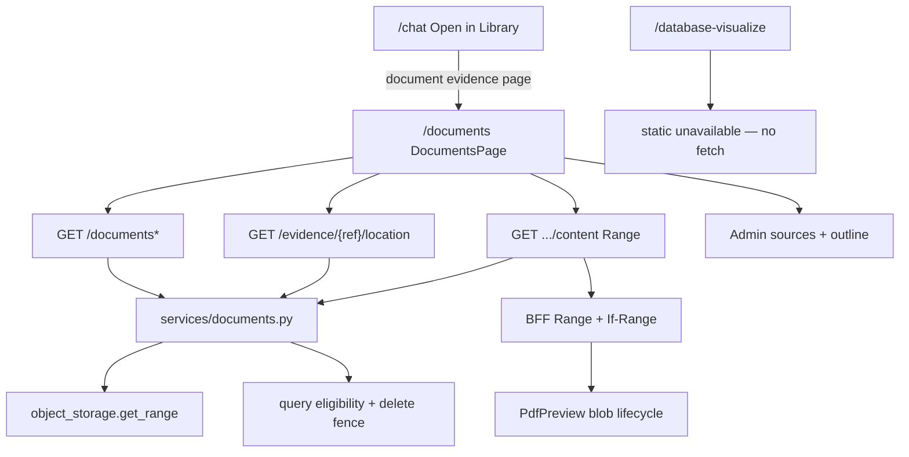
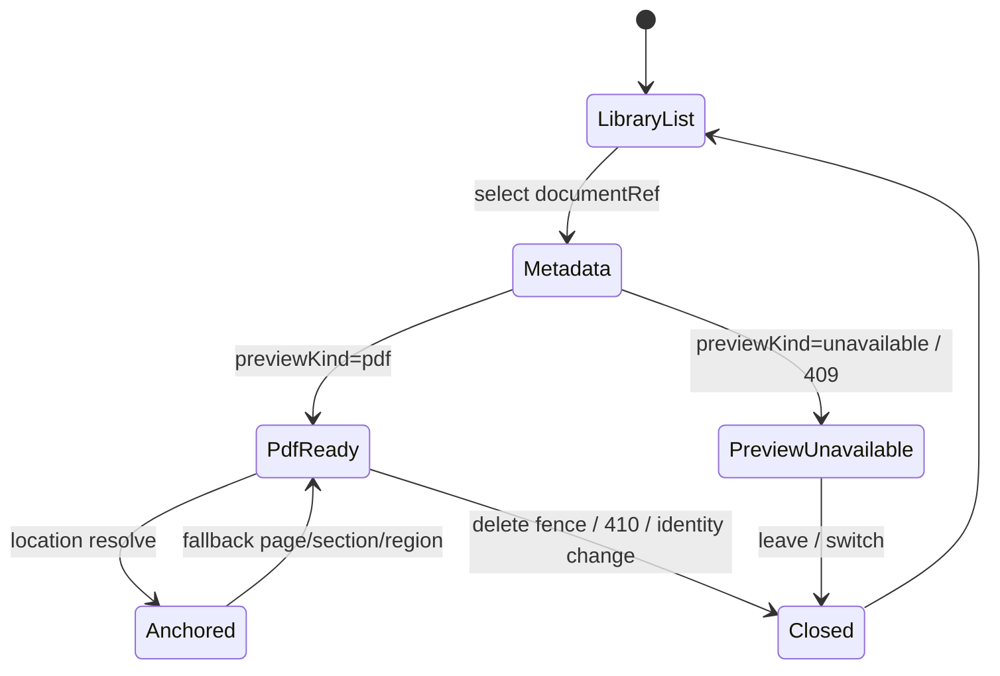

# Documents Library Preview and Graph Unavailable - Plan

## Goal Capsule

- **Objective:** Complete master-build-plan slice P9-03 by registering member document/list/detail/content and evidence-location APIs, shipping `/documents` as a member library + governed PDF preview with role-gated admin ops/outline, enabling chat Open in Library deep links, and proving `/database-visualize` as a deliberate no-request unavailable surface.
- **Authority:** Root `AGENTS.md`; FR-04 / FR-05 / FR-10 in `docs/prd.md`; M-04, M-05, M-06, M-11, C-03 in `docs/interaction-behavior-prd.md`; `docs/contracts/document-and-evidence-contract.md`, `docs/contracts/http-api-catalog.md`, `docs/contracts/dto-schema-catalog.md`; `docs/frontend/document-viewer-spec.md`, `docs/frontend/route-and-workspace-spec.md`, `docs/frontend/navigation-and-url-state.md`, `docs/architecture/frontend-security-boundary.md`; DRIFT-04 / DRIFT-14 in `docs/brownfield-refactor-register.md`; P4-01/P4-04 object-store and outline evidence; P7-05 location/content residual; P9-02 opaque deep-link handoff.
- **Execution profile:** Vertical brownfield slice — inventory-first; backend member routes + PostgreSQL/HTTP proofs; BFF `If-Range`; generated OpenAPI/TS; dual-role `/documents` rewrite; graph no-request; fixture/unit/component/focused browser altitude (not P12 ingress).
- **Readiness checkpoint:** Implementation-ready after 2026-07-27 scoping: backend member APIs in slice; member library primary with role-gated admin ops; admin outline in; PDF originals as governed preview; non-PDF → `previewKind=unavailable` / `409`; DOCX/PPT/text body viewers deferred to future work.
- **Stop conditions:** Stop if the slice requires inventing `previewKind=text`, a non-PDF content MIME to the browser, PowerPoint upload/parser expansion, a graph/LightRAG API, member outline endpoint absent from catalog, new public fields/ErrorCodes beyond registered catalogs, claiming P12 ingress/cache/two-user isolation, or Settings domains accordion (P9-04).
- **Tail ownership:** Future brief owns DOCX/MD/text/PPT governed viewers (PDF generator or approved text/slide preview contracts); P9-05 owns broader import-boundary CI; P12 owns deployed-ingress Range/cache/adversarial isolation and full visual matrix; P11 owns composer-ref discovery.

---

## Product Contract

### Summary

P9-03 closes the Library/viewer half of governed Evidence navigation after P4 storage/outline, P6 evidence projection, P7 redaction fences, and P9-02 opaque chat deep links. Members browse authorized query-eligible documents, open PDF previews through reauthorized content ranges, and deep-link from Evidence with server-authoritative anchors. Administrators keep source ops and structure-only outline on the same page behind role-gated controls. Graph stays a deliberate unavailable route with zero product-data requests. Non-PDF originals remain listable with honest unavailable preview until a future viewer contract lands.

Product Contract preservation: Product Contract authored in this bootstrap; no upstream brainstorm file. Scope confirmed 2026-07-27 (backend APIs in; dual-role page; admin outline in; PDF-original preview; non-PDF/PPT viewers deferred).

### Problem Frame

Member `GET /documents*`, content Range, and `GET /evidence/{evidenceRef}/location` are catalogued and allowed as the only registered-route delta in the generated-contract gate, but are unregistered. `/documents` is an admin-sources monolith that stubs preview and shows members an unavailable page. Chat builds opaque Library hrefs but keeps Open in Library disabled. Graph still fetches `/domains` while claiming unavailable. DRIFT-14 (member document/content/location) and DRIFT-04 (graph no-request) remain open; P7-05 left open-panel location/content denial as an explicit P9-03 residual.

### Requirements

**Backend member document and location APIs**

- R1. Inventory documents/outline/preview/graph surfaces, BFF Range/`If-Range`, generated DTOs, admin outline, object-store range, delete fences, and DRIFT-04/14 residuals with retain/modify/defer before behavior changes.
- R2. Register `GET /documents`, `GET /documents/{documentRef}`, `GET /documents/{documentRef}/content`, and `GET /evidence/{evidenceRef}/location` against closed DTOs; clear the generated-contract gate delta; regenerate OpenAPI and TypeScript client.
- R3. Member list/detail include only authorized, query-eligible, non-deleting sources projected as `DocumentSummaryDto` (opaque `documentRef`, safe labels, `previewKind`, `pageCount` when known). Never emit private IDs, object keys, hashes, parser/index errors, or admin operations on member DTOs.
- R4. PDF originals validated at upload serve as the governed preview (`previewKind=pdf`) streamed via object-store range through the API boundary — `200` full, `206` single range, `416` unsatisfiable; strong opaque `ETag`; `Cache-Control: private, no-store`; no redirect/presigned URL/object key. Non-PDF originals (DOCX/Markdown/text) return `previewKind=unavailable` on metadata and `409 document_preview_unavailable` on content; never send original non-PDF bytes to a PDF renderer.
- R5. Location rechecks conversation ownership, non-redaction, source/domain eligibility, and preview availability; ignores browser-supplied page/region for authority; returns safe evidence/document/anchor projection. Wrong-owner/unknown refs share `404` shapes; deleting/redacted → `410 evidence_unavailable`; preview unsupported → `409`; storage failure → `503`.
- R6. After delete fencing, list omits the source and open location/content denies access; cleanup retry never restores reads (M-11 open-panel half).

**Frontend library, preview, admin ops, graph**

- R7. `/documents` primary surface is member library + viewer (list/detail split). Administrators additionally see role-gated upload/retry/cancel/delete and admin outline (structure only, no canonical text) on the same page. UI role checks are advisory; FastAPI authorizes.
- R8. Accept inbound opaque deep links `/documents?document=&evidence=&page=` from chat; resolve location; prefer server anchor over URL page hint; apply page/section/region fallbacks per document-and-evidence contract. Region highlight may degrade to page + “Exact location unavailable” when anchors lack region.
- R9. Return-to-chat builds `/chat?conversation=&turn=&evidence=` from authorized safe refs only (navigation contract). Align return helpers with that shape; never accept a free-form return URL.
- R10. Replace lifted `features/documents/api.ts` `SourceDocument` shapes with generated `AdminSourceDto` / `DocumentSummaryDto` adapters. Admin mutations send `If-Match` / version where P4-04 requires it.
- R11. Flip chat `LIBRARY_SURFACE_AVAILABLE` (or equivalent) only after member content/location reauth path works; Open in Library navigates via opaque hrefs; missing refs stay disabled.
- R12. `/database-visualize` renders deliberate unavailable copy with **zero** `/domains`, graph, LightRAG, or runtime requests; drop reserved `domain`/`node` during canonicalization; remove domain-selector scaffolding.
- R13. Prove M-04, M-05, M-06 (documents-side late location), M-11 open-panel denial, C-03 tab isolation at fixture/unit/component/focused browser altitude. BFF forwards `Range` and `If-Range` with `206`/`Content-Range`/`ETag` passthrough. Privacy: no keys/paths/hashes/private IDs in URL/DOM/storage/error detail. Update inventory/evidence, DRIFT-04/14, and master-build-plan only after verification.

### Acceptance Examples

- AE1. Member lists documents for an authorized query-eligible domain; unauthorized/deleting sources are absent; response matches `DocumentSummaryDto` with no private fields.
- AE2. PDF document detail shows `previewKind=pdf`; content without Range returns `200 application/pdf`; valid Range returns `206` with exact `Content-Range`; unsatisfiable returns `416`.
- AE3. DOCX/Markdown/text document detail shows `previewKind=unavailable`; content returns `409 document_preview_unavailable`; metadata remains visible; no original non-PDF body reaches the browser renderer.
- AE4. Evidence Open in Library navigates with opaque params; location resolves; figure/text/table anchors open the correct page with contracted fallbacks (M-04/M-05); URL page hint loses to server anchor.
- AE5. Rapid evidence switch discards stale location responses (documents-side M-06); altered/forged refs yield same `404` shape without existence leak.
- AE6. Delete while viewer open → subsequent location/content deny; viewer closes; blob/worker revoked; list omits source (M-11 open-panel).
- AE7. Administrator on `/documents` uploads/retries/cancels/deletes with `If-Match` where required; outline loads structure-only items with no canonical text; members never see ops controls that mutate sources.
- AE8. Graph route shows unavailable and issues no product-data network calls (DRIFT-04).
- AE9. Privacy scan: no object keys, paths, private source IDs, hashes, or excerpts in Library URL/storage/error detail beyond safe messages/request IDs.
- AE10. Inventory + evidence docs land; contract gate delta for the four GETs is empty; DRIFT-14 member half and DRIFT-04 no-request half closed with honest residuals (non-PDF/PPT viewers, P12 ingress); P9-03 marked DONE only after green verification.

### Scope Boundaries

#### In scope

- `docs/_scratch/p9-03-*-inventory.md` and post-proof evidence doc.
- Member document list/detail/content and evidence-location FastAPI services/routes + PostgreSQL/HTTP tests.
- PDF-original-as-preview policy; non-PDF unavailable/409.
- BFF `If-Range` allowlist + Range passthrough proofs.
- OpenAPI/TS regeneration; clear four-route contract-gate delta.
- Dual-role `/documents` rewrite; PdfPreview lifecycle; inbound deep-link parse; return-to-chat alignment; admin outline UI; admin If-Match ops.
- Chat Library enablement; graph no-request unavailable.
- Focused browser/e2e rewrite for documents-preview and graph no-request.
- DRIFT-04/14 and master-build-plan updates after verification.
- Future-work note for DOCX/MD/text/PPT viewers under `docs/future/` (or equivalent brief pointer) — documentation only, no Phase 1 scaffolding.

#### Deferred for later

- Deterministic DOCX/Markdown/text → PDF preview generator and preview object/version/page-map schema expansion beyond PDF-original policy.
- PowerPoint upload allowlist, parser, and slide viewer (not in Phase 1 allowlist today).
- Native figure region highlight when anchors lack `region` (page/section fallback is sufficient for exit).
- Settings Domain accordion (P9-04 BLOCKED).
- Broader import-direction/CI validators (P9-05).
- Deployed-ingress Range/cache defeat / multi-member isolation (P12).
- Full visual-matrix parity for every viewport/theme (P12-07).
- Member outline endpoint (not in HTTP catalog — do not invent).

#### Deferred to Follow-Up Work

- Migrating Documents/Graph off residual `@/_shared/ui` beyond covered P9-01 primitives when that fight expands P9-05 scope — prefer kit for covered roles; do not expand factory catalog here.
- Claiming full DRIFT-05 middleware/trust closure from BFF `If-Range` alone.

#### Outside this product's identity

- Browser access to object storage, LightRAG, runtime URLs, or raw source paths.
- Graph/canvas scaffolding “for later wiring.”
- Phase 2 observability routes; Phase 3 wiki surfaces.
- Open tool registry / plugins.

### Key Flows

- F1. Member browses `/documents` library → opens PDF → Range preview ready.
- F2. Chat Evidence → Open in Library → location resolve → anchored preview → return to chat.
- F3. Admin performs source ops + outline on same page; member library remains the browse SoT.
- F4. Delete/redact while open → content/location deny → viewer teardown.
- F5. Graph route → static unavailable → zero product-data requests.

### Actors

- A1. Authenticated member — library read, PDF preview, Evidence deep-link navigation.
- A2. Administrator — same member library/preview plus role-gated source ops and outline; not granted other members’ private conversation Evidence by this slice.

---

## Planning Contract

### Key Technical Decisions

- **KTD1. Include the four missing member document/location/content APIs in this slice.** `(session-settled: user-directed — chosen over frontend-only against stubs: catalog + P7-05/DRIFT-14 residuals already assign routes here.)`
- **KTD2. Dual-role `/documents`: member library + preview primary; admin ops role-gated on the same page.** `(session-settled: user-directed — chosen over member-viewer-only or relocating admin ops: matches route-and-workspace-spec.)`
- **KTD3. Admin source outline (structure, no canonical text) is in this slice.** `(session-settled: user-directed — chosen over deferring outline UI: P4-04 backend exists; wire UI + privacy proofs only.)`
- **KTD4. PDF originals are the governed preview; non-PDF → unavailable/409.** `(session-settled: user-directed — chosen over preview-generator migration or text previewKind: stay inside closed `previewKind` enum; never send DOCX/MD/text bytes to pdf.js.)` ETag/strong identity derives from the governed preview bytes (validated PDF original). `pageCount` from safe PDF metadata when obtainable; omit/null-safe per DTO rules when not. Non-PDF stay listable with `previewKind=unavailable`.
- **KTD5. DOCX/MD/text/PPT body viewers are future work, not Phase 1 scaffolding.** `(session-settled: user-directed — chosen over contract amendment for text preview or PPT allowlist: record under Deferred / future brief; PowerPoint is not in today’s upload allowlist.)`
- **KTD6. Library browse SoT is `GET /documents` for both roles; admin ops use parallel `/admin/.../sources` correlated by `documentRef`.** Do not reuse admin list as the member library projection. Admin outline/mutations keep private `sourceId` + `version`/`If-Match` on admin paths only.
- **KTD7. Return-to-chat URL is `/chat?conversation=&turn=&evidence=`.** Align `libraryDeepLink` / return helpers with `navigation-and-url-state.md`; keep outbound Library params on `documentsDeepLink.ts` separate.
- **KTD8. Proof altitude is fixture/unit/component/focused browser — not P12 ingress.** Deployed Range/cache/two-user isolation remains P12.
- **KTD9. Graph unavailable means zero product-data requests.** Remove domain-selector/`listMemberDomains` scaffolding; static copy only (DRIFT-04).
- **KTD10. Inventory-first vertical slice; regenerate contracts when routes register.** Mirror P4/P9-02 scratch inventory → implement → evidence. Region highlight residual is acceptable under page/section fallback.

### High-Level Technical Design

Dual-role composition: list + viewer as primary; admin ops/outline panel visible only when `role=administrator`, still authorized server-side.

### Assumptions

- Validated PDF originals satisfy governed-preview byte delivery for Phase 1 without a separate preview object column; private previewVersion/page-map expansion for non-PDF generators stays future.
- Member `DocumentSummaryDto.contentType` remains the closed preview media literal (`application/pdf`) per catalog; availability is signaled by `previewKind`, not by inventing text MIME on the member DTO.
- Evidence anchors may omit `region`; M-04 figure “focus region” degrades to page fallback with honest copy until parsers emit normalized regions.
- Admin outline stays on admin catalog path only; frontend viewer-spec “optional outline” for members is unavailable (no member outline route).

### Open Questions

#### Deferred to implementation

- Exact helper names for inbound deep-link parse vs return-to-chat alignment.
- Whether `pageCount` uses a bounded PDF page-count probe at read time or a prep-time private field already available — prefer no schema expansion unless required for DTO completeness.
- How aggressively to migrate Documents/Graph off `@/_shared/ui` within covered P9-01 primitives without expanding P9-05.

#### Blocking

None.

### Risks and Dependencies

| Risk | Mitigation |
| --- | --- |
| Preview schema gap vs full contract | KTD4 explicit PDF-original policy; residual non-PDF generator in future brief |
| Lifted `SourceDocument` types reintroduce DRIFT-14 | U4/U5 rewrite adapters to generated DTOs before enablement |
| BFF missing `If-Range` | U3 extend allowlist + tests before claiming content contract green |
| Graph domain fetch blocks DRIFT-04 | U6 strip selector; assert zero product-data calls |
| Enabling Library before routes work | Flip chat flag only after AE2/AE4 green |
| Dual-role ID mixup | Member URLs use `documentRef` only; admin `sourceId` stays on admin API paths |
| Depends on P4 object-store range + P4-04 outline + P7 delete fence | All DONE; stop if range port or outline missing |

### System-Wide Impact

- **Members:** Evidence → Library navigation becomes real; broken preview or over-rich URLs are privacy/trust failures.
- **Administrators:** Source ops remain on `/documents` but must not leak private fields into member projections or URLs.
- **Chat (P9-02):** Open in Library enablement is a one-line capability flip plus e2e rewrite — keep opaque href helper ownership.
- **BFF/security boundary:** Range/`If-Range` completeness is load-bearing for PDF workers; abort must revoke blobs.
- **Delete/redaction (P7-05):** First public proof of open-panel location/content denial.
- **Future viewers:** Non-PDF/PPT work must amend contracts before UI scaffolding.
- **P12:** Local green ≠ ingress/cache isolation proof.

---

## Implementation Units

### U1. Documents/preview/graph inventory and residual freeze

**Goal:** Freeze retain/modify/defer for member routes, documents UI, BFF Range/`If-Range`, graph fetch, chat Library flag, outline, and DRIFT-04/14 before behavior changes.

**Requirements:** R1, R13; KTD1–KTD10

**Dependencies:** None

**Files:**
- Create: `docs/_scratch/p9-03-documents-library-inventory.md`
- Modify (read-only cites): `app/context_engine/api/routes.py`, `app/context_engine/services/sources.py`, `app/context_engine/adapters/object_storage.py`, `app/client/src/features/documents/*`, `app/client/src/features/graph/GraphPage.tsx`, `app/client/src/features/chat-shell/documentsDeepLink.ts`, `app/client/src/lib/server/bff-proxy.ts`, `app/tests/test_generated_contract_gate.py`, `docs/brownfield-refactor-register.md`, prior `docs/_scratch/p4-01-*`, `p4-04-*`, `p7-05-*`, `p9-02-*`

**Approach:** Mirror P4-04/P9-02 inventory columns. Pin session-settled KTDs. Explicitly record non-PDF/PPT viewers as future residual; region highlight residual; P12 ingress residual. Confirm four GETs are the only contract-gate delta.

**Patterns to follow:** `docs/_scratch/p9-02-chat-workbench-inventory.md`, `docs/_scratch/p4-04-source-outline-delete-inventory.md`

**Test scenarios:**
- Happy path: Inventory lists every in-scope module/route/BFF header/DRIFT row with a disposition.
- Edge: Documents that member outline is out of catalog; PPT not in upload allowlist.
- Error: Flags missing object-store `get_range` or admin outline as blockers before U2.

**Verification:** Inventory exists, cites authorities, and sequences U2–U7.

---

### U2. Member document list/detail service and routes

**Goal:** Register authorized member library list and document metadata against closed DTOs.

**Requirements:** R2, R3, R4 (metadata half), R6; AE1, AE3 (metadata); KTD1, KTD4, KTD6

**Dependencies:** U1

**Files:**
- Create: `app/context_engine/services/documents.py` (or equivalent member-documents service module)
- Modify: `app/context_engine/api/routes.py`, `app/context_engine/api/catalog_schemas.py` (list/detail envelopes if missing)
- Test: `app/tests/test_documents_api.py` and/or `app/tests/test_postgres_documents.py`
- Regenerate later with U3: OpenAPI/TS may land with U3 once content/location also register — prefer one regen when all four routes exist; if split, keep gate honest

**Approach:** Thin routes → documents service. Eligibility: authorized domain + query-eligible + not deleting. Resolve by `public_ref`. Project `DocumentSummaryDto` only. PDF → `previewKind=pdf`; non-PDF → `previewKind=unavailable`. No private fields. Prefer registering all four routes in U2–U3 before OpenAPI regen (see U3).

**Execution note:** Start with failing HTTP tests for list/detail eligibility and leak absence before wiring handlers.

**Patterns to follow:** `member_domain_list` / `source_is_query_eligible`; `safe_source` privacy discipline; `_private_json_response`

**Test scenarios:**
- Happy path: Covers AE1 — authorized member lists eligible docs by opaque ref.
- Edge: Empty library; domain filter; cursor/limit if catalog specifies.
- Error: Unknown/unauthorized `documentRef` → `404 document_not_found` same shape; deleting source omitted/denied.
- Integration: Administrator can call member GETs and receives member DTO shape (ops still admin-only).

**Verification:** List/detail green on PostgreSQL/HTTP altitude; no key/hash/path leakage.

---

### U3. Content Range, evidence location, BFF If-Range, and contract regen

**Goal:** Deliver governed PDF bytes + location resolution, complete BFF conditional Range, and clear the four-route contract gate.

**Requirements:** R2, R4, R5, R6, R13; AE2–AE6, AE9; KTD1, KTD4, KTD7, KTD8

**Dependencies:** U2

**Files:**
- Modify: `app/context_engine/services/documents.py`, `app/context_engine/api/routes.py`
- Modify: `app/client/src/lib/server/bff-proxy.ts`, `app/client/tests/bff-proxy.test.mjs` (or equivalent)
- Modify: `app/tests/test_generated_contract_gate.py` (delta becomes empty after registration)
- Regenerate: `app/contracts/openapi.json`, `app/client/src/lib/api/generated/openapi.ts` via `scripts/generate_openapi.py`
- Test: content/location HTTP + PostgreSQL tests (range matrix, ownership, delete fence)

**Approach:** Stream PDF originals through object-store `get_range` with contracted headers/`ETag`. Non-PDF content → `409 document_preview_unavailable`. Location joins turn evidence ownership + source eligibility + preview readiness; URL page ignored for authority. Extend BFF to forward `If-Range` and preserve `206`/`416`/`Content-Range`/`ETag`/`Accept-Ranges`. Abort propagation retained. After all four routes register, regenerate OpenAPI/TS and assert gate delta empty.

**Execution note:** Prove `200/206/416` and post-delete denial with real PostgreSQL barriers before frontend enablement.

**Patterns to follow:** `adapters/object_storage.py` range tests; document-and-evidence error table; SSE `StreamingResponse` header discipline adapted for PDF bytes

**Test scenarios:**
- Happy path: Covers AE2 — full and ranged PDF content.
- Edge: Covers AE3 — non-PDF content 409; stale/mismatched `If-Range` behavior per HTTP semantics.
- Error: Covers AE5/AE6 — forged refs 404; delete fence 410/404; `503` on storage failure with request ID.
- Integration: BFF round-trip forwards `Range`/`If-Range` and returns `Content-Range` without buffering entire body in tests that can assert headers.

**Verification:** Four routes registered; gate clear; location+content privacy/denial proofs green.

---

### U4. Member library UI, inbound deep links, and PDF preview lifecycle

**Goal:** Make `/documents` a member-primary library/viewer that consumes generated DTOs and opaque deep links.

**Requirements:** R7–R9, R10 (member half), R11; AE4, AE5, AE9; KTD2, KTD4, KTD7

**Dependencies:** U3

**Files:**
- Modify: `app/client/src/features/documents/DocumentsPage.tsx`, `PdfPreview.tsx`, `api.ts`, `libraryDeepLink.ts`
- Create as needed: inbound deep-link parse helper under `features/documents/` (do not overload chat `documentsDeepLink.ts` ownership)
- Test: `app/client/tests/documentsDeepLink.test.ts`, new Vitest documents/viewer tests, rewrite `app/client/tests/e2e/documents-preview.spec.ts`

**Approach:** Invert unavailable member gate. Library list from `GET /documents`. Detail + content blob for `previewKind=pdf`. Generation-fence location fetches. Parent owns blob URL / worker teardown on close, identity change, or unavailable. Parse `document`/`evidence`/`page`; align return href to `conversation`/`turn`/`evidence`. Replace lifted admin types at least for member path; finish admin adapter swap in U5. Leave chat `LIBRARY_SURFACE_AVAILABLE` (or equivalent) false until U6.

**Patterns to follow:** P9-02 `documentsDeepLink.ts`; `document-viewer-spec.md` states; chat-shell generated adapter style

**Test scenarios:**
- Happy path: Covers AE4 — deep-link opens PDF at resolved page.
- Edge: URL page hint overridden by location; unavailable preview shows metadata only.
- Error: Missing/forged refs → safe unavailable; no private IDs in URL.
- Integration: Abort/close releases blob URL; late location discarded (AE5).

**Verification:** Members can browse/open PDF; deep-link path works; privacy URL assertions pass.

---

### U5. Role-gated admin ops, outline, and If-Match

**Goal:** Keep administrator source operations and structure-only outline on `/documents` without contaminating member projections.

**Requirements:** R7, R10; AE7; KTD2, KTD3, KTD6

**Dependencies:** U4

**Files:**
- Modify: `app/client/src/features/documents/DocumentsPage.tsx`, `api.ts` (generated `AdminSourceDto` + outline client)
- Test: Vitest/RTL admin panel + outline privacy tests; e2e admin ops smoke if present

**Approach:** When role is administrator, show ops panel fed by `/admin/.../sources` for the selected domain, correlated to library selection via `documentRef`. Wire outline fetch to existing admin outline endpoint; render kind/label/level/pageNumber only — assert no canonical text fields in UI fixtures. Send `If-Match`/`version` on cancel/delete/retry per P4-04. Members never mount mutating controls.

**Patterns to follow:** P4-04 outline DTO; admin domains/sources patterns; Settings notice/error request ID

**Test scenarios:**
- Happy path: Covers AE7 — admin outline loads structure-only; delete/cancel includes If-Match when version present.
- Edge: Outline empty/unprepared → honest empty/unavailable; conflict refreshes server truth.
- Error: Member session cannot invoke admin outline/ops (server 403/404); UI hides controls.
- Integration: Selecting a library row syncs admin ops target by `documentRef` without putting `sourceId` in the URL.

**Verification:** Dual-role page matches route spec; outline privacy proofs green.

---

### U6. Graph no-request unavailable and chat Library enablement

**Goal:** Close DRIFT-04 no-request half and enable Evidence → Library navigation end-to-end.

**Requirements:** R11, R12; AE4, AE8; KTD9

**Dependencies:** U4

**Files:**
- Modify: `app/client/src/features/graph/GraphPage.tsx`
- Modify: `app/client/src/features/chat-shell/documentsDeepLink.ts`, `EvidencePanel.tsx` (flip availability)
- Test: graph no-request test (network/spy or e2e); chat inspector Library enabled assertions; update `tests/e2e` graph/documents as needed

**Approach:** Replace domain-selector scaffolding with static unavailable composition; assert no `listMemberDomains` / graph / LightRAG calls. Enable Library control when refs present. Keep opaque href builder unchanged aside from availability flag.

**Patterns to follow:** `route-and-workspace-spec.md` `/database-visualize`; P9-02 deep-link tests

**Test scenarios:**
- Happy path: Covers AE8 — graph mounts with zero product-data requests.
- Edge: Reserved query params dropped/canonicalized without fetch.
- Error: Library control remains disabled when `documentRef`/evidence ref missing.
- Integration: Covers AE4 from chat click through documents viewer when preview ready.

**Verification:** DRIFT-04 no-request proveable; chat Library navigates successfully.

---

### U7. Focused verification, evidence record, and tracker closure

**Goal:** Prove P9-03 at agreed altitude and close tracker/DRIFT notes without overclaim.

**Requirements:** R13; AE9–AE10; KTD5, KTD8

**Dependencies:** U3, U4, U5, U6

**Files:**
- Create: `docs/_scratch/p9-03-documents-library-evidence.md`
- Create or modify: future-brief pointer for non-PDF/PPT viewers (e.g. note under `docs/future/` README or a short stub — documentation only)
- Modify: `docs/brownfield-refactor-register.md` (DRIFT-04, DRIFT-14)
- Modify: `docs/master-build-plan.md` (P9-03 status + residuals)
- Test: ensure backend document/location suites, BFF proxy tests, Vitest documents/graph/chat Library tests, and focused Playwright docs/graph specs are green

**Approach:** Record commands, range matrix, privacy assertions, case IDs, and residuals (non-PDF/PPT viewers, region highlight, P12 ingress, P9-05). Do not claim full visual matrix or ingress cache defeat.

**Patterns to follow:** `docs/_scratch/p9-02-chat-workbench-evidence.md`, `docs/quality/definition-of-done.md`

**Test scenarios:**
- Happy path: Evidence doc lists green commands for API + BFF + UI suites.
- Edge: Residual table names future viewers / P12 / P9-05 owners.
- Error: Privacy scan finds no forbidden sentinels (AE9).
- Integration: Master-build-plan P9-03 flips only when DRIFT notes match evidence.

**Verification:** P9-03 DONE with honest residuals; DRIFT-14 member half and DRIFT-04 no-request half closed.

---

## Verification Contract

- Inventory U1 complete before behavioral PRs land.
- Four member GETs registered; OpenAPI/TS regenerated; contract-gate delta empty.
- Content matrix `200/206/416` + non-PDF `409` + location ownership/eligibility/delete-fence proofs (AE1–AE6).
- BFF forwards `Range` and `If-Range` with contracted response headers.
- Dual-role `/documents`: member library/preview; admin ops + structure-only outline + If-Match (AE7).
- Graph zero product-data requests (AE8); chat Library enabled for opaque deep links (AE4).
- Privacy leak scan on URL/storage/error detail (AE9).
- Evidence + DRIFT-04/14 + master-build-plan updates (AE10).
- Out of exit scope: non-PDF/PPT viewers, member outline API, P12 ingress/cache/two-user isolation, P9-04 accordion, full visual matrix.

---

## Definition of Done

- [ ] U1 inventory freezes retain/modify/defer and pins KTD1–KTD10.
- [ ] U2 member list/detail authorized projection green with leak absence.
- [ ] U3 content/location + BFF If-Range + OpenAPI regen + gate clear.
- [ ] U4 member library/viewer + inbound deep links + PDF lifecycle.
- [ ] U5 admin ops/outline/If-Match on same page without member DTO contamination.
- [ ] U6 graph no-request + chat Library enablement.
- [ ] U7 evidence/DRIFT/tracker closure with future viewer residual recorded.
- [ ] M-04/M-05/M-06/M-11 (open-panel)/C-03 traced; region highlight and P12 residuals explicit.
- [ ] Stop conditions honored; no invented text/PPT preview capability in Phase 1.

---

## Appendix

### Sources and research

- Master slice: `docs/master-build-plan.md` P9-03.
- Contracts: `docs/contracts/document-and-evidence-contract.md`, `http-api-catalog.md`, `dto-schema-catalog.md`.
- Frontend: `docs/frontend/document-viewer-spec.md`, `route-and-workspace-spec.md`, `navigation-and-url-state.md`.
- Prior evidence: `docs/_scratch/p4-01-source-storage-*.md`, `p4-04-source-outline-delete-*.md`, `p6-02-*`, `p7-05-delete-redaction-*.md`, `p9-02-chat-workbench-*.md`.
- Plans: `docs/plans/2026-07-27-009-feat-chat-workbench-reducer-plan.md`, `docs/plans/2026-07-27-005-feat-delete-redaction-omission-plan.md`, `docs/plans/2026-07-25-002-feat-stateless-evidence-projection-plan.md`.
- Upload allowlist evidence: `app/context_engine/services/source_upload.py` (`pdf`, `text/plain`, `text/markdown`, DOCX only — no PPTX).
- External research: skipped — local contracts and P4/P6/P9-02 patterns sufficient; load-bearing decisions are in-repo policy choices (KTD4/KTD5).
