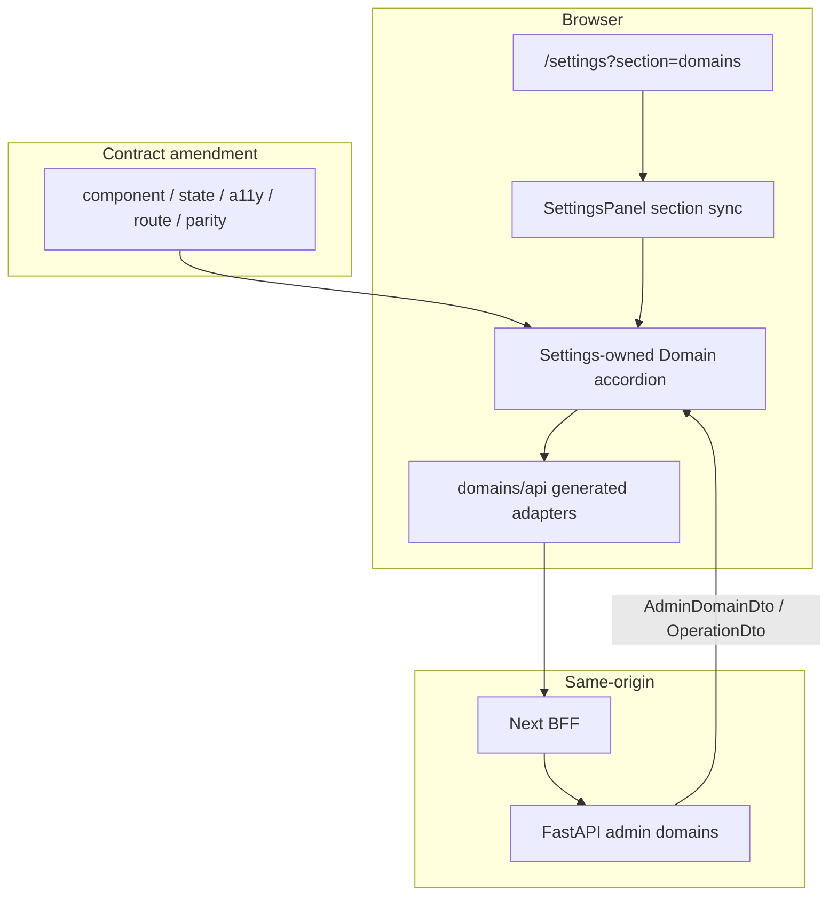
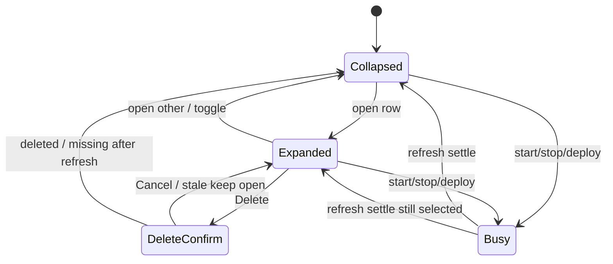

# Settings Domain Accordion and Domains Section - Plan

## Goal Capsule

- **Objective:** Complete master-build-plan slice P9-04: approve the Settings Domain accordion interaction amendment across behavior/component/state/accessibility contracts, then implement administrator `/settings?section=domains` against closed admin domain DTOs and lifecycle APIs — including remaining DRIFT-04 Phase 1 navigation/not-found residuals — with no Phase 2 operator or Phase 3 publication UI.
- **Authority:** Root `AGENTS.md`; FR-03 / FR-10 and administrator domain lifecycle in `docs/prd.md`; A-03, A-05, A-10 (and A-04 UI fence awareness) in `docs/interaction-behavior-prd.md`; `docs/contracts/http-api-catalog.md`, `docs/contracts/dto-schema-catalog.md`; `docs/frontend/{AGENTS,ui-parity-spec,component-contracts,interaction-state-catalog,accessibility-contract,route-and-workspace-spec,navigation-and-url-state,content-and-microcopy}.md`; `DESIGN.md`; DRIFT-04 / DRIFT-12 UI half in `docs/brownfield-refactor-register.md`; P3-01 closed domain admin envelopes; P9-01 factory ownership and accordion hard stop; Local Studio Knowledge Graphs / Controllers packs as grammar evidence only.
- **Execution profile:** One vertical brownfield slice — inventory → contract amendment → API client alignment → Settings-owned accordion + section URL → parity target + gate flip → not-found/nav residuals → evidence/tracker. Characterization-first on existing domains Settings tests that currently require `storageSummary`.
- **Readiness checkpoint:** Implementation-ready after 2026-07-27 scoping confirmation: no `storageSummary` DTO reopen; contract amendment and UI land together; DRIFT-04 nav residuals included; production-boundary Playwright F3 remains P12-07.
- **Stop conditions:** Stop if the slice requires reopening public `storageSummary` / browser-computed quota, exporting a shared Accordion primitive, inventing Phase 2 ops/logs/usage screens or Phase 3 wiki/publication UI, claiming P12-07 production-boundary F3/visual-matrix exit, or inventing public DTO fields absent from catalogs.
- **Tail ownership:** P9-05 owns broader import-direction CI; P12-07 owns production Next/BFF/FastAPI Playwright acceptance and full visual matrix for `/settings?section=domains`; P3-03 remains authoritative for lease/generation races at the service boundary.

---

## Product Contract

### Summary

P9-04 unblocks the fifth factory starter by amending the Settings Domain accordion interaction grammar into the normative frontend contracts, then shipping admin Knowledge Domains Settings against closed `AdminDomainDto` / `OperationDto` envelopes. Expand bodies show locked safe facts only — no storage bars. Section deep links, Domains vocabulary, one-open disclosure, deploy/lifecycle/delete reconciliation, and remaining Phase 1 not-found navigation residuals land in the same slice. Production-boundary live acceptance stays with P12-07.

Product Contract preservation: Product Contract authored in this bootstrap; no upstream brainstorm file. Scope confirmed 2026-07-27 (no storage DTO reopen; one vertical slice; include DRIFT-04 nav residuals).

### Problem Frame

P9-01 migrated starter primitives and left the Domain accordion at `BLOCKED_CONTRACT`. Live Settings already contains a Controllers-style domains section, but it still uses lifted shapes (`available`, `storageSummary`), expects `{domain}` on start/stop, omits `If-Match` on delete, labels the section “Knowledge Graphs,” and ignores `/settings?section=domains`. P3-01 already closed the admin DTO without storage. Structural tests forbid accordion parity artifacts until the interaction amendment lands. DRIFT-04’s graph no-request half closed in P9-03; Phase 1 safe not-found and Settings section URL residuals remain.

### Requirements

**Contract amendment (unblock accordion)**

- R1. Inventory Settings domains UI, domains API client, helpers/tests, parity forbid gates, section URL gaps, and DRIFT-04 not-found residuals with retain/modify/defer before behavior changes (`docs/_scratch/p9-04-*-inventory.md`).
- R2. Author/amend behavior/component/state/accessibility (and linked route/nav/microcopy/parity catalog) contracts so the Settings Domain accordion is an approved Settings-owned composition: one-open-at-a-time disclosure; collapsed header with display name, mono id, state `StatusPill`, and Start/Stop XOR via the existing contracted `ToggleSwitch` mapping (busy/disabled while in flight); expand body limited to the closed locked-fact allowlist from `AdminDomainDto` (`embeddingProfile.name`/`vectorDimensions` from nested DTO, `state`, `queryEligible`, `runtimeReady`, `controlGeneration`, `version` as safe labels — admin Settings only); Deploy = create then start with named create-succeeded/start-failed-keep outcome in interaction-state + microcopy; Delete via `UiModal` with `If-Match`, Cancel-first focus, and display-name typing only when closed DTO/precondition metadata supplies nonzero affected-count (otherwise confirm-only with downstream-effects copy); conflict/stale/revocation/refresh states; post-`202` disable conflicting controls until list refresh reconciles `state`/`allowedActions`; no shared Accordion export; no `storageSummary` / ProgressBar-on-expand product requirement. U1 Verification requires an amendment checklist covering those rows before U2 starts (approval = checklist-complete contracts landed in the slice PR — same altitude as other Phase 1 doc gates).
- R3. Catalog row for Settings Domain accordion leaves `BLOCKED_CONTRACT` to `IN_PROGRESS` when the U1 interaction amendment is landed; it reaches `FACTORY_READY` only after R11 parity trio and applicable Vitest/RTL matrix evidence exist (U4). Flip structural tests that currently forbid accordion parity artifacts in the same commit as the first parity files (U4), batched with any AGENTS/`BLOCKED_CONTRACT` string updates from U1.

**API client and server truth**

- R4. Replace lifted `features/domains/api.ts` admin shapes with generated `AdminDomainDto` / `OperationDto` adapters. Start/stop/delete accept `202 {operation}`; delete sends `If-Match` from `version`; map `428` / `409 stale_revision` / `operation_conflict` to safe notices + reload. Never reintroduce `available` or `storageSummary` on public client types.
- R5. UI treats `allowedActions` as advisory only. Every mutation is reauthorized by FastAPI; local busy/disable is presentation.

**Settings domains surface**

- R6. Wire URL sync for the live allowlisted section ids only: `general`, `provider`, `domains`, `users`. Admin section selection uses history `push`; invalid or newly unauthorized `section` uses `replace` to General with a nonintrusive notice. Derive effective section from role before first paint; members never mount Domains controls or call `listAdminDomains`. Parser/Account/Operations sections remain deferred (no new scaffolding).
- R7. Rename UI copy to Knowledge Domains / contracted microcopy (`No Knowledge Domains are available.`, load failures with request ID). Strip ProgressBar storage chrome and forbidden infra field tokens from Domains Settings source.
- R8. Implement Settings-owned one-open accordion composition (feature module under `src/features/settings-panel`, composing `@/components/ui` / `@/ui` primitives). Cite Controllers/environment-controls and LS Knowledge Graphs grammar; adapt without storage bars.
- R9. Prove reachable admin states: loading, empty, ready, stale/refresh failure, fatal failure, deploy validation, deploy create-fail, deploy start-fail-keep, start/stop busy, conflict/stale delete, deleting, role revocation/section fallback, history/reload of `?section=domains`. Map A-03 / A-05 / A-10 UI outcomes; do not claim PostgreSQL concurrency proof already owned by P3.

**DRIFT-04 residuals and factory exit altitude**

- R10. Close remaining DRIFT-04 Phase 1 navigation/not-found residuals: shell-safe not-found for unknown routes; keep Phase 1 nav registry free of Phase 2/3 surfaces; graph remains deliberate unavailable with zero product-data fetches (already proven).
- R11. Land Settings Domain accordion parity trio (manifest + static HTML + React) with synthetic locked-fact scenarios; HTML asserts tokens/geometry only; React owns expand/keyboard/ARIA/focus. Prefer focused Vitest/RTL + helper/node tests; do not claim P12-07 production-boundary F3 or full visual matrix as P9-04 exit.
- R12. Privacy: no runtime URLs, ports, container ids, storage paths, credentials, stack traces, or private IDs in Domains Settings UI, fixtures, snapshots, or error detail beyond safe messages/request IDs. Update inventory/evidence, DRIFT-04, catalog state, and master-build-plan only after verification.

### Acceptance Examples

- AE1. Contract amendment documents one-open Settings Domain accordion with locked-fact expand body and no storageSummary requirement; catalog moves to `IN_PROGRESS` after amendment and to `FACTORY_READY` only after R11/U4 parity evidence.
- AE2. Admin opens `/settings?section=domains`; section selects Knowledge Domains; member or invalid section falls back to General with notice.
- AE3. Expand shows embedding profile name/dims, state, eligibility/runtimeReady, and safe generation/version labels; no storage ProgressBar or `storageSummary` in source/DOM.
- AE4. Deploy creates stopped domain then starts (`202 {operation}`); on start failure the domain remains listed (`start_failed_keep`) and Start remains available after refresh (A-03 UI half).
- AE5. Delete confirm sends `If-Match`; stale revision keeps dialog useful with notice + reload; concurrent stop/delete surfaces conflict and refreshes to server truth (A-05 / A-10 UI half).
- AE6. Accordion parity target reaches `FACTORY_READY` at Vitest/RTL altitude; structural forbid gates no longer reject the accordion trio; `domains-settings` tests no longer require storageSummary.
- AE7. Unknown path renders shell-safe not-found; Phase 1 nav has no Logs/Usage/Wiki entries; graph unavailable remains no-request.
- AE8. Inventory + evidence land; P9-04 marked DONE only with honest residual that P12-07 owns production-boundary F3 / visual matrix.

### Scope Boundaries

#### In scope

- `docs/_scratch/p9-04-*-inventory.md` and post-proof evidence doc.
- Frontend contract amendments for accordion interaction (component, interaction-state, accessibility, route/nav, microcopy, parity catalog, AGENTS note).
- Domains API client alignment to generated closed DTOs / operation envelopes / If-Match.
- Settings section URL sync; Knowledge Domains labeling; Domains accordion rewrite without storage chrome.
- Parity trio + structural/factory test gate flips; domains Settings helper/UI tests rewrite.
- Shell-safe not-found and remaining DRIFT-04 Phase 1 nav residuals.
- Tracker/register/catalog updates after verification.

#### Deferred for later

- Production-boundary Playwright F3 / full visual-matrix (P12-07).
- Broader import-direction/CI validators (P9-05).
- Shared Accordion / StorageBar barrel exports (needs second consumer + contract change).
- Public `storageSummary` projection or ProgressBar-on-expand product requirement.
- Phase 2 operations history / cleanup deep view, Logs, Usage, Server status.
- Phase 3 wiki / publication UI.
- Account or Parser Settings sections beyond what already exists — do not scaffold new admin sections here.
- Re-proving P3 PostgreSQL lease/generation races in this slice.

#### Deferred to Follow-Up Work

- Migrating residual Domains Settings imports off `@/_shared/ui` / `@/components/ui` aliases beyond covered P9-01 primitives when that expands P9-05 scope — prefer kit for covered roles; do not expand the factory catalog here.
- Optional polling of active operation status beyond list refresh after `202`.

#### Outside this product's identity

- Browser access to runtime URLs, Docker/compose targets, object paths, or LightRAG.
- Multi-tenant Workspace entity.
- Generic dashboard chrome or Controllers “active controller” radio semantics.

### Key Flows

- F1. Admin deep-links `/settings?section=domains` → list loads → expand locked facts.
- F2. Deploy create→start → refresh; start_failed_keep keeps domain for Start retry.
- F3. Start/Stop XOR → `202 {operation}` → refresh to server state.
- F4. Expand → Delete modal → If-Match delete → deleting/refresh.
- F5. Conflict/stale/role revocation → notice + reconcile; unauthorized section → General.
- F6. Unknown route → shell-safe not-found (DRIFT-04 residual).

### Actors

- A1. Administrator — Domains Settings lifecycle and deploy controls.
- A2. Member — Settings General only; admin sections and domains controls unavailable.
- A3. Coding agent / reviewer — consumes amended contracts and factory catalog for the fifth starter.

---

## Planning Contract

### Key Technical Decisions

- KTD1. **One vertical slice.** Contract amendment, API alignment, UI rewrite, parity unblock, and DRIFT-04 residuals land together so forbid gates and storage-requiring tests cannot fight mid-slice. Governs R1–R12.
- KTD2. **No storageSummary reopen** (session-settled: user-directed — chosen over restoring a safe storage DTO projection: P3-01 already removed it; as-built parks storage-summary UI with Phase 2). Expand body uses locked `AdminDomainDto` facts only; strip ProgressBar storage chrome and rewrite tests that require it.
- KTD3. **Settings-owned composition, not shared Accordion.** Keep under `src/features/settings-panel`; compose barrel primitives; cite Controllers/environment-controls + LS Knowledge Graphs grammar without inventing `@/ui` Accordion/StorageBar exports. Governs R2, R8.
- KTD4. **Generated DTO adapters are the hard cut.** Mirror `features/documents/api.ts` If-Match / schema typing. Start/stop/delete return `OperationDto` envelopes; UI refreshes list after terminal/conflict. Governs R4–R5, AE4–AE5.
- KTD5. **URL section sync is presentation, not auth.** `useSearchParams` (or equivalent App Router pattern) synchronizes allowlisted `section`; role checks every render; FastAPI authorizes mutations. Governs R6, F5.
- KTD6. **Knowledge Domains vocabulary.** Replace “Knowledge Graphs” UI labels with contracted Domains microcopy. Governs R7.
- KTD7. **Acceptance altitude split.** P9-04 exits on contract amendment + Vitest/RTL/parity + focused node tests + honest evidence. P12-07 owns production Next/BFF/FastAPI Playwright F3 and full visual matrix. Governs R11–R12, AE8.
- KTD8. **DRIFT-04 residual package.** Include shell-safe not-found and Phase 1 nav hygiene with domains; do not reopen graph requests or add `/wiki`. Governs R10, AE7.

### High-Level Technical Design





Closed expand-body allowlist (administrator Settings only; never member/chat surfaces):

```text
lockedFacts(domain: AdminDomainDto) =
  embeddingProfile.name + vectorDimensions   // from nested DTO, not runtime profile lookup
  state (+ StatusPill)
  queryEligible / runtimeReady (safe labels)
  controlGeneration / version (safe labels only)
  // intentionally absent from required UI: storageSummary, ProgressBar, paths, ports, URLs,
  // createdAt/updatedAt, activeOperationId internals, allowedActions as primary authority
```

### Assumptions

- P3-01 admin list/detail/start/stop/delete envelopes and closed DTO projection remain the browser contract; no backend schema change is required for P9-04 exit.
- Parser / Account Settings sections named in the route spec beyond the live panel are out of this slice unless already present — do not scaffold them to “complete” the nav list.
- Optional operation-status polling beyond list refresh after `202` is unnecessary for exit if refresh reconciles `state` / `activeOperationId` / `allowedActions`.

### Sequencing

1. Inventory + contract amendment (U1) — catalog may move to `IN_PROGRESS`.
2. Align domains API client to closed envelopes, including member `queryEligible` call-site migration (U2).
3. Characterize/rewrite `domains-settings` tests, then section URL + Domains accordion rewrite stripping storage (U3).
4. Accordion parity trio + structural/factory gate flip in one commit with U1 catalog/AGENTS string updates (U4) — catalog `FACTORY_READY`.
5. Not-found / deferred-route residuals (U5).
6. Evidence + tracker closure with P12-07 residual named (U6).

### Sources & Research

- Local: P9-01 factory plan / evidence; P3-01 domains admin inventory/evidence; P9-03 DRIFT-04 residual notes; live `SettingsPanel` / `domainSettingsHelpers` / `features/domains/api.ts`; parity manifests for SettingsRow; closed DTO/HTTP catalogs.
- Reference (grammar only): `.references/ce-local-studio-docs/frontend/settings/knowledge-graphs/`, `.../shared/accordion-storage-kit.md`, Controllers environment-controls template.
- External research: skipped — local contracts and Controllers/KG packs are sufficient; storage-bar prior art is explicitly rejected by settled scope.

---

## Implementation Units

### U1. Inventory and accordion interaction contract amendment

**Goal:** Record brownfield disposition and approve the Settings Domain accordion interaction grammar across the normative frontend contracts so implementation is no longer `BLOCKED_CONTRACT`.

**Requirements:** R1, R2, R3, AE1

**Dependencies:** None

**Files:**
- Create: `docs/_scratch/p9-04-settings-domains-inventory.md`
- Modify: `docs/frontend/component-contracts.md`
- Modify: `docs/frontend/interaction-state-catalog.md`
- Modify: `docs/frontend/accessibility-contract.md`
- Modify: `docs/frontend/route-and-workspace-spec.md` (confirm Domains section URL rules; note implementation ownership)
- Modify: `docs/frontend/navigation-and-url-state.md` (as needed for `section` sync)
- Modify: `docs/frontend/content-and-microcopy.md` (Domains Settings labels if gaps)
- Modify: `docs/frontend/ui-parity-spec.md`
- Modify: `docs/frontend/AGENTS.md`

**Approach:** Inventory SettingsPanel domains UI, helpers, API client mismatches, forbid gates, deferred-route residuals, and DRIFT-04 leftovers with retain/modify/defer. Author/amend contracts with an explicit checklist: Settings-owned one-open accordion; component role + disclosure keyboard/ARIA matrix; interaction-state rows for R9 states including create-succeeded/start-failed-keep; locked-fact expand allowlist; Delete modal + If-Match (+ typing gate only if metadata exists); section URL push/replace + unauthorized fallback; Domains vocabulary; FACTORY_READY Vitest/RTL carve-out vs P12-07; explicit non-requirement of `storageSummary`/ProgressBar-on-expand; cite Controllers/KG packs as evidence only. Move catalog to `IN_PROGRESS` when checklist-complete amendment lands — `FACTORY_READY` waits on U4. Do not start U2 until the checklist is complete in the working tree.

**Patterns to follow:** P9-01 inventory style (`docs/_scratch/p9-01-ui-inventory.md`); P9-01 factory Product Contract R4/R7/R10 language (not this plan’s local R-IDs); LS Knowledge Graphs behavior.md minus storage.

**Test scenarios:**
- Happy path: amended docs name one-open accordion, locked-fact expand set, Domains section URL, and no storageSummary requirement.
- Edge: catalog no longer claims indefinite `BLOCKED_CONTRACT` without a path to readiness.
- Error: amendment forbids shared Accordion export and Phase 2/3 Settings sections.
- Integration: `frontend-uiux-factory` / AGENTS wording updated so later units can flip remaining string asserts coherently.

**Verification:** Inventory lists dispositions; a reviewer can implement the accordion from amended contracts without inventing storage fields or shared Accordion API.

---

### U2. Align domains API client to closed envelopes

**Goal:** Make browser domain admin calls match generated OpenAPI / P3-01 envelopes before UI rewrite.

**Requirements:** R4, R5, AE4, AE5

**Dependencies:** U1

**Files:**
- Modify: `app/client/src/features/domains/api.ts`
- Modify: `app/client/src/features/chat-shell/ChatShell.tsx` (member `available` → `queryEligible`)
- Modify: `app/client/src/features/documents/DocumentsPage.tsx` (same member projection)
- Modify: focused domains API adapter tests under `app/client/tests/` (node or Vitest per existing convention)
- Coordinate: `app/client/tests/domains-settings.test.mjs` storage/API asserts move with U3 characterization rewrite

**Approach:** Type admin list/create against `AdminDomainDto`; start/stop/delete against `OperationDto` / `202`; add `If-Match` helper for delete using `version`; remove `available` / `storageSummary` from exported public types. Migrate member list to generated `DomainSummaryDto` / `queryEligible` and update ChatShell + DocumentsPage selectors in the same unit so the shared module stays compilable.

**Execution note:** Start with failing adapter tests for start/stop `{operation}` and delete `If-Match` before rewriting the client.

**Patterns to follow:** `app/client/src/features/documents/api.ts` version/If-Match helpers; P3-01 evidence envelopes.

**Test scenarios:**
- Happy path: start/stop parse `{operation}` without requiring `{domain}`.
- Happy path: delete sends `If-Match` derived from `version`.
- Edge: missing version refuses to send delete (or maps to client precondition) rather than calling without header.
- Edge: member domains expose `queryEligible` (not `available`); ChatShell/Documents selectors disable ineligible domains correctly.
- Error: typed mapping surfaces `stale_revision` / `operation_conflict` codes for UI notices.
- Integration: create still returns `{domain}` per catalog; deploy helper can chain create→start.

**Verification:** Domains client compiles against generated OpenAPI; no public TypeScript type exposes `storageSummary` or `available`.

---

### U3. Settings section URL and Domains accordion rewrite

**Goal:** Ship `/settings?section=domains` with Knowledge Domains labeling and Settings-owned accordion against closed DTOs.

**Requirements:** R6, R7, R8, R9, AE2, AE3, AE4, AE5

**Dependencies:** U2

**Files:**
- Modify: `app/client/src/features/settings-panel/SettingsPanel.tsx`
- Modify: `app/client/src/features/settings-panel/domainSettingsHelpers.ts`
- Modify: `app/client/src/app/settings/page.tsx` (only if searchParams ownership belongs at page)
- Create (optional extract): `app/client/src/features/settings-panel/DomainAccordionRow.tsx` or equivalent Settings-owned module
- Modify: `app/client/tests/domains-settings.test.mjs`

**Approach:** Characterize and rewrite `domains-settings.test.mjs` first (drop storageSummary/ProgressBar/Knowledge Graphs asserts; add locked-fact and Domains copy asserts). Then synchronize allowlisted `section` ids with the URL (`push` on admin section change; `replace` on invalid/unauthorized canonicalize). Derive effective section from role before first paint; never mount DomainsSection or call `listAdminDomains` for members. Rewrite Domains section: one-open expand via `nextExpandedDomainId`; locked facts from nested `embeddingProfile` on `AdminDomainDto` (runtime profile list only for deploy picker); strip storage ProgressBar/testids; Domains microcopy; Deploy create→start with start-failed-keep; Start/Stop XOR via `ToggleSwitch` + state `StatusPill`; Delete modal with versioned delete; after `202` disable conflicting controls until refresh reconciles; collapse when selected domain disappears. Compose kit primitives; cite Controllers template in module comment/PR note.

**Execution note:** Characterization-first is a hard gate — do not delete storage helpers until `domains-settings.test.mjs` no longer requires them.

**Patterns to follow:** Existing SettingsPanel DomainsSection structure; `domainSettingsHelpers` pure functions; UiModal delete confirm; documents If-Match UX.

**Test scenarios:**
- Happy path: `?section=domains` selects Domains for admin; expand shows locked facts only.
- Happy path: Deploy create→start refreshes list; Start visible after start_failed_keep.
- Edge: member/`?section=domains` → General + notice; no admin list fetch flash of controls.
- Edge: expanding B collapses A; storage helpers/tokens absent from Domains UI source.
- Error: stale delete keeps modal useful with notice + reload path; conflict triggers refresh.
- Error: load failure shows contracted Domains error copy + request ID disclosure.
- Integration: forbidden field token scan still passes for Domains Settings sources.

**Verification:** Manual or component proof that deep link, expand, deploy, lifecycle, and delete reconcile against mocked closed DTOs; no storageSummary in Domains UI source.

---

### U4. Accordion parity target and structural gate flip

**Goal:** Land the fifth factory parity trio and mark Settings Domain accordion `FACTORY_READY` at Vitest/RTL altitude.

**Requirements:** R3, R11, AE6

**Dependencies:** U1, U3

**Files:**
- Create: `app/client/tests/parity/manifests/domains-accordion.json` (or agreed targetId)
- Create: `app/client/tests/parity/fixtures/domains-accordion.html`
- Create: `app/client/tests/parity/react/domains-accordion.test.tsx`
- Modify: `app/client/tests/structure/ui-ownership.test.ts`
- Modify: `app/client/tests/parity/react/button.test.tsx` (remove accordion-absence asserts)
- Modify: `app/client/tests/frontend-uiux-factory.test.mjs`
- Modify: `docs/frontend/ui-parity-spec.md` (catalog state → `FACTORY_READY` after evidence)

**Approach:** Mirror SettingsRow parity schema. Synthetic labels only; collapsed + expanded locked-fact variants; dark/light + narrow/desktop geometry in HTML static; React owns `aria-expanded`, one-open behavior, keyboard/touch on chevron, focus return from delete modal, reduced-motion where claimed. Flip ownership/factory tests from “accordion must be absent / BLOCKED” to “accordion owned under settings-panel / FACTORY_READY”. Do not add Playwright F3 here.

**Patterns to follow:** `settings-row` manifest/fixture/react trio; P9-01 KTD9 modality split (HTML static vs React behavior).

**Test scenarios:**
- Happy path: manifest/fixture/react share labels/variants/tokens for collapsed and expanded locked-fact states.
- Happy path: React proves one-open disclosure and chevron `aria-expanded` / controls wiring.
- Edge: HTML fixture contains no focus/ARIA/keyboard claims; synthetic data only.
- Error: ownership test fails if a second physical Accordion kit appears under `src/ui` or competing trees.
- Integration: factory test accepts `FACTORY_READY` for the fifth target after trio exists.

**Verification:** Focused parity/ownership/factory tests green; catalog marks Settings Domain accordion `FACTORY_READY` without claiming P12-07 route matrix.

---

### U5. DRIFT-04 navigation and safe not-found residuals

**Goal:** Close remaining Phase 1 navigation/not-found residuals assigned to P9-04.

**Requirements:** R10, AE7

**Dependencies:** U3

**Files:**
- Create: `app/client/src/app/not-found.tsx` (or shell-owned equivalent permitted by route contract)
- Modify: `app/client/src/features/navigation-sidebar/constants.ts` (only if deferred entries remain)
- Modify: related nav/not-found tests under `app/client/tests/`
- Modify: `docs/brownfield-refactor-register.md` (DRIFT-04 disposition)

**Approach:** From U1 inventory, complete a deferred-route manifest (app route tree + nav constants + known deep links). Add shell-safe not-found aligned with `forbidden/page.tsx` (AppShell for authenticated unknown routes; anonymous follows route-contract login/shell rules; no existence leak; safe return to `/chat`; zero product-data fetches). Prove deferred Phase 2/3 routes are absent or return safe unavailable — not merely missing from sidebar labels. Reconfirm graph unavailable no-request remains green. Settings section URL proof belongs primarily to U3.

**Patterns to follow:** Existing `forbidden` page; route-and-workspace not-found rules; P9-03 graph unavailable tests.

**Test scenarios:**
- Happy path: unknown path renders safe not-found inside authenticated shell expectations without product-data fetches.
- Edge: not-found copy exposes no private identifiers or stack traces.
- Error: deferred Phase 2/3 routes remain absent from nav constants and app route tree.
- Integration: graph unavailable test still asserts zero product-data network calls.

**Verification:** DRIFT-04 can move to DONE (or honest residual only if a named non-P9-04 item remains) with graph + not-found + Settings section evidence cited.

---

### U6. Evidence record and tracker closure

**Goal:** Publish P9-04 completion evidence without overclaiming P12-07.

**Requirements:** R12, AE8

**Dependencies:** U1–U5

**Files:**
- Create: `docs/_scratch/p9-04-settings-domains-evidence.md`
- Modify: `docs/master-build-plan.md` (P9-04 status + closure note)
- Modify: `docs/brownfield-refactor-register.md` (DRIFT-04 / related rows)
- Modify: `docs/frontend/ui-parity-spec.md` (final catalog state if not already in U4)

**Approach:** Record commands, contracts amended, API/UI/parity/not-found proofs, and explicit residuals (P12-07 F3/visual matrix; P9-05 CI breadth). Mark P9-04 DONE only when U1–U5 verification holds.

**Test scenarios:**
- Happy path: evidence lists green focused suites and catalog `FACTORY_READY`.
- Error: evidence explicitly states production-boundary F3 is not claimed.
- Integration: master-build-plan P9 row reflects P9-04 DONE with P9-05 still open.

**Verification:** A reviewer can audit DONE from evidence paths alone without assuming Playwright F3 ran.

---

## Verification Contract

- Inventory + amended frontend contracts reviewable before treating accordion as unblocked.
- Focused domains API adapter tests for `{operation}` / If-Match / member `queryEligible`.
- Rewritten `domains-settings` helper/UI tests without storageSummary requirements; forbidden-token scan still green on settings-panel sources and parity fixtures.
- Component/Vitest coverage for section URL fallback (including zero admin DOM/network for members), one-open expand, deploy/start_failed_keep, delete If-Match conflict path, role/section fallback.
- Parity trio + ownership/factory gate flips green in one commit; catalog `FACTORY_READY` at Vitest/RTL carve-out (not route Playwright matrix).
- Not-found + deferred-route residual tests; graph no-request remains green.
- Typecheck/lint for touched frontend packages.
- Prefer one same-origin BFF→FastAPI smoke for admin list or one mutation when the local stack is available; if unavailable, evidence must name mock/component altitude honestly and keep P12-07 as production-boundary residual — do not imply operable ingress proof.
- Do not require full `npm test` green if unrelated suites fail — record the focused command set in evidence (P9-01 caveat).
- Do not require P12-07 production Playwright F3 / full visual matrix for P9-04 DONE.

## Definition of Done

- Product Contract R1–R12 and AE1–AE8 satisfied at the stated altitude.
- Backend authority, closed DTO boundary, and privacy classifications intact; no storageSummary reopen.
- Accordion interaction contracts approved; Settings-owned implementation matches them; parity fifth target `FACTORY_READY`.
- `/settings?section=domains` works for administrators; unauthorized/invalid sections fall back safely.
- DRIFT-04 residuals closed or honestly named; P9-04 tracker DONE with P12-07 residual explicit.
- Abandoned experimental chrome (storage bars, Knowledge Graphs labels, lifted `{domain}` envelopes) removed from the Domains Settings path.
- Evidence artifact identifies revision/commands tested.

---

## Risks & Dependencies

| Risk | Mitigation |
| --- | --- |
| Tests/docs still require storageSummary while UI strips it | Characterize and rewrite tests in the same slice as helper/UI deletion (KTD1/KTD2) |
| Structural forbid gates block parity files | Flip ownership/factory asserts in U4 with the first accordion trio |
| Start/stop client/`{domain}` mismatch hides behind UI | U2 adapter tests before U3 rewrite (KTD4) |
| Claiming F3 via intercepted E2E | Explicit P12-07 residual; no mocked production acceptance (KTD7) |
| Scope creep into Parser/Account/ops history | Deferred boundaries; Domains + not-found only |

**Upstream dependencies:** P2–P3 domain admin APIs (DONE), P8 BFF/session (DONE), P9-01 factory starters (DONE), P9-03 graph no-request half (DONE).

**Downstream:** Unblocks honest Settings domains product use and P12-07 F3 targeting; P9-05 may tighten import CI afterward.
