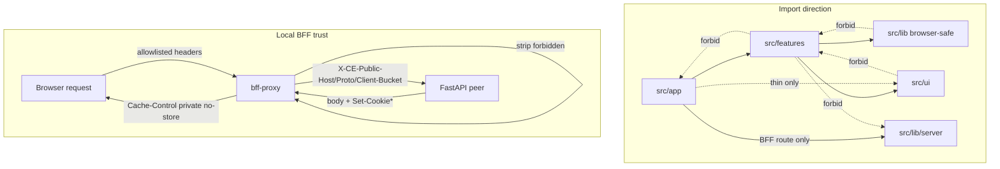

# P9-05 Frontend CI Validators and Local BFF Trust - Plan

## Goal Capsule

- **Objective:** Complete master-build-plan slice P9-05: land CI validators for import-direction, thin routes, server/browser boundary, and generated-contract/barrel hygiene; align local BFF trust + personalized `Cache-Control` with `docs/architecture/frontend-security-boundary.md` so DRIFT-05/19 local halves can close — without FE-01 mega-kit demolition or deployed-ingress / two-user cache E2E.
- **Authority:** Root `AGENTS.md`; `docs/frontend/AGENTS.md`; `docs/frontend/source-adaptation-map.md` (structural gates + quality-script intent); `docs/frontend/component-contracts.md`; `docs/architecture/frontend-security-boundary.md`; `docs/architecture/production-adaptation-blueprint.md`; DRIFT-05 / DRIFT-19 in `docs/brownfield-refactor-register.md`; P9-01 ownership evidence in `docs/_scratch/p9-01-ui-ownership-evidence.md`; factory plan KTDs in `docs/plans/2026-07-22-003-feat-ce-frontend-factory-plan.md`; FastAPI peer header contract in `app/context_engine/services/request_security.py`.
- **Execution profile:** Inventory-first brownfield; extend existing `node:test` structure + `bff-proxy` suites (no eslint/dep-cruiser); same-slice BFF header/allowlist alignment so trust validators pass against live code.
- **Readiness checkpoint:** Implementation-ready after 2026-07-27 scoping confirmation: local BFF trust + cache validators in-scope; residual mega-kit aliases remain allowlisted (`defer-FE-01`); Playwright / deployed ingress stay P10/P12.
- **Stop conditions:** Stop if DONE pressure expands into FE-01 wholesale kit deletion, Playwright two-user/BFCache matrix, inventing a second gate stack (eslint/dep-cruiser), inventing client-bucket product fields beyond opaque ingress classification, or claiming Compose/`PUBLIC_ORIGIN` production topology green without an explicit P10 co-change.
- **Tail ownership:** P10 owns Compose/public-origin wiring and deployed topology; P12 owns two-user / logout / BFCache / direct-API denial ingress proofs; FE-01 owns residual mega-kit demolition; browser CSRF bootstrap residual stays named, not claimed closed here.

---

## Product Contract

### Summary

P9-05 locks the thin Next.js architecture after P9-01..P9-04 feature work: automated structure gates prove layering and route shells; local BFF emits contracted `X-CE-*` headers, strips forbidden caller values, forwards idempotency/client-request ids, preserves multi-`Set-Cookie`, and forces personalized `private, no-store`; generated OpenAPI/SSE homes and barrel allowlists stay honest. Residual `@/_shared/ui` importers remain on the existing monotonic allowlist. Deployed-ingress negatives and identity-partitioned browser-cache E2E stay with P10/P12.

Product Contract preservation: Product Contract authored in this bootstrap; no upstream brainstorm file. Scope confirmed 2026-07-27 (include local BFF trust + cache validators; FE-01 deferred).

### Problem Frame

P9-01 installed `ui-ownership` and a design-kit barrel allowlist but deferred broader import CI to P9-05. Feature slices P9-02..P9-04 each closed with that residual. Live BFF still injects `X-Forwarded-Host/Proto` instead of contracted `X-CE-Public-Host` / `X-CE-Public-Proto` / `X-CE-Client-Bucket`, omits `Idempotency-Key` and `X-Client-Request-Id`, and collapses multi-`Set-Cookie` — so FastAPI peer trust fails closed when security policy is enabled. DRIFT-05/19 still assign the local BFF/cache half here. Without this slice, Phase P9 cannot exit and agents can reintroduce reverse imports, thick routes, browser server leaks, or handwritten public DTO forks.

### Actors

| Actor | Role |
| --- | --- |
| Coding agent / developer | Primary consumer; must fail CI when layering/BFF/barrel rules break |
| Reviewer | Confirms DRIFT local-half language and residuals stay honest |
| CI (`scripts/verify.sh`) | Runs structure + frontend tests on every verify |

### Key Flows

**F1 — Structure gate on edit.** Developer changes `app/client/src` → focused `node:test` structure pack fails on reverse imports, browser→`lib/server`, `.references` imports, thick `page.tsx`, or handwritten public DTO substitutes outside generated homes.

**F2 — BFF trust unit path.** Change to `bff-proxy` → `bff-proxy.test.mjs` asserts fixed upstream, strip/emit contract headers, cache overwrite, abort, Range/`If-Range`, multi-`Set-Cookie`.

**F3 — Slice closure.** Inventory + evidence land; master-build-plan P9-05 DONE and Phase P9 exit; DRIFT-05/19 mark local half done with deployed residual owners explicit.

### Requirements

**Inventory and ownership**

- R1. Inventory every layer offender, thick route, BFF header gap, env locality gap, handwritten DTO fork, and residual mega-kit importer with disposition `migrate` / `allowlist-shrink` / `defer-FE-01` / `P10` / `P12` in `docs/_scratch/p9-05-ci-validators-inventory.md`.
- R2. Reuse `SHARED_UI_IMPORT_ALLOWLIST` (and ui-ownership alias rules) as characterization + going-forward ban; do not demolish residual mega-kit sole homes (`defer-FE-01`).

**Import direction**

- R3. Enforce `app → features → lib|ui` (plus explicitly classified peers). Forbid reverse edges (`lib`/`ui` → `features`/`app`; `features` → `app`). Allow `features/* → features/*`.
- R4. Ban runtime imports of `.references/**` and ban browser modules importing `@/lib/server/**` (or `src/lib/server/**` via relative resolution).
- R5. Relocate orphan `src/state/auth-store` under `features/auth` (or equivalent feature home); forbid new top-level `src/state/**` going forward. Classify residual `components/` / `_shared/` only via the existing design-kit allowlist.

**Thin routes**

- R6. Every `src/app/**/page.tsx` (and `not-found.tsx`) is a thin shell: compose `@/features/*`, `@/ui`, and allowlisted legacy aliases only — no local form/store orchestration in the route file.
- R7. Migrate `/login` orchestration into a feature module in this slice. Allowlist only non-page app chrome that cannot be a page shell (`providers.tsx`, root `layout.tsx`) with a shrink-only exception list.

**Server/browser + local BFF trust**

- R8. `CONTEXT_ENGINE_*` (and public-origin selection) appear only in server files: `src/middleware.ts`, `src/lib/server/**`, and `src/app/api/**/route.ts`. Browser modules never select upstream.
- R9. Align `bff-proxy` with `frontend-security-boundary.md` request path: strip caller identity/role/auth/forwarding/`X-CE-*`/upstream headers; emit server-derived `X-CE-Public-Host`, `X-CE-Public-Proto`, and opaque `X-CE-Client-Bucket`; forward allowlisted browser headers including `Idempotency-Key` and `X-Client-Request-Id`; never accept browser-selected upstream.
- R10. Force personalized responses through BFF to `Cache-Control: private, no-store` (retain `no-transform` if already present). Preserve multiple `Set-Cookie` values. Keep existing abort + Range/`If-Range` proofs green.
- R11. Client-bucket is opaque ingress classification (1–128 chars) derived server-side; unit tests may inject a fixed bucket. Raw addresses never appear in the header value. Hardened ingress classification remains P10.

**Generated contract / barrel**

- R12. Generated TS lives only under `src/lib/api/generated/`. Public browser DTO shapes are generated aliases (`components["schemas"][...]`) or thin `type` wrappers — not parallel handwritten public substitutes (close `types/auth.ts` forks against OpenAPI).
- R13. Root `scripts/check-generated-contracts.sh` remains the freshness authority; this slice owns import/edit hygiene + barrel allowlist continuity with design-kit.

**Tracker / privacy of claims**

- R14. Evidence under `docs/_scratch/p9-05-*-evidence.md` cites focused commands (structure + bff-proxy + design-kit + typecheck). Do not require unrelated composite `npm test` green; record composite status honestly.
- R15. Mark master-build-plan P9-05 DONE and Phase P9 complete only after verification. Update DRIFT-05/19 to **local half DONE**; deployed topology / two-user / BFCache remain P10/P12. Fix contradictory Phase P9 summary row language (P9-04 already DONE).
- R16. Browser CSRF bootstrap absence and Compose `CONTEXT_ENGINE_PUBLIC_ORIGIN` wiring remain explicit residuals — not claimed closed by this slice.

### Acceptance Examples

- AE1. Inventory freezes offenders, BFF gaps, DTO forks, allowlist reuse, and P10/P12/FE-01 residuals.
- AE2. Reverse import or browser→`lib/server` addition fails the structure pack; cross-feature import still passes.
- AE3. Thick logic added to a product `page.tsx` fails thin-route gate; `/login` is thin after migrate.
- AE4. BFF unit tests prove `X-CE-*` emit, forbidden strip, Idempotency/Client-Request-Id forward, cache overwrite, multi-`Set-Cookie`, abort, Range/`If-Range` (M-01 / C-05 local half).
- AE5. Handwritten public `CurrentUser` substitute outside generated aliases fails barrel/DTO gate; feature `api.ts` schema aliases still pass.
- AE6. Evidence + tracker updates close P9-05 / Phase P9 without claiming P12 cache E2E or FE-01 demolition.

### Scope Boundaries

#### In scope

- `docs/_scratch/p9-05-ci-validators-inventory.md` and evidence doc.
- New/extended `app/client/tests/structure/*` validators + shared allowlist helpers if needed.
- `bff-proxy.ts` / `bff-proxy.test.mjs` contract alignment (headers, allowlist, Set-Cookie, cache).
- Login thin migrate + `auth-store` relocate + generated auth DTO cleanup.
- design-kit allowlist continuity (no FE-01 demolition).
- DRIFT-05/19 local-half wording + master-build-plan Phase P9 closure.

#### Out of scope / deferred

- FE-01 residual mega-kit deletion.
- Deployed-ingress negatives, direct FastAPI denial, two-user / logout / BFCache browser proofs (P10/P12).
- New eslint / dependency-cruiser / knip stack.
- Shared Accordion/StorageBar barrel exports.
- Browser CSRF bootstrap product fix (named residual).
- Compose production-origin topology green as a P9-05 acceptance claim (P10; optional one-line env co-change only if required to keep local unit tests honest — not Compose smoke).

#### Deferred to Follow-Up Work

- Optional `test:structure` npm script convenience.
- Middleware UX redirect rewrite beyond current `/health` rewrite (clarify DRIFT-05 residual text; not a P9-05 DONE blocker once BFF local half lands).

---

## Planning Contract

### Assumptions

- Confirmed scope includes local BFF trust + personalized cache validators; residual mega-kit aliases stay allowlisted.
- No Local Studio quality scripts are present under `.references/` to port — invent CE-native walkers from existing structure/design-kit patterns.
- Client-bucket derivation for local unit/dev is an opaque hashed classification available to the BFF process; production ingress hardening is P10.
- Composite `npm test` may still fail for unrelated suites; P9-05 DONE uses the focused command set.

### Key Technical Decisions

- KTD1. **Extend `node:test` structure + `bff-proxy` — do not add eslint/dep-cruiser.** Mirrors P9-01 KTD6 and the live verify path (`tests/structure/**/*.test.ts` already in `npm test`). Governs R3–R8, R12–R14.
- KTD2. **Same-slice BFF contract alignment.** Validators assert `frontend-security-boundary.md` / FastAPI `X-CE-*` headers, not today’s `x-forwarded-*` characterization. Update `bff-proxy.ts` and tests together. `(session-settled: user-approved — chosen over structure-only CI that freezes DRIFT-05: confirmed in P9-05 scoping)`
- KTD3. **Residual mega-kit allowlist reused, FE-01 deferred.** Share/keep `SHARED_UI_IMPORT_ALLOWLIST` + ui-ownership alias rules; monotonic shrink only. `(session-settled: user-approved — chosen over full FE-01 demolition: confirmed in P9-05 scoping)`
- KTD4. **Migrate login + relocate `state/`; allowlist only providers/layout chrome.** Thin-route gate is real, not a permanent login exception. Governs R6–R7, R5.
- KTD5. **DRIFT-19 local half = BFF cache overwrite + response header strip proofs only.** Two-user / BFCache / identity-partitioned browser cache stay P12; update P1-04 residual language that over-assigned browser cache isolation solely to P9-05. Governs R10, R15.
- KTD6. **Cross-feature imports allowed; reverse layers forbidden.** Parse `@/` and relative imports with POSIX-normalized paths; Windows drive-letter root helper matches `ui-ownership.test.ts`.
- KTD7. **Generated freshness stays root script; slice owns import/DTO hygiene.** Do not re-implement byte-compare; fail handwritten public DTO substitutes and misplaced generated homes.

### High-Level Technical Design



### Sequencing

1. Inventory (U1) before failing gates.
2. BFF alignment (U2) before trust structure assertions that would redline on live headers.
3. Structure gates (U3) with allowlists matching inventory.
4. Login/`state`/DTO cleanup (U4) so thin-route and barrel gates pass.
5. Evidence + tracker (U5).

### Risks

| Risk | Mitigation |
| --- | --- |
| BFF `X-CE-*` breaks security-enabled local stacks mid-slice | Land proxy + unit tests together; keep policy-disabled test bypass behavior intact on FastAPI side |
| False positives from residual aliases / relative imports | Reuse design-kit allowlist; resolve relatives to `src/` POSIX paths |
| Client-bucket semantics underspecified | Opaque 1–128 char value; hash only; document P10 hardening residual |
| Compose missing `PUBLIC_ORIGIN` | Do not claim Compose smoke; name P10 residual |
| Stale P9-01 “stream-protocol fails composite” note | Re-check during U5; drop or replace with current composite blocker |

### System-Wide Impact

- **BFF / FastAPI peer path:** Header alignment unblocks security-enabled stacks that currently fail closed on missing `X-CE-*`. Login throttle continues to key on opaque client bucket — raw addresses must never appear in the header or logs.
- **Cookie/session UX:** Multi-`Set-Cookie` preservation affects login+CSRF rotation; collapsing cookies breaks authenticated unsafe methods even when JSON bodies look fine.
- **Feature import graph:** Auth-store relocate touches shell, nav, documents, settings, login, providers — typecheck is the integration gate; do not leave dual `@/state` and feature paths.
- **CI / verify:** New structure files ride the existing `tests/structure/**/*.test.ts` glob into `npm test` and `scripts/verify.sh`; no workflow YAML change required unless Windows glob flake reappears (then pin an explicit file list like P9-01 evidence).
- **DRIFT language:** Local-half closure must not imply middleware wholesale rewrite or C-03 two-user cache — those remain P10/P12 so later slices do not skip required proofs.
- **Agent surface:** No new agent tools; structure gates are the primary anti-drift control for coding agents inventing reverse imports or thick routes.

---

## Implementation Units

### U1. Inventory CI validator and BFF trust gaps

**Goal:** Freeze offenders and dispositions before changing gates or BFF behavior.

**Requirements:** R1, R2, AE1

**Dependencies:** None

**Files:**
- Create: `docs/_scratch/p9-05-ci-validators-inventory.md`
- Modify (read-only cites): `app/client/tests/structure/ui-ownership.test.ts`, `app/client/tests/design-kit-contract.test.mjs`, `app/client/tests/bff-proxy.test.mjs`, `app/client/src/lib/server/bff-proxy.ts`, `app/client/src/app/**/page.tsx`, `app/client/src/state/**`, `app/client/src/types/auth.ts`, `docs/brownfield-refactor-register.md`, `docs/_scratch/p9-01-ui-ownership-evidence.md`

**Approach:** Walk `src/` for layer edges, thick routes, env/`CONTEXT_ENGINE` localities, BFF header gaps vs security boundary, handwritten DTO forks, and mega-kit importers. Disposition each row. Record shared allowlist constants to reuse.

**Patterns to follow:** `docs/_scratch/p9-01-ui-inventory.md`, `docs/_scratch/p9-04-settings-domains-inventory.md`

**Test scenarios:**
- Happy path: Inventory lists every product `page.tsx`, BFF header delta table, and `SHARED_UI_IMPORT_ALLOWLIST` reuse note.
- Edge: Login/`providers`/`state`/`types/auth` called out with migrate dispositions.
- Error: Explicit P10/P12/FE-01/CSRF residuals named so DONE cannot silently absorb them.

**Verification:** Inventory exists with disposition columns and stop-condition residuals before U2 code changes.

---

### U2. Align local BFF to contracted trust headers and cache policy

**Goal:** Make the BFF implement the approved peer trust + personalized cache contract so local validators and FastAPI policy can agree.

**Requirements:** R9, R10, R11, AE4

**Dependencies:** U1

**Files:**
- Modify: `app/client/src/lib/server/bff-proxy.ts`
- Modify: `app/client/tests/bff-proxy.test.mjs`
- Test: `app/client/tests/bff-proxy.test.mjs`

**Approach:** Expand request allowlist (`Idempotency-Key`, `X-Client-Request-Id`); strip caller `X-CE-*` / forwarding / identity; emit server-derived `X-CE-Public-Host` / `X-CE-Public-Proto` / opaque `X-CE-Client-Bucket`; stop asserting `x-forwarded-*` as the trust channel; preserve multi-`Set-Cookie` via `getSetCookie()` or equivalent; keep forced `Cache-Control: private, no-store` (+ `no-transform` if retained); keep abort/Range/`If-Range` green.

**Execution note:** Start from failing/updated BFF unit expectations that match `frontend-security-boundary.md`, then implement.

**Patterns to follow:** `docs/architecture/frontend-security-boundary.md` request path steps 2–6; FastAPI `CLIENT_BUCKET_HEADER` length bounds; existing `bff-proxy.test.mjs` fetch-injection style.

**Test scenarios:**
- Happy path: Covers AE4 — configured upstream only; emit `X-CE-*`; forward Idempotency + Client-Request-Id; Origin rewritten to public origin.
- Edge: Caller-supplied `X-CE-Public-Host` / `X-Forwarded-*` / `Authorization` / `X-User-*` stripped; bucket length within 1–128; fixed test bucket injectable.
- Error: Production config without public origin still fails closed; invalid path segments rejected.
- Integration: Multi-`Set-Cookie` login+CSRF style upstream response preserves both cookies; document content still forces private no-store and forwards Range/`206`.

**Verification:** `node --experimental-strip-types --test tests/bff-proxy.test.mjs` green; no remaining production assert that trust uses `x-forwarded-host/proto`.

---

### U3. Structure validators for import-direction, thin routes, server/env boundary, generated homes

**Goal:** Automate the architectural invariants in CI via `tests/structure/`.

**Requirements:** R3–R8, R12–R13, AE2, AE3, AE5

**Dependencies:** U1, U2 (for any structure asserts that pin BFF source strings)

**Files:**
- Create: `app/client/tests/structure/import-direction.test.ts`
- Create: `app/client/tests/structure/thin-routes.test.ts`
- Create: `app/client/tests/structure/server-browser-boundary.test.ts`
- Create: `app/client/tests/structure/generated-contract-homes.test.ts`
- Modify (optional share): `app/client/tests/design-kit-contract.test.mjs`, `app/client/tests/structure/ui-ownership.test.ts`
- Test: the new structure files above

**Approach:** Reuse walk + Windows path normalization from `ui-ownership`. Resolve `@/` and relative imports. Encode layer matrix + allowlists from inventory. Thin-route rule scans `page.tsx`/`not-found.tsx` for forbidden hooks/stores/orchestration imports. Server/env scan limits `CONTEXT_ENGINE_` to allowlisted server files and forbids browser→server imports. Generated-homes scan locks generated path + rejects parallel public DTO interfaces outside allowlisted thin aliases.

**Patterns to follow:** `app/client/tests/structure/ui-ownership.test.ts`, `app/client/tests/design-kit-contract.test.mjs`, `app/client/tests/foundation.test.mjs` allowlist style

**Test scenarios:**
- Happy path: Current post-U4 tree passes; cross-feature import allowed.
- Edge: Relative import that climbs into `features` from `lib` fails; `.references` import fails; allowlisted `_shared` importer still passes.
- Error: Synthetic fixture or inline negative cases (commented fixture files under `tests/structure/fixtures/` if needed) demonstrate each forbid rule.
- Integration: `npm test` structure glob picks up new files without a new package script (optional `test:structure` is follow-up).

**Verification:** Focused structure pack green after U4 migrations land; design-kit allowlist still exact-match.

---

### U4. Thin login migrate, auth-store relocate, generated auth DTO cleanup

**Goal:** Remove known offenders so thin-route and contract-home gates pass without permanent product-route exceptions.

**Requirements:** R5–R7, R12, AE3, AE5

**Dependencies:** U1, U3 (gates may land red then turn green in this unit — prefer gate assertions authored against target shape)

**Files:**
- Create: `app/client/src/features/auth/` (login surface + relocated store as needed)
- Modify: `app/client/src/app/login/page.tsx`
- Modify: `app/client/src/app/providers.tsx` (import paths)
- Modify: consumers of `src/state/auth-store` (shell, nav, documents, settings, etc.)
- Delete or empty: `app/client/src/state/` after relocate
- Modify: `app/client/src/types/auth.ts` (generated aliases only)
- Test: structure suites from U3; any existing auth/login node tests touched by imports

**Approach:** Extract login UI/orchestration into `features/auth`; leave `page.tsx` as a one-line compose. Relocate auth store under the feature. Replace handwritten public user shapes with generated `CurrentUserDto` (and envelope aliases). Keep providers/layout as allowlisted app chrome if they remain non-page shells.

**Patterns to follow:** Thin `chat/page.tsx` / `settings/page.tsx`; feature `api.ts` `components["schemas"]` adapters from domains/documents

**Test scenarios:**
- Happy path: `/login` page file imports only feature/ui/allowlisted aliases; structure thin-route passes.
- Edge: All previous `@/state/auth-store` importers resolve; no new `src/state/**` files.
- Error: Reintroducing a parallel `export interface CurrentUser` public substitute fails generated-homes gate.
- Integration: Existing settings/documents/nav tests that touch auth store still typecheck.

**Verification:** Structure pack + `npm run typecheck` green for auth move; no product page remains thick except documented non-page chrome allowlist.

---

### U5. Evidence record and Phase P9 / DRIFT closure

**Goal:** Prove the slice and close trackers without overclaiming P10/P12/FE-01.

**Requirements:** R14–R16, AE6

**Dependencies:** U2, U3, U4

**Files:**
- Create: `docs/_scratch/p9-05-ci-validators-evidence.md`
- Modify: `docs/master-build-plan.md`
- Modify: `docs/brownfield-refactor-register.md`
- Modify (if needed): `docs/_scratch/p1-04-health-readiness-evidence.md` residual wording, `docs/frontend/ui-parity-spec.md` structure pointer list

**Approach:** Record focused commands, case IDs (M-01/C-05 local half), residuals table, and Phase P9 exit. Mark DRIFT-05/19 local halves done with deployed residual owners. Fix Phase P9 summary row that still implies P9-04 blocked.

**Patterns to follow:** `docs/_scratch/p9-01-ui-ownership-evidence.md`, `docs/_scratch/p9-04-settings-domains-evidence.md`

**Test scenarios:**
- Happy path: Evidence lists green focused command set and artifact revision.
- Edge: Residual table names FE-01, P10 Compose/public-origin, P12 two-user/BFCache, CSRF bootstrap.
- Integration: master-build-plan shows P9-05 DONE and Phase P9 complete; DRIFT rows do not claim deployed negatives closed.

**Verification:** Tracker/evidence consistent; no claim of Playwright cache matrix or FE-01 demolition.

---

## Verification Contract

Focused acceptance (P9-05 DONE):

```text
cd app/client
node --experimental-strip-types --test `
  tests/bff-proxy.test.mjs `
  tests/design-kit-contract.test.mjs `
  tests/structure/**/*.test.ts
npm run typecheck
```

Root freshness remains `scripts/check-generated-contracts.sh` (via `scripts/verify.sh`) — do not re-own it in the slice.

Do not require full composite `npm test` green if unrelated suites fail; record status in evidence.

Interaction cases for local BFF half: M-01, C-05 (strip/emit/cache). Do not claim C-03 two-user cache.

---

## Definition of Done

1. Inventory + evidence artifacts exist under `docs/_scratch/p9-05-*`.
2. BFF emits contracted `X-CE-*`, forwards Idempotency/Client-Request-Id, preserves multi-`Set-Cookie`, forces private no-store; unit suite green.
3. Structure validators cover import-direction, thin routes, server/browser env boundary, and generated-contract homes; design-kit allowlist still exact.
4. Login is thin; `src/state/` relocated; public auth DTOs are generated aliases.
5. master-build-plan P9-05 DONE and Phase P9 complete; DRIFT-05/19 local halves updated with honest P10/P12 residuals.
6. FE-01 demolition, Playwright two-user/BFCache, and CSRF bootstrap are not claimed closed.

---

## Risks & Dependencies

**Upstream:** P9-01 DONE (structure/design-kit patterns). P9-02..P9-04 feature work already landed; this slice must not reopen their product scope.

**Downstream:** Unblocks Phase P9 exit and honest P10 Compose/BFF topology work; P12 still owns deployed cache/isolation E2E.

**Dependency:** FastAPI already requires `X-CE-*` when policy enabled — BFF alignment is compatibility repair, not a new product contract.

---

## Sources & Research

- Local patterns: `app/client/tests/structure/ui-ownership.test.ts`, `design-kit-contract.test.mjs`, `bff-proxy.test.mjs`, `foundation.test.mjs`, `scripts/verify.sh`
- Authority: `docs/architecture/frontend-security-boundary.md`, `docs/frontend/source-adaptation-map.md`, `docs/master-build-plan.md` P9-05, DRIFT-05/19
- Evidence lineage: `docs/_scratch/p9-01-ui-ownership-evidence.md`, P9-02..P9-04 residual tables, `.references/context-engine-legacy-bridge/current-review.md` BFF findings
- External research: skipped — strong local structure/BFF patterns; no vendored Local Studio quality scripts present to port
