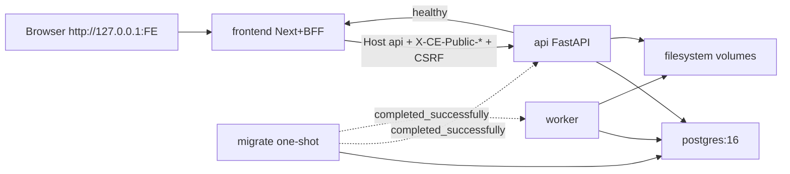

# P10-01 Compose Production-Like Server Configuration - Plan

## Goal Capsule

- **Objective:** Complete master-build-plan slice P10-01 by hardening the existing five-unit Compose stack (PostgreSQL, one-shot migrate, API, worker, frontend) into an ingress-wired, production-like server configuration — dual public-origin alignment, trusted BFF peers, CSRF signing, cookie security, and migrations present in the backend image — without claiming P10-02 smoke or P12 TLS/ingress release evidence.
- **Authority:** Root `AGENTS.md`; `docs/master-build-plan.md` P10-01; `docs/architecture/deployment-topology.md`; `docs/architecture/frontend-security-boundary.md`; `docs/architecture/security-operations-and-quality.md`; DRIFT-08 / DRIFT-05 residual in `docs/brownfield-refactor-register.md`; P1-05 ingress proofs; P9-05 BFF trust half + Compose `PUBLIC_ORIGIN` residual; live stack at `app/compose.stack.yml` / `app/.env.stack.example`.
- **Execution profile:** Inventory-first brownfield harden of existing Compose/Docker/env; config and image correctness over runtime smoke; deterministic contract tests for Dockerfile/compose/env wiring.
- **Readiness checkpoint:** Implementation-ready after 2026-07-27 scoping confirmation and ingress-posture decision (option 1: ingress-wired HTTP stack).
- **Stop conditions:** Stop if DONE pressure pulls in BFF/API/SSE smoke (P10-02), admin bootstrap job ownership beyond documenting residual, object-store readiness (DRIFT-15), worker SIGTERM drain (P10-03 / DRIFT-31), TLS/local HTTPS terminator, S3-compatible Compose service, Kubernetes, Redis/Celery, or claiming P12 deployed-ingress / direct-API denial evidence from loopback Compose.
- **Tail ownership:** P10-02 owns migration/bootstrap smoke + BFF/API/SSE core-path stack proof and storage readiness composition; P10-03 owns startup/shutdown/worker-claim recovery runbooks; P12 owns TLS ingress, HA, and production release evidence.

---

## Product Contract

### Summary

P10-01 makes the runnable Compose stack config-correct for a fail-closed trust path on loopback HTTP: one-shot migrate can find Alembic scripts in the image; API/worker/frontend receive aligned ingress settings; BFF production mode has a public origin; empty-settings testing bypass remains a documented secondary shortcut. Smoke that the trust path works end-to-end stays with P10-02.

Product Contract preservation: Product Contract authored in this bootstrap from master-build-plan P10-01; no upstream brainstorm file. Scope confirmed 2026-07-27; ingress posture settled to ingress-wired HTTP (not true `testing=false`/HTTPS).

### Problem Frame

P0-01 canonicalized Compose paths and proved `compose config --quiet`, but left runnable startup and explicit migrations to later work. The current stack still defaults to ingress bypass (`CONTEXT_ENGINE_TESTING=true` with empty `CE_*`), omits frontend `CONTEXT_ENGINE_PUBLIC_ORIGIN` while the image sets `NODE_ENV=production` (BFF fail-closed), and the backend Dockerfile does not copy `migrations/` so the one-shot migrate service cannot succeed. P9-05 closed local BFF header trust and explicitly residualized Compose public-origin topology to P10. Without this slice, DRIFT-08 cannot advance and later smoke/E2E cannot honestly exercise peer/Origin/CSRF on Compose.

### Actors

| Actor | Role |
| --- | --- |
| Operator / developer | Starts Compose with `.env.stack.local`; needs a documented primary profile that boots and a secondary bypass |
| Coding agent | Verifies compose/env/Dockerfile contracts without claiming smoke |
| Reviewer | Confirms residuals (smoke, TLS, storage readiness) stay honest |

### Key Flows

**F1 — Primary ingress-wired stack config.** Operator copies example env, fills secrets and the four `CE_*` plus matching BFF public origin for the chosen frontend port, brings stack up; migrate completes; API/worker/frontend start with policy enabled over HTTP.

**F2 — Secondary testing bypass.** Operator leaves `CE_*` empty with `CONTEXT_ENGINE_TESTING=true`; stack still starts for host-native/dev convenience; docs state this is not ingress-green evidence.

**F3 — Agent contract gate.** Focused tests / verify compose-config prove migrations are in the image, example+compose wire primary posture fields, and frontend requires public origin in production mode.

### Requirements

**Inventory and ownership**

- R1. Inventory Compose services, Dockerfiles, env example/local, migrate/image gaps, dual-origin naming, peer/cookie posture, and residuals with disposition in `docs/_scratch/p10-01-compose-config-inventory.md`.
- R2. Record evidence in `docs/_scratch/p10-01-compose-config-evidence.md`; update `docs/master-build-plan.md` P10-01 and DRIFT-08 with an honest half-close (smoke remains P10-02).

**Image and migrate**

- R3. Backend image includes Alembic `migrations/` so Compose `migrate` (`alembic upgrade head`) can complete; API/worker continue to depend on `service_completed_successfully` and never migrate on boot.
- R4. Keep one-shot migrate as a separate Compose service (`restart: "no"`); do not move migrations into API/worker lifespan.

**Ingress-wired production-like profile**

- R5. Primary Compose posture documents and examples `CONTEXT_ENGINE_TESTING=true` with all four required settings set: `CE_PUBLIC_ORIGIN`, `CE_INTERNAL_HOSTS`, `CE_TRUSTED_BFF_PEERS`, `CE_CSRF_SIGNING_KEY` — so request-security policy is enabled while HTTP origins remain legal.
- R6. `CE_PUBLIC_ORIGIN` and frontend `CONTEXT_ENGINE_PUBLIC_ORIGIN` are byte-identical (scheme/host/port), using `http://127.0.0.1:<STACK_FRONTEND_PORT>` for the primary loopback profile; document that browsers must use `127.0.0.1` not `localhost` for Origin match.
- R7. `CE_INTERNAL_HOSTS` includes the Compose API hostname used by BFF (`api`).
- R8. `CE_TRUSTED_BFF_PEERS` covers frontend→API source addresses on the Compose network (CIDR or fixed project subnet), not host loopback alone.
- R9. `CE_SESSION_COOKIE_SECURE=false` for the HTTP primary profile; CSRF signing key ≥32 bytes and distinct from `CONFIG_ENCRYPTION_KEY`.
- R10. Partial `CE_*` sets remain fail-closed at policy build; document full-four or empty-only.
- R11. Secondary empty-`CE_*` + testing bypass remains documented and available; it must not be presented as the green production-like path or as P12 evidence.

**Frontend / BFF**

- R12. Compose frontend service supplies runtime `CONTEXT_ENGINE_PUBLIC_ORIGIN` (and keeps `CONTEXT_ENGINE_API_BASE=http://api:8000`); production BFF must not start trust path without public origin.
- R13. Filesystem object-adapter volumes and local LightRAG/controller kinds remain; no S3 service and no live LightRAG overlay required for this slice.

**Verification boundary**

- R14. Prove config/image/wiring with deterministic tests and `compose config` (and image build if needed for migrate COPY). Do not claim login/CSRF/SSE smoke, admin bootstrap job, or object-store readiness as P10-01 DONE.

### Acceptance Examples

- AE1. With primary example values filled, `docker compose … config` succeeds and rendered frontend env includes `CONTEXT_ENGINE_PUBLIC_ORIGIN` identical to `CE_PUBLIC_ORIGIN`.
- AE2. Backend image build context / Dockerfile includes `migrations/`; a contract test fails if COPY (or equivalent) is removed.
- AE3. Existing BFF production fail-closed without public origin remains green; Compose wires the value so the failure mode is configuration absence, not missing compose field.
- AE4. Evidence names P10-02 for smoke/bootstrap/storage readiness and P12 for TLS/direct-API denial; DRIFT-08 does not claim full smoke closure.

### Scope Boundaries

**In scope**

- `app/compose.stack.yml`, `app/.env.stack.example`, backend/frontend Dockerfiles, related verify placeholders, inventory/evidence, focused contract tests, tracker/DRIFT half-updates.

**Deferred for later**

- P10-02: explicit bootstrap + BFF/API/SSE core-path smoke; object-store readiness (DRIFT-15).
- P10-03: startup/shutdown, worker claim recovery, operator runbook (DRIFT-31).
- P12: TLS ingress, deployed denial, HA, release evidence.

**Outside this product's identity**

- Multi-tenant Workspace entity; Redis/RQ/Celery; Kubernetes chosen for convenience; browser-selectable runtime URLs; Phase 2/3 surfaces.

### Deferred to Follow-Up Work

- Optional `compose.stack.live.yml` LightRAG overlay (referenced in comments, absent today) — only if a later slice needs native fidelity; not P10-01.
- Auto-deriving public origin from `STACK_FRONTEND_PORT` in Compose — nice-to-have; primary plan may document manual sync or a single shared env var pattern if implementable without new product contracts.

---

## Planning Contract

### Assumptions

- P8 and P9 prerequisites are closed enough for P10-01 (P9-05 DONE; Compose residual explicit).
- Docker Compose userland networking places frontend→API traffic on a private bridge address space coverable by a documented CIDR (e.g. `172.16.0.0/12`) or a pinned user-defined subnet chosen at implementation.
- Root `scripts/verify.sh` Compose check can be extended with placeholder ingress env values without becoming a runtime smoke gate.

### Key Technical Decisions

- KTD1. **Ingress-wired HTTP primary profile** `(session-settled: user-directed — chosen over true testing=false + HTTPS terminator: TLS ingress is P12; testing=true with full CE_* still enables peer/Origin/CSRF while allowing http).` Governs R5–R11.
- KTD2. **Dual public-origin names stay; values must match.** FastAPI `CE_PUBLIC_ORIGIN` and BFF `CONTEXT_ENGINE_PUBLIC_ORIGIN` remain distinct env keys per existing contracts; Compose example forces identical literals including port. Governs R6, R12.
- KTD3. **Copy Alembic migrations into the backend image.** Minimal Dockerfile fix so one-shot migrate works; do not run migrations from API boot. Governs R3–R4.
- KTD4. **Trusted peers = Compose network CIDR, not 127.0.0.1.** BFF source IP is the frontend container address. Prefer a documented broad private CIDR or pinned compose network subnet; prove in inventory notes. Governs R8.
- KTD5. **Filesystem volumes retained.** Development matrix object adapter; storage readiness remains P10-02. Governs R13.
- KTD6. **DRIFT-08 half-close only.** P10-01 closes image/compose/config + explicit migrations wiring; API/worker/web smoke stays open on DRIFT-08 until P10-02. Governs R2, R14.
- KTD7. **No new orchestration stack.** Extend existing `compose.stack.yml` / env example; do not invent Redis, K8s, or a second compose product topology. Governs stop conditions.
- KTD8. **One compose file; primary via example+tests, bypass via empty optional CE_*.** Keep `${CE_*:‑}` optional interpolation so secondary bypass still starts; make `.env.stack.example` and contract tests define the green ingress-wired path. Do not add a second product compose topology solely for bypass. Governs R5, R11, U3.

### High-Level Technical Design



Dual-origin alignment (directional):

```text
CE_PUBLIC_ORIGIN == CONTEXT_ENGINE_PUBLIC_ORIGIN == http://127.0.0.1:${STACK_FRONTEND_PORT}
CE_INTERNAL_HOSTS includes api
CE_TRUSTED_BFF_PEERS covers frontend container CIDR
CONTEXT_ENGINE_API_BASE = http://api:8000   # Compose DNS only
```

### System-Wide Impact

- Operators must regenerate `.env.stack.local` from the updated example (hard-cut already documented for former `.env.p10.local`).
- E2E README consumers gain a required public-origin pair when using the primary profile; bypass profile still works for older local files until they opt in.
- Verify placeholders gain ingress dummy values so `compose config` stays green.
- Does not change public HTTP/DTO/SSE contracts.

### Risks and Dependencies

| Risk | Mitigation |
| --- | --- |
| Peer CIDR too narrow → silent 403 on all BFF calls | Document and test example CIDR; inventory records chosen subnet strategy |
| Port override desyncs dual origins → CSRF failures | Example uses one shared value pattern; docs call out STACK_FRONTEND_PORT coupling; smoke deferred but config tests check rendered equality |
| Frontend `/login` healthy while BFF broken | Do not treat frontend healthcheck as trust proof; residual to P10-02 |
| Claiming DRIFT-08 fully DONE without smoke | Explicit half-close language in evidence |
| HTTPS temptation / testing=false | KTD1 forbids TLS terminator in this slice |

### Open Questions

- None blocking. Deferred: whether Compose should auto-bind `CONTEXT_ENGINE_PUBLIC_ORIGIN` from `STACK_FRONTEND_PORT` via a single shared variable (implementation convenience only).

---

## Implementation Units

### U1. Inventory Compose gaps and dispositions

**Goal:** Freeze the brownfield disposition for stack services, env, Dockerfiles, dual-origin, peers, and residuals before edits.

**Requirements:** R1

**Dependencies:** None

**Files:**
- Create: `docs/_scratch/p10-01-compose-config-inventory.md`

**Approach:** Table every service/env/Dockerfile concern with `retain` / `modify` / `add` / `defer-P10-02` / `defer-P10-03` / `defer-P12`. Call out missing `migrations/` COPY, missing frontend public origin, testing bypass default, and peer CIDR strategy options. Cite KTD1–KTD6.

**Patterns to follow:** `docs/_scratch/p9-05-ci-validators-inventory.md`, `docs/_scratch/p0-01-layout-inventory.md`

**Test scenarios:**
- Test expectation: none -- inventory-only artifact.

**Verification:** Inventory lists migrate image gap, dual-origin gap, and explicit deferrals for smoke/TLS/storage/drain.

---

### U2. Backend image migrations and Compose migrate readiness

**Goal:** Make the one-shot migrate service able to run Alembic from the built image.

**Requirements:** R3, R4

**Dependencies:** U1

**Files:**
- Modify: `app/Dockerfile`
- Modify (if needed for ignore rules): `app/.dockerignore`
- Test: `app/tests/test_compose_stack_config.py` (new) or extend `app/tests/test_phase_one_production_scope.py`

**Approach:** `COPY migrations ./migrations` (path aligned with `alembic.ini` `script_location`). Keep migrate command and `depends_on: service_completed_successfully`. Add a deterministic test that Dockerfile text (or built-context contract) includes migrations. Do not start a live migrate as P10-01 acceptance.

**Execution note:** Prefer a failing contract test for missing migrations COPY before editing the Dockerfile.

**Patterns to follow:** Existing `app/Dockerfile` uv sync layout; P1-04 “API never migrates on boot” invariant.

**Test scenarios:**
- Happy path: Dockerfile copies `migrations/` into the image workdir used by Alembic.
- Edge case: `.dockerignore` does not exclude `migrations/`.
- Error path: N/A for runtime migrate failure — deferred to P10-02 smoke.
- Integration: Compose `migrate` service still invokes `alembic upgrade head` with `restart: "no"`.

**Verification:** Contract test green; compose migrate service definition unchanged in role.

---

### U3. Ingress-wired stack env and Compose API/worker profile

**Goal:** Make the documented primary profile supply full CE_* ingress settings for API/worker with HTTP loopback origins and Compose-network peers.

**Requirements:** R5–R11, R13

**Dependencies:** U1

**Files:**
- Modify: `app/compose.stack.yml`
- Modify: `app/.env.stack.example`
- Modify: `scripts/verify.sh` (placeholder env for compose config)
- Test: `app/tests/test_compose_stack_config.py`

**Approach:** Per KTD8, keep optional CE_* interpolation on the single compose file so empty bypass still boots. Rewrite `.env.stack.example` so the uncommented primary path fills all four `CE_*`, `CE_INTERNAL_HOSTS=api`, peer CIDR covering Compose bridge, `CE_SESSION_COOKIE_SECURE=false`, CSRF key guidance, and `CONTEXT_ENGINE_TESTING=true`. Comment block documents secondary empty bypass as non-evidence. Keep filesystem volumes and local controller/LightRAG kinds. Extend verify.sh placeholders with ingress dummies so `compose config` stays green when CI has no local secrets file.

**Patterns to follow:** `app/.env.stack.example` commentary style; `build_request_security_policy` rules in `app/context_engine/services/request_security.py`.

**Test scenarios:**
- Happy path: rendered compose config (or example contract) exposes CE_* keys on api/worker and documents matching public origin.
- Edge case: example states full-four or empty-only; partial sets called out as fail-closed.
- Edge case: `CE_SESSION_COOKIE_SECURE=false` present for HTTP profile.
- Error path: N/A for live 403 peer misses — document residual; smoke in P10-02.

**Verification:** Example + compose encode KTD1/KTD4/KTD5; verify compose-config check still passes with placeholders.

---

### U4. Frontend BFF public-origin wiring

**Goal:** Supply runtime `CONTEXT_ENGINE_PUBLIC_ORIGIN` to the Compose frontend so production BFF can resolve proxy config.

**Requirements:** R6, R12

**Dependencies:** U3

**Files:**
- Modify: `app/compose.stack.yml` (frontend environment)
- Modify: `app/client/Dockerfile` only if runtime env must be declared/defaulted without breaking non-Compose runs
- Modify: `app/.env.stack.example`
- Modify: `app/client/tests/e2e/README.md` (operator note for primary profile)
- Test: `app/client/tests/bff-proxy.test.mjs` (retain/extend); `app/tests/test_compose_stack_config.py`

**Approach:** Pass `CONTEXT_ENGINE_PUBLIC_ORIGIN` from env into frontend service equal to `CE_PUBLIC_ORIGIN`. Keep `CONTEXT_ENGINE_API_BASE=http://api:8000`. Document port-coupling with `STACK_FRONTEND_PORT` and `127.0.0.1` vs `localhost`. Do not weaken BFF production fail-closed when origin unset.

**Patterns to follow:** `resolveBffProxyConfig` in `app/client/src/lib/server/bff-proxy.ts`; P9-05 BFF tests.

**Test scenarios:**
- Happy path: Compose frontend environment includes `CONTEXT_ENGINE_PUBLIC_ORIGIN`; contract asserts equality with `CE_PUBLIC_ORIGIN` in rendered config or example pairing.
- Edge case: existing unit — production env without public origin throws / BFF unavailable.
- Edge case: docs mention port override must update both origins.
- Integration: N/A live BFF→API CSRF — P10-02.

**Verification:** Compose wiring present; BFF unit fail-closed retained.

---

### U5. Evidence, trackers, and residual honesty

**Goal:** Close the documentation/tracker half of P10-01 without over-claiming smoke.

**Requirements:** R2, R14

**Dependencies:** U2, U3, U4

**Files:**
- Create: `docs/_scratch/p10-01-compose-config-evidence.md`
- Modify: `docs/master-build-plan.md` (P10-01 status + short closure note)
- Modify: `docs/brownfield-refactor-register.md` (DRIFT-08 / DRIFT-05 residual language)

**Approach:** Evidence lists commands/results for contract tests, compose config, and image build proving migrations COPY. Explicit residual table: smoke/bootstrap/storage → P10-02; drain → P10-03; TLS/denial → P12. DRIFT-08 marks migrations/config/image progress but keeps smoke open.

**Patterns to follow:** `docs/_scratch/p9-05-ci-validators-evidence.md`

**Test scenarios:**
- Test expectation: none -- documentation/tracker unit; completeness checked by Definition of Done.

**Verification:** P10-01 marked DONE only with residuals named; DRIFT-08 not falsely fully DONE.

---

## Verification Contract

- Inventory + evidence pair under `docs/_scratch/p10-01-compose-config-*.md`.
- Focused backend contract tests for Dockerfile migrations + compose/env primary wiring.
- Existing `app/client/tests/bff-proxy.test.mjs` production public-origin fail-closed remains green.
- `docker compose -f app/compose.stack.yml config` (via verify placeholders) remains green.
- Backend image build succeeds with migrations present (evidence command).
- Do **not** require live login/SSE smoke or Playwright for P10-01 exit.
- Interaction cases: config/topology supporting FR-11 / C-05 trust boundary readiness; no new M-* product behavior.

## Definition of Done

- R1–R14 satisfied; KTD1–KTD8 honored.
- U1–U5 complete with listed verifications.
- Master-build-plan P10-01 DONE with P10-02/P10-03/P12 residuals explicit.
- DRIFT-08 updated with migrations/config/image closure and smoke still open for P10-02.
- No TLS, S3 Compose service, smoke suite, or drain runbook invented in this slice.
- Privacy: example env keeps secrets as placeholders; no committed `.env.stack.local` secrets.

## Sources & Research

- `docs/master-build-plan.md` P10-01..P10-03
- `docs/architecture/deployment-topology.md`, `frontend-security-boundary.md`
- `app/compose.stack.yml`, `app/.env.stack.example`, `app/Dockerfile`, `app/client/Dockerfile`
- `app/context_engine/services/request_security.py`, `app/client/src/lib/server/bff-proxy.ts`
- `docs/_scratch/p0-01-layout-inventory.md`, `p1-05-ingress-session-evidence.md`, `p9-05-ci-validators-evidence.md`
- `docs/brownfield-refactor-register.md` DRIFT-08 / DRIFT-05 / DRIFT-15 / DRIFT-31
- External research: skipped — strong local Compose/ingress patterns and authority docs were sufficient.
- Institutional `docs/solutions/`: absent
)
