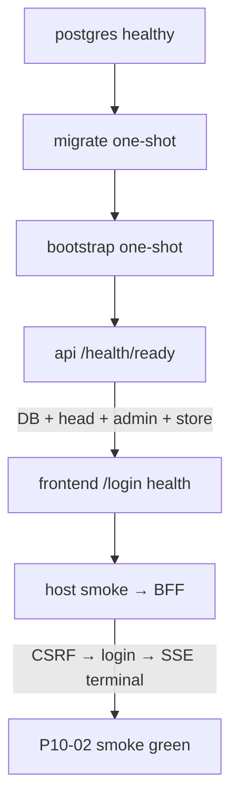

# P10-02 Stack Smoke Bootstrap and Core Path - Plan

## Goal Capsule

- **Objective:** Complete master-build-plan slice P10-02 by making the P10-01 Compose stack bootstrappable and smokeable: one-shot migrate to Alembic head, explicit insert-only admin bootstrap as a Compose job before API healthy, filesystem object-store composition into `GET /health/ready`, and a same-origin BFF scripted core-path smoke (CSRF → login → one sealed SSE turn).
- **Authority:** Root `AGENTS.md`; `docs/master-build-plan.md` P10-02; `docs/architecture/deployment-topology.md`; `docs/architecture/security-operations-and-quality.md` (Docker core vertical path); `docs/architecture/frontend-security-boundary.md`; DRIFT-08 / DRIFT-15 in `docs/brownfield-refactor-register.md`; P10-01 evidence residuals; P1-02 bootstrap; P1-04/P8-03 readiness; P7-04 sealed SSE; P9-05 BFF trust + browser CSRF residual.
- **Execution profile:** Inventory-first brownfield; Compose job + readiness composition + scripted stack smoke; deterministic contract tests plus live Compose smoke evidence; smoke-first verification for the core path.
- **Readiness checkpoint:** Implementation-ready after 2026-07-27 scoping confirmation (sealed SSE turn; Compose bootstrap job; filesystem store in ready).
- **Stop conditions:** Stop if DONE pressure pulls in worker SIGTERM drain (P10-03 / DRIFT-31), TLS/`testing=false` HTTPS, direct-API public denial as P12 release evidence, S3-compatible Compose service, live LightRAG overlay, browser CSRF product fix as a P10-02 exit gate, Redis/Celery/Kubernetes, or claiming production object-store readiness from the filesystem matrix.
- **Tail ownership:** P10-03 owns startup/shutdown/worker-claim recovery runbooks; P12 owns TLS ingress, HA, and deployed-ingress denial/stream-drain; browser CSRF bootstrap product fix remains a named residual unless closed elsewhere.

---

## Product Contract

### Summary

P10-02 closes the chicken-and-egg that leaves a fresh Compose volume unable to become API-healthy, composes governed object-store capability into readiness for the development filesystem matrix, and proves one ingress-wired BFF vertical path through login/CSRF and a sealed SSE turn. Frontend `/login` health alone is not trust proof. Empty-`CE_*` bypass may still boot but is not evidence.

Product Contract preservation: Product Contract authored in this bootstrap from master-build-plan P10-02 and P10-01 residuals; no upstream brainstorm file. Scope confirmed 2026-07-27.

### Problem Frame

P10-01 wired migrations into the image, pinned the Compose peer network, and aligned dual public origins, but deferred live migrate/bootstrap smoke, object-store readiness (DRIFT-15), and BFF/API/SSE core-path proof. Today `api` healthchecks `/health/ready`, which requires an enabled administrator, while no Compose bootstrap job exists and API lifespan must not seed admins. `check_readiness` still omits object-store. No stack smoke script exists (`.env.stack.example` references an absent live smoke helper). Without this slice, DRIFT-08 cannot leave smoke open honestly and DRIFT-15 stays incomplete.

### Actors

| Actor | Role |
| --- | --- |
| Operator / developer | Starts Compose with `.env.stack.local`; needs migrate + bootstrap + ready + frontend, then can run the smoke script |
| Coding agent | Implements Compose/readiness/smoke and records evidence without overclaiming P12 |
| Reviewer | Confirms residuals (drain, TLS, browser CSRF, production store) stay honest |

### Key Flows

**F1 — Fresh stack boot.** Postgres healthy → one-shot migrate → one-shot bootstrap → API ready (DB + exact head + enabled admin + filesystem store) → frontend up.

**F2 — Idempotent re-boot.** Re-run migrate at head and bootstrap (insert-only no-op) → ready stays green.

**F3 — BFF core-path smoke.** Host script against `CE_STACK_PUBLIC_ORIGIN`: CSRF → login → create conversation → `turns:stream` with a non-domain-seeking message → ≥1 SSE event → terminal completed or safe failed (including provider failure without live LLM).

**F4 — Trust negatives.** Host call to published API port is untrusted peer; Origin `localhost` vs `127.0.0.1` mismatch fails CSRF; frontend `/login` 200 does not alone close smoke.

### Requirements

**Inventory and ownership**

- R1. Inventory migrate/bootstrap/ready/store/smoke gaps and dispositions in `docs/_scratch/p10-02-stack-smoke-inventory.md`.
- R2. Record evidence in `docs/_scratch/p10-02-stack-smoke-evidence.md`; update `docs/master-build-plan.md` P10-02 and DRIFT-08 / DRIFT-15 with honest closure language and residuals.

**Migrate and bootstrap**

- R3. Prove one-shot Compose `migrate` (`alembic upgrade head`) completes on a fresh volume; API/worker never migrate on boot.
- R4. Add a Compose one-shot `bootstrap` service running `python -m context_engine.bootstrap_admin` with `restart: "no"`, after migrate `service_completed_successfully`, before API healthy.
- R5. Bootstrap remains insert-only and restart-idempotent; never runs in API lifespan.
- R6. Require `CE_ADMIN_USERNAME` / `CE_ADMIN_PASSWORD` only on the Compose bootstrap service (not long-lived api/worker env); missing credentials fail the bootstrap job closed.

**Object-store readiness**

- R7. Compose filesystem object-store capability into `GET /health/ready` by probing the same store composition product code uses: `object_store_from_root(CE_SOURCE_STORAGE_ROOT)` (i.e. `<root>/objects`) with temp put+delete — not a bare parent-volume exists/writable check.
- R8. Unwritable store / put-delete failure yields the same public safe `503` shape as other readiness failures; internal reason stays private (e.g. `object_store_unavailable`). Do not treat “missing root” after adapter `mkdir` as a distinct required negative.
- R9. `/health/live` remains process-only and must stay `200` when ready fails for store/admin/schema.
- R10. Evidence frames this as Compose/development matrix readiness, not production S3/object-store release proof; DRIFT-15 worker-readiness half stays open.

**BFF/API/SSE smoke**

- R11. Provide a scripted same-origin BFF smoke against the ingress-wired primary profile (not empty-`CE_*` bypass).
- R12. Smoke path: CSRF bootstrap → login (capture rotated session CSRF) → conversation create → sealed `turns:stream` with a fixed non-domain-seeking prompt → ≥1 stream event → terminal `turn.completed` **or** `turn.failed` with a contracted provider-unavailable / no-credentials failure class only; reject other failure classes. Bound the stream wait with a wall-clock/idle timeout.
- R13. Smoke must use the frontend BFF origin (`127.0.0.1` + `CE_STACK_PUBLIC_ORIGIN`), not the published API port; send `Origin: CE_STACK_PUBLIC_ORIGIN` on every unsafe BFF POST.
- R14. Do not claim browser UI login/CSRF product fix; scripted cookie jar + double-submit owns the smoke client. Name the P9-05 browser CSRF residual.
- R15. Worker drain / SIGTERM stop-claim is out of scope; testing-mode inline turn completion is acceptable for smoke. Provider-failure-terminal smoke does not prove a completed synthesis stream or worker-leased turn path (residual named in evidence).

**Verification boundary**

- R16. Extend Compose config contract tests for bootstrap wiring; add focused readiness/store unit + PostgreSQL proofs; record live Compose smoke commands/results in evidence. Do not make root `scripts/verify.sh` a mandatory live Docker smoke gate.

### Acceptance Examples

- AE1. Fresh Compose volume: migrate completes, bootstrap completes, `/health/ready` returns `{status:ready}`, frontend starts.
- AE2. Re-run migrate + bootstrap on the same volume succeeds without rewriting the existing admin password hash.
- AE3. With the composed filesystem store made unwritable (or put/delete failing), `/health/live` is `200` and `/health/ready` is safe correlated `503` with no diagnostic payload.
- AE4. Smoke script via BFF completes CSRF→login→SSE (≥1 event + allowed terminal) on the ingress-wired profile with `CONTEXT_ENGINE_TESTING=true`.
- AE5. Evidence half-closes DRIFT-08 for migrate/bootstrap + BFF/API/SSE scripted smoke (worker-path smoke remains open for P10-03); half-closes DRIFT-15 for Compose/filesystem API readiness (worker readiness + production store remain open); names P12 TLS/direct-API denial and browser CSRF residual; does not claim completed-synthesis or worker-leased turn proof when the green bar used provider-failure terminal.
- AE6. Trust negatives: host login/stream against the published API port is not smoke-green (403 peer or script refusal); Origin `localhost` vs configured `127.0.0.1` fails CSRF closed.

### Scope Boundaries

**In scope**

- Compose bootstrap job and depends_on ordering; readiness store composition for filesystem adapter; scripted BFF core-path smoke; contract/unit/PG tests; inventory/evidence; tracker/DRIFT updates.

**Deferred for later**

- P10-03: startup/shutdown, worker claim recovery, operator drain runbook (DRIFT-31).
- P12: TLS ingress, deployed denial, HA, unbuffered stream-drain release evidence.
- Browser CSRF bootstrap product fix (P9-05 residual) unless a later slice owns it.
- Optional `compose.stack.live.yml` LightRAG overlay / S3-compatible Compose service.

**Outside this product's identity**

- Multi-tenant Workspace entity; Redis/RQ/Celery; Kubernetes chosen for convenience; browser-selectable runtime URLs; Phase 2/3 surfaces; production filesystem object-store.

### Deferred to Follow-Up Work

- Tightening readiness from “any enabled administrator” to configured-username match (existing residual wording drift).
- Auto-deriving dual public origin solely from `STACK_FRONTEND_PORT` beyond the shared `CE_STACK_PUBLIC_ORIGIN` pattern already landed in P10-01.

---

## Planning Contract

### Assumptions

- P10-01 DONE on the branch under test (migrations COPY, pinned `172.30.55.0/24` peers, shared `CE_STACK_PUBLIC_ORIGIN`).
- Ingress-wired primary profile remains `CONTEXT_ENGINE_TESTING=true` + full `CE_*` (HTTP cookies legal; not P12 evidence).
- With testing mode, sealed turn completion can run inline without requiring worker healthy for smoke.
- Default stack without provider credentials may end the sealed turn in safe failure; that satisfies the smoke green bar.
- Browser CSRF product gap remains; scripted smoke is the intended proof altitude for this slice.

### Key Technical Decisions

- KTD1. **Compose one-shot bootstrap before API healthy** `(session-settled: user-approved — chosen over documented CLI-only bootstrap: fresh-volume ready healthcheck cannot pass without a sequenced job).` Separate service from migrate; mirror `scripts/dev.sh` order. Governs R4–R6.
- KTD2. **Filesystem object-store in `/health/ready`** `(session-settled: user-approved — chosen over leaving ready as DB/schema/admin-only: closes DRIFT-15 for the Compose/dev matrix).` Probe via `object_store_from_root` temp put+delete (same composition as product sources), not bare parent-volume “path exists.” Governs R7–R10.
- KTD3. **Sealed SSE turn through BFF is the smoke green bar** `(session-settled: user-approved — chosen over login/CSRF-only smoke: master-build-plan names BFF/API/SSE core-path).` Accept `turn.completed` or contracted provider-unavailable `turn.failed` only; name residual that this does not prove completed synthesis / worker-leased turns. Prefer `direct_llm` / non-domain-seeking prompt. Governs R11–R15.
- KTD4. **Scripted BFF client, not browser UI login.** Smoke owns CSRF cookie jar + Origin on every unsafe POST + double-submit and mandatory post-login CSRF rotation; do not treat Playwright `/login` or frontend health as DONE. Leaves browser CSRF residual named. Governs R14, AE5.
- KTD5. **Smoke hits frontend origin only; F4 negatives are required.** Published API port remains untrusted for host callers (`172.30.55.10/32` peer); peer denial and Origin host mismatch are acceptance-gated (AE6), not optional. Governs R13, F4, AE6.
- KTD6. **No S3 Compose service; no live LightRAG overlay.** Filesystem volumes retained from P10-01. Governs R10 and stop conditions.
- KTD7. **Verify stays config-level; live smoke is evidence-owned.** Extend `test_compose_stack_config.py`; keep `scripts/verify.sh` free of mandatory Docker runtime smoke. Governs R16.
- KTD8. **Keep readiness “any enabled admin.”** Do not tighten to configured username in this slice. Governs Deferred to Follow-Up Work (configured-username readiness tightening); no R-ID in this slice.
- KTD9. **Bootstrap-only admin secrets in Compose.** `CE_ADMIN_*` live only on the one-shot bootstrap service; remove from api/worker env blocks. Governs R6.

### High-Level Technical Design

Boot and smoke sequencing:



Readiness aggregate (directional):

```text
check_readiness:
  SELECT 1
  alembic_version == SUPPORTED_ALEMBIC_HEAD
  any enabled administrator
  filesystem object-store capability on CE_SOURCE_STORAGE_ROOT   # NEW
→ 200 {status: ready} | safe 503 dependency_unavailable
```

Smoke client (directional):

```text
BASE = CE_STACK_PUBLIC_ORIGIN  # http://127.0.0.1:<STACK_FRONTEND_PORT>
GET  BASE/api/v1/auth/csrf
POST BASE/api/v1/auth/login          # Origin + X-CSRF-Token (preauth)
  → require rotated ce_csrf cookie ≠ preauth; update jar
POST BASE/api/v1/conversations       # Origin + X-CSRF-Token (session)
POST BASE/api/v1/conversations/{id}/turns:stream  # same; bounded timeout
  → ≥1 SSE event → turn.completed | provider-unavailable turn.failed
NEG: host→published API port must not exit 0; Origin localhost must fail CSRF
```

### System-Wide Impact

- Operators must have admin credentials in `.env.stack.local` for bootstrap; fresh volumes become healthy only after the new job.
- Bootstrap or migrate failure prevents API healthy → frontend never starts → smoke cannot run (fail closed at boot, not at login).
- Store unreadiness fails `/health/ready` only; `/health/live` and process liveness stay up so probes can distinguish bootstrap/store from crash loops.
- Ready failures gain a store reason class internally; public envelope unchanged; health privacy scanners must stay green.
- E2E README can point at the smoke script as trust-path proof altitude; browser CSRF residual remains explicit so Playwright UI login on the ingress-wired profile is not mistaken for P10-02 closure.
- Smoke script handles session cookies and CSRF tokens in process memory only; do not log secrets, password env, or raw SSE payloads into evidence.
- Does not change public HTTP/DTO/SSE schemas beyond readiness composition semantics already contracted by deployment topology.
- Downstream: P10-03 can assume a bootstrappable ready stack; P12 must still prove TLS/denial on deployed ingress, not reuse this Compose smoke as release evidence.

### Risks and Dependencies

| Risk | Mitigation |
| --- | --- |
| Bootstrap after API → permanent unhealthy | `depends_on` bootstrap `service_completed_successfully` before api healthy |
| Claiming production store readiness | Evidence + R10 matrix language; no S3 service |
| Smoke via `:8000` looks green locally but is peer-denied | AE6 requires peer refusal / script non-zero; BFF origin hard-coded |
| Requiring live OpenAI for green | KTD3 allows provider_failure terminal |
| Browser CSRF residual mistaken for DONE | KTD4 + AE5 residual table |
| Ready privacy regression | Keep reasons internal; extend P8-03-style assertions on health bodies |
| `SUPPORTED_ALEMBIC_HEAD` drift | Smoke/migrate proves head; keep constant synced |

### Open Questions

- None blocking. Deferred: configured-username readiness tightening; browser CSRF product fix owner.

---

## Implementation Units

### U1. Inventory stack smoke gaps and dispositions

**Goal:** Freeze brownfield disposition for migrate/bootstrap/ready/store/smoke before edits.

**Requirements:** R1

**Dependencies:** None

**Files:**
- Create: `docs/_scratch/p10-02-stack-smoke-inventory.md`

**Approach:** Table services, readiness aggregate, object-store port, smoke client altitude, and residuals with `retain` / `modify` / `add` / `defer-P10-03` / `defer-P12` / `residual-browser-csrf`. Cite chicken-and-egg (ready needs admin; no Compose bootstrap). Cite KTD1–KTD8.

**Patterns to follow:** `docs/_scratch/p10-01-compose-config-inventory.md`, `docs/_scratch/p8-03-operational-safety-inventory.md`

**Test scenarios:**
- Test expectation: none -- inventory-only artifact.

**Verification:** Inventory names missing bootstrap job, missing store probe, absent smoke script, and explicit non-claims (drain/TLS/browser CSRF/S3).

---

### U2. Compose bootstrap job and boot ordering

**Goal:** Add insert-only bootstrap one-shot and wire migrate → bootstrap → API healthy.

**Requirements:** R3–R6, AE1–AE2

**Dependencies:** U1

**Files:**
- Modify: `app/compose.stack.yml`
- Modify: `app/.env.stack.example`
- Modify: `app/tests/test_compose_stack_config.py`
- Optionally clarify: `scripts/dev.sh` comment parity / `app/client/tests/e2e/README.md` boot notes
- Retain: `app/context_engine/bootstrap_admin.py`, `app/context_engine/services/auth.py` (`seed_admin`)

**Approach:** Add `bootstrap` service using the backend image, command `python -m context_engine.bootstrap_admin`, env for DB + `CE_ADMIN_*` only on that service, `restart: "no"`, depends on migrate completed. Remove `CE_ADMIN_*` from api/worker environment blocks. API (and frontend via api healthy) depends on bootstrap completed. Do not fold bootstrap into migrate. Keep worker dependent on migrate (bootstrap optional for worker). Extend compose contract tests for service presence, command, depends_on edges, and admin-secret absence on long-lived services. Live fresh-volume migrate completion (R3) is evidence-owned in U5; U2 owns wiring + “never migrate on boot” retention.

**Patterns to follow:** existing `migrate` service shape; `scripts/dev.sh` migrate→bootstrap order; P1-02 insert-only semantics.

**Execution note:** Prefer contract tests first for compose wiring; live migrate/bootstrap proof is owned with U5 evidence (U4 consumes a healthy stack).

**Test scenarios:**
- Happy path: rendered compose includes bootstrap command and api depends on bootstrap `service_completed_successfully`; `CE_ADMIN_*` present only on bootstrap.
- Edge: re-run bootstrap contract still documents insert-only / restart `"no"`.
- Error path: evidence (U5) records bootstrap with credentials unset fails closed and blocks API healthy; unit-level compose tests stay N/A for runtime credential absence.
- Integration: retain existing PostgreSQL insert-only / no-lifespan bootstrap tests; do not weaken them.

**Verification:** `test_compose_stack_config.py` fails if bootstrap job, ordering, or admin-secret least-privilege wiring is removed; lifespan still does not bootstrap.

---

### U3. Object-store readiness composition

**Goal:** Fail `/health/ready` closed when filesystem object-store capability is unavailable; keep live dependency-free and public envelope closed.

**Requirements:** R7–R10, AE3

**Dependencies:** U1

**Files:**
- Modify: `app/context_engine/services/readiness.py`
- Modify: `app/context_engine/api/routes.py` (wire settings/store into ready if needed)
- Modify: `app/context_engine/adapters/object_storage.py` only if a filesystem-local helper is needed (do **not** extend `ObjectStorage` Protocol with a readiness method)
- Modify: `app/tests/test_health_contract.py`
- Modify: `app/tests/test_object_storage.py` and/or `app/tests/test_postgres_foundation.py`
- Possibly: `app/context_engine/config.py` / app factory dependency composition only if required for settings root

**Approach:** Extend `check_readiness` after admin check by composing `object_store_from_root(settings.source_storage_root)` and exercising temp put+delete on that store. Map failures to private `object_store_unavailable` (or equivalent). Negative fixtures use unwritable / put-delete failure — not bare missing-path after adapter `mkdir`. Do not leak paths/reasons on HTTP. Do not fail ready for provider/domain outages. Do not add S3.

**Patterns to follow:** P1-04/P8-03 ready privacy; P4-01 `FilesystemObjectStore` / `object_store_from_root`; deployment-topology ready definition.

**Execution note:** Start with failing readiness unit/PG tests for unwritable/put-delete failure before expanding the aggregate.

**Test scenarios:**
- Happy path: writable composed store + DB/head/admin → ready `{status:ready}` only.
- Edge: store unwritable or put/delete fails → `ReadinessError` with store reason; HTTP ready safe `503`.
- Error path: live remains `200` when ready fails for store.
- Integration: PostgreSQL foundation readiness case still requires exact head + enabled admin; store failure does not change public error code shape or leak internals.
- Privacy: ready success/failure bodies contain no storage path or internal reason string.

**Verification:** Focused health/object-storage/PG tests green; P8-03 cross-sink health privacy expectations remain satisfied.

---

### U4. BFF/API/SSE core-path smoke script

**Goal:** Prove ingress-wired trust path through same-origin BFF with one sealed SSE turn.

**Requirements:** R11–R15, AE4, AE6, F3–F4

**Dependencies:** U2, U3

**Files:**
- Create: `app/scripts/stack_smoke_core.py` (or `scripts/stack_smoke_core.py` if repo convention prefers root scripts — prefer `app/scripts/` beside referenced stack helpers)
- Modify: `app/.env.stack.example` (document smoke invocation; fix absent `stack_smoke_live.py` reference)
- Optionally: `app/client/tests/e2e/README.md` pointer that smoke ≠ `/login` health
- Follow: `app/tests/test_postgres_ingress_security.py`, `app/client/src/lib/server/bff-proxy.ts`

**Approach:** Host Python (or equivalent) client against `CE_STACK_PUBLIC_ORIGIN`: cookie jar; GET csrf; POST login with Origin + preauth CSRF; require rotated session `ce_csrf` distinct from preauth; send Origin + session CSRF on conversation create and `turns:stream`; unique `clientRequestId` and fixed hello-style non-domain-seeking body; require ≥1 SSE event and an allowed terminal (`turn.completed` or contracted provider-unavailable `turn.failed`); enforce bounded stream timeout. Required negatives (AE6): host→published API must not exit 0; Origin `localhost` fails CSRF. Do not require provider credentials or domain seeds. Do not claim browser CSRF fixed.

**Patterns to follow:** P1-05 ingress cookie/CSRF tests; P7-04 sealed event order; security-operations Docker “one core vertical path.”

**Execution note:** This unit is smoke/runtime-first — prove against a live Compose stack after U2/U3 land; keep the script deterministic and network-local.

**Test scenarios:**
- Happy path: BFF CSRF→login→rotated CSRF→SSE ≥1 event → allowed terminal exits 0 within timeout.
- Edge: Origin `localhost` vs configured `127.0.0.1` fails closed (asserted).
- Error path: host→published API login/stream exits non-zero (403 peer or script refusal).
- Integration: with no provider credentials, contracted provider-unavailable `turn.failed` still exits 0; other failure classes exit non-zero.
- Non-claim: frontend `/login` 200 alone does not pass the script.

**Verification:** Script documented in env example; AE4 + AE6 recorded on ingress-wired profile with testing-mode inline note.

---

### U5. Evidence, tracker, and DRIFT closure

**Goal:** Close P10-02 documentation/tracker honestly without absorbing P10-03/P12/browser CSRF.

**Requirements:** R2, R3, R6 (live credential fail-closed), AE1–AE2, AE5–AE6

**Dependencies:** U2, U3, U4

**Files:**
- Create: `docs/_scratch/p10-02-stack-smoke-evidence.md`
- Modify: `docs/master-build-plan.md`
- Modify: `docs/brownfield-refactor-register.md` (DRIFT-08, DRIFT-15)

**Approach:** Evidence lists inventory path, compose/readiness test commands, live Compose up, fresh-volume migrate+bootstrap completion (R3), missing-`CE_ADMIN_*` bootstrap fail-closed (R6), ready probe, smoke script AE4+AE6 results with explicit `CONTEXT_ENGINE_TESTING=true` / inline-worker note, and residual table (worker-path smoke + drain→P10-03; DRIFT-15 worker readiness + production store; TLS/direct-API→P12; browser CSRF; provider-failure terminal ≠ completed synthesis). Half-close DRIFT-08/15 accordingly — do not mark either row fully DONE while worker halves remain open.

**Patterns to follow:** `docs/_scratch/p10-01-compose-config-evidence.md`

**Test scenarios:**
- Test expectation: none -- documentation/tracker evidence artifact.

**Verification:** Master-build-plan P10-02 DONE; DRIFT rows half-closed with worker residuals named; no TLS/S3/drain/full-DONE claims.

---

## Verification Contract

- Compose contract tests cover bootstrap service + depends_on + migrate retention + `CE_ADMIN_*` only on bootstrap.
- Focused readiness/object-storage tests cover composed-store success and unwritable/put-delete safe failure; live stays independent.
- PostgreSQL readiness proofs still require exact head + enabled admin; store composition included where fixture allows.
- Existing P1-02 bootstrap insert-only / no-lifespan tests remain green.
- Live Compose on ingress-wired profile (`CONTEXT_ENGINE_TESTING=true`): migrate + bootstrap + ready + BFF smoke (AE4) + trust negatives (AE6) recorded in evidence with bounded SSE timeout.
- Do **not** require Playwright, live LLM, LightRAG overlay, or root verify live Docker smoke for exit.
- Privacy: ready bodies and smoke logs must not emit storage paths, raw CSRF secrets, passwords, or provider payloads.

## Definition of Done

- Master-build-plan P10-02 DONE with P10-03/P12/browser-CSRF/worker-smoke/worker-readiness residuals explicit.
- DRIFT-08 half-closed for BFF/API/SSE scripted smoke; DRIFT-15 half-closed for Compose/filesystem API readiness with non-production framing — neither row fully DONE while worker halves remain open.
- Fresh-volume boot ordering works without API-lifespan bootstrap; admin secrets scoped to bootstrap service.
- Scripted BFF sealed SSE core path + AE6 negatives proven once on the ingress-wired testing-mode profile.
- No TLS, S3 Compose service, drain runbook, or browser CSRF product fix invented as this slice’s success criteria.

## Sources & Research

- `docs/plans/2026-07-27-013-feat-p10-01-compose-production-like-config-plan.md` and `docs/_scratch/p10-01-compose-config-evidence.md`
- `docs/_scratch/p1-02-auth-session-evidence.md`, `docs/_scratch/p1-04-health-readiness-evidence.md`, `docs/_scratch/p8-03-operational-safety-evidence.md`
- `docs/_scratch/p7-04-sse-pipeline-evidence.md`, `docs/_scratch/p9-05-ci-validators-evidence.md`
- `docs/architecture/deployment-topology.md`, `docs/architecture/security-operations-and-quality.md`
- Local pattern research: Compose migrate/bootstrap gap, readiness aggregate, filesystem adapter, BFF peer topology, testing-mode inline turns
- External research: skipped — local patterns and architecture contracts were sufficient; no load-bearing external findings
