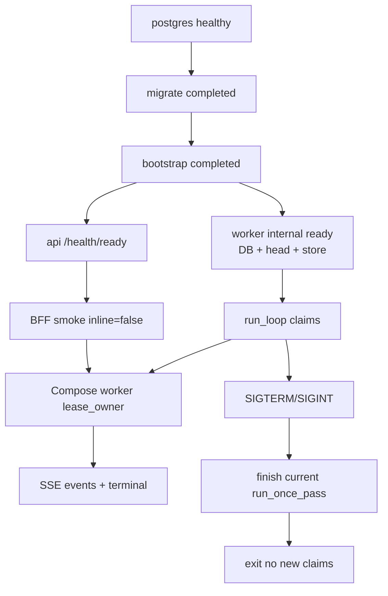
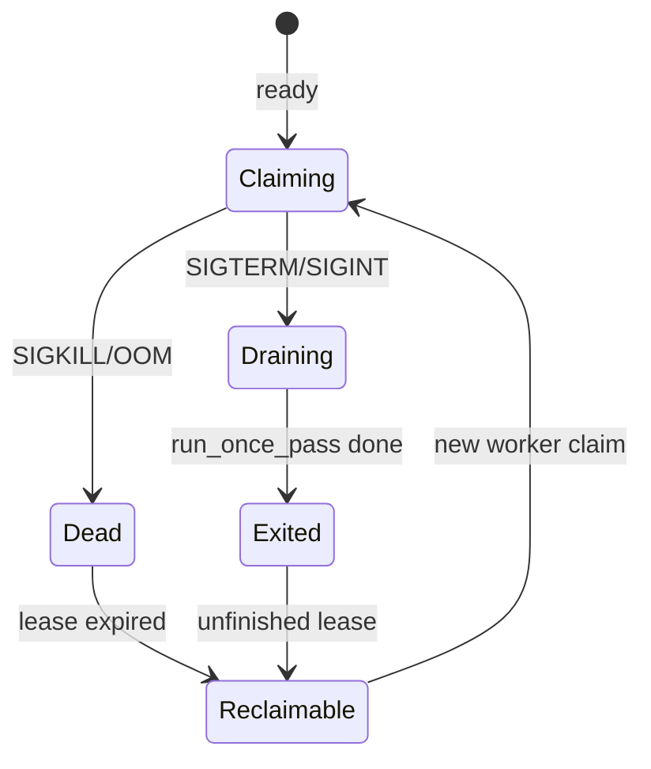

# P10-03 Worker Lifecycle Drain and Operator Runbook - Plan

## Goal Capsule

- **Objective:** Complete master-build-plan slice P10-03 by making the Compose worker lifecycle operable: internal worker readiness before any claim, SIGTERM/SIGINT stop-claim with bounded drain (DRIFT-31), lease reclaim after worker death, worker-leased BFF/SSE smoke (not API-inline), and a Compose-matrix operator runbook for start/stop/drain/recovery.
- **Authority:** Root `AGENTS.md`; `docs/master-build-plan.md` P10-03; `docs/architecture/deployment-topology.md` (Boot, health, and shutdown); DRIFT-31 / DRIFT-08 / DRIFT-15 in `docs/brownfield-refactor-register.md`; P10-02 evidence residuals; P8-03 SIGTERM residual; P3/P5/P7 lease reclaim proofs.
- **Execution profile:** Inventory-first brownfield; readiness gate + signal drain + inline/testing split + Compose worker-path smoke + operator runbook; unit/PG proofs plus live Compose evidence.
- **Readiness checkpoint:** Implementation-ready after 2026-07-27 scoping confirmation and lease-smoke seam choice (split inline from testing security).
- **Stop conditions:** Stop if DONE pressure pulls in API/ingress stream-drain (P12-05), `CONTEXT_ENGINE_TESTING=false`/HTTPS as release evidence, production S3 readiness, Redis/Celery/Kubernetes, multi-replica HA runbooks (P12-04/08), or claiming completed-synthesis when the green bar is a contracted provider-unavailable terminal that still proves Compose lease ownership.
- **Tail ownership:** P12 owns TLS ingress, deployed denial, HA, and unbuffered stream-drain; production object-store readiness stays outside the Compose filesystem matrix; browser CSRF product fix remains a named residual.

---

## Product Contract

### Summary

P10-03 closes the deployable-stack worker half left open by P10-02: workers must not claim before ready, must stop claiming and drain on SIGTERM/SIGINT, must leave in-flight work reclaimable after death, and must prove a real Compose-leased turn path through the BFF while keeping the HTTP testing-security matrix. Product Contract authored in this bootstrap from master-build-plan P10-03 and P10-02 residuals; no upstream brainstorm file. Scope confirmed 2026-07-27; leased-smoke seam confirmed as split-inline flag.

Product Contract preservation: Product Contract authored here; no upstream brainstorm IDs to preserve.

### Problem Frame

P10-02 made the stack bootstrappable and proved BFF/API/SSE under `CONTEXT_ENGINE_TESTING=true`, which completes turns **inline in the API** via `run_turn_workers_until_idle`. That green bar explicitly does not prove Compose worker leasing. `worker.main` validates encryption and immediately enters `run_loop` with always-true `should_continue` — no readiness gate, no SIGTERM/SIGINT handlers (DRIFT-31). Compose `worker` depends on migrate only (not bootstrap), and file-heartbeat health ≠ topology “internal worker readiness.” No Compose-matrix operator runbook exists for drain/reclaim. Without this slice, P10 cannot close and DRIFT-08/15/31 stay open on their worker halves.

### Actors

| Actor | Role |
| --- | --- |
| Operator / developer | Starts Compose, drains/restarts worker per runbook, runs worker-path smoke |
| Coding agent | Implements readiness/drain/inline-split/smoke/runbook and records honest evidence |
| Reviewer | Confirms P12 residuals (TLS, stream-drain, HA, S3) stay out of DONE claims |

### Key Flows

**F1 — Worker boot to claim-ready.** Postgres + migrate (+ bootstrap for stack consistency) → worker validates config → internal readiness (DB, exact Alembic head, filesystem object-store probe) → enter claim loop; heartbeat advances only after ready.

**F2 — Worker-leased BFF smoke.** Ingress-wired stack with testing security on and inline turn workers off → worker healthy → CSRF→login→conversation→`turns:stream` → Compose worker sets turn lease ownership → ≥1 SSE event → allowed terminal; API process did not inline-complete the turn.

**F3 — SIGTERM stop-claim drain.** Idle or busy worker receives SIGTERM/SIGINT → `should_continue` false → finish at most the current `run_once_pass` → exit without new claims; leased/uncertain rows remain reclaimable (no force-complete, no early lease clear).

**F4 — Kill + lease reclaim.** Worker holding a lease is killed hard → lease expires → restarted (or peer) worker reclaims → turn/op progresses under generation fence; stale completion is a no-op.

**F5 — Operator runbook.** Documented Compose-matrix start → ready → worker-path smoke → graceful stop → kill/reclaim drill; explicitly non-HA / non-TLS / non-production-store.

### Requirements

**Inventory and ownership**

- R1. Inventory worker readiness, signal drain, inline-vs-leased seam, Compose deps/health, reclaim proofs, and runbook gaps in `docs/_scratch/p10-03-worker-lifecycle-inventory.md` with retain/modify/add/defer dispositions.
- R2. Record evidence in `docs/_scratch/p10-03-worker-lifecycle-evidence.md`; update `docs/master-build-plan.md` P10-03 and DRIFT-31 / DRIFT-08 / DRIFT-15 with honest closure language and P12 residuals.

**Worker readiness (DRIFT-15 worker half)**

- R3. Before the first claim, the worker process proves internal readiness: database reachable, exact Alembic head, filesystem object-store capability via the same `probe_object_store` / `object_store_from_root` composition as API ready, and encryption/config validation already required at start.
- R4. Worker readiness does **not** require an enabled administrator (API `/health/ready` bootstrap gate stays API-only per deployment-topology “internal worker readiness”).
- R5. Readiness failure exits non-zero (or otherwise never enters the claim loop); file heartbeat must not advertise healthy claim-ready while readiness failed.
- R6. Align Compose `worker` `depends_on` with migrate completion and bootstrap completion for stack consistency; deps are not a substitute for the in-process readiness gate.
- R7. Evidence frames worker readiness as Compose/filesystem matrix proof; production/S3 store remains open.

**Stop-claim and bounded drain (DRIFT-31)**

- R8. Wire SIGTERM and SIGINT so `should_continue` becomes false; the loop stops taking new claims after the signal.
- R9. Bounded drain = finish the in-flight `run_once_pass` if one is running, then exit; do not invent cooperative cancel inside synthesis/parser/runtime calls beyond existing cancel endpoints.
- R10. Idle sleep must wake promptly on shutdown so an idle worker does not wait a full idle interval before exiting.
- R11. Drain must not force-complete turns/ops, clear leases early, or bypass generation fences; unresolved external work stays reclaimable by lease expiry/reconciliation.
- R12. Document Compose `stop_grace_period` (or equivalent) relative to the drain bound so `docker compose stop` can observe graceful exit under normal lease units.

**Inline / leased seam**

- R13. Split API inline turn completion from `CONTEXT_ENGINE_TESTING`: keep testing security / HTTP cookies for the Compose matrix; gate `run_turn_workers_until_idle` on an explicit inline-turn-workers setting (env-backed), not on `testing` alone. Inline completion is allowed only when `testing=true` and the inline setting is enabled — never when `testing=false`.
- R14. Default preserves today’s unit/dev behavior when unset (inline follows testing); Compose worker-path smoke sets inline off while testing stays true.
- R15. With inline off, only the Compose (or other process) `ConversationTurnWorker` may execute the turn; dual-claimer races from leaving inline on must be covered by tests. When inline is off, SSE turn-tail idle must not use the short testing (0.5s) idle that assumes in-process completion — use the normal turn-tail idle so the Compose worker can claim.

**Worker-path smoke and reclaim**

- R16. Provide a scripted worker-path smoke (extend or fork `app/scripts/stack_smoke_core.py`) that requires worker healthy, testing=true, inline=false, BFF origin + Origin header discipline from P10-02, and proves Compose lease ownership (not merely API-inline completion).
- R17. Accept the same terminal classes as P10-02 (`turn.completed` or contracted provider-unavailable `turn.failed`) **and** require evidence the Compose worker claimed the turn (lease owner / safe worker log / equivalent durable marker). Provider-failure terminal alone is insufficient without claim proof.
- R18. Prove kill/reclaim at Compose altitude at least once (hard kill mid-lease → wait expiry with shortened smoke lease if needed → restart reclaim), citing existing PostgreSQL reclaim suites as unit authority.
- R19. Keep P10-02 core smoke green under default inline-on behavior; do not silently break testing-mode unit helpers that call `run_turn_workers_until_idle` directly.

**Operator runbook**

- R20. Add Compose-matrix operator runbook at `docs/operations/compose-stack-runbook.md` (title must mark development matrix) covering boot order, readiness checks, worker-path smoke, graceful stop/drain, single-worker turn-lease reclaim, and explicit non-claims (not TLS, not HA, not production store, not deployed stream-drain; P12-04/08 own production incident/HA).
- R21. Point `.env.stack.example` / e2e README at the runbook and worker-path smoke command; document commented `CE_INLINE_TURN_WORKERS=false` under a “worker-path smoke only” block (requires `testing=true`, not release config) without inventing production procedures owned by P12.

**Verification boundary**

- R22. Add focused unit tests for readiness-before-claim and signal stop-claim/drain; extend Compose config contract tests; record live Compose commands/results in evidence. Do not make root `scripts/verify.sh` a mandatory live Docker smoke gate.

### Acceptance Examples

- AE1. Fresh Compose volume: migrate + bootstrap + API ready + worker passes internal readiness and heartbeat advances; worker does not claim when schema/store readiness fails.
- AE2. Worker-path smoke with testing=true and inline=false: BFF CSRF→login→SSE reaches an allowed terminal **and** Compose worker claim ownership is proven; API did not inline-complete.
- AE3. SIGTERM to an idle worker: process exits without further claims; exit success; no stuck always-true loop.
- AE4. SIGTERM during an in-flight `run_once_pass`: that unit finishes or leaves a reclaimable lease; no second claim after the signal; no force-complete across generation.
- AE5. Hard-kill reclaim: lease expires; restarted worker reclaims; stale completion no-op (Compose smoke + cite PG AE reclaim suites).
- AE6. Evidence closes DRIFT-31; closes DRIFT-08 worker-path smoke half and DRIFT-15 worker-readiness half for the Compose/filesystem matrix; names P12 TLS/stream-drain/HA and production store residuals; does not claim completed-synthesis when only a contracted provider-unavailable terminal was observed.

### Scope Boundaries

**In scope**

- Worker readiness gate; Compose worker depends_on alignment; SIGTERM/SIGINT stop-claim + bounded drain; interruptible idle sleep; inline-turn-workers split; worker-path + kill/reclaim Compose smoke; Compose-matrix operator runbook; inventory/evidence; tracker/DRIFT updates.

**Deferred for later**

- P12-05: API stop-new-turns, ingress buffering, deployed graceful stream-drain proof.
- P12: TLS / `testing=false` HTTPS, direct-API public denial, HA, production object-store readiness, production acceptance runbooks (P12-04/08).
- Browser CSRF bootstrap product fix (P9-05 residual).
- Mid-turn DB lease heartbeat for `ConversationTurnWorker` (existing gap; reclaim-by-expiry remains authority unless a separate slice owns it).

**Outside this product's identity**

- Redis/RQ/Celery; Kubernetes chosen for convenience; multi-tenant Workspace; browser-selectable runtime URLs; Phase 2/3 surfaces.

### Deferred to Follow-Up Work

- Queue-class split deployments (prep/index/turn/delete as separate processes) — Compose remains one monolithic worker with all classes.
- Tightening API readiness from “any enabled administrator” to configured-username match (existing residual).

---

## Planning Contract

### Assumptions

- P10-02 DONE on the branch under test (bootstrap job, filesystem store in `/health/ready`, BFF core-path smoke script).
- Ingress-wired primary profile remains `CONTEXT_ENGINE_TESTING=true` + full `CE_*` (HTTP cookies legal; not P12 evidence).
- Existing PostgreSQL reclaim suites for domain/index/turn remain valid citeables; this slice adds shutdown/Compose altitude, not a second lease algorithm.
- Default stack without provider credentials may end the sealed turn in safe failure; that is acceptable if Compose claim ownership is still proven.
- Browser CSRF product gap remains; scripted smoke owns the client altitude.

### Key Technical Decisions

- KTD1. **Worker readiness before claim, without admin** — Reuse `probe_object_store` and Alembic-head checks from `services/readiness.py` (extract shared helpers if needed) for a worker-internal ready gate; omit enabled-administrator. Fail closed before `run_loop` claims. Governs R3–R7.
- KTD2. **SIGTERM/SIGINT → `should_continue=False`; drain = finish current `run_once_pass`** `(session-settled posture from scoping: worker-only drain).` No API uvicorn stream-drain in this slice. Interruptible idle sleep required. Governs R8–R12, F3.
- KTD3. **Split inline turn workers from testing security** `(session-settled: user-directed — chosen over DB/log-only claim proof and non-turn-queue smoke: full BFF SSE leased path under HTTP testing matrix).` Env-backed tri-state (e.g. `CE_INLINE_TURN_WORKERS` unset → follow `testing`; explicit bool overrides). Effective inline = `testing and resolved_flag`. When inline is off, turn-tail idle uses the non-testing tail idle so Compose workers can claim before the SSE wait ends. Worker-path smoke sets inline false with testing true. Governs R13–R15, F2.
- KTD4. **Worker-path smoke proves Compose lease ownership via private DB + BFF SSE** — Green bar = BFF SSE allowed terminal **and** private Postgres assert that `conversation_turns.lease_owner` matches Compose `CE_TURN_WORKER_ID` for the smoke `clientRequestId` (no new public DTO/SSE fields). Extend/fork `stack_smoke_core.py`; keep P10-02 default inline-on smoke intact. Governs R16–R19, AE2, AE6.
- KTD5. **Kill+reclaim Compose proof cites PG suites** — Shorten turn lease in smoke env if needed for wall-clock; do not replace `test_postgres_turn_leases.py` / domain / index reclaim authority. Governs R18, AE5, F4.
- KTD6. **Compose `worker` depends_on bootstrap + migrate** — Align boot order with API; in-process readiness remains the correctness gate. Governs R6, F1.
- KTD7. **Compose-matrix runbook only** — Publish at `docs/operations/compose-stack-runbook.md` with development-matrix framing and explicit P12 non-claims. Governs R20–R21, F5.
- KTD8. **Verify stays config/unit-level; live Compose is evidence-owned** — Extend `test_compose_stack_config.py`; keep `scripts/verify.sh` free of mandatory Docker runtime smoke. Governs R22.
- KTD9. **No force-complete on drain** — Generation fences and lease expiry remain authoritative; drain leaves reclaimable state. Governs R11.

### High-Level Technical Design

Boot, leased smoke, and drain sequencing:

Shutdown vs reclaim:

### System-Wide Impact

- **Operators:** Gain a real drain/reclaim runbook for the Compose stack; must learn inline=false for worker-path proof.
- **Developers/tests:** Unit tests that relied on `settings.testing` alone for inline completion keep working via default; explicit inline-off covers leased-path tests.
- **P12:** Remains owner of deployed stream-drain, TLS, HA; P10-03 must not overclaim.

### Risks and Dependencies

| Risk | Mitigation |
| --- | --- |
| Dual claim if inline left on during worker smoke | Smoke asserts inline=false; unit test that both paths do not race for same turn under inline-off |
| Long `run_once` exceeds Compose stop grace | Document grace ≥ typical unit; hung work → process kill + lease reclaim (R11) |
| Turn worker lacks mid-execution DB heartbeat | Accept reclaim-by-expiry; defer heartbeat as follow-up |
| Provider-not-ready obscures leased proof | Require lease-ownership marker independent of terminal class |
| Worker healthy before store/schema | Ready gate + AE1 negatives |

**Dependencies:** P10-02 DONE; existing PG lease suites; `readiness.probe_object_store`; `worker.run_loop(should_continue=...)`.

---

## Implementation Units

### U1. Inventory worker lifecycle gaps

**Goal:** Record retain/modify/add/defer for readiness, signals, inline seam, Compose deps, reclaim, runbook.

**Requirements:** R1

**Dependencies:** None

**Files:**
- Create: `docs/_scratch/p10-03-worker-lifecycle-inventory.md`

**Approach:** Table current vs topology contract: `worker.main`, `run_loop`/`should_continue`, `chat_turns.stream_turn_events` inline gate, Compose `worker` depends_on/healthcheck, existing PG reclaim tests, missing runbook. Cite KTD1–KTD9. Confirm runbook path `docs/operations/compose-stack-runbook.md`. Mark P12 deferrals explicitly. Disposition topology “queue class configured” as satisfied by monolithic `build_workers` or an explicit defer note.

**Patterns to follow:** `docs/_scratch/p10-02-stack-smoke-inventory.md`

**Test scenarios:**
- Test expectation: none -- inventory artifact only.

**Verification:** Inventory lists dispositions for every R3–R21 concern, pins the runbook path, and names the inline-split seam.

---

### U2. Worker readiness before claim

**Goal:** Fail closed before claims when DB/schema/store/config are not ready; align Compose depends_on.

**Requirements:** R3–R7, AE1

**Dependencies:** U1

**Files:**
- Modify: `app/context_engine/services/readiness.py` (extract shared head/store probes if needed)
- Modify: `app/context_engine/worker.py`
- Modify: `app/compose.stack.yml` (worker `depends_on` bootstrap + migrate)
- Modify: `app/tests/test_compose_stack_config.py`
- Create or modify: `app/tests/test_worker_readiness.py` (or extend health/readiness tests)

**Approach:** Extract `check_worker_readiness` (Alembic head + `probe_object_store`, no admin) from `services/readiness.py`. Call from `main` before `run_loop`. Clear/invalidate heartbeat file at process start; touch heartbeat only after readiness passes and the loop runs. On failure: non-zero exit, no claim, no heartbeat advertisement. Compose: `worker` waits for bootstrap `service_completed_successfully` like `api` (ordering aid only). Contract-test the depends_on edge.

**Execution note:** Prefer unit tests that inject failing probe/head before any Compose run.

**Patterns to follow:** `check_readiness` / `probe_object_store` in `services/readiness.py`; P10-02 store composition tests.

**Test scenarios:**
- Happy path: DB+head+store OK → readiness passes → loop may claim; heartbeat path available.
- Edge: wrong/missing Alembic head → exit/no claim.
- Error: object-store put/delete failure → no claim; safe internal reason only.
- Integration: Compose config test asserts worker depends_on bootstrap + migrate.

**Verification:** Unit negatives green; Compose contract updated; no admin requirement on worker ready.

---

### U3. SIGTERM/SIGINT stop-claim and bounded drain

**Goal:** Close DRIFT-31: signals stop new claims; in-flight `run_once_pass` finishes; idle wake is prompt.

**Requirements:** R8–R12, AE3, AE4

**Dependencies:** U2

**Files:**
- Modify: `app/context_engine/worker.py`
- Modify: `app/compose.stack.yml` (`stop_grace_period` / documented grace)
- Create: `app/tests/test_worker_loop.py` (or equivalent)

**Approach:** In `main`, install SIGTERM/SIGINT handlers that flip a shared continue flag passed to `run_loop`. Drain semantics = complete current `run_once_pass` then exit loop. Replace idle `time.sleep` with interruptible wait (e.g. `threading.Event.wait(timeout=idle_seconds)` re-checking the flag) so idle workers exit promptly (R10). Do not clear leases or force terminal states. Add safe log/metric peers consistent with `stack_worker.*` allowlist style for stop-claim/drain if an existing allowlist requires registration. Set Compose `stop_grace_period` for the matrix (e.g. 30–60s); document that busy drain may exceed grace and then relies on kill + lease reclaim (R11) — do not invent a synthesis-cancel path.

**Execution note:** Unit-test with injected `should_continue` / fake workers / simulated signal flag before live Compose SIGTERM.

**Patterns to follow:** Existing `run_loop(..., should_continue=...)`; P8-03 inventory note that the hook was unwired; safe_log allowlist patterns from P8-02.

**Test scenarios:**
- Happy path: idle worker + stop flag → no further claims; loop exits.
- Edge: stop during in-flight `run_once` → that pass completes; no subsequent claim.
- Edge: stop during idle sleep → wakes without waiting full idle interval.
- Error: worker exception in iteration still does not bypass stop flag on next iteration.
- Integration (evidence): `docker compose stop` worker observes exit within grace under idle/simple work.

**Verification:** Unit suite proves stop-claim/drain; Compose grace documented; no API lifespan stream-drain changes.

---

### U4. Split inline turn workers from testing security

**Goal:** Keep HTTP testing matrix while disabling API inline turn completion for leased-path proof.

**Requirements:** R13–R15, R19

**Dependencies:** U1

**Files:**
- Modify: `app/context_engine/config.py`
- Modify: `app/context_engine/services/chat_turns.py` (`stream_turn_events` gate; tail idle when inline off)
- Modify: `app/.env.stack.example`
- Modify or create: focused unit tests under `app/tests/` for the gate (e.g. extend chat/turn tests)

**Approach:** Add env-backed tri-state `inline_turn_workers` (`CE_INLINE_TURN_WORKERS`; unset → follow `testing`; explicit bool overrides) plus a Settings helper used by `stream_turn_events`. Call `run_turn_workers_until_idle` only when the helper is true. Document commented worker-path-only `CE_INLINE_TURN_WORKERS=false` in `.env.stack.example`. Ensure direct test helpers that call `run_turn_workers_until_idle` remain valid. **Also address leased-tail timing:** when inline is off, do not use the 0.5s testing tail idle that assumes in-process completion — use the normal turn-tail idle (or equivalent) so Compose workers with `CE_WORKER_IDLE_SECONDS` can claim before the SSE tail gives up (see doc-review P0).

**Patterns to follow:** `_env_bool` / `Settings.from_env` patterns in `config.py`; P10-02 smoke Origin/CSRF discipline remains unchanged.

**Test scenarios:**
- Happy path: testing=true, inline=true → API still inlines (compat).
- Happy path: testing=true, inline=false → `stream_turn_events` does not call inline idle loop.
- Edge: testing=false, unset inline → inline off (no accidental production inline).
- Edge: testing=false, explicit inline=true → fail closed / never inline (security).
- Edge: R15 dual-claimer — with inline off, API process must not also execute `run_turn_workers_until_idle` for the same accepted turn while a worker loop is the intended claimer (unit or focused integration).
- Integration: existing turn unit tests that set testing and expect inline remain green under default.

**Verification:** Gate unit tests green; P10-02-style inline-on path preserved by default; R15 covered.

---

### U5. Worker-path smoke and kill/reclaim Compose proof

**Goal:** Prove Compose-leased BFF path and hard-kill reclaim at stack altitude.

**Requirements:** R16–R18, AE2, AE5, AE6

**Dependencies:** U2, U3, U4

**Files:**
- Create or modify: `app/scripts/stack_smoke_worker.py` (or extend `stack_smoke_core.py` with an explicit mode)
- Modify: `app/compose.stack.yml` / `.env.stack.example` as needed for smoke env (inline=false, optional short `CE_TURN_LEASE_SECONDS`)
- Modify: `app/client/tests/e2e/README.md` (pointer only)
- Create: `docs/_scratch/p10-03-worker-lifecycle-evidence.md` (commands/results filled as work lands; finalize in U6)

**Approach:** Script requires post-readiness worker heartbeat (document that Compose `healthy` ≠ claim-ready until AE1), `CONTEXT_ENGINE_TESTING=true`, inline=false, BFF public origin + Origin on unsafe POSTs. Prefer short `CE_WORKER_IDLE_SECONDS` in smoke-only env. **Claim proof (pin):** smoke uses a known `clientRequestId`; after terminal, private Postgres query on `conversation_turns.lease_owner` via published loopback DB + stack creds; Compose `worker` sets a distinct `CE_TURN_WORKER_ID`; assert match. BFF SSE remains required; DB claim proof is supplementary ownership evidence, not a public DTO. Accept completed or contracted provider-unavailable failed terminal **plus** claim proof. Kill+reclaim: shorten `CE_TURN_LEASE_SECONDS` only in smoke-only env (not default compose values). Cite PG reclaim suites. Do not require live LLM. Banner all smoke/evidence as Compose-dev matrix, not P12 release proof.

**Execution note:** Smoke-first for the leased path after U2–U4 land; keep wall-clock bounds.

**Patterns to follow:** `app/scripts/stack_smoke_core.py`; P10-02 AE4/AE6 trust negatives remain available to re-run but are not this unit’s green bar.

**Test scenarios:**
- Happy path: leased smoke → claim ownership + allowed terminal.
- Edge: worker not healthy → smoke fails closed before claiming success.
- Edge: inline accidentally true → smoke fails (must not green on API-inline).
- Integration: kill -9 → lease expiry → restart reclaim → progress/stale no-op.
- Error: privacy — smoke logs omit secrets, storage paths, raw prompts.

**Verification:** Live Compose worker-path + reclaim commands recorded; no TLS/S3 claims.

---

### U6. Operator runbook, evidence, and tracker closure

**Goal:** Publish Compose-matrix runbook and close P10-03 / DRIFT rows honestly.

**Requirements:** R2, R20–R22, AE6

**Dependencies:** U1–U5

**Files:**
- Create: `docs/operations/compose-stack-runbook.md`
- Modify: `app/.env.stack.example`, `app/client/tests/e2e/README.md`
- Modify: `docs/_scratch/p10-03-worker-lifecycle-evidence.md`
- Modify: `docs/master-build-plan.md`
- Modify: `docs/brownfield-refactor-register.md` (DRIFT-31, DRIFT-08, DRIFT-15)

**Approach:** Runbook sections: boot order, readiness probes (API ready vs worker internal ready vs heartbeat), worker-path smoke, `compose stop` drain, single-worker turn-lease reclaim drill, residual table pointing to P12-04/05/08. Banner: development matrix only. Evidence lists inventory, unit/compose tests, live AE1–AE5, re-run of P10-02 `stack_smoke_core.py` under default inline-on, and residual table. Redact evidence to marker type + redacted owner; forbid cookies/CSRF/prompts/paths. Mark P10-03 DONE; DRIFT-31 DONE; close DRIFT-08 worker-path smoke half and DRIFT-15 worker-readiness half; leave production store / TLS / stream-drain open.

**Patterns to follow:** `docs/_scratch/p10-02-stack-smoke-evidence.md` residual honesty.

**Test scenarios:**
- Test expectation: none -- documentation/tracker evidence artifact.
- Contract: compose config tests still pass after runbook pointer / grace wiring from U3.

**Verification:** Master-build-plan P10-03 DONE; DRIFT language matches evidence; runbook states non-HA/non-TLS explicitly.

---

## Verification Contract

- Unit: worker readiness negatives (schema/store), signal stop-claim/drain + interruptible idle, inline-gate matrix (testing × inline), R15 dual-claimer / inline-off regression, testing=false+inline=true fail-closed.
- Compose contract tests: worker depends_on bootstrap+migrate; stop grace / env pointers as wired.
- PostgreSQL: cite existing turn/domain/index reclaim suites; add shutdown-adjacent PG cases only if unit altitude cannot prove reclaim-after-signal ownership transfer.
- Live Compose (evidence-owned): AE1 ready boot, AE2 worker-path leased smoke, AE3/AE4 SIGTERM drain, AE5 kill+reclaim; bounded wall clocks; `CONTEXT_ENGINE_TESTING=true` + inline=false for leased smoke.
- Regression: re-run P10-02 `app/scripts/stack_smoke_core.py` under default inline-on and record pass (R19).
- Do **not** require Playwright, live LLM, LightRAG overlay, HTTPS/`testing=false`, or root verify live Docker smoke for exit.
- Privacy: ready/smoke/runbook/evidence must not emit storage paths, credentials, raw CSRF secrets, prompts, provider payloads, or unredacted session artifacts; claim proof may cite marker type + redacted owner only.
- Framing: all live smoke/evidence banners state Compose-dev matrix only — not TLS, not production security, not P12-05 stream-drain.

## Definition of Done

- Master-build-plan P10-03 DONE with P12 TLS/stream-drain/HA and production-store residuals explicit.
- DRIFT-31 DONE; DRIFT-08 worker-path smoke half closed; DRIFT-15 worker-readiness half closed for Compose/filesystem matrix — production store still open.
- Workers do not claim before internal ready; SIGTERM/SIGINT stop-claim + bounded drain proven; Compose-leased BFF path proven with claim ownership; kill+reclaim proven or cited+Compose-drilled.
- Compose-matrix operator runbook published with explicit non-claims.
- No API stream-drain, TLS release evidence, S3 Compose service, Redis/Celery, or browser CSRF product fix invented as this slice’s success criteria.

## Sources & Research

- `docs/plans/2026-07-27-014-feat-p10-02-stack-smoke-bootstrap-plan.md` and `docs/_scratch/p10-02-stack-smoke-evidence.md`
- `docs/_scratch/p10-01-compose-config-evidence.md`, `docs/_scratch/p8-03-operational-safety-evidence.md`
- `docs/_scratch/p3-03-domain-leases-evidence.md`, `docs/_scratch/p5-01-index-state-claim-evidence.md`, `docs/_scratch/p7-04-sse-pipeline-evidence.md`
- `docs/_scratch/code-docs-drift-review.md` (#31 always-true loop)
- `docs/architecture/deployment-topology.md`, `docs/brownfield-refactor-register.md` DRIFT-08/15/31
- Local pattern research: `app/context_engine/worker.py` unwired `should_continue`; `chat_turns.stream_turn_events` testing inline; Compose worker deps/health; readiness probes
- External research: skipped — local patterns and architecture contracts were sufficient; no load-bearing external findings
- `docs/solutions/`: absent; learnings extracted from scratch evidence instead
