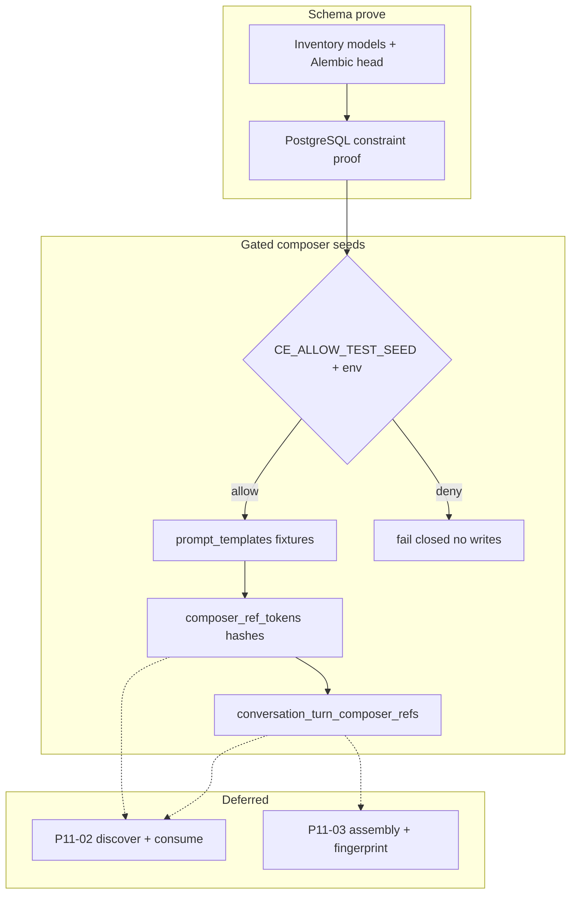

# P11-01 Composer Ref Schema and Deterministic Seeds - Plan

## Goal Capsule

- **Objective:** Complete master-build-plan slice P11-01 by aligning and proving the brownfield `prompt_templates`, `composer_ref_tokens`, and accepted-ref (`conversation_turn_composer_refs`) persistence against `docs/database-schema.txt`, then landing gated deterministic seeds for `source` / `evidence` / `template` kinds across all three tables.
- **Authority:** Root `AGENTS.md`; FR-07 in `docs/prd.md`; M-09 in `docs/interaction-behavior-prd.md`; `docs/database-schema.txt`; `AcceptedRefDto` / `ComposerRefDto` in `docs/contracts/dto-schema-catalog.md`; Composer data in `docs/quality/seeded-demo-and-test-data.md`; DRIFT-26 / DRIFT-33 in `docs/brownfield-refactor-register.md`; `docs/architecture/data-and-lifecycle.md` privacy classes.
- **Execution profile:** Inventory-first brownfield reconcile; PostgreSQL constraint proof; gated fixture-seed harness for templates/tokens/accepted refs; characterization-friendly tests; scratch inventory/evidence.
- **Readiness checkpoint:** Implementation-ready after 2026-07-27 scoping confirmation (align-and-prove; seeds cover all three tables; discover/consume/assembly deferred).
- **Stop conditions:** Stop if DONE pressure pulls discover API completion, atomic one-use consume, private prompt assembly, fingerprint/idempotency behavior, chat UI unlock, Wiki/publication composer kinds, or inventing unapproved public DTO/error/endpoint fields.
- **Tail ownership:** P11-02 owns discovery, opaque-token validation, domain compatibility, expiry, and consume-column/one-use behavior (DRIFT-26); P11-03 owns private assembly, turn fingerprint, replay/conflict, and deeper redaction/invalidation; P11-04 remains product-gated Evidence reattachment; P12 owns adversarial privacy breadth and populated-legacy contraction.

---

## Product Contract

### Summary

P11-01 closes the persistence foundation for governed composer context. The three Phase 1 tables must match the approved schema invariants, exclude Wiki/publication kinds, persist only token hashes (never raw tokens), and expose accepted refs only through opaque `public_ref` plus safe labels. Deterministic, fail-closed seeds then materialize approved/disabled templates, Mina-owned hash rows for discovery and denial cases expressible without a consume column, and ordered accepted-ref rows of each kind on demo turns. Product Contract authored in this bootstrap from master-build-plan P11-01; no upstream brainstorm file. Scope confirmed 2026-07-27.

Product Contract preservation: Product Contract authored here; no upstream brainstorm IDs to preserve.

### Problem Frame

Brownfield already contains SQLAlchemy models, baseline/public-ref migrations, `composer_refs` / `prompt_templates` services, a discover route seam, and turn-start persistence helpers. Those seams are evidence, not P11 completion: the brownfield register still marks hashed composer tokens / safe accepted labels as NOT_STARTED; lifespan seeding upserts a divergent three-template catalog that does not match `template_safety_summary` / `template_disabled`; no gated deterministic token or accepted-ref fixture world exists; and DRIFT-26’s one-use consume remains unmodeled in schema. P11-01 must prove and seed the foundation without claiming discover/consume/assembly Done.

### Actors

| Actor | Role |
| --- | --- |
| Member (Mina) | Fixture owner of composer tokens and accepted refs used by later discover/consume cases |
| Member (Noah) | Wrong-owner token fixture actor |
| Coding agent | Aligns schema, lands gated seeds, writes PG/seed proofs and evidence |
| Reviewer | Confirms P11-02/03 residuals stay out of P11-01 DONE claims |

### Key Flows

**F1 — Schema prove.** Inventory models + Alembic head against `database-schema.txt` → retain brownfield strengthenings that do not contradict the contract → additive migration only if a real missing invariant is found → PostgreSQL asserts named uniqueness/check/index invariants and closed `ref_kind` set.

**F2 — Gated composer seed.** With `CE_ENVIRONMENT=development|test` and `CE_ALLOW_TEST_SEED=true`, seed command/helpers upsert fixture-keyed templates, token hashes, and accepted refs idempotently; without the gate, seed writes fail closed before mutation. Production API lifespan must not install demo fixture templates.

**F3 — Later discover/consume handoff.** P11-02/03 reuse seeded hashes, labels, and accepted-ref rows as live cases; P11-01 does not mint raw tokens over HTTP or mark tokens consumed.

### Requirements

**Schema and privacy**

- R1. Models and the migration chain reproduce `prompt_templates`, `composer_ref_tokens`, and `conversation_turn_composer_refs` ownership, kind closed set (`source`/`evidence`/`template`), hash-only tokens, accepted-ref `public_ref`, ordering, redaction nulling of safe fields, uniqueness, checks, and indexes required by `docs/database-schema.txt` on PostgreSQL 16.
- R2. No Wiki/publication composer kind, column, or seed row enters the Phase 1 package (DRIFT-33 / P0-07 fence).
- R3. Raw composer tokens, assembled prompts, template bodies, private target/source/block IDs, and private row primary keys never appear in public DTOs, expected browser snapshots, or seed-manifest public projections. Seeds may hold private linkage and test-only raw token constants outside public projections.
- R4. Additive DDL is allowed only for a proven missing schema invariant discovered in inventory. Do not recreate tables, rewrite migration history, or invent foreign keys the schema does not require. Do not add a consume/`used_at` column in this slice.

**Deterministic seeds**

- R5. Reconcile template fixture identity to `template_safety_summary` (approved) and `template_disabled` (disabled) from `docs/quality/seeded-demo-and-test-data.md`, including stable private IDs, safe names/descriptions, and private bodies ≤2000 chars.
- R6. Seed gated, idempotent `composer_ref_tokens` rows owned primarily by Mina with deterministic hashes and injected-clock expiry: one valid discovery token each for source, evidence, and template; plus expired, wrong-owner (Noah), wrong-domain, deleted-target, and disabled-template denial rows. Persist hashes only.
- R7. Seed ordered non-redacted accepted-ref rows covering all three kinds with fixed `public_ref`s and kind-target-consistent private linkage on demo turns; seed redacted accepted-ref state consistent with `turn_mina_redacted` (safe fields NULL, `redacted_at` set).
- R8. Seed writes require `CE_ENVIRONMENT=development|test` and `CE_ALLOW_TEST_SEED=true` and fail closed otherwise (either gate missing or non-allowlisted environment blocks mutation). Rerun converges by fixture key. `--reset` remains test-database-only when that harness exists.
- R9. Omit durable `already-consumed` token rows until P11-02 owns consume-state schema and atomic consume behavior (DRIFT-26). Reserve the residual fixture key `token_mina_consumed_source` (and kind siblings if needed) as unseeded in inventory/evidence and carve that case out of the Composer data seed-authority table so P11-01 Done is not read as a complete denial matrix.

**Slice honesty**

- R10. P11-01 does not claim discover HTTP completion, one-use consume, fingerprint/idempotency semantics, private prompt assembly, or chat References UI unlock.
- R11. Completion evidence lists exact schema/seed proofs, residual handoffs, and the artifact revision tested.

### Acceptance Examples

- AE1. **Schema closed set:** On PostgreSQL 16 at Alembic head, the three tables exist with named uniqueness/check constraints; inserting an unsupported `ref_kind` fails; no wiki/publication composer columns exist.
- AE2. **Template fixtures:** Gated seed upserts `template_safety_summary` (approved) and `template_disabled` (disabled); rerun does not duplicate rows; API lifespan without the seed gate does not install those demo fixtures into a production-like environment.
- AE3. **Token hashes only:** Seeded discovery/denial tokens persist 64-char hashes; raw token constants used by tests never appear in ORM columns or public fixture projections.
- AE4. **Accepted refs:** Demo turn projections can resolve fixed accepted-ref `public_ref`s for source, evidence, and template kinds with safe labels only; the redacted turn’s public accepted refs are empty/omitted while private redacted rows remain for audit linkage.
- AE5. **Gate fail-closed:** Seed invocation without `CE_ALLOW_TEST_SEED=true`, or with `CE_ALLOW_TEST_SEED=true` but `CE_ENVIRONMENT` outside `development|test`, performs no composer fixture writes.
- AE6. **Residual honesty:** Evidence names `already-consumed` tokens, discover validation, and one-use consume as P11-02/DRIFT-26 residuals, not as P11-01 Done.

### Scope Boundaries

#### Deferred to Follow-Up Work

- P11-02: `POST /composer-refs:discover`; mint raw token → hash; ownership/expiry/domain/target-state validation; consume-column migration if required; already-consumed seed rows; `token` vs `refToken` catalog/runtime repair; max-ref catalog parity.
- P11-03: private context assembly; turn `composer_ref_fingerprint`; replay/conflict; deeper redaction/invalidation beyond existing delete-path token expiry.
- P11-04: product-gated Evidence reattachment UI/contracts.
- Full `python -m context_engine.dev.seed --manifest …` world beyond the composer slice, if still incomplete — P11-01 may introduce the composer seed module and wire it into whatever seed entrypoint exists or a minimal gated composer seed entry, without claiming the entire fixture manifest Done.
- P12 adversarial privacy breadth and legacy populated-DB contraction.

#### Outside This Slice

- Chat References discover UI unlock; WebSocket/EventSource changes; Wiki composer refs; admin template CRUD UI; inventing FKs from accepted-ref private link columns to source/evidence/template tables without a schema contract change; claiming closed Phase 1 chat capability manifest complete.

---

## Planning Contract

### Key Technical Decisions

- KTD1. **Align-and-prove brownfield persistence.** `(session-settled: user-directed — chosen over greenfield rewrite: retain useful models/migrations and prove them.)` Inventory retain/modify/defer; keep brownfield strengthenings that do not contradict the contract (unique template name, hash length check, kind-target CHECK, extra private-link indexes). Additive migration only for a proven missing invariant. Governs R1–R4.
- KTD2. **Seeds cover all three tables.** `(session-settled: user-directed — chosen over templates-only seeds: master-build-plan names all three tables.)` Templates + token hashes + accepted refs land together. Governs R5–R8.
- KTD3. **Defer consume-state schema and already-consumed seeds to P11-02.** Current `database-schema.txt` has no consume column; DRIFT-26 assigns one-use consume to P11-02/P11-03. P11-01 seeds every denial state expressible with `expires_at` / ownership / domain / target / template state, and records `already-consumed` as an explicit residual fixture key. Governs R4, R6, R9, R10.
- KTD4. **Replace divergent lifespan catalog with gated fixture identity.** Reconcile to `template_safety_summary` / `template_disabled`. API lifespan must never call template/composer seed writers; demo fixtures install only through the explicit dual-gated seed entry. Retire brownfield lifespan catalog identities (`1111…` / `2222…` / `3333…`) via gated seed/`--reset` (test DB) so post-seed counts match the two fixture keys. Keep demo body literals in `context_engine.dev` seed modules, not in always-imported runtime service modules beyond safe projection helpers. Governs R5, R8, AE2.
- KTD5. **Durable gated seeds with injected clock; deleted-target means orphan `target_id`.** Discovery and denial token rows are part of the deterministic demo/test seed (fixed hashes, fixture keys, clock default `2026-07-17T12:00:00Z`). “Reset between cases” for mutable token use is a P11-02 test-helper concern; P11-01 owns durable fixture keys/hashes. Deleted-target seeds point at a non-existent private target id; fenced/deleting source validation semantics remain P11-02. Seed writers persist hashes only — do not embed raw token plaintext in seed modules, evidence docs, or `expected/` projections. Governs R6–R8.
- KTD6. **Composer seed owns minimal named parents under the gate.** Because named Mina/Noah/turn fixture keys are not yet materialized in code, the gated composer seed module upserts the minimal parent graph required for FKs — fixture-keyed users (Mina/Noah), and the named turns/evidence parents needed for accepted refs — using the seed-contract keys. It does not claim the full `dev.seed --manifest` world. Public projection proof for AE4 is DB rows plus the existing private-to-safe accepted-ref mapper/unit projection; new conversation HTTP/SSE contract work is out of scope. Parent-turn `composer_ref_fingerprint` consistency with seeded accepted refs is an explicit P11-03 residual unless inventory shows a trivial placeholder is required for CHECK/NOT NULL integrity. Governs R7, AE4.
- KTD7. **Leave runtime discover/validate/assemble seams pinned.** Inventory may note `composer_refs.py` / route DTO drift. Do not edit discover/validate paths or discover routes unless a seed/privacy compile break forces a one-line fence; otherwise inventory-only. Governs R10.
- KTD8. **Create the gated composer seed package; do not assume it exists.** `app/context_engine/dev/` and `CE_ALLOW_TEST_SEED` / env gate wiring are absent today. U2 introduces `context_engine.dev` with a dual-gate helper and a composer-only seed entry (CLI or module entry). Full manifest orchestration remains outside P11-01. Document that local Compose/dev stacks needing templates must run the gated seed explicitly after lifespan removal. Governs R8, AE5, Q4.

### Assumptions

- Catalog max-ref (25) vs brownfield service cap (10) and `token` vs `refToken` drift are P11-02 contract/runtime residuals, not P11-01 blockers.
- Minimal parent upsert under KTD6 is limited to users/domains/docs/turns/evidence rows required for composer FKs and kind targets; if a required P6 private link target cannot be represented without reopening parser/index work, stop for an explicit prerequisite decision rather than expanding scope.

### High-Level Technical Design



Entity shape (directional):

```text
prompt_templates (approved|disabled, private body)
composer_ref_tokens (token_hash, owner, kind, private target_id, expires_at)
conversation_turn_composer_refs (public_ref, ref_order, kind, safe labels,
  private nullable links, redacted_at)
```

### System-Wide Impact

- **Chat detail / SSE projection:** Accepted-ref `public_ref` and safe labels are already projected on owned turns; seeding must not put private IDs, template bodies, or raw tokens onto those surfaces. Redacted-turn fixtures must continue to omit public accepted refs.
- **Delete/redaction path:** P7-05 already expires source/evidence tokens and redacts accepted-ref safe fields. P11-01 seeds must remain compatible with those CHECKs and must not undo delete fencing.
- **API lifespan / environments:** Moving templates off unconditional lifespan seed affects every API boot. Non-seed environments must still start; only gated seed installs demo fixtures.
- **Downstream P11-02/03:** Fixture keys and hashes become the stable inputs for discover/consume/assembly tests. Changing keys later breaks those slices — treat keys as contract-adjacent once landed.
- **Phase-scope fence:** Seeds and schema proof reinforce the source/evidence/template-only kind set; Wiki/publication kinds stay out (DRIFT-33).

### Risks and Dependencies

| Risk | Mitigation |
| --- | --- |
| Seed contract lists already-consumed but schema cannot express it | KTD3 residual; do not fake consume by deleting rows |
| Lifespan seed fights gated fixture counts | KTD4 gate/remove lifespan demo seed |
| Accepted-ref seeds need parent turns/docs | KTD6 attach to named fixtures or minimal test parents |
| Touching discover/validate “while here” | KTD7 + stop conditions; defer DTO drift |
| Claiming P11 Done from existing files | Inventory/evidence required; brownfield ≠ proof |
| Fixture privacy leak into snapshots/manifests | Keep raw tokens and template bodies out of public expected projections; scan seed outputs |
| Boot regression after lifespan seed removal | Prove API startup without seed allowlist still succeeds; templates become optional until gated seed runs |

### Dependencies / Prerequisites

- P6 Evidence/document foundations available as private link targets for source/evidence seeds.
- P7 conversation/turn/public-ref foundations (schema/models) for accepted-ref parent turns — even though master-build-plan lists only P6, this slice needs turn FK targets; KTD6 owns minimal parent upsert rather than assuming a completed fixture manifest.
- PostgreSQL 16 test path for constraint proof (SQLite is not deployment evidence).

---

## Implementation Units

### U1. Composer schema inventory and PostgreSQL proof

**Goal:** Inventory the three tables against the schema contract and prove closed-set / uniqueness / check invariants on PostgreSQL 16 without rewriting brownfield tables.

**Requirements:** R1–R4; AE1, AE6

**Dependencies:** None

**Files:**
- Create: `docs/_scratch/p11-01-composer-ref-schema-inventory.md`
- Modify (only if inventory finds a proven missing invariant): `docs/database-schema.txt`, `app/context_engine/models.py`, `app/migrations/versions/<new>_….py`
- Test: `app/tests/test_phase_one_schema_scope.py` (extend), `app/tests/test_postgres_composer_ref_schema.py` (create or extend nearest PG schema proof)

**Approach:**
- Produce a retain/modify/defer inventory for columns, checks, indexes, and privacy shape.
- Record brownfield strengthenings kept (unique template name, hash length, kind-target CHECK, extra indexes).
- Explicitly defer consume column, discover DTO drift, assembly, and parent-turn fingerprint consistency (P11-03).
- Reserve unseeded residual key `token_mina_consumed_source` in the inventory.
- Add PostgreSQL assertions for table presence, named constraints, closed `ref_kind`, redaction CHECK, and hash-only columns (no raw token column).
- Execution note: Start with characterization of current Alembic head before any DDL; add a migration only when inventory proves a missing invariant. Expect no DDL unless a real gap appears.

**Patterns to follow:** `docs/plans/2026-07-26-001-feat-conversation-ownership-plan.md` U1; `docs/_scratch/p7-01-conversation-foundation-inventory.md`; `app/tests/test_postgres_conversations.py`; `app/tests/test_phase_one_schema_scope.py`

**Test scenarios:**
- Happy path: Alembic head creates/has the three tables with expected named unique/check constraints.
- Edge: Unsupported `ref_kind` insert fails closed on tokens and accepted refs.
- Edge: Redacted accepted-ref row cannot retain non-null safe labels.
- Edge: Token hash length ≠ 64 fails when the brownfield length check is retained.
- Integration: Negative scan — no wiki/publication composer kind/column in clean-install metadata.
- Error: If a migration is added, fresh-install and upgrade-from-prior-head both land the invariant.

**Verification:** Inventory committed; PG proof green; no consume column added; residuals named.

---

### U2. Template fixture identity and gated seed seam

**Goal:** Align prompt-template fixtures to the seed contract and ensure demo template installation is fail-closed without the seed allowlist.

**Requirements:** R5, R8, R3; AE2, AE5

**Dependencies:** U1

**Files:**
- Create: `app/context_engine/dev/__init__.py`, `app/context_engine/dev/seed_gate.py`, `app/context_engine/dev/seed_prompt_templates.py`, composer-only entry `app/context_engine/dev/seed.py` (or equivalent)
- Modify: `app/context_engine/services/prompt_templates.py` (remove always-imported demo body catalog; keep safe projection helper)
- Modify: `app/context_engine/app.py` (remove lifespan seed calls entirely)
- Modify: `docs/quality/seeded-demo-and-test-data.md` (record private template fixture IDs under Composer data)
- Test: `app/tests/test_composer_seed_templates.py` (create)

**Approach:**
- Per KTD8, create the missing `context_engine.dev` package and dual-gate helper (`CE_ENVIRONMENT` ∈ {development,test} ∧ `CE_ALLOW_TEST_SEED=true`).
- Land fixture-keyed `template_safety_summary` and `template_disabled` bodies only inside the dev seed module.
- Composer-only seed entry; do not implement full `--manifest` orchestration.
- Lifespan never calls seed writers; boot without allowlist still succeeds with zero demo template upserts.
- Keep `safe_prompt_template_ref` privacy projection; do not expose body.

**Patterns to follow:** Seed gates in `docs/quality/seeded-demo-and-test-data.md`; fail-closed bootstrap patterns from auth/session tests

**Test scenarios:**
- Happy path: Covers AE2 — gated seed creates approved + disabled fixtures; idempotent rerun preserves counts; only those two fixture identities remain after seed/`--reset` in test DB.
- Edge: Disabled fixture remains `disabled` after rerun (not flipped approved).
- Error: Covers AE5 — missing `CE_ALLOW_TEST_SEED` performs no writes; `CE_ALLOW_TEST_SEED=true` with non-allowlisted `CE_ENVIRONMENT` also performs no writes.
- Integration: API lifespan performs zero demo template upserts regardless of seed env.
- Privacy: Safe projection omits body; body exists only in private DB column / dev seed module.

**Verification:** Fixture keys match seed contract; lifespan no longer installs demo templates unconditionally; gate tests pass.

---

### U3. Token-hash and accepted-ref deterministic seeds

**Goal:** Land gated deterministic seeds for `composer_ref_tokens` and `conversation_turn_composer_refs` covering all three kinds and the expressible denial matrix.

**Requirements:** R3, R6–R9; AE3, AE4, AE5, AE6

**Dependencies:** U2

**Files:**
- Create: `app/context_engine/dev/seed_composer_refs.py` (parents + tokens + accepted refs)
- Modify: gated seed entry from U2 to invoke composer seed after templates
- Create: private seed/test constants module for token hashes, accepted `public_ref`s, and safe labels (not under `expected/` public projections)
- Modify: `docs/quality/seeded-demo-and-test-data.md` Composer data — add token/accepted-ref fixture keys; carve `already-consumed` as P11-02 residual; reserve `token_mina_consumed_source`
- Test: `app/tests/test_composer_seed_refs.py` (create); extend nearest mapper/unit projection tests for AE4 safe fields

**Approach:**
- Per KTD6, upsert minimal named parents under the gate, then token hashes and accepted refs.
- Fixture keys: valid Mina source/evidence/template discovery tokens; expired; wrong-owner (Noah); wrong-domain; deleted-target (orphan target id); disabled-template.
- Persist SHA-256 hashes only; do not embed raw token plaintext in seed modules or `expected/` sinks.
- Seed accepted refs with fixed `public_ref`s and kind-target-consistent private links; redacted rows for the redacted turn.
- AE4 proof = DB + existing safe mapper/unit projection only; no new conversation HTTP/SSE contract work.
- Do not seed already-consumed rows; publish reserved residual key for P11-02.

**Patterns to follow:** Inline token/accepted-ref inserts in `app/tests/test_delete_redaction.py` and `app/tests/test_conversation_http_contract.py`; Composer data table in `docs/quality/seeded-demo-and-test-data.md`

**Test scenarios:**
- Happy path: Covers AE3/AE4 — gated seed inserts one valid token per kind plus ordered accepted refs; public_refs stable across rerun; mapper/unit projection exposes only public_ref + kind + order + safe labels.
- Edge: Expired token row has `expires_at` before injected clock default.
- Edge: Wrong-owner token references Noah; wrong-domain token references non-selected domain id; deleted-target token has orphan `target_id`.
- Edge: Disabled-template token targets `template_disabled`.
- Edge: Redacted accepted-ref rows have null safe fields and non-null `redacted_at`; public projection list empty.
- Error: Covers AE5 — composer-ref seed path without dual gate performs zero token/accepted-ref mutations.
- Error: Kind-target CHECK rejects a malformed accepted-ref seed candidate in a negative unit (guards seed helper correctness).
- Integration: Idempotent rerun converges counts by fixture key; no raw token/hash/private-link values in public expected projections.
- Residual: Suite/docs assert already-consumed is reserved but unseeded (AE6).

**Verification:** All three kinds present in tokens and accepted refs; denial matrix except already-consumed present; privacy sinks split correctly; seed-doc Composer table updated.

---

### U4. Completion evidence and tracker residuals

**Goal:** Record honest P11-01 Done evidence and explicit handoffs so later slices do not re-litigate foundation scope.

**Requirements:** R10, R11; AE6

**Dependencies:** U1, U2, U3

**Files:**
- Create: `docs/_scratch/p11-01-composer-ref-schema-evidence.md`
- Modify: `docs/master-build-plan.md` (P11-01 status + short evidence pointer)
- Modify: `docs/brownfield-refactor-register.md` only to note schema/seed foundation progress without marking DRIFT-26 Done

**Approach:**
- Evidence lists schema proofs, seed fixture keys, gate behavior, privacy guarantees, explicit gated-seed operator/Compose note (Q6), and residuals (already-consumed reserved key, discover, consume, assembly, fingerprint consistency, DTO drift).
- Update tracker to DONE only when U1–U3 proofs exist; keep DRIFT-26 NOT_STARTED; optionally note P7 as a soft dependency for turn parents.
- No product behavior invention in the evidence doc.

**Patterns to follow:** `docs/_scratch/p7-01-conversation-foundation-evidence.md`; recent P10 evidence closeout style

**Test scenarios:**
- Test expectation: none -- documentation/tracker closeout; verified by review that evidence cites real test modules and residual owners.

**Verification:** Evidence + tracker updated; DRIFT-26 remains open; P11-02 can start from named fixture keys.

---

## Verification Contract

- PostgreSQL schema proof for the three tables and closed kind set (U1).
- Gated template seed + lifespan non-install proof (U2).
- Gated token/accepted-ref seed idempotency, kind coverage, denial matrix except already-consumed, and hash-only privacy (U3).
- Inventory + evidence artifacts committed; master-build-plan P11-01 points at evidence; DRIFT-26 not falsely closed (U4).
- Do not require browser E2E, discover HTTP green, or consume reuse denial for this slice.

---

## Definition of Done

- [ ] R1–R11 satisfied at the schema/seed boundary with AE1–AE6 evidenced
- [ ] Brownfield tables retained and proven; no greenfield rewrite; no consume column sneaked in
- [ ] Fixture keys match Composer data contract for templates and expressible token/accepted-ref rows
- [ ] Seed allowlist fail-closed; production-like lifespan does not install demo composer fixtures
- [ ] Privacy: no raw tokens/bodies/private IDs in public projections
- [ ] `docs/_scratch/p11-01-composer-ref-schema-inventory.md` and `…-evidence.md` committed
- [ ] P11-02/03 residuals explicitly named; DRIFT-26 remains NOT_STARTED
- [ ] Relevant deterministic tests pass; non-applicable gates (discover E2E, consume races) have written boundary reasons

---

## Appendix

### Sources and research

- Local patterns: `app/context_engine/models.py`, `app/migrations/versions/724564649a13_baseline_phase_one_schema.py`, `d07141ac7d95_add_public_refs_and_cancelled_turns.py`, `app/context_engine/services/prompt_templates.py`, `app/context_engine/services/composer_refs.py`, `app/tests/test_phase_one_schema_scope.py`, `app/tests/test_composer_refs_phase_one.py`, delete-redaction/conversation HTTP tests inserting composer rows
- Authority: `docs/database-schema.txt`, `docs/quality/seeded-demo-and-test-data.md` § Composer data, FR-07, M-09, DTO catalog, brownfield DRIFT-26/33
- Precedent: P7-01 conversation ownership inventory/evidence/plan
- `docs/solutions/`: absent — no institutional solution docs mined
- External research: skipped — strong local schema/seed patterns; no unsettled external option set

### Open Questions

| ID | Question | Status |
| --- | --- | --- |
| Q1 | Should P11-01 add consume-state schema to seed already-consumed tokens? | Resolved — No; defer to P11-02 (KTD3) |
| Q2 | Keep brownfield lifespan template catalog alongside fixtures? | Resolved — No; one fixture-keyed gated catalog (KTD4) |
| Q3 | Deleted-target seed meaning? | Resolved — orphan `target_id` for P11-01 (KTD5) |
| Q4 | Exact `dev.seed` manifest layout if harness still missing? | Resolved — KTD8 creates composer-only gated `context_engine.dev` entry; full `--manifest` world remains outside P11-01 |
| Q5 | Who materializes Mina/Noah/turn parents for accepted-ref FKs? | Resolved — KTD6: composer seed upserts minimal named parents under the gate |
| Q6 | Where do local Compose/dev stacks get templates after lifespan removal? | Deferred (non-blocking) — document explicit gated seed operator/Compose bootstrap step in U2/U4 evidence; do not restore lifespan seeding |
