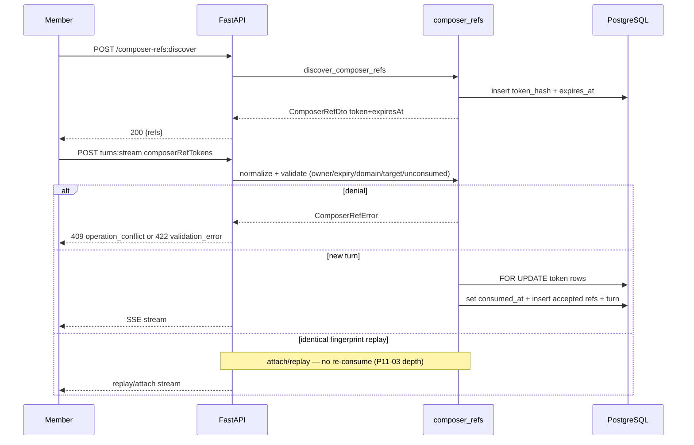

# P11-02 Composer Ref Discover Validate Consume - Plan

## Goal Capsule

- **Objective:** Complete master-build-plan slice P11-02 by closing composer-ref discovery, opaque-token validation (ownership, expiry, domain compatibility, target/template state, duplicates), catalog field/max-ref parity, and one-use consume at turn submit on the P11-01 seed foundation.
- **Authority:** Root `AGENTS.md`; FR-07 in `docs/prd.md`; M-09 in `docs/interaction-behavior-prd.md`; `POST /composer-refs:discover` and turn-start `composerRefTokens` in `docs/contracts/http-api-catalog.md`; `ComposerRefDto` / closed `ErrorCode` in `docs/contracts/dto-schema-catalog.md`; `docs/database-schema.txt`; Composer data in `docs/quality/seeded-demo-and-test-data.md`; DRIFT-26 in `docs/brownfield-refactor-register.md`; grounded-turn steps in `docs/architecture/data-and-lifecycle.md`.
- **Execution profile:** Contract-first brownfield repair of existing discover/validate seams; additive consume-state schema; atomic consume on new-turn commit; API/HTTP contract proof (no browser E2E unlock).
- **Readiness checkpoint:** Implementation-ready after 2026-07-27 scoping confirmation (consume in-slice; API/contract proof; assembly/replay deferred to P11-03).
- **Stop conditions:** Stop if DONE pressure pulls private prompt assembly, fingerprint/idempotency conflict semantics, browser References UI unlock, Wiki/publication kinds, inventing unapproved public DTO/error fields, or claiming full DRIFT-26 closed without replay-without-token residual ownership by P11-03.
- **Tail ownership:** P11-03 owns private context assembly, turn fingerprint consistency, replay/conflict, and deeper redaction/invalidation; P11-04 remains product-gated Evidence reattachment; P12 owns adversarial privacy breadth and browser E2E.

---

## Product Contract

### Summary

P11-02 makes discover mint catalog-shaped one-use tokens and makes turn-start validate and atomically consume them. Members receive `token` + `expiresAt` discovery projections (hashes only in the database); invalid or reused refs reject the turn before provider work using closed public error codes. Private assembly and replay-without-token proofs stay with P11-03. Product Contract authored in this bootstrap from master-build-plan P11-02 and P11-01 residuals; no upstream brainstorm file. Scope confirmed 2026-07-27.

Product Contract preservation: Product Contract authored here; no upstream brainstorm IDs to preserve.

### Problem Frame

Brownfield already discovers, mints, validates, and persists accepted refs, and P11-01 seeded the durable denial matrix except already-consumed. The slice is not Done: discover emits `refToken` without `expiresAt`; runtime max-ref is 10 against catalog 25; discover can leak internal `composer_ref_unavailable`; and tokens are reusable until expiry because no consume column or atomic consume exists (DRIFT-26). P11-02 must close those gaps without claiming assembly/fingerprint/replay Done.

### Actors

| Actor | Role |
| --- | --- |
| Member (Mina) | Discovers refs and submits turns with valid/denial tokens |
| Member (Noah) | Wrong-owner denial fixture actor |
| Coding agent | Amends schema, repairs discover/validate/consume, proves HTTP contracts |
| Reviewer | Confirms P11-03 assembly/replay residuals and browser unlock stay out of Done |

### Key Flows

**F1 — Discover mint.** Authenticated member posts discover with optional conversation/domain/kinds/query/limit → server authorizes and mints short-lived raw tokens → response projects `ComposerRefDto` (`token`, `kind`, `label`, `description`, `expiresAt`) → only SHA-256 hashes persist.

**F2 — Valid turn bind.** Member submits ordered `composerRefTokens` on turn-start → normalize (max 25, no duplicates) → validate ownership/expiry/domain/target/template/unconsumed → lock token rows → set `consumed_at` → persist accepted-ref safe metadata + private linkage in the same new-turn transaction → provider work may proceed.

**F3 — Denial before provider.** Expired, already-consumed, wrong-owner, wrong-domain, deleted-target, disabled-template, incompatible domain, or duplicate/over-cap tokens reject before provider/retrieval work; UI-facing public codes stay in the closed ErrorCode set; target IDs never leak.

**F4 — Concurrent reuse.** Two concurrent new-turn submits with the same one-use token serialize so at most one consumes and binds; the other receives unavailable → `operation_conflict`.

### Requirements

- R1. Amend `composer_ref_tokens` with nullable `consumed_at` in `docs/database-schema.txt`, SQLAlchemy model, and an additive Alembic migration from current head; flip prior “no consume column” schema proofs.
- R2. Seed durable `token_mina_consumed_source` (Mina source target, unexpired, `consumed_at` set) under the existing dual seed gate; keep hash-only persistence and the `ce-p11-01:{fixture_key}` hash preimage.
- R3. `POST /composer-refs:discover` returns `{refs: ComposerRefDto[]}` with field `token` (not `refToken`), required `expiresAt`, and no raw token persistence beyond the response.
- R4. Align max ordered refs to catalog 25 across normalize, turn-start request validation, OpenAPI `maxItems`, and discover default/limit behavior consistent with “max 25”.
- R5. Turn-start validates ownership, expiry, domain compatibility, target/template state, duplicates, per-kind brownfield cap (retain 4 unless a contract amendment lands), and unconsumed state before provider work.
- R6. New-turn commit path atomically consumes validated tokens (`consumed_at`) with row locks in the same transaction as turn insert + accepted-ref persist; identical-fingerprint replay/attach must not re-consume.
- R7. Public HTTP errors stay in the closed ErrorCode vocabulary: duplicates/over-cap → `validation_error`; unavailable states (including already-consumed) → `operation_conflict` at discover and turn-start boundaries (no leaked `composer_ref_unavailable`).
- R8. API/HTTP contract and service tests prove discover shape, denial matrix (including already-consumed), consume-once success, and opt-in PostgreSQL concurrent-reuse race; browser E2E unlock is out of scope.
- R9. Evidence + tracker updates mark P11-02 Done with honest residuals: private assembly/fingerprint/replay-without-token → P11-03; DRIFT-26 consume half closed, replay residual named.

### Acceptance Examples

- AE1. **Discover catalog shape:** Mina discovers source/evidence/template refs and receives `token` + `expiresAt`; DB rows store 64-char hashes only.
- AE2. **Valid bind consumes:** Mina submits one valid discovery token on a new turn; accepted-ref row persists; token row has `consumed_at` set; reuse on a later new turn fails with `operation_conflict`.
- AE3. **Denial matrix:** Expired, Noah-owned, wrong-domain, deleted-target, disabled-template, and already-consumed seeds each reject turn-start before provider work without exposing target IDs.
- AE4. **Max-ref parity:** Turn-start with 26 tokens fails `validation_error`; 25 distinct valid tokens pass normalize length check (kind/domain eligibility may still deny individually).
- AE5. **Concurrent reuse:** Two concurrent new-turn submits racing one token yield one success and one `operation_conflict` under PostgreSQL locking.
- AE6. **Residual honesty:** Evidence names assembly/fingerprint/replay-without-token as P11-03; does not claim browser References unlock Done.

### Scope Boundaries

#### In scope

- Consume-column schema authority + migration + seeds
- Discover DTO/runtime/OpenAPI repair (`token`, `expiresAt`, max 25, typed response, error allowlisting)
- Validate + atomic consume on new-turn path
- API/service/HTTP/PG race proofs and scratch evidence

#### Deferred to Follow-Up Work

- P11-03: private context assembly, fingerprint consistency with accepted refs, replay/conflict semantics, replay-without-token DRIFT-26 remainder
- P11-04: Evidence reattachment product gate
- Browser chat References discover UI unlock and E2E
- Catalog amendment for per-kind cap (retain brownfield 4)
- Wiki/publication composer kinds

#### Outside this product's identity

- Browser-selectable runtimes, raw LightRAG hits, Workspace entity, Phase 2 observability surfaces

### Success Criteria

- Discover and turn-start match catalog field names and max-ref 25.
- One-use consume is durable and race-safe on PostgreSQL for new turns.
- Seeded denial matrix including already-consumed is proven at HTTP or service boundary.
- P11-02 tracker row points at evidence; assembly/replay residuals remain explicit.

---

## Planning Contract

### Key Technical Decisions

- KTD1. **Include one-use consume in P11-02 with discover/validate.** Confirmed scoping choice against the narrower tracker blurb; aligns with P11-01 residuals and DRIFT-26. Governs R1, R2, R5, R6, R9.
- KTD2. **API/contract proof only — no browser unlock.** Chat shell may keep discover gated/unused; optional hand-type `refToken` cleanup is allowed only to prevent silent adapter breakage after OpenAPI regen, not as UI delivery. Governs R8, AE6.
- KTD3. **Column name `consumed_at` (nullable timestamp).** Matches reserved fixture language (`token_mina_consumed_source`) and one-use semantics better than `used_at`. Amend `database-schema.txt` in the same slice as models/migration/tests. Governs R1, R2.
- KTD4. **Project catalog `token` + `expiresAt`; remap discover errors like turn-start.** Fix `_safe_result` / response model to `ComposerRefDto`; discover must not passthrough `composer_ref_unavailable`. Public code remains `operation_conflict` (already in closed ErrorCode union via domain/source rows and used by turn-start). Governs R3, R7, AE1.
- KTD5. **Single `MAX_COMPOSER_REFS = 25`; retain per-kind 4.** Catalog authority is 25 total; per-kind 4 has no catalog entry — keep brownfield unless a separate contract amendment is approved. Governs R4, AE4.
- KTD6. **Consume only on new-turn commit path with `SELECT … FOR UPDATE`.** Place consume after validate and inside the conversation-locked turn insert transaction alongside `persist_accepted_composer_refs`. Identical-fingerprint attach/replay must skip consume (deeper replay-without-token proof → P11-03). Governs R6, F4, AE5.
- KTD7. **Keep hash preimage `ce-p11-01:{fixture_key}`.** Stability lets HTTP tests address seeded hashes; do not invent a second seed scheme. Governs R2, AE3.
- KTD8. **Extend existing seams; do not rewrite PromptAssembly.** Work stays in `composer_refs.py`, turn-start wiring in `chat_turns.py`, routes/DTO generation, seeds, and tests. Governs stop conditions.

### High-Level Technical Design

Denial states collapse to the same public unavailable projection at the HTTP boundary (no target-ID disclosure). Discover commits minted hashes independently of turn consume; unused mints expire by TTL.

### Assumptions

- Confirmed scope includes consume + already-consumed seed in this slice.
- Confirmed scope excludes browser References unlock/E2E.
- `operation_conflict` remains an acceptable public remap for composer unavailable (existing turn-start pattern; member of closed ErrorCode union).
- Migration head at plan time is `e9f2a1b83c70`; implementer re-checks head before writing the new revision.

### Risks and Dependencies

| Risk | Mitigation |
| --- | --- |
| Schema proofs assert absence of consume column | Flip assertions in the same unit as migration (U1) |
| Consume on replay path double-binds | Consume only after new-turn claim; leave deeper replay proof to P11-03 |
| Concurrent validate-then-consume race | Row locks + opt-in PG race test |
| OpenAPI/client regen blast radius | Regenerate contracts + optional unused chat-shell hand type in U2 |
| Claiming full DRIFT-26 Done | Evidence splits consume (P11-02) vs replay-without-token (P11-03) |

**Depends on:** P11-01 Done seeds/evidence. Soft dependency on P7 turn-start seams (already present).

### System-Wide Impact

- Authz/privacy: raw tokens remain response-only; hashes/consume state are private; denial messages stay non-enumerating across wrong-owner and other-user conversation IDs (same unavailable shape).
- Failure propagation: discover mint failures leave no partial public refs; turn-start denials abort before provider/retrieval; mid-flight source delete continues to expire tokens via existing `_expire_composer_tokens_for_source` and remains complementary to `consumed_at`.
- Contracts: OpenAPI + generated TS + DTO snapshots must move with maxItems 25 and discover response typing; unused chat-shell hand types that still say `refToken` can break the first real discover call if left stale.
- Idempotency seam: consume must not run on attach/replay; otherwise a reconnect could falsely mark fresh tokens consumed or double-bind — deeper fingerprint conflict proof stays P11-03.
- Seeds: durable world gains one consumed fixture key; docs table updates; production Compose must keep `CE_ALLOW_TEST_SEED` unset.

---

## Implementation Units

### U1. Consume-state schema and already-consumed seed

**Goal:** Land nullable `consumed_at` as schema authority and seed `token_mina_consumed_source`.

**Requirements:** R1, R2, R9 (foundation)

**Dependencies:** None

**Files:**
- Modify: `docs/database-schema.txt`
- Modify: `app/context_engine/models.py`
- Create: `app/migrations/versions/<rev>_composer_ref_token_consumed_at.py` (down_revision = current Alembic head)
- Modify: `app/context_engine/dev/seed_composer_refs.py`
- Modify: `docs/quality/seeded-demo-and-test-data.md`
- Modify: `app/tests/test_phase_one_schema_scope.py`
- Modify: `app/tests/test_postgres_composer_ref_schema.py`
- Modify: `app/tests/test_composer_seed_refs.py`

**Approach:**
- Add `consumed_at timestamp NULL` to `composer_ref_tokens` in schema text, model, and additive migration (mirror recent nullable timestamp migrations).
- Seed reserved key with valid Mina source target, future `expires_at`, and non-null `consumed_at` at seed clock; include in `TOKEN_FIXTURE_KEYS` / hash map.
- Update seed-contract table: already-consumed is now part of the durable world.
- Flip schema/PG/seed tests that currently assert column absence or key absence.

**Execution note:** Land schema + seed before discover/consume behavior so denial fixtures exist for U3/U4.

**Patterns to follow:** P11-01 seed gate and hash preimage; `e9f2a1b83c70_turn_execution_leases.py` additive column style.

**Test scenarios:**
- Happy path: Schema scope test expects `consumed_at` column; seed lists `token_mina_consumed_source` with hash-only row and non-null `consumed_at`.
- Edge: Dual-gate failure still performs zero composer-ref mutations.
- Error: Seed without gate raises/no-ops per existing seed-gate contract.
- Integration: Opt-in PG suite accepts consumed fixture insert under constraints.

**Verification:** Schema/seed unit tests green; PG suite green when disposable DB flag set; seed doc table updated.

---

### U2. Discover DTO, max-ref 25, and contract regeneration

**Goal:** Make discover and request caps match `ComposerRefDto` / catalog max 25; stop leaking internal error codes.

**Requirements:** R3, R4, R7, AE1, AE4

**Dependencies:** U1 (not strictly required for DTO work, but preferred so regen/tests share one branch tip)

**Files:**
- Modify: `app/context_engine/services/composer_refs.py` (`MAX_COMPOSER_REFS`, `_safe_result`)
- Modify: `app/context_engine/api/routes.py` (discover response model, `_composer_ref_api_error` allowlist)
- Modify: `app/context_engine/api/catalog_schemas.py` if discover wrapper types need registration
- Regenerate: `app/contracts/openapi.json`, `app/contracts/public-dtos.schema.json`, `app/client/src/lib/api/generated/openapi.ts` via existing generation gate
- Modify (optional, breakage fence only): `app/client/src/features/chat-shell/api.ts` hand type `refToken` → `token`
- Create: `app/tests/test_composer_refs_discover_http_contract.py`
- Modify: `app/tests/test_composer_refs_phase_one.py`
- Modify: `app/tests/test_authoritative_dto_components.py` / `app/tests/test_generated_contract_gate.py` as snapshots require

**Approach:**
- Set `MAX_COMPOSER_REFS = 25`; keep `MAX_COMPOSER_REFS_PER_KIND = 4`.
- Project `token` + ISO `expiresAt` from issued row TTL; wire discover `response_model` to `{refs: ComposerRefDto[]}`.
- Remap discover ComposerRefError codes through the same closed public mapping as turn-start for unavailable → `operation_conflict`.
- Regenerate OpenAPI/TS so `composerRefTokens` `maxItems` becomes 25 and discover 200 is typed.

**Patterns to follow:** `catalog_schemas.ComposerRefDto`; `_chat_turn_api_error` allowlisting; existing contract generation gate.

**Test scenarios:**
- Happy path: Covers AE1 — discover 200 body uses `token`/`expiresAt`; DB has hash only.
- Edge: Covers AE4 — normalize/turn request rejects 26 tokens with `validation_error`; 25 passes length gate.
- Error: Discover unsupported kind / validation failures return closed codes only (never raw `composer_ref_unavailable`).
- Integration: Generated OpenAPI snapshot shows discover response schema and `maxItems: 25`.

**Verification:** Discover HTTP contract tests + generated-contract gate pass.

---

### U3. Validate unconsumed and atomic consume on new-turn submit

**Goal:** Reject already-consumed tokens and consume valid tokens exactly once inside the new-turn transaction.

**Requirements:** R5, R6, R7, AE2, AE3, AE5

**Dependencies:** U1, U2

**Files:**
- Modify: `app/context_engine/services/composer_refs.py` (`_token_row_by_hash` / validate; new consume helper)
- Modify: `app/context_engine/services/chat_turns.py` (call consume on new-turn path only)
- Create: `app/tests/test_composer_refs_consume.py`
- Modify: `app/tests/test_composer_refs_phase_one.py`
- Modify or extend: `app/tests/test_chat_turn_route_http_contract.py`
- Create or extend: `app/tests/test_postgres_composer_ref_consume_race.py` (opt-in disposable PG)

**Approach:**
- Treat `consumed_at is not None` as unavailable (same internal error as expiry/owner miss).
- Add `consume_composer_ref_tokens` that locks rows by hash for the owner, sets `consumed_at = utc_now()`, and fails closed if any row already consumed or missing.
- Invoke from turn-start only after validate and only on the new-turn insert/commit path — never on identical-fingerprint replay/attach.
- Prefer ephemeral minted tokens for happy-path consume tests; use seeded denial keys (including consumed) for AE3.

**Execution note:** Start with a failing service/HTTP test for already-consumed → `operation_conflict`, then implement consume + wiring.

**Patterns to follow:** Conversation `with_for_update` / lease claim races; turn-start error remap table; delete-path token expiry remains complementary invalidation.

**Test scenarios:**
- Happy path: Covers AE2 — validate+consume+persist succeeds; second new-turn reuse fails.
- Edge: Empty token list still succeeds with empty fingerprint; template-only direct turns remain domain-optional as today.
- Error: Covers AE3 — each seeded denial key maps to public `operation_conflict` or `validation_error` as appropriate; no target IDs in messages.
- Integration: Covers AE5 — opt-in PG concurrent reuse yields one success / one conflict.
- Integration: Identical-fingerprint replay/attach path does not clear or re-set `consumed_at` (characterization; deeper replay semantics remain P11-03).

**Verification:** Consume unit/HTTP tests green; PG race green under disposable flag.

---

### U4. Evidence, tracker, and residual honesty

**Goal:** Record completion evidence and update trackers without over-claiming P11-03/DRIFT-26.

**Requirements:** R9, AE6

**Dependencies:** U1, U2, U3

**Files:**
- Create: `docs/_scratch/p11-02-composer-ref-discover-consume-inventory.md` (optional short) and `docs/_scratch/p11-02-composer-ref-discover-consume-evidence.md`
- Modify: `docs/master-build-plan.md` P11-02 → DONE with evidence pointer
- Modify: `docs/brownfield-refactor-register.md` DRIFT-26 / hashed-token row — consume progress + replay residual

**Approach:**
- Evidence lists commands, fixture keys, contract regen note, privacy guarantees, and explicit residuals (assembly/fingerprint/replay; browser unlock).
- Mark DRIFT-26 consume/bind denial covered; keep replay-without-token NOT_STARTED under P11-03.

**Test scenarios:**
- Test expectation: none — documentation/tracker unit; completeness checked by review against AE6.

**Verification:** Evidence committed; tracker Done; residuals named; no false DRIFT-26 full closure.

---

## Verification Contract

| Gate | Proof |
| --- | --- |
| Schema/seed | `pytest` on `test_phase_one_schema_scope.py` (composer_ref), `test_composer_seed_refs.py` |
| Discover/DTO | `test_composer_refs_discover_http_contract.py`, generated-contract gate |
| Consume/denial | `test_composer_refs_consume.py`, extended chat turn HTTP contract cases |
| PG race (opt-in) | `CONTEXT_ENGINE_ALLOW_DISPOSABLE_DATABASE_TESTS=1` on consume-race + composer schema suites |
| Privacy | Responses/fixtures/seeds contain no raw committed token plaintext; public errors omit target IDs |
| Tracker | P11-02 evidence pointer; P11-03/browser residuals explicit |

Interaction cases: map tests to M-09 (and FR-07) by case ID in test names/docstrings where practical.

---

## Definition of Done

- [ ] `consumed_at` in schema/model/migration; already-consumed seed durable (U1)
- [ ] Discover returns `token`/`expiresAt`; max refs 25; OpenAPI/TS regenerated; discover errors allowlisted (U2)
- [ ] New-turn path validates + atomically consumes; denial matrix + PG race proved (U3)
- [ ] Evidence + master-build-plan + brownfield residual honesty landed (U4)
- [ ] No private assembly/fingerprint/replay or browser unlock claimed Done
- [ ] Abandoned experiment code removed from the diff

---

## Appendix

### Sources and research

- Local patterns: `app/context_engine/services/composer_refs.py`, `app/context_engine/services/chat_turns.py`, `app/context_engine/api/routes.py` (`_chat_turn_api_error`, discover route), `app/context_engine/dev/seed_composer_refs.py`, P11-01 evidence/inventory, migration head `e9f2a1b83c70`
- Authority: FR-07, M-09, HTTP/DTO catalogs, `database-schema.txt`, seeded-demo Composer section, DRIFT-26
- Institutional learnings: `docs/solutions/` absent — no corpus hits
- External research: skipped — strong local discover/validate/migration/HTTP patterns
- Prior plan: `docs/plans/2026-07-27-016-feat-p11-01-composer-ref-schema-seeds-plan.md` (KTD3 deferred consume here)

### Resolved planning questions

| ID | Question | Resolution |
| --- | --- | --- |
| Q1 | Include consume in P11-02? | Yes — confirmed scoping (KTD1) |
| Q2 | Browser unlock in scope? | No — API/contract only (KTD2) |
| Q3 | Consume column name? | `consumed_at` (KTD3) |
| Q4 | Per-kind cap 4? | Retain without catalog amendment (KTD5) |
