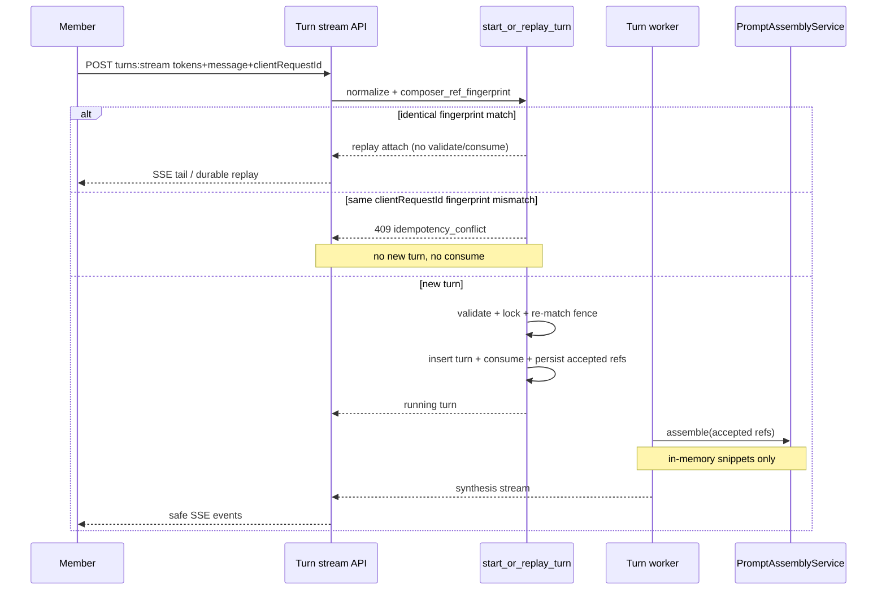

# P11-03 Private Assembly Fingerprint Replay Redaction - Plan

## Goal Capsule

- **Objective:** Complete master-build-plan slice P11-03 by proving private governed-context assembly (never persisted), turn fingerprint consistency with ordered accepted refs, identical-fingerprint attach/replay without re-consuming tokens, changed-fingerprint `idempotency_conflict`, and accepted-ref public-label redaction/invalidation consistency — closing the DRIFT-26 replay-without-token remainder left by P11-02.
- **Authority:** Root `AGENTS.md`; FR-07 / FR-08 and closed Phase 1 chat capability manifest in `docs/prd.md`; M-09 / M-10 / M-11 in `docs/interaction-behavior-prd.md`; turn-start / SSE / error envelopes in `docs/contracts/http-api-catalog.md` and `docs/contracts/sse-event-catalog.md`; `AcceptedRefDto` / `ErrorCode` in `docs/contracts/dto-schema-catalog.md`; turn + accepted-ref invariants in `docs/database-schema.txt`; privacy classes and grounded-turn steps in `docs/architecture/data-and-lifecycle.md`; Composer fixtures in `docs/quality/seeded-demo-and-test-data.md`; DRIFT-26 in `docs/brownfield-refactor-register.md`; P11-02 evidence residuals in `docs/_scratch/p11-02-composer-ref-discover-consume-evidence.md`.
- **Execution profile:** Proof-first brownfield closure on existing `PromptAssemblyService`, `start_or_replay_turn`, fingerprint match, and `_redact_turns` seams; fix seed fingerprint drift and any contract gaps revealed by failing tests; API/service/Postgres only.
- **Readiness checkpoint:** Implementation-ready after 2026-07-27 scoping confirmation (backend proof; redaction proof-only against P7 delete; full idempotency matrix including refs-changed and replay-without-reconsume).
- **Stop conditions:** Stop if DONE pressure pulls browser References unlock, P11-04 Evidence reattachment, Wiki/publication kinds, inventing unapproved public DTO/error fields, persisting assembled prompts, or redesigning P7 source/domain delete fencing.
- **Tail ownership:** P11-04 remains product-gated Evidence reattachment; browser discover UI unlock and P12 adversarial privacy / browser E2E remain later.

---

## Product Contract

### Summary

P11-03 closes the governed-context proof gap after P11-02: worker-time private assembly from durable accepted refs stays ephemeral; parent turn fingerprints match the ordered accepted-ref set; identical retries attach/replay without re-consuming tokens or a second provider call; changed refs/message/domain conflict; redaction clears public accepted-ref labels and expired targets reject new binds. Product Contract authored in this bootstrap from master-build-plan P11-03 and P11-02 residuals; no upstream brainstorm file. Scope confirmed 2026-07-27.

Product Contract preservation: Product Contract authored here; no upstream brainstorm IDs to preserve.

### Problem Frame

Brownfield already assembles at worker claim, fingerprints ordered token hashes, matches before validate/consume, and redacts accepted-ref labels on delete. The slice is not Done: assembly coverage is thin; M-10 conflict tests change message only (not refs); seeded parents with accepted refs still store empty fingerprints; and DRIFT-26’s replay-without-token residual lacks first-class HTTP/SSE proof. Claiming P11-03 Done without that matrix would falsely close DRIFT-26.

### Actors

| Actor | Role |
| --- | --- |
| Member (Mina) | Submits turns with ordered composer refs; retries/reconnects with same client request id |
| Member (Noah) | Ownership denial fixture actor (unchanged) |
| Administrator (Ava) | Triggers source/domain delete that redacts Mina’s turns |
| Coding agent | Thickens proofs, aligns seeds, repairs only gaps forced by failing contracts |
| Reviewer | Confirms browser unlock / P11-04 stay out of Done; DRIFT-26 closes only with replay-without-reconsume proof |

### Key Flows

**F1 — Private assemble.** New turn binds and consumes ordered refs → worker claims → `PromptAssemblyService.assemble` builds bounded snippets from durable accepted-ref linkage → synthesis receives in-memory context only → no assembled body is written to turns, events, audit, or public DTO/SSE.

**F2 — Identical attach after consume (DRIFT-26 remainder).** Same `(conversationId, clientRequestId)` + same message/domain/route + same ordered raw token strings → fingerprint match before validate/consume → attach/replay/SSE tail → `consumed_at` unchanged → no second provider/retrieval call. “Without-token” means without requiring unconsumed tokens, not omitting token strings when the original turn had refs.

**F3 — Changed fingerprint conflict.** Same client request id but changed message, domain/route, or ordered refs (set or order) → `409 idempotency_conflict` → no new turn, no consume, no provider call.

**F4 — Redaction / invalidation consistency.** Existing P7 delete fence redacts the turn unit; accepted-ref `safe_label`/`safe_description` clear with `redacted_at`; public detail and SSE omit `acceptedRefs`; source/evidence composer tokens expire so new binds fail; assembly skips redacted evidence bodies. Question preserved.

### Requirements

- R1. Worker-time private assembly from durable accepted refs covers template/source/evidence kinds with existing caps; redacted evidence contributes no body; assembled prompts/context are never persisted (`content_sensitive` / schema invariant 9).
- R2. Turn `composer_ref_fingerprint` is the SHA-256 of ordered token hashes (empty → `EMPTY_COMPOSER_REF_FINGERPRINT`) and participates in effective-input match with message, domain, and route.
- R3. Align `turn_mina_figure` fingerprint honesty without inventing false consume provenance: either add dedicated consumed seed tokens whose raw preimages are the sole fingerprint inputs (leave `token_mina_*_valid` unconsumed for the denial matrix), or keep that parent as projection/redaction-only with empty fingerprint and add a separate replay-capable parent for fingerprint demos.
- R4. Identical-fingerprint attach/replay after consume does not re-validate as fresh, does not bump `consumed_at`, and does not start a second provider/retrieval execution (HTTP/SSE first-class proof).
- R5. Same `clientRequestId` with changed ordered refs (or message/domain) returns public `idempotency_conflict` before provider work.
- R6. After existing delete-driven redaction, public turn detail and SSE replay omit accepted-ref labels; expired governed tokens reject new binds with closed codes.
- R7. Update seeded-demo M-10 conflict recipe to include refs-changed alongside domain/message.
- R8. API/service/Postgres proofs only — no browser References unlock; no new public fields.
- R9. Evidence + trackers mark P11-03 Done; DRIFT-26 Done only when replay-without-reconsume is proven; residuals name browser unlock and P11-04.

### Acceptance Examples

- AE1. **Assembly privacy:** Mina’s turn with source/evidence/template accepted refs assembles non-empty bounded snippets at worker claim; turn row, event payloads, and public DTO/SSE contain no assembled body text.
- AE2. **Fingerprint consistency:** After a live bind, stored `composer_ref_fingerprint` equals the production `composer_ref_fingerprint(ordered raw tokens)` helper. Seed parents used for fingerprint demos use dedicated consumed-token preimages (or a separate replay parent)—never a greenwashed fingerprint over unconsumed denial-matrix tokens.
- AE3. **Replay-without-reconsume:** After a successful ref-bearing turn-start consumes tokens, an identical HTTP stream POST attaches/replays; token `consumed_at` unchanged; provider/retrieval invoked once.
- AE4. **Refs-changed conflict:** Same `clientRequestId` with different ordered `composerRefTokens` returns `409 idempotency_conflict` with no consume and no new turn.
- AE5. **Redaction public omission:** After source delete redacts a composer-linked turn (with real accepted-ref rows), GET turn detail and SSE/attach projections show empty/absent accepted refs and cleared answer/evidence/citations; question preserved; expired target tokens deny new bind.
- AE6. **Residual honesty:** Evidence closes DRIFT-26 with replay proof; does not claim browser References unlock or P11-04 Done.

### Scope Boundaries

#### In scope

- Private assembly proof (+ repair only if tests force)
- Fingerprint consistency including seed parent alignment
- Replay-without-reconsume HTTP/SSE + refs-changed conflict matrix
- Accepted-ref redaction/invalidation consistency proofs on existing P7 delete seams
- Seeded-demo M-10 recipe update; scratch evidence; tracker/DRIFT-26 closure

#### Deferred to Follow-Up Work

- P11-04 Evidence reattachment product gate
- Browser chat References discover UI unlock and E2E
- Per-kind composer-ref catalog cap amendment
- Wiki/publication composer kinds
- P12 adversarial privacy breadth and deployed-ingress SSE drain

#### Outside this product's identity

- Persisting assembled prompts for worker reclaim convenience
- Browser-selectable runtimes, raw LightRAG hits, Workspace entity, Phase 2 observability surfaces

### Success Criteria

- Assembly privacy and caps are proven at service boundary.
- Fingerprint match includes ordered refs; seeds no longer contradict accepted refs.
- DRIFT-26 is Done with HTTP/SSE replay-without-reconsume + refs-changed conflict.
- Redaction clears public accepted refs without redesigning delete.
- Tracker evidence names browser unlock / P11-04 as residuals.

---

## Planning Contract

### Key Technical Decisions

- KTD1. **Proof-first on existing seams; repair only what failing contracts force.** Do not rewrite `PromptAssemblyService` or `start_or_replay_turn`. Governs R1–R6, stop conditions.
- KTD2. **Backend API/service/Postgres only — no browser unlock.** Confirmed scoping. Governs R8, AE6.
- KTD3. **“Replay-without-token” means replay-without-reconsume.** Turn-start identical attach still requires the client to resend the original ordered raw `composerRefTokens` from tab memory so the server can recompute the fingerprint; match skips validate/consume. Loss of those strings is not a DRIFT-26 failure—use resume/GET. Omitting tokens when the original turn had refs is an expected `idempotency_conflict`. Governs R4, F2, AE3.
- KTD4. **Effective-input match remains fieldwise:** `user_message` + `domain_id` + `route` + `composer_ref_fingerprint`. Extend conflict proofs to refs axis without inventing a mega-hash. Governs R2, R5, AE4.
- KTD5. **Do not invent false consume provenance on seed parents.** Prefer dedicated consumed seed tokens (raw `ce-p11-01:…` preimages → production `composer_ref_fingerprint`) for fingerprint-consistent parents, leaving `token_mina_*_valid` unconsumed; alternatively keep `turn_mina_figure` empty-fingerprint as projection-only and add a separate replay parent. Never fingerprint from stored `token_hash` columns (double-hash risk). Governs R3, AE2.
- KTD6. **Redaction work is proof-only against P7 delete / `_redact_turns`.** Do not redesign fencing, generation, or cleanup workers. Governs R6, F4, AE5.
- KTD7. **Keep silent truncate at existing assembly caps.** No new public over-cap signal. Governs R1, AE1.
- KTD8. **Close DRIFT-26 only on conjunction:** (1) HTTP turn-start stream POST after consume with identical tokens → attach/replay, `consumed_at` unchanged, no second execution; (2) refs-changed / reorder / omit-tokens → `409 idempotency_conflict`. Service-only characterization and GET/resume SSE alone are insufficient. Governs R9, AE3, AE4, AE6.

### High-Level Technical Design

### Assumptions

- A1. Confirmed scoping: backend proof only; redaction proof-only on P7 seams; full idempotency matrix (KTD2, KTD6, KTD3/KTD4/KTD8).
- A2. Turn-start identical attach assumes tab-memory still holds the original ordered raw composer tokens for fingerprint recomputation; resume/GET remains the path when those strings are gone (KTD3).

### Risks and Mitigations

| Risk | Mitigation |
| --- | --- |
| Over-claim DRIFT-26 Done without HTTP/SSE attach proof | KTD8; AE3 required in evidence |
| Message-only M-10 tests mistaken for refs coverage | Explicit refs-changed cases in U3 |
| Seed empty fingerprint confuses demos/tests | U1 seed alignment before conflict demos |
| Accidental persistence of assembly into events/logs | AE1 privacy scan assertions |
| Touching delete workers beyond proof | KTD6; call existing enqueue/redact helpers only |

### System-Wide Impact

| Surface | Effect |
| --- | --- |
| Turn-start / SSE | Attach/replay and `idempotency_conflict` semantics become refs-aware in proof; public envelopes unchanged |
| Worker / synthesis | Continues ephemeral assembly inject; no schema or event-shape change unless a bug forces it |
| Seeds / demos | `turn_mina_figure` fingerprint becomes replay/conflict-honest; M-10 recipe documents refs-changed |
| Delete / redaction | No workflow change; public acceptedRefs omission and token expiry proofs harden P7/P11 seam |
| DRIFT-26 / P11 trackers | Consume (P11-02) + replay-without-reconsume (P11-03) close the drift; browser unlock remains open |
| Frontend | No unlock; existing client already maps `idempotency_conflict` — do not treat that as P11-03 UI delivery |

Failure propagation: a conflicting retry must not consume tokens or create a second turn; a redacted turn must not re-expose accepted-ref labels on detail or durable SSE replay; assembly failures that yield empty snippets must not invent ungrounded domain answers (existing grounded-refusal path owns that).

---

## Implementation Units

### U1. Align seed fingerprints with accepted refs

**Goal:** Remove empty-fingerprint drift on parents that carry durable accepted refs so fingerprint-consistency demos and tests are honest.

**Requirements:** R3, R7 (seeded-demo recipe note if touched), AE2

**Dependencies:** None

**Files:**
- Modify: `app/context_engine/dev/seed_composer_refs.py`
- Modify: `app/tests/test_composer_seed_refs.py`
- Modify: `docs/quality/seeded-demo-and-test-data.md` (M-10 conflict recipe includes refs-changed; note fingerprint consistency for `turn_mina_figure`)

**Approach:**
- Choose KTD5 option (a) preferred: add dedicated consumed seed tokens for the figure parent’s fingerprint inputs; mark them `consumed_at`; leave `token_mina_*_valid` untouched for the denial matrix. Compute fingerprint only via production `composer_ref_fingerprint((f"ce-p11-01:{key}", ...))` — never from stored `token_hash` columns.
- Option (b): leave `turn_mina_figure` empty-fingerprint as projection/redaction parent; add a separate replay-capable parent with dedicated consumed tokens for fingerprint demos.
- Keep `turn_mina_redacted` as redaction/projection fixture unless a dedicated consumed-token history is also added.
- Extend seed tests to import the same helper `start_or_replay_turn` uses.

**Execution note:** Fix fixture honesty before U3 demos. U3 AE3 must mint/live-start a turn (durable events from runtime)—do not treat seeded `turn_mina_figure` as an SSE-replay ledger.

**Patterns to follow:** `ce-p11-01:{fixture_key}` raw preimage into production fingerprint helper; P11-01/P11-02 seed gate; `EMPTY_COMPOSER_REF_FINGERPRINT` only for truly empty-ref or projection-only parents.

**Test scenarios:**
- Happy path: fingerprint-demo parent asserts equality with production helper over dedicated consumed-token raw strings.
- Edge: `token_mina_*_valid` remain unconsumed after seed.
- Edge: redacted accepted-ref parent remains publicly label-cleared after seed.
- Edge: empty-ref / projection-only parents still store empty fingerprint when chosen.

**Verification:** Seed tests green; seeded-demo recipe mentions refs-changed conflict; no empty fingerprint on accepted-ref parents.

---

### U2. Private assembly coverage and privacy proof

**Goal:** Prove worker-time assembly for template/source/evidence with caps, redacted-evidence skip, and non-persistence of assembled bodies.

**Requirements:** R1, AE1

**Dependencies:** U1 (stable fixtures helpful but not strictly required for pure unit assembly)

**Files:**
- Modify only if tests force: `app/context_engine/services/prompt_assembly.py`
- Modify only if wiring gap: `app/context_engine/services/chat_turns.py` (`_accepted_refs_for_worker` / worker assemble call)
- Create: `app/tests/test_prompt_assembly.py` (or extend `app/tests/test_composer_refs_phase_one.py` if prefer co-location — prefer dedicated file for clarity)
- Extend privacy assertions in an existing chat-turn or composer suite if needed for “not in events/DTO”

**Approach:**
- Cover `_body_for_*` kinds: template body truncated to `TEMPLATE_BODY_CAP_CHARS`; source ordered blocks capped by count/chars; evidence uses excerpt and returns empty when `redacted_at` set.
- Create inline `SourceBlock` rows in the assembly test setup (composer seeds upsert `SourceDocument` only—do not rely on composer seed alone for non-empty source bodies).
- Prove total silent truncate at `TOTAL_ASSEMBLY_CAP_CHARS`.
- Assert assembly context is not written to turn columns, durable event payloads, or public turn DTO/SSE fields (scan for snippet bodies / “Approved context” strings). Prefer also scanning allowlisted worker/synthesis log and audit metadata captured by the test harness for the same strings.
- Do not invent a persistence column or cache.

**Execution note:** Start with failing assembly/privacy tests; change production code only if a real gap appears.

**Patterns to follow:** `PromptAssemblyService.assemble`; worker path in `ConversationTurnWorker`; synthesis ephemeral inject in `adapters/synthesis.py`; privacy class `content_sensitive` in `docs/architecture/data-and-lifecycle.md`.

**Test scenarios:**
- Happy path: ordered template+source+evidence refs produce snippets with kinds/labels and non-empty bodies.
- Edge: redacted evidence ref → empty body / omitted snippet.
- Edge: oversized template/source → truncated within per-kind and total caps.
- Edge: unsupported/empty body refs contribute nothing (existing characterization retained).
- Integration / privacy: after a ref-bearing turn, DB event payloads and public projection contain no assembled body text.

**Verification:** Assembly suite green; no persistence of assembled prompts; caps behavior documented by tests.

---

### U3. Replay-without-reconsume and refs-changed conflict matrix

**Goal:** First-class HTTP/SSE proof that identical fingerprint attaches without re-consume, and refs-changed (plus existing message/domain) conflicts — closing DRIFT-26.

**Requirements:** R2, R4, R5, AE3, AE4, R9 (partial)

**Dependencies:** U1

**Files:**
- Prefer tests-first; modify only if gap: `app/context_engine/services/chat_turns.py`, `app/context_engine/services/composer_refs.py`, `app/context_engine/api/routes.py`
- Create or extend: `app/tests/test_composer_refs_replay_fingerprint.py` (HTTP/SSE attach + conflict matrix)
- Extend: `app/tests/test_chat_turn_route_http_contract.py` and/or `app/tests/test_composer_refs_consume.py` as needed
- Optional opt-in PG: extend `app/tests/test_postgres_turn_leases.py` or add `app/tests/test_postgres_composer_ref_fingerprint_race.py` for refs-changed race if valuable

**Approach:**
- HTTP stream POST (required for DRIFT-26): mint/discover valid tokens → start turn → assert `consumed_at` set → identical turn-start stream POST with same tokens/message/domain/`clientRequestId` → attach/replay → `consumed_at` unchanged → no second execution. GET/resume SSE alone does not close DRIFT-26.
- Provider/retrieval “once” proof: add a counting synthesis/retrieval adapter (pattern: `CancelAfterFirstToken` / orchestration suites)—do not assume an existing HTTP execution-counter fixture. Also assert turn-count / no new turn id on the identical retry.
- Conflict matrix: same `clientRequestId` with (a) changed ordered refs, (b) reordered refs, (c) omit tokens when original had refs, (d) existing message-changed characterization retained → `409` + `idempotency_conflict`.
- Negative privacy: attach and conflict response envelopes (and any audit metadata on those paths) contain no raw composer tokens, token hashes, or fingerprint material.
- Keep consume placement: only after post-lock replay fence returns None.

**Execution note:** Prefer failing HTTP/SSE contract tests that name M-09 / M-10 / DRIFT-26 before any production edits.

**Patterns to follow:** `_matching_existing_turn` + `_turn_start_replay`; P11-02 consume fence; P7-04 DRIFT-23 fingerprint conflict HTTP mapping; `test_m09_start_or_replay_turn_consumes_and_blocks_reuse` as characterization baseline.

**Test scenarios:**
- Covers AE3. Identical turn-start stream POST after consume attaches; `consumed_at` stable; single execution (counting adapter).
- Covers AE4. Refs-changed → `idempotency_conflict`; no new turn; tokens not consumed by the conflicting request.
- Edge: reordered tokens → conflict.
- Edge: omit tokens on retry when original had refs → conflict (expected vs resume/GET).
- Happy path: empty-ref identical retry still attaches (empty fingerprint).
- Privacy: 409 / attach envelopes omit raw tokens, hashes, fingerprints.
- Integration (non-DRIFT-26): GET/resume SSE for completed turn does not require fresh unconsumed tokens.
- Optional: after delete redaction, identical turn-start attach yields only redacted-safe projection (ties U4 / M-11).
- Optional PG: concurrent identical starts still single-turn attach (extend existing M-10 PG if cheap).

**Verification:** HTTP/SSE suite green; DRIFT-26 remainder provably covered; no consume on attach path.

---

### U4. Accepted-ref redaction and invalidation consistency proof

**Goal:** Prove public accepted-ref omission and governed-token invalidation after existing delete redaction, including assembly skip of redacted evidence.

**Requirements:** R6, AE5

**Dependencies:** U2 (assembly skip), U3 not required

**Files:**
- Prefer tests-first; modify only if gap: `app/context_engine/services/chat_turns.py` (`_redact_turns`, public mappers), sources/domains expiry helpers already used by P7
- Extend: `app/tests/test_delete_redaction.py` and/or `app/tests/test_conversation_http_contract.py` / SSE sanitize suites
- Cross-check: `app/tests/test_canonical_turn_event_behavior.py` acceptedRefs empty after redaction

**Approach:**
- Drive existing source (or domain) delete enqueue path that already redacts composer-linked turns.
- Fixture must attach real `ConversationTurnComposerRef` rows (existing delete tests that only attach evidence refs make `acceptedRefs == []` vacuous).
- Assert public turn detail `acceptedRefs == []` (or omitted labels), SSE sanitized payloads clear accepted refs, question preserved; prefer also asserting assistant answer/evidence/citations cleared on that redacted projection.
- Assert composer tokens targeting the deleted source/evidence are expired and new-turn bind returns closed `operation_conflict` with no target IDs / raw tokens.
- Assert assembly path skips redacted evidence bodies (ties to U2).
- Do not change delete workflow shape, generation fences, or cleanup ordering.

**Patterns to follow:** P7-05 `_redact_turns`; `_expire_composer_tokens_for_source`; `ck_conversation_turn_composer_refs_redacted_fields`; M-11 / A-07 interaction cases.

**Test scenarios:**
- Covers AE5. Delete → redacted turn detail omits accepted refs; question preserved.
- Integration: SSE replay after redaction has empty acceptedRefs.
- Error: post-invalidation discover/bind of expired target token → closed conflict (no target IDs).
- Edge: idempotent second redaction does not restore labels.

**Verification:** Redaction suites green; no delete redesign in the diff.

---

### U5. Evidence record and tracker / DRIFT-26 closure

**Goal:** Publish honest completion evidence and close trackers without over-claiming browser unlock or P11-04.

**Requirements:** R7 (if not done in U1), R9, AE6

**Dependencies:** U1, U2, U3, U4

**Files:**
- Create: `docs/_scratch/p11-03-assembly-fingerprint-replay-evidence.md`
- Optional inventory: `docs/_scratch/p11-03-assembly-fingerprint-replay-inventory.md`
- Modify: `docs/master-build-plan.md` P11-03 → DONE with evidence pointer; P11 phase row status if warranted
- Modify: `docs/brownfield-refactor-register.md` DRIFT-26 → DONE; hashed-token foundation row updated

**Approach:**
- Evidence lists commands, fixture keys, privacy guarantees, AE mapping, and residuals (browser unlock, P11-04, P12 adversarial breadth).
- Mark DRIFT-26 Done only when KTD8 conjunction is green (HTTP turn-start attach after consume + refs-changed conflict); cite P11-02 consume half as predecessor; forbid service-only or GET/resume-only substitutes.
- Keep master-build-plan residual language for P11-04 / browser unlock accurate.

**Test scenarios:**
- Test expectation: none — documentation/tracker unit; completeness checked by review against AE6.

**Verification:** Evidence committed; P11-03 Done; DRIFT-26 Done with replay proof cited; residuals explicit.

---

## Verification Contract

| Gate | Proof |
| --- | --- |
| Seeds/fingerprint | `test_composer_seed_refs.py` (+ schema scope if touched) |
| Assembly/privacy | `test_prompt_assembly.py` (or extended phase-one) + DTO/event non-persist assertions |
| Replay/conflict | `test_composer_refs_replay_fingerprint.py` and/or extended HTTP contract / consume suites |
| Redaction | Extended `test_delete_redaction.py` / conversation HTTP / SSE sanitize |
| PG (opt-in) | Existing disposable-PG M-10 / consume race patterns if extended |
| Privacy | No assembled prompt text in DB events, public DTO/SSE, seeds/fixtures; no raw tokens/hashes/fingerprints in attach/conflict envelopes; harness log/audit scan where practical |
| Tracker | P11-03 evidence pointer; DRIFT-26 Done only with AE3; browser/P11-04 residuals |

Interaction cases: name M-09 / M-10 / M-11 (and FR-07 / FR-08) in test names or docstrings where practical.

---

## Definition of Done

- [ ] Seed parents with accepted refs store consistent fingerprints; seeded-demo M-10 recipe includes refs-changed (U1)
- [ ] Assembly kinds/caps/redacted-skip/non-persist proven (U2)
- [ ] HTTP/SSE identical attach after consume without re-consume; refs-changed → `idempotency_conflict` (U3)
- [ ] Delete redaction clears public accepted refs and invalidates governed tokens without delete redesign (U4)
- [ ] Evidence + master-build-plan + DRIFT-26 Done with honest residuals (U5)
- [ ] No browser References unlock or P11-04 claimed Done
- [ ] Abandoned experiment code removed from the diff

---

## Appendix

### Sources and research

- Local patterns: `app/context_engine/services/prompt_assembly.py`, `app/context_engine/services/composer_refs.py` (`composer_ref_fingerprint`, `consume_composer_ref_tokens`), `app/context_engine/services/chat_turns.py` (`start_or_replay_turn`, `_matching_existing_turn`, `_redact_turns`), `app/context_engine/adapters/synthesis.py`, `app/context_engine/dev/seed_composer_refs.py`
- Prior plans: `docs/plans/2026-07-27-017-feat-p11-02-composer-ref-discover-consume-plan.md`, `docs/plans/2026-07-27-004-feat-sealed-sse-replay-pipeline-plan.md`, `docs/plans/2026-07-27-005-feat-delete-redaction-omission-plan.md`
- Evidence: `docs/_scratch/p11-02-composer-ref-discover-consume-evidence.md`, P7-04/P7-05 scratch evidence
- Institutional learnings: `docs/solutions/` absent — mined scratch evidence and prior plans instead
- External research: skipped — strong local assembly/fingerprint/idempotency/redaction patterns; not load-bearing for approach choice

### Resolved planning questions

| ID | Question | Resolution |
| --- | --- | --- |
| Q1 | Proof surface? | Backend API/service/Postgres only (confirmed scoping / KTD2) |
| Q2 | Redaction breadth? | Proof-only on existing P7 delete/redact seams (confirmed / KTD6) |
| Q3 | Idempotency matrix depth? | Replay-without-reconsume + refs-changed conflict first-class (confirmed / KTD3/KTD4/KTD8) |
| Q4 | Must clients resend consumed token strings on attach? | Yes for turn-start fingerprint recompute; resume/GET if lost (KTD3 / A2) |
| Q5 | Fix seed empty fingerprints? | Yes — dedicated consumed tokens or separate replay parent; no false provenance (KTD5) |
| Q6 | Persist assembled context? | No — worker-time only (KTD1/KTD7) |
| Q7 | Assembly over-cap UX? | Silent truncate; tests only (KTD7) |
| Q8 | Template disable retro-redact historical accepted labels? | Out of slice — P7 delete/redact owns historical clearing |
