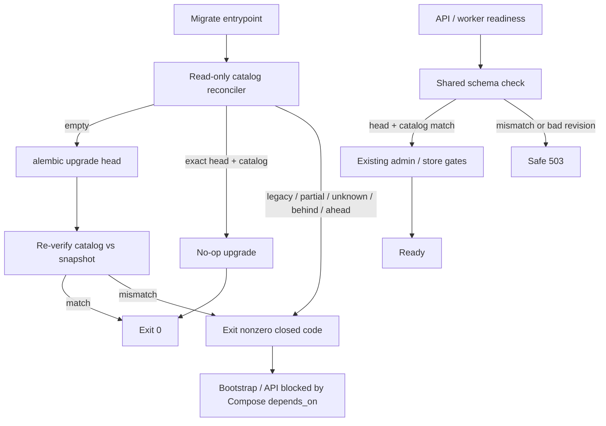

# P12-01 Fresh-Install and Unsupported Populated Compatibility - Plan

## Goal Capsule

- **Objective:** Unblock master-build-plan P12-01 on Path 1 (unsupported populated legacy upgrade): prove PostgreSQL 16 empty fresh-install to the current Alembic head; add a read-only migration preflight that accepts only empty DB or exact current target catalog/head and refuses every named bad state before Alembic writes; extend startup readiness to require the same catalog match for populated Phase 1 data; ship a versioned expected-catalog snapshot, minimal synthetic populated-current-target fixtures, brief operator refusal/go-no-go notes, and inventory/evidence plus DRIFT-33/tracker closure language.
- **Authority:** Root `AGENTS.md`; `docs/master-build-plan.md` P12-01 and § Populated-database compatibility barrier; `docs/architecture/legacy-persistence-retirement.md`; `docs/database-schema.txt`; `docs/quality/definition-of-done.md` migration gate; DRIFT-33 in `docs/brownfield-refactor-register.md`; P1-01 / P1-04 / P10-02 evidence patterns.
- **Execution profile:** Inventory-first brownfield; shared catalog comparator; dedicated migrate entrypoint (not `env.py`); PostgreSQL 16 real-boundary refusal matrix; smoke/runtime proof for Compose migrate wiring; characterization of existing head-only readiness before extending it.
- **Readiness checkpoint:** Implementation-ready after 2026-07-28 Path 1 choice and scoping confirmation (versioned pg_catalog snapshot; minimal synthetic populated fixtures; brief runbook notes in-slice).
- **Stop conditions:** Stop if DONE pressure pulls in Path 2 supported upgrade/contraction, live legacy census as migration authorization, Wiki table drops on populated DBs, P12-04 backup/restore/HA drills, P12-02 full suite convergence, Redis/Celery/Kubernetes, or treating P1-01 in-rebuild baseline→head retained-row proof as legacy-upgrade evidence.
- **Tail ownership:** P12-04 owns backup/restore/image rollback/failed-worker drills; P12-02 owns full suite/contract snapshot convergence; P12-08 owns production acceptance; Phase 3 owns any future Wiki contract.

---

## Product Contract

### Summary

P12-01 closes the populated-database compatibility barrier by choosing Path 1: refuse unknown/legacy populated upgrades, prove empty fresh-install and populated-current-target acceptance on PostgreSQL 16, and fail closed before migration or product writes on every named incompatible state. Product Contract authored in this bootstrap from the master-build-plan barrier and legacy-persistence-retirement authority; no upstream brainstorm file. Scope confirmed 2026-07-28 (Path 1; versioned catalog snapshot; minimal synthetic populated fixtures; brief operator notes in-slice).

Product Contract preservation: Product Contract authored here; no upstream brainstorm IDs to preserve.

### Problem Frame

Phase 1 schema is a clean-install target. Active ORM and package scans exclude Wiki, but Compose migrate still runs bare `alembic upgrade head`, and startup readiness only compares `alembic_version` to `SUPPORTED_ALEMBIC_HEAD`. A populated legacy or partial database can therefore be mutated or treated as ready without catalog reconciliation. Legacy-persistence-retirement blocks destructive contraction and states that the archive is not migration input. Until Path 1 preflight + catalog-aware startup + PG16 fixtures exist, P12-01 stays `BLOCKED` and DRIFT-33 cannot honestly close.

### Actors

| Actor | Role |
| --- | --- |
| Operator / developer | Runs Compose/dev migrate; needs closed refusal codes and go/no-go actions |
| Coding agent | Implements comparator, preflight, readiness extension, fixtures, evidence |
| Reviewer | Confirms Path 2 / backup / contraction remain out of DONE claims |

### Key Flows

**F1 — Fresh empty install.** Empty PG16 DB → migrate preflight accepts empty → Alembic upgrade to head → post-upgrade catalog matches snapshot → bootstrap → API/worker readiness OK.

**F2 — Populated current-target.** DB at exact head with catalog match and minimal valid Phase 1 rows → migrate preflight accepts (upgrade no-op) → startup readiness OK.

**F3 — Migrate refusal before writes.** Legacy / partial / renamed / unknown-object / unknown-history / behind / ahead / forbidden extension → preflight refuses with closed reason code; Alembic never mutates.

**F4 — Startup refusal.** Same incompatible catalog/revision states → readiness fails closed with safe public `503`; `/health/live` stays process-only; no product writes.

**F5 — Release-step wiring.** Compose migrate and `scripts/dev.sh` invoke the dedicated preflight→upgrade entrypoint; API/worker never migrate.

### Requirements

**Inventory and ownership**

- R1. Inventory current migrate/readiness/catalog gaps and dispositions in `docs/_scratch/p12-01-populated-compatibility-inventory.md` (`retain` / `modify` / `add` / `defer`).
- R2. Record evidence in `docs/_scratch/p12-01-populated-compatibility-evidence.md`; update `docs/master-build-plan.md` P12-01 and DRIFT-33 with honest Path 1 closure language and residuals (Path 2 unsupported; P12-04 backup drills).

**Fresh-install proof**

- R3. Against disposable PostgreSQL 16, prove empty database → preflight accept → upgrade to current single head → post-upgrade catalog equals versioned snapshot → `alembic check` succeeds → app factory still does not mutate schema.
- R4. Keep in-rebuild baseline→head retained-row proof as supported rebuild evidence only; never claim it as legacy-upgrade proof.

**Expected catalog**

- R5. Freeze a versioned expected-catalog snapshot keyed to `SUPPORTED_ALEMBIC_HEAD`, generated from a pristine head install via normalized `pg_catalog` inventory (relations, enums/types, constraints, indexes including partial/expression, triggers, functions, views, dependencies) plus approved system-schema and extension allowlists with extension version pins where applicable.
- R6. Snapshot and head constant update atomically in the same change that adds a migration; fail closed if snapshot key ≠ runtime head.

**Migration preflight (Path 1)**

- R7. Provide a dedicated release entrypoint that runs read-only preflight **before** any Alembic write (`ensure_version` / upgrade / stamp). Do not hook primary refuse logic in `migrations/env.py`.
- R8. Preflight accepts only: (a) empty database, or (b) exact current target catalog + Alembic head. Empty means no application objects, no `alembic_version`, and only allowlisted system schemas/extensions (use `template0`-style pristine fixtures where the harness can).
- R9. Preflight refuses before writes for: legacy objects (including deferred Wiki table names), partial schema, renamed objects, unknown objects, unknown history, behind head, ahead head, and forbidden/unknown extensions. Emit closed reason codes only.
- R10. On refusal, exit non-zero so Compose `migrate` fails and bootstrap/api/worker do not proceed; prove Alembic mutation count is zero on refuse paths.
- R11. After a successful upgrade from empty, re-verify live catalog against the snapshot before the entrypoint exits success (covers mid-chain failure → partial on retry).

**Startup readiness**

- R12. Extend shared schema readiness used by API and worker to require exact head **and** catalog match against the snapshot. Populated Phase 1 data at exact matching catalog is accepted.
- R13. Public HTTP envelope stays safe `503 dependency_unavailable` with private internal reasons; do not serialize catalog diffs, object names that disclose foreign DBs, DSNs, or stack traces.
- R14. `/health/live` remains process-only when ready fails for schema/catalog reasons. Worker readiness still omits the administrator bootstrap gate.

**Fixtures and operator notes**

- R15. Minimal synthetic populated-current-target fixture at head (enough rows for readiness success — e.g. enabled admin — not the full demo seed package).
- R16. Named PG16 fixtures for every Path 1 refusal class in R9, plus exact-head-with-extra-legacy-objects and exact-head-with-missing-objects.
- R17. Brief operator notes in `docs/operations/compose-stack-runbook.md` (and/or a short sibling under `docs/operations/`) mapping closed reason codes to go/no-go actions (provision fresh DB / restore current-head backup / do not bootstrap / do not force upgrade). No Path 2 procedures.

**Verification boundary**

- R18. PostgreSQL 16 real-boundary tests are the compatibility proof; SQLite is not evidence. Unit tests may cover pure comparator classification without a live server.
- R19. Extend Compose/dev contract tests so migrate is no longer bare `alembic upgrade head`.

### Acceptance Examples

- AE1. Empty PG16 volume: migrate entrypoint succeeds; catalog matches snapshot; after bootstrap, `/health/ready` returns ready.
- AE2. Head + matching catalog + enabled admin: preflight accepts; upgrade is no-op; readiness ready.
- AE3. Head revision with `wiki_pages` present: preflight refuses; `alembic_version` and table set unchanged; startup would also refuse.
- AE4. Behind head (baseline-only): preflight refuses `behind`/`partial` class; no upgrade runs.
- AE5. Ahead or unknown `alembic_version`: preflight and startup refuse; public ready body does not contain revision strings.
- AE6. Compose migrate command invokes preflight→upgrade; bootstrap depends on migrate success only.

### Success Criteria

- P12-01 can leave `BLOCKED` with Path 1 evidence attached.
- Every master-build-plan Path 1 named refusal has a fixture.
- DRIFT-33 populated-compatibility half closes or honestly records only Path 2 / backup residuals.

### Scope Boundaries

#### In scope

- Path 1 preflight, catalog snapshot, startup catalog match, PG16 proofs, Compose/dev wiring, brief runbook notes, inventory/evidence/tracker updates.

#### Deferred to Follow-Up Work

- Shared disposable-PostgreSQL harness extraction across the ~17 duplicated test modules (optional if P12 duplication becomes painful; not required for DONE).
- Capturing this slice into a new `docs/solutions/` learning after landing (corpus currently absent).

#### Deferred for later (other P12 / future)

- Path 2 supported populated upgrade and contraction.
- P12-04 backup/restore, image rollback, failed-worker recovery drills.
- P12-02 full suite / contract snapshot convergence.
- Production HA / TLS / stream-drain evidence.

#### Outside this product's identity

- Phase 3 Wiki publication schema/APIs as an upgrade target.
- Using the phase-archive Wiki service as migration authorization.

### Dependencies / Assumptions

- P0–P11 phase outcomes required by the tracker are complete for this slice; P11-04 remains product-deferred and is not a P12-01 dependency.
- Current head pin in code is `f1a8c3d04e92` (must be re-read at implementation time; snapshot keys to whatever `SUPPORTED_ALEMBIC_HEAD` is then).
- “Valid populated Phase 1 data” at startup means catalog match plus existing bootstrap/admin and object-store gates — not a full row-level integrity census (that stays with backup/restore drills).

### Outstanding Questions

- None blocking. Deferred: whether a future Path 2 release ever becomes warranted (product decision outside this plan).

### Sources

- `docs/master-build-plan.md` (P12-01; populated-database compatibility barrier)
- `docs/architecture/legacy-persistence-retirement.md`
- `docs/database-schema.txt`
- `docs/brownfield-refactor-register.md` (DRIFT-33)
- `docs/_scratch/p1-01-foundation-evidence.md`, `docs/_scratch/p1-04-health-readiness-evidence.md`, `docs/_scratch/p10-02-stack-smoke-evidence.md`
- `app/context_engine/services/readiness.py`, `app/tests/test_postgres_foundation.py`, `app/compose.stack.yml`

---

## Planning Contract

### Key Technical Decisions

- KTD1. **Path 1 only.** Unsupported populated legacy upgrade; no contraction/write upgrade path in this slice.
- KTD2. **Shared comparator, two policies.** One `pg_catalog`-based reconciler; migrate preflight accepts empty OR exact head+catalog; startup accepts exact head+catalog (populated data OK); empty is not a startup-ready state without bootstrap.
- KTD3. **Versioned snapshot artifact.** Normalize and freeze expected catalog from a pristine head install under `app/context_engine/schema_snapshots/` (runtime-loadable with the service package, not test-only); key filename/metadata to `SUPPORTED_ALEMBIC_HEAD`; regenerate in the same PR as head changes.
- KTD4. **Dedicated migrate entrypoint.** e.g. `python -m context_engine.migrate_release` (name flexible) runs read-only preflight then `alembic upgrade head` then post-upgrade catalog verify. Not primary gate in `env.py`.
- KTD5. **`pg_catalog` authority over `information_schema`.** Exact-match refuse uses `pg_catalog` (+ normalized defs); `information_schema` alone is insufficient for triggers/partials/enums completeness.
- KTD6. **Closed reason codes.** Internal codes such as `empty_ok`, `current_target_ok`, `legacy_database_refused`, `partial_schema`, `renamed_object`, `unknown_object`, `unknown_history`, `revision_behind`, `revision_ahead`, `extension_refused`, `catalog_mismatch`, `snapshot_head_mismatch`. HTTP stays generic; CLI prints code + short action only.
- KTD7. **Legacy recognition seeds from Phase 1 negative constants.** Extract/share `DEFERRED_WIKI_TABLES` and related deferred column/kind names in a production module (`schema_deferred.py`); comparator and fixtures import from there; archive is recognition input, not upgrade input.
- KTD8. **Mirror disposable PG harness.** Follow `test_postgres_foundation.py` opt-in/env/PG16/teardown patterns with a `ce_p1201_*` database name prefix rather than a repo-wide harness refactor.
- KTD9. **Post-upgrade re-verify.** Successful empty→head upgrades must re-check catalog vs snapshot before exit 0 so partial upgrades fail closed on retry.

### Assumptions

- Confirmed scope bets: versioned catalog snapshot (not derive-only at runtime without an artifact); minimal synthetic populated fixtures; brief operator notes in this slice.
- Extension allowlist includes versions where the cluster may differ; unknown extension versions refuse.
- Mid-upgrade kill is modeled as `partial` on next preflight (no automatic repair).

### Alternative Approaches Considered

| Approach | Why not |
| --- | --- |
| Path 2 supported upgrade | No recoverable populated-legacy Alembic lineage; product chose Path 1 |
| Head-only readiness forever | Barrier explicitly requires catalog reconciliation |
| Preflight inside `env.py` | Couples stamp/downgrade/autogenerate; Alembic may create `alembic_version` before refuse runs |
| `information_schema`-only diffs | Incomplete for objects the barrier enumerates |
| Full demo seed for F2 | Confirmed out; minimal synthetic rows suffice |

### High-Level Technical Design

**Policy matrix (directional):**

| Live state | Migrate preflight | Startup readiness |
| --- | --- | --- |
| Empty (allowlisted system only) | Accept → upgrade | Not ready (`schema` / bootstrap as today after empty) |
| Exact head + catalog match | Accept → no-op | Accept if admin/store gates pass |
| Behind / partial / ahead / unknown history | Refuse | Refuse |
| Exact head + extra/legacy/missing objects | Refuse | Refuse |
| Snapshot key ≠ runtime head | Refuse / fail closed | Refuse / fail closed |

### Implementation Constraints

- Migrations remain an explicit release step; replicas never migrate on startup.
- App factory must not create/alter schema.
- Secret-safe operator and HTTP surfaces; detailed diffs only in private debug logs if needed.
- Do not invent public HTTP fields or endpoints for preflight.
- SQLite is not compatibility evidence.

### Sequencing

1. Inventory (U1)
2. Comparator + snapshot (U2)
3. Migrate entrypoint + Compose/dev wire (U3)
4. Startup readiness adoption (U4)
5. PG16 proof matrix (U5)
6. Runbook + evidence + tracker (U6)

U3 and U4 both depend on U2; U5 depends on U3+U4; U6 closes after proofs.

### External Research Notes

Load-bearing findings applied to KTDs:

- Preflight must run before Alembic starts (Alembic can create `alembic_version` early).
- Freeze normalized `pg_catalog` manifests keyed to head; regenerate with migrations.
- Prefer `pg_catalog` over `information_schema` for refuse-legacy completeness.
- Empty ≠ absent `public` schema; means no user/app objects + allowlisted extensions only; prefer `template0` for pristine fixtures.

---

## Implementation Units

### U1. Inventory Path 1 compatibility seams

**Goal:** Record retain/modify/add dispositions before code changes.

**Requirements:** R1

**Dependencies:** None

**Files:**
- Create: `docs/_scratch/p12-01-populated-compatibility-inventory.md`
- Reference: `docs/architecture/legacy-persistence-retirement.md`, `docs/master-build-plan.md`, `app/context_engine/services/readiness.py`, `app/compose.stack.yml`, `scripts/dev.sh`, `app/tests/test_postgres_foundation.py`, `app/tests/test_phase_one_schema_scope.py`

**Approach:** Enumerate migrate command, readiness head check, absence of catalog snapshot/preflight, Wiki deferred names, HEAD pin fan-out, and Compose/dev entrypoints. Disposition each seam. Explicit non-claims: Path 2, backup drills.

**Test scenarios:** Test expectation: none -- inventory-only documentation unit.

**Verification:** Inventory names every Path 1 refusal class and the two guards (migrate vs startup).

---

### U2. Catalog reconciler and versioned snapshot

**Goal:** Shared read-only comparator plus frozen expected-catalog artifact keyed to current head.

**Requirements:** R5, R6, KTD2–KTD3, KTD5–KTD7

**Dependencies:** U1

**Files:**
- Create: `app/context_engine/services/schema_compatibility.py` (name flexible)
- Create: `app/context_engine/schema_snapshots/<head>.json` (exact naming flexible; head must be embedded in metadata)
- Create: `app/tests/test_schema_compatibility_unit.py`
- Create: `app/context_engine/schema_deferred.py` (or equivalent production module) exporting `DEFERRED_WIKI_TABLES` and related deferred names for runtime comparator use
- Modify: `app/tests/test_phase_one_schema_scope.py` to import deferred-name constants from the production module
- Create: small generator under `app/context_engine/` or `app/scripts/` used by tests/maintainers to rebuild the snapshot from a pristine head DB

**Approach:** Implement normalized inventory collection via `pg_catalog`, diff against snapshot, classify into closed reason codes. Load the snapshot from the service package at runtime (API/worker/migrate share one artifact). Snapshot metadata must embed the Alembic head. Unit tests cover classification with fixture inventories (no live PG required for pure diff cases). Generation path documented so the next migration regenerates atomically with `SUPPORTED_ALEMBIC_HEAD`.

**Execution note:** Implement comparator classification test-first with synthetic inventory fixtures before wiring live PG.

**Patterns to follow:** `ReadinessError` closed-reason style in `readiness.py`; deferred Wiki names from `schema_deferred.py` (extracted from today's test-only constants).

**Test scenarios:**
- Happy path: identical inventories → current-target OK; empty inventory + no revision → empty OK.
- Edge: snapshot head metadata ≠ configured `SUPPORTED_ALEMBIC_HEAD` → `snapshot_head_mismatch`.
- Error: extra Wiki table → `legacy_database_refused` / unknown-object class; missing required table → `partial_schema`; renamed relation identity → `renamed_object`; unknown extension → `extension_refused`.
- Integration: generator+comparator round-trip against a recorded pristine inventory fixture stays stable under sort/normalization.

**Verification:** Unit suite green; snapshot file committed and keyed to current head.

---

### U3. Migrate release entrypoint and Compose/dev wiring

**Goal:** Refuse before writes; wire release steps to preflight→upgrade→post-check.

**Requirements:** R7–R11, R19, F5, AE6

**Dependencies:** U2

**Files:**
- Create: `app/context_engine/migrate_release.py` (or equivalent module entrypoint)
- Modify: `app/compose.stack.yml` (`migrate.command`)
- Modify: `scripts/dev.sh` (and `scripts/dev.ps1` if it also runs Alembic)
- Modify: `app/tests/test_compose_stack_config.py`
- Create or extend: `app/tests/test_migrate_release.py` (unit tests for entrypoint orchestration with fakes; upgrade not called on refuse)

**Approach:** Entrypoint opens a read-only connection, runs reconciler policy for migrate, exits nonzero on refuse without invoking Alembic. On empty accept, run upgrade, then re-verify catalog. On current-target accept, allow no-op upgrade. Keep `restart: "no"` and `depends_on` topology. Contract-test Compose YAML for the new command shape.

**Patterns to follow:** `bootstrap_admin` one-shot module; P10 compose config tests.

**Test scenarios:**
- Happy: empty → preflight accept → upgrade called once → post-check pass → exit 0.
- Happy: current-target → upgrade may run no-op → exit 0.
- Error: refuse classes → upgrade not called → nonzero exit.
- Edge: snapshot head metadata ≠ `SUPPORTED_ALEMBIC_HEAD` at entrypoint load → refuse before Alembic (`snapshot_head_mismatch`, R6).
- Integration: Compose config asserts migrate command is the entrypoint, not bare `alembic upgrade head`.
- Edge: post-upgrade catalog mismatch → nonzero exit (partial trap).

**Verification:** Contract tests pass; entrypoint unit tests prove upgrade gating.

---

### U4. Startup readiness catalog match

**Goal:** API and worker refuse catalog mismatch / bad revision before product writes.

**Requirements:** R12–R14, F4, AE5

**Dependencies:** U2

**Files:**
- Modify: `app/context_engine/services/readiness.py`
- Modify: `app/tests/test_health_contract.py`
- Modify: `app/tests/test_postgres_foundation.py` (P1-04 readiness scenarios) and/or `app/tests/test_worker_readiness.py`

**Approach:** `check_database_schema` (or a shared helper it calls) requires exact head and catalog match. Preserve private reason codes and public safe `503`. Characterization: existing head-only tests still pass; add catalog-mismatch cases. Worker path shares schema check without admin requirement.

**Execution note:** Add characterization coverage for current head-only behavior before widening the check.

**Patterns to follow:** `test_health_contract.py` privacy assertions (`"ahead" not in response.text`).

**Test scenarios:**
- Happy: head + matching catalog (+ admin for API) → ready.
- Error: head + extra legacy table → not ready; live still 200.
- Error: behind/ahead/unknown revision → not ready; body omits revision strings.
- Integration: worker readiness fails on catalog mismatch without requiring admin.

**Verification:** Health contract + worker readiness tests green; public envelope unchanged.

---

### U5. PostgreSQL 16 Path 1 proof matrix

**Goal:** Real-boundary proof for fresh-install, populated-current-target, and every named refusal.

**Requirements:** R3, R4, R8–R11, R15, R16, R18, AE1–AE5, F1–F3

**Dependencies:** U3, U4

**Files:**
- Create: `app/tests/test_postgres_migration_preflight.py`
- Possibly extend: `app/tests/test_postgres_foundation.py` for current-head fresh-install reaffirmation
- Fixtures: SQL/setup helpers colocated with the new test module

**Approach:** Disposable DB harness mirroring foundation (`ce_p1201_{label}_{uuid}`). Prove F1 end-to-end through entrypoint. Prove F2 with minimal synthetic admin (and only other rows needed). For each refusal class, mutate a head or empty DB into that state, run preflight, assert nonzero + zero Alembic mutations; where applicable assert startup readiness also fails. Include exact-head+Wiki-extra and exact-head+missing-table. Model partial via baseline-only or deliberately incomplete object set.

**Execution note:** Prefer install/runtime smoke verification on the entrypoint against disposable PG; keep refusal matrix deterministic and network-free aside from local PG16.

**Patterns to follow:** `test_postgres_foundation.py` opt-in, PG16 assert, teardown; Wiki names from phase-one schema scope.

**Test scenarios:**
- Covers AE1. Empty → entrypoint success → head + snapshot match → `alembic check` succeeds (R3) → readiness after bootstrap.
- Covers AE2. Minimal populated current-target → preflight accept → readiness ready.
- Covers AE3. Wiki table at head → refuse; mutation count 0.
- Covers AE4. Behind/partial → refuse; mutation count 0.
- Covers AE5. Ahead/unknown history → refuse; HTTP ready body secret-safe.
- Edge: forbidden extension on otherwise empty DB → refuse.
- Edge: renamed application relation → refuse `renamed_object`.
- Error: unknown extra table → refuse `unknown_object`.
- Integration: after simulated partial upgrade state, next preflight refuses before further writes.
- Negative: app factory on empty DB still creates no tables.

**Verification:** Focused PG suite passes under documented opt-in env vars; evidence will cite the command.

---

### U6. Operator notes, evidence, and tracker closure

**Goal:** Operators know go/no-go actions; P12-01/DRIFT-33 language becomes honest.

**Requirements:** R2, R17, AE6

**Dependencies:** U5

**Files:**
- Modify: `docs/operations/compose-stack-runbook.md`
- Create (optional short sibling): `docs/operations/migration-preflight-runbook.md` if the compose runbook would become overloaded
- Create: `docs/_scratch/p12-01-populated-compatibility-evidence.md`
- Modify: `docs/master-build-plan.md` (P12-01 status/closure note)
- Modify: `docs/brownfield-refactor-register.md` (DRIFT-33)
- Possibly modify: `docs/architecture/legacy-persistence-retirement.md` status line to note Path 1 decision + proof location (no Path 2 authorization)

**Approach:** Document boot order with preflight→upgrade, closed reason code → action table, and explicit non-claims (no supported legacy upgrade; no backup drill completion). Evidence records commands, PG16 version, fixture matrix results, safety controls, and residuals for P12-04/Path 2.

**Test scenarios:** Test expectation: none -- documentation/evidence unit; Compose contract coverage owned by U3.

**Verification:** Tracker shows P12-01 DONE (or equivalent) only with evidence path cited; DRIFT-33 populated half closed or residual explicitly Path 2-only.

---

## Verification Contract

- Unit: `app/tests/test_schema_compatibility_unit.py`, `app/tests/test_migrate_release.py`, extended `test_health_contract.py` / `test_worker_readiness.py`, `test_compose_stack_config.py`.
- PostgreSQL 16 (opt-in): `app/tests/test_postgres_migration_preflight.py` (+ any foundation extensions), with `CONTEXT_ENGINE_ALLOW_DISPOSABLE_DATABASE_TESTS=1` and `CONTEXT_ENGINE_TEST_POSTGRES_ADMIN_URL`; fresh-install path asserts post-upgrade `alembic check` (R3).
- Evidence record: `docs/_scratch/p12-01-populated-compatibility-evidence.md` must name artifact/source revision, PG major version, and residual Path 2 / P12-04 items.
- Root `scripts/verify.sh` need not become a live Docker migrate-refusal gate; focused PG + contract tests are the P12-01 boundary.
- Privacy: refusal HTTP/CLI surfaces scanned for DSN, revision dumps, and forbidden object enumeration in public channels.

## Definition of Done

- All R1–R19 satisfied for Path 1; AE1–AE6 proven or explicitly evidenced.
- U1–U6 complete; abandoned experimental code removed.
- Fresh-install and populated-current-target succeed on PostgreSQL 16; every named refusal refuses before Alembic writes.
- Startup catalog match is enforced for API and worker schema readiness.
- Compose/dev migrate entrypoints no longer bare `alembic upgrade head`.
- Operator notes document closed codes and non-claims.
- `docs/master-build-plan.md` P12-01 and DRIFT-33 updated with evidence pointers and honest residuals.
- No Path 2 contraction, backup-drill completion, or legacy archive-as-authorization claims.

---

## System-Wide Impact

- **Release step:** migrate service becomes fail-closed on incompatible volumes — operators with dirty local volumes must recreate or restore current-head backups.
- **Readiness:** databases that previously passed on head-only checks will 503 if catalog drifts — intentional.
- **Head-pin fan-out:** future migrations must regenerate the snapshot alongside `SUPPORTED_ALEMBIC_HEAD` and test pins.
- **Downstream:** unlocks P12-04 to assume Path 1 refusal semantics when designing backup/restore drills.

## Risks & Dependencies

| Risk | Mitigation |
| --- | --- |
| Snapshot drift vs ORM/`alembic check` | Post-upgrade snapshot verify + unit drift tests; regenerate with every head change |
| Noisy false refuses from cluster extensions | Explicit extension allowlist with versions; document Compose `postgres:16` image assumptions |
| Partial upgrade then retry | Next preflight classifies `partial` and refuses further writes; runbook action is restore empty or current-head backup — never continue upgrade |
| Duplicate PG harness churn | Mirror foundation helpers; defer shared harness extract |
| Operators run bare `alembic` bypassing entrypoint | Wire Compose/dev; runbook forbids bare upgrade on unknown volumes; cannot fully police manual CLI |
| Local dirty volumes suddenly fail migrate | Expected Path 1 behavior; runbook says recreate volume or restore current-head backup |
| Stale scratch docs citing old heads | Evidence uses live `SUPPORTED_ALEMBIC_HEAD` only |
| Catalog dumps leak into logs/HTTP | Closed codes only on operator/HTTP channels; optional private debug logging stays off by default |

## Documentation / Operational Notes

- Update compose runbook boot step 2 to preflight→upgrade.
- Keep altitude: development/release-step Path 1 gate, not production HA acceptance.
- Point residuals explicitly at P12-04 for backup/restore proof.
