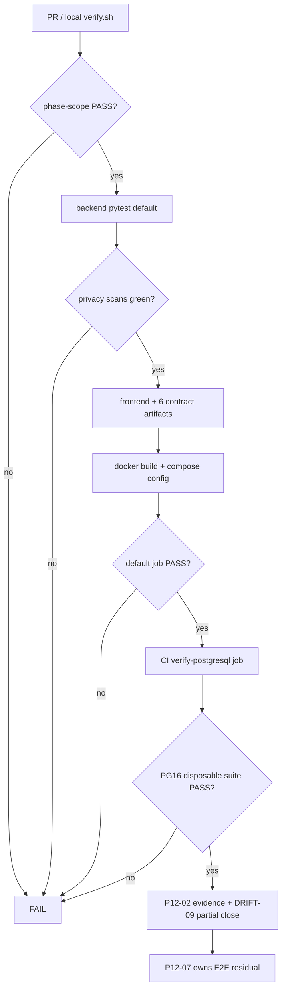

# P12-02 Full Suite and Contract Snapshot Convergence - Plan

## Goal Capsule

- **Objective:** Close master-build-plan P12-02 by making the pinned root verification loop honestly green for the full Phase 1 backend, frontend, adapter, Docker (image build + Compose config), privacy-scan, and six-artifact contract-snapshot surface after P0–P11 — including a CI PostgreSQL 16 disposable-test job — and record DRIFT-09 partial closure with E2E still owned by P12-07.
- **Authority:** Root `AGENTS.md`; `docs/master-build-plan.md` P12-02 and Documentation/application gates (B0); `docs/quality/definition-of-done.md` root verification gate; `docs/brownfield-refactor-register.md` DRIFT-09; `docs/_scratch/p0-06-generated-contract-inventory.md`; P8/P10/P12-01 evidence and plan stop conditions.
- **Execution profile:** Fix current verify reds first; wire privacy and PG into the gate without absorbing live Compose smoke or Playwright; freeze/regenerate the registered contract surface only; evidence + tracker closure.
- **Readiness checkpoint:** Implementation-ready after 2026-07-28 scoping confirmation (Docker config-level; privacy in gate; browser E2E deferred; registered-surface contract freeze).
- **Stop conditions:** Stop if DONE pressure pulls in live Compose smoke, Playwright/production browser matrix, deployed-ingress SSE/stream-drain/TLS, SBOM/provenance manifests, Path 2 migration, backup drills, broader handwritten response-DTO adoption (DRIFT-01), or inventing unregistered catalog routes via snapshot regen.
- **Tail ownership:** P12-03 adversarial security review; P12-04 backup/restore drills; P12-05 deployed-ingress SSE/drain; P12-06 immutable artifact/SBOM; P12-07 accessibility/browser E2E/capacity; P12-08 production acceptance.

---

## Product Contract

### Summary

Bring `scripts/verify.sh` and GitHub Actions to an honest green baseline covering backend (including adapter suites), frontend, Docker image build + Compose config, privacy scans, and OpenAPI/SSE/DTO/TypeScript snapshot convergence — with a separate CI job for disposable PostgreSQL 16 proofs. Product Contract authored in this bootstrap from the master-build-plan deliverable and DoD root-gate contract; no upstream brainstorm file. Scope confirmed 2026-07-28.

Product Contract preservation: Product Contract authored here; no upstream brainstorm IDs to preserve.

### Problem Frame

P0-05 installed a pinned root loop that passes its *current* checks, but DRIFT-09 remains `IN_PROGRESS` until that gate covers contracts, Postgres, backend, frontend, privacy, E2E, and containers. Research on 2026-07-28 shows three active failures (phase-scope manifest missing six plans; production-scope deferred-marker false positive on `schema_deferred.py`; cross-sink privacy scan broken by P12-01 catalog compatibility on SQLite). Privacy scans ride default pytest but are not named in the gate; PostgreSQL suites skip in CI (~47 tests); Playwright and live Compose smoke are correctly owned elsewhere. Until the gate is honestly green for the in-scope surface and residuals are explicit, P12-02 cannot close and later P12 slices attach to a drifting suite.

### Actors

| Actor | Role |
| --- | --- |
| Developer / coding agent | Runs local verify; regenerates contracts; fixes suite blockers |
| CI operator | Relies on required GitHub Actions jobs for PR merge |
| Reviewer | Confirms DONE does not claim E2E, live smoke, or DRIFT-01 response adoption |

### Key Flows

**F1 — Default local/CI verify (no PostgreSQL).** Operator runs `scripts/verify.sh` → phase-scope, locks, backend lint + non-PG pytest (privacy scans green), frontend lock/typecheck/test/build, six-artifact contract compare + adversarial fixtures, Docker image build, Compose config → exit 0.

**F2 — Disposable PostgreSQL CI job.** Workflow starts PG16 service with opt-in env → runs `test_postgres_*.py` suite → exit 0; local without env continues to skip PG modules.

**F3 — Contract snapshot refresh.** Producer change → regenerate six committed artifacts from shared registrar → byte-compare gate pass; registered-vs-catalog delta remains explicit (no invented routes).

**F4 — Evidence and tracker closure.** Green default verify + green PG job recorded → DRIFT-09 backend/CI half closed with E2E residual → P12-02 DONE.

### Requirements

**Unblock and converge the suite**

- R1. Classify the six missing plans in `docs/phase-scope-manifest.md` so phase-scope documentation and fixture gates pass.
- R2. Stop the production-scope deferred-marker false positive on the P12-01 recognition module without weakening global Wiki marker scans.
- R3. Restore P8-03 cross-sink privacy scan success on the default (SQLite) pytest path without disabling real catalog-compatibility refusal on PostgreSQL readiness proofs.
- R4. Keep adapter fixture suites (`parser`, `synthesis`, LightRAG renderer, object storage, runtime controller, compose config) in the default backend pytest path; do not require live Docker controller or optional parser/synthesis extras in the root gate.

**Root gate composition**

- R5. Keep Docker altitude at image build + Compose config with placeholder ingress env; do not make `scripts/verify.sh` a mandatory live Compose smoke gate (P10/P12-01 precedent).
- R6. Make privacy scans an explicit root-gate concern: the three P8 scan modules must run and pass under the default backend pytest step (or an equivalently named verify step), not merely exist as optional files.
- R7. Add a required CI job that runs disposable PostgreSQL 16 tests under the existing opt-in env contract; keep the default job able to skip PG when the env is unset.
- R8. Leave production Playwright / visual matrix / two-user cache browser proofs to P12-07; do not wire them into verify as merge blockers in this slice.
- R9. Leave deployed-ingress SSE, stream-drain, TLS, and direct-API denial to P12-05.

**Contract snapshot convergence**

- R10. Prove the six committed artifacts regenerate byte-for-byte via `scripts/check-generated-contracts.sh` and adversarial stale fixtures: `app/contracts/openapi.json`, `public-dtos.schema.json`, `sse-events.schema.json`, `sse-events.openapi.json`, `app/client/src/lib/api/generated/openapi.ts`, `sse.ts`.
- R11. If snapshots are stale, regenerate from the shared contract registrar only; never invent unregistered catalog routes or claim broader handwritten response-DTO adoption (DRIFT-01 residual stays open).
- R12. Confirm committed SSE transcript fixtures remain schema-valid under the existing generated-SSE contract tests.

**Evidence and tracker**

- R13. Record commands/results and skip boundaries in `docs/_scratch/p12-02-suite-contract-convergence-evidence.md`.
- R14. Update `docs/master-build-plan.md` P12-02 to DONE with residuals; update DRIFT-09 to honest partial closure (E2E residual P12-07); refresh the stale verify paragraph in `docs/tech-stack.md`.

### Acceptance Examples

- AE1. `bash scripts/verify.sh` exits 0 with named PASS for phase-scope, backend tests (including privacy scans), contracts, frontend, Docker build, and Compose config.
- AE2. CI `verify-postgresql` (or equivalent) job runs disposable PG16 suites with opt-in env and exits 0.
- AE3. Mutating one committed contract artifact causes the adversarial fixture gate to fail; restoring it passes.
- AE4. Evidence doc lists explicit out-of-scope residuals: live Compose smoke, Playwright E2E, DRIFT-01 response adoption, P12-05/06/07/08 owners.

### Scope Boundaries

**In scope**

- Phase-scope manifest sync; P12-01 suite regressions; privacy green on default pytest; CI PG16 job; contract snapshot freeze/regen; verify/CI honesty; evidence + DRIFT-09/tracker/tech-stack updates.

**Out of scope / deferred**

- Live Compose smoke (`stack_smoke_*`) — P10 evidence-owned.
- Playwright production browser matrix, visual baselines, Settings F3 — P12-07.
- Deployed-ingress SSE/drain/TLS/direct-API denial — P12-05.
- SBOM, provenance, immutable release manifest — P12-06.
- Broader handwritten response DTO adoption — DRIFT-01 residual.
- Path 2 migration, backup/restore, adversarial security review, production acceptance — P12-01/03/04/08.

### Assumptions

- Confirmed scoping defaults: Docker stays config-level; privacy belongs in this gate; browser E2E stays P12-07; contract work freezes the registered surface only.
- Split CI jobs (default verify + PG) satisfy DoD “one pinned command or CI workflow with an immutable manifest” without forcing local developers to run PG for every verify.
- Module-scoped catalog-compatibility monkeypatch (matching `test_health_contract.py`) is the correct privacy-scan fix; global readiness bypass is not.
- DRIFT-09 may close its backend/CI half at P12-02 with E2E residual explicit; B0 stays incomplete until P12-07 browser proofs.

---

## Planning Contract

### Key Technical Decisions

| ID | Decision | Rationale |
| --- | --- | --- |
| KTD1 | Keep verify Docker at `docker build --target runtime` + `compose … config --quiet` | Settled P10-02 KTD7 / P10-03 KTD8 / P12-01; live smoke remains evidence-owned |
| KTD2 | Split CI: default `scripts/verify.sh` job + required `verify-postgresql` job with PG16 service and opt-in env | DoD/DRIFT-09 need Postgres proof; local-without-PG must stay usable |
| KTD3 | Privacy stays inside default backend pytest; name the three P8 modules in evidence and treat their green as a gate invariant | Avoids a second pytest invocation while making privacy non-optional |
| KTD4 | Fix cross-sink readiness with module-scoped `check_catalog_compatibility` bypass on SQLite paths only | Matches `test_health_contract.py` / `test_worker_readiness.py`; preserves PG refusal proofs |
| KTD5 | Allowlist `schema_deferred.py` (and peer recognition helpers already allowlisted in schema-scope) in production-scope deferred-marker scan | P12-01 intentionally contains Wiki markers for recognition; do not delete markers |
| KTD6 | Contract convergence = regenerate/compare six artifacts + SSE fixture validation; no response-DTO adoption sweep | User-confirmed; DRIFT-01 broader adoption remains vertical-owned |
| KTD7 | DRIFT-09 partial closure language at DONE | Full register wording includes E2E; over-claiming would falsify B0 |

### High-Level Technical Design

### Sequencing

1. Unblock current reds (manifest, production-scope, privacy) so default verify can go green.
2. Wire CI PostgreSQL job and document privacy as gate invariant.
3. Prove contract snapshot convergence (regen only if stale).
4. Evidence + tracker + tech-stack + DRIFT-09 partial closure.

### Patterns to Follow

- Verify composition: `scripts/verify.sh`, `.github/workflows/verify.yml`
- Contract gate: `scripts/check-generated-contracts.sh`, `scripts/tests/check-generated-contracts.sh`, `docs/_scratch/p0-06-generated-contract-inventory.md`
- Catalog bypass: `app/tests/test_health_contract.py`
- Wiki recognition allowlist: `app/tests/test_phase_one_schema_scope.py` (`_WIKI_RECOGNITION_ALLOWLIST`)
- PG opt-in: `CONTEXT_ENGINE_ALLOW_DISPOSABLE_DATABASE_TESTS` + `CONTEXT_ENGINE_TEST_POSTGRES_ADMIN_URL` in `test_postgres_*.py`
- Evidence template: `docs/_scratch/p12-01-populated-compatibility-evidence.md`, `docs/_scratch/p10-02-stack-smoke-evidence.md`
- Verify-vs-smoke boundary: P10-02/P10-03/P12-01 plans

### Risks and Dependencies

| Risk | Mitigation |
| --- | --- |
| PG CI job flaky / slow | Disposable DB pattern already used in package evidence; fail closed, no quarantine of privacy/security without owner |
| Docker build flake on runners | Prefer fix/retry once; do not drop image build from gate |
| Catalog bypass leaks into PG proofs | Keep monkeypatch module-scoped; PG preflight tests remain authoritative |
| Manifest classification wrong for P11-04 deferral plan | Classify as `active` `phase-1-child` like peers |
| Over-claiming DRIFT-09 / B0 | Evidence residuals table names P12-07 E2E explicitly |

### Open Questions

None blocking. Deferred to implementation: exact GitHub Actions service-container YAML details; whether verify.sh prints an explicit “privacy scans covered by backend pytest” banner (nice-to-have only).

---

## Implementation Units

### U1. Unblock default verify reds

**Goal:** Make phase-scope, production-scope, and cross-sink privacy pass so default `pytest` and the first verify steps are green.

**Requirements:** R1, R2, R3

**Dependencies:** None

**Files:**
- Modify: `docs/phase-scope-manifest.md`
- Modify: `app/tests/test_phase_one_production_scope.py`
- Modify: `app/tests/test_cross_sink_privacy_scan.py`
- Test: `app/tests/test_phase_one_production_scope.py`, `app/tests/test_cross_sink_privacy_scan.py`, `scripts/tests/check-doc-phase-scope.sh`

**Approach:**
- Add `scan-file` rows for the six unclassified plans (insert in bytewise sort order): `docs/plans/2026-07-27-017-feat-p11-02-composer-ref-discover-consume-plan.md`, `docs/plans/2026-07-27-018-feat-p11-03-assembly-fingerprint-replay-plan.md`, `docs/plans/2026-07-28-001-feat-p11-04-evidence-attach-deferral-plan.md`, `docs/plans/2026-07-28-002-feat-full-workstation-html-gallery-plan.md`, `docs/plans/2026-07-28-002-feat-p12-01-populated-compatibility-plan.md`, `docs/plans/2026-07-28-003-feat-p12-02-suite-contract-convergence-plan.md` — all `active` with appropriate phase-1 notes.
- Mirror schema-scope recognition allowlist into production-scope deferred-marker scan for `schema_deferred.py` (and any peer helpers already allowlisted there).
- Monkeypatch `check_catalog_compatibility` to no-op in the cross-sink privacy module the same way health-contract tests do for SQLite readiness success; do not change production readiness.

**Patterns to follow:** `test_phase_one_schema_scope.py` allowlist; `test_health_contract.py` catalog bypass.

**Test scenarios:**
- Happy path: phase-scope checker and fixtures pass with the six plans classified.
- Happy path: production-scope scan passes with `schema_deferred.py` present and Wiki markers still forbidden outside allowlist.
- Happy path: `test_cross_sink_privacy_scan_after_planted_mutations` gets ready `200` on SQLite after bypass and still asserts forbidden sentinels absent across sinks.
- Edge: a non-allowlisted production file containing `wiki_pages` still fails production-scope.
- Integration: default `pytest` (no PG env) reports 0 failures for these three areas.

**Verification:** Named failing tests green; phase-scope scripts PASS.

---

### U2. Root gate honesty — privacy invariant and PostgreSQL CI job

**Goal:** Make privacy and Postgres real parts of the pinned CI workflow without absorbing live smoke or E2E.

**Requirements:** R4, R5, R6, R7, R8, R9

**Dependencies:** U1

**Files:**
- Modify: `.github/workflows/verify.yml`
- Modify: `scripts/verify.sh` (only if a named privacy/banner or PG-aware note is needed; prefer minimal change)
- Create or modify: focused workflow comments / job names as needed
- Test: existing `app/tests/test_audit_privacy_scan.py`, `test_log_metric_privacy_scan.py`, `test_cross_sink_privacy_scan.py`, `app/tests/test_postgres_*.py`, `app/tests/test_compose_stack_config.py`

**Approach:**
- Keep default job = `bash scripts/verify.sh` (Docker build + compose config unchanged).
- Add required `verify-postgresql` job: PostgreSQL 16 service, set `CONTEXT_ENGINE_ALLOW_DISPOSABLE_DATABASE_TESTS=1` and admin URL, run disposable PG test selection (all `postgresql` marked tests or `tests/test_postgres_*.py`).
- Document in evidence that adapter suites ride default pytest; optional extras stay out.
- Do not invoke Playwright or `stack_smoke_*` from verify.

**Execution note:** Prefer proving the PG job against the same opt-in contract package evidence already uses; smoke-first on the workflow YAML once U1 is green.

**Patterns to follow:** P12-01 evidence env block; P10 verify placeholder env for compose config.

**Test scenarios:**
- Happy path: CI default job green without PG env (PG modules skipped, not failed).
- Happy path: CI PG job green with disposable DB; migration preflight / foundation tests execute.
- Error: PG job fails closed when disposable DB unavailable (no silent skip when opt-in env is set).
- Edge: local verify without PG still exits 0 after U1.
- Integration: compose config contract tests still pass under default pytest.

**Verification:** Both CI jobs required and green; local default verify green without PG.

---

### U3. Contract snapshot convergence

**Goal:** Prove six-artifact live/adversarial gates pass on the registered surface; regenerate only if stale; keep SSE transcript fixtures valid.

**Requirements:** R10, R11, R12

**Dependencies:** U1 (suite must be runnable); may parallelize with U2 once U1 lands

**Files:**
- Possibly regenerate: `app/contracts/openapi.json`, `app/contracts/public-dtos.schema.json`, `app/contracts/sse-events.schema.json`, `app/contracts/sse-events.openapi.json`, `app/client/src/lib/api/generated/openapi.ts`, `app/client/src/lib/api/generated/sse.ts`
- Touch only if stale: `scripts/generate_openapi.py`, `scripts/generate_json_schemas.py` (unlikely)
- Test: `scripts/check-generated-contracts.sh`, `scripts/tests/check-generated-contracts.sh`, `app/tests/test_generated_contract_gate.py`, `app/tests/test_generated_sse_contract.py`

**Approach:**
- Run live compare; if dirty, regenerate from shared registrar and commit.
- Confirm registered-route delta gate still documents catalog absences without inventing routes.
- Confirm SSE `.sse` fixtures validate.

**Patterns to follow:** `docs/_scratch/p0-06-generated-contract-inventory.md`; P9-05 KTD that freshness stays root script.

**Test scenarios:**
- Happy path: live snapshot compare PASS; adversarial stale fixture PASS.
- Error: single-byte corruption of any of the six artifacts fails the fixture gate.
- Edge: registered-vs-catalog delta remains explicit and unchanged in intent (no new routes from regen).
- Integration: frontend typecheck still consumes generated TS after regen.

**Verification:** Contract steps in verify PASS; no new handwritten public DTO substitutes introduced.

**Test expectation note:** If artifacts already match, unit is proof + evidence recording with no file churn — still run the gates.

---

### U4. Evidence, tracker, and DRIFT-09 partial closure

**Goal:** Record honest P12-02 DONE with residuals and update authority docs.

**Requirements:** R13, R14

**Dependencies:** U1, U2, U3

**Files:**
- Create: `docs/_scratch/p12-02-suite-contract-convergence-evidence.md`
- Modify: `docs/master-build-plan.md`
- Modify: `docs/brownfield-refactor-register.md` (DRIFT-09)
- Modify: `docs/tech-stack.md` (verify paragraph)

**Approach:**
- Evidence: commands/results for default verify, PG CI job, contract gates; residuals table pointing to P12-05/06/07/08 and DRIFT-01.
- Tracker: P12-02 DONE with evidence link.
- DRIFT-09: backend/CI half DONE language; E2E residual remains for P12-07; do not claim B0 complete.
- tech-stack: replace stale “privacy/SSE absent” claims with the actual boundary.

**Test scenarios:**
- Happy path: evidence lists AE1–AE4 outcomes with observed pass counts.
- Edge: residuals explicitly name Playwright and live smoke as out of DONE.
- Integration: master-build-plan P12-02 row points at evidence; DRIFT-09 status matches residual honesty.

**Verification:** Reviewer can confirm DONE claims match the scoped boundary without reading code.

---

## Verification Contract

| Gate | Proof |
| --- | --- |
| Phase-scope / production-scope | `scripts/check-doc-phase-scope.sh` and fixtures PASS; production-scope deferred-marker scan PASS |
| Default root verify | `bash scripts/verify.sh` → verification: PASS |
| Privacy invariant | P8 scan modules pass under default backend pytest |
| PostgreSQL CI | Required workflow job with opt-in env runs `test_postgres_*.py` green |
| Contracts | Live + adversarial six-artifact gates PASS |
| Docker altitude | Image build + compose config only; no live smoke in verify |
| Tracker honesty | Evidence + P12-02 DONE + DRIFT-09 partial + tech-stack refresh |

---

## Definition of Done

1. AE1–AE4 satisfied and recorded in `docs/_scratch/p12-02-suite-contract-convergence-evidence.md`.
2. Default verify green; required PG CI job green; privacy scans green on default pytest.
3. Six contract artifacts converge; no invented routes; DRIFT-01 response adoption not falsely closed.
4. Docker remains image-build + compose-config; Playwright and live smoke remain outside DONE.
5. `docs/master-build-plan.md` P12-02 DONE; DRIFT-09 updated with E2E residual; `docs/tech-stack.md` verify paragraph matches reality.
6. No quarantine of privacy/security acceptance tests without owner/reason/expiry (prefer fix).

---

## Sources & Research

- `docs/master-build-plan.md` P12-02; B0 / cross-phase gates
- `docs/quality/definition-of-done.md` root verification gate
- `docs/brownfield-refactor-register.md` DRIFT-09
- `scripts/verify.sh`, `.github/workflows/verify.yml`
- `scripts/check-generated-contracts.sh`, `docs/_scratch/p0-06-generated-contract-inventory.md`
- P8 evidence (`p8-01`…`p8-03`); P10-01/02/03 plans (verify-vs-smoke KTDs); P12-01 plan/evidence (PG opt-in; suite residual → P12-02)
- Live research 2026-07-28: three verify reds (manifest, production-scope, cross-sink privacy); 47 PG skips in default CI
- External research: skipped — strong local gate/contract/P10 patterns
