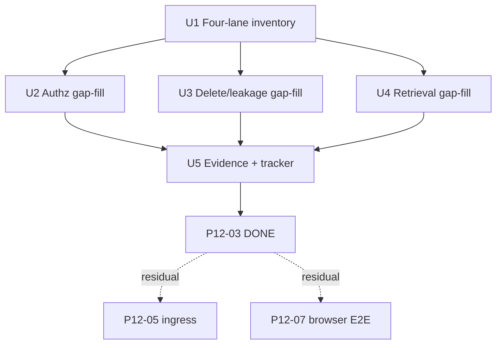

# P12-03 Adversarial Security Review - Plan

## Goal Capsule

- **Objective:** Close master-build-plan P12-03 by inventorying and adversarially re-proving four Phase 1 security surfaces after P8–P11 — authorization, secret/content leakage, deletion/redaction omission and fence recovery, and adversarial retrieval — at API/service/PostgreSQL altitude, then recording evidence and marking the tracker DONE.
- **Authority:** Root `AGENTS.md`; FR-01 / FR-08 / FR-09 in `docs/prd.md`; M-03, M-08, M-09, M-11, A-01, A-04, A-08, A-09, A-10, C-01, C-02, C-04, C-05 in `docs/interaction-behavior-prd.md`; `docs/architecture/security-operations-and-quality.md`; `docs/architecture/data-and-lifecycle.md` privacy classes and delete FSM; `docs/contracts/document-and-evidence-contract.md`; `docs/quality/definition-of-done.md` authorization/security/privacy and retrieval gates; DRIFT-29 / DRIFT-14 notes in `docs/brownfield-refactor-register.md`; prior evidence under `docs/_scratch/p1-03-*`, `p6-0*`, `p7-05-*`, `p8-0*`, `p9-03-*`, `p11-0*`, `p12-02-*`.
- **Execution profile:** Inventory-first brownfield review; cite existing green proofs as credit; add gap-fill adversarial tests only; fix only review blockers; no new product surfaces, ErrorCodes, or SSE event types.
- **Readiness checkpoint:** Implementation-ready after 2026-07-28 scoping confirmation (API/service/PG altitude; gap-fill remediation; browser/ingress deferred).
- **Stop conditions:** Stop if DONE pressure pulls in deployed-ingress TLS/direct-API denial (P12-05), Playwright/browser storage/BFCache/two-user cache (P12-07), backup/restore (P12-04), SBOM (P12-06), inventing ownership-404 audit events, scaffolding Phase 2 audit-read, implementing P11-04 Evidence attach, or claiming full DRIFT-29/M-11 browser closure from server-only proofs.
- **Tail ownership:** P12-05 ingress TLS/stream-drain/direct-API; P12-07 browser E2E/a11y/capacity; P12-04 backup; P12-08 production acceptance.

---

## Product Contract

### Summary

P12-03 is the post-P8–P11 adversarial security review: freeze what P1–P11 already prove, add missing adversarial cases for authz non-disclosure, content/secret leakage after delete and composer paths, sticky redaction under cleanup retry, and fail-closed retrieval (unmapped/cross-domain discard and post-delete ineligibility), fix only blockers the review finds, and close with inventory + evidence. Product Contract authored in this bootstrap from the master-build-plan deliverable; scope confirmed 2026-07-28.

Product Contract preservation: Product Contract authored here; no upstream brainstorm IDs to preserve.

### Problem Frame

P8 closed four-sink privacy scans; P7-05 closed delete-driven chat redaction and public omission; P1-03 and chat/document suites prove ownership 404 and admin denial; P6 proves mapping discard and mid-retrieval fences. Those proofs are scattered across vertical slices and do not form a single post-P11 adversarial re-proof. Thin areas remain: cleanup-retry stickiness (A-09 KTD7), post-delete chat/retrieval ineligibility end-to-end, all-unmapped-hits grounded refusal, document-content ownership/delete fences, admin≠owner conversation non-disclosure re-proof after P9/P11 surfaces, and privacy plants that do not exercise full `enqueue_delete_*` + composer paths. Older plan language that parked “deployed-ingress adversarial deletion” on P12-03 is superseded by the confirmed tracker split (ingress → P12-05). Without this slice, P12-07/P12-08 attach to an unverified security baseline.

### Actors

| Actor | Role |
| --- | --- |
| Member | Owns conversations; queries one authorized domain; must not see others’ resources or private internals |
| Administrator | Mutates domains/sources/credentials; denied on member chat ownership; receives denial audit on admin-route refusal |
| Reviewer / coding agent | Runs inventory, gap tests, blocker fixes, evidence |

### Key Flows

**F1 — Authz adversarial matrix.** Cross-owner / admin-as-non-owner / role-revoked / disabled session exercise ownership-sensitive conversation, turn, SSE, evidence, and document surfaces → identical non-disclosing denials; admin mutations by members → `403` + denial audit only where contracted.

**F2 — Leakage adversarial.** Plant content/secret sentinels through delete, composer, credential, and retrieval-error paths → absent from public HTTP/SSE/error envelopes and from P8 sinks (audit, logs, metrics, health).

**F3 — Delete/redact fence recovery.** Source/domain delete fence → redaction + token expiry → cleanup failure then retry → answers stay omitted, eligibility stays fenced, tokens stay invalid; late workers cannot un-redact.

**F4 — Adversarial retrieval.** Adapter returns only unmapped/wrong-domain hits → grounded refusal with zero synthesis calls; post-delete new `domain_rag` fails closed without silent domain switch or direct-LLM fallback.

### Requirements

**Inventory and review discipline**

- R1. Produce `docs/_scratch/p12-03-adversarial-security-inventory.md` covering four lanes (authz, leakage, delete/redact, adversarial retrieval) with disposition `credit` / `gap-fill` / `out-of-scope` and explicit P12-05 / P12-07 / P12-04 owners.
- R2. Prefer citing existing green tests as credit; add new tests only for inventory `gap-fill` cells.
- R3. Fix product code only when a gap-fill test exposes a review blocker (authz bypass, leakage, un-redact, eligibility restore, cross-domain map success, silent ungrounded fallback).

**Authorization**

- R4. Re-prove ownership-sensitive resources return the same non-disclosing result for unknown vs unauthorized identifiers under real service/HTTP paths (`C-04`).
- R5. Re-prove administrator role does not grant conversation/turn/SSE ownership (`C-04`, product invariant).
- R6. Re-prove member admin-route denial and role revocation/disablement take effect on the next authoritative check (`C-05`, `M-08` isolation half).
- R7. Do not invent ownership-404 audit events (P8-01 stop condition).

**Secret / content leakage**

- R8. Keep P8 audit / log-metric / cross-sink privacy scans green on the default pytest path.
- R9. Extend adversarial plants where inventory marks gaps: full source/domain delete enqueue → public omission → sink scan; composer/assembly fingerprint paths; safe error envelopes under forced private exceptions (no paths, stack traces, raw hits, credentials, tokens).
- R10. Public projections after redaction omit answer, citations, Evidence excerpts, and accepted-ref labels while preserving the user question (`M-11` server half).

**Deletion / redaction**

- R11. Re-prove source and domain delete fence redacts dependent turns and expires governed composer refs in the protected transaction (`A-09`, `A-10`).
- R12. Prove cleanup failure then retry never restores answers, query eligibility, or composer validity (`A-09` race/failure).
- R13. Prove late turn completion cannot un-redact or append non-`turn.redacted` events after fence (existing P7-05 credit + any inventory gap).

**Adversarial retrieval**

- R14. Unmapped, wrong-domain, wrong-hash, wrong-order, and legacy markers remain discarded; only mapped authorized Evidence may ground synthesis.
- R15. When every hit is discarded (or corpus empty), the turn terminates as grounded refusal / `no_grounded_context` with zero ungrounded synthesis — never silent `direct_llm` (`M-03`).
- R16. After source/domain delete fence, new `domain_rag` / retrieve paths fail closed (ineligible / conflict) without mixing corpora (`A-04` / `A-08` / `A-09`).

**Evidence and tracker**

- R17. Record commands, case IDs, credit citations, gap tests, and residuals in `docs/_scratch/p12-03-adversarial-security-evidence.md`.
- R18. Update `docs/master-build-plan.md` P12-03 to DONE with residuals; refresh DRIFT-29 note to credit API adversarial re-proof without claiming browser M-11 closure.

### Acceptance Examples

- AE1. Inventory freezes four lanes with credit/gap/out-of-scope; no cell claims P12-05 ingress or P12-07 browser work.
- AE2. Authz gap matrix (or cited suite) shows cross-owner and admin-as-non-owner conversation/turn/evidence/document paths share non-disclosing denial shapes; member admin denial still audits only contracted events.
- AE3. After planted delete + composer + credential mutations, P8 sinks and public HTTP/SSE/error bodies contain no FR-09 / data-and-lifecycle forbidden sentinels.
- AE4. Cleanup fails then retries after source or domain delete: turn stays redacted, tokens invalid, source/domain query-ineligible (`A-09`).
- AE5. Adapter returns only unmapped/wrong-domain hits → grounded refusal; `grounded_calls == 0` (or equivalent synthesis-call counter).
- AE6. Post-delete new domain question for the fenced domain/source is rejected without retrieval success or domain switch.
- AE7. Tracker P12-03 DONE only after inventory + gap tests + evidence; residuals name P12-05/P12-07/P12-04 explicitly.

### Scope Boundaries

#### In scope

- Four-lane inventory and disposition register.
- Gap-fill adversarial tests at API/service/PostgreSQL altitude.
- Blocker-only product fixes discovered by those tests.
- Shared test sentinel helper only if inventory chooses unify (optional; not required for DONE).
- Evidence doc, master-build-plan P12-03 DONE, DRIFT-29 honest residual note.

#### Deferred for later

- Deployed-ingress TLS, Host/Origin adversarial through public edge, direct-API denial, stream-drain — P12-05.
- Playwright, browser storage, BFCache, two-user client cache isolation, open Evidence panel UX — P12-07 / P9 M-11 browser half.
- Backup/restore of redactions and audit continuity — P12-04.
- SBOM / provenance — P12-06.
- Production acceptance aggregation — P12-08.
- P11-04 Evidence suggest-and-confirm attach UX — product DEFER.

#### Deferred to Follow-Up Work

- Broadening SSE historical sanitize beyond failing leak tests.
- New global concurrent-stream limiter (A-13 residual) unless a P12-03 blocker forces a contracted fix.
- Implementing seed-doc `unmapped_hit` / `wrong_domain_hit` adapter harness vocabulary unless a gap test needs it.

#### Outside this product's identity

- Phase 2 audit/observability browse; Phase 3 wiki publication; multi-tenant Workspace; ungrounded domain fallback; Redis/RQ/Celery; WebSocket second protocol.

### Assumptions

- Confirmed scoping defaults: API/service/PG altitude; gap-fill remediation; browser and ingress out of scope.
- Older “deployed-ingress adversarial deletion → P12-03” plan language is superseded by this confirmed split.
- P8 privacy triad remains the sink baseline; this slice extends plants, not a fourth parallel scanner architecture.
- Citing a green existing test satisfies a `credit` cell; re-running it in evidence commands is preferred over rewriting it.

---

## Planning Contract

### Key Technical Decisions

| ID | Decision | Rationale |
| --- | --- | --- |
| KTD1 | Review altitude = FastAPI/service/PostgreSQL adversarial proofs + P8 sinks | Confirmed scope; ingress owned by P12-05 |
| KTD2 | Inventory-first credit/gap/out-of-scope before writing tests | Avoid duplicating P1-03 / P7-05 / P8 / P6 suites |
| KTD3 | Gap-fill by extending existing test modules; one optional focused matrix module only if inventory needs a single authz citation surface | Matches P8-03 / P7-05 brownfield pattern |
| KTD4 | Remediation = blocker-only | Prevents reopening closed vertical slices for cosmetic hardening |
| KTD5 | Do not invent ownership-404 audit events | P8-01 stop condition; existence side channel |
| KTD6 | All-unmapped hits share empty-corpus grounded-refusal terminal | FR grounded invariant; no silent direct_llm |
| KTD7 | Cleanup-retry stickiness is a first-class gap if inventory confirms under-proof | A-09 race/failure; highest-value delete residual |
| KTD8 | DRIFT-29 may note API adversarial re-proof DONE while browser M-11 stays open | Honest tracker; avoids overclaim |

### High-Level Technical Design

Four lanes share one inventory freeze, then three parallelizable gap-fill units, then evidence closure. Product fixes branch only from failing gap tests.

### System-Wide Impact

- **Members / admins:** No intentional UX change; only blocker fixes if review finds leaks or authz holes.
- **CI / verify:** New/extended pytest modules must stay green under default `scripts/verify.sh` and, where marked, `verify-postgresql`.
- **Downstream P12:** P12-07/P12-08 may cite this evidence as the API security baseline.

### Risks and Dependencies

| Risk | Mitigation |
| --- | --- |
| Over-claiming M-11 / DRIFT-29 | Explicit browser residual in inventory and evidence |
| Rebuilding closed suites | Credit cells require path+test name citations |
| Privacy scan SQLite catalog friction | Keep P12-02 module-scoped bypass pattern; do not weaken PG readiness |
| Scope creep into ingress | Stop conditions + residual table |

Depends on P8–P11 DONE (satisfied) and P12-02 green privacy path (satisfied).

### Open Questions

None blocking. Deferred to implementation: exact matrix file name if a unified authz module is warranted; whether shared `privacy_sentinels.py` is worth extracting.

---

## Implementation Units

### U1. Four-lane adversarial security inventory

**Goal:** Freeze credit, gap-fill, and out-of-scope dispositions across authz, leakage, delete/redact, and adversarial retrieval before writing new tests.

**Requirements:** R1, R2, AE1

**Dependencies:** None

**Files:**
- Create: `docs/_scratch/p12-03-adversarial-security-inventory.md`
- Read (cite): `docs/_scratch/p7-05-delete-redaction-inventory.md`, `docs/_scratch/p8-03-operational-safety-inventory.md`, `docs/_scratch/p12-02-suite-contract-convergence-evidence.md`
- Read (cite tests): `app/tests/test_audit_denial_matrix.py`, `app/tests/test_postgres_foundation.py`, `app/tests/test_*privacy_scan*.py`, `app/tests/test_delete_redaction.py`, `app/tests/test_postgres_delete_redaction_barriers.py`, `app/tests/test_scoped_retrieval.py`, `app/tests/test_postgres_scoped_retrieval.py`, `app/tests/test_chat_orchestration.py`, `app/tests/test_documents_http_contract.py`, `app/tests/test_composer_refs_consume.py`

**Approach:** Table per lane with surface, existing proof path, disposition, case IDs, notes. Seed expected gap-fill candidates from research (cleanup-retry stickiness; post-delete chat ineligibility; all-unmapped grounded refusal; document-content ownership/delete fence; admin≠owner conversation re-proof if not already cited; delete-driven composer expiry at consume; error-envelope plant matrix) but mark `credit` wherever a real-boundary test already exists. Explicitly route ingress/browser/backup out of scope.

**Patterns to follow:** `docs/_scratch/p7-05-delete-redaction-inventory.md`, `docs/_scratch/p8-03-operational-safety-inventory.md`

**Test scenarios:**
- Test expectation: none -- inventory/documentation unit; verification is disposition completeness and no overclaim of P12-05/P12-07.

**Verification:** Every Phase 1 security surface in the four lanes has a disposition; residuals name peer owners; no new product behavior claimed.

---

### U2. Authorization adversarial gap-fill

**Goal:** Close inventory authz `gap-fill` cells so ownership and role rechecks are adversarially re-proven after P8–P11 surfaces.

**Requirements:** R3–R7, AE2; cases C-04, C-05, M-08, C-02

**Dependencies:** U1

**Files:**
- Modify or create under `app/tests/`: prefer extend `test_postgres_foundation.py`, `test_audit_denial_matrix.py`, `test_conversation_http_contract.py`, `test_chat_turn_route_http_contract.py`, `test_chat_sse_http_contract.py`, `test_documents_http_contract.py`; optional focused `test_p12_03_authz_adversarial_matrix.py` only if inventory needs one citation surface
- Modify product code only on blocker: `app/context_engine/services/conversations.py`, `chat_turns.py`, `documents.py`, `app/context_engine/api/dependencies.py` (as needed)

**Approach:** For each authz gap cell, add the minimal adversarial case: cross-owner vs unknown shape parity; admin session against member conversation/turn/SSE/evidence/document refs; role revoke/disable then protected mutation. Prefer PostgreSQL where ownership filters and role recheck matter. Do not add denial-audit rows for ownership 404s.

**Execution note:** Start from inventory gap rows; write failing cases first for unproven cells before any service change.

**Patterns to follow:** `test_postgres_foundation.py` P1-03; `test_audit_denial_matrix.py`; documents wrong-owner 404

**Test scenarios:**
- Happy path / denial: Member hits admin route → `403 forbidden` + contracted denial audit; no state change.
- Edge: Admin GET member conversation/turn by public ref → same non-disclosing `404` as unknown ref.
- Edge: Cross-owner evidence location and document content → non-disclosing denial matching unknown.
- Error: Role downgraded/disabled mid-session → next admin mutation denied (`C-05`); prior committed work unchanged.
- Integration: Cancel/SSE attach cross-owner → `404` / not-found family without existence leak (`C-04`).
- Covers C-04 / C-05: timing/body/status do not disclose whether another user’s resource exists.

**Verification:** All authz `gap-fill` inventory rows green or reclassified to credit with citation; no new audit event types for ownership 404.

---

### U3. Deletion, redaction, and leakage adversarial gap-fill

**Goal:** Prove sticky redaction under cleanup retry, delete-driven composer invalidation, and extended privacy plants through delete/composer/error paths.

**Requirements:** R3, R8–R13, AE3, AE4; cases M-11, A-09, A-10, M-09, A-01

**Dependencies:** U1

**Files:**
- Modify: `app/tests/test_delete_redaction.py`, `app/tests/test_postgres_delete_redaction_barriers.py`, `app/tests/test_cross_sink_privacy_scan.py` and/or sibling privacy scans, `app/tests/test_composer_refs_consume.py` as needed
- Optional create: `app/tests/privacy_sentinels.py` only if inventory chooses shared constants
- Modify product code only on blocker: `app/context_engine/services/chat_turns.py`, `sources.py`, `domains.py`, cleanup workers, public DTO mappers

**Approach:** Highest-value gap is cleanup-fail-then-retry stickiness (A-09): after fence+redact, simulate cleanup failure, retry, assert answer/evidence/acceptedRefs stay cleared, tokens invalid, query eligibility fenced. Extend privacy plants to exercise `enqueue_delete_source` / `enqueue_delete_domain` and composer consume-after-fence. Add error-envelope plants only where inventory marks thin. Keep P8 scans green on SQLite default path using existing catalog-bypass pattern where needed.

**Execution note:** Prefer PostgreSQL barrier style for cleanup-retry and fence stickiness; keep default-path privacy scans green without weakening PG readiness.

**Patterns to follow:** `test_delete_redaction.py`; `test_postgres_delete_redaction_barriers.py`; `test_cross_sink_privacy_scan.py`; P7-05 evidence residuals

**Test scenarios:**
- Happy path: Source delete enqueue redacts citing turn; detail/SSE omit derived content; question preserved (`M-11` server).
- Happy path: Domain delete enqueue redacts domain_rag and evidence/composer-linked turns (`A-10`).
- Error / recovery: Cleanup fails then retries → still redacted, tokens expired, source/domain query-ineligible (`A-09`).
- Edge: Composer consume/discover after delete fence → `composer_ref_unavailable` (or contracted equivalent) before provider work (`M-09`).
- Edge: Idempotent second redact/delete → no un-redact, no second eligibility restore.
- Integration / privacy: After delete + credential + composer plants, audit/logs/metrics/health and public bodies contain no forbidden sentinels (AE3).
- Covers A-09 / A-10 / M-11: race/failure and omission outcomes.

**Verification:** Delete/leakage gap rows closed; P8 triad still passes under default verify pytest; no new public fields.

---

### U4. Adversarial retrieval gap-fill

**Goal:** Prove all-unmapped/wrong-domain hit sets fail closed as grounded refusal, and post-delete new domain queries cannot retrieve.

**Requirements:** R3, R14–R16, AE5, AE6; cases M-03, A-04, A-08, C-01 (cite), A-09 post-fence

**Dependencies:** U1

**Files:**
- Modify: `app/tests/test_scoped_retrieval.py`, `app/tests/test_postgres_scoped_retrieval.py`, `app/tests/test_chat_orchestration.py`, `app/tests/test_chat_turn_route_http_contract.py` and/or `test_evidence_http_contract.py` as needed
- Modify product code only on blocker: `app/context_engine/services/evidence.py`, chat orchestration / eligibility gates

**Approach:** Add orchestration-level case where the retrieval port returns only adversarial hits (unmapped / wrong-domain) → empty Evidence → grounded refusal terminal with zero synthesis/provider grounded calls. Add post-`enqueue_delete_*` new turn/retrieve attempt proving fail-closed eligibility (not only mid-retrieval frozen-scope unit fence). Cite existing concurrent isolation and mapping unit tests as credit for C-01 / mapping discard.

**Execution note:** Implement new domain behavior test-first for all-unmapped → grounded refusal and post-delete ineligibility.

**Patterns to follow:** `test_scoped_retrieval.py` discard matrix; `test_chat_orchestration.py` empty-corpus / privacy AE; `test_postgres_scoped_retrieval.py` fence matrix

**Test scenarios:**
- Happy / fail-closed: Only unmapped hits → no Evidence rows; grounded refusal; synthesis grounded call count stays 0 (AE5).
- Edge: Mixed mapped + wrong-domain → only mapped authorized excerpts survive; wrong-domain never appears in public Evidence.
- Error: Post-delete source/domain fence → new `domain_rag` start or retrieve returns contracted ineligibility/conflict; no successful map (AE6).
- Integration: Stop/unhealthy/deleting domain does not silently reroute to `direct_llm` (`A-04`).
- Covers M-03 / A-09: grounded means grounded; post-fence retrieval stays ineligible.

**Verification:** Retrieval gap rows closed; no fuzzy provenance fallback introduced; one-domain invariant intact.

---

### U5. Evidence record and tracker closure

**Goal:** Publish review evidence and mark P12-03 DONE with honest residuals.

**Requirements:** R17, R18, AE7

**Dependencies:** U2, U3, U4

**Files:**
- Create: `docs/_scratch/p12-03-adversarial-security-evidence.md`
- Modify: `docs/master-build-plan.md` (P12-03 row; scrub the P7-05 closure residual that still says “P12-03 adversarial deletion”)
- Modify: `docs/brownfield-refactor-register.md` (DRIFT-29 note only — no false DONE on browser half)

**Approach:** Evidence shape matches P8-03 / P12-02: what landed, credit citations, gap tests added, commands (default pytest + opted-in postgresql), case ID matrix, residuals table (P12-05/07/04), explicit non-claims (no ingress, no Playwright, no full DRIFT-29). Update tracker deliverable link. When editing `docs/master-build-plan.md`, rewrite the P7-05 residual sentence so API adversarial security review closes under P12-03 evidence and deployed-ingress adversarial deletion is owned by P12-05 — do not leave “P12-03 adversarial deletion” as a residual after DONE. Do not mark B0 complete.

**Patterns to follow:** `docs/_scratch/p12-02-suite-contract-convergence-evidence.md`, `docs/_scratch/p8-03-operational-safety-evidence.md`

**Test scenarios:**
- Test expectation: none -- documentation/tracker unit; verification is evidence completeness and residual honesty.

**Verification:** P12-03 DONE row links evidence; residuals name peer owners; root verify still green after gap tests land.

---

## Verification Contract

- Default: backend pytest path covering privacy triad + new/extended P12-03 modules must pass under the existing `scripts/verify.sh` backend step.
- PostgreSQL: gap tests marked `postgresql` (cleanup-retry, ownership recheck, post-delete eligibility) pass under `CONTEXT_ENGINE_ALLOW_DISPOSABLE_DATABASE_TESTS=1` / CI `verify-postgresql`.
- Case IDs in evidence: at minimum M-08, M-09, M-11, M-03, A-01, A-04, A-08, A-09, A-10, C-01, C-02, C-04, C-05.
- Non-claims checked: no TLS/direct-API proof; no Playwright; no backup; no P11-04.

## Definition of Done

1. Inventory complete with four-lane dispositions and peer residuals.
2. All `gap-fill` cells have passing adversarial tests or were legitimately reclassified to credit with citations.
3. Review blockers fixed without inventing contracts, audit-read surfaces, or ownership-404 audits.
4. P8 privacy scans remain green on default verify.
5. Evidence doc records commands, case IDs, and non-claims.
6. `docs/master-build-plan.md` P12-03 → DONE; DRIFT-29 browser residual remains explicit.
7. Applicable DoD authorization/security/privacy and retrieval/evidence checklist items for API altitude are satisfied or residual-owned.

---

## Sources & Research

- Local patterns: P1-03 ownership, P6 mapping/fences, P7-05 delete/redact, P8 privacy triad, P9-03 document leak/reauth, P11 composer consume/fingerprint, P12-02 verify privacy path.
- Institutional `docs/solutions/`: absent.
- External research: skipped — strong local pattern density (≥3 examples per lane).
- Supersession note: P7-05 “deployed-ingress adversarial deletion → P12-03” residual reassigned to P12-05 under confirmed scope.
