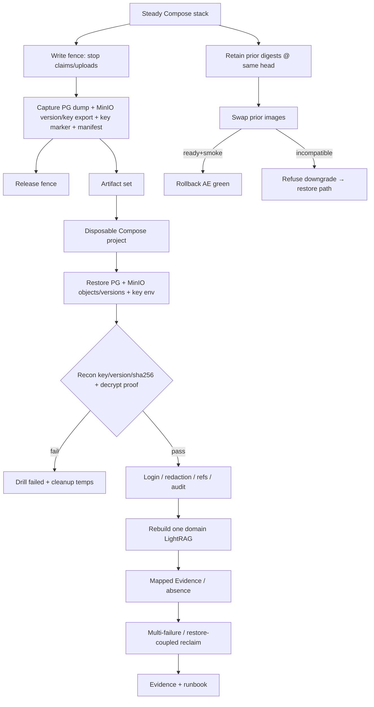

# P12-04 Backup Restore Image Rollback and Incident Drills - Plan

## Goal Capsule

- **Objective:** Close master-build-plan P12-04 by delivering Compose-matrix rehearsable drills for write-fenced backup consistency capture, isolated restore with PostgreSQL↔MinIO object version/key↔encryption-key reconciliation, post-restore continuity (auth, redactions, governed refs, audit, citations/tombstones), schema-compatible prior-image rollback, restore-coupled multi-failure worker/API recovery beyond P10-03, and post-restore rebuild/reconciliation of one private per-domain LightRAG runtime — with inventory, operator runbook, and evidence.
- **Authority:** Root `AGENTS.md`; FR-11 in `docs/prd.md`; `docs/master-build-plan.md` P12-04 (depends P5-04,P10-04,P12-01) and populated-database compatibility barrier (backup/key-custody language); `docs/architecture/deployment-topology.md` (§ Backup/restore/DR, release/rollback, MinIO object-store decision); `docs/architecture/production-adaptation-blueprint.md`; `docs/architecture/data-and-lifecycle.md`; `docs/architecture/security-operations-and-quality.md` (deployment order and rollback); `docs/architecture/legacy-persistence-retirement.md` (Path 2 stop — out of scope); `docs/quality/definition-of-done.md` production restore gate; P10-03 / P10-04 / P12-01 / P12-03 residuals; DRIFT-15 advanced by P10-04.
- **Execution profile:** Inventory-first brownfield; blocked on P5-04 and P10-04 DONE before implementation starts; Compose/MinIO local-production matrix altitude (filesystem adapter remains development-only residual, not the final DR boundary); scripted drills + PG/unit proofs where useful; live Compose evidence; honest residuals for staging/prod digests, KMS/escrow, Path 2, and P12-05/06/07/08.
- **Readiness checkpoint:** Implementation-ready after 2026-07-28 scoping confirmation, P5-04 sequencing choice (full rebuild in-slice), and P10-04 MinIO hard dependency.
- **Stop conditions:** Stop if DONE pressure claims production digests/RPO-RTO SLOs (P12-08), invents Path 2 contraction, treats LightRAG/runtime dirs as backup authority, treats filesystem object adapter as production/DR final boundary, uses `alembic downgrade` as production rollback, equates P10-03 single-worker reclaim with this slice, pulls TLS/stream-drain (P12-05), SBOM (P12-06), or browser E2E (P12-07), or starts implementation before P5-04 and P10-04 are DONE.
- **Tail ownership:** P12-05 ingress TLS/stream-drain; P12-06 immutable artifact/SBOM; P12-07 browser/capacity; P12-08 production acceptance digests/KMS/escrow/Path-2 release decision; filesystem development-only residual (not DRIFT-15 production-store claim).

---

## Product Contract

### Summary

P12-04 closes the recovery drill slice: operators can capture a write-fenced consistency unit (PostgreSQL + matching MinIO object versions/keys + encryption-key recoverability marker), restore into an isolated Compose environment, fail closed on mismatch/missing key, verify product continuity, rehearse schema-compatible image rollback, run restore-coupled multi-failure reclaim scripts, and rebuild/reconcile one private LightRAG domain after restore. Product Contract authored in this bootstrap from master-build-plan P12-04 and architecture DR contracts; no upstream brainstorm file. Scope confirmed 2026-07-28 (Compose-matrix altitude; MinIO objects+keys in unit via P10-04; live image rollback; multi-failure scripts; full LightRAG rebuild in-slice waiting on P5-04; filesystem adapter stays development-only).

Product Contract preservation: Product Contract authored here; no upstream brainstorm IDs to preserve.

### Problem Frame

Architecture and FR-11 require backup/restore of PostgreSQL, governed objects, encryption keys, and config metadata; image rollback only while schema-compatible; worker death/lease recovery; and quarterly-style isolated restore with continuity checks. Today the compose runbook only tells operators to “restore current-head backup” without tooling; P10-03 proves single-worker stop-claim/reclaim only; P12-01 Path 1 refuses bad volumes but does not prove restore; P12-03 defers redaction/audit continuity after backup. Without rehearsable drills and evidence — including LightRAG derivative rebuild after restore — P12-08 cannot honestly accept production recovery.

### Actors

| Actor | Role |
| --- | --- |
| Operator / developer | Runs Compose-matrix backup/restore/rollback/incident drills per runbook |
| Coding agent | Implements inventory, scripts, seeder, tests, runbook, evidence |
| Reviewer | Confirms P5-04 and P10-04 prerequisites, residuals, and non-claims stay honest |

### Key Flows

**F1 — Consistency-point capture.** Steady Compose stack (MinIO-backed local-production store from P10-04) → write-fence (stop new claims/uploads) → capture PostgreSQL dump + MinIO object version/key consistency archive (or equivalent versioned export) + key-recoverability marker + alembic head + local image digests → release fence → artifact set recorded.

**F2 — Isolated restore and recon.** Artifacts → disposable Compose project/volumes → restore PG + MinIO objects/versions + key env → reconcile every referenced object key/version/sha256 and encryption decrypt proof → fail closed on missing key, missing object, or digest/version mismatch → Path 1 migrate/readiness accepts current head.

**F3 — Post-restore continuity.** On restored env: fresh login; redacted turns stay omitted; governed refs stay invalid; audit count/digest continuity via operator SQL; citations/anchors from durable Evidence where seedable; deletion/tombstone signals remain fenced; then rebuild one domain LightRAG runtime from canonical blocks/handoff and verify mapped retrieval/absence.

**F4 — Image rollback.** Retain prior schema-compatible app image digests at the same Alembic head → swap api/worker/(frontend as lockstep) → ready + core/worker smoke green; document refusal of `alembic downgrade` as production rollback (restore path instead when incompatible).

**F5 — Multi-failure / restore-coupled incident.** Beyond P10-03: API+worker death with lease reclaim; restore-then-reclaim of mid-lease rows with shortened drill leases; injected missing-object after restore fails safe (no eligibility restore, no silent empty success).

**F6 — Evidence and runbook closure.** Inventory + evidence + operations runbook update; tracker DONE with residuals named.

### Requirements

**Inventory and ownership**

- R1. Inventory seams and dispositions in `docs/_scratch/p12-04-backup-restore-inventory.md` (`retain` / `modify` / `add` / `defer` / `credit`) covering backup, recon, continuity, image rollback, multi-failure, LightRAG rebuild, and out-of-scope owners.
- R2. Record evidence in `docs/_scratch/p12-04-backup-restore-evidence.md`; update `docs/master-build-plan.md` P12-04 and relevant DRIFT notes with honest closure language and residuals.

**Prerequisites**

- R3. Do not start implementation until P5-04 is DONE (real private LightRAG runtime per domain) and P10-04 is DONE (local-production MinIO + S3-compatible adapter + backup hooks). Inventory may be drafted earlier only if it does not claim rebuild proof or MinIO DR final-boundary proof.

**Backup consistency unit**

- R4. Backup unit = PostgreSQL + matching governed object versions/keys from the MinIO-backed S3-compatible store (P10-04) + encryption-key recoverability marker + deployment configuration metadata needed to boot the matrix (alembic head, image digests used in the drill). Exclude `domain-runtimes` / LightRAG disk as backup authority. Filesystem object adapter may exist for development loops but is not the production-like drill consistency boundary.
- R5. Capture is write-fenced: stop api/worker claim loops (and reject new uploads) before dump/archive so the unit is not torn across in-flight put/publish.
- R6. Emit a consistency manifest beside artifacts: PG artifact digest, sorted `key→sha256` object-tree digest, encryption-key fingerprint (not raw key material in the PG dump), alembic head, and local image digests.
- R7. Prove key recoverability: restore without the correct `CONFIG_ENCRYPTION_KEY` fails the drill’s decrypt proof; with the key, a seeded credential ciphertext decrypts. Do not invent KMS/escrow in-product.

**Isolated restore and recon**

- R8. Restore into disposable Compose project/volumes distinct from the live stack volumes; never overwrite the live stack by default.
- R9. Reconcile every `source_documents` / `source_images` referenced key against MinIO object bytes/version (or etag) and recorded sha256/content_hash using P10-04 recon/backup hooks; hard-fail on missing object, version/key mismatch, or digest mismatch; orphan store objects warn (do not alone fail the drill).
- R10. After restore, Path 1 migrate/readiness accepts exact current head + catalog; document refuse→restore/recreate actions already owned by P12-01.
- R11. Verified cleanup of temporary export/restore material is part of the drill script success path.

**Post-restore continuity**

- R12. Minimal drill corpus in the backup source env: prepared source with object bytes, one redacted turn, one invalidated/expired governed ref, known audit events, and enough state for citation/Evidence projection after index rebuild.
- R13. Continuity checks after restore: fresh admin/member login; redaction stickiness; governed-ref unusable; audit continuity via operator SQL count+ordered digest (no public audit-read API); deletion/tombstone or fenced-delete observables; citations/anchors after domain rebuild.
- R14. Rebuild at least one domain’s private LightRAG runtime from canonical blocks and recorded handoff; prove submit→ready→mapped Evidence (or contracted absence) and that runtime disk was not required from backup.

**Image rollback**

- R15. Live prior-image rollback rehearsal: two locally built digests at the same Alembic head; swap to prior; `/health/ready` + stack smoke green.
- R16. Runbook and evidence explicitly refuse `alembic downgrade` / improvised down migration as the production rollback path; incompatible prior image → restore path (F1/F2), not force-down.

**Failed-worker / incident drills**

- R17. Keep P10-03 single-worker reclaim as credit; add Compose scripts for API+worker death reclaim, restore-then-reclaim with shortened drill leases, and injected missing-object fail-safe behavior.
- R18. Do not force-complete turns/ops, clear leases early, or bypass generation fences during drills.

**Operator runbook and verification boundary**

- R19. Extend `docs/operations/compose-stack-runbook.md` and/or add `docs/operations/backup-restore-incident-runbook.md` covering F1–F5, go/no-go, and explicit non-claims.
- R20. Compose-matrix wall-clock may be recorded; production RPO≤15m / RTO≤4h and staging/prod digests remain P12-08 residuals. SQLite is not DR evidence.

### Acceptance Examples

- AE1. Inventory freezes seams with credit/gap/defer; P5-04 and P10-04 listed as prerequisites; Path 2 / P12-05/06/07/08 / filesystem-dev named as residuals.
- AE2. Write-fenced capture produces manifest + PG + MinIO object version/key archive; runtime volume absent from the unit; filesystem store not used as the DR final boundary.
- AE3. Isolated restore with wrong/missing encryption key fails decrypt proof; correct key + matching MinIO object versions/keys passes recon.
- AE4. Post-restore: login works; redacted turn stays omitted; invalid ref stays unusable; audit digest matches; after LightRAG rebuild, mapped Evidence/citation path succeeds (or contracted absence proven).
- AE5. Prior schema-compatible image swap ready+smoke green; evidence records refusal of alembic downgrade as rollback.
- AE6. API+worker kill and restore-then-reclaim complete without double-complete; missing-object injection fails safe.
- AE7. Tracker P12-04 DONE only with inventory + evidence + runbook; residuals honest.

### Success Criteria

- P12-04 can advance from `NOT_STARTED` with Compose/MinIO-matrix DR drill evidence attached after P5-04 and P10-04.
- Continuity checklist from deployment-topology backup section is exercised at Compose altitude.
- P12-08 can attach to named residuals rather than inventing missing drill procedures.

### Scope Boundaries

#### In scope

- Inventory/evidence; write-fenced backup/restore/recon scripts; key recoverability proof; continuity seeder/checks; image rollback rehearsal; multi-failure incident scripts; post-restore LightRAG rebuild/recon; operator runbook; tracker/DRIFT updates.

#### Deferred to Follow-Up Work

- Shared disposable-PostgreSQL harness extraction across suites.
- Capturing this slice into `docs/solutions/` after landing (corpus currently absent).
- Mid-turn DB lease heartbeat / long-synthesis kill depth left residual by P10-03 (prove only if P5-04 matrix makes it cheap).

#### Deferred for later (other P12 / future)

- Path 2 supported populated upgrade/contraction and quarantine census.
- P12-05 TLS / deployed stream-drain / direct-API denial.
- P12-06 SBOM / immutable provenance manifests.
- P12-07 browser E2E / a11y / capacity.
- P12-08 production acceptance digests, real RPO/RTO SLOs, KMS/escrow, and any staging/prod registry promotion beyond Compose MinIO.
- Filesystem object adapter remains available for development only — not a P12-04 DONE boundary (DRIFT-15 production-store advanced by P10-04).

#### Outside this product's identity

- Redis/Celery/Kubernetes recovery orchestration.
- Product-facing observability dashboards (Phase 2).
- Treating LightRAG/runtime disk as backup authority.
- Treating filesystem object adapter as production/DR final boundary.

### Dependencies / Assumptions

- P5-04 and P10-04 must be DONE before implementation of this plan begins (full LightRAG rebuild in-slice; MinIO object version/key consistency via P10-04 hooks).
- P12-01 Path 1 preflight/readiness and P10-03 worker reclaim remain green credit baselines.
- Compose MinIO (local-production) is the governed-object drill boundary; filesystem adapter is development residual only.
- Session/CSRF keys are re-login-only after restore (not cookie-continuity in the backup unit).
- Orphan MinIO objects warn; referenced missing/mismatched object versions/keys hard-fail.
- Audit continuity uses operator SQL in disposable env only — no Phase 2 audit-read API.

### Outstanding Questions

- None blocking. Deferred: production KMS/escrow vendor and staging/prod registry digest promotion (deployment decisions under as-built gaps / P12-08). MinIO version/key mechanics are owned by P10-04 hooks consumed here.

### Sources

- `docs/master-build-plan.md` (P12-04; P5-04 + P10-04 dependencies; barrier backup language)
- `docs/prd.md` FR-11
- `docs/architecture/deployment-topology.md`, `production-adaptation-blueprint.md`, `data-and-lifecycle.md`, `security-operations-and-quality.md`
- `docs/operations/compose-stack-runbook.md`
- `docs/plans/2026-07-28-011-feat-p10-04-minio-object-store-plan.md`
- `docs/_scratch/p10-03-worker-lifecycle-*.md`, `p10-04-minio-object-store-*.md` (when present), `p12-01-populated-compatibility-*.md`, `p12-03-adversarial-security-*.md`
- `app/compose.stack.yml`, `app/context_engine/migrate_release.py`, `app/context_engine/adapters/object_storage.py`, `app/scripts/stack_smoke_*.py`

---

## Planning Contract

### Key Technical Decisions

- KTD1. **Hard wait on P5-04 and P10-04.** Implementation starts only after real private LightRAG runtime and MinIO S3-compatible store + backup hooks exist; AE4 rebuild is in-scope, not residual; MinIO version/key recon is the DR object boundary.
- KTD2. **Compose/MinIO matrix altitude.** Drills use disposable Compose + MinIO-backed governed store (P10-04); filesystem adapter stays development-only and must not be the final DR evidence boundary; staging/prod registry digests and KMS/escrow → P12-08 residual.
- KTD3. **Write-fenced consistency capture.** Before dump/archive: `compose stop` (or equivalent SIGTERM drain) for `api` and `worker` so no new claims/uploads; confirm idle/no in-flight put via health or process exit; then `pg_dump` + MinIO object version/key export (via P10-04 hooks); then restart. Hot torn capture is not success evidence. Fence is Compose-process level — not a new product freeze API.
- KTD4. **Manifest without secrets.** Fingerprint `CONFIG_ENCRYPTION_KEY`; never embed key material in the dump; decrypt-proof fixture ciphertext proves recoverability.
- KTD5. **Hard-fail missing/mismatch; warn orphans.** Recon is stricter than `/health/ready` store capability probe.
- KTD6. **Drill seeder, not full demo package.** Minimal synthetic corpus sufficient for continuity + rebuild; gated demo seed optional only if already approved for matrix.
- KTD7. **Image rollback = prior local digest @ same head.** Record digests in evidence; P12-06/08 own immutable release digests.
- KTD8. **Production rollback ≠ alembic downgrade.** Scripts/runbook assert refuse; incompatible image → restore path.
- KTD9. **Credit P10-03 reclaim; extend scripts.** New multi-failure/restore-coupled scripts under `app/scripts/`; cite PG lease suites as algorithm authority.
- KTD10. **Runtime volume excluded.** Prove rebuild from PG blocks/handoff + objects; empty `domain-runtimes` after restore is expected success.

### Assumptions

- Confirmed 2026-07-28: Compose-matrix; MinIO objects+versions/keys in unit (P10-04); live image rollback; multi-failure scripts; wait on P5-04 for full rebuild; filesystem-dev residual honest.
- Shortened `CE_*_LEASE_SECONDS` allowed in drill-only env (mirror P10-03 smoke knobs).
- Fresh login after restore (CSRF/session keys not part of continuity unit).
- RPO/RTO numbers stay architecture targets; Compose wall-clock is matrix evidence only.

### Alternative Approaches Considered

| Approach | Why not |
| --- | --- |
| Close P12-04 with LightRAG rebuild residual | User chose full rebuild in-slice; tracker lists P5-04 dep |
| PostgreSQL-only restore | Confirmed consistency unit includes MinIO object versions/keys + encryption keys |
| Filesystem object tree as final DR boundary | Architecture + tracker require P10-04 MinIO; filesystem remains development-only |
| Documentation-only image rollback | Confirmed live prior-image rehearsal |
| Equate P10-03 reclaim with incident drills | Explicit non-claim in P10-03/runbook |
| Path 2 census as DONE path | Path 1 chosen; Path 2 unsupported |
| Volume crash-consistent snapshot without fence | Torn put/publish window unacceptable for drill green |

### High-Level Technical Design

**Consistency unit (directional):**

| Included | Excluded |
| --- | --- |
| PG dump of Phase 1 catalog/data | `stack-domain-runtimes` / LightRAG disk |
| MinIO object versions/keys (+ content hashes) via P10-04 hooks | Filesystem object tree as DR final boundary |
| Key fingerprint + decrypt-proof ciphertext | Raw key bytes inside dump |
| Alembic head + local image digests for drill | Staging/prod registry digests as acceptance; Path 2 quarantine exports |

### Implementation Constraints

- No Redis/Celery/K8s; database-leased workers remain authority.
- No public audit-read API; operator SQL only in disposable restore env.
- No product KMS adapter; env-key custody for matrix only.
- Do not claim production release gate from Compose evidence alone.
- Privacy: dumps/archives are secret-class operator material; do not commit real dumps to git; fixtures/scripts only.

### Risks and Dependencies

| Risk | Mitigation |
| --- | --- |
| P5-04 or P10-04 slips | Plan stays blocked; do not partial-DONE without rebuild AE or MinIO version/key recon |
| Torn backup without fence | KTD3; script fails if fence not confirmed |
| `/health/ready` false green after partial object restore | Dedicated MinIO key/version recon census before continuity (P10-04 hooks) |
| Accidental filesystem-as-DR evidence | KTD2; scripts/evidence assert MinIO kind for drill stack |
| Image tags floating (`postgres:16`, local builds) | Record digests used in evidence; P12-06/08 own release digests |
| Lease clock after restore | Shortened drill leases; wait expiry; do not scrub lease columns as “fix” |
| Secret leakage via committed dumps | Scripts write under ignored temp dirs; evidence cites paths/hashes only |

### System-Wide Impact

- Operators gain recovery procedures; developers gain scripted smoke altitude for DR.
- Compose runbook expands; Path 1 refuse codes gain a real restore procedure behind them.
- P12-08 accepts attaching to this evidence with named residuals rather than inventing drills.
- No public API/DTO/SSE contract change expected; fail closed if a drill seems to require one.
- Failure propagation: a green `/health/ready` after partial object restore must not satisfy recon — census is a separate gate (KTD5). Missing-object and wrong-key failures must not un-fence deletes or restore query eligibility.
- Data integrity: restore-then-reclaim can surface leased `running`/`deleting` rows; generation fences and shortened drill leases own recovery — do not scrub lease columns as a “fix.”
- Secret class: backup artifacts, key fingerprints’ companion key files, and object archives stay off git and out of CI logs; evidence records digests only.
- Cross-slice: P5-04 runtime becomes load-bearing for U6; P10-04 MinIO hooks become load-bearing for U2; P10-03 reclaim stays credited; P12-01 refuse table stays the migrate go/no-go authority.

---

## Implementation Units

### U1. Recovery drill inventory

**Goal:** Freeze seams, credit, gaps, and residuals before tooling.

**Requirements:** R1, R3, AE1

**Dependencies:** None (may draft before P5-04/P10-04; must not claim rebuild proof or MinIO DR final-boundary proof)

**Files:**
- Create: `docs/_scratch/p12-04-backup-restore-inventory.md`
- Modify: none required beyond inventory

**Approach:** Mirror P12-01/P12-03 inventory tables. Lanes: backup capture, restore/recon (MinIO version/key), key recoverability, continuity, image rollback, multi-failure, LightRAG rebuild, residuals. Disposition `credit` for P10-03 reclaim, P10-04 MinIO adapter/hooks, P12-01 refuse→restore guidance, P4 object key/sha256 metadata, P2-02 Fernet, P12-03 continuity deferral. Mark P5-04 and P10-04 prerequisites explicitly; filesystem adapter `defer`/`retain` as development-only residual.

**Patterns to follow:** `docs/_scratch/p12-01-populated-compatibility-inventory.md`, `docs/_scratch/p12-03-adversarial-security-inventory.md`

**Test scenarios:**
- Happy path: Every tracker deliverable phrase maps to a lane with disposition and owner.
- Edge: P5-04 or P10-04 NOT_STARTED → inventory records blocked rebuild/MinIO lanes without inventing synthetic credit.
- Error: No lane claims Path 2, TLS, SBOM, browser E2E, or filesystem-as-production-store as in-scope DONE.

**Verification:** Inventory exists; residual owners named; no DONE language.

---

### U2. Consistency capture and isolated restore/recon

**Goal:** Script write-fenced backup and disposable restore with hard-fail MinIO version/key recon.

**Requirements:** R4–R11, AE2, AE3

**Dependencies:** U1; **P10-04 DONE** (hard — MinIO adapter + recon/backup hooks); overall slice start also requires P5-04 DONE (this unit does not call LightRAG)

**Files:**
- Create: `app/scripts/stack_backup_capture.py` (name flexible)
- Create: `app/scripts/stack_restore_recon.py` (name flexible)
- Create: `app/tests/test_stack_backup_restore_recon.py` (and/or PG-focused suite)
- Modify: `app/compose.stack.yml` only if drill project/env knobs require documented MinIO hooks
- Modify: `.gitignore` or docs note for temp artifact dirs if needed
- Credit/use: P10-04 recon/list helpers (e.g. `app/scripts/stack_object_store_recon.py` or equivalent)

**Approach:** Implement KTD3 fence with `docker compose stop` on `api`/`worker` (grace period already 60s for worker) before capture; refuse to proceed if processes still accepting work. `pg_dump` of the postgres service; export matching MinIO object versions/keys (and content hashes) via P10-04 hooks — not a filesystem `{CE_SOURCE_STORAGE_ROOT}/objects` tree as the final boundary; exclude domain-runtimes; write manifest JSON (PG digest, object version/key digest, key fingerprint, alembic head, image digests, store kind=`s3`/minio). Restore into an alternate Compose project name with distinct volumes/MinIO data. Recon enumerates `source_documents`/`source_images` keys+versions+hashes vs MinIO; Fernet decrypt proof against seeded ciphertext; orphans warn. Cleanup temps on success and failure paths. Default paths must refuse restoring onto live `stack-*` volume names and must refuse claiming green when the drill stack is still on filesystem-only store.

**Execution note:** Prefer smoke/runtime proof of scripts against disposable Compose+MinIO; unit-test pure recon/manifest helpers; credit P10-04 adapter contract tests.

**Patterns to follow:** `app/scripts/stack_smoke_core.py`, `app/scripts/stack_smoke_worker.py`, P10-04 object-store recon hooks, P12-01 refuse action table

**Test scenarios:**
- Happy path: Fenced capture on MinIO stack → restore disposable → version/key recon pass → ready.
- Edge: Runtime volume excluded from archive; manifest lists head + digests + store kind; filesystem-dev path documented as non-evidence.
- Error: Missing object/version → recon fail; wrong `CONFIG_ENCRYPTION_KEY` → decrypt proof fail; restore onto live volume names refused by script defaults; filesystem-only drill stack refused for AE2/AE3 green.
- Integration: After restore, `migrate_release` accepts current head (no-op) and API ready gates pass when continuity seeder present (may pair with U3).

**Verification:** Scripts + tests green; AE2/AE3 reproducible from evidence commands; P10-04 revision cited.

---

### U3. Drill corpus and post-restore continuity checks

**Goal:** Seed minimal corpus and verify continuity after restore (pre-rebuild checks + hooks for post-rebuild).

**Requirements:** R12, R13, AE4 (continuity half)

**Dependencies:** U2

**Files:**
- Create: `app/scripts/stack_drill_seed.py` and/or fixture SQL under `app/tests/fixtures/` (name flexible)
- Create: `app/scripts/stack_restore_continuity.py` (name flexible)
- Create: `app/tests/test_stack_restore_continuity.py`
- Modify: none of product public contracts

**Approach:** Seed prepared source+bytes, redacted turn, invalidated composer ref, audit events, and Evidence-capable state. Continuity script: login CSRF path or direct API as matrix allows; assert redaction omission; assert ref consume/deny; SQL audit count+digest; document/content 404 or fenced delete signal. Citation/anchor deep check completes after U6 rebuild.

**Patterns to follow:** `docs/quality/seeded-demo-and-test-data.md` synthetic rules; P12-03 redaction/ref cases; P8 privacy (no committing dumps)

**Test scenarios:**
- Happy path: Restored env shows redacted omission + invalid ref + matching audit digest + fresh login.
- Edge: Bootstrap re-run after restore is insert-only no-op; admin from dump still authenticates.
- Error: Continuity script fails closed if answer text reappears on redacted turn.
- Integration: Continuity does not require runtime volume contents from backup.

**Verification:** Continuity script + tests; AE4 continuity half recorded.

---

### U4. Schema-compatible image rollback rehearsal

**Goal:** Prove prior local image digests at same head roll back safely; refuse alembic downgrade as rollback.

**Requirements:** R15, R16, AE5

**Dependencies:** U1 (runbook text may land in U7); practically needs buildable Compose images

**Files:**
- Create: `app/scripts/stack_image_rollback_drill.py` (name flexible)
- Create: `app/tests/test_stack_image_rollback_drill.py` (contract/unit where possible)
- Modify: `docs/operations/` runbook (may finalize in U7)

**Approach:** Build/tag or `docker image inspect` two digests from the same head; swap api/worker (and frontend if lockstep); ready + `stack_smoke_core` (and worker smoke if inline-off). Evidence asserts no `alembic downgrade` step. Document go/no-go when prior image cannot ready against current head → restore path.

**Patterns to follow:** `docs/architecture/security-operations-and-quality.md` rollback; `app/tests/test_compose_stack_config.py`

**Test scenarios:**
- Happy path: Prior digest @ same head → ready + smoke green.
- Edge: Evidence records image digests used (Compose-matrix, not P12-08 release digests).
- Error: Script/runbook path for incompatible prior image refuses downgrade and points to restore.
- Integration: Rollback drill does not mutate schema head.

**Verification:** AE5 commands in evidence; downgrade refusal explicit.

---

### U5. Restore-coupled multi-failure incident scripts

**Goal:** Expand past P10-03 single-worker reclaim into multi-failure and restore-coupled drills.

**Requirements:** R17, R18, AE6

**Dependencies:** U2; credit P10-03

**Files:**
- Create: `app/scripts/stack_incident_reclaim_drill.py` (name flexible)
- Create: `app/tests/test_stack_incident_reclaim_drill.py`
- Modify: cite `app/tests/test_postgres_turn_leases.py` et al. as algorithm authority in evidence

**Approach:** Script matrix: (1) API+worker kill → wait shortened leases → restart reclaim; (2) capture backup while leased/running row present → restore → reclaim without double-complete; (3) after restore, delete one MinIO object (or corrupt version) → document/content and worker paths fail safe. No force-complete; generation fences honored.

**Execution note:** Smoke/runtime Compose proof; keep PG suites as algorithm credit.

**Patterns to follow:** `docs/operations/compose-stack-runbook.md` kill+reclaim; `app/scripts/stack_smoke_worker.py`; P10-03 evidence non-claims

**Test scenarios:**
- Happy path: API+worker death → reclaim progresses under new owners; no double terminal.
- Edge: Restore-then-reclaim with shortened leases completes or leaves reclaimable state only.
- Error: Missing-object injection → no eligibility restore, no silent empty success.
- Integration: Drill cites PG lease suites; does not claim HA multi-replica topology.

**Verification:** AE6 in evidence; P10-03 remains credited not re-owned.

---

### U6. Post-restore LightRAG rebuild and reconciliation

**Goal:** After restore, rebuild one domain runtime from canonical authority and prove mapped Evidence path against restored MinIO-backed objects.

**Requirements:** R14, AE4 (rebuild half)

**Dependencies:** U2, U3; **P5-04 DONE** (hard); **P10-04 DONE** (hard — restored objects live in MinIO)

**Files:**
- Create or extend: drill script step in `app/scripts/stack_restore_continuity.py` or `stack_lightrag_rebuild_drill.py`
- Create: `app/tests/test_stack_restore_lightrag_rebuild.py` (Compose/opt-in altitude)
- Modify: none of vendor LightRAG internals as public contract

**Approach:** With empty runtime volume after restore, run domain start/index path against restored blocks/handoff using real private runtime from P5-04 and object bytes from restored MinIO keys/versions; reconcile object/DB already green from U2; prove mapped Evidence/citation or contracted absence; prove delete/absence still fail closed. Runtime disk must not have been in the backup unit; filesystem object root must not be substituted as the rebuild source for DONE evidence.

**Execution note:** Block this unit until P5-04 and P10-04 evidence exist; do not stub a second synthetic runtime or filesystem store to claim AE4.

**Patterns to follow:** P5-04 deliverable proofs; P10-04 MinIO readiness; P6 mapping discard; deployment-topology rebuild language

**Test scenarios:**
- Happy path: Empty runtime after restore → rebuild from MinIO-backed objects → mapped Evidence/citation check green.
- Edge: Backup archive listing excludes runtime paths; manifest store kind is MinIO/s3.
- Error: Rebuild failure fails the drill (no green bar on PG+objects alone once this unit runs); filesystem-only rebuild path is non-evidence.
- Integration: Cross-domain isolation retained if P5-04 proved it; at least one domain rebuilt.

**Verification:** AE4 complete; evidence cites P5-04 and P10-04 artifact revisions.

---

### U7. Runbook, evidence, and tracker closure

**Goal:** Operator procedures and honest DONE language.

**Requirements:** R2, R19, R20, AE7

**Dependencies:** U1–U6

**Files:**
- Create: `docs/_scratch/p12-04-backup-restore-evidence.md`
- Create or modify: `docs/operations/backup-restore-incident-runbook.md` and/or `docs/operations/compose-stack-runbook.md`
- Modify: `docs/master-build-plan.md` (P12-04 status/residuals)
- Modify: `docs/brownfield-refactor-register.md` only if a DRIFT row honestly changes

**Approach:** Document F1–F5 procedures, go/no-go, temp cleanup, and residual table (P12-05/06/07/08, Path 2, KMS/escrow, staging/prod digests, filesystem-dev). Evidence records commands, digests, MinIO version/key markers, wall-clock, safety controls, and non-claims. Mark P12-04 DONE only when AE1–AE7 hold and P5-04+P10-04 prerequisites are cited.

**Patterns to follow:** `docs/_scratch/p10-03-worker-lifecycle-evidence.md`, `docs/_scratch/p12-01-populated-compatibility-evidence.md`

**Test scenarios:**
- Happy path: Evidence lists every AE with command/result.
- Edge: Residuals table names P12-08 for digests/RPO-RTO/KMS/escrow; filesystem-dev residual explicit.
- Error: Evidence does not claim Path 2, filesystem-as-production-store, or production release acceptance.
- Test expectation: none for pure doc/tracker updates beyond evidence completeness review.

**Verification:** Tracker DONE language matches evidence; runbook linked from compose runbook residuals section.

---

## Verification Contract

- Inventory + evidence pair under `docs/_scratch/p12-04-*`.
- Scripted Compose/MinIO-matrix drills for capture, restore/recon, continuity, image rollback, multi-failure, and LightRAG rebuild.
- Focused unit/helper tests for manifest/recon/decrypt-proof pure logic; credit P10-04 adapter/recon hooks.
- Cite P10-03 and PG lease suites as reclaim algorithm credit; do not make root `scripts/verify.sh` a mandatory live Docker DR gate unless already the repo pattern for similar smokes.
- Privacy: no committed dumps, keys, or object archives; evidence cites hashes/paths/version markers only.
- P5-04 and P10-04 evidence revisions recorded before U2/U6 green.

## Definition of Done

- All requirements R1–R20 and AE1–AE7 satisfied after P5-04 and P10-04.
- Backend authority, privacy classifications, and public contract boundaries intact (no new browser-visible fields).
- Restore recon on MinIO object versions/keys, key recoverability, redaction/ref/audit continuity, image rollback refusal of downgrade, multi-failure reclaim, and LightRAG rebuild proven at Compose/MinIO-matrix boundary; filesystem adapter not used as DR final boundary.
- HTTP/DTO/SSE/generated client unchanged unless a genuine blocker forces an approved contract change (unexpected — stop).
- Operator runbook + evidence + tracker residuals honest for P12-05/06/07/08, Path 2, KMS/escrow, and filesystem-dev.
- Root verification gate remains green for non-live portions; live drill commands recorded in evidence.

---

## Appendix

### Research notes

- No `docs/solutions/` corpus; institutional guidance taken from architecture + P10-03/P10-04/P12-01/P12-03 residuals.
- External research skipped: local DR contracts and brownfield patterns are authoritative; MinIO via one S3-compatible adapter is settled under deployment-topology; KMS/escrow deferred to P12-08.
- STRATEGY.md tracks frontend factory — orthogonal; no track conflict.
