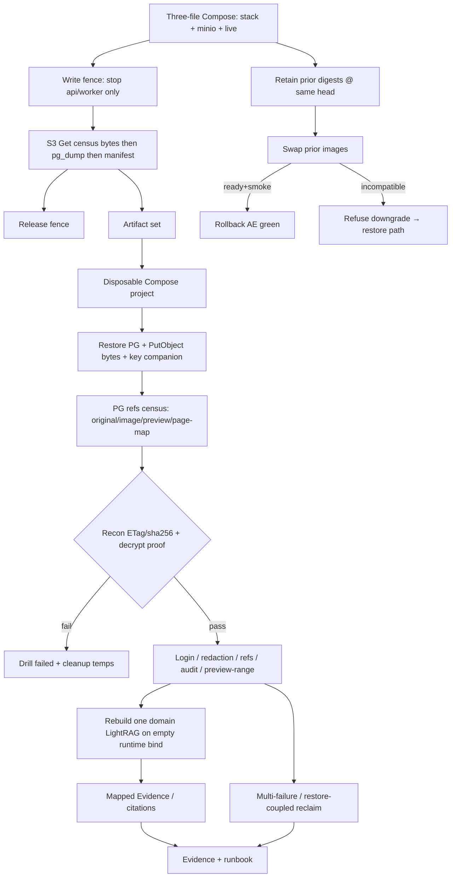

# P12-04 Backup Restore Image Rollback and Incident Drills - Plan

## Goal Capsule

- **Objective:** Close master-build-plan P12-04 by delivering Compose-matrix rehearsable drills for write-fenced backup consistency capture, isolated restore with PostgreSQL↔MinIO object (ETag + contentSha256 + objectTreeDigest)↔encryption-key reconciliation including governed preview/page-map derivatives, post-restore continuity (auth, redactions, governed refs, audit, preview/range delivery, citations/tombstones), schema-compatible prior-image rollback, restore-coupled multi-failure worker/API recovery beyond P10-03, and post-restore rebuild/reconciliation of one private per-domain LightRAG runtime — with inventory, operator runbook, and evidence.
- **Authority:** Root `AGENTS.md`; FR-11 in `docs/prd.md`; `docs/master-build-plan.md` P12-04 (depends P5-04,P10-04,P10-06,P12-01 — all DONE) and populated-database compatibility barrier (backup/key-custody language); `docs/architecture/deployment-topology.md` (§ Backup/restore/DR, release/rollback, MinIO object-store decision — topology precedence: LightRAG/runtime disk is not backup authority); `docs/architecture/production-adaptation-blueprint.md`; `docs/architecture/data-and-lifecycle.md`; `docs/architecture/security-operations-and-quality.md` (deployment order and rollback; improvised down migration refused); `docs/architecture/legacy-persistence-retirement.md` (Path 2 stop — out of scope); `docs/quality/definition-of-done.md` production restore gate; P10-03 / P10-04 / P10-06 / P5-04 / P12-01 / P12-03 residuals; DRIFT-15 advanced by P10-04.
- **Execution profile:** Inventory-first brownfield; prerequisites DONE — cite evidence revisions and start implementation; Compose/MinIO+live local-production matrix altitude (`compose.stack.yml` + `compose.stack.minio.yml` + `compose.stack.live.yml`); filesystem adapter remains development-only residual, not the final DR boundary; scripted drills + PG/unit proofs where useful; live Compose evidence; honest residuals for staging/prod digests, KMS/escrow, Path 2, and P12-05/06/07/08.
- **Readiness checkpoint:** Implementation-ready; P5-04, P10-04, P10-06, and P12-01 are DONE (2026-07-28). Cite `docs/_scratch/p5-04-lightrag-real-runtime-evidence.md`, `p10-04-minio-object-store-evidence.md`, `p10-06-governed-preview-evidence.md`, and `p12-01-populated-compatibility-evidence.md` in inventory/evidence.
- **Stop conditions:** Stop if DONE pressure claims production digests/RPO-RTO SLOs or KMS/HA (P12-08), invents Path 2 contraction, treats LightRAG/runtime dirs as backup authority, treats filesystem object adapter as production/DR final boundary, treats metadata-only object export as a byte archive, uses `alembic downgrade` / improvised down migration as production rollback, equates P10-03 single-worker reclaim with this slice, pulls TLS/stream-drain (P12-05), SBOM (P12-06), or browser E2E (P12-07), or claims green without the three-file MinIO+live matrix for AE2 capture and AE4 rebuild-half (pairwise-only overlays are not DONE for AE4 rebuild).
- **Tail ownership:** P12-05 ingress TLS/stream-drain / deployed byte-range; P12-06 immutable artifact/SBOM; P12-07 browser/capacity / governed-preview navigation; P12-08 production acceptance digests/KMS/escrow/HA/Path-2 release decision; filesystem development-only residual (not DRIFT-15 production-store claim).

---

## Product Contract

### Summary

P12-04 closes the recovery drill slice: operators can capture a write-fenced consistency unit (PostgreSQL + matching MinIO object bytes with ETag/contentSha256/objectTreeDigest + encryption-key recoverability marker), restore into an isolated Compose environment, fail closed on mismatch/missing key, verify product continuity including authorized preview/range at matrix altitude, rehearse schema-compatible image rollback, run restore-coupled multi-failure reclaim scripts, and rebuild/reconcile one private LightRAG domain after restore on the three-file MinIO+live matrix. Product Contract authored in this bootstrap from master-build-plan P12-04 and architecture DR contracts; no upstream brainstorm file. Scope confirmed 2026-07-28; re-deepened 2026-07-28 after prerequisite DONE + P10-04 ETag vocabulary + export-gap grounding.

Product Contract preservation: Product Contract unchanged in intent; vocabulary and prerequisite status clarified (F1–F5 deepen pass).

### Problem Frame

Architecture and FR-11 require backup/restore of PostgreSQL, governed objects, encryption keys, and config metadata; image rollback only while schema-compatible; worker death/lease recovery; and quarterly-style isolated restore with continuity checks. Today the compose runbook only tells operators to “restore current-head backup” without tooling; P10-03 proves single-worker stop-claim/reclaim only; P12-01 Path 1 refuses bad volumes but does not prove restore; P12-03 defers redaction/audit continuity after backup; P10-04 export is metadata-only and needs a PG→refs census; P5-04/P10-06 leave empty-volume rebuild and preview-derivative restore to this slice. Without rehearsable drills and evidence — including LightRAG derivative rebuild and preview/page-map recon after restore — P12-08 cannot honestly accept production recovery.

### Actors

| Actor | Role |
| --- | --- |
| Operator / developer | Runs Compose-matrix backup/restore/rollback/incident drills per runbook |
| Coding agent | Implements inventory, scripts, seeder, tests, runbook, evidence |
| Reviewer | Confirms prerequisite evidence citations, residuals, and non-claims stay honest |

### Key Flows

**F1 — Consistency-point capture.** Steady three-file Compose stack (MinIO + live LightRAG overlays) → write-fence (stop api/worker only; no other put/publish writers; drill seed finished before fence) → confirm idle → S3 key-centric **byte** export of PG→refs census keys (GetObject into portable key→bytes artifact; not a live MinIO data-dir copy) → `pg_dump` under the same fence episode (no restart between halves) → consistency manifest (PG digest, objectTreeDigest from ETag/sha256 of archived bytes, key fingerprint, head, digests, store kind) → release fence → artifact set recorded.

**F2 — Isolated restore and recon.** Artifacts → disposable Compose project (`-p` distinct from live; non-overlapping resolved volumes) → restore PG + PutObject census keys with app or MinIO-root credentials after minio-init → PG→refs census → reconcile every referenced key against restored MinIO bytes/ETag/sha256 (extend beyond P10-04 verify’s sha256/size) → fail closed on missing key, missing object, or digest/ETag mismatch → Path 1 migrate/readiness accepts current head.

**F3 — Post-restore continuity.** On restored env: fresh login; redacted turns stay omitted; governed refs stay invalid; audit count/digest continuity via operator SQL; authorized preview/range delivery for seeded preview derivatives; citations/anchors from durable Evidence where seedable; deletion/tombstone signals remain fenced; then rebuild one domain LightRAG runtime from canonical blocks/handoff (empty runtime volume) and verify mapped retrieval/absence.

**F4 — Image rollback.** Retain prior schema-compatible app image digests at the same Alembic head → swap api/worker/(frontend as lockstep) → ready + core/worker smoke green; document refusal of improvised down migration / `alembic downgrade` as production rollback (restore path instead when incompatible) — credit deployment-topology, security-ops, and P1-01.

**F5 — Multi-failure / restore-coupled incident.** Beyond P10-03: API+worker death with lease reclaim; restore-then-reclaim of mid-lease rows with shortened drill leases; injected missing-object after restore fails safe (no eligibility restore, no silent empty success).

**F6 — Evidence and runbook closure.** Inventory + evidence + operations runbook update; tracker DONE with residuals named; absorb P5-04/P10-04/P10-06/P12-01/P12-03 drill residuals that this slice owns.

### Requirements

**Inventory and ownership**

- R1. Inventory seams and dispositions in `docs/_scratch/p12-04-backup-restore-inventory.md` (`retain` / `modify` / `add` / `defer` / `credit`) covering backup, recon, continuity, image rollback, multi-failure, LightRAG rebuild, preview derivatives, and out-of-scope owners.
- R2. Record evidence in `docs/_scratch/p12-04-backup-restore-evidence.md`; update `docs/master-build-plan.md` P12-04 and relevant DRIFT notes with honest closure language and residuals.

**Prerequisites**

- R3. Prerequisites are DONE: cite P5-04, P10-04, P10-06, and P12-01 evidence revisions in inventory before claiming AE green. Do not invent synthetic credit for rebuild, MinIO DR, or preview derivatives — cite the landed seams and add only the missing drill scripts/census/byte-archive layers.

**Backup consistency unit**

- R4. Backup unit = PostgreSQL + matching governed object **bytes** from the MinIO-backed S3-compatible store (P10-04) including original/image/preview/page-map keys + encryption-key recoverability marker + deployment configuration metadata needed to boot the matrix (alembic head, image digests used in the drill). **DONE archive method (KTD5):** S3 key-centric capture — after fence, GetObject every PG→refs census key into a portable key→bytes artifact plus metadata manifest; restore via PutObject into the disposable project after minio-init (app or MinIO-root credentials — not `CE_S3_RECON_*`, which cannot Put). Volume-tar of a live `stack-minio-data` directory while MinIO is running is **not** AE2 success evidence. Phase-1 object consistency fields are **ETag + contentSha256 + objectTreeDigest** (`versionId` optional; default MinIO overlay does not require bucket versioning). Exclude `domain-runtimes` / LightRAG disk as backup authority. Filesystem object adapter is not the DR boundary. Metadata-only `stack_object_store_recon.py --mode export` is credit for digest helpers only.
- R5. Capture is write-fenced: stop **only** api/worker (allowed writers during capture: none other — bootstrap/one-shot putters must be down; drill seed finishes before fence); confirm idle; then under one fence episode with no service restart between halves: object-byte export → `pg_dump` → manifest from archived bytes + dump; then restart. Fail if unexpected put/publish-capable services remain up.
- R6. Emit a consistency manifest beside artifacts: PG artifact digest, sorted `key→sha256` object-tree digest (and ETag markers from capture-time HeadObject), encryption-key fingerprint (not raw key material in the PG dump or object archive), alembic head, local image digests, and store kind.
- R7. Prove key recoverability with matrix-only key custody: capture records only a key fingerprint in the manifest; raw `CONFIG_ENCRYPTION_KEY` lives in a separately pathed, gitignored companion file (never inside the PG dump, MinIO byte archive, or evidence); restore injects it via env/file mount; wrong/missing key fails closed; success and failure paths shred the companion file. Do not invent KMS/escrow in-product.

**Isolated restore and recon**

- R8. Restore into a disposable Compose project with a distinct `-p` project name and non-overlapping resolved volumes; never overwrite the live stack by default; refuse restore targets equal to the live project’s resolved postgres/minio/runtime volumes (not bare logical `stack-*` names alone — Compose prefixes project name).
- R9. Reconcile every `source_documents` (original + preview + page-map), `source_images`, and governed-preview referenced key against MinIO object bytes/ETag and recorded sha256/content_hash using a **new PG→refs census** plus recon logic that hard-fails on missing object, **manifest ETag mismatch**, digest mismatch, or missing encryption key. P10-04 `verify` mode is sha256/size credit only — it does not satisfy ETag hard-fail; U2 must extend restore/recon (or verify) accordingly. Orphan store objects warn (do not alone fail the drill). Dedupe when `preview_reuses_original`.
- R10. After restore, Path 1 migrate/readiness accepts exact current head + catalog; document refuse→restore/recreate actions already owned by P12-01.
- R11. Verified cleanup of temporary export/restore material is part of the drill script success path. Dump/object archives and raw key material must never share an archive, directory upload, CI workspace artifact, or evidence attachment; cleanup deletes key material before or independently of dump deletion.

**Post-restore continuity**

- R12. Minimal drill corpus in the backup source env: prepared source with object bytes, at least one governed preview/page-map derivative when applicable, one redacted turn, one invalidated/expired governed ref, known audit events, and enough state for citation/Evidence projection after index rebuild.
- R13. Continuity checks after restore (pre-rebuild): fresh admin/member login; redaction stickiness; governed-ref unusable; audit continuity via operator SQL count+ordered digest (no public audit-read API); authorized preview/range delivery at Compose-matrix altitude for seeded preview content; deletion/tombstone or fenced-delete observables. (Citations/anchors after domain rebuild are owned by R14 / AE4 rebuild half.)
- R14. Rebuild at least one domain’s private LightRAG runtime from canonical blocks and recorded handoff on the live overlay after emptying the live runtime bind (`CE_STACK_LIVE_RUNTIME_ROOT`), not only a named `stack-domain-runtimes` volume; prove submit→ready→mapped Evidence/citations/anchors (or contracted absence) and that runtime disk was not required from backup. Drive product admin/worker start→index paths (P5-04 pytest live suite is algorithm/topology credit, not the drill itself). Prove three-file `docker compose … config` + disposable boot before claiming AE2/AE4 green.

**Image rollback**

- R15. Live prior-image rollback rehearsal: two locally built digests at the same Alembic head; swap api/worker (and frontend if lockstep); `/health/ready` + stack smoke green.
- R16. Runbook and evidence explicitly refuse improvised down migration / `alembic downgrade` as the production rollback path (credit `docs/architecture/deployment-topology.md`, `docs/architecture/security-operations-and-quality.md`, `docs/_scratch/p1-01-foundation-evidence.md`); incompatible prior image → restore path (F1/F2), not force-down.

**Failed-worker / incident drills**

- R17. Keep P10-03 single-worker reclaim as credit; add Compose scripts for API+worker death reclaim, restore-then-reclaim with shortened drill leases, and injected missing-object fail-safe behavior.
- R18. Do not force-complete turns/ops, clear leases early, or bypass generation fences during drills.

**Operator runbook and verification boundary**

- R19. Extend `docs/operations/compose-stack-runbook.md` and/or add `docs/operations/backup-restore-incident-runbook.md` covering F1–F5, go/no-go, and explicit non-claims. Replace “restore current-head backup” placeholder with rehearsable procedure. Keep KMS/HA/cloud failover as **P12-08** residuals only (correct any runbook drift that lists them under P12-04).
- R20. Compose-matrix wall-clock may be recorded; production RPO≤15m / RTO≤4h and staging/prod digests remain P12-08 residuals. SQLite is not DR evidence.

### Acceptance Examples

- AE1. Inventory freezes seams with credit/gap/defer; cites DONE P5-04, P10-04, P10-06, and P12-01 evidence revisions; Path 2 / P12-05/06/07/08 / filesystem-dev / KMS/HA named as residuals.
- AE2. Write-fenced S3 key-centric capture on three-file MinIO+live stack produces manifest + PG dump + portable key→bytes archive (GetObject of census keys); runtime volume absent; consistency fields are ETag/sha256/objectTreeDigest; filesystem store, metadata-only export, and live MinIO data-dir tar are not green.
- AE3. Isolated restore with wrong/missing companion encryption key fails decrypt proof; correct key + matching MinIO object bytes/ETag/sha256 (including preview/page-map keys) passes recon; restore onto live project’s resolved volumes refused by defaults.
- AE4. Post-restore: login works; redacted turn stays omitted; invalid ref stays unusable; audit digest matches; authorized preview/range for seeded derivative succeeds at matrix altitude; after LightRAG rebuild on empty runtime, mapped Evidence/citation path succeeds (or contracted absence proven).
- AE5. Prior schema-compatible image swap ready+smoke green; evidence records refusal of improvised down migration / alembic downgrade as rollback.
- AE6. API+worker kill and restore-then-reclaim complete without double-complete; missing-object injection fails safe.
- AE7. Tracker P12-04 DONE only with inventory + evidence + runbook; residuals honest; absorbed upstream drill residuals named closed.

### Success Criteria

- P12-04 advances from `NOT_STARTED` to DONE with Compose/MinIO+live-matrix DR drill evidence attached, citing prerequisite evidence revisions.
- Continuity checklist from deployment-topology backup section is exercised at Compose altitude, including preview/range and LightRAG rebuild.
- P12-08 can attach to named residuals rather than inventing missing drill procedures.

### Scope Boundaries

#### In scope

- Inventory/evidence; write-fenced backup/restore/recon scripts; PG→refs census; MinIO S3 key-centric byte archive/restore; key recoverability proof; continuity seeder/checks including preview/range; image rollback rehearsal; multi-failure incident scripts; post-restore LightRAG rebuild/recon on three-file matrix; operator runbook; tracker/DRIFT updates; absorption of P5-04/P10-04/P10-06/P12-01/P12-03 drill residuals this slice owns (cite-close “→ P12-04” deferrals only — do not reopen upstream adapter/schema work).
- R12–R13 / U3 continuity corpus is in-slice because `docs/architecture/deployment-topology.md` backup/DR continuity checks bind P12-04 — not because the tracker one-liner enumerates every check. Deployed-ingress range and production RPO/RTO remain P12-05 / P12-08.

#### Deferred to Follow-Up Work

- Shared disposable-PostgreSQL harness extraction across suites.
- Capturing this slice into `docs/solutions/` after landing (corpus currently absent).
- Enabling MinIO bucket versioning / `versionId`-pinned GetObject (optional future; not required for Phase-1 DONE).

#### Deferred for later (other P12 / future)

- Path 2 supported populated upgrade/contraction and quarantine census.
- P12-05 TLS / deployed stream-drain / direct-API denial / deployed byte-range PDF.
- P12-06 SBOM / immutable provenance manifests.
- P12-07 browser E2E / a11y / capacity / governed-preview navigation.
- P12-08 production acceptance digests, real RPO/RTO SLOs, KMS/escrow, HA/cloud failover, and any staging/prod registry promotion beyond Compose MinIO.
- Filesystem object adapter remains available for development only — not a P12-04 DONE boundary (DRIFT-15 production-store advanced by P10-04).

#### Outside this product's identity

- Redis/Celery/Kubernetes recovery orchestration.
- Product-facing observability dashboards (Phase 2).
- Treating LightRAG/runtime disk as backup authority.
- Treating filesystem object adapter as production/DR final boundary.
- Treating metadata-only object export as a restore archive.

### Dependencies / Assumptions

- P5-04, P10-04, P10-06, and P12-01 are DONE; this plan cites their evidence and implements drill layers they deferred.
- P12-01 Path 1 preflight/readiness and P10-03 worker reclaim remain green credit baselines.
- Compose MinIO (local-production) + live LightRAG overlay is the governed-object + rebuild drill boundary; filesystem adapter is development residual only.
- Phase-1 object consistency = ETag + contentSha256 + objectTreeDigest; `versionId` optional.
- Session/CSRF keys are re-login-only after restore (not cookie-continuity in the backup unit).
- Orphan MinIO objects warn; referenced missing/mismatched objects hard-fail.
- Audit continuity uses operator SQL in disposable env only — no Phase 2 audit-read API.

### Outstanding Questions

- None blocking. Deferred: production KMS/escrow vendor and staging/prod registry digest promotion (P12-08); optional future MinIO versioning (not required for DONE).

### Sources

- `docs/master-build-plan.md` (P12-04; DONE deps P5-04, P10-04, P10-06, P12-01)
- `docs/prd.md` FR-11
- `docs/architecture/deployment-topology.md`, `production-adaptation-blueprint.md`, `data-and-lifecycle.md`, `security-operations-and-quality.md`
- `docs/operations/compose-stack-runbook.md`
- `docs/_scratch/p5-04-lightrag-real-runtime-evidence.md`, `p10-04-minio-object-store-evidence.md`, `p10-06-governed-preview-evidence.md`, `p12-01-populated-compatibility-evidence.md`, `p10-03-worker-lifecycle-evidence.md`, `p1-01-foundation-evidence.md`, `p12-03-adversarial-security-evidence.md`
- `app/scripts/stack_object_store_recon.py`, `app/compose.stack.yml`, `app/compose.stack.minio.yml`, `app/compose.stack.live.yml`
- `app/context_engine/services/preview.py`, `app/context_engine/services/sources.py`, `app/context_engine/services/indexing.py`, `app/context_engine/services/domains.py`

---

## Planning Contract

### Key Technical Decisions

- KTD1. **Prerequisites DONE — cite and implement.** P5-04, P10-04, P10-06, and P12-01 evidence revisions are load-bearing citations; AE4 rebuild and MinIO/preview recon are in-scope drill work, not residuals waiting on those tasks.
- KTD2. **Three-file Compose/MinIO+live matrix altitude.** Drills use `compose.stack.yml` + `compose.stack.minio.yml` + `compose.stack.live.yml`. Preconditions before AE2/AE4 green: prove three-file `docker compose … config` + disposable boot; AE4 rebuild empties/clears the live host bind (`CE_STACK_LIVE_RUNTIME_ROOT`), not only a named `stack-domain-runtimes` volume. Filesystem adapter stays development-only; staging/prod digests and KMS/escrow/HA → P12-08 residual.
- KTD3. **Write-fenced, ordered, S3 key-centric capture.** Allowed writers during capture: none (api/worker stopped; seed finished before fence; fail if other put/publish-capable services remain up). Under one fence episode with no restart between halves: confirm idle → GetObject census keys into portable byte artifact → `pg_dump` → manifest from archived bytes + dump → restart. Forbid treating a live MinIO data-dir copy as AE2 success. Fence is Compose-process level — not a new product freeze API.
- KTD4. **Manifest without secrets; matrix key custody; Phase-1 object fields.** Fingerprint `CONFIG_ENCRYPTION_KEY` in the manifest; raw key only in a separate gitignored companion file, injected on restore, shredded on success/failure; never co-package dump/archives with raw key. Decrypt-proof fixture ciphertext proves recoverability. Object consistency uses ETag + contentSha256 + objectTreeDigest; do not require bucket versioning for DONE. Secret class also includes MinIO/S3 access keys and temporary export credentials.
- KTD5. **S3 key-centric byte archive + ETag-aware recon; warn orphans.** DONE path: GetObject PG→refs keys into key→bytes artifact + metadata manifest; restore via PutObject (app/MinIO-root, not recon-only creds). Credit `stack_object_store_recon.py` verify/export/orphan-warn for helpers — verify today is sha256/size only; **extend** restore/recon to hard-fail on capture-time ETag mismatch. Export JSON alone is never the archive. Volume-tar of live MinIO data is non-DONE.
- KTD6. **Drill seeder, not full demo package.** Minimal synthetic corpus sufficient for continuity + preview/range + rebuild; gated demo seed optional only if already approved for matrix.
- KTD7. **Image rollback = prior local digest @ same head.** Record digests in evidence; P12-06/08 own immutable release digests. Credit architecture + P1-01 refuse-downgrade language.
- KTD8. **Production rollback ≠ improvised down migration / alembic downgrade.** Scripts/runbook assert refuse; incompatible image → restore path.
- KTD9. **Credit P10-03 reclaim; extend scripts.** New multi-failure/restore-coupled scripts under `app/scripts/`; cite PG lease suites as algorithm authority; do not re-own single-worker runbook drill.
- KTD10. **Runtime volume excluded.** Prove rebuild from PG blocks/handoff + restored MinIO objects via product start→index paths; empty `domain-runtimes` after restore is expected success; P5-04 live pytest is credit, not the drill.

### Assumptions

- Confirmed 2026-07-28: Compose-matrix; MinIO objects in unit (P10-04); live image rollback; multi-failure scripts; full LightRAG rebuild in-slice; filesystem-dev residual honest.
- Re-deepened 2026-07-28: prerequisites DONE; ETag/sha256 vocabulary; byte archive required; three-file matrix + preview continuity explicit.
- Doc-review best-judgment 2026-07-28: S3 key-centric archive (KTD5); ordered fence capture; ETag-aware recon; matrix key custody; U5 parallel to U6; R13/R14 citation ownership split.
- Shortened `CE_*_LEASE_SECONDS` allowed in drill-only env (mirror P10-03 smoke knobs).
- Fresh login after restore (CSRF/session keys not part of continuity unit).
- RPO/RTO numbers stay architecture targets; Compose wall-clock is matrix evidence only.

### Alternative Approaches Considered

| Approach | Why not |
| --- | --- |
| Close P12-04 with LightRAG rebuild residual | User chose full rebuild in-slice; tracker lists P5-04 dep (now DONE) |
| PostgreSQL-only restore | Confirmed consistency unit includes MinIO object bytes + encryption keys |
| Metadata-only recon export as archive | Export lacks bytes; restore would be incomplete |
| Live MinIO volume-tar as AE2 archive | Torn bytes while MinIO runs; not key-centric; non-DONE |
| Require MinIO bucket versioning for DONE | P10-04 settled ETag+sha256; versionId optional |
| Filesystem object tree as final DR boundary | Architecture + tracker require P10-04 MinIO; filesystem remains development-only |
| Documentation-only image rollback | Confirmed live prior-image rehearsal |
| Equate P10-03 reclaim with incident drills | Explicit non-claim in P10-03/runbook |
| Path 2 census as DONE path | Path 1 chosen; Path 2 unsupported |
| Volume crash-consistent snapshot without fence | Torn put/publish window unacceptable for drill green |
| KMS/HA owned by P12-04 | Hand to P12-08 only |

### High-Level Technical Design

Note: U5/AE6 multi-failure is restore-coupled and depends on U2 only — parallel to U6 rebuild, not blocked on it.

**Consistency unit (directional):**

| Included | Excluded |
| --- | --- |
| PG dump of Phase 1 catalog/data | `stack-domain-runtimes` / LightRAG disk |
| MinIO object **bytes** (S3 Get of census keys) + ETag/contentSha256/objectTreeDigest | Metadata-only export JSON; live MinIO volume-tar; filesystem object tree as DR final boundary |
| Key fingerprint + separate companion key file + decrypt-proof ciphertext | Raw key inside dump/archive/evidence; KMS/escrow; dump+key co-packaged |
| Alembic head + local image digests for drill | Staging/prod registry digests as acceptance; Path 2 quarantine exports |
| Three-file MinIO+live matrix for AE2 capture and AE4 rebuild | Pairwise-only overlays as DONE for AE4 rebuild |

### Implementation Constraints

- No Redis/Celery/K8s; database-leased workers remain authority.
- No public audit-read API; operator SQL only in disposable restore env.
- No product KMS adapter; matrix-only env-key custody with separate companion file (KTD4).
- Do not claim production release gate from Compose evidence alone.
- Privacy / secret class: PG dumps, object byte archives, `CONFIG_ENCRYPTION_KEY` companion files, and MinIO/S3 access keys (incl. temporary export credentials) are secret-class; gitignored; never co-packaged dump+key; never committed; scripts must not print secret env values; evidence must not paste full env or `docker compose config`; evidence cites digests/fingerprints/ETag markers only; U7 includes an evidence privacy checklist.
- Do not invent browser-visible fields, public audit APIs, or product freeze endpoints.

### Risks and Dependencies

| Risk | Mitigation |
| --- | --- |
| Treating metadata export or live volume-tar as byte archive | KTD5 S3 key-centric path; AE2 refuses metadata-only and live data-dir copy |
| Torn backup without fence / writers outside api/worker | KTD3; script fails if fence or writer set not confirmed |
| Dump+key co-location leak | R11 / KTD4 separate paths and shred |
| `/health/ready` false green after partial object restore | Dedicated MinIO key/ETag/sha256 recon census before continuity (P10-04 hooks + new PG→refs) |
| Accidental filesystem-as-DR evidence | KTD2; scripts/evidence assert MinIO kind for drill stack |
| Pairwise overlays without live+minio together | KTD2; AE2/AE4 require three-file matrix |
| Image tags floating (`postgres:16`, local builds) | Record digests used in evidence; P12-06/08 own release digests |
| Lease clock after restore | Shortened drill leases; wait expiry; do not scrub lease columns as “fix” |
| Secret leakage via committed dumps | Scripts write under ignored temp dirs; evidence cites paths/hashes only |
| Runbook listing KMS/HA under P12-04 | R19; hand those residuals to P12-08 only |

### System-Wide Impact

- Operators gain recovery procedures; developers gain scripted smoke altitude for DR.
- Compose runbook expands; Path 1 refusal codes gain a real restore procedure behind them.
- P12-08 accepts attaching to this evidence with named residuals rather than inventing drills.
- No public API/DTO/SSE contract change expected; fail closed if a drill seems to require one.
- Failure propagation: a green `/health/ready` after partial object restore must not satisfy recon — census is a separate gate (KTD5). Missing-object and wrong-key failures must not un-fence deletes or restore query eligibility.
- Data integrity: restore-then-reclaim can surface leased `running`/`deleting` rows; generation fences and shortened drill leases own recovery — do not scrub lease columns as a “fix.”
- Secret class: backup artifacts, companion key files, object archives, and MinIO/S3 credentials stay off git and out of CI logs; evidence records digests/fingerprints only (privacy checklist in U7).
- Cross-slice: P5-04 runtime and P10-04/P10-06 object/preview seams are load-bearing for U2/U6; P10-03 reclaim stays credited; P12-01 refuse table stays the migrate go/no-go authority; absorbed residuals close upstream “→ P12-04” deferrals honestly.

---

## Implementation Units

### U1. Recovery drill inventory

**Goal:** Freeze seams, credit, gaps, and residuals before tooling.

**Requirements:** R1, R3, AE1

**Dependencies:** None (prerequisites DONE — inventory cites their evidence; does not re-prove them)

**Files:**
- Create: `docs/_scratch/p12-04-backup-restore-inventory.md`
- Modify: none required beyond inventory

**Approach:** Mirror P12-01/P12-03 inventory tables. Lanes: backup capture (byte archive), restore/recon (ETag/sha256 + PG→refs including preview/page-map), key recoverability, continuity (incl. preview/range), image rollback, multi-failure, LightRAG rebuild (three-file matrix), residuals. Disposition `credit` for P10-03 reclaim, P10-04 MinIO adapter/`stack_object_store_recon.py`, P10-06 preview schema/cleanup, P12-01 refuse→restore guidance, P4 object key/sha256 metadata, P2-02 Fernet, P5-04 live runtime topology, P12-03 continuity deferral. Explicitly mark gaps: no write-fence script yet, export≠byte archive, no PG→refs census, no three-file smoke, no `docs/_scratch/p12-04-*` yet. Filesystem adapter `defer`/`retain` as development-only residual.

**Patterns to follow:** `docs/_scratch/p12-01-populated-compatibility-inventory.md`, `docs/_scratch/p12-03-adversarial-security-inventory.md`, prerequisite evidence/inventory pairs

**Test scenarios:**
- Happy path: Every tracker deliverable phrase maps to a lane with disposition and owner; prerequisite DONE evidence paths cited.
- Edge: Metadata-only export and missing byte archive listed as U2 gaps, not credited as complete.
- Error: No lane claims Path 2, TLS, SBOM, browser E2E, KMS/HA, or filesystem-as-production-store as in-scope DONE.

**Verification:** Inventory exists; residual owners named; no DONE language; prerequisite citations present.

---

### U2. Consistency capture and isolated restore/recon

**Goal:** Script write-fenced backup and disposable restore with hard-fail MinIO ETag/sha256 recon, including preview derivatives and real byte archive.

**Requirements:** R4–R11, AE2, AE3

**Dependencies:** U1; credit P10-04 / P10-06 landed seams

**Files:**
- Create: `app/scripts/stack_backup_capture.py` (name flexible)
- Create: `app/scripts/stack_restore_recon.py` (name flexible)
- Create: `app/scripts/stack_pg_object_refs_census.py` or embed census in restore/recon (name flexible)
- Create: `app/tests/test_stack_backup_restore_recon.py` (and/or PG-focused suite)
- Modify: `app/compose.stack.yml` / overlays only if drill project/env knobs require documented hooks
- Modify: `.gitignore` or docs note for temp artifact dirs if needed
- Credit/use: `app/scripts/stack_object_store_recon.py` (`verify` / `export` / `orphan-warn`), `app/context_engine/adapters/s3_object_store.py`, preview key columns on `source_documents`

**Approach:** Prove three-file `compose config` + disposable boot before AE2 green. Implement KTD3: stop `api`/`worker` only; fail if other put/publish-capable services remain; seed finished before fence; confirm idle. Under one fence episode: build PG→refs census (`original_*`, `source_images`, `preview_*`, `preview_page_map_*`; dedupe `preview_reuses_original`) → GetObject each key into portable key→bytes artifact (record ETag at capture) → `pg_dump` → full consistency manifest (PG digest, objectTreeDigest, ETag markers, key fingerprint only — raw key in separate gitignored companion) → restart. Do not treat `export` JSON or live MinIO data-dir tar as the archive. Restore into distinct `-p` project with non-overlapping resolved volumes; PutObject census keys with app/MinIO-root credentials after minio-init; refuse restore onto live project’s resolved volumes. Extend recon beyond P10-04 verify (sha256/size credit only) to hard-fail on missing object or capture-time ETag/digest mismatch. Fernet decrypt proof with companion key injection; shred companion on success/failure. Orphans warn. Cleanup separates key material from dump/archive. Scripts never print S3/MinIO/`CONFIG_ENCRYPTION_KEY` env values. Refuse filesystem-only stack for AE2/AE3 green. AE2 capture green requires `compose.stack.yml` + `compose.stack.minio.yml` + `compose.stack.live.yml`.

**Execution note:** Prefer smoke/runtime proof against disposable three-file Compose+MinIO; unit-test pure recon/manifest/census/ETag helpers; credit P10-04 adapter/recon contract tests without over-crediting verify for ETag.

**Patterns to follow:** `app/scripts/stack_object_store_recon.py`, `app/scripts/stack_smoke_core.py`, P10-04 evidence version-marker policy, P12-01 refuse action table, `SourceStorage.delete_source_files` preview key set

**Test scenarios:**
- Happy path: Three-file boot → fenced S3 Get census bytes → pg_dump → manifest → disposable PutObject restore → census+ETag/sha256 recon pass (incl. preview/page-map) → ready.
- Edge: Runtime volume excluded; companion key separate from dump; `versionId` may be null; metadata-only export and live volume-tar alone fail AE2.
- Error: Missing object or ETag mismatch → recon fail; wrong/missing companion key → decrypt fail; restore onto live project volumes refused; filesystem-only refused; secret env values absent from script stdout.
- Integration: After restore, `migrate_release` accepts current head; live MinIO put/get/range residual absorbed when drill exercises restored bytes.

**Verification:** Scripts + tests green; AE2/AE3 reproducible from evidence commands; P10-04/P10-06 revisions cited.

---

### U3. Drill corpus and post-restore continuity checks

**Goal:** Seed minimal corpus and verify pre-rebuild continuity after restore (preview/range included).

**Requirements:** R12, R13, AE4 (continuity half)

**Dependencies:** U2

**Files:**
- Create: `app/scripts/stack_drill_seed.py` and/or fixture SQL under `app/tests/fixtures/` (name flexible)
- Create: `app/scripts/stack_restore_continuity.py` (name flexible)
- Create: `app/tests/test_stack_restore_continuity.py`
- Modify: none of product public contracts

**Approach:** R12–R13 are in-slice via deployment-topology backup/DR continuity (not tracker noun-phrase alone). Seed prepared source+bytes, preview/page-map when applicable, redacted turn, invalidated composer ref, audit events, and Evidence-capable state — finish seeding before any F1 fence. Continuity script covers R13 only: login CSRF path or direct API as matrix allows; assert redaction omission; assert ref consume/deny; SQL audit count+digest; authorized document/preview content range at Compose altitude; document/content 404 or fenced delete signal. Citations/anchors after rebuild are U6/R14. Deployed-ingress range remains P12-05.

**Patterns to follow:** `docs/quality/seeded-demo-and-test-data.md` synthetic rules; P12-03 redaction/ref cases; P10-06 preview delivery/delete cleanup; P8 privacy (no committing dumps)

**Test scenarios:**
- Happy path: Restored env shows redacted omission + invalid ref + matching audit digest + fresh login + preview/range for seeded derivative.
- Edge: Bootstrap re-run after restore is insert-only no-op; admin from dump still authenticates; `preview_reuses_original` paths do not double-fail census.
- Error: Continuity script fails closed if answer text reappears on redacted turn; missing preview object fails preview check (not silent skip when seeded).
- Integration: Continuity does not require runtime volume contents from backup.

**Verification:** Continuity script + tests; AE4 continuity half recorded.

---

### U4. Schema-compatible image rollback rehearsal

**Goal:** Prove prior local image digests at same head roll back safely; refuse improvised down migration as rollback.

**Requirements:** R15, R16, AE5

**Dependencies:** U1 (runbook text may land in U7); practically needs buildable Compose images

**Files:**
- Create: `app/scripts/stack_image_rollback_drill.py` (name flexible)
- Create: `app/tests/test_stack_image_rollback_drill.py` (contract/unit where possible)
- Modify: `docs/operations/` runbook (may finalize in U7)

**Approach:** Build/tag or `docker image inspect` two digests from the same head; swap api/worker (and frontend if lockstep); ready + `stack_smoke_core` (and worker smoke if inline-off). Evidence asserts no improvised down migration / `alembic downgrade` step; cite topology, security-ops, and P1-01. Document go/no-go when prior image cannot ready against current head → restore path.

**Patterns to follow:** `docs/architecture/security-operations-and-quality.md` rollback; `docs/architecture/deployment-topology.md` release compatibility; `docs/_scratch/p1-01-foundation-evidence.md`; `app/tests/test_compose_stack_config.py`

**Test scenarios:**
- Happy path: Prior digest @ same head → ready + smoke green.
- Edge: Evidence records image digests used (Compose-matrix, not P12-08 release digests).
- Error: Script/runbook path for incompatible prior image refuses downgrade and points to restore.
- Integration: Rollback drill does not mutate schema head.

**Verification:** AE5 commands in evidence; downgrade refusal explicit with architecture credits.

---

### U5. Restore-coupled multi-failure incident scripts

**Goal:** Expand past P10-03 single-worker reclaim into multi-failure and restore-coupled drills.

**Requirements:** R17, R18, AE6

**Dependencies:** U2; credit P10-03

**Files:**
- Create: `app/scripts/stack_incident_reclaim_drill.py` (name flexible)
- Create: `app/tests/test_stack_incident_reclaim_drill.py`
- Modify: cite `app/tests/test_postgres_turn_leases.py` et al. as algorithm authority in evidence

**Approach:** Script matrix: (1) API+worker kill → wait shortened leases → restart reclaim; (2) capture backup while leased/running row present → restore → reclaim without double-complete; (3) after restore, delete one MinIO object (or corrupt bytes/ETag) → document/content and worker paths fail safe. No force-complete; generation fences honored. Credit runbook kill+single-worker reclaim and `stack_smoke_worker.py`; do not replace them.

**Execution note:** Smoke/runtime Compose proof; keep PG suites as algorithm credit.

**Patterns to follow:** `docs/operations/compose-stack-runbook.md` kill+reclaim; `app/scripts/stack_smoke_worker.py`; P10-03 evidence non-claims; lease env knobs in `.env.stack.example`

**Test scenarios:**
- Happy path: API+worker death → reclaim progresses under new owners; no double terminal.
- Edge: Restore-then-reclaim with shortened leases completes or leaves reclaimable state only.
- Error: Missing-object injection → no eligibility restore, no silent empty success.
- Integration: Drill cites PG lease suites; does not claim HA multi-replica topology.

**Verification:** AE6 in evidence; P10-03 remains credited not re-owned.

---

### U6. Post-restore LightRAG rebuild and reconciliation

**Goal:** After restore, rebuild one domain runtime from canonical authority and prove mapped Evidence path against restored MinIO-backed objects on the three-file matrix.

**Requirements:** R14, AE4 (rebuild half)

**Dependencies:** U2, U3; credit P5-04 / P10-04

**Files:**
- Create or extend: drill script step in `app/scripts/stack_restore_continuity.py` or `stack_lightrag_rebuild_drill.py`
- Create: `app/tests/test_stack_restore_lightrag_rebuild.py` (Compose/opt-in altitude)
- Modify: none of vendor LightRAG internals as public contract
- Use overlays: `app/compose.stack.yml` + `app/compose.stack.minio.yml` + `app/compose.stack.live.yml`

**Approach:** Preconditions: three-file `compose config` + disposable boot already proven (KTD2). After restore, empty/clear the live host bind `CE_STACK_LIVE_RUNTIME_ROOT` (not only a named `stack-domain-runtimes` volume); boot three-file matrix; run domain start (admin/`start_domain`) and index path (`SourceIndexWorker` / admin index retry) against restored blocks/handoff using real private runtime and object bytes from restored MinIO keys; reconcile object/DB already green from U2; prove mapped Evidence/citations/anchors (R14) or contracted absence; prove delete/absence still fail closed. Runtime disk must not have been in the backup unit; filesystem object root must not be substituted as the rebuild source for DONE evidence. Credit `app/tests/test_lightrag_real_runtime_integration.py` as topology/algorithm authority — the drill must drive product paths.

**Execution note:** Do not stub a second synthetic runtime or filesystem store to claim AE4.

**Patterns to follow:** P5-04 evidence; `compose.stack.live.yml`; `services/domains.py` start; `services/indexing.py`; P6 mapping discard; deployment-topology rebuild language

**Test scenarios:**
- Happy path: Empty runtime after restore → three-file stack → start → reindex → mapped Evidence/citation check green.
- Edge: Backup archive listing excludes runtime paths; manifest store kind is MinIO/s3.
- Error: Rebuild failure fails the drill (no green bar on PG+objects alone once this unit runs); filesystem-only rebuild path is non-evidence; pytest-only credit without Compose drill is non-DONE.
- Integration: Cross-domain isolation retained if P5-04 proved it; at least one domain rebuilt.

**Verification:** AE4 complete; evidence cites P5-04 and P10-04 artifact revisions and three-file compose command.

---

### U7. Runbook, evidence, and tracker closure

**Goal:** Operator procedures and honest DONE language.

**Requirements:** R2, R19, R20, AE7

**Dependencies:** U1–U6

**Files:**
- Create: `docs/_scratch/p12-04-backup-restore-evidence.md`
- Create or modify: `docs/operations/backup-restore-incident-runbook.md` and/or `docs/operations/compose-stack-runbook.md`
- Modify: `docs/master-build-plan.md` (P12-04 status/residuals)
- Modify: `docs/brownfield-refactor-register.md` only if a DRIFT row honestly changes

**Approach:** Document F1–F5 procedures, go/no-go, temp cleanup, three-file matrix command, S3 key-centric archive/restore, key-custody/shred, and residual table. Absorb closed residuals from P5-04/P10-04/P10-06/P12-01/P12-03 by cite-closing “→ P12-04” deferral rows with drill evidence only — do not reopen upstream adapter/schema work. Hand forward: P12-05 (TLS/drain/deployed range), P12-06 (SBOM/release digests), P12-07 (browser/preview navigation/capacity), P12-08 (KMS/escrow/HA/RPO-RTO/production digests/Path 2). Evidence privacy checklist: no secret env, no full `docker compose config`, no dump/key/archive bytes; record commands (redacted), digests, ETag/sha256 markers, wall-clock, safety controls, and non-claims. Mark P12-04 DONE only when AE1–AE7 hold and prerequisite evidence revisions are cited.

**Patterns to follow:** `docs/_scratch/p10-03-worker-lifecycle-evidence.md`, `docs/_scratch/p12-01-populated-compatibility-evidence.md`, prerequisite residual tables

**Test scenarios:**
- Happy path: Evidence lists every AE with command/result; absorbed residuals listed closed.
- Edge: Residuals table names P12-08 for digests/RPO-RTO/KMS/escrow/HA; filesystem-dev residual explicit; local drill digests ≠ P12-06 release manifest.
- Error: Evidence does not claim Path 2, filesystem-as-production-store, metadata-only archive, or production release acceptance.
- Test expectation: none for pure doc/tracker updates beyond evidence completeness review.

**Verification:** Tracker DONE language matches evidence; runbook linked from compose runbook residuals section.

---

## Verification Contract

- Inventory + evidence pair under `docs/_scratch/p12-04-*`.
- Scripted three-file Compose/MinIO+live drills for AE2 capture, restore/recon (byte archive + PG→refs + preview keys), AE4 continuity/rebuild (incl. preview/range); image-rollback (U4) and multi-failure (U5/AE6) may run on MinIO matrix without requiring live rebuild overlay unless they share the restore artifact path.
- Focused unit/helper tests for manifest/recon/census/decrypt-proof pure logic; credit P10-04 adapter/recon hooks.
- Cite P10-03 and PG lease suites as reclaim algorithm credit; cite P5-04 live pytest as topology credit; do not make root `scripts/verify.sh` a mandatory live Docker DR gate unless already the repo pattern for similar smokes.
- Privacy: no committed dumps, keys, or object archives; evidence cites hashes/paths/ETag markers only.
- Prerequisite evidence revisions recorded before U2/U6 green.

## Definition of Done

- All requirements R1–R20 and AE1–AE7 satisfied with prerequisite evidence cited.
- Backend authority, privacy classifications, and public contract boundaries intact (no new browser-visible fields).
- Restore recon on MinIO object bytes (ETag/sha256/objectTreeDigest) including preview/page-map, key recoverability, redaction/ref/audit/preview-range continuity, image rollback refusal of improvised down migration, multi-failure reclaim, and LightRAG rebuild proven at three-file Compose/MinIO+live matrix boundary; filesystem adapter and metadata-only export not used as DR final boundary.
- HTTP/DTO/SSE/generated client unchanged unless a genuine blocker forces an approved contract change (unexpected — stop).
- Operator runbook + evidence + tracker residuals honest for P12-05/06/07/08, Path 2, KMS/escrow/HA, and filesystem-dev; absorbed upstream →P12-04 residuals closed.
- Root verification gate remains green for non-live portions; live drill commands recorded in evidence.

---

## Appendix

### Research notes

- No `docs/solutions/` corpus; institutional guidance taken from architecture + P5-04/P10-03/P10-04/P10-06/P12-01/P12-03 residuals.
- External research skipped: local DR contracts and brownfield patterns are authoritative; MinIO via one S3-compatible adapter is settled under deployment-topology; KMS/escrow deferred to P12-08.
- STRATEGY.md tracks frontend factory — orthogonal; no track conflict.
- Re-deepen 2026-07-28 (interactive, F1–F5 accepted): unblocked prerequisites; ETag/sha256 vocabulary; U2 byte-archive + PG→refs gaps; three-file matrix + preview continuity; residual handoff cleanup.
- Doc-review best-judgment 2026-07-28: applied 14 findings (S3 key-centric archive, quiescence/order, ETag recon, three-file boot, key custody, R13/R14 split, U5∥U6, privacy); skipped U2 unit-split.
