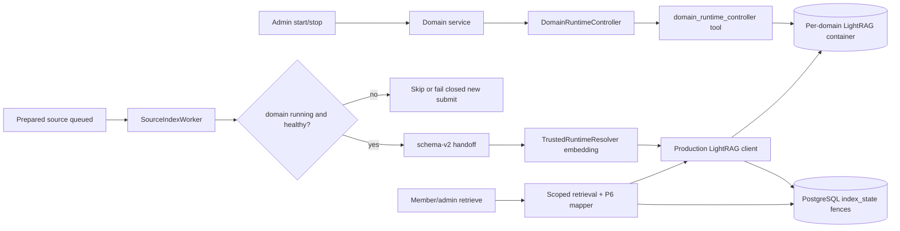
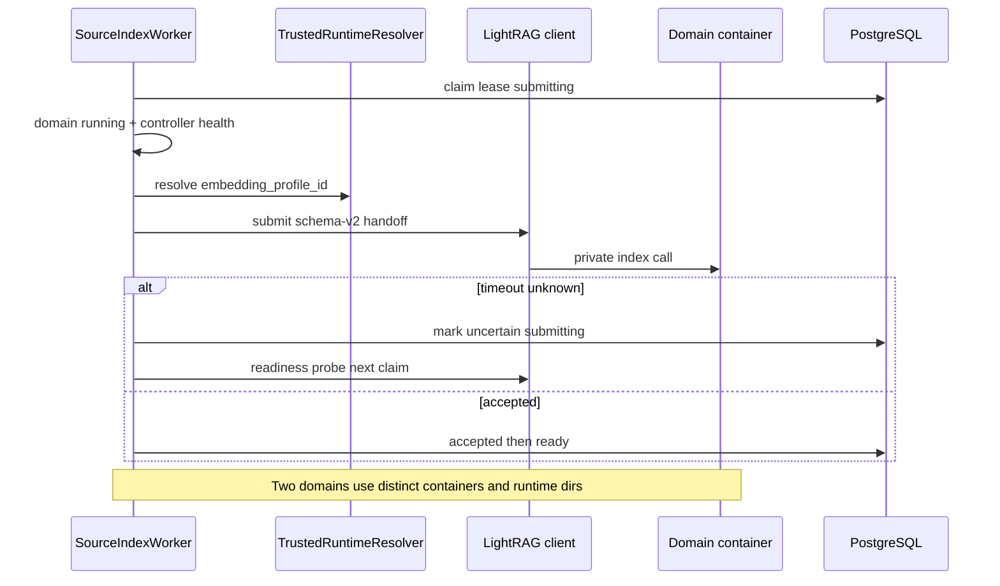

# P5-04 Real Per-Domain LightRAG Runtime - Plan

## Goal Capsule

- **Objective:** Close master-build-plan P5-04 by replacing Compose local stubs, the Alpine Docker placeholder, and the synthetic-provider native path with one real private vendored LightRAG runtime per Knowledge Domain — PostgreSQL authoritative, server-injected embedding profile and provider config, schema-v2 handoff and index/retrieval/Evidence ports preserved — with dual-lane proof (CI stubs + Compose real-runtime evidence) covering submit→ready→mapped Evidence→delete/absence, uncertain recovery, restart, and two-domain parallel isolation.
- **Authority:** Root `AGENTS.md`; FR-05 in `docs/prd.md`; A-03/A-04/A-08/A-09/C-01 in `docs/interaction-behavior-prd.md`; `docs/master-build-plan.md` P5-04 reopen (2026-07-28); `docs/architecture/deployment-topology.md`; `docs/architecture/data-and-lifecycle.md`; `docs/architecture/production-adaptation-blueprint.md`; `docs/architecture/as-built-gaps-and-decisions.md`; `docs/brownfield-refactor-register.md` DRIFT-27; P3-02/P3-03/P5-01..P5-03/P6-01 scratch evidence; `docs/quality/definition-of-done.md`.
- **Execution profile:** Inventory-first brownfield; Docker Compose as DONE proof altitude; keep `local`/`local` for default CI; injectable provider transports for non-network tests; native in-process synthetic path residual/dev; two live domains for isolation; P12-04/05/06/07 residual consumers.
- **Readiness checkpoint:** Implementation-ready after 2026-07-28 scoping confirmation (Docker DONE altitude; CI stubs + separate live lane; injectable providers; two-domain isolation bar).
- **Stop conditions:** Stop if vendored LightRAG cannot preserve exact schema-v2 block content through index/retrieve; if DONE pressure restores JSON domain registry, Redis/RQ, public/browser-visible runtime URLs, vendor-owned source authority, or heuristic Evidence mapping; if process-wide in-process lock remains the production concurrency model; if root CI is forced to require live Docker/providers; if P12-05/06/07 scopes are pulled into this slice.
- **Tail ownership:** P12-04 rebuild-after-restore drills; P12-05 ingress SSE through real runtime; P12-06 SBOM/runtime image digests; P12-07 browser E2E/capacity stress beyond two-domain isolation.

---

## Product Contract

### Summary

P5-04 closes the reopened LightRAG production-runtime slice: one private vendored `app/vendor/lightrag` runtime per Knowledge Domain, driven by the existing Docker runtime controller and index/retrieval ports, with server-resolved immutable embedding profile injection. P5-01..P5-03 and P6-01 remain credited for PostgreSQL state, handoff, local fixtures, uncertain reconcile, and Evidence mapping. Scope confirmed 2026-07-28 (Compose/Docker DONE; CI keeps stubs; injectable providers; two-domain isolation; native residual; P12 consumers out).

Product Contract preservation: Product Contract authored in this bootstrap from master-build-plan P5-04; no upstream brainstorm IDs to preserve.

### Problem Frame

P5-01 through P5-03 prove the PostgreSQL index state machine, schema-v2 handoff renderer, local adapter fixtures, lease/uncertain recovery, and query eligibility. They do not prove the production runtime: Compose selects local stubs, the Docker controller starts an Alpine sleep container, and the native client uses synthetic embed/LLM behind a process-wide lock (DRIFT-27 concurrency residual). Without one real private runtime per domain, P12-04/05/06/07 cannot honestly claim rebuild, SSE-through-runtime, SBOM, or capacity evidence — and FR-05 / A-08 remain only half-proven.

### Actors

| Actor | Role |
| --- | --- |
| Administrator | Creates/starts/stops/deletes domains; retries/cancels index; never sees runtime URLs or credentials |
| Member | Queries one authorized running domain; receives mapped Evidence only |
| Worker / API | Claims leased index work; resolves embedding profile; calls controller and LightRAG ports |
| Operator / developer | Runs Compose live-runtime evidence lane and records scratch evidence |
| Coding agent | Implements inventory, adapters, overlay, proofs, tracker closure |
| Reviewer | Confirms dual-lane honesty, DRIFT-27 closure, and residual non-claims |

### Key Flows

**F1 — Domain start with real private runtime.** Admin starts stopped domain → generation-fenced operation → Docker controller starts pinned vendored LightRAG container for that domain’s bind-mounted runtime dir on a private network (no published host ports) → health succeeds when container identity matches **and** the private endpoint answers the controller probe → domain `running` / `runtimeReady`.

**F2 — Index submit through real runtime.** Prepared source queued → SourceIndexWorker claims → refuses new submit when domain not running/healthy → renders schema-v2 handoff → resolves frozen embedding profile + current credentials → `submit` → `accepted` → readiness poll (DRIFT-28 backoff) → `ready` → query-eligible.

**F3 — Uncertain recovery.** Bounded timeout with unknown remote outcome → leave `submitting` uncertain (DRIFT-32) → next claim readiness-probes before re-submit; never double-apply stale generation.

**F4 — Mapped Evidence and delete/absence.** Eligible retrieve → scoped retrieval port → schema-v2 marker parse → joined SQL map → safe Evidence; delete path requires `delete` then `is_absent` before PG cleanup.

**F5 — Stop / warm restart / cold rebuild.** Stop fences new retrieval and new index submits; warm restart (same `runtime_instance_id`, preserved bind mount) keeps ready eligibility when LightRAG state intact; empty-volume rebuild requires reindex from canonical blocks (P12-04 owns drill depth).

**F6 — Parallel two-domain isolation.** Two domains started with distinct corpora → concurrent index/retrieve → Evidence maps only same-domain blocks; no cross-corpus leakage; no shared in-process LightRAG module state across domains on the production path.

**F7 — Dual-lane verification.** Default CI/verify stays on local stubs without Docker/providers; opt-in Compose live overlay + marked tests prove the real runtime; inventory/evidence/tracker close P5 and DRIFT-27 concurrency.

### Requirements

**Inventory and ownership**

- R1. Inventory seams in `docs/_scratch/p5-04-lightrag-real-runtime-inventory.md` with `retain` / `modify` / `replace` / `add` / `defer` / `credit` covering controller tool, local/native clients, Compose matrix, embedding injection, worker gate, isolation, and P12 residuals.
- R2. Record evidence in `docs/_scratch/p5-04-lightrag-real-runtime-evidence.md`; update `docs/master-build-plan.md` P5-04 / P5 phase status and DRIFT-27 with honest closure language and residuals.

**Runtime topology**

- R3. One private vendored LightRAG runtime per Knowledge Domain (pinned package under `app/vendor/lightrag`); PostgreSQL remains authoritative; runtime dirs stay ephemeral rebuildable derivatives.
- R4. Replace Alpine sleep placeholder with a pinned private runtime image/entrypoint driven by the existing `DomainRuntimeController` port (`operation_key`, `control_generation`, typed `succeeded`/`failed`/`uncertain`).
- R5. Production path uses Docker Compose live overlay (or equivalent Compose matrix) as DONE proof altitude; no published host ports; private inter-service reachability only; never emit runtime URLs, paths, or credentials in public DTOs, SSE, log labels, or browser storage.
- R6. Do not add a JSON domain registry, Redis/RQ, Celery/broker, browser-selectable runtime target, vendor-owned source upload authority, or heuristic Evidence mapping.

**Embedding and provider injection**

- R7. Inject the domain’s immutable `embedding_profile_id` via `TrustedRuntimeResolver.resolve_embedding_profile` (dimensions and model frozen at create); resolve current encrypted credentials at submit/retrieve time.
- R8. CI and default unit/PostgreSQL suites use injectable/fixture provider transports — no mandatory live provider network in root verify.
- R9. Synthetic 8-dim embed / `"synthetic entity"` LLM must not remain the production native path; in-process synthetic may remain residual/dev only if explicitly documented.

**Ports and contracts preserved**

- R10. Preserve schema-v2 handoff (`LIGHTRAG_HANDOFF_SCHEMA_VERSION = "2"`), `LightRAGClientProtocol` index lifecycle, scoped retrieval protocol, and P6 provenance mapper — no new public HTTP/DTO fields for runtime internals.
- R11. Preserve P5-03 / DRIFT-28 / DRIFT-32 worker semantics (lease heartbeat, poll backoff, timeout→uncertain→readiness-probe).
- R12. SourceIndexWorker refuses new index submits when the domain is not running or controller health is unhealthy; in-flight `submitting`/`accepted` rows may complete readiness probe under current generation fences.

**Proofs**

- R13. Prove real submit→ready→query-eligible→mapped Evidence→delete/absence on the live-runtime lane.
- R14. Prove uncertain-outcome recovery and domain stop/restart against the real runtime.
- R15. Prove parallel two-domain isolation (concurrent index/retrieve; no cross-domain Evidence).
- R16. Close DRIFT-27 concurrency residual for the production path by isolating LightRAG state per domain (process/container boundary), not by retaining a process-wide lock as the production model.
- R17. Keep default Compose (`compose.stack.yml`) and root CI on local stubs; document the live overlay and opt-in markers as the DONE evidence lane.

### Acceptance Examples

- AE1. Inventory freezes credit for P3-02/P3-03/P5-01..P5-03/P6-01 and replace for Alpine placeholder + synthetic native production path; P12 consumers named as residuals.
- AE2. Live Compose/Docker start of two domains yields healthy private runtimes with no host-published ports and no runtime URL leakage in admin/member DTOs.
- AE3. Index of a prepared source through the real runtime reaches `ready`, becomes query-eligible, and scoped retrieval returns mapped Evidence preserving schema-v2 block identity.
- AE4. Forced timeout/uncertain path readiness-probes before re-submit; stale generation does not overwrite newer state.
- AE5. Delete/absence clears remote index state; subsequent retrieve fails closed / non-eligible as contracted.
- AE6. Two domains indexed and queried concurrently produce only same-domain Evidence; cross-domain hits discarded.
- AE7. Root verify / default Compose remain green without live Docker LightRAG or live providers; evidence doc records the separate live-lane commands and artifact revision.
- AE8. Master-build-plan P5-04 → DONE; DRIFT-27 concurrency closed or explicitly residual only for documented non-production native path.

### Scope Boundaries

**In scope**

- Real Docker controller runtime image/entrypoint; production LightRAG adapter with embedding injection; worker domain gate; Compose live overlay; dual-lane tests; inventory/evidence/tracker/DRIFT updates.

**Out of scope / deferred**

- P12-04 backup/restore drills and empty-volume rebuild rehearsal depth (consumes this runtime).
- P12-05 deployed-ingress SSE/reconnect through real runtime.
- P12-06 SBOM / immutable release digests for the runtime image (P5-04 may pin a local/dev image reference for proof).
- P12-07 browser E2E and capacity stress beyond two-domain isolation.
- Public graph API, Redis/RQ, JSON domain registry, heuristic Evidence remapping, new member/admin runtime fields.
- Making live providers mandatory in root CI.

### Deferred to Follow-Up Work

- Optional preflight of embedding-provider reachability at domain start (default: fail closed on first submit).
- Further capacity/load shedding beyond two-domain isolation (P12-07).
- Production digest pinning and SBOM (P12-06).

---

## Planning Contract

### Key Technical Decisions

- KTD1. **Compose/Docker is DONE altitude; local stubs stay CI default.** `compose.stack.yml` retains `CE_DOMAIN_RUNTIME_CONTROLLER_KIND=local` and `CE_LIGHTRAG_CLIENT_KIND=local`. Create `app/compose.stack.live.yml` (documented in `.env.stack.example`) for the real-runtime evidence lane. Rationale: matches confirmed scope and P12-02 “live Docker not in default verify” posture.
- KTD2. **Per-domain container isolation closes DRIFT-27 for production.** Each domain’s LightRAG runs in its own container against `{CE_DOMAIN_RUNTIME_ROOT}/{domain_id}/{runtime_instance_id}/` with private Docker networking and **no published host ports**. API/workers reach the runtime only through server-resolved private adapter configuration that never appears in public DTOs. **Transport (load-bearing):** private HTTP to a container-internal listen address on the Compose/private Docker network (deployment-topology “per-domain LightRAG query endpoints”), never bound to the host and never returned in public contracts. U1 inventory must confirm vendored LightRAG 1.4.16 exposes that listener (or stop). Live-lane DONE for U2/U3 requires private HTTP with zero host-published ports. The only allowed fallback is another private non-host, per-container transport that still removes the process-wide lock — **never** shared in-process module state. Rationale: deployment topology requires private per-domain query endpoints; `--network none` Alpine sleep is insufficient; process-wide in-process lock cannot prove parallel isolation.
- KTD3. **Live lane pins existing kind strings — no third vocabulary.** Live overlay sets `CE_LIGHTRAG_CLIENT_KIND=native` and `CE_DOMAIN_RUNTIME_CONTROLLER_KIND=docker`. On that path, `native` means the real vendored client with resolver injection (U3 removes synthetic 8-dim / stub LLM). `local` remains CI/default Compose only. Do not invent `docker`/`remote` client kinds. Factory continues to select `LightRAGClientProtocol` + scoped retrieval; do not fork divergent delete/readiness semantics. Residual in-process synthetic behavior, if kept at all, is non-production only (see OQ2).
- KTD4. **Embedding injection via `TrustedRuntimeResolver` at call time.** Resolve frozen profile + current credentials at submit/retrieve; injectable transport for CI (mirror parsers/synthesis). Do not hardcode 8-dim synthetic embed on the production path. Credential material must not appear in controller labels, public logs, or DTO payloads.
- KTD5. **Sealed credential bootstrap into the domain runtime.** API/worker resolves secrets via `TrustedRuntimeResolver`; deliver into the per-domain runtime only through a short-lived mode-`600` file under the bind-mounted runtime dir (or equivalent sealed init), never Docker labels, inspectable container env, or world-readable mounts. U2/U3 privacy tests assert absence from labels/logs/DTO payloads.
- KTD6. **Two-tier health.** Controller health = container running + label/instance match + successful private-endpoint probe. Index readiness remains the client/worker poll path (P5-03). `domain_available` continues to use controller health; index submit additionally requires domain running + healthy.
- KTD7. **Warm restart preserves bind-mount state; cold empty volume requires reindex.** Stop/start keeps `runtime_instance_id`; P12-04 owns empty-volume rebuild drills. Worker refuses new submits when stopped/unhealthy; in-flight readiness probes may finish under generation fences.
- KTD8. **Inventory-first, then adapter, then live overlay, then proofs.** Mirror P5-02/P5-03 scratch pattern; no DONE claim without live-lane AE evidence revision.

### Assumptions

- Confirmed 2026-07-28 call-outs: Docker DONE altitude; native residual/dev; CI stubs + separate live lane; injectable providers; two-domain isolation sufficient (capacity stress → P12-07).
- P3-03, P5-03, P6-01, P10-03 remain DONE and are credited, not reimplemented.
- Private inter-service URLs for per-domain runtimes are allowed when never browser-visible and never returned in public contracts (deployment topology).
- Optional `lightrag-runtime` / Docker CLI extras for live image builds follow existing `CE_STACK_LIVE_IMAGE` Dockerfile path.

### High-Level Technical Design

### Alternative Approaches Considered

| Approach | Why not chosen |
| --- | --- |
| Keep in-process native + process-wide lock as production | Cannot prove parallel cross-domain isolation; contradicts DRIFT-27 residual closure and deployment topology |
| Flip default Compose to real runtime | Breaks root CI / P12-02 non-network verify posture; rejected by confirmed dual-lane scope |
| Restore legacy JSON registry + Redis/RQ + public HTTP domain URLs | Explicitly forbidden by master-build-plan P5-04 and AGENTS.md |
| Credit local filesystem JSON client as production DONE | Explicit reopen rationale: stubs are not production proof |

### Risks and Dependencies

| Risk | Mitigation |
| --- | --- |
| Vendored LightRAG drops or mutates schema-v2 markers in stored chunks | Stop condition; prove round-trip before DONE; no heuristic mapper |
| Shared module state leaks across containers if misconfigured | One container + working dir per domain; isolation AE6 |
| Secrets land in labels/logs/mount world-readable files | KTD5 sealed mode-600 bootstrap; privacy scan in evidence; no credential DTOs |
| Live lane flakes / Docker-unavailable hosts | Opt-in markers; document environment; do not gate root CI |
| P12-04 starts before P5-04 DONE | P12-04 plan already hard-waits; keep residual language aligned |
| Scope creep into SSE/SBOM/browser | Explicit out-of-scope; AE7/AE8 residuals |

**Dependencies:** P3-03, P5-03, P6-01, P10-03 (DONE). Downstream: P12-04/05/06/07.

### System-Wide Impact

| Surface | Impact |
| --- | --- |
| Domain start/stop/delete | Real container lifecycle; uncertain reconcile (P3-03) remains owner of generation fences |
| SourceIndexWorker | New running/healthy gate; longer real readiness vs local instant-ready |
| Scoped retrieval / Evidence | Same ports; real chunks must carry schema-v2 markers or stop |
| Compose / ops | New live overlay; default stack unchanged; operators need Docker socket + image build for evidence lane |
| Secrets | Embedding credentials resolved into adapter/runtime bootstrap — privacy scans mandatory |
| Downstream P12 | Unblocks P12-04 U6 rebuild; feeds P12-05/06/07 without pulling those scopes here |
| Native residual | In-process synthetic path must not be mistaken for production DONE |

Failure propagation: controller/runtime unhealthy → `domain_available` false → non-eligible retrieve and fenced new index submits; in-flight uncertain rows follow P5-03 probe path. Provider misconfig fails closed on submit without marking empty success.

### Open Questions

- OQ1 (deferred implementation detail only): Exact container-internal listen port/path for vendored LightRAG 1.4.16 — settle in U1 inventory against the server entrypoint. Acceptance gate (KTD2) is not deferred: live-lane U2/U3 DONE requires private HTTP on the Docker network with zero host-published ports, or an equally private per-container non-host transport; shared in-process module state is forbidden.
- OQ2 (deferred): Whether residual in-process synthetic path is deleted or kept as an explicit non-production residual behind `native` when controller is not Docker — decide in inventory without blocking live-lane DONE (`native`+`docker` remains the production pair per KTD3).

---

## Implementation Units

### U1. Brownfield inventory for real runtime

**Goal:** Freeze credit/replace/defer seams before code changes so DONE claims stay honest.

**Requirements:** R1, AE1

**Dependencies:** None

**Files:**
- Create: `docs/_scratch/p5-04-lightrag-real-runtime-inventory.md`
- Reference: `docs/_scratch/p5-02-lightrag-renderer-adapter-inventory.md`, `docs/_scratch/p5-03-index-eligibility-inventory.md`, `docs/_scratch/p3-02-runtime-controller-inventory.md`, `docs/brownfield-refactor-register.md`, `docs/master-build-plan.md`

**Approach:** Disposition table for Alpine placeholder tool, LocalDomainRuntimeController, LocalLightRAGIndexClient, LightRAGClient synthetic providers, process-wide lock, Compose env matrix, TrustedRuntimeResolver (credit), schema-v2/P6 mapper (credit), P12 consumers (defer). Explicit reject list: JSON registry, Redis/RQ, public URLs, heuristic Evidence. Confirm vendored LightRAG 1.4.16 container-internal HTTP listener (KTD2/OQ1 port detail) or stop before U2.

**Patterns to follow:** P5-02/P5-03 inventory headers and disposition vocabulary.

**Test scenarios:**
- Test expectation: none -- inventory-only documentation unit.
- Edge: If a seam is already production-real, inventory must `retain-and-reverify` rather than invent replace work.
- Edge: If no private HTTP listener exists in vendored 1.4.16, inventory records stop/fallback per KTD2 — do not proceed to Alpine-equivalent DONE.

**Verification:** Inventory names every production gap called out in the 2026-07-28 reopen paragraph, confirms transport feasibility, and maps each seam to a later U-ID or residual owner.

---

### U2. Real Docker runtime controller image and lifecycle

**Goal:** Replace Alpine sleep with a private per-domain LightRAG container lifecycle behind the existing controller port.

**Requirements:** R3, R4, R5, R6, AE2

**Dependencies:** U1

**Files:**
- Modify: `app/context_engine/tools/domain_runtime_controller.py`
- Modify: `app/context_engine/adapters/domain_runtime_controller.py` (only if payload/health semantics need extension without breaking local controller)
- Modify: `app/context_engine/config.py` (image/env knobs as needed)
- Modify: `app/Dockerfile` / related image build path if live image install needs adjustment
- Test: `app/tests/test_domain_runtime_controller.py`
- Optional create: runtime image/entrypoint assets under an existing app packaging path (inventory-named)

**Approach:** Keep `DomainRuntimeController` Protocol and typed uncertain outcomes. Change tool start/health/stop/delete to run the pinned vendored LightRAG runtime against the bind-mounted runtime dir on a private network with no host port publish. Labels continue to fence `domain-id` / `runtime-instance-id`. **Health (KTD6):** healthy only when labels/instance match **and** the private-endpoint probe succeeds — container-alive alone is not enough. Support sealed credential file placement on the runtime mount (KTD5) without putting secrets in labels/env. Timeouts still map to `uncertain`. Local controller behavior unchanged for CI.

**Execution note:** Prefer characterization of current Alpine payload tests before replacing start command; add `@pytest.mark.integration_docker` for real container when daemon available. U2 DONE requires private HTTP (or KTD2-allowed private fallback) with zero host-published ports — not Alpine sleep.

**Patterns to follow:** P3-02 timeout→uncertain; P3-03 generation-aware reconcile; deployment-topology “no public exposure”.

**Test scenarios:**
- Happy: start → health healthy for matching labels/instance **and** private-endpoint probe → stop → delete removes container and runtime dir.
- Edge: wrong runtime_instance_id / label mismatch → health not healthy.
- Edge: container running but private endpoint not answering → health not healthy (no false-green `runtimeReady`).
- Error: Docker timeout → `uncertain` (not hard success).
- Integration: no host-published ports on running container; private HTTP reachability on Docker network.
- Privacy: controller/tool outputs, labels, and logs omit credentials and public runtime URLs; sealed bootstrap file is mode 600 when used.

**Verification:** Unit + optional integration_docker green; Alpine default no longer used when live image env is set; health probe contract proven.

---

### U3. Production LightRAG client with embedding injection

**Goal:** Wire real vendored LightRAG index/retrieve to server-resolved embedding profile and injectable transports.

**Requirements:** R7, R8, R9, R10, R13, AE3, AE5

**Dependencies:** U1, U2 (runtime reachable)

**Files:**
- Modify: `app/context_engine/services/indexing.py` (`LightRAGClient` / factory; keep renderer and worker claim helpers stable)
- Modify: `app/context_engine/services/lightrag_runtime.py` if bootstrap helpers needed
- Modify: `app/context_engine/services/runtime_config.py` only if resolver needs a narrow call-scoped export for adapters
- Test: `app/tests/test_lightrag_renderer_adapter.py` and/or create `app/tests/test_lightrag_real_runtime_client.py`
- Test: extend `app/tests/test_scoped_retrieval.py` only if retrieve surface changes require unit coverage without rewriting P6 mapper

**Approach:** When `CE_LIGHTRAG_CLIENT_KIND=native` (live lane with Docker controller per KTD3), the client talks to the per-domain private HTTP runtime and uses resolver-injected embedding dimensions/model — not synthetic 8-dim / stub LLM. Preserve schema-v2 handoff bytes as stored content so `parse_ce_block_marker` continues to work. Keep `local` client for CI. Coordinate sealed credential bootstrap with U2 (KTD5). Do not change Evidence DTO projection. Fail closed on dimension/profile mismatch.

**Execution note:** Start with failing unit tests that assert the `native` production path rejects synthetic 8-dim defaults when a domain profile is supplied via injectable resolver doubles. U3 DONE requires KTD2 transport acceptance (private HTTP or allowed private fallback), not shared in-process lock as the production model.

**Patterns to follow:** `TrustedRuntimeResolver.resolve_embedding_profile` at submit/retrieve call time; parser/synthesis injectable transports; P6-01 stop condition on provenance loss.

**Test scenarios:**
- Happy: submit handoff → readiness ready → retrieve chunks retain schema-v2 first-line markers → delete → `is_absent` true.
- Edge: content-hash idempotent re-submit; hash conflict safe failure.
- Error: provider transport timeout → typed uncertain/timeout mapping compatible with P5-03; misconfigured credentials → fail closed safe code.
- Integration: resolver called with domain’s frozen `embedding_profile_id`; vector dimensions match profile, not hardcoded 8; client uses private HTTP to domain container.
- Privacy: no credential or raw provider payload in adapter safe errors, labels, or world-readable mounts.

**Verification:** Focused unit suite green; schema-v2 round-trip asserted; synthetic defaults absent from `native`+Docker production path.

---

### U4. Worker domain gate and uncertain-path re-verify

**Goal:** Fence new index work on stopped/unhealthy domains while preserving P5-03 uncertain recovery against real remote outcomes.

**Requirements:** R11, R12, R14, AE4

**Dependencies:** U2, U3

**Files:**
- Modify: `app/context_engine/services/indexing.py` (`SourceIndexWorker`)
- Test: `app/tests/test_source_index_eligibility.py`
- Test: `app/tests/test_postgres_source_index_eligibility.py` (or focused new PG file if cleaner)

**Approach:** Before new submit, require domain `running` and controller healthy (align A-04 stop fence with real runtime). Allow readiness-probe completion for current-generation `submitting`/`accepted`. Do not weaken lease/generation fences. Map real timeout to existing uncertain → probe path.

**Patterns to follow:** P5-03 eligibility inventory; P3-03 stop fence; barrier-driven PG tests.

**Test scenarios:**
- Happy: running+healthy domain indexes to ready.
- Edge: domain stopped after claim → new submit skipped/fail closed; readiness probe for already-accepted may complete if generation current.
- Error: timeout → uncertain → probe before re-submit (AE4).
- Integration: PostgreSQL barrier — stale generation no-op still holds with real client double or live lane.

**Verification:** Eligibility unit + PG proofs green; no regress of DRIFT-28/32.

---

### U5. Compose live overlay and configuration matrix

**Goal:** Make the real-runtime evidence lane operable without changing default stub Compose.

**Requirements:** R5, R17, AE2, AE7

**Dependencies:** U2, U3

**Files:**
- Create: `app/compose.stack.live.yml`
- Modify: `app/.env.stack.example` (live-runtime block already sketched — make real)
- Modify: `app/compose.stack.yml` only if comments/docs needed — **do not** flip local defaults
- Test: `app/tests/test_compose_stack_config.py` (assert default stays local; live overlay merges expected kinds)

**Approach:** Overlay sets `CE_DOMAIN_RUNTIME_CONTROLLER_KIND=docker` and `CE_LIGHTRAG_CLIENT_KIND=native` (KTD3), runtime root, image pin, and private network attachments required by U2. Document operator commands in evidence. Root `scripts/verify.sh` remains stub-friendly.

**Patterns to follow:** P10-01 deferred live overlay notes; P10-02 smoke separation; Dockerfile `CE_STACK_LIVE_IMAGE`.

**Test scenarios:**
- Happy: `docker compose -f compose.stack.yml -f compose.stack.live.yml config` resolves `docker` + `native` and the runtime image.
- Edge: default `compose.stack.yml` alone still local/local.
- Error: missing required live env fails closed in docs/config tests as designed.
- Test expectation for live smoke execution: recorded in U6 evidence, not mandatory in default pytest.

**Verification:** Compose config tests green; `.env.stack.example` documents `native`+`docker` live lane.

---

### U6. Dual-lane proof suite and two-domain isolation

**Goal:** Prove AE3–AE7 at the real-runtime boundary and keep CI green on stubs.

**Requirements:** R13, R14, R15, R16, R17, AE3, AE4, AE5, AE6, AE7

**Dependencies:** U2, U3, U4, U5

**Files:**
- Create: `app/tests/test_lightrag_real_runtime_integration.py` (markers: `integration_docker` and/or explicit live env gate)
- Create or extend: `app/tests/test_postgres_lightrag_real_runtime.py` for barrier isolation when PG+runtime available
- Create: `docs/_scratch/p5-04-lightrag-real-runtime-evidence.md`
- Modify: existing local stub tests only if factory defaults need explicit kind pins

**Approach:** Live lane: two domains, distinct marker corpora, concurrent index/retrieve, mapped Evidence only from selected domain, delete/absence, stop/restart warm path, uncertain injection where feasible. CI lane: unchanged local fixtures. Record commands, env, artifact revision, privacy scan notes.

**Execution note:** Prefer barrier/latch concurrency over sleeps. Do not stub a second synthetic runtime to claim AE6/AE7.

**Patterns to follow:** `test_postgres_scoped_retrieval.py` fences; P5-03 evidence command blocks; P12-04 anti-stub rule.

**Test scenarios:**
- Happy: Covers AE3 — submit→ready→eligible→mapped Evidence on live runtime.
- Happy: Covers AE5 — delete/absence fail-closed retrieve.
- Edge: Covers AE6 — parallel two-domain isolation; wrong-domain hits discarded.
- Error: Covers AE4 — uncertain recovery.
- Integration: Covers AE7 — default verify path does not require this file’s live marker.
- Privacy: evidence artifacts scanned for forbidden runtime URLs, credentials, handoff dumps.

**Verification:** Live-lane tests pass in documented environment; evidence doc lists residuals for P12-*.

---

### U7. Tracker, DRIFT-27, and residual closure

**Goal:** Advance P5-04 to DONE with honest residuals and unblock P12-04’s hard wait.

**Requirements:** R2, R16, AE1, AE8

**Dependencies:** U1, U6

**Files:**
- Modify: `docs/master-build-plan.md` (P5-04 status, P5 phase blurb, closure evidence paragraph)
- Modify: `docs/brownfield-refactor-register.md` (DRIFT-27)
- Modify: `docs/_scratch/p5-04-lightrag-real-runtime-evidence.md` (final residuals)
- Optionally note cross-link in `docs/plans/2026-07-28-005-feat-p12-04-backup-restore-drills-plan.md` only if a one-line prerequisite pointer helps — prefer scratch evidence as authority

**Approach:** Write closure language parallel to P5-03/P6-01 evidence paragraphs. DRIFT-27 concurrency closed for production Docker path; any residual native in-process lock must be labeled non-production. Name P12-04/05/06/07 as consumers.

**Test scenarios:**
- Test expectation: none -- documentation/tracker unit.
- Edge: Do not mark DONE if U6 live-lane AE3/AE6 missing.

**Verification:** Master-build-plan shows P5-04 DONE with evidence path; DRIFT-27 status matches reality; P12-04 implementers can cite the evidence revision.

---

## Verification Contract

### Gates

1. Inventory (U1) complete before production code claims.
2. Focused unit tests for controller + production client + worker gate.
3. PostgreSQL barrier tests for eligibility/uncertain where extended.
4. Opt-in live Compose/Docker lane for AE2–AE6 (documented in evidence).
5. Default `scripts/verify.sh` / Compose stack config remain green on local stubs (AE7).
6. Privacy scan of live-lane logs/fixtures for forbidden runtime/credential leakage.
7. Master-build-plan + DRIFT-27 updated (U7).

### Proof altitude

| Lane | Proves | Not claimed |
| --- | --- | --- |
| Default CI / `compose.stack.yml` | Stub packaging, contracts, PG state machines | Production LightRAG |
| Live overlay + marked tests | Real per-domain runtime, isolation, uncertain, delete | P12 ingress/SBOM/browser/capacity |

---

## Definition of Done

- All requirements R1–R17 and acceptance examples AE1–AE8 satisfied.
- Schema-v2 handoff and P6 mapper unchanged in contract behavior.
- Production path no longer uses Alpine sleep or synthetic 8-dim embed as the real runtime.
- DRIFT-27 concurrency closed for the Docker production path (or explicitly residual only on documented non-production native).
- Default CI does not require live Docker LightRAG or live providers.
- `docs/_scratch/p5-04-lightrag-real-runtime-inventory.md` and `-evidence.md` record commands and artifact revision.
- `docs/master-build-plan.md` P5-04 is DONE; P12-04 hard prerequisite is unblocked for implementation.
- Residuals explicitly name P12-05/06/07 and any deferred native cleanup (OQ2).

---

## Appendix

### Sources and research

- Confirmed solo scoping 2026-07-28 (Docker DONE; CI stubs; injectable providers; two-domain isolation).
- Repo research: `indexing.py` local/native clients; `tools/domain_runtime_controller.py` Alpine placeholder; Compose local/local; `TrustedRuntimeResolver`; schema-v2 = `"2"`; `_NATIVE_LIGHTRAG_LIFECYCLE_LOCK`.
- Institutional learnings: no `docs/solutions/` corpus; authority from P5/P6/P3 scratch evidence and DRIFT-27/28/32.
- External web research: skipped — vendored LightRAG 1.4.16 and architecture/legacy reject list are settled locally.
- Legacy `.references/` patterns consulted only as adapt/reject evidence (no JSON registry, Redis/RQ, public URLs, heuristic mapping).
