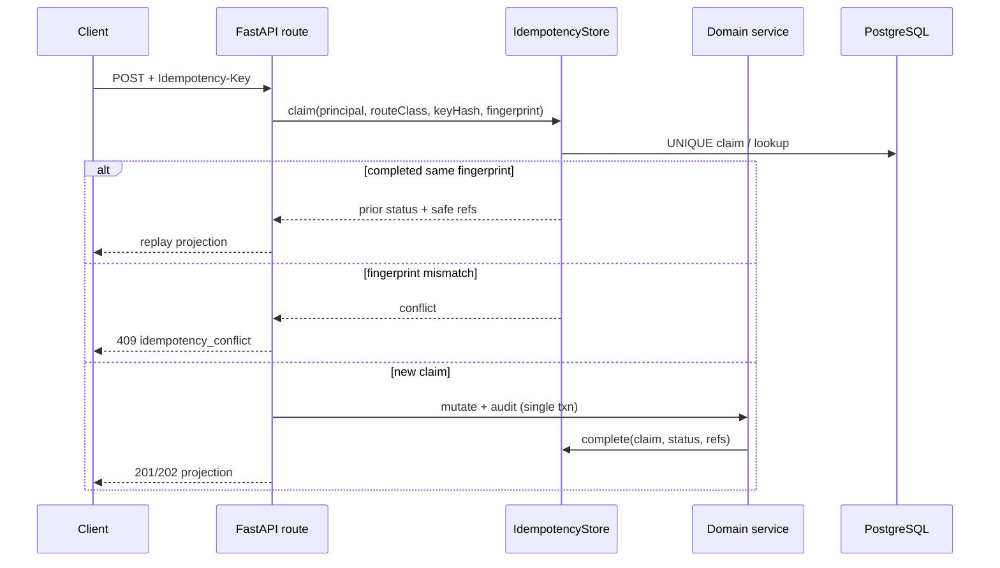
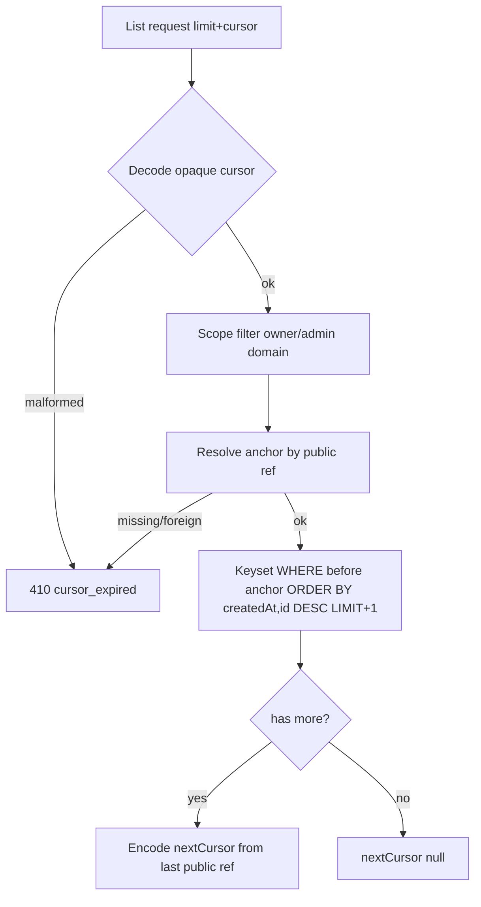

# P1-07 Durable Idempotency and Keyset Pagination - Plan

## Goal Capsule

- **Objective:** Close P1-07 by adding one shared PostgreSQL-backed HTTP create/operation Idempotency-Key store and completing opaque keyset pagination on every cataloged list that still stubs or omits `nextCursor`, including conversation create adoption.
- **Authority:** Root `AGENTS.md` → `docs/contracts/http-api-catalog.md` (pagination + Idempotency-Key) → `docs/database-schema.txt` → `docs/master-build-plan.md` P1-07 → `docs/brownfield-refactor-register.md` comparative-gap addendum → `docs/quality/definition-of-done.md`.
- **Execution profile:** Inventory-first brownfield; credit existing conversation/document keyset and chat `clientRequestId` proofs; YAGNI/KISS/DRY; dual-lane CI (default unit + opted-in PostgreSQL 16 races).
- **Readiness checkpoint:** Implementation-ready after 2026-07-28 in-place enrichment against live seams (no durable HTTP idempotency table; zero backend `Idempotency-Key` readers; 2/7 lists already keyset-real).
- **Stop conditions:** Stop if DONE pressure invents user admin mutations, browser list UX, Redis/RQ, uncataloged endpoints, or weakens ownership `404` non-disclosure; do not conflate chat turn `clientRequestId` with HTTP `Idempotency-Key`.
- **Tail ownership:** P9-07/P12-07 consume list/create UX; DRIFT-01 response-component adoption remains vertical-owned; documents `(updatedAt,id)` vs global `(createdAt,id)` is an inventory residual unless trivial to align.

---

## Product Contract

### Summary

Implement one PostgreSQL-backed Idempotency-Key + fingerprint store for every cataloged create/operation route that lists the header, and opaque keyset pagination returning capability-specific `{collection,nextCursor}` for admin users/domains/sources/operations plus credit verification of documents/conversations.

Product Contract preservation: Product Contract unchanged in intent from master-build-plan bootstrap; enrichment only tightens HOW (credit/gap seams, unit split, KTDs).

### Problem Frame

The HTTP catalog already requires Idempotency-Key semantics and opaque cursors, but no durable HTTP create-idempotency record exists, no route reads the header, and five admin lists still stub or omit pagination. Conversation create remains explicitly deferred in the catalog pending this shared primitive. Without it, concurrent creates can double-apply and admin collections cannot page safely.

### Actors

| Actor | Role |
| --- | --- |
| Administrator | Creates domains/profiles/sources/operations and lists admin collections |
| Member | Creates conversations and lists owned conversations/documents |
| Coding agent | Inventory, migration, service, route adoption, tests, evidence |

### Key Flows

**F1 — Idempotent create/operation.** Client retries same principal + route-class + Idempotency-Key + fingerprint → reuse prior status/projection without a second side effect or second audit; changed effective input → `409 idempotency_conflict`; concurrent same-key races serialize to one outcome on PostgreSQL 16.

**F2 — Keyset page.** Client lists with `limit`/`cursor` → stable page + opaque `nextCursor`; malformed/foreign/deleted cursor target → `410 cursor_expired`; `nextCursor` null only on the last page.

**F3 — Conversation create adoption.** `POST /conversations` uses the shared durable record; catalog deferred note is removed once proven.

### Requirements

- R1. Inventory seams in `docs/_scratch/p1-07-idempotency-pagination-inventory.md` with retain/modify/add dispositions for every catalog Idempotency-Key and `nextCursor` surface, plus credit for existing member keyset and chat turn idempotency.
- R2. Add durable idempotency table(s) storing key hash, fingerprint, principal scope, route class, completion state, safe response status + resource refs (not raw bodies/secrets), and timestamps; document in `docs/database-schema.txt`.
- R3. Same key+fingerprint reuses result; mismatch → `409 idempotency_conflict`; prove concurrent same-key on PostgreSQL 16.
- R4. Adopt Idempotency-Key on all ten cataloged create/operation routes that list it, including conversation create; missing header keeps today’s non-keyed behavior (header optional unless inventory proves otherwise).
- R5. Implement opaque keyset pagination for `GET /admin/users`, `GET /admin/domains`, domain/source operations lists, and admin sources; credit `GET /documents` and `GET /conversations` with verification/hardening only.
- R6. Conversation cursors already carry versioned public refs and owner-filter; preserve that invariant; admin cursors must use opaque public refs (or approved safe anchors) and scope filters before keyset derivation.
- R7. Evidence in `docs/_scratch/p1-07-idempotency-pagination-evidence.md`; mark P1-07 DONE and set P1 phase DONE when no other open P1 tasks remain; update catalog deferred language for conversation create.

### Acceptance Examples

- AE1. Inventory freezes every cataloged Idempotency-Key and `nextCursor` surface with credit/gap.
- AE2. Concurrent identical create with one key yields one product row and matching responses.
- AE3. Changed body/fingerprint same key → `409 idempotency_conflict` with no second mutation.
- AE4. Admin list pages return opaque `nextCursor` until exhausted; null only on last page; limit default 50 max 100.
- AE5. Conversation create with Idempotency-Key is durable and replay-safe; catalog no longer marks it deferred.

### Scope Boundaries

#### In scope

- Shared durable HTTP idempotency primitive + PG race proofs
- Route adoption for the ten cataloged Idempotency-Key surfaces
- Keyset pagination on five admin list gaps; credit verify two member lists
- Catalog + schema + OpenAPI/generated client sync where shapes change
- Inventory/evidence/tracker closure

#### Deferred to Follow-Up Work

- Broader handwritten response DTO adoption (DRIFT-01)
- Browser list virtualization / Settings UX (P9-07/P12-07)
- Documents ordering align to global `(createdAt,id)` if inventory records intentional library `(updatedAt,id)` drift
- Required (non-optional) Idempotency-Key enforcement across clients

#### Outside this product's identity

- User admin mutation APIs
- Redis/RQ caches or brokers
- Wiki/audit-read lists
- Chat turn `clientRequestId` redesign (already owned by P7)

---

## Planning Contract

### High-Level Technical Design

### Key Technical Decisions

| ID | Decision | Rationale |
| --- | --- | --- |
| KTD1 | One shared idempotency store keyed by `(principal_user_id, route_class, key_hash)` with unique constraint; principal is the authenticated user id, never the session id | Avoid per-route tables; survive session rotation/replay after re-login as the same user |
| KTD2 | Store SHA-256 fingerprint of effective inputs + safe completed projection refs/status; never raw bodies, credentials, or assembled prompts | Privacy invariant; replay without re-mutating |
| KTD3 | Header optional: absent → today’s behavior; present → durable claim/replay/conflict | Existing tests/smoke omit the header; catalog lists where it applies without mandating presence |
| KTD4 | Replay path returns stored projection and must not call `commit_protected_mutation` again | Prevent double-audit and double side effects |
| KTD5 | Opaque cursors encode versioned public refs where they exist; for `GET /admin/users` the approved safe anchor is the already-public `user.id` from `safe_user` | No private DB-only identifiers; preserve conversation ownership non-disclosure |
| KTD6 | Credit `list_conversations` / `list_documents` keyset; do not rewrite chat `clientRequestId` | YAGNI; proven member lists stay verification-only |
| KTD7 | Natural dedup (`duplicate_source`, domain PK) remains; distinct from key+fingerprint conflict | Same bytes different keys → content codes; same key different fingerprint → `idempotency_conflict` |
| KTD8 | Extract a small shared cursor helper only after inventory shows duplication tax; otherwise copy the conversation pattern per list | Prefer proven local pattern over premature abstraction |
| KTD9 | U1 freezes a closed `route_class` enum (one value per catalog Idempotency-Key surface) and per-route fingerprint input lists before U3/U5 wire | Uniqueness and conflict semantics require a closed vocabulary |

### Assumptions

- Capability collection names stay capability-specific (`users`, `domains`, `sources`, `operations`, `documents`, `conversations`) with shared `nextCursor` semantics.
- No browser work in this slice; BFF already forwards `idempotency-key`.
- Alembic head to revise is current composer-ref head (`f1a8c3d04e92` at plan time); implementer re-checks head at execution.
- In-flight same-key retries may wait on the claim row or return the completed result after the first request finishes; exact pending strategy is execution-time within KTD1 uniqueness (no second mutation).

### Risks and Dependencies

| Risk | Mitigation |
| --- | --- |
| Double-write under race | PG unique + transactional claim; PostgreSQL 16 barrier tests (mirror turn-lease race style) |
| Double-audit on replay | Complete claim only after successful protected mutation; replay skips mutation helper |
| Operation lock vs replay | Same key+fingerprint after successful start/stop/delete returns prior `202`/`operation` projection, not `domain_operation_in_progress` |
| Upload fingerprint vs `duplicate_source` | Fingerprint includes content hash + frozen metadata; map codes per KTD7 |
| Cursor leaking foreign rows | Scope filter + public-ref anchor; foreign → `cursor_expired` |
| Admin users OpenAPI loosely typed today | Regenerate contracts when `{users,nextCursor}` + query params land |
| Documents `(updatedAt,id)` vs catalog `(createdAt,id)` | Inventory freezes disposition; default credit + residual unless alignment is trivial |

### Open Questions

| Question | Status |
| --- | --- |
| Exact pending/in-flight same-key HTTP status while first request still open | Deferred to implementation — uniqueness forbids double mutation; pick wait-or-replay consistent with existing operation leases |
| Whether documents ordering must change to `(createdAt,id)` | Deferred — inventory records; not a P1-07 blocker if credited with residual |
| Idempotency row retention/TTL | Deferred — Phase 1 accepts append-only completed claims; compaction is follow-up if volume warrants |

---

## Implementation Units

### U1. Idempotency and pagination inventory

**Goal:** Freeze credit/gap surfaces before code.

**Requirements:** R1, AE1

**Dependencies:** None

**Files:**
- Create: `docs/_scratch/p1-07-idempotency-pagination-inventory.md`

**Approach:** Table every catalog Idempotency-Key and `nextCursor` route with current handler/service path, credit vs gap, and disposition (`retain-and-reverify` / `modify` / `add`). Freeze a closed `route_class` enum for the ten key surfaces and the effective-input fields that enter each fingerprint. Explicitly credit: conversation/document keyset, chat turn fingerprint, BFF header allowlist, error codes in `public_schemas`. Explicitly gap: no HTTP idempotency table; zero backend header readers; five admin lists; conversation create deferred note.

**Patterns to follow:** `docs/_scratch/p12-03-adversarial-security-inventory.md`; brownfield register disposition vocabulary

**Test scenarios:**
- Test expectation: none -- inventory unit.

**Verification:** Every listed catalog surface has a disposition; credit/gap counts match research (10 Idempotency-Key routes; 7 list surfaces with 2 credited).

---

### U2. Durable idempotency schema and service

**Goal:** Shared create/operation idempotency primitive with race proofs, before route wiring.

**Requirements:** R2, R3, AE2, AE3

**Dependencies:** U1

**Files:**
- Create: `app/migrations/versions/<rev>_http_idempotency_records.py` (revises current Alembic head)
- Modify: `app/context_engine/models.py`
- Modify: `docs/database-schema.txt`
- Create: `app/context_engine/services/idempotency.py`
- Create: `app/tests/test_idempotency_store.py`
- Create: `app/tests/test_postgres_idempotency_races.py`

**Approach:** Migration adds table with uniqueness on principal + route class + key hash; columns for fingerprint, state, HTTP status, safe resource-ref payload, timestamps. Service API: hash key, compute fingerprint, claim/lookup, complete, conflict. Map mismatch to service code that routes project as `409 idempotency_conflict`. Never store raw request bodies or secrets. Prove concurrent identical claims on PostgreSQL 16.

**Execution note:** Start with failing PostgreSQL race characterization for double-create under one key, then implement the store.

**Patterns to follow:** `ConversationTurn` `(conversation_id, client_request_id)` uniqueness + `_matching_existing_turn` fingerprint compare; `commit_protected_mutation` atomicity; Alembic `{12_hex}_{snake}.py` naming

**Test scenarios:**
- Happy: complete then replay returns same status/refs without second side-effect callback.
- Error: same key different fingerprint → conflict; no complete row for loser.
- Edge: key hash stored, not raw key; fingerprint row contains no password/credential substrings.
- Integration: two concurrent identical claims on PostgreSQL 16 → one winner product effect, matching projections.

**Verification:** Unit suite green; opted-in PostgreSQL race suite green; schema head advances with rollback note.

---

### U3. Adopt Idempotency-Key on create routes

**Goal:** Wire durable store into the four create-shaped catalog routes, including conversation create.

**Requirements:** R4, AE5

**Dependencies:** U2

**Files:**
- Modify: `app/context_engine/api/routes.py` (`post_conversation`, `admin_create_model_profile`, `admin_create_domain`, `admin_upload_source`)
- Modify: `app/context_engine/services/conversations.py` (`create_conversation`)
- Modify: `app/context_engine/services/runtime_config.py` (`create_model_profile`)
- Modify: `app/context_engine/services/domains.py` (`create_domain`)
- Modify: `app/context_engine/services/sources.py` (`upload_source_bytes` / upload entry)
- Create/modify: `app/tests/test_conversation_http_contract.py`, focused create-idempotency HTTP/service tests
- Regenerate if needed: `app/contracts/openapi.json`, `app/client/src/lib/api/generated/openapi.ts`

**Approach:** Parse optional `Idempotency-Key`; when present, claim before mutation and complete inside the same success path as protected mutation. Replay reconstructs closed DTO from stored refs. Keep content codes (`duplicate_source`, domain id conflict) distinct from fingerprint conflict. Absent header preserves current behavior. U3 proves conversation create durability (AE5 runtime); U4 removes the catalog deferred note after evidence lands.

**Patterns to follow:** Chat turn attach/replay conflict projection via route error maps; existing create + `commit_protected_mutation` call sites

**Test scenarios:**
- Happy: conversation create with key → 201; identical retry → 201 same conversation, one row.
- Happy: model-profile / domain create replay returns same projection.
- Error: same key different title/body → `409 idempotency_conflict`.
- Edge: upload same key different bytes → `idempotency_conflict`; different key same bytes → existing `duplicate_source`.
- Integration: absent header still creates distinct rows (optional-header contract).

**Verification:** Focused HTTP/service tests green; AE5 create durability proven (catalog edit deferred to U4).

---

### U5. Adopt Idempotency-Key on operation routes

**Goal:** Wire durable store into the six cataloged operation routes that list the key.

**Requirements:** R4, AE2, AE3

**Dependencies:** U2

**Files:**
- Modify: `app/context_engine/api/routes.py` (domain start/stop/delete; source retry, index retry, source delete)
- Modify: `app/context_engine/services/domains.py` (`start_domain`, `stop_domain`, `enqueue_delete_domain`)
- Modify: `app/context_engine/services/sources.py` (`retry_source`, `enqueue_delete_source`)
- Modify: `app/context_engine/services/indexing.py` (`retry_source_index`)
- Create/modify: focused operation-idempotency tests (unit + optional PG)

**Approach:** Same claim/complete helper from U2. Successful replay returns prior `202`/`operation` or `202`/`source` projection. Coordinate with existing active-operation locks and `If-Match` so same-key replay is not misclassified as `domain_operation_in_progress` / `stale_revision`. Source cancel remains `If-Match` only (not in Idempotency-Key set). May proceed in parallel with U3 once U2 lands.

**Patterns to follow:** Domain generation/lease fences; U2 `IdempotencyStore` claim/complete

**Test scenarios:**
- Happy: start with key → 202; identical retry → same operation projection.
- Error: same key different effective target/generation inputs → `idempotency_conflict`.
- Edge: `If-Match` failure still wins over silent replay when revision is wrong.
- Integration: concurrent identical start keys → one operation row.

**Verification:** Focused operation tests green; no regression in existing domain lease/A-0x suites.

---

### U6. Admin keyset pagination + member list credit

**Goal:** Replace admin list stubs/omissions with opaque keyset pages; verify credited member lists.

**Requirements:** R5, R6, AE4

**Dependencies:** U1

**Files:**
- Modify: `app/context_engine/api/routes.py` (`admin_users`, `admin_list_domains`, `admin_domain_operations`, `admin_list_sources`, `admin_source_operations`; ensure `cursor`/`limit` query params)
- Modify: `app/context_engine/services/domains.py` (`admin_domain_list`, `domain_operations`)
- Modify: `app/context_engine/services/sources.py` (`list_sources`, `source_operations`)
- Modify or create: admin users list helper (extract from inline `admin_users` if needed)
- Modify: `app/context_engine/services/conversations.py` / `documents.py` only if inventory requires credit hardening
- Create: `app/tests/test_admin_pagination.py` (and/or extend existing domain/source HTTP tests)
- Modify: `app/tests/test_conversations_service.py`, `app/tests/test_documents_service.py`, HTTP contracts as needed
- Regenerate: OpenAPI/TypeScript when query/response shapes tighten

**Approach:** Follow conversation cursor pattern: versioned JSON → base64url; public ref field per capability; for admin users encode `{version,userId}` using the already-public `safe_user.id` (KTD5); scope filter; `(createdAt,id)` DESC keyset with `limit+1`; clamp limit 1..100 default 50. `GET /admin/users` must gain `{users,nextCursor}` (today omits `nextCursor`). Replace hard-coded `"nextCursor": None` stubs. Credit conversations/documents; add multi-page HTTP proof where missing; record documents ordering residual if kept.

**Patterns to follow:** `app/context_engine/services/conversations.py` `_encode_cursor` / `_decode_cursor` / `list_conversations`

**Test scenarios:**
- Happy: admin domains with `limit=1` → opaque `nextCursor`; second page returns remainder; final page `nextCursor` null.
- Happy: admin users paginates and never returns password hashes/sessions.
- Edge: `limit=0` or `101` → `422 validation_error`; default limit 50 when omitted.
- Error: malformed cursor → `410 cursor_expired`; cross-domain source cursor → `cursor_expired`.
- Integration: conversations cross-owner cursor still `410` (credit re-proof).

**Verification:** Focused pagination tests green; OpenAPI regenerated if params/responses change; inventory residuals named.

---

### U4. Evidence and tracker closure

**Goal:** Honest P1-07 / P1 phase DONE.

**Requirements:** R7, AE5 (catalog closure)

**Dependencies:** U3, U5, U6

**Files:**
- Create: `docs/_scratch/p1-07-idempotency-pagination-evidence.md`
- Modify: `docs/master-build-plan.md`
- Modify: `docs/brownfield-refactor-register.md` comparative-gap row if present
- Modify: `docs/contracts/http-api-catalog.md` (remove conversation-create deferred note)

**Approach:** Record commands, case IDs, privacy assertions, PG race results, residuals (documents ordering, DRIFT-01, UI, retention). Mark P1-07 DONE; set P1 phase DONE because P1-01..P1-07 will then be complete. Remove catalog deferred language only after U3 AE5 runtime proof.

**Patterns to follow:** `docs/_scratch/p12-02-suite-contract-convergence-evidence.md` shape

**Test scenarios:**
- Test expectation: none -- docs/tracker.

**Verification:** Tracker links evidence; P1 status honest; no invented mutations claimed.

---

## Verification Contract

- Inventory + evidence pair under `docs/_scratch/p1-07-idempotency-pagination-{inventory,evidence}.md`.
- Default pytest for store + HTTP adoption; opted-in PostgreSQL 16 race tests for concurrent same-key creates/operations.
- Contract snapshots regenerated when query/response shapes change; root generated-contract gate green.
- Privacy: idempotency rows contain no raw secrets, passwords, credentials, or request bodies; admin user pages remain safe projections.
- Catalog conversation-create deferred language removed only after AE5 proof.

## Definition of Done

1. R1–R7 and AE1–AE5 satisfied at the named boundaries.
2. Authorization, ownership `404`, and privacy classifications intact.
3. Persistence uniqueness, replay without a second mutation, and PG race proofs attached.
4. HTTP/DTO/OpenAPI/generated client synchronized for changed list/create surfaces.
5. P1-07 DONE with evidence; P1 phase DONE; residuals explicitly owned.

## Sources & Research

- `docs/contracts/http-api-catalog.md` (global pagination + Idempotency-Key; ten key routes; seven list routes)
- `docs/master-build-plan.md` P1-07; `docs/_scratch/legacy-gap-plan-bundle.md`
- `docs/brownfield-refactor-register.md` durable create-idempotency addendum
- Live seams (2026-07-28): `app/context_engine/services/conversations.py`, `documents.py`, `app/context_engine/api/routes.py` admin stubs, BFF `idempotency-key` allowlist, absence of HTTP idempotency model/migration
- Institutional `docs/solutions/` / `CONCEPTS.md`: absent — no learnings corpus to cite
- External research: skipped — strong local chat-turn + member-keyset patterns
