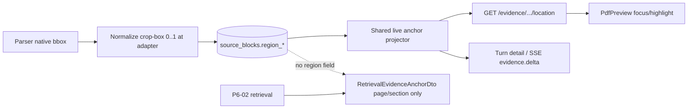

# P4-05 Figure and Table Region Provenance - Plan

## Goal Capsule

- **Objective:** Close P4-05 by extracting and persisting durable normalized figure/table regions, projecting them through authorized location resolve plus matching turn/SSE evidence anchors, and governing PDF viewer focus/fallback for M-04/M-05.
- **Authority:** docs/contracts/document-and-evidence-contract.md; M-04/M-05; docs/quality/seeded-demo-and-test-data.md; docs/frontend/document-viewer-spec.md; P6-02/P9-03 evidence.
- **Execution profile:** Inventory-first; greenfield bbox extraction at parser adapters; YAGNI/KISS/DRY; credit existing P4-03/P6-02/P9-03 seams.
- **Readiness checkpoint:** Implementation-ready after 2026-07-28 deepening + interactive doc-review applies.
- **Stop conditions:** Stop if DONE invents browser-supplied region authority, private block IDs in URLs, or changes P6-02 retrieval EvidenceItemDto / RetrievalEvidenceAnchorDto to require region without contract amendment.
- **Tail ownership:** P9-07/P12-07 browser deep-link matrix; non-PDF viewers remain future; Playwright visual matrix stays P12-07.
- **Acceptance boundary:** M-04/AE1–AE5 apply to sources prepared after the region-column migration (and to seeded fixtures upserted in this slice). Pre-migration prepared corpora keep `region: null` until a future re-prep workflow.

---

## Product Contract

### Summary

Persist optional normalized regions on canonical figure/table blocks when parsers prove them; authorize location endpoints (and matching turn/SSE evidence anchors) to return region; PDF viewer focuses region with block/section/page fallback. Stateless retrieval Evidence list remains page/section-only per P6-02.

Product Contract preservation: Product Contract unchanged except clarifying R4 fallback ladder and post-migration acceptance boundary (deepening/review strengthened HOW).

### Problem Frame

M-04 requires figure-region focus, and seed fixtures define regions, but parsers never capture bbox geometry today (page extract only), as-built location and turn-detail paths emit `region: null`, SSE `_public_evidence_items` omits `region` and fabricates `pageNumber` via `page_start or 1`, `source_blocks` has no region columns, and the viewer only navigates pages. This is greenfield extraction plus projection wiring—not “already persisted, just wire DTOs.”

### Actors

| Actor | Role |
| --- | --- |
| Member | Opens figure/table Evidence deep links |
| Administrator | Uploads/prepares sources |
| Coding agent | Persist regions, project location, viewer focus |

### Key Flows

**F1 — Publish region.** Parser yields normalized bbox → stored on `source_blocks` under prep lease fence.

**F2 — Location resolve.** Authorized GET location (and turn/SSE evidence anchors) return page + optional region + fallback; retrieval list stays region-free.

**F3 — Viewer focus.** Documents route opens PDF, focuses region with margin highlight, or falls back to containing-block → section → page; URL page is hint only.

### Requirements

- R1. Inventory docs/_scratch/p4-05-region-provenance-inventory.md credit/gap for parser bbox shapes, schema, location, turn/SSE projection, viewer.
- R2. Persist optional normalized region {x,y,width,height} in 0..1 when parser proves it; never fabricate.
- R3. Authorized location/deep-link DTOs may include region when proven; server ignores browser-supplied region for authority.
- R4. Viewer: valid region → page + fit/highlight; else containing-block highlight → sectionLabel → page with Exact location unavailable; unauthorized → Evidence no longer available.
- R5. Keep P6-02 retrieval EvidenceItemDto / RetrievalEvidenceAnchorDto page/section-only unless an approved coordinated contract change lands in this slice.
- R6. Seed/fixture alignment with docs/quality/seeded-demo-and-test-data.md figure/table region constants, including live `SourceBlock` rows. Live/operator region + multi-kind Evidence characterization that needs a real multi-page PDF with tables/figures uses `doc_vehicle_suspension` (`Vehicle_Suspension_System_Technology_And_Design_TEST.pdf`); deterministic seed constants remain `doc_pump_manual` / `ev_mina_*`.
- R7. Evidence docs/_scratch/p4-05-region-provenance-evidence.md; tracker DONE.
- R8. Shared live anchor projector owns location + turn/SSE evidence anchors; never silent page-1 fabrication for unprovable pages.

### Acceptance Examples

- AE1. Pump-manual figure fixture publishes region matching seed constants `(0.12,0.24,0.66,0.41)`.
- AE2. Location resolve returns region for figure Evidence; text without region stays null; retrieval list still rejects region; turn detail and SSE `evidence.delta` match location for the owner.
- AE3. Viewer focuses region; missing region falls back without crash; URL page hint cannot override authorized location.
- AE4. Cross-owner, unknown evidenceRef, and admin-on-member-owned location share stable C-04 404 envelope (no region/document leak), including bounded timing parity where the suite already patterns conversation ownership.
- AE5. Table (`ev_mina_table_torque`) and page-only (`ev_mina_page_only`) deep links follow region vs page-fallback paths.

### Scope Boundaries

#### In scope

- Greenfield bbox → normalized region extraction at Docling/Reducto adapters
- Region persistence on `source_blocks`
- Location projection first, then turn/SSE evidence anchor projection (not retrieval)
- PDF viewer focus/fallback including stale-anchor and a11y highlight
- Fixture/seed `SourceBlock` upserts
- Tests/evidence
- Fix page-1 fabrication in `_public_evidence_items` via shared projector

#### Deferred to Follow-Up Work

- Non-PDF/PPT viewers
- Upload orphan compensation
- P12-07 Playwright / visual matrix
- Re-prep workflow to backfill regions on pre-migration prepared corpora
- Exact live-region announcement copy strings (see Deferred / Open Questions)
- Table accessible-summary projection if not already contracted on location anchor

#### Outside this product's identity

- Heuristic bbox guessing
- Private object keys / block IDs in browser
- Graph UI
- Region query params in deep-link URLs

---

## Planning Contract

### Key Technical Decisions

| ID | Decision | Rationale |
| --- | --- | --- |
| KTD1 | Regions are optional proven metadata | Never fabricate page 1 or region; missing parser bbox → null success |
| KTD2 | Location + turn/SSE project region; retrieval stays P6-02 closed | `EvidenceRegionDto` already contracted on `EvidenceAnchorDto`; `RetrievalEvidenceAnchorDto` must stay region-free; no OpenAPI regen unless validation bounds change |
| KTD3 | Adapters normalize native bbox to unrotated PDF crop-box 0..1 once; viewer transforms for rotation/zoom/device scale | Matches document-viewer-spec; raw provider `bbox` stays forbidden |
| KTD4 | Persist four nullable columns on `source_blocks` with CHECKs | Block is the citable unit; matches schema column+CHECK style |
| KTD5 | Single backend live projector from `SourceBlock` | Reuse page-resolution rules from `evidence._evidence_anchor` (including figure linked-image page join) without putting region on the retrieval DTO; location and turn/SSE share the region-capable projector; fallback `region` > containing-block cue > `section` > `page` |
| KTD6 | Viewer highlights only after authorized location | Chat card / URL `page` are hints; region never encoded in URL |
| KTD7 | U4 unblocked by location projector green | Turn/SSE wiring may finish after viewer proof starts; both still required for slice DONE |

### Assumptions

- P9-03 PDF preview infrastructure and location route remain credit.
- Docling/Reducto may omit regions → null is success for that block.
- Phase 1 does not re-prep `prepared` sources in ways that replace block UUIDs; missing block → 410.
- Spec-flow defaults for stale-anchor / concurrent prep are accepted for this slice.
- Product acceptance for M-04 on existing admin corpora requires a later re-prep task (explicitly deferred).

### Open Questions

#### Resolved During Planning

- **Storage surface:** `source_blocks` columns (KTD4), not image JSON.
- **Contract amendment:** not required for public `EvidenceRegionDto`; extraction + projection wiring.
- **Chat card region:** in scope via shared projector.
- **Figure page-from-image join:** in scope in U3 — projector reuses the existing single linked-image page rule from `evidence.py` before emitting region.
- **Coordinate authority:** adapters own crop-box 0..1; PdfPreview owns rotation/zoom/device-scale transform (KTD3).

#### Deferred to Implementation

- Exact Alembic revision id and CHECK constraint names.
- Exact helper module path for the shared projector (colocate vs small new module).

#### Accepted defaults (from flow analysis)

- After re-prep/preview swap: re-resolve at location from current blocks; remap failure → degrade fallback + stale-anchor copy; never paint old region on new preview.
- Concurrent prep while viewing: document/session generation fence drops stale fetches; no mixed-generation highlight.
- Invalid page / page > pageCount: fail closed to unavailable or page fallback — never silent page-1 for evidence deep links.

### High-Level Technical Design



Publish stays inside the existing prep lease/generation fence. Browser deep links carry opaque `document` + `evidence` + optional `page` hint only.

U3 sequencing:

```text
U3a location projector + figure page join + authz/privacy tests
  → unblocks U4
U3b wire _turn_evidence_items + _public_evidence_items + SSE leak scans
  → required before U5 / P4-05 DONE
```

### Risks and Dependencies

| Risk | Mitigation |
| --- | --- |
| Multi-surface anchor drift (location vs turn/SSE vs retrieval) | Shared projector reusing `_evidence_anchor` page rules; U3a location then U3b turn/SSE; P6 retrieval regression stays region-free |
| Schema/ORM missing region columns | Expand-only Alembic + database-schema.txt; nullable; deploy migration before app replicas that read region columns; rollback = revert app first, then drop columns |
| Invalid normalized rects | DB CHECK + validate_prepared_source before publish |
| Region outside atomic publish txn | Map inside publish_prepared_source insert path; validate before block delete |
| C-04 envelope drift once region joins location | Ownership before block load; unknown vs cross-owner vs admin-on-member stable-envelope + timing parity tests |
| Browser/URL/chat-cache region authority | U4: highlight only after location; forbid region coords in URLs |
| Raw bbox / object_key bleed | Normalized columns only; privacy scan success + denial + SSE with region present |
| Stale location region race (M-06/C-03) | locationGenerationRef + U4 generation-fence tests |
| Stale highlight after re-prep / preview swap | Location re-fetch; stale-anchor copy; never mixed-generation paint |
| Fixture-only AE1 while live parsers still null | Parser-adapter tests with native bbox payloads required before DONE |

### System-Wide Impact

- **Persistence:** `docs/database-schema.txt`, Alembic, `SourceBlock` ORM, prep privacy scan.
- **Adapters:** Docling/Reducto normalizers → `PreparedBlock.region`; `"bbox"` remains forbidden.
- **HTTP:** existing `GET /evidence/{evidenceRef}/location` projection only; query params with coordinates stay 422.
- **Chat:** turn detail + SSE evidence anchors gain optional region; retrieval POST unchanged.
- **Frontend:** `DocumentsPage` / `PdfPreview` region focus; deep-link builders stay region-free.
- **Deletion/redaction:** no region on evidence rows; fenced location 410; redacted turns omit evidence.
- **Contracts:** verify OpenAPI/JSON Schema/TS snapshots unchanged unless validation tightens.
- **BFF:** pass-through only.

---

## Implementation Units

### U1. Region provenance inventory

**Goal:** Freeze seams and dispositions before edits.

**Requirements:** R1

**Dependencies:** None

**Files:**
- Create: docs/_scratch/p4-05-region-provenance-inventory.md

**Approach:** Credit P4-03/P6-02/P9-03; mark greenfield bbox gap, schema gap, location/turn/SSE projection gaps, viewer page-only, seed AE1 gap. Inventory Docling `prov`/bbox and Reducto block bbox field paths, coordinate space (pixels vs normalized), and page-dimension source for 0..1. Disposition retain/modify/add per brownfield register. Match p9-03 inventory table shape.

**Patterns to follow:** docs/_scratch/p9-03-documents-library-inventory.md; docs/_scratch/p4-03-parser-adapters-inventory.md

**Test scenarios:**
- Test expectation: none -- inventory.

**Verification:** Disposition register complete; bbox field-shape rows filled; stop conditions named.

---

### U2. Persist parser regions on publish

**Goal:** Extract and store proven regions under prep fence.

**Requirements:** R2, R6, AE1

**Dependencies:** U1

**Files:**
- Modify: app/context_engine/adapters/parsers.py
- Modify: app/context_engine/models.py
- Modify: app/context_engine/services/sources.py
- Modify: docs/database-schema.txt
- Create: app/migrations/versions/*_source_block_regions.py
- Modify: app/tests/test_parser_adapters.py
- Modify: app/tests/test_postgres_source_preparation.py
- Modify: app/tests/test_postgres_sources_schema.py
- Modify: app/context_engine/dev/seed_composer_refs.py (and/or deterministic prep fixture) for AE1/AE5 constants

**Approach:** Treat bbox capture as greenfield adapter work: add optional normalized region on `PreparedBlock`; map Docling/Reducto native bbox → unrotated crop-box-relative 0..1 once; reject out-of-range in `validate_prepared_source` before block delete; expand-only nullable `region_x/y/width/height` on `source_blocks` with all-null-or-all-set CHECK; publish inside existing `publish_prepared_source` transaction; keep raw `"bbox"` forbidden; privacy scan emits normalized region only. Upsert canonical `SourceBlock` rows with stable IDs matching seeded evidence refs (e.g. `block_valve_figure`) and page/section/region from `docs/quality/seeded-demo-and-test-data.md`. Include representative native-bbox fixtures in `test_parser_adapters.py` (not seed-injection alone).

**Execution note:** Start with failing parser/prep tests for seed figure constants and native-bbox fixtures, then migration + publish mapping.

**Patterns to follow:** P4-03 publish fence; migration style of a8d3f1c62e90

**Test scenarios:**
- Happy: figure region persisted matching seed `(0.12,0.24,0.66,0.41)` from native-bbox fixture.
- Happy: table region persisted for torque fixture constants.
- Happy: seeded `SourceBlock` rows exist for `ev_mina_figure_valve` / table/page-only refs so location resolve is not 410.
- Edge: missing bbox → null success.
- Error: out-of-range / partial rect rejected before publish; prior generation blocks preserved.
- Integration: PostgreSQL publish under lease fence retains region; stale worker cannot publish.

**Verification:** Prep/unit/schema tests green; schema authority synced; migration deployed before code that reads `region_*`.

---

### U3. Authorized location and turn projection

**Goal:** Serve region on location deep links and matching turn/SSE anchors.

**Requirements:** R3, R5, R8, AE2, AE4

**Dependencies:** U2

**Files:**
- Modify: app/context_engine/services/documents.py
- Modify: app/context_engine/services/chat_turns.py
- Modify: app/context_engine/services/evidence.py (reuse page-resolution helpers only; keep retrieval region-free)
- Create or colocate: region-capable live anchor projector wrapping `_evidence_anchor` page rules
- Modify: app/tests/test_documents_service.py
- Modify: app/tests/test_documents_http_contract.py
- Modify: app/tests/test_authoritative_dto_components.py
- Modify: app/tests/test_evidence_http_contract.py (retrieval still rejects region)
- Modify: relevant chat turn/SSE projection tests

**Approach:**
- **U3a (unblocks U4):** Replace hard-coded `region: None` in `get_evidence_location` with shared projector from live `SourceBlock`. Reuse figure linked-image page join from `_evidence_anchor` before emitting region. Ownership/redaction/deleting fences before block load; compute `fallback`. Authz/privacy: C-04 stable envelope for unknown vs cross-owner vs admin-on-member-owned; bounded timing parity; leak-scan success and 404/410 denial bodies; reject coordinate query params.
- **U3b (required before DONE):** Wire `_turn_evidence_items` and `_public_evidence_items` to the same projector; eliminate page-1 fabrication; privacy/leak scans on SSE `evidence.delta` (success + terminal) with non-null region; verify OpenAPI snapshots unchanged; leave `POST /domains/{id}/evidence` and `RetrievalEvidenceAnchorDto` region-free.

**Patterns to follow:** docs/contracts/document-and-evidence-contract.md location; P6-02 retrieval closedness; C-04 stable-envelope tests

**Test scenarios:**
- Happy: figure location includes region after page join when `page_start` null + linked image present.
- Happy: `_turn_evidence_items` and `_public_evidence_items` emit identical region/fallback/pageNumber as location for the same turn owner.
- Edge: text/page-only → region null + correct fallback.
- Edge: retrieval list still fail-closed on region / `fallback:"region"`.
- Error: wrong owner, unknown evidenceRef, and admin-on-member-owned share C-04 stable 404 envelope (body + bounded timing); no region/document leak.
- Error: redacted/deleting source → 410; no region in public projection; denial bodies leak-scanned.
- Error: `GET .../location?x=` / `?region=` → 422.
- Integration: leak scan with non-null region on location, turn HTTP, and SSE `evidence.delta` excludes block IDs and object keys.

**Verification:** U3a location suite green unblocks U4; U3b chat/SSE suite green before U5; generated contract snapshots PASS without unintended regen.

---

### U4. Viewer focus and fallback

**Goal:** M-04/M-05 UI behavior under server authority.

**Requirements:** R4, AE3, AE5

**Dependencies:** U3a (location projector + GET `/evidence/{evidenceRef}/location` green). U3b may land in parallel or after.

**Files:**
- Modify: app/client/src/features/documents/DocumentsPage.tsx
- Modify: app/client/src/features/documents/PdfPreview.tsx
- Create: app/client/src/features/documents/pdfAnchorFocus.ts (or equivalent)
- Modify: app/client/tests/parity/react/document-viewer.test.tsx
- Modify: app/client/tests/documentsDeepLink.test.ts (or .mjs)
- Add: Vitest coverage for region focus / reduced-motion / generation fence / stale-anchor / rotation-zoom

**Approach:** Prefer freshly resolved location anchor. Map viewer states `anchor-pending` (Locating evidence; content may be visible) → `anchor-focused` or fallback. Pass region into PdfPreview for fit/highlight with margin; evidence-highlight uses border + translucent fill (not color-only) and receives programmatic focus after page settle. Fallback ladder: region → containing-block highlight → sectionLabel → page + Exact location unavailable / stale-anchor copy on preview-version mismatch. URL `page` cannot override authorized page/region; keep deep-link builders free of region coords; preserve `locationGenerationRef` stale-drop; reduced-motion: skip smooth scroll, keep focus + status announce. Transform/clamp normalized rects for rotation and non-default zoom in `pdfAnchorFocus`. Credit BFF/content/Range — do not re-prove P9-03.

**Patterns to follow:** docs/frontend/document-viewer-spec.md; P9-03 DocumentsPage location flow

**Test scenarios:**
- Happy: figure region highlight from location after pending state.
- Happy: table region path for torque fixture.
- Edge: section fallback when region null and sectionLabel present.
- Edge: page-only / Exact location unavailable without crash.
- Edge: null-region figure uses containing-block highlight before bare page jump.
- Edge: stale-anchor after preview-swap / generation mismatch — no old region paint.
- Edge: URL `page=99` with location page 18 + region → follows location only.
- Edge: late location with region after evidence cleared → no highlight (M-06).
- Edge: region highlight remains aligned after rotate and non-default zoom.
- Error: location 404/410 → safe unavailable; no content fetch from URL hints.
- Error: deep-link parsers drop/forbid region coordinate query keys.
- Edge: prefers-reduced-motion — no smooth scroll; focus retained.

**Verification:** Frontend unit/Vitest green; typecheck clean.

---

### U5. Evidence and tracker

**Goal:** Close P4-05.

**Requirements:** R7

**Dependencies:** U4, U3b

**Files:**
- Create: docs/_scratch/p4-05-region-provenance-evidence.md
- Modify: docs/master-build-plan.md

**Approach:** Record commands, interaction-case trace (M-04/M-05/C-04), privacy assertions (location/turn/SSE/denial), post-migration acceptance boundary, residuals (P12-07 Playwright, non-PDF viewers, pre-migration corpus re-prep).

**Patterns to follow:** docs/_scratch/p9-03-documents-library-evidence.md

**Test scenarios:**
- Test expectation: none -- docs.

**Verification:** Tracker P4-05 DONE; P4 phase exit when residuals named.

---

## Verification Contract

- Unit/HTTP/frontend tests for region publish, location+turn/SSE projection, viewer fallback, C-04 envelopes.
- Contract snapshots verify unchanged unless intentionally tightened.
- Case IDs M-04/M-05; C-04 for location denial; M-06/C-03 for stale location.
- Retrieval regression: no region on P6-02 list responses.
- Privacy: prepared payloads, location/turn success bodies, SSE `evidence.delta`, and 404/410 denial responses scanned for forbidden keys with region present where applicable.
- Deploy ordering: apply the region-column Alembic migration before any app/worker replica that reads `region_*`; rollback reverts application code first, then drops columns.
- Native-bbox parser fixtures green before claiming AE1 for live prep paths.

## Definition of Done

R1–R8 and AE1–AE5 satisfied; no fabricated regions; shared projector live on location + turn/SSE; retrieval region-free; post-migration acceptance boundary recorded; P4-05 DONE with evidence artifact.

## Sources & Research

- docs/contracts/document-and-evidence-contract.md
- docs/interaction-behavior-prd.md M-04/M-05
- docs/quality/seeded-demo-and-test-data.md
- docs/frontend/document-viewer-spec.md
- docs/architecture/frontend-security-boundary.md (C-04)
- Deepening agents (2026-07-28): architecture-strategist, repo-research-analyst, data-integrity-guardian, security-sentinel, pattern-recognition-specialist, spec-flow-analyzer

---

## Deferred / Open Questions

### From 2026-07-28 review

- **Focus status announcements unspecified** — Implementation Unit U4 (P2, design-lens, confidence 75)

  The viewer spec requires bounded live-region announcements for successful focus and fallback paths. Exact user-facing copy for region success, section/page fallback, and unavailable was not locked in this slice; implementers should follow document-viewer-spec examples until product microcopy is finalized.

- **Table summary a11y missing from U4** — Implementation Unit U4 (P2, design-lens, confidence 75)

  Whether accessible table summary must be projected/rendered in this slice depends on whether location/anchor already carries contracted summary fields. Confirm against document-and-evidence-contract and viewer-spec before expanding DTOs; otherwise keep as follow-up.
