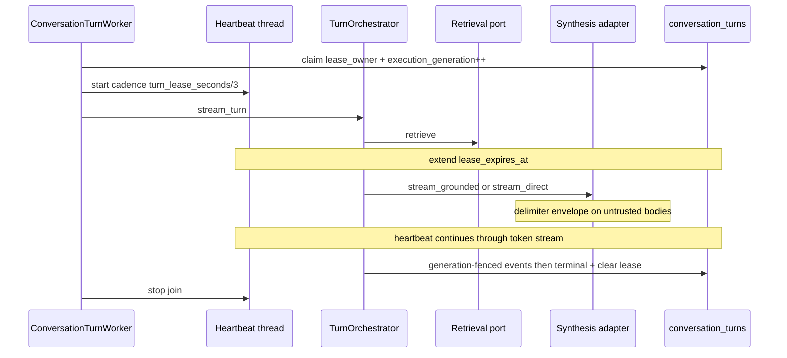
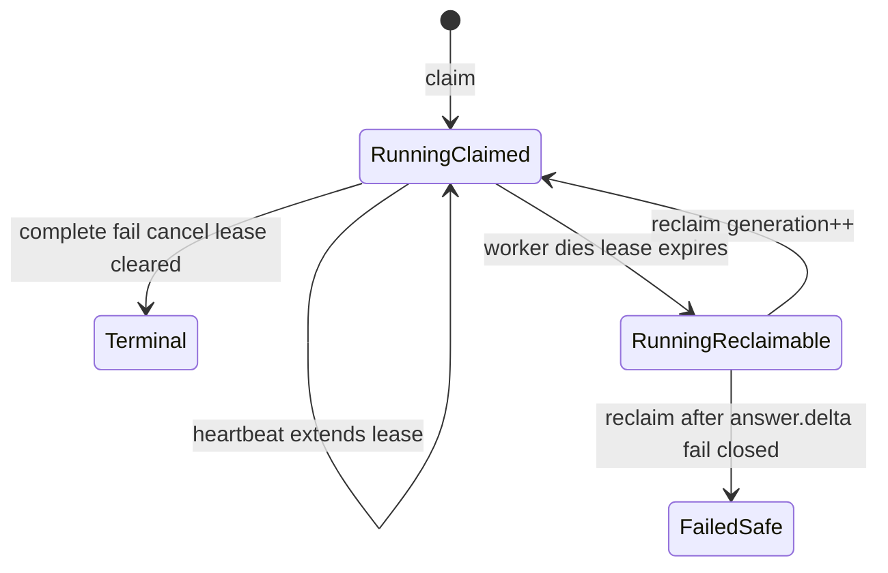

# P7-06 Synthesis Context Isolation and Turn Lease Heartbeat - Plan

## Goal Capsule

- **Objective:** Close P7-06 by isolating untrusted Evidence/context inside private synthesis prompts with delimiter collision defenses, and by heartbeating active turn leases during retrieve/synthesize so a second worker cannot reclaim a live turn.
- **Authority:** Root AGENTS.md privacy invariants; docs/prd.md FR-06/FR-09; P7-03/P7-04; P10-03 mid-turn heartbeat residual; docs/master-build-plan.md P7-06; legacy prompt-assembly isolation as read-only evidence only.
- **Execution profile:** Inventory-first; no-network synthesis fixtures; PostgreSQL lease reclaim denial; do not persist prompts.
- **Readiness checkpoint:** Implementation-ready after 2026-07-28 deepening.
- **Stop conditions:** Stop if DONE pressure persists raw prompts/assembled context, adds browser-visible fields, or pulls P12-05 ingress drain into this slice.
- **Tail ownership:** P12-05 stream-drain; P12-07 capacity; broader RAG quality benchmarks deferred.

---

## Product Contract

### Summary

Harden private synthesis message assembly so Evidence excerpts and composer assembly snippet bodies cannot break instruction boundaries, and heartbeat turn leases while outbound retrieve/synthesize work runs.

Product Contract preservation: Product Contract unchanged during deepening (planning sections only).

### Problem Frame

P7-03 interpolates Evidence into synthesis messages without delimiter isolation proven by collision tests. P10-03 names mid-turn lease heartbeat as a residual: long retrieve/synthesize can expire and be reclaimed, risking double provider work under concurrency.

### Actors

| Actor | Role |
| --- | --- |
| Member | Submits domain_rag / direct turns |
| Worker | Owns leased turn execution |
| Coding agent | Implements isolation, heartbeat, proofs |

### Key Flows

**F1 — Isolated synthesis.** The synthesis adapter `_build_messages` path (private envelope helper in `adapters/synthesis.py`) builds provider messages with per-call random delimiters around untrusted Evidence excerpts and composer assembly snippet bodies; on delimiter-token collision, regenerate bounded times then fail closed pre-provider; nothing persisted beyond contracted projections. The orchestrator invokes the adapter and does not assemble wire format.

**F2 — Heartbeat under work.** Turn worker heartbeats lease at cadence `max(1, turn_lease_seconds // 3)` during retrieve/synthesize; second worker cannot claim while lease current; expiry after true death remains reclaimable.

### Requirements

- R1. Inventory in `docs/_scratch/p7-06-synthesis-isolation-heartbeat-inventory.md`.
- R2. Private delimiter isolation around untrusted Evidence lines (citation/source label + excerpt) and composer assembly lines (label + body) in the synthesis adapter message builder; only fixed trusted structure (section headers; server-owned kind enum if present) stays outside the envelope. Instruction-boundary + collision tests. Isolation is transport-only — persisted Evidence excerpts and SSE evidence payloads stay undelimited.
- R3. Never persist raw prompts/assembled context/provider payloads.
- R4. Heartbeat turn lease during retrieve/synthesize; prove second worker cannot reclaim an active turn on PostgreSQL 16.
- R5. Keep grounded-refusal / no Evidence path unchanged (no ungrounded fallback).
- R6. Evidence `docs/_scratch/p7-06-synthesis-isolation-heartbeat-evidence.md`; mark P7-06 DONE; P7 phase DONE if no other open P7 tasks.

### Acceptance Examples

- AE1. Evidence or assembly body containing instruction-like or section-spoof text (`Ignore previous instructions…`, forged `Evidence:` / `Approved context:` headers, grounding-escape prompts) cannot override trusted system instructions in no-network transport fixtures that inspect outbound messages.
- AE2. Collision with the generated delimiter token forces bounded regenerate-then-fail-closed: no provider call, no delimiter material or private IDs in public surfaces, and no evidence-only completion masquerading as success.
- AE3. Active turn with live heartbeat is not reclaimed by a second worker; at most one synthesis transport invocation while A holds the lease.
- AE4. Dead worker without heartbeat remains reclaimable after lease expiry; generation bump fences the stale executor.

### Scope Boundaries

#### In scope

- Synthesis adapter delimiter envelope for Evidence + assembly bodies + tests
- Turn lease heartbeat + PG reclaim denial
- Inventory/evidence/tracker

#### Deferred to Follow-Up Work

- Metric RAG-triad evaluation
- Upload orphan compensation
- Delimiter wrapping of prior-user-question history in system/user roles (see Open Questions)
- Deduplicating the three copy-pasted `_lease_heartbeat_seconds` helpers across domains/index/sources

#### Outside this product's identity

- Redis locks; prompt logging UI; Phase 2 observability

---

## Planning Contract

### Key Technical Decisions

| ID | Decision | Rationale | Rejected |
| --- | --- | --- | --- |
| KTD1 | Per-call cryptographic random delimiter envelope in `adapters/synthesis.py` (private helper co-located with `_build_messages`) wrapping full untrusted Evidence lines (label + excerpt) and assembly lines (label + body); scan for collision; regenerate bounded times; else fail closed pre-provider | Labels/filenames are user-influenced; wrapping bodies alone leaves a section-spoof path; only fixed trusted structure stays outside | Fixed markers; body-only wrapping; delimiters in `prompt_assembly.py` or `chat_turns.py`; substring-banning “instruction-like” phrases; persisting chosen tokens |
| KTD2 | Daemon-thread heartbeat with separate DB session wrapping the entire `TurnOrchestrator.stream_turn` bracket (retrieve + synthesize) at `ConversationTurnWorker.run_once` | Matches prep/index proven pattern; closes P10-03 mid-turn reclaim gap; retrieve alone can exceed lease | Per-event / per-token heartbeat; synthesis-only heartbeat; new lease table; Redis |
| KTD3 | No public API/DTO/SSE changes | Privacy + contract stability | Exposing lease/heartbeat/delimiter state to browser |
| KTD4 | Reuse existing `conversation_turns` lease columns + `execution_generation` fence only — heartbeat is compare-and-extend, never bumps generation | Prevents a second lease model; aligns with P7-04 PG proofs | New `turn_execution_operations` outbox |
| KTD5 | Keep current settings rule `turn_lease_seconds > synthesis_timeout_seconds`; treat heartbeat as mandatory compensation for long outbound brackets; document that absurdly short leases are unsupported | Avoids expanding settings validation surface in this slice while still naming misconfig risk | Relying on defaults alone without documenting the residual |

### High-Level Technical Design

Three cooperating fences on existing columns — implementers copy prep/index heartbeat shape, not invent a turn scheduler:

| Fence | Mechanism | Purpose |
| --- | --- | --- |
| Claim | `FOR UPDATE SKIP LOCKED` + claimable/expired lease | One worker owns execution |
| Heartbeat | Owner match + `status=running` + extend `lease_expires_at` | Live worker not reclaimable |
| Generation | `execution_generation` CAS on persist/finalize | Stale worker cannot mutate after reclaim/cancel |

### Assumptions

- OpenAI adapter remains primary synthesis path; Bedrock/Ollama stay fail-closed until P10-05.
- Lease duration env knobs already exist from P7-04/P10-03 (`turn_lease_seconds`, `turn_worker_id`).
- No Alembic migration required — service-only change on existing lease columns.

### Open Questions

| Question | Status | Resolution / deferral |
| --- | --- | --- |
| Should prior-user-question history also receive delimiter wrapping? | Deferred | User message already occupies a separate `user` role; Evidence + assembly are the system-string injection surface this slice closes. Revisit if collision tests show a practical bypass. |
| Tighten `turn_lease_seconds` to exceed synthesis + retrieval timeouts? | Deferred | KTD5 keeps current validation; document residual in inventory/evidence. |

### Risks and Dependencies

| Risk | Mitigation |
| --- | --- |
| Prompt persistence creep | R3 + orchestration-level cross-sink scan with delimiter/assembly sentinels (events, turn columns, logs, metrics, traces, SSE, audit allowlist) |
| Heartbeat storms | Cadence `max(1, lease//3)`; mirror prep/index helper |
| Boundary bypass via assembly snippets | Isolate Evidence **and** assembly bodies (R2) |
| Isolation failure masquerading as provider success | AE2: abort pre-provider; no evidence-only fallback |
| Double provider execution on reclaim race | Heartbeat through retrieve+synthesize; PG slow-transport barrier; at-most-one transport counter |
| Delimiter material in public Evidence | Transport-only copies; persisted excerpts unchanged |
| Heartbeat exception logging reintroduces prompt material | Allowlist-only `safe_log`; no request/evidence/delimiter context in heartbeat errors |
| Heartbeat extends cancelled/redacted turn | Refresh + `status=running` + owner match before extend; cancel clears lease |
| Silent heartbeat-thread death recreates reclaim window | Main executor tracks last successful extend; N missed intervals before `lease_expires_at` → set `lost` and stop at next fence (U3) |
| P12-05 mid-turn drain depth | Explicit tail — this slice closes lease protection only |

### System-Wide Impact

- **SSE / public DTOs:** Unchanged event shapes; delimiter tokens must never appear in persisted events or Evidence excerpts.
- **Cancel / redaction:** Remain authoritative via status + generation; next heartbeat fails; in-loop `_execution_fence_open` stops deltas.
- **Reclaim:** Live heartbeating worker not claimable; dead worker reclaimable; partial-answer reclaim fail-closed remains credited to existing `test_ae1_*` in `test_postgres_turn_leases.py`.
- **Logging / metrics / traces:** No new sensitive fields; privacy scans gain delimiter sentinels.
- **Downstream:** Closes P10-03 mid-turn heartbeat residual; unblocks P12-05 dependency on P7-06; does not claim ingress drain DONE.

---

## Implementation Units

### U1. Isolation and heartbeat inventory

**Goal:** Freeze seams and credit P7-03/P7-04 vs gaps.

**Requirements:** R1

**Dependencies:** None

**Files:**
- Create: `docs/_scratch/p7-06-synthesis-isolation-heartbeat-inventory.md`

**Approach:** Map `_build_messages` flat join, `PromptAssemblyService` assembly path, `ConversationTurnWorker._claim_next_turn` (no heartbeat), and prep/index heartbeat wrappers. Disposition retain/modify/add for each seam. Include a short threat-model / trust-field table: adversary = corpus/composer-ref content (not member self-prompting); **untrusted** = Evidence label+excerpt and assembly label+body (full-line wrap per review decision); **trusted** = fixed section headers and server-owned kind enum; prior user questions deferred. Record minimum safe lease residual (`retrieval_timeout + synthesis_timeout` vs current validation) without expanding KTD5 in this slice.

**Patterns to follow:** `docs/_scratch/p7-03-orchestration-inventory.md`

**Test scenarios:**
- Test expectation: none -- inventory.

**Verification:** Inventory lists credit (claim, generation fence, synthesis port, prep/index heartbeat pattern) and gaps (delimiter isolation, turn heartbeat).

---

### U2. Synthesis delimiter isolation

**Goal:** Instruction-boundary isolation for untrusted Evidence and assembly bodies.

**Requirements:** R2, R3, R5, AE1, AE2

**Dependencies:** U1

**Files:**
- Modify: `app/context_engine/adapters/synthesis.py` (`_build_messages` + private envelope helper)
- Create: `app/tests/test_synthesis_prompt_isolation.py`
- Touch only if needed for privacy plants: `app/tests/test_chat_orchestration.py` or cross-sink privacy helpers

**Approach:** Per-call random delimiter; wrap each full untrusted Evidence line (label + excerpt) and assembly line (label + body); regenerate on collision (bounded); fail closed before provider call. Keep `PromptAssemblyService` unchanged. Unit-test the private builder (`_build_messages` or extracted helper) directly for message shape — injected `OpenAITransport` replaces `_default_openai_transport` and never sees assembled `messages=`, so do not treat transport injection as message capture. Optionally mock the OpenAI client on the default transport path for one integration check. Assert grounded-refusal / empty-Evidence path still completes `no_grounded_context` without provider synthesis. Build/validate the delimited envelope on the adapter `stream()` path before provider dispatch so custom transports cannot bypass isolation.

**Execution note:** Implement new isolation behavior test-first against direct builder assertions on assembled messages.

**Patterns to follow:** `app/tests/test_prompt_assembly.py` marker absence; P7-03 synthesis adapter module boundary. Note: `test_synthesis_adapters.py` covers request privacy via injected transport, not delimiter boundary shape.

**Test scenarios:**
- Happy: normal grounded excerpt → builder output contains delimited Evidence region (label+excerpt); synthesis completes.
- Happy: assembly snippet present → delimited assembly line (label+body); only fixed section headers / server-owned kind stay outside.
- Edge / AE2: excerpt or label equals generated delimiter token → regenerate succeeds or fail closed with zero provider calls.
- Error / AE1: excerpt with system-override and forged `Evidence:` header → trusted preamble remains outside untrusted region; hostile text only inside delimiters.
- Error / AE1: hostile `source_label` / assembly label (e.g. contains `Evidence:` or override instructions) → entire label+body/excerpt line is inside delimiters.
- Error / AE1: assembly body spoofs `Approved context:` → same boundary assertion.
- Error / AE2: unresolved collision after bound → turn fails closed with safe code/message; no provider call; no evidence-only terminal.
- Privacy: planted delimiter/assembly sentinels absent from turn columns, event payloads, logs/metrics/traces samples, and persisted Evidence excerpts (excerpts unchanged).
- Integration / R5: empty Evidence domain_rag → `no_grounded_context` unchanged; isolation helper not required to call provider.

**Verification:** Focused isolation + privacy tests green; no prompt persistence paths added.

---

### U3. Mid-turn lease heartbeat

**Goal:** Prevent reclaim of active turns during retrieve/synthesize.

**Requirements:** R4, AE3, AE4

**Dependencies:** U1

**Files:**
- Modify: `app/context_engine/services/chat_turns.py` (`ConversationTurnWorker`, `_heartbeat_turn_lease` / wrapper)
- Create: `app/tests/test_postgres_turn_lease_heartbeat.py`
- Credit (do not duplicate): `app/tests/test_postgres_turn_leases.py` `test_ae1_expired_lease_reclaim_fails_closed_after_answer_delta_*` (postgres lease reclaim fail-closed — not Product Contract AE1)

**Approach:** Add compare-and-extend `_heartbeat_turn_lease` that is stricter than index/prep: refresh then extend only when `status=running`, `lease_owner` matches, lease still valid, and `execution_generation` unchanged (index helper has no generation gate — do not copy it blindly). Wrap `stream_turn` exhaustion in daemon-thread + separate session factory at cadence `max(1, turn_lease_seconds // 3)`. **Liveness:** main executor tracks last successful extend timestamp (or consecutive failure count); if N heartbeat intervals miss before `lease_expires_at`, set `lost` even when the heartbeat thread has died silently. **Abort contract for this slice:** best-effort stop at the next fence / between synthesis tokens when `lost`; blocking retrieve/provider I/O is not hard-cancelled here — generation fence prevents stale persist; hard stream-drain remains P12-05. Do not finalize a competing terminal on heartbeat loss — leave reclaimable after expiry. Use barriers/gated adapters, not wall-clock sleeps, for correctness. AE3 PG proof uses mid-synthesize `GatedSynthesis` (cited harness has no gated retrieval); mid-retrieve coverage is optional if a `GatedRetrievalPort` is added, otherwise inventory notes retrieve-path credit via the same worker-level heartbeat bracket.

**Execution note:** Start with a failing PostgreSQL barrier test for AE3 reclaim denial under live heartbeat.

**Patterns to follow:** `app/context_engine/services/indexing.py` `_submit_with_lease_heartbeat` structure (thread/session/cadence), not its update predicate; `app/tests/test_postgres_turn_leases.py` harness (`Barrier`, `GatedSynthesis`)

**Test scenarios:**
- Happy: short lease + gated synthesis longer than one heartbeat interval → `lease_expires_at` extends while worker A holds lease.
- Integration / AE3: worker A mid-synthesize with heartbeat; worker B `run_once` → B does not claim that turn; `lease_owner` stays A; `execution_generation` unchanged; transport invocation count remains 1 for A.
- Integration / AE4: stop heartbeat; backdate `lease_expires_at`; worker B claims → generation bumps; A’s subsequent persist fails fence.
- Edge: cancel while A streaming and heartbeat running → single `cancelled` terminal; heartbeat returns false after status≠running; no post-cancel deltas.
- Edge: simulate heartbeat-thread failure (no successful extends) while A mid-synthesize → main loop sets `lost` after N missed intervals, stops at next fence without competing terminal; turn becomes reclaimable per AE4.
- Error: heartbeat thread error path emits only allowlisted log fields (no evidence/delimiter/prompt material).
- Credit: existing postgres lease reclaim fail-closed after `answer.delta` (`test_ae1_*` in `test_postgres_turn_leases.py`) remains green without reimplementation.

**Verification:** Opt-in PostgreSQL suite green; no migration required.

---

### U4. Evidence and tracker closure

**Goal:** Honest DONE.

**Requirements:** R6

**Dependencies:** U2, U3

**Files:**
- Create: `docs/_scratch/p7-06-synthesis-isolation-heartbeat-evidence.md`
- Modify: `docs/master-build-plan.md`

**Approach:** Record commands, privacy non-claims, PG results; mark P7-06 DONE and P7 phase DONE when appropriate; note P12-05 residual.

**Patterns to follow:** `docs/_scratch/p7-04-sse-pipeline-evidence.md`

**Test scenarios:**
- Test expectation: none -- docs.

**Verification:** Tracker links evidence; P10-03 mid-turn heartbeat residual closed by reference.

---

## Verification Contract

- Isolation unit tests on default pytest path (`test_synthesis_prompt_isolation.py`).
- Orchestration-level privacy plant for delimiter/assembly sentinels across turn events, turn columns, and existing P8 log/metric/trace scan surfaces.
- PostgreSQL heartbeat/reclaim/cancel barriers under opt-in env (`test_postgres_turn_lease_heartbeat.py`); credit `test_postgres_turn_leases.py` `test_ae1_*` for lease reclaim fail-closed after partial answer (distinct from Product Contract AE1).
- Privacy non-claims: no assembled prompts, delimiter tokens, or provider payloads in DB/SSE/logs/audit/metrics/traces.
- No public OpenAPI/SSE contract regeneration expected; if a change appears necessary, stop per KTD3.

## Definition of Done

R1–R6 and AE1–AE4 satisfied; no prompt persistence; heartbeat protects live turns; P7-06 DONE; P7 phase DONE when tracker has no other open P7 tasks.

## Sources & Research

- docs/master-build-plan.md P7-06
- docs/_scratch/p7-03-orchestration-evidence.md
- docs/_scratch/p10-03-worker-lifecycle-evidence.md
- app/context_engine/adapters/synthesis.py (`_build_messages`)
- app/context_engine/services/chat_turns.py (`ConversationTurnWorker`, claim/fence)
- app/context_engine/services/indexing.py / `sources.py` (heartbeat pattern)
- app/tests/test_postgres_turn_leases.py
- Deepening research (2026-07-28): architecture, repo patterns, security, lease integrity
