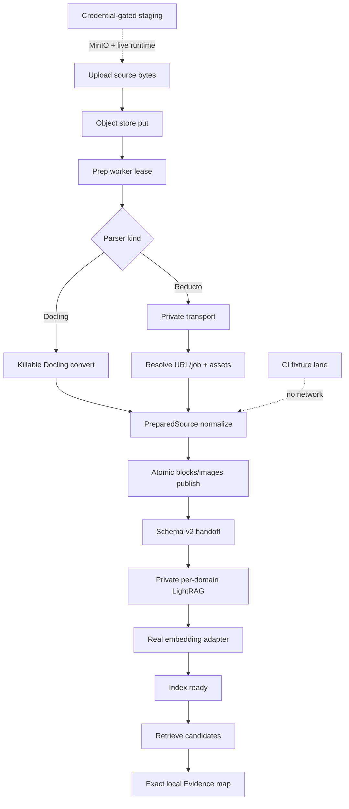

# P10-05 Production Parser and Provider Pipeline - Plan

## Goal Capsule

- **Objective:** Close P10-05 by making the existing Docling/Reducto → canonical Source Block → LightRAG → mapped Evidence pipeline production-real: package the supported dependencies, preserve parser-independent canonical DTOs, bind immutable domain embedding profiles to real provider calls, and prove the complete path with no-network CI plus credential-gated staging evidence.
- **Authority:** docs/tech-stack.md; as-built-gaps parsers/providers; P4-03/P7-03; docs/master-build-plan.md P10-05; post-P10-04 MinIO composition at docs/_scratch/p10-04-minio-object-store-evidence.md.
- **Execution profile:** Characterization-first adapter hardening, packaging, provider bindings, and dual-lane proof; do not force live providers into root verify.
- **Readiness checkpoint:** Implementation-ready after 2026-07-28 deepen against P10-04 and current parser/shim seams.
- **Stop conditions:** Stop if real parser output would change the approved canonical block/Evidence contract, if LightRAG cannot preserve exact schema-v2 markers across realistic chunk boundaries, if a provider cannot honor the frozen embedding dimensions, if unsupported providers would be claimed green, or if root CI would require network providers.
- **Tail ownership:** P12-06 locks/SBOM; P12-07 failure paths; P12-08 acceptance; combined live+MinIO matrix residual may remain with P12-04.

---

## Product Contract

### Summary

Define and prove the supported parser/model deployment profiles. Provider-native payloads terminate at the parser anti-corruption layer; LightRAG receives only versioned canonical-block handoffs; retrieved candidates become Evidence only after exact local reauthorization and mapping.

Product Contract preservation: R/AE/scope IDs unchanged; Problem Frame updated for post-P10-04 grounding only.

### Problem Frame

The current control plane, canonical Source Block persistence, schema-v2 LightRAG handoff, per-domain runtime, Evidence mapper, and P10-04 S3/MinIO object-store path are strong, but production parser/provider semantics remain incomplete. Parser extras are not installed in the stack images; Docling and Reducto are proven mainly through injected dictionaries; Reducto URL-backed results still fail closed instead of private resolve; Docling conversion has no killable wall-clock timeout; the private LightRAG shim still emits deterministic synthetic vectors and a stub entity LLM. Existing live runtime tests begin from handcrafted Source Blocks, so they do not prove upload → real parser → PostgreSQL publish → real provider embedding → retrieval → mapped Evidence.

### Actors

| Actor | Role |
| --- | --- |
| Operator | Selects deployment profile and supplies credentials |
| Coding agent | Packaging, matrix, smoke scripts, evidence |

### Key Flows

**F1 — Profile matrix.** Deployment profiles declare included parser, embedding, and synthesis adapters plus their evidence altitude.

**F2 — Canonical parsing.** Docling or Reducto consumes governed source bytes → provider-specific output is normalized to `PreparedSource` → canonical blocks/images publish atomically without raw provider metadata.

**F3 — Real embedding.** Index worker resolves the domain’s immutable embedding profile and current credential → private runtime invokes the matching provider adapter with the exact model/dimensions → the same adapter embeds retrieval queries.

**F4 — CI.** Default verify uses representative parser/provider fixtures and never requires network credentials.

**F5 — Staging end-to-end.** An explicitly gated smoke uploads a real fixture document, executes the preparation and index workers, waits for ready, retrieves a known fact, and verifies exact canonical-block Evidence mapping; any failed boundary keeps that profile unsupported.

### Requirements

- R1. Inventory `docs/_scratch/p10-05-provider-packaging-inventory.md`.
- R2. Explicit packaging for Docling/Reducto and OpenAI/Bedrock/Ollama in pyproject/images/docs.
- R3. Deployment profile matrix: which kinds are packaged, fail-closed, or production-supported only after smoke.
- R4. CI remains no-network fixture altitude.
- R5. Credential-gated staging smoke scripts/runbook steps; never commit secrets.
- R6. Evidence + tracker DONE with honest unsupported residuals.
- R7. Characterize real Docling and Reducto response shapes with sanitized, versioned fixtures covering text, headings, tables, figures, captions, pages, regions, and provider failure forms; canonical output remains the closed `PreparedSource` contract.
- R8. Resolve Reducto URL-backed results inside the private transport before normalization, and materialize supported remote figure/table assets through bounded governed I/O without persisting provider URLs.
- R9. Configure Docling’s supported picture/table pipeline and enforce a killable wall-clock conversion timeout; a hung local parser cannot heartbeat its lease indefinitely.
- R10. Preserve parser-independent embedding input: LightRAG receives canonical Markdown, not Reducto-specific `embed`, confidence, IDs, URLs, or metadata. Any proposed change to canonical text semantics triggers the repository’s explicit parser-contract decision gate.
- R11. Replace deterministic production embedding and stub extraction functions with closed OpenAI/Bedrock adapters selected from the server-resolved immutable domain profile; query and indexing calls must use the same model and dimensions. Ollama remains fail-closed unless an approved catalog profile and smoke proof exist.
- R12. Prove marker survival and fail-closed mapping for realistic multi-block, oversized-block, table, and figure handoffs; unmapped continuations never become Evidence.
- R13. Add a complete service-level staging path from real source bytes through parser, PostgreSQL publication, private LightRAG indexing, provider embedding, retrieval, and mapped Evidence. The P5-04 handcrafted-handoff test remains runtime-topology evidence, not full-pipeline evidence.

### Acceptance Examples

- AE1. Matrix lists each provider/parser with status.
- AE2. Default verify green without network providers.
- AE3. Smoke script refuses to run without explicit credentials/env gate.
- AE4. Unsmoked Bedrock/Ollama remain fail-closed if not proven.
- AE5. A real Docling PDF containing headings, a table, and a figure publishes non-empty ordered canonical blocks and governed image metadata without raw Docling fields.
- AE6. A Reducto URL-result response is privately resolved and normalized; malformed pointers, failed asset downloads, auth failures, and timeouts return typed safe parser errors without URL/job leakage.
- AE7. A domain configured for a supported embedding profile indexes and queries through the matching real provider with the frozen model/dimensions; a mismatched response dimension fails before ready.
- AE8. Long and multi-block handoffs either preserve a complete schema-v2 marker for each mapped candidate or discard the candidate; no marker-free continuation is projected as Evidence.
- AE9. The staging fixture completes upload → preparation → index ready → semantically relevant retrieval → exact local Evidence mapping, while the same test refuses to start without the explicit live gate and credentials.

### Scope Boundaries

#### In scope

- Parser fidelity and bounded execution needed for production support
- Parser/model dependency packaging and private provider bindings
- Deployment matrix, fixture characterization, staging smoke, and evidence

#### Deferred to Follow-Up Work

- New provider kinds beyond tech-stack list
- Parser-specific semantic chunk DTOs or persistence alongside canonical Source Blocks
- Reusing Reducto `embed` as authoritative canonical text without an approved parser-contract change
- Multimodal image embeddings, OCR enrichment, generated image descriptions, or retrieval ranking optimization
- Pre-migration corpus re-preparation and non-PDF governed-preview generation
- Combined three-file `live.yml` + `minio.yml` operator matrix (P12-04 residual unless trivial to prove here)

#### Outside this product's identity

- Browser-selected providers; cost dashboards

---

## Planning Contract

### Key Technical Decisions

| ID | Decision | Rationale |
| --- | --- | --- |
| KTD1 | Production-supported requires smoke evidence | Honest claims |
| KTD2 | CI stays fixture-only | Root gate stability |
| KTD3 | Fail-closed default for unproven kinds | Safety |
| KTD4 | `PreparedSource` remains the parser anti-corruption boundary | Provider DTOs and private metadata never become LightRAG or public contracts |
| KTD5 | Canonical Markdown is the sole LightRAG document input | Docling/Reducto remain interchangeable and retrieval maps to authoritative local blocks |
| KTD6 | Real embedding adapters are selected only from the frozen domain profile | Index and query vectors cannot drift in model or dimensions |
| KTD7 | Local Docling runs behind a killable timeout boundary | Lease heartbeat is recovery fencing, not permission for unbounded parsing; today's in-process `TimeoutError` map is insufficient |
| KTD8 | Full-pipeline proof complements rather than replaces layer tests | Handcrafted handoffs prove runtime topology but not parser/provider integration |
| KTD9 | Embedding adapters live in the private LightRAG runtime from sealed server-resolved profile/credentials | FastAPI never exposes provider URLs; index and query share one shim-constructed embedding function |
| KTD10 | Full-pipeline staging that claims production object-store altitude uses P10-04 S3/MinIO composition; default CI stays filesystem | Filesystem-only success must not be labeled production object-store proof |
| KTD11 | Reducto URL/job resolution is transport-only; normalization sees only inlined chunks/bytes | Private resolve before `normalize_reducto_parse_response`; never persist URLs/job IDs; canonical Markdown beats Reducto `embed` |

### High-Level Technical Design

CI fixtures and staging smokes are proof altitudes for the same product path, not alternate architectures.

### Assumptions

- OpenAI synthesis and Docling/Reducto are the first smoke candidates.
- OpenAI and approved Bedrock catalog entries are the initial real embedding candidates.
- Ollama is local-only egress and stays unsupported until an approved profile exists.
- P4-05 region extraction and authorized projection are complete; this slice only regression-tests those fields through real parser fixtures.
- P10-04 MinIO/S3 adapter and opt-in overlay are DONE; this slice consumes them for staging altitude rather than re-implementing object storage.
- P5-04 private per-domain LightRAG topology remains the runtime proof baseline; this slice adds parser/provider semantic proof on that topology.

### Risks and Dependencies

| Risk | Mitigation |
| --- | --- |
| Secret leakage in smoke logs | Allowlisted logging; redaction |
| Scope creep to new vendors | Tech-stack closed list |
| SDK response drift silently empties tables or images | Versioned sanitized fixtures plus credential-gated staging characterization; Reducto MCP/docs as characterization aids only |
| LightRAG splits a block away from its marker | Oversized/multi-block tests; discard unmarked candidates; stop if exact mapping cannot be proven |
| Provider dimensions differ from the immutable profile | Validate every returned vector shape before storage/readiness |
| Hung local parser retains work forever | Killable process timeout plus generation/lease fence and cleanup tests |
| Provider-optimized Reducto text conflicts with canonical portability | Keep canonical Markdown authoritative; require an explicit contract decision before changing semantics |
| Staging claims production object-store altitude on filesystem-only | U4/U8 profile labels; opt-in MinIO overlay or composed S3 settings for that claim |
| Sealed `provider.env` permission or leak in runtime containers | Keep mode checks; never dump env in health/errors/logs |
| Combined live+MinIO three-file matrix incomplete | Name as P12-04 residual; do not block P10-05 if single-overlay staging proves parser/provider path |

**Dependencies:** P4-03, P5-04, P6-02, P7-03, P10-03, P10-04 DONE. Live full-pipeline evidence must cite the P5-04 runtime revision and P10-04 store composition used.

### System-Wide Impact

- **Worker/API vs LightRAG runtime:** Parser deps and prep leases stay in the stack worker/API image; embedding deps and sealed credentials stay in the per-domain LightRAG container; cross-talk only via schema-v2 handoff and private HTTP.
- **Object store:** Prep publish and figure bytes use `object_store_from_settings` (filesystem for default CI; MinIO/S3 for production-store staging). Missing objects keep the P10-04 safe `503 document_content_unavailable` path.
- **Credential surfaces:** Reducto/OpenAI/Bedrock secrets flow only through server-resolved runtime config into sealed env. Never appear in logs, DTOs, SSE, evidence artifacts, or browser storage.
- **Downstream:** P12-06 pins parser/provider/runtime digests from this matrix; P12-07 consumes the staging path for browser/capacity/failure cases; P10-06 preview keys remain a separate derivative lane on the same object-store census shape.
- **Failure propagation:** Parser timeout → retryable prep failure without stuck lease; embedding dimension mismatch → never ready; uncertain index timeout keeps existing readiness-probe reclaim semantics.

---

## Implementation Units

### U1. Packaging inventory

**Goal:** Freeze extras/images/registry seams.

**Requirements:** R1

**Dependencies:** None

**Files:**
- Create: `docs/_scratch/p10-05-provider-packaging-inventory.md`

**Approach:** Table parser/synthesis/embedding kinds vs package/image/CI/smoke status. Record worker/API vs LightRAG runtime image ownership and P10-04 object-store packaging gate as adjacent seams, not owned deliverables.

**Patterns to follow:** as-built-gaps bullets; `docs/_scratch/p10-04-minio-object-store-inventory.md` disposition shape

**Test scenarios:**
- Test expectation: none -- inventory.

**Verification:** Matrix draft complete.

---

### U2. Packaging extras and image layers

**Goal:** Make Docling/Reducto and approved embedding/synthesis provider extras and image layers explicit.

**Requirements:** R2

**Dependencies:** U1

**Files:**
- Modify: `app/pyproject.toml` / Dockerfiles as needed
- Test: existing parser/synthesis fixture suites; missing-dep fail-closed checks

**Approach:** Split parser and provider dependencies into explicit reproducible image profiles. The stack worker/API image must include the parser profile it claims; the private LightRAG runtime image must include only the approved embedding bindings it claims. Do not place parser SDKs in the LightRAG image or embedding SDKs in the browser/BFF. Prefer image gates parallel to `CE_STACK_OBJECT_STORE_IMAGE` / live LightRAG packaging. Keep the default CI lane fixture-only and expose no browser configuration.

**Patterns to follow:** as-built-gaps optional extras notes; P10-01 compose config; P10-04 object-store image gate

**Test scenarios:**
- Happy: image build with declared extras still succeeds in verify Docker step.
- Happy: parser-profile image imports Docling and Reducto; runtime-profile image imports each claimed embedding adapter.
- Edge: fail-closed kinds remain registered without network.
- Error: a deployment profile cannot advertise a provider whose dependency is absent.

**Verification:** Docker build + import tests; default verify green.

---

### U6. Real parser characterization and hardening

**Goal:** Make Docling and Reducto produce faithful canonical blocks/images under bounded production execution.

**Requirements:** R7, R8, R9, R10, AE5, AE6

**Dependencies:** U1, U2

**Files:**
- Modify: `app/context_engine/adapters/parsers.py`
- Modify: `app/context_engine/services/sources.py`
- Add or modify: parser subprocess/transport helper under `app/context_engine/adapters/`
- Add: sanitized real-response fixtures under `app/tests/fixtures/parsers/`
- Modify: `app/tests/test_parser_adapters.py`
- Modify: `app/tests/test_postgres_source_preparation.py`
- Add: parser timeout/cleanup tests under `app/tests/`

**Approach:** Characterize supported SDK versions before changing normalizers. Configure Docling for table/picture extraction, derive canonical Markdown from supported native exports, and materialize only governed image bytes. Today's Docling path is in-process without a hard killable deadline — introduce a killable process/timeout helper so a hung conversion cannot retain a prep lease indefinitely. For Reducto, resolve `type=url` / job-pointer results and bounded remote figure assets inside the private transport (SDK/`get_job`/bounded HTTP) before `normalize_reducto_parse_response`; strip URLs, job IDs, confidence, and native IDs. Do not introduce provider chunk IDs or Reducto `embed` into product persistence or the canonical LightRAG handoff. Reducto MCP and official docs are characterization aids only, not runtime dependencies.

**Execution note:** Add characterization fixtures and failure tests before changing the live adapters; compare canonical output rather than retaining raw provider payload snapshots.

**Patterns to follow:** `app/context_engine/adapters/parsers.py` (current URL fail-closed and `PreparedSource` boundary); `app/context_engine/services/sources.py` preparation lease/generation fence; legacy behavior evidence in `.references/code/context_engine/app/document_processing/` only where it survives current privacy and canonical-block rules.

**Test scenarios:**
- Covers AE5. A representative Docling PDF produces ordered heading/text/table/figure blocks, normalized pages/regions, and governed image bytes.
- Covers AE6. A Reducto full response and URL-pointer response normalize to equivalent canonical blocks; provider URLs/job IDs are absent from serialized prepared output and persistence.
- Edge: Reducto `embed` differs from display content; canonical Markdown remains derived from approved block content and tables remain readable.
- Error: malformed pointer payload, asset download size/type violation, provider auth failure, and timeout map to closed safe parser errors with no partial publish.
- Error: a non-returning Docling conversion is terminated at the configured deadline, temporary files are removed, and the operation becomes retryable without retaining the lease indefinitely.
- Integration: PostgreSQL publish from each parser atomically replaces blocks/images under the current generation and queues exactly one index generation.

**Verification:** Sanitized fixtures cover all supported output shapes; parser dependencies run in the packaged image; timeout and privacy tests pass at process and PostgreSQL boundaries.

---

### U7. Real immutable-profile embedding bindings

**Goal:** Replace synthetic production vectors with provider calls that honor the domain’s immutable embedding profile for both indexing and query.

**Requirements:** R11, AE7

**Dependencies:** U1, U2

**Files:**
- Modify: `app/context_engine/tools/ce_lightrag_shim.py`
- Modify or add: private embedding adapters under `app/context_engine/adapters/`
- Modify: `app/context_engine/services/indexing.py`
- Modify: `app/context_engine/services/runtime_config.py` only if existing closed catalog projection needs adapter metadata without new public fields
- Modify: `app/tests/test_lightrag_http_client.py`
- Modify: `app/tests/test_lightrag_real_runtime_integration.py`
- Add: provider embedding adapter tests under `app/tests/`

**Approach:** Build a closed private adapter registry for the embedding provider kinds already present in the approved catalog, patterned after synthesis’s fail-closed registry but constructed inside the per-domain LightRAG runtime from sealed env (kind/model/dimensions/credential). The shim consumes that sealed profile, constructs one embedding function, validates every returned vector count and dimension, and supplies that same function to LightRAG indexing and retrieval. Remove the production hard-coded deterministic embed and stub entity LLM from the production path; synthetic embeddings remain only behind an explicit non-production test/dev path with no silent fallback once a production binding is configured. Do not log credentials, provider payloads, source text, or vectors.

**Execution note:** Start with injectable provider transports proving model/dimension propagation and fail-closed shape validation; run live calls only in the gated staging lane.

**Patterns to follow:** `TrustedRuntimeResolver.resolve_embedding_profile`; sealed runtime environment handling in `ce_lightrag_shim.py`; `app/context_engine/adapters/synthesis.py` closed registry and error mapping.

**Test scenarios:**
- Covers AE7. OpenAI and each claimed Bedrock embedding adapter receive the frozen model/dimensions and return the exact validated shape for document and query contexts.
- Edge: current credential rotation is used on the next call without mutating the domain profile.
- Error: missing credential, unsupported provider, timeout, malformed payload, wrong vector count, NaN/non-finite value, and dimension mismatch fail closed before index readiness.
- Privacy: credential, source content, raw vectors, and provider response bodies are absent from logs, errors, DTOs, SSE, and evidence artifacts.
- Integration: two domains with different approved embedding profiles remain isolated in separate runtimes and cannot open each other’s vector state.

**Verification:** The production Docker/native path contains no deterministic embedding or stub extraction fallback; fixture tests remain network-free; each production-supported provider has staging evidence.

---

### U3. Deployment-profile matrix

**Goal:** Operator-facing matrix of profiles, kinds, env, egress, and evidence altitude.

**Requirements:** R3, AE1

**Dependencies:** U2

**Files:**
- Create: `docs/operations/provider-deployment-profiles.md` (name flexible)
- Modify: `docs/operations/compose-stack-runbook.md` / `docs/tech-stack.md` profile notes

**Approach:** Record parser, embedding, and synthesis support independently. Include packaged dependency, image/profile, network boundary, required credential source, fixture proof, live smoke revision, object-store altitude (filesystem vs MinIO/S3), and final status. A parser or synthesis smoke does not imply embedding support. Filesystem-only staging must not be labeled production object-store proof.

**Patterns to follow:** `docs/tech-stack.md`; P10-04 runbook/object-store notes

**Test scenarios:**
- Happy: matrix lists each tech-stack provider/parser with status.
- Error: no browser-selectable provider UI documented as product surface.

**Verification:** Matrix linked from runbook; matches inventory.

---

### U4. Credential-gated staging smoke scripts

**Goal:** Prove each claimed parser/provider boundary before assigning a production-supported label.

**Requirements:** R4, R5, AE2, AE3, AE4, AE6, AE7

**Dependencies:** U2, U3, U6, U7

**Files:**
- Create: `app/scripts/provider_staging_smoke.py` (name flexible)
- Modify: runbook
- Create: tests that smoke refuses without gate env

**Approach:** Script requires explicit profile and environment allowlists; exercises parser success plus embedding/synthesis success, timeout, auth failure, and malformed-response mapping; records package/image versions and a secret-safe evidence artifact. When the profile claims production object-store altitude, compose through P10-04 MinIO/`object_store_from_settings` rather than filesystem-only. Never wire live calls into default `scripts/verify.sh`.

**Patterns to follow:** `app/scripts/stack_smoke_*.py`; `app/scripts/stack_object_store_recon.py` closed CLI errors

**Test scenarios:**
- Error: missing gate env → refuse before network.
- Happy: with fixtures/injectable, mappings stay typed (CI).
- Integration: live parser/provider smoke runs only under explicit credentials and records the exact deployment profile, object-store kind, and artifact digest.

**Verification:** Default path refuses live access without the explicit gate; live evidence is mandatory before that parser/provider profile is labeled production-supported.

---

### U8. Full parser-to-Evidence staging proof

**Goal:** Prove the complete production data path rather than only individual adapters or handcrafted LightRAG handoffs.

**Requirements:** R12, R13, AE8, AE9

**Dependencies:** U4, U6, U7

**Files:**
- Add: deterministic source documents under `app/tests/fixtures/documents/`
- Add or modify: staging integration test under `app/tests/`
- Modify: `app/tests/test_lightrag_real_runtime_integration.py`
- Modify: `docs/operations/compose-stack-runbook.md`

**Approach:** Use the production worker/service boundaries with PostgreSQL, governed object storage via P10-04 composition when claiming production-store altitude, one private per-domain LightRAG runtime, and an explicitly selected real parser/embedding profile. Drive upload and queued preparation, wait for canonical publication and index readiness, issue semantic queries, and assert that every returned Evidence item maps to the expected local block/hash/order. Add oversized and multi-block fixtures that force LightRAG chunk-boundary behavior; unmarked continuations must be discarded rather than repaired heuristically. Cite P5-04 runtime and P10-04 store revisions in evidence. Combined three-file live+MinIO matrix may remain a P12-04 residual if single-overlay staging already proves the parser/provider path.

**Execution note:** Keep the deterministic local Docling lane runnable without external credentials where packaging permits, then layer Reducto and external embedding profiles behind explicit staging gates.

**Patterns to follow:** P5-04 live runtime integration; P6 PostgreSQL frozen-scope mapping tests; P4 source-preparation fixtures; P10-04 MinIO overlay.

**Test scenarios:**
- Covers AE9. Real PDF upload through Docling reaches prepared/ready and a semantic query returns the expected mapped text/table/figure Evidence.
- Covers AE9. Gated Reducto plus claimed embedding profile completes the same path without provider fields crossing the canonical boundary.
- Covers AE8. Multi-block and oversized-block documents preserve exact markers for mapped candidates; marker-free fragments yield no Evidence.
- Edge: no semantically relevant hit produces the contracted grounded no-context result, not arbitrary first-document Evidence.
- Error: parser timeout, provider timeout with uncertain index outcome, runtime restart, malformed retrieval chunk, and source deletion each preserve their existing recovery/fencing semantics.
- Isolation: two domains processed concurrently return no cross-domain markers or Evidence.

**Verification:** Evidence records the complete path, package/image revisions, parser/provider profiles, object-store kind, and negative privacy/isolation assertions; P5-04 remains credited for topology while this unit owns semantic end-to-end proof.

---

### U5. Evidence and tracker

**Goal:** Close P10-05 with honest per-parser, embedding, and synthesis status plus full-pipeline evidence.

**Requirements:** R6, AE1–AE9

**Dependencies:** U1–U4, U6–U8

**Files:**
- Create: `docs/_scratch/p10-05-provider-packaging-evidence.md`
- Modify: `docs/master-build-plan.md`

**Approach:** Publish matrix statuses and distinguish package import, fixture proof, live boundary smoke, full-pipeline proof, and object-store altitude. Name P12-04/06/07/08 residuals and leave any unproven profile fail-closed.

**Patterns to follow:** `docs/_scratch/p10-04-minio-object-store-evidence.md`

**Test scenarios:**
- Test expectation: none -- docs.
- Edge: unsmoked kinds remain fail-closed explicitly.
- Edge: parser success never upgrades an embedding or synthesis provider’s support status.
- Edge: filesystem-only staging is not labeled production object-store proof.

**Verification:** Tracker DONE.

---

## Verification Contract

- Default verify remains no-network.
- Parser/provider fixture, timeout, privacy, and vector-shape checks are green.
- Packaging/build/import checks are green for each declared deployment profile.
- Smoke refuse-without-gate test green.
- Live evidence covers each production-supported parser/provider boundary.
- At least one claimed parser + real embedding profile passes the complete upload-to-mapped-Evidence staging path.
- Long/multi-block marker-survival and cross-domain isolation proofs are green.
- Any production object-store altitude claim cites P10-04 MinIO/S3 composition.

## Definition of Done

R1–R13 and AE1–AE9 are satisfied; canonical parser independence and exact provenance mapping remain intact; synthetic production embeddings are removed; at least one real parser/embedding profile passes the complete pipeline; unsupported kinds remain fail-closed; P10-05 DONE.

## Sources & Research

- docs/tech-stack.md
- docs/architecture/as-built-gaps-and-decisions.md
- docs/architecture/data-and-lifecycle.md
- docs/contracts/document-and-evidence-contract.md
- docs/master-build-plan.md P10-05
- docs/_scratch/p4-03-parser-adapters-inventory.md
- docs/_scratch/p5-04-lightrag-real-runtime-evidence.md
- docs/_scratch/p10-04-minio-object-store-evidence.md
- app/context_engine/adapters/parsers.py (URL fail-closed; in-process Docling)
- app/context_engine/tools/ce_lightrag_shim.py (synthetic embed / stub LLM)
- app/context_engine/adapters/synthesis.py (closed provider registry pattern)
- `.references/code/context_engine/app/document_processing/` as read-only behavioral evidence, not design authority
- Reducto MCP/docs for URL/job result characterization only
