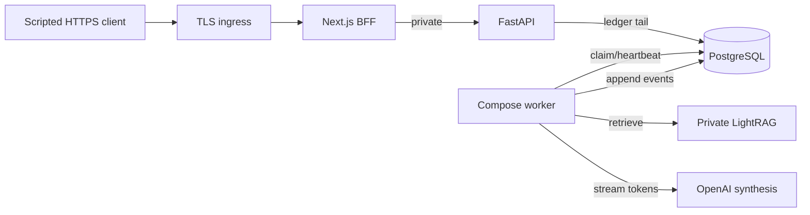
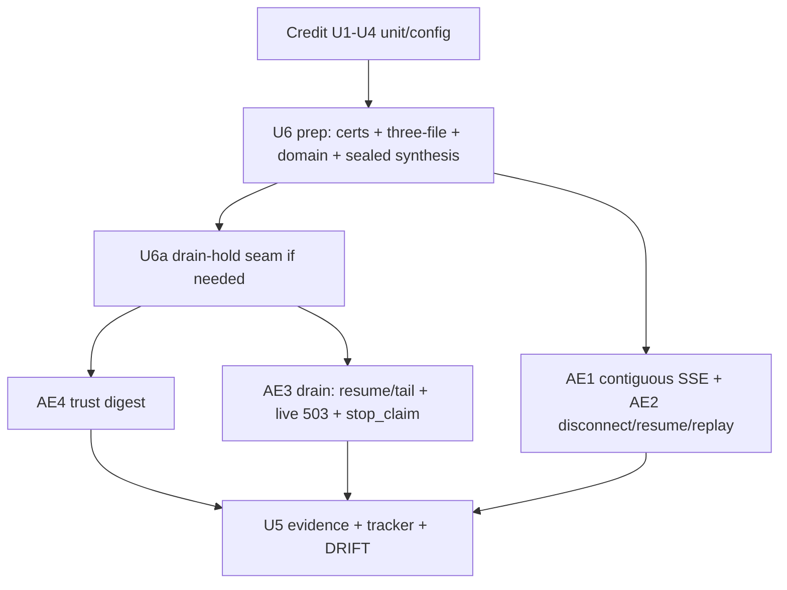

# P12-05 Deployed Ingress SSE and Stream Drain - Plan

## Goal Capsule

- **Objective:** Close P12-05 by capturing live TLS Compose AE1–AE4 operator digests (incremental domain-RAG SSE, reconnect/resume/replay, topology stream-drain, Host/Origin/CSRF + direct-API denial) through the real private LightRAG runtime and credential-gated live OpenAI streaming, then publish evidence and advance tracker/DRIFT residuals.
- **Authority:** `docs/architecture/deployment-topology.md` (Network/ingress; Boot/shutdown; ≥2-delta gate); `docs/architecture/frontend-security-boundary.md`; `docs/contracts/sse-event-catalog.md`; interaction cases **M-03** (streamed answer + disconnect≠cancel/resume) and **C-01** (capacity `503` race/failure half for drain); DRIFT-05/24/25 deployed halves; `docs/master-build-plan.md` P12-05.
- **Execution profile:** Unit/config altitude is **credit** (TLS overlay, API stop-new-turns unit gate, helpers, proof scripts). Remaining work is U6 live digests (plus targeted seam/script honesty) → U5 evidence/tracker close — evidence-owned like P5-04/P10 live, not a default `scripts/verify.sh` gate.
- **Readiness checkpoint:** Implementation-ready. Credit inventory/evidence: `docs/_scratch/p12-05-deployed-ingress-{inventory,evidence}.md` (PARTIAL). Prerequisites DONE — cite P5-04 / P7-04 / P7-06 / P9-05 / P10-01..03 / P12-02 evidence revisions.
- **Stop conditions:** Stop if DONE claims Playwright (P12-07), SBOM (P12-06), backup/DR (P12-04), HA (P12-08), WebSockets/second protocol, synthetic LightRAG as production runtime, whole-body `response.read()` as AE1, HTTP+`testing=true` as TLS evidence, green AE1 without live streaming credentials + ready synthesis, AE3 from worker `stop_claim` alone without live `503 capacity_unavailable`, AE4 green from omitted `--api-publish` alone, or TLS digests with `ca=insecure-local`.
- **Tail ownership:** Deployed PDF byte-range + ingress adversarial deletion + Playwright / concurrent multi-user browser → P12-07; hard provider-I/O abort + HA/production digests → P12-08.

---

## Product Contract

### Summary

Prove the production trust and streaming boundary through TLS ingress → Next BFF → private FastAPI → leased worker → real LightRAG domain-RAG, including unbuffered incremental SSE and topology stream-drain.

Product Contract preservation: unchanged R1–R10 intent; clarified AE2/F2 case tags (M-03 disconnect≠cancel; C-01 only for capacity drain half); extended AE4 negatives (forged trust headers; missing CSRF; verified CA; unpublished API evidence) — WHY: resume + doc-review exposed misbound case IDs and vacuous AE4 paths that would false-green DONE.

### Problem Frame

Unit/config seams for P12-05 have landed: TLS overlay + Caddy unbuffered proxy, API `accepting_new_turns` → `503 capacity_unavailable` (unit), chunked SSE/trust/drain proof scripts, inter-arrival helpers, and unit tests. Live TLS Compose AE1–AE4 operator digests are still open. Without those digests, deployed-ingress incremental SSE, resume/replay, cooperative stream-drain, and TLS-edge trust boundaries are not release-proven, and DRIFT-05/24/25 deployed halves cannot advance. Concurrent multi-user browser concurrency remains a P12-07 residual — this slice proves scripted single-origin HTTPS clients.

### Actors

| Actor | Role |
| --- | --- |
| Member | Streams `domain_rag` through the public HTTPS origin |
| Operator | Runs three-file TLS+live Compose matrix and drain drills; captures digests |
| Coding agent | Drain-hold seam if needed, runbook/script honesty, evidence, tracker/DRIFT close |

### Key Flows

**F1 — Incremental domain-RAG SSE.** CSRF→login→conversation→`turns:stream` via public HTTPS origin and BFF; real LightRAG retrieve + live OpenAI streaming synthesis; ≥2 `answer.delta` with measurable inter-arrival before terminal (M-03).

**F2 — Disconnect ≠ cancel; resume/replay.** Mid-stream client close does not cancel; worker continues; resume `GET .../events?after=` continues; terminal replay uses durable ledger with `replay:true`; closed socket ≠ completion (M-03 race/failure).

**F3 — Topology stream-drain.** Ordered drain with API stop-new-turns while still serving long enough to return contracted `503 capacity_unavailable` on new `turns:stream`; workers stop claims; in-flight accepted work drains or leases reclaim; resume/tail of accepted turns through grace (C-01 capacity half + topology).

**F4 — Trust through edge.** TLS public origin with verified CA; Host/Origin/CSRF (missing and mismatch); forged trust headers stripped/replaced by BFF; direct public FastAPI denied with positive unpublished-port evidence.

### Requirements

- R1. Inventory credit/gap/defer in `docs/_scratch/p12-05-deployed-ingress-inventory.md`.
- R2. Prerequisites are DONE — cite P5-04 / P7-04 / P7-06 / P9-05 / P10-01..03 / P12-02 evidence revisions before AE green.
- R3. TLS Compose overlay: HTTPS public origin only to Next; FastAPI private; `testing=false` fail-closed; SSE unbuffered; idle timeout > heartbeat + reconnect margin; certificates outside app images; proof clients use verified CA (`ca=yes`).
- R4. Prove ≥2 incremental `answer.delta` before terminal through the public origin with chunked consumption and inter-arrival timing on a **single contiguous** stream; a single buffered blob fails; artificial resume timestamp skew must not satisfy AE1.
- R5. Prove disconnect ≠ cancel, resume after cursor, and terminal durable replay (`replay:true`) through the public origin (M-03).
- R6. Prove graceful stream-drain: API stop-new-turns observable as live `503 capacity_unavailable`, worker `stack_worker.stop_claim`, resume/tail of an already-accepted turn through grace, unresolved leases reclaimable.
- R7. Prove Host/Origin/CSRF (missing + mismatch) through TLS edge; forged trust headers not honored; direct FastAPI denial with positive unpublished evidence.
- R8. AE1 synthesis path is credential-gated live OpenAI streaming. Proof scripts load `OPENAI_API_KEY` / `CE_OPENAI_API_KEY` from process environment / `--env-file` (merge env-file **before** the boolean gate). Never embed, log, print, or attach key material. Missing credentials → AE1 does not go green.
- R9. API stop-new-turns is an in-slice product seam; worker stop-claim alone does not close AE3. If Compose SIGTERM cannot observe live 503, reopen the drain-hold seam so the flag is false while the listen socket still serves.
- R10. Evidence + tracker; advance DRIFT-05/24/25 deployed halves only when AE1–AE4 are green; rewrite residual owners to P12-07 / P12-08.

### Acceptance Examples

- AE1. Through public HTTPS origin on live LightRAG + live OpenAI streaming: ≥2 timestamped `answer.delta` on one contiguous chunked stream before terminal; proof fails if deltas share one read burst within `SSE_DELTA_INTER_ARRIVAL_EPSILON_MS`, if `<2` deltas, if credentials/synthesis not ready, or if `ca=insecure-local`.
- AE2. After mid-stream disconnect (no cancel): turn still running or completes normally; resume after cursor continues; post-terminal replay through ingress asserts `replay:true`; no completion inferred from prior socket close (M-03).
- AE3. Drain drill: start an accepted turn; enter drain-hold; resume/tail of that turn through grace; new `turns:stream` returns live `503 capacity_unavailable`; worker emits `stack_worker.stop_claim`; leases reclaimable within grace (C-01 capacity half).
- AE4. CSRF happy path through HTTPS; hostile Origin rejected; CSRF missing and mismatch rejected; forged `X-CE-Public-Host` / `X-User-*` not honored; direct FastAPI denied with compose-config unpublished evidence; digest shows `ca=yes`.

### Scope Boundaries

#### In scope

- Live three-file TLS+live Compose operator digests for AE1–AE4
- Runbook gap-fill for three-file boot, seed/index/`--domain-id`, sealed synthesis readiness, drain honesty, canonical cwd
- Drain-hold seam reopen + drain/SSE/trust script honesty required for AE green
- Evidence AE matrix green + master-build-plan DONE + DRIFT/residual rewrites

#### Deferred to Follow-Up Work

- Deployed PDF byte-range through ingress → **P12-07**
- Ingress adversarial deletion through deployed edge → **P12-07**
- Browser E2E / Playwright / two-user cache / concurrent multi-user → **P12-07**
- Full HA multi-region / production digests → **P12-08**
- Hard abort of blocking provider I/O mid-token beyond cooperative fences → **P12-08**

#### Outside this product's identity

- WebSockets or a second streaming protocol
- Browser-selected upstreams, public LightRAG/runtime URLs, Redis/RQ/Celery
- Committing or documenting raw API keys

### Success Criteria

- AE1–AE4 reproducible from evidence commands with cited prerequisite revisions
- P12-05 tracker DONE only when AE1–AE4 are green; AE1 credential/synthesis residual blocks DONE; other residuals may remain as named P12-07/P12-08 follow-ups
- DRIFT-05/24/25 deployed halves advanced without claiming Playwright or HA

---

## Planning Contract

### Key Technical Decisions

| ID | Decision | Rationale |
| --- | --- | --- |
| KTD1 | Prerequisites are credit, not a hard wait | Cite P5-04 / P7-04 / P7-06 / P9-05 / P10-01..03 / P12-02 evidence revisions before AE green |
| KTD2 | Compose TLS overlay + live LightRAG is DONE altitude | HTTP+`testing=true` is non-evidence |
| KTD3 | Chunked SSE consumer with inter-arrival timing | Whole-body `response.read()` cannot detect buffering |
| KTD4 | Credential-gated live OpenAI for AE1 `(session-settled: user-directed — chosen over Compose multi-chunk synthesis stub: operator loads OPENAI_API_KEY / CE_OPENAI_API_KEY via gitignored app/.env.stack.local or process env; proofs never expose the key)` | Real streaming synthesis required; missing key → AE1 residual |
| KTD5 | API stop-new-turns returns contracted `503 capacity_unavailable` | Topology shutdown table; catalog closed error union |
| KTD6 | SSE/drain/trust only; byte-range + adversarial deletion residual `(session-settled: user-directed — chosen over pulling Range/deletion into this slice: keep focus on master-build-plan P12-05 noun phrase)` | Avoid unbounded scope |
| KTD7 | Matrix uses `CE_INLINE_TURN_WORKERS=false` + Compose worker | Live-tail ledger + disconnect≠cancel require worker path |
| KTD8 | Keep P12-05 evidence-owned; do not force live TLS into default `verify.sh` | Same discipline as P5-04/P10 live lanes |
| KTD9 | Three-file Compose (`compose.stack.yml` + `compose.stack.live.yml` + `compose.stack.tls.yml`) is the AE1–AE3 authority | Two-file TLS-only may close AE4 but not domain-RAG incremental SSE |
| KTD10 | AE3 requires live `503 capacity_unavailable` through the public origin during drain-hold, plus `stack_worker.stop_claim` / reclaim and resume/tail of an accepted turn | Lifespan-`finally`-only flip is not reliably probeable under Compose SIGTERM; reopen U4 drain-hold so the flag is false while the listen socket still serves; forbid DONE from default stop/restart + unit-altitude NOTE |
| KTD11 | Host env key presence is necessary but not sufficient for AE1 — sealed/stack synthesis credential must be ready via contracted admin/runtime provider path | P10 smokes historically `synthesis_profile_not_ready` / zero deltas |
| KTD12 | AE1 inter-arrival gate applies only to one contiguous chunked stream | Resume timestamp padding must not satisfy AE1; disconnect/resume remains AE2 |
| KTD13 | AE4 requires verified CA (`ca=yes`) and positive unpublished-API evidence | Omitted `--api-publish` alone is vacuous; `ca=insecure-local` invalidates TLS altitude |

### High-Level Technical Design

### Assumptions

- U1–U4 unit/config deliverables in `docs/_scratch/p12-05-deployed-ingress-evidence.md` are credit unless U6 honesty forces a targeted seam/script fix.
- Operator provides OpenAI env names via gitignored `app/.env.stack.local`; evidence references names only.
- Seeded demo corpus from `docs/quality/seeded-demo-and-test-data.md` is sufficient when indexed and exposed as a public `--domain-id`.
- P12-02 default verify stays green baseline.

### Risks and Dependencies

| Risk | Mitigation |
| --- | --- |
| Proxy/TLS buffering false green | Chunked timestamps; fail single-burst; Caddy unbuffered; contiguous-stream AE1 only |
| Missing credentials or unready synthesis | AE1 does not pass; KTD11 runbook recipe |
| Lifespan-finally 503 unobservable | KTD10 drain-hold seam reopen |
| Vacuous AE4 / insecure TLS client | KTD13: `ca=yes` + unpublished compose evidence |
| Secret leakage into evidence | Privacy checklist; never paste full `compose config` env; `credentials present=true/false` only |
| Runbook cwd footguns | Canonical `cd app` + `.env.stack.local` |

### Sequencing

Credit: U1–U4. Remaining: U6 (prep + drain-hold honesty + AE1–AE4 digests) → U5 (evidence/tracker/DRIFT close). Refuse U5 DONE advances unless AE matrix is green.

---

## Implementation Units

### U1. Deployed-ingress inventory

**Goal:** Credit — inventory already FROZEN at unit/config altitude.

**Requirements:** R1, R2, R10

**Dependencies:** None

**Files:**
- Landed: `docs/_scratch/p12-05-deployed-ingress-inventory.md`

**Approach:** Status: CREDIT. Do not rewrite unless live digests change a disposition. On DONE, optionally annotate live-proven rows.

**Test scenarios:**
- Test expectation: none -- credit inventory.

**Verification:** Inventory exists with residual owners named.

---

### U2. TLS ingress topology and trust smoke

**Goal:** Credit — TLS overlay, Caddy, cert generator, trust script, compose contract tests landed.

**Requirements:** R3, R7, AE4

**Dependencies:** U1

**Files:**
- Landed: `app/compose.stack.tls.yml`, `app/stack-tls/Caddyfile`, `app/scripts/generate_stack_tls_certs.py`, `app/scripts/stack_ingress_trust_proof.py`, related compose tests / `.env.stack.example` / runbook TLS section

**Approach:** Status: CREDIT. Do not re-implement overlay. Live AE4 honesty (missing CSRF probe, `ca=yes`, unpublished evidence) is U6 script/runbook gap-fill.

**Test scenarios:**
- Test expectation: none -- credit unit/config altitude; live AE4 owned by U6.

**Verification:** Cite evidence unit-altitude commands; live AE4 in U6.

---

### U3. Incremental SSE and reconnect/replay proof

**Goal:** Credit — chunked SSE client, inter-arrival helpers/tests, and SSE proof script landed.

**Requirements:** R4, R5, R8, AE1, AE2

**Dependencies:** U2

**Files:**
- Landed: `app/scripts/stack_ingress_sse_proof.py`, `app/context_engine/dev/ingress_sse_proof.py`, `app/tests/test_stack_ingress_sse_helpers.py`

**Approach:** Status: CREDIT. Live AE1/AE2 digests and script honesty (env-file merge order; contiguous AE1; `replay:true`) are U6.

**Test scenarios:**
- Test expectation: none -- credit helpers; live AE1/AE2 owned by U6.

**Verification:** Helper unit tests remain green; live digests in U6.

---

### U4. API stop-new-turns and topology drain proof

**Goal:** Credit unit gate + reopen drain-hold only if required for live 503 observability.

**Requirements:** R6, R9, AE3

**Dependencies:** U2

**Files:**
- Landed: `app.state.accepting_new_turns` seam, `app/tests/test_api_shutdown_drain.py`, `app/scripts/stack_ingress_drain_proof.py`
- Modify (conditional): API lifespan / signal path so drain-hold sets `accepting_new_turns=False` while the process still serves HTTP long enough for a public-origin `503 capacity_unavailable` probe (KTD10)
- Modify (conditional): `app/tests/test_api_shutdown_drain.py` for drain-hold behavior

**Approach:** Unit gate remains credit. If Compose SIGTERM cannot observe live 503 (lifespan-`finally`-only flip), reopen this seam for an explicit drain-hold window before listen close. Do not weaken AE3 to unit-only 503.

**Execution note:** Prefer a failing live AE3 probe first; only then change the product seam.

**Test scenarios:**
- Happy: unit — new stream after drain flag → `503 capacity_unavailable`.
- Happy (if seam reopened): drain-hold flag false while TestClient/process still serves → 503; resume/tail routes not gated.
- Error: claiming AE3 from worker-only stop without API gate → forbidden.

**Verification:** Unit tests green; live AE3 owned by U6 under KTD10.

---

### U6. Live TLS AE1–AE4 operator digests

**Goal:** Capture reproducible live digests for AE1–AE4 on the three-file matrix; close runbook/script honesty gaps.

**Requirements:** R2–R9, AE1–AE4

**Dependencies:** U1–U4 credit; U4 drain-hold if KTD10 requires it

**Files:**
- Modify: `docs/operations/compose-stack-runbook.md` (three-file boot primary for AE1–AE3; seed/index/`--domain-id`; sealed synthesis readiness recipe; drain-hold drill; canonical `cd app` + `.env.stack.local`)
- Modify: `app/scripts/stack_ingress_sse_proof.py` (merge env-file secrets before credential gate; AE1 on contiguous stream only; AE2 includes `replay:true`)
- Modify: `app/scripts/stack_ingress_drain_proof.py` (three-file `-f` set; sequenced AE3: accepted turn → drain-hold → resume/tail → live 503 → stop_claim; fail closed without live 503)
- Modify: `app/scripts/stack_ingress_trust_proof.py` (missing CSRF negative; require `ca=yes` for green; unpublished-API evidence beyond omitted `--api-publish`)
- Modify: `docs/_scratch/p12-05-deployed-ingress-evidence.md`
- Modify: `docs/_scratch/p12-05-deployed-ingress-inventory.md` (only if dispositions change)

**Approach:**
1. Generate certs; set `.env.stack.local` (HTTPS origin, `CONTEXT_ENGINE_TESTING=false`, secure cookies, `CE_INLINE_TURN_WORKERS=false`, TLS cert dir, live runtime root, OpenAI env names).
2. Boot three-file matrix. Preflight: sealed OpenAI synthesis via contracted admin/runtime provider path (env names only); seeded/indexed query-eligible domain; record public `--domain-id`.
3. AE4: trust proof with `ca=yes`; CSRF happy; hostile Origin; CSRF missing + mismatch; forged trust headers; compose-config excerpt proving `api`/`frontend` unpublished (redact env values — never paste secrets); optional `--api-publish` only as an extra fail-closed probe.
4. AE1: contiguous full stream ≥2 timed deltas; inter-arrival > ε; no resume-skew for AE1.
5. AE2: disconnect without cancel; resume continues; post-terminal replay asserts `replay:true`.
6. AE3: start accepted turn → enter drain-hold → resume/tail through grace → new stream live `503 capacity_unavailable` → observe `stack_worker.stop_claim` / reclaim; three-file compose set.
7. Paste safe digests into evidence only (`# OK:`, exit codes, safe request IDs, `credentials present=true/false`, `ca=yes`).

**Patterns to follow:** `docs/_scratch/p5-04-lightrag-real-runtime-evidence.md`; `docs/_scratch/p10-02-stack-smoke-evidence.md`; current P12-05 evidence privacy checklist

**Execution note:** Smoke/runtime-first. Prefer failing digests over fabricated greens. Reopen U4 only when live 503 is unreachable.

**Test scenarios:**
- Happy: Covers AE4 — trust proof exit 0 with `ca=yes`, unpublished compose evidence, missing+mismatch CSRF, forged headers stripped.
- Happy: Covers AE1 / M-03 — contiguous ≥2 timed deltas; credentials present=true; synthesis ready.
- Happy: Covers AE2 / M-03 — disconnect ≠ cancel; resume; terminal `replay:true`.
- Happy: Covers AE3 / C-01 capacity half — resume/tail + live 503 + stop_claim/reclaim.
- Error: credentials absent or synthesis not ready → AE1 NOT YET (blocks DONE).
- Error: two-file boot for AE1, `ca=insecure-local`, omitted-`--api-publish`-only AE4, or AE3 without live 503 → invalid evidence.
- Error: AE1 satisfied via resume timestamp padding → invalid.
- Integration: evidence privacy — no keys/cookies/prompts/runtime URLs; no unredacted compose env dumps.
- Edge: canonical cwd/env-file path documented once.

**Verification:** Evidence AE matrix AE1–AE4 green; commands cite three-file compose + prerequisite revisions.

---

### U5. Evidence, runbook residuals, and tracker closure

**Goal:** Close P12-05 with honest residuals; advance DRIFT deployed halves.

**Requirements:** R10, AE1–AE4

**Dependencies:** U6 with AE1–AE4 green

**Files:**
- Modify: `docs/_scratch/p12-05-deployed-ingress-evidence.md`
- Modify: `docs/master-build-plan.md`
- Modify: `docs/brownfield-refactor-register.md` (DRIFT-05/24/25; follow-up row; stale P7-06 row if needed)
- Modify: `docs/operations/compose-stack-runbook.md`

**Approach:** Preflight: refuse master-build-plan DONE / DRIFT deployed-half advances unless evidence AE matrix shows AE1–AE4 green under KTD10. Rewrite residual owners to P12-07 / P12-08. Update brownfield follow-up from stale `NOT_STARTED` to DONE with evidence path.

**Patterns to follow:** `docs/_scratch/p12-04-backup-restore-evidence.md`

**Test scenarios:**
- Test expectation: none -- documentation and tracker closure.
- Checklist: zero secret substrings; env-file references only; DRIFT language matches proven altitude.

**Verification:** Tracker DONE; residuals named; no DONE from unit altitude alone.

---

## Verification Contract

| Gate | Altitude | Notes |
| --- | --- | --- |
| Inventory / TLS / SSE helpers / API unit drain | Credit | U1–U4 |
| Trust AE4 | Opt-in live | U6; `ca=yes` + unpublished evidence |
| SSE AE1/AE2 | Opt-in three-file live | U6; contiguous AE1; `replay:true` |
| Drain AE3 | Opt-in live 503 + stop_claim + resume/tail | U6; drain-hold if needed |
| Evidence + tracker + DRIFT | Docs | U5 after AE greens |
| Default `scripts/verify.sh` | Must stay green | Non-regression |
| Privacy scan | Manual | No key leakage |

Missing credentials/unready synthesis blocks AE1 and keeps P12-05 incomplete — do not weaken the ≥2-delta gate.

---

## Definition of Done

- R1–R10 and AE1–AE4 satisfied at live TLS Compose altitude with verified CA.
- Live `503 capacity_unavailable` observed during drain-hold; worker stop-claim re-proven; resume/tail of accepted work through grace proven.
- Inventory + evidence published with live digests; runbook documents three-file boot + synthesis/`--domain-id` + drain-hold; P12-05 DONE with residuals rewritten to P12-07 / P12-08.
- DRIFT-05/24/25 deployed halves advanced only to the proven altitude; brownfield follow-up row no longer `NOT_STARTED`.
- Secrets never committed or pasted into docs; cert private keys stay under gitignored `app/.stack-tls/`.

---

## Sources & Research

- `docs/architecture/deployment-topology.md`
- `docs/architecture/frontend-security-boundary.md`
- `docs/contracts/sse-event-catalog.md`
- `docs/interaction-behavior-prd.md` — M-03 disconnect≠cancel/resume; C-01 capacity `503`
- `docs/_scratch/p12-05-deployed-ingress-inventory.md` / `p12-05-deployed-ingress-evidence.md`
- `docs/_scratch/p5-04-lightrag-real-runtime-evidence.md`
- `docs/_scratch/p7-04-sse-pipeline-evidence.md` / `p7-06-synthesis-isolation-heartbeat-evidence.md`
- `docs/_scratch/p9-05-ci-validators-evidence.md`
- `docs/_scratch/p10-01-compose-config-evidence.md` / `p10-02-stack-smoke-evidence.md` / `p10-03-worker-lifecycle-evidence.md`
- `docs/operations/compose-stack-runbook.md`
- `app/scripts/stack_ingress_{trust,sse,drain}_proof.py`
- `app/context_engine/dev/ingress_sse_proof.py`
- External research: skipped — strong local patterns; resume re-scopes remaining HOW

## Assumptions (planning)

- Session-settled KTD4/KTD6 stand unless invalidating evidence appears.
- Caddy remains acceptable unless live buffering invalidates AE1.
- Doc-review resolved AE3 observability by requiring drain-hold (KTD10) rather than weakening live 503.
