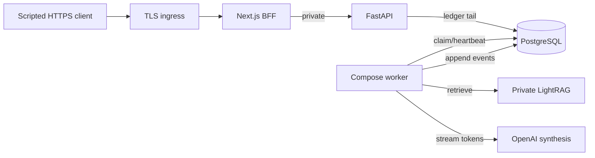
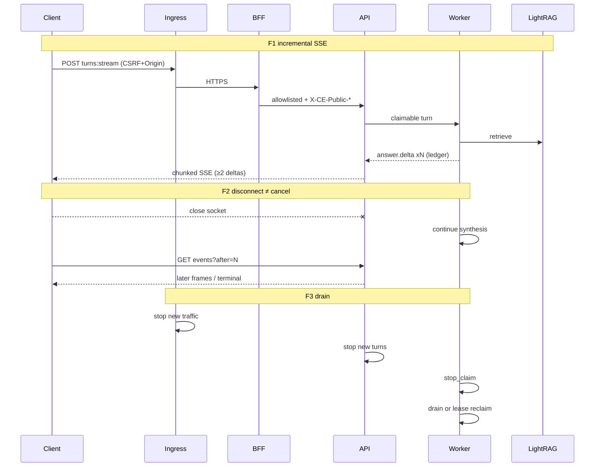

# P12-05 Deployed Ingress SSE and Stream Drain - Plan

## Goal Capsule

- **Objective:** Close P12-05 by proving deployed-ingress incremental domain-RAG SSE (≥2 `answer.delta` before terminal with measurable inter-arrival), reconnect/resume/replay, graceful shutdown/stream-drain (ingress stop-new-traffic → API stop-new-turns → worker stop-claim → reclaimable leases), TLS/Host/Origin/CSRF through the public edge, and direct FastAPI denial — through the real private LightRAG runtime and credential-gated live OpenAI streaming synthesis.
- **Authority:** `docs/architecture/deployment-topology.md` (Network/ingress; Boot/shutdown; ≥2-delta gate); `docs/architecture/frontend-security-boundary.md` (BFF pass-through; deployed-ingress negatives); `docs/contracts/sse-event-catalog.md`; interaction cases M-03 / M-10 / C-01 / C-05; DRIFT-05/24/25 deployed halves; `docs/master-build-plan.md` P12-05 (depends P5-04, P7-06, P9, P12-02 — all DONE).
- **Execution profile:** Compose TLS + live LightRAG overlay altitude (`compose.stack.yml` + `compose.stack.live.yml` + new TLS overlay); scripted proof clients (not Playwright); evidence-owned like P5-04/P10 live — not a default `scripts/verify.sh` gate.
- **Readiness checkpoint:** Implementation-ready; prerequisites DONE. Cite `docs/_scratch/p5-04-lightrag-real-runtime-evidence.md`, `p7-04-sse-pipeline-evidence.md`, `p7-06-synthesis-isolation-heartbeat-evidence.md`, `p9-05-ci-validators-evidence.md`, `p10-01-compose-config-evidence.md`, `p10-02-stack-smoke-evidence.md`, `p10-03-worker-lifecycle-evidence.md`, `p12-02-suite-contract-convergence-evidence.md`.
- **Stop conditions:** Stop if DONE claims Playwright/browser matrix (P12-07), SBOM (P12-06), backup/DR (P12-04), HA/multi-region (P12-08), WebSockets/second stream protocol, in-process synthetic LightRAG as production runtime, whole-body `response.read()` as AE1, HTTP+`testing=true` as TLS/`testing=false` evidence, or green AE1 without live streaming credentials present.
- **Tail ownership:** Deployed PDF byte-range residual → P12-07; ingress adversarial deletion residual → P12-07 (not DONE P12-03/P7-05); hard provider-I/O abort beyond cooperative topology drain → P12-08; P12-07 also owns browser/CSRF/Playwright; P12-08 owns acceptance digests/HA.

---

## Product Contract

### Summary

Prove the production trust and streaming boundary through TLS ingress → Next BFF → private FastAPI → leased worker → real LightRAG domain-RAG, including unbuffered incremental SSE and topology stream-drain.

Product Contract preservation: changed R2 (hard wait → cite DONE prerequisites); clarified R4 chunked/inter-arrival delta measurement; added R8–R10 (credential-gated live OpenAI synthesis, API stop-new-turns, evidence/tracker + residual naming); clarified deferred byte-range/adversarial-deletion residuals — WHY: prerequisites landed and research exposed topology gaps the thin bootstrap deferred.

### Problem Frame

Local BFF strip/emit (P9-05), SSE producer/resume/replay (P7-04), worker SIGTERM stop-claim (P10-03), turn-lease heartbeat (P7-06), and real LightRAG (P5-04) are proven. Deployed TLS ingress, unbuffered ≥2-delta measurement through the public origin, API stop-new-turns on shutdown, and full topology stream-drain remain open. P10 smokes buffer entire SSE bodies and often terminate with provider-not-ready / zero deltas — those cannot close P12-05. Without ingress proofs, concurrent multi-user production streaming is not release-proven.

### Actors

| Actor | Role |
| --- | --- |
| Member | Streams `domain_rag` through the public HTTPS origin |
| Operator | Runs TLS Compose matrix and drain drills |
| Coding agent | Inventory, TLS overlay, API drain seam, proof scripts, evidence, tracker |

### Key Flows

**F1 — Incremental domain-RAG SSE.** CSRF→login→conversation→`turns:stream` via public HTTPS origin and BFF; real LightRAG retrieve + live OpenAI streaming synthesis; ≥2 `answer.delta` with measurable inter-arrival before terminal (M-03).

**F2 — Disconnect ≠ cancel; resume/replay.** Mid-stream client close does not cancel; worker continues; resume `GET .../events?after=` continues; terminal replay uses durable ledger with `replay:true`; closed socket ≠ completion (C-01 / P7-04 re-proof at edge).

**F3 — Topology stream-drain.** SIGTERM order: ingress stops new traffic → API stops new turns → workers stop claims → in-flight streams/work drain within grace → unresolved work reclaimable by lease; new stream during drain fails closed.

**F4 — Trust through edge.** TLS public origin; Host/Origin/CSRF; forged `X-CE-*` stripped/replaced by BFF; direct public FastAPI denied (C-05 session/role recheck remains API credit; edge proves Host/Origin/CSRF + denial).

### Requirements

- R1. Inventory credit/gap/defer in `docs/_scratch/p12-05-deployed-ingress-inventory.md` (mirror p12-03 disposition legend).
- R2. Prerequisites are DONE — cite P5-04 / P7-04 / P7-06 / P9-05 / P10-01..03 / P12-02 evidence revisions in inventory before AE green. No hard wait remains.
- R3. TLS Compose overlay (or staging-equivalent profile): HTTPS public origin only to Next; FastAPI private; `testing=false` fail-closed CE_*/CONTEXT_ENGINE_* origin/peer/host settings; SSE proxy buffering/compression/caching/body-transform disabled; idle timeout > heartbeat + reconnect margin; certificates/config outside app images.
- R4. Prove ≥2 incremental `answer.delta` before terminal through the public origin with chunked/readline consumption and inter-arrival timing; a single buffered blob fails the proof (`deployment-topology.md`).
- R5. Prove disconnect ≠ cancel, resume after cursor, and terminal durable replay through the public origin (M-03 / C-01).
- R6. Prove graceful stream-drain: API stop-new-turns on SIGTERM/shutdown, worker `stack_worker.stop_claim` (credit P10-03), drain within configured grace, unresolved leases reclaimable; closed socket ≠ completion.
- R7. Prove Host/Origin/CSRF through TLS edge and direct FastAPI denial from untrusted peers; forge trust headers are not honored.
- R8. AE1 synthesis path is credential-gated live OpenAI streaming. Proof scripts load `OPENAI_API_KEY` / `CE_OPENAI_API_KEY` (and stack env files) from the process environment / Compose `--env-file` only. Never embed, log, print, or attach key material in inventory, evidence, runbooks, fixtures, or CI artifacts. Missing credentials → AE1 does not go green (honest residual), not a false pass.
- R9. Implement API stop-new-turns on shutdown as an in-slice product seam (topology-required; missing today). Worker stop-claim alone does not close AE3.
- R10. Evidence + tracker; advance DRIFT-05/24/25 deployed halves; cite-close stale brownfield P7-06 `NOT_STARTED` if still present; rewrite residual owners to live lanes: deployed PDF byte-range → P12-07; ingress adversarial deletion → P12-07 (never leave owned-by-DONE-P12-03/P7-05); cooperative topology drain closes here while hard provider-I/O abort → P12-08; Playwright → P12-07; HA → P12-08.

### Acceptance Examples

- AE1. Through public HTTPS origin on live LightRAG + live OpenAI streaming: ≥2 timestamped `answer.delta` before terminal; proof fails if deltas share one read burst within `SSE_DELTA_INTER_ARRIVAL_EPSILON_MS` (U3 helper constant) or if `<2` deltas.
- AE2. After mid-stream disconnect (no cancel): turn still running or completes normally; resume/replay after cursor continues; no completion inferred from prior socket close.
- AE3. Drain drill: new turns rejected after API stop-new-turns; worker emits `stack_worker.stop_claim`; in-flight work drains or leases reclaimable within grace; cites P10-03 + P7-06 revisions.
- AE4. Direct FastAPI from untrusted peer/host denied; hostile Origin / CSRF mismatch rejected through TLS edge; login/mutation CSRF happy path succeeds.

### Scope Boundaries

#### In scope

- TLS Compose overlay + env contract; API stop-new-turns; chunked SSE/reconnect/drain proof scripts; trust negatives; inventory/evidence/runbook; DRIFT deployed halves

#### Deferred to Follow-Up Work

- Deployed PDF byte-range through ingress → **P12-07** (not DONE here; rewrite P12-04 residual owner on evidence close)
- Ingress adversarial deletion through deployed edge → **P12-07** (rewrite away from DONE P12-03/P7-05 ownership when closing this slice)
- Browser E2E / Playwright / two-user cache / BFCache → **P12-07**
- Full HA multi-region / production digests → **P12-08**
- Hard abort of blocking provider I/O mid-token beyond cooperative fences → **P12-08** (P12-05 closes cooperative topology drain only; split the P7-06 hard-drain residual accordingly)

#### Outside this product's identity

- WebSockets or a second streaming protocol
- Browser-selected upstreams, public LightRAG/runtime URLs, Redis/RQ/Celery
- Committing or documenting raw API keys

### Success Criteria

- AE1–AE4 reproducible from evidence commands with cited prerequisite revisions
- P12-05 tracker DONE with honest residuals
- DRIFT-05/24/25 deployed halves advanced without claiming Playwright or HA

---

## Planning Contract

### Key Technical Decisions

| ID | Decision | Rationale |
| --- | --- | --- |
| KTD1 | Prerequisites are credit, not a hard wait | P5-04 / P7-06 / P9 / P12-02 DONE; inventory cites evidence revisions |
| KTD2 | Compose TLS overlay + live LightRAG is DONE altitude | Matches local-production topology; staging-equivalent acceptable; HTTP+`testing=true` is non-evidence |
| KTD3 | Chunked/readline SSE consumer with inter-arrival timing | Whole-body `response.read()` cannot detect buffering; topology fails one buffered blob |
| KTD4 | Credential-gated live OpenAI for AE1 `(session-settled: user-directed — chosen over Compose multi-chunk synthesis stub: operator has OPENAI_API_KEY in gitignored .env; proofs load env only and never expose the key)` | Real streaming synthesis required for ≥2 deltas; missing key → AE1 residual, not green |
| KTD5 | API stop-new-turns implemented in-slice; new stream starts during drain return contracted `503 capacity_unavailable` (closed error union in `docs/contracts/http-api-catalog.md`) unless an existing chat-specific code already applies — do not invent a new error code | `deployment-topology.md` shutdown table + P10-03 residual; worker stop-claim alone insufficient; catalog keeps `503 capacity_unavailable` for admission/shed |
| KTD6 | SSE/drain/trust only; byte-range + adversarial deletion residual `(session-settled: user-directed — chosen over pulling Range/deletion into this slice: keep focus on master-build-plan P12-05 noun phrase)` | Avoid unbounded scope; U5 rewrites residual owners to live P12-07 / P12-08 lanes (not DONE peers) |
| KTD7 | Matrix uses `CE_INLINE_TURN_WORKERS=false` + Compose worker | Live-tail ledger + disconnect≠cancel require worker path |
| KTD8 | Keep P12-05 evidence-owned; do not force live TLS into default `verify.sh` | Same discipline as P5-04/P10 live lanes; unit helpers may land in pytest |

### High-Level Technical Design

### Assumptions

- P9-05 BFF body pass-through and header strip/emit remain credit; edge buffering is the new risk surface.
- Operator provides `OPENAI_API_KEY` / `CE_OPENAI_API_KEY` via gitignored env (repo `.env` is gitignored; prefer stack-local `--env-file` for Compose). Plan and scripts reference env **names** only.
- P12-02 default verify stays green baseline; live TLS proofs are opt-in evidence commands.
- Seeded demo corpus / domain fixture from `docs/quality/seeded-demo-and-test-data.md` is sufficient for a grounded domain_rag question when indexed on the live overlay.

### Risks and Dependencies

| Risk | Mitigation |
| --- | --- |
| Proxy/TLS buffering false green | Chunked timestamps; fail single-burst deltas; disable buffer/compress on `text/event-stream` |
| Missing OpenAI credentials | AE1 does not pass; evidence residual — never fabricate deltas |
| Provider rate-limit / network flake | Bounded retries in proof script; record request ID; do not weaken ≥2-delta gate |
| Scope into Playwright or byte-range | KTD6 residuals; stop conditions |
| API drain race with in-flight attach | Spec: reject new starts; allow resume/tail of accepted turns through grace |
| Secret leakage into evidence | Privacy checklist; redact env dumps; never cat `.env` into artifacts |

### Sequencing

U1 → U2 → U3 → U4 → U5. U3 requires U2 + credentials + live overlay. U4 requires U2 and prefers a long turn from U3 patterns. U5 closes after AE1–AE4.

---

## Implementation Units

### U1. Deployed-ingress inventory

**Goal:** Freeze credit/gap/defer for TLS, SSE, drain, trust, and residuals; clear stale hard-wait language.

**Requirements:** R1, R2, R10

**Dependencies:** None

**Files:**
- Create: `docs/_scratch/p12-05-deployed-ingress-inventory.md`

**Approach:** Mirror `docs/_scratch/p12-03-adversarial-security-inventory.md` disposition legend (`credit` / `gap-fill` / `out-of-scope` / `defer`). Credit P7-04 disconnect/resume/cancel, P9-05 BFF strip/`X-Accel-Buffering`, P10-01 dual origin/peer pin, P10-02 CSRF→SSE terminal smoke + AE6 partial denial, P10-03 worker `stop_claim`, P5-04 live runtime, P7-06 heartbeat. Gap-fill: TLS overlay, chunked SSE proof, API stop-new-turns, full topology drain, `testing=false` HTTPS. Defer: Playwright, HA, deployed byte-range, ingress adversarial deletion. Cite prerequisite evidence paths + dates.

**Patterns to follow:** `docs/_scratch/p12-03-adversarial-security-inventory.md`, `docs/_scratch/p12-04-backup-restore-inventory.md`

**Test scenarios:**
- Test expectation: none -- inventory document.

**Verification:** Residuals and gap-fill worklist named; no “blocked on P5-04/P7-06” language.

---

### U2. TLS ingress topology and trust smoke

**Goal:** Public HTTPS → Next only; private API; Host/Origin/CSRF + direct-API denial through the edge.

**Requirements:** R3, R7, AE4

**Dependencies:** U1

**Files:**
- Create: `app/compose.stack.tls.yml` (name flexible if inventory chooses equivalent)
- Modify: `app/.env.stack.example` (HTTPS / tls profile knobs; placeholder env **names** only)
- Modify: `docs/operations/compose-stack-runbook.md` (TLS profile + trust negatives)
- Modify: `app/tests/test_compose_stack_config.py` (overlay/env contract assertions)
- Create: `app/scripts/stack_ingress_trust_proof.py` (or fold trust section into shared ingress harness)

**Approach:** Terminate TLS at ingress (Caddy/nginx/traefik — pick one with buffering/compression disable for SSE). Certificates outside app images. Publish only ingress→frontend path to the host; keep API off the untrusted public surface (or peer-deny equivalently under `testing=false`). Align `CE_PUBLIC_ORIGIN` / `CONTEXT_ENGINE_PUBLIC_ORIGIN` to `https://…`. Configure ingress idle timeout strictly greater than turn/SSE heartbeat + reconnect margin (`deployment-topology.md`). Prove login/mutation CSRF happy path; hostile Origin 403; CSRF mismatch rejected; forged trust headers ignored; direct API non-green. Do not claim AE1 here.

**Patterns to follow:** `docs/architecture/frontend-security-boundary.md`; `app/scripts/stack_smoke_core.py` AE6; `app/tests/test_postgres_ingress_security.py`; `app/client/src/lib/server/bff-proxy.ts`

**Execution note:** Prefer config/smoke verification of the overlay before investing in long SSE runs.

**Test scenarios:**
- Happy: CSRF bootstrap → login → authenticated mutation through HTTPS public origin succeeds.
- Error: hostile Origin on unsafe method → 403 through ingress.
- Error: CSRF missing/mismatch → safe denial envelope.
- Error: direct FastAPI from untrusted peer/host denied (AE4).
- Edge: forged `X-CE-Public-Host` / `X-User-*` from client do not grant trust.
- Integration: `docker compose … -f compose.stack.yml -f compose.stack.tls.yml config` validates; compose contract tests cover required env keys.

**Verification:** AE4 commands reproducible; runbook documents TLS profile; no raw key material in example files.

---

### U3. Incremental SSE and reconnect/replay proof

**Goal:** ≥2 timed `answer.delta` + disconnect/resume/replay through public origin with real LightRAG and live OpenAI.

**Requirements:** R4, R5, R8, AE1, AE2

**Dependencies:** U2; live overlay; credentials present in environment

**Files:**
- Create: `app/scripts/stack_ingress_sse_proof.py`
- Create: `app/tests/test_stack_ingress_sse_helpers.py` (pure helpers: frame parse, inter-arrival gate — no live network required)
- Modify: `docs/operations/compose-stack-runbook.md` (SSE proof commands)

**Approach:** Boot `compose.stack.yml` + `compose.stack.live.yml` + TLS overlay; `CE_INLINE_TURN_WORKERS=false`. Seed/index a domain per seeded-demo fixtures as needed. Script: chunked/readline SSE consumer recording `(t_i, event_type, cursor)` — never `response.read()` for AE1. Define proof-helper constant `SSE_DELTA_INTER_ARRIVAL_EPSILON_MS` (default **25ms**, rationale: distinguishes proxy one-blob flush / same-readline coalescing from intentional multi-chunk streaming; not a product SSE timing contract). Assert ≥2 `answer.delta` before terminal with inter-arrival > that constant. Unit-test the gate in `test_stack_ingress_sse_helpers.py` with synthetic timestamps. Mid-stream disconnect without cancel; assert turn not cancelled; resume `?after=`; optional terminal replay `replay:true`. Fail closed if credentials absent (exit non-zero with safe message). Case IDs M-03 / C-01 (and M-10 attach lite if cheap). Privacy: redact secrets from any captured headers/logs.

**Patterns to follow:** `docs/contracts/sse-event-catalog.md`; `app/tests/fixtures/sse/disconnect-resume.sse`; `app/scripts/stack_smoke_core.py` (cookie/CSRF client only — replace body read); P5-04 live boot; P10-05 provider env names (`OPENAI_API_KEY`, `CE_OPENAI_API_KEY`)

**Execution note:** Gate AE1 on credential presence check that only reports boolean presence (e.g. key non-empty), never prints the value.

**Test scenarios:**
- Happy: Covers AE1 / M-03 — ≥2 timed deltas before terminal through HTTPS origin on live LightRAG + OpenAI.
- Happy: Covers AE2 / C-01 — disconnect without cancel; resume continues; worker completes.
- Edge: terminal replay through ingress marks replay; no second provider/LightRAG call (ledger attach).
- Edge: identical `(conversationId, clientRequestId)` attach does not double-dispatch (M-10 lite) when inexpensive.
- Error: credentials absent → script fails AE1 with safe message (no key material).
- Error: single buffered blob / inter-arrival ≤ `SSE_DELTA_INTER_ARRIVAL_EPSILON_MS` / `<2` deltas → proof failure.
- Integration: helpers unit-test inter-arrival gate — two frames 0ms apart fail; two frames > ε pass; cite constant name in evidence commands.

**Verification:** AE1/AE2 commands in evidence; cite P5-04 + P7-04 revisions; no secrets in artifacts.

---

### U4. API stop-new-turns and topology drain proof

**Goal:** Implement API shutdown stop-new-turns; prove ordered drain with reclaimability.

**Requirements:** R6, R9, AE3

**Dependencies:** U2; U3 patterns for long turn; P10-03 / P7-06 credit

**Files:**
- Modify: `app/context_engine/app.py` (lifespan / shutdown signaling)
- Modify: related request/turn entry seam that rejects new stream starts when draining (keep handlers thin; service owns gate)
- Create: `app/scripts/stack_ingress_drain_proof.py`
- Create/Modify: unit/service tests for stop-new-turns gate (e.g. `app/tests/test_api_shutdown_drain.py`)
- Modify: `docs/operations/compose-stack-runbook.md` (shutdown order + drain drill)

**Approach:** On SIGTERM/lifespan shutdown: set API drain flag so new `turns:stream` starts fail closed with `503 capacity_unavailable` (KTD5) before headers become SSE. Document and assert resume/tail of already-accepted turns through grace (reject new starts only). Worker keeps P10-03 `should_continue` / `stack_worker.stop_claim`. Drain script: start long domain_rag turn → observe ≥1 delta → signal stop (ingress/API/worker per topology) → assert new stream rejected with `503 capacity_unavailable` → assert resume/tail of the in-flight turn still works through grace → assert stop_claim / reclaimable lease → assert prior close ≠ completion. Record wall-clock within grace. Cite P7-06 heartbeat for mid-turn lease liveness; hard provider-I/O abort remains P12-08 residual.

**Patterns to follow:** `docs/architecture/deployment-topology.md` shutdown paragraph; `app/context_engine/worker.py` stop_claim; `app/scripts/stack_smoke_worker.py`; `app/scripts/stack_incident_reclaim_drill.py`; P7-06 lease heartbeat tests

**Execution note:** Implement stop-new-turns test-first at unit/service altitude, then Compose drain drill.

**Test scenarios:**
- Happy: Covers AE3 — drain completes or leaves only reclaimable leased work within grace.
- Happy: new `turns:stream` after API drain flag → fail closed with `503 capacity_unavailable`.
- Happy: resume/tail of already-accepted turn succeeds through grace after stop-new-turns.
- Edge: disconnect during drain ≠ cancel; resume policy documented and asserted.
- Edge: worker `stack_worker.stop_claim` still observed (P10-03 credit re-proven in matrix).
- Integration: cites P10-03 + P7-06 evidence revisions; grace timing recorded; hard I/O abort not claimed.
- Error: claiming AE3 from worker-only stop without API gate → forbidden (test or inventory non-claim).

**Verification:** AE3 in evidence; unit tests for gate green without live Docker; Compose drain drill required for DONE (evidence-owned opt-in command; not in default `verify.sh`).

---

### U5. Evidence, runbook residuals, and tracker closure

**Goal:** Close P12-05 with honest residuals; advance DRIFT deployed halves.

**Requirements:** R10, AE4

**Dependencies:** U1–U4

**Files:**
- Create: `docs/_scratch/p12-05-deployed-ingress-evidence.md`
- Modify: `docs/master-build-plan.md` (P12-05 DONE + residual language)
- Modify: `docs/brownfield-refactor-register.md` (DRIFT-05/24/25 deployed halves; stale P7-06 row if needed)
- Modify: `docs/operations/compose-stack-runbook.md` (demote closed residuals; keep byte-range/Playwright/HA pointers)

**Approach:** Mirror `docs/_scratch/p12-03-adversarial-security-evidence.md` / `p12-04-backup-restore-evidence.md`: what landed, prerequisite citation table, AE command matrix, privacy checklist (no keys, runtime URLs, prompts, lease owners). On tracker close, rewrite residual owners in `docs/master-build-plan.md`, brownfield register, and cited p12-03/p7-06 residual tables: byte-range → P12-07; ingress adversarial deletion → P12-07; cooperative topology drain closed here; hard provider-I/O abort → P12-08; Playwright → P12-07; HA → P12-08. Advance DRIFT-05/24/25 only for deployed halves actually proven.

**Patterns to follow:** prior P12 evidence docs; brownfield register disposition language

**Test scenarios:**
- Test expectation: none -- documentation and tracker closure.
- Checklist: evidence contains zero secret substrings; commands use env-file references only.

**Verification:** Tracker DONE; residuals named; DRIFT rows match evidence altitude.

---

## Verification Contract

| Gate | Altitude | Notes |
| --- | --- | --- |
| Inventory dispositions | Docs | U1 |
| Compose TLS config contract | `app/tests/test_compose_stack_config.py` | U2 |
| Trust proof AE4 | Opt-in script against TLS matrix | U2 |
| SSE helper unit tests | `app/tests/test_stack_ingress_sse_helpers.py` | U3 |
| SSE AE1/AE2 | Opt-in `stack_ingress_sse_proof.py` + live + TLS + credentials | U3 |
| API stop-new-turns unit/service | `app/tests/test_api_shutdown_drain.py` | U4 |
| Drain AE3 | Opt-in `stack_ingress_drain_proof.py` | U4 |
| Default `scripts/verify.sh` | Must stay green; must not require live TLS/OpenAI | Non-regression |
| Privacy scan of evidence/artifacts | Manual + existing privacy tests where applicable | No key leakage |

Evidence must cite prerequisite document revisions. Missing `OPENAI_API_KEY`/`CE_OPENAI_API_KEY` blocks AE1 only — do not weaken the ≥2-delta gate.

---

## Definition of Done

- R1–R10 and AE1–AE4 satisfied at the altitudes above (AE1 requires credentials present).
- API stop-new-turns seam landed and tested; worker stop-claim re-proven in drain matrix.
- Inventory + evidence published; runbook updated; P12-05 DONE in master-build-plan with residual owners rewritten to P12-07 (byte-range, adversarial deletion, Playwright) and P12-08 (HA, hard provider-I/O abort).
- DRIFT-05/24/25 deployed halves advanced only to the proven altitude.
- No abandoned experimental TLS/proxy code left unreferenced; secrets never committed or pasted into docs.
- Abandoned-attempt code from alternate ingress choices removed from the final diff.

---

## Sources & Research

- `docs/architecture/deployment-topology.md` — ≥2-delta gate; shutdown order; SSE proxy rules
- `docs/architecture/frontend-security-boundary.md` — BFF allowlist; deployed-ingress negatives
- `docs/contracts/sse-event-catalog.md` — event order; resume/replay
- `docs/_scratch/p5-04-lightrag-real-runtime-evidence.md` — live runtime credit
- `docs/_scratch/p7-04-sse-pipeline-evidence.md` — disconnect≠cancel / replay credit
- `docs/_scratch/p7-06-synthesis-isolation-heartbeat-evidence.md` — heartbeat; hard drain residual
- `docs/_scratch/p9-05-ci-validators-evidence.md` — local BFF credit
- `docs/_scratch/p10-01-compose-config-evidence.md` / `p10-02-stack-smoke-evidence.md` / `p10-03-worker-lifecycle-evidence.md` — compose/smoke/stop-claim credit + P12-05 residuals
- `docs/_scratch/p12-02-suite-contract-convergence-evidence.md` / `p12-03-adversarial-security-evidence.md` / `p12-04-backup-restore-evidence.md` — evidence shape + residual handoffs
- `app/client/src/lib/server/bff-proxy.ts` — pass-through streaming
- `app/context_engine/worker.py` — `stack_worker.stop_claim`
- `app/scripts/stack_smoke_core.py` / `stack_smoke_worker.py` — cookie/CSRF client patterns (not AE1 body-read)
- External research: skipped — strong local topology/SSE/compose patterns

## Assumptions (planning)

- Session-settled KTD4/KTD6 stand unless invalidating evidence appears at implementation time.
- TLS terminator choice (Caddy vs nginx vs traefik) is an implementation detail inside U2 as long as buffering/compression are disabled for SSE and certs stay outside app images.
