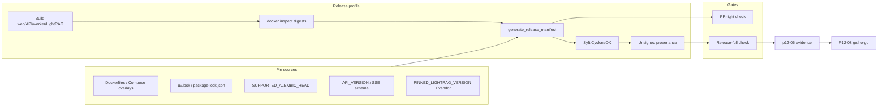

# P12-06 Immutable Artifact Manifest and SBOM - Plan

## Goal Capsule

- **Objective:** Close master-build-plan P12-06 by shipping an immutable release artifact manifest that freezes web/API/worker/LightRAG runtime image digests, MinIO/mc pins, parser/provider/renderer package and image-gate pins, lockfile digests, Alembic head, OpenAPI/SSE versions, source revision, Syft CycloneDX SBOMs, and unsigned local provenance — plus fail-closed verify hooks and evidence P12-08 can cite.
- **Authority:** Root `AGENTS.md`; `docs/quality/definition-of-done.md` production release gate; `docs/architecture/deployment-topology.md` release sequence step 1; `docs/master-build-plan.md` P12-06 (depends P0, P5-04, P10-04, P10-05, P10-06, P12-02 — all DONE); `docs/operations/provider-deployment-profiles.md` packaging altitude honesty; brownfield row “Immutable artifact / SBOM / provenance”.
- **Execution profile:** Inventory-first; prerequisites DONE — invent generator/SBOM/verify, do not wait on packaging. Default CI stays lean (`local`/`local`); release profile builds/inspects the full image matrix and fails closed. Scripted unit altitude for generator/check; release-profile digests from built images (not development stubs).
- **Readiness checkpoint:** Implementation-ready. Cite `docs/_scratch/p5-04-lightrag-real-runtime-evidence.md`, `p10-04-minio-object-store-evidence.md`, `p10-05-provider-packaging-evidence.md`, `p10-06-governed-preview-evidence.md`, `p12-02-suite-contract-convergence-evidence.md`. Pin sources already exist; SBOM/manifest tooling is greenfield.
- **Stop conditions:** Stop if inventing product SBOM/observability UI; claiming production digests without built artifacts; treating P12-04 Compose-matrix drill digests as release pins; labeling kinds `production-supported` from packaging/pins alone; absorbing Playwright/live Compose smoke (P12-07) or cosign/registry promotion (P12-08); productizing LibreOffice/PPT; wiring full release matrix into default `scripts/verify.sh` without an explicit release-profile boundary.
- **Tail ownership:** P12-08 go/no-go consumes this manifest (digests, SBOM hashes, provenance SHA, named cosign residual); P12-05/P12-07 should record which release digests were under test when they claim deployed evidence; P12-04 local drill digests remain non-equivalent.

---

## Product Contract

### Summary

Operators and CI produce a committed, regeneratable release manifest that freezes every artifact a restore/rollback and P12-08 acceptance need — images by digest, locks, schema/contract versions, LightRAG/MinIO pins, parser/provider/renderer packaging pins, SBOM content hashes, and unsigned provenance binding git SHA to those digests — and a verify gate that fails closed on missing or mismatched release-profile fields.

Product Contract preservation: Product Contract intent unchanged from bootstrap; requirements and acceptance examples strengthened for prerequisite DONE status, pin honesty, and fail-closed edges. Changed: R2–R5 / AE1–AE4 wording clarified (not new product scope).

### Problem Frame

DoD and deployment topology require immutable image digests, SBOM, provenance, lockfile digests, source revision, migration head, and API/SSE versions before production acceptance. P12-02 freezes contracts; P5-04/P10-04/P10-05/P10-06 package runtime/store/parser/provider/renderer seams — but no release manifest, SBOM, or digest gate exists. P12-04 records local drill digests that must not be rebranded as release pins. Without this slice, rollback and P12-08 cannot prove what ran.

### Actors

| Actor | Role |
| --- | --- |
| Operator / releaser | Runs release-profile build → generate → SBOM → verify; cites manifest in acceptance |
| Coding agent | Inventory, generator, SBOM scripts, CI hooks, fixture tests, evidence |
| Reviewer | Confirms pin honesty, PR-light vs release-full boundary, residuals, non-claims |

### Key Flows

**F1 — Inventory freeze.** Map every DoD/topology pin field → regeneratable source (Dockerfile build args, Compose tags, `docker inspect` digest, lock digest, `SUPPORTED_ALEMBIC_HEAD`, `API_VERSION` / SSE `schemaVersion`, `PINNED_LIGHTRAG_VERSION` + vendored `_version.py`, renderer IDs, MinIO/mc tags) → PR-light vs release-full matrix → dispositions.

**F2 — Build and pin.** Release profile builds (1) web client image and (2) the release app/controller image with the frozen gate set `CE_STACK_LIVE_IMAGE=1` + `CE_STACK_PARSERS_IMAGE=1` + `CE_STACK_OBJECT_STORE_IMAGE=1` + `CE_STACK_PREVIEW_IMAGE=1` (not the default slim CI image). Record digests on `linux/amd64`. Map roles → digests from Compose reality: `api` / `worker` / per-domain LightRAG containers may share one controller digest — U1 freezes the role→digest map; do not invent four distinct builds when Compose uses one. Reject Alpine placeholder controller. Resolve MinIO/mc tag→digest → hash locks → read schema/contract/LightRAG/renderer pins → emit `release-manifest.json`.

**F3 — SBOM and provenance.** Pin Syft → generate CycloneDX JSON SBOM once per **distinct** mandatory release digest (web + each unique app/controller digest in the role map) → hash SBOM files into manifest → write unsigned allowlisted provenance (git SHA, dirty flag, build UTC, workflow id if present, generator versions, subject digests, SBOM/lock hashes, known `CE_STACK_*` 0/1 gate flags only). Upstream MinIO: digest pin only (no fake empty SBOM).

**F4 — Verify gate.** PR-light checks regeneratable repo pins (locks, Alembic head, OpenAPI/SSE versions, LightRAG version string, Compose MinIO tags, manifest schema). Release-full regenerates/compares digests + SBOM hashes + provenance binding; fail on incomplete fields, stub LightRAG image, tool missing, or mismatch. Default `verify.sh` stays lean.

**F5 — Evidence and tracker.** Record commands, AE altitudes, prerequisite citations; mark P12-06 DONE; name cosign/registry/multi-arch/operator live-support residuals for P12-08/ops.

### Requirements

**Inventory and ownership**

- R1. Freeze the pin field register in `docs/_scratch/p12-06-immutable-artifact-inventory.md` with disposition (`retain` / `modify` / `add` / `defer` / `credit` / `reject`) mapping each DoD production-gate field to source path, profile (PR-light vs release-full), and residual owner.
- R2. Prerequisites DONE: cite P5-04, P10-04, P10-05, P10-06, and P12-02 evidence revisions in inventory/evidence before claiming AE green. Do not invent packaging — invent manifest/SBOM/verify only.

**Manifest**

- R3. Emit a versioned committed JSON release manifest (schema version field required) covering at minimum: `profile`, source git SHA + dirty flag, role→digest map for web + api + worker + LightRAG-runtime roles (`sha256:…`, platform `linux/amd64`; shared digests allowed and expected when Compose shares `CE_DOMAIN_CONTROLLER_IMAGE`), MinIO and mc image digests (tag labels allowed as metadata only), postgres image pin (digest preferred; tag-only only if U1 names an explicit residual), `app/uv.lock` and `app/client/package-lock.json` content digests, `SUPPORTED_ALEMBIC_HEAD`, OpenAPI/`API_VERSION`, SSE schema version, vendored LightRAG version + pin assertion sources, Dockerfile image-gate args for the release app image (`CE_STACK_LIVE_IMAGE` / `PARSERS` / `OBJECT_STORE` / `PREVIEW` all `1`), parser/provider/renderer package versions resolved from that release image’s lock/extras (renderer IDs `ce-preview-v1`, `ce-preview-text-v1`, `ce-preview-pdf-passthrough-v1` from `app/context_engine/adapters/preview_renderer.py`), SBOM path + content hash per **distinct** mandatory digest, allowlisted provenance section, and generator/tool versions.
- R4. Release profile refuses incomplete manifests (null/omitted required fields). Alpine/synthetic/local-stub LightRAG controller digests fail release. Tag-only MinIO/mc (and postgres unless residual) without digests fail release. Packaging pins must not auto-label kinds `production-supported`. Slim default Dockerfile builds are not release authority.
- R5. Manifest distinguishes `profile: release` from any drill/local records; verify rejects offering P12-04 drill digests as release pins.

**SBOM and provenance**

- R6. Generate CycloneDX JSON SBOMs with a pinned Syft version for each **distinct** mandatory release digest (web + unique controller/app digests in the role map). Fail closed if Syft missing, generation errors, or SBOM below a documented non-empty integrity floor. MinIO/mc: upstream digest pin only — do not invent a fake local SBOM.
- R7. Record unsigned local provenance with an allowlisted field set only: git SHA, dirty flag, build UTC, optional CI run id/URL, Syft/generator versions, subject digests, SBOM/lock hashes, and known `CE_STACK_*` gate flags (0/1). Forbid env dumps, credentials, runtime URLs, and host paths. Verify fails on deny-pattern hits. Do not claim signed release. Cosign/key ceremony/registry promotion residual → P12-08.

**Verify and CI**

- R8. Provide `scripts/check-release-manifest` (or equivalent) with adversarial fixture tests: mutate digest, lock hash, Alembic head, OpenAPI/SSE version, LightRAG stub swap, SBOM hash break → fail; incomplete release fields → fail; unknown/missing schema version → fail.
- R9. Document and wire PR-light vs release-full boundary. Default root `scripts/verify.sh` / PR `verify.yml` may run PR-light only. Release-full job/workflow (or documented operator release command) owns digests + SBOM; omission of that job is a named residual, not a silent skip. Do not absorb Playwright or live Compose smoke.

**Evidence and tracker**

- R10. Evidence in `docs/_scratch/p12-06-immutable-artifact-evidence.md`; update `docs/master-build-plan.md` P12-06 and brownfield row; name residuals (cosign, multi-arch beyond `linux/amd64`, operator live digests for elevating support labels, PPT/LibreOffice).

### Acceptance Examples

- AE1. Release-profile generator with built web + release app/controller image(s), role→digest map, and resolved MinIO/mc digests emits a schema-valid manifest containing every R3 required field.
- AE2. Verify fails with distinct diagnostics for: mutated digest; mutated lock hash; Alembic head drift; OpenAPI/SSE drift; SBOM hash break; LightRAG stub/Alpine controller swap; incomplete release fields; unknown/missing `schemaVersion`.
- AE3. Unit altitude may fixture/mock Syft for fail-closed wiring. DONE for AE3 also requires one recorded release-profile command run that produced non-empty CycloneDX SBOMs for each distinct mandatory digest against built images; Syft absent or generation failure fails that run (not skipped).
- AE4. Evidence cites concrete P5-04 / P10-04 / P10-05 / P10-06 / P12-02 revisions and explicitly refuses packaging-alone `production-supported` language; P12-04 drill digests are non-claims for this gate.

### Scope Boundaries

#### In scope

- Inventory; committed release-manifest schema + generator; Syft CycloneDX SBOM generation; unsigned provenance; PR-light vs release-full verify hooks; fixture/adversarial tests; evidence/tracker closure.

#### Deferred for later

- Cosign / keyless signing / Rekor / GitHub artifact attestations (P12-08).
- Multi-arch indexes beyond the Phase 1 `linux/amd64` release authority.
- Operator live smoke digests that elevate catalog kinds to `production-supported` (ops / P12-08; pins alone never elevate).
- Vuln scanning (Trivy/Grype) as a separate gate — optional mention only, not P12-06 DONE.

#### Deferred to Follow-Up Work

- Wiring release-full into a dedicated GitHub Actions release workflow if the implementer lands scripts + documented operator command first (CI wiring still preferred in U4 when cheap).
- Asserting `PINNED_LIGHTRAG_VERSION` against vendored `_version.py` at runtime load (nice tighten; credit if easy, not blocking if inventory records both sources).

#### Outside this product's identity

- Product-facing SBOM browser UI or Phase 2 observability dashboards.
- Redis/RQ/Celery, second streaming protocol, Workspace entity, LibreOffice/PPT productization.
- Treating filesystem object adapter or LightRAG runtime disk as release authority.

### Success Criteria

- R1–R10 and AE1–AE4 satisfied at documented altitudes.
- P12-08 can cite a stable repo path + content hash for digests/SBOM/provenance without tag-only refs.
- Default CI remains lean; release profile fails closed.

---

## Planning Contract

### Key Technical Decisions

| ID | Decision | Rationale |
| --- | --- | --- |
| KTD1 | Committed versioned JSON under `docs/releases/` (`release-manifest.schema.json` + generated `release-manifest.json` + `*.cdx.json` siblings). Rejected: CI-artifact-only upload (P12-08 cite rot); rejected: living under `app/contracts/` next to OpenAPI (release pins are ops/release evidence, not browser-generated API contracts) | Durable git cite path; regenerate-and-diff; U1 may only relocate if a blocking repo convention appears — default is `docs/releases/` |
| KTD2 | PR-light vs release-full profiles. Rejected: full digests/SBOM on every PR `verify.yml` run | Full matrix is expensive; default verify stays lean; release fails closed; PR-light green never equals production-gate |
| KTD3 | Syft (version-pinned) → CycloneDX JSON primary SBOM; BuildKit SPDX attestation optional/non-authoritative. Rejected: Trivy-as-sole SBOM (vuln tool side-effect); rejected: lockfile-only SBOM (misses base OS / LightRAG layers) | Purpose-built container inventory; CDX fits security tooling; tool pin avoids catalog noise |
| KTD4 | Mandatory SBOM subjects = each **distinct** release digest (web + unique app/controller digest(s)); roles api/worker/LightRAG may share one digest per Compose. MinIO/mc = digest pin only. Rejected: inventing empty local MinIO SBOM; rejected: requiring four Syft runs when digests are identical | Matches `compose.stack.live.yml` shared `CE_DOMAIN_CONTROLLER_IMAGE`; closes P5-04 residual without fake multiplicity |
| KTD9 | Release app image authority = Dockerfile with `CE_STACK_LIVE_IMAGE=1` + `PARSERS=1` + `OBJECT_STORE=1` + `PREVIEW=1`. Rejected: pinning the default slim CI image as release | Parser/provider/renderer/store extras must actually be in the release layers |
| KTD10 | P12-06 DONE requires one recorded release-full run (build → generate → Syft → verify) in evidence, not tooling-only. CI workflow wiring may still residual if the operator command is proven | DoD production gate needs digests, not scripts that were never executed |
| KTD5 | Release platform authority = `linux/amd64`; other arches residual | Matches local-production Compose evidence altitude; avoids false multi-arch claims |
| KTD6 | Reuse P12-04 digest parse helpers (`parse_image_inspect_digest` / `build_image_digest_record`) as credit, not as release truth. Rejected: copying drill `consistency-manifest` digests into release | Avoids reinventing inspect parsing; keeps drill ≠ release distinction |
| KTD7 | Packaging pins record versions/gates; support labels stay in `provider-deployment-profiles.md` | Pin honesty from P10-05/P10-06; pins never auto-elevate `production-supported` |
| KTD8 | LibreOffice/PPT out of required pin set | Casual pyproject “defer to P12-06” must not expand this slice into unapproved productization |

### High-Level Technical Design



```text
# Directional profile field matrix (not implementation code)
PR-light:
  schemaVersion, lock digests, alembic head, openapi/sse versions,
  lightrag version string, minio/mc tag labels, dockerfile gate constants present

release-full = PR-light +
  web/api/worker/lightrag digests @ linux/amd64,
  minio/mc digests, image-gate args per image,
  parser/provider/renderer package versions from release lock/extras,
  sbom paths+hashes, provenance bind, syft version
```

### Assumptions

- Prerequisites remain DONE; pin source paths above still exist at implementation time.
- Docker is available for release-profile digest capture; unit tests may fixture inspect JSON without a live daemon.
- Syft can be installed in the release job or documented as a required operator tool; absence fails release-full, not PR-light.
- STRATEGY.md frontend-factory tracks do not own this slice; no conflict.

### Risks and Dependencies

| Risk | Mitigation |
| --- | --- |
| Syft unavailable in CI | Pin install step; fail-closed release-full; document operator fallback |
| Rebuild non-determinism | Verify binds digests from the same build event; do not require cross-run digest equality at same SHA |
| Stale committed manifest | Regenerate-and-diff after lock/contract/image changes; AE2 fixtures |
| Accidental support-label upgrade | Evidence non-claims; inventory cites profiles doc |
| Wiring release-full into default verify | Explicit stop condition; keep lean default |
| Secrets in provenance/build-args | Redact credential-bearing env/build-args; privacy scan of manifest/SBOM/provenance in evidence; never embed provider keys or runtime URLs |
| Tag-only MinIO/postgres drift | Release-full requires resolved digests; floating tags alone fail; postgres base pin recorded or named residual |

### Sequencing

U1 inventory → U2 generator (schema + emit) → U3 SBOM/provenance → U4 verify/CI boundary → U5 evidence/tracker. U3 and U4 both depend on U2; U3 may land before U4 if SBOM hashes are written into the manifest schema early.

---

## Implementation Units

### U1. Manifest inventory

**Goal:** Freeze the authoritative pin-field → source → profile matrix and dispositions before coding the generator.

**Requirements:** R1, R2

**Dependencies:** None

**Files:**
- Create: `docs/_scratch/p12-06-immutable-artifact-inventory.md`

**Approach:** Mirror P12-03/P12-04 inventory shape (Date, Owner, Status, Plan, Authority, Scope/Out of scope, disposition register, dual-altitude matrix). Enumerate every R3 field; map to concrete paths: `app/Dockerfile`, `app/client/Dockerfile`, `app/compose.stack.yml` (postgres), `app/compose.stack.minio.yml`, `app/compose.stack.live.yml` (role→`CE_DOMAIN_CONTROLLER_IMAGE` map), `app/uv.lock`, `app/client/package-lock.json`, `app/context_engine/services/readiness.py` (`SUPPORTED_ALEMBIC_HEAD`), `app/context_engine/api/contract_app.py` (`API_VERSION`), SSE schema/`TURN_EVENT_SCHEMA_VERSION` owning module, `app/context_engine/services/lightrag_runtime.py` (`PINNED_LIGHTRAG_VERSION`), `app/vendor/lightrag/_version.py`, `app/context_engine/adapters/preview_renderer.py` (renderer IDs), `docs/operations/provider-deployment-profiles.md`. Freeze release build-arg set (KTD9) and postgres pin-or-residual. Credit P12-04 digest helpers as non-release. Reject LibreOffice/PPT and product SBOM UI. Cite prerequisite evidence paths.

**Patterns to follow:** `docs/_scratch/p12-04-backup-restore-inventory.md`, `docs/_scratch/p12-03-adversarial-security-inventory.md`

**Test scenarios:**
- Test expectation: none -- inventory document.

**Verification:** Every DoD production-gate bullet has a row; PR-light vs release-full columns filled; residuals named.

---

### U2. Release manifest schema and generator

**Goal:** Emit schema-valid release manifests from regeneratable sources; refuse incomplete release profile.

**Requirements:** R3, R4, R5, AE1

**Dependencies:** U1

**Files:**
- Create: `docs/releases/release-manifest.schema.json`, generated `docs/releases/release-manifest.json` (per KTD1; U1 records if a blocking convention forces relocation)
- Create: `scripts/generate_release_manifest.py` (name flexible; keep under `scripts/` or `app/scripts/` consistent with stack helpers)
- Create: `app/tests/test_release_manifest.py` (or `scripts/tests/…` if pure script)
- Credit/modify as needed: digest helpers in `app/scripts/stack_image_rollback_drill.py` (import/reuse, do not redefine release truth there)

**Approach:** Follow `generate_openapi.py` discipline and `build_consistency_manifest` / `build_image_digest_record` shapes. Support `--profile pr|release`. Release mode requires inspect JSON or live `docker inspect` for each mandatory image; fail if LightRAG image matches placeholder Alpine controller; fail on tag-only MinIO without resolved digest; refuse dirty tree unless explicitly documented fail. Record image-gate build args. Pull parser/provider/renderer versions from lock/extras used by release images. Never copy P12-04 drill digest files into the release manifest.

**Execution note:** Start with fixture-backed unit tests for schema validation and incomplete-release refusal before requiring a live Docker build.

**Patterns to follow:** `scripts/generate_openapi.py`; `app/scripts/stack_backup_capture.py` consistency manifest; `app/scripts/stack_image_rollback_drill.py` digest parsing

**Test scenarios:**
- Happy: fixture inspect + lock/head/contract inputs → schema-valid release manifest with all R3 fields.
- Happy: PR-light profile emits without image digests and is marked `profile: pr` (or equivalent).
- Error: release profile missing LightRAG digest → fail.
- Error: LightRAG digest/tag equals Alpine/placeholder controller → fail.
- Error: MinIO tag present without digest in release profile → fail.
- Error: required field null/omitted → fail.
- Edge: PPT/LibreOffice absent → still pass.
- Edge: packaging versions present do not set `production-supported` fields (field absent or explicitly non-claim).

**Verification:** Generator unit tests green; sample manifest validates against schema.

---

### U3. SBOM and unsigned provenance

**Goal:** Attach Syft CycloneDX SBOMs and unsigned provenance materials to the release profile.

**Requirements:** R6, R7, AE3

**Dependencies:** U2

**Files:**
- Create: SBOM generation script/CI step (e.g. `scripts/generate_release_sbom.sh` or Python wrapper)
- Create/modify: provenance section writer in the generator or sidecar
- Document: pinned Syft version + install in inventory/evidence
- Create: tests for SBOM hash binding and fail-closed missing-tool behavior (fixture or stubbed runner)

**Approach:** Pin Syft version. Run Syft once per **distinct** mandatory digest. Store `*.cdx.json` under `docs/releases/`. Hash SBOM bytes into the manifest. Provenance uses R7 allowlist only; check script deny-patterns fail closed. MinIO/mc: digest only. Empty/trivial SBOM below integrity floor fails. Fixture/mock covers wiring; AE3 DONE needs one real Syft×built-digest evidence run (KTD10). No product UI.

**Patterns to follow:** deployment-topology release sequence step 1; fail-closed CI patterns from `scripts/check-generated-contracts.sh`

**Test scenarios:**
- Happy: fixture/mock Syft output → non-empty CDX linked by hash for each distinct mandatory digest (shared role digests → one SBOM).
- Error: Syft missing in release profile → fail (not skip).
- Error: SBOM generation error → fail.
- Error: SBOM hash in manifest disagrees with file bytes → fail (may land with U4).
- Edge: MinIO has digest pin and no local SBOM entry required.
- Edge: provenance dirty-tree / SHA mismatch → fail or refuse emit per inventory rule.

**Verification:** AE3 satisfied at script or CI altitude; tool version recorded.

---

### U4. Verify gate and CI boundary

**Goal:** Fail CI/release on pin/digest/SBOM drift; keep default verify lean.

**Requirements:** R8, R9, AE2

**Dependencies:** U2; U3 for SBOM-hash cases

**Files:**
- Create: `scripts/check-release-manifest.sh` (and/or Python)
- Create: `scripts/tests/check-release-manifest.sh` adversarial fixtures
- Modify: `.github/workflows/verify.yml` and/or add release workflow — PR-light only on default path; release-full documented/wired
- Modify (carefully): `scripts/verify.sh` only if adding an opt-in or clearly gated PR-light hook — do not force full matrix

**Approach:** Mirror `check-generated-contracts` live-compare + adversarial mutate pattern. Distinct diagnostic classes for digest/lock/head/contract/SBOM/LightRAG-stub/incomplete/schema. Reject cross-cite of P12-04 drill digests when detectable. Document that PR-light green ≠ production-gate satisfaction.

**Patterns to follow:** `scripts/check-generated-contracts.sh`, `scripts/tests/check-generated-contracts.sh`, `scripts/verify.sh` boundary comments from P12-02 evidence

**Test scenarios:**
- Happy: matching PR-light pins pass without Docker.
- Happy: matching release-full fixture passes.
- Error: mutated image digest → fail.
- Error: mutated lock digest → fail.
- Error: Alembic head drift → fail.
- Error: OpenAPI or SSE version drift → fail.
- Error: SBOM hash break → fail.
- Error: incomplete release fields → fail.
- Error: unknown/missing manifest schemaVersion → fail.
- Integration: default verify path does not require full image matrix / Syft.

**Verification:** Adversarial script tests green; CI boundary documented in evidence.

---

### U5. Evidence and tracker closure

**Goal:** Close P12-06 for P12-08 consumption with honest altitudes and residuals.

**Requirements:** R10, AE4

**Dependencies:** U1–U4

**Files:**
- Create: `docs/_scratch/p12-06-immutable-artifact-evidence.md`
- Modify: `docs/master-build-plan.md` (P12-06 row)
- Modify: `docs/brownfield-refactor-register.md` (Immutable artifact / SBOM row)

**Approach:** P12-02/P12-04 evidence shape: prerequisite citations + revisions, delivered units, commands/results including **one recorded release-full run** (KTD10: build → generate → Syft → verify), AE table with altitude honesty, non-claims (drill digests, production-supported, cosign, multi-arch, LibreOffice), residuals → P12-08/ops (CI workflow wiring OK if operator command proven), privacy checklist scanning manifest/SBOM/provenance for deny-patterns.

**Patterns to follow:** `docs/_scratch/p12-02-suite-contract-convergence-evidence.md`, `docs/_scratch/p12-04-backup-restore-evidence.md`

**Test scenarios:**
- Test expectation: none -- evidence and tracker docs.

**Verification:** Tracker DONE; AE4 non-claims present; P12-08 can cite manifest path + hash.

---

## Verification Contract

| Gate | Proof |
| --- | --- |
| Inventory | `docs/_scratch/p12-06-immutable-artifact-inventory.md` complete field matrix |
| Generator | `app/tests/test_release_manifest.py` (or equivalent) covering AE1 incomplete/stub/tag-only edges |
| SBOM | Fixture wiring + one recorded Syft run against each distinct mandatory built digest; missing Syft fails |
| Verify | Adversarial `scripts/tests/check-release-manifest*` covering AE2 classes |
| CI boundary | PR path lean; release-full job or documented operator command; no Playwright absorb |
| Evidence | `docs/_scratch/p12-06-immutable-artifact-evidence.md` + tracker/brownfield updates |
| Privacy | Provenance/manifest scanned for credentials, runtime URLs, raw paths forbidden by AGENTS |

Root `scripts/verify.sh` remains the lean PR gate unless an explicit PR-light hook is added. Release-full is separate.

---

## Definition of Done

- R1–R10 and AE1–AE4 satisfied at the altitudes recorded in evidence.
- Committed schema + regeneratable manifest path stable for P12-08.
- Syft version pinned; CycloneDX SBOMs hashed into the manifest for each distinct mandatory digest (role map recorded).
- One release-full evidence run recorded (KTD10); PR-light vs release-full boundary documented; default CI still lean; release-full fails closed.
- No product SBOM UI; no packaging-alone `production-supported` claims; no P12-04 drill digests as release pins; LibreOffice/PPT out of scope.
- Residuals named: cosign/registry promotion, multi-arch, operator live support elevation.
- Abandoned experimental generator paths removed from the diff.
- `docs/master-build-plan.md` P12-06 and brownfield row updated.

---

## System-Wide Impact

- **Release/rollback:** P12-04 image rollback and P12-08 acceptance gain a single digest authority.
- **CI cost:** Release-full builds are heavier; must stay off the default PR path.
- **Ops:** Operators get a citeable manifest; no browser surface.
- **Support labels:** Unchanged — still owned by provider-deployment-profiles + live digests.

---

## Documentation / Operational Notes

- Document Syft install/pin and the exact release command sequence in evidence (and optionally a short subsection in an existing ops runbook if one already covers release — do not invent a second competing runbook).
- P12-08 plan should consume: manifest path, content hash, image digests, SBOM hashes, provenance SHA, cosign residual.

---

## Open Questions

| ID | Question | Status |
| --- | --- | --- |
| Q1 | Whether release-full lands as a GitHub Actions workflow in this slice or operator-documented command first | Deferred to implementation — R9 allows either if residual is named when CI wiring slips; default path for artifacts is KTD1 `docs/releases/` |

---

## Sources & Research

- `docs/quality/definition-of-done.md` — production release gate
- `docs/architecture/deployment-topology.md` — release sequence step 1
- `docs/master-build-plan.md` — P12-06 deliverable and prerequisite closure
- `docs/operations/provider-deployment-profiles.md` — packaging ≠ production-supported
- `docs/_scratch/p5-04-lightrag-real-runtime-evidence.md`, `p10-04-minio-object-store-evidence.md`, `p10-05-provider-packaging-evidence.md`, `p10-06-governed-preview-evidence.md`, `p12-02-suite-contract-convergence-evidence.md`, `p12-04-backup-restore-evidence.md`
- Local patterns: `app/Dockerfile`, `app/compose.stack.*.yml`, `scripts/check-generated-contracts.sh`, `app/scripts/stack_image_rollback_drill.py`, `app/scripts/stack_backup_capture.py`
- External (load-bearing): Syft → CycloneDX JSON as default container SBOM; unsigned in-repo provenance fields with cosign deferred; regenerate-and-diff fail-closed release gate; tag-only and silent-skip anti-patterns — Anchore Syft, CycloneDX vs SPDX CRA guidance, SLSA provenance field shape, Docker build attestations overview (2026)
