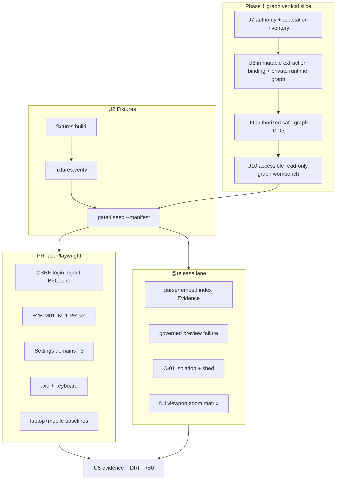
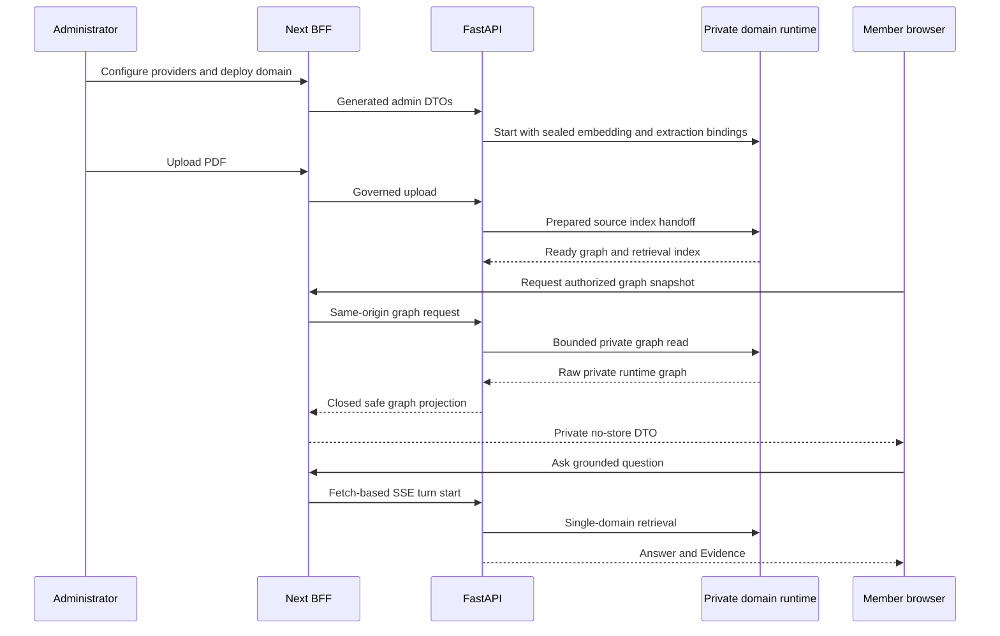

# feat: P12-07 Phase 1 Graph, Browser E2E, Accessibility and Capacity

## Goal Capsule

- **Objective:** Close P12-07 by enabling the read-only `/database-visualize` Knowledge Domain graph through a safe product-owned API/DTO and then proving the complete seeded demo, browser, multi-user cache/BFCache, accessibility, visual-matrix, CSRF product-path, M-11 open-panel, governed-preview navigation, capacity/isolation, and real Reducto→embedding→LightRAG graph/retrieval→Evidence behavior through the production Next build, same-origin BFF, FastAPI, workers, PostgreSQL 16, governed object storage, and private per-domain runtimes.
- **Authority:** The user-directed Phase 1 graph decision recorded by KTD9; the coordinated authority amendments in U7; `docs/frontend/browser-e2e-scenarios.md`; `docs/frontend/visual-regression-plan.md`; `docs/frontend/accessibility-contract.md`; `docs/quality/seeded-demo-and-test-data.md`; `docs/quality/definition-of-done.md`; DRIFT-04/07/09/19/29; `docs/master-build-plan.md` P12-07.
- **Execution profile:** Contract amendment first; private runtime graph extraction and safe projection second; frontend parity/behavior third; fixtures and PR-fast Playwright on deterministic adapters + real stack fourth; `@release` live Reducto/provider/LightRAG + graph + capacity + full visual matrix last.
- **Readiness checkpoint:** Implementation-ready only as a plan; implementation must begin with U7 because the current PRD, HTTP/DTO catalogs, governance, and route contracts still prohibit an enabled graph.
- **Stop conditions:** Stop if the browser would receive raw LightRAG IDs/properties, source/block IDs, runtime URLs, provider payloads, or direct runtime access; if graph nodes cannot be produced by a real supported extraction model; if authorization cannot be re-derived per domain request; if mocked/intercepted product DTOs are used for acceptance; if Phase 2 quality dashboards or graph mutation/editing APIs are invented; or if local/synthetic adapters are treated as production proof.
- **Tail ownership:** P12-08 aggregates go/no-go; P12-05 remains owner of live TLS ingress digests; P12-06 remains owner of live Syft/cosign digests.

---

## Product Contract

### Summary

Approve and implement a bounded read-only Phase 1 graph projection, materialize deterministic fixtures, and prove the graph plus contracted browser/multi-user/capacity behavior through the real stack, supported parser/embedding/extraction profiles, governed preview renderer, and private LightRAG runtime — at honest dual altitude (PR-fast vs `@release`).

Product Contract preservation: changed by explicit user direction — R1–R9 and AE1–AE8 are preserved; R10–R16 and AE9–AE15 add the enabled Phase 1 graph and one-command demo stack, replace the former graph-unavailable acceptance, and require stale release evidence to be refreshed.

### Problem Frame

P9 closed component/Vitest altitude and deliberately left `/database-visualize` unavailable because no safe graph contract existed. The product decision now requires that route in Phase 1. The legacy client proves Sigma/Graphology interaction patterns are viable, but it directly consumes broad LightRAG shapes, runtime-selected ports, raw identifiers/properties, and browser-side mutation state that violate the current security and privacy boundary. The current private runtime shim also uses a constant extraction stub, so a visually wired route alone would not demonstrate a meaningful provider-produced graph. P12-07 must therefore amend the product contracts, make graph extraction a sealed per-domain runtime capability, expose only a bounded authorized projection, adapt the useful read-only visualization patterns, and then include that flow in release E2E.

### Actors

| Actor | Role |
| --- | --- |
| Mina / Noah / Ava / Ren / Dia fixtures | Multi-user browser and isolation actors (`docs/quality/seeded-demo-and-test-data.md`) |
| Coding agent | Fixtures, Playwright, capacity harness, CI wiring, evidence |
| CI / release operator | PR Playwright job vs gated `@release` live lane |

### Key Flows

**F1 — Fixtures.** Build/verify deterministic documents, previews, expected answers, SSE frames, and gated idempotent seed.

**F2 — Playwright PR-fast matrix.** Login/CSRF/logout BFCache; chat/documents/settings/enabled graph; two-user cache; M-11 open-panel; a11y; laptop+mobile visual baselines — production Next + BFF + API, deterministic adapters, real PG/object store.

**F3 — Real document + preview pipeline (`@release`).** Upload supported source → real parser/provider profile → index ready → expected mapped Evidence → governed preview/evidence focus; renderer/provider/runtime failure → safe contracted UI. For rich multi-modal Evidence (text/table/figure) and grounded synthesis on `@release`, use fixture `doc_vehicle_suspension` (`app/tests/fixtures/documents/Vehicle_Suspension_System_Technology_And_Design_TEST.pdf`) per `docs/quality/seeded-demo-and-test-data.md` and `docs/plans/2026-07-29-002-feat-vehicle-suspension-corpus-fixture-plan.md`; keep `doc_pump_manual` / deterministic adapters as PR-fast authority.

**F4 — Capacity/failure (`@release`).** Concurrent members on one domain; isolation of transcript/evidence/request IDs; load shed `429`/`503` before collapse.

**F5 — Phase 1 graph.** Admin configures an extraction-capable synthesis profile, creates/starts a domain with immutable embedding and graph-extraction bindings, uploads a PDF, Reducto prepares it, the private runtime extracts/indexes a graph, and an authorized member opens a bounded searchable/selectable graph without any direct LightRAG or private-identifier exposure.

### Requirements

**Release browser and fixture proof**

- R1. Inventory `docs/_scratch/p12-07-browser-e2e-capacity-inventory.md` mapping every `E2E-M*`, `E2E-A*`, `E2E-C*` to altitude (PR-fast / `@release` / credited service residual), fixture keys, and DRIFT rows.
- R2. Materialize `docs/quality/seeded-demo-and-test-data.md` artifacts (manifest, documents, previews, expected outputs, seed command, `fixtures:build` / `fixtures:verify`).
- R3. Playwright through production Next + BFF + FastAPI + worker + PG16 + governed object store; no mocked product responses for acceptance.
- R4. CSRF product path; two-user cache/BFCache; M-11 open-panel/cache half (DRIFT-19/29 browser).
- R5. Accessibility (axe + keyboard critical paths) + visual matrix baselines at approved thresholds with catalog `targetId` linkage (DRIFT-07).
- R6. Real parser→embedding→LightRAG→mapped Evidence capacity/isolation plus parser/provider/runtime failure evidence on `@release` (consumes P5-04/P10-05).
- R7. Expected-answer browser acceptance for the seeded figure question only — not a RAG-triad product metric API.
- R8. Evidence + tracker; close DRIFT-07/09/19/29 browser halves / advance B0 only where proven; name residuals honestly.
- R9. Governed generated-preview navigation, range/cache behavior, region focus/fallback, and renderer failure evidence for supported non-PDF sources (consumes P10-06).

**Phase 1 graph contract and implementation**

- R10. Coordinately amend governance, PRD, interaction cases, HTTP/DTO catalogs, route/state/accessibility/visual contracts, seeded fixtures, phase manifest, and brownfield disposition before replacing the unavailable route.
- R11. Bind each new Knowledge Domain to one immutable, catalog-declared graph-extraction-capable synthesis model profile for LightRAG entity/relation extraction in addition to its immutable embedding profile; profiles bound in either role cannot be mutated/deleted; support a one-time audited assignment only for pre-existing stopped domains whose durable `indexingEverStarted` latch is false, migrate ambiguous legacy histories as ineligible, and reject reassignment once indexing has begun.
- R12. Extend the private LightRAG port/shim with generation-fenced bounded graph extraction/snapshot operations and seal provider/model/credential inputs inside the domain runtime; a snapshot is eligible only when its applied corpus generation matches PostgreSQL’s current desired generation, and the private shim/runtime/provider configuration never crosses the browser boundary.
- R13. Expose authenticated, domain-authorized, `private, no-store` `GET /api/v1/domains/{domainId}/graph` and `GET /api/v1/domains/{domainId}/graph/labels` endpoints with closed camelCase DTOs: the snapshot accepts an optional bounded `label` focus while depth/node/edge/byte/time limits remain server-owned; label search accepts bounded `q`/`limit`; both return only opaque purpose-derived refs and allowlisted fields and reject raw properties, source/chunk IDs, paths, URLs, prompts, and provider payloads.
- R14. Replace `graph-unavailable` with a compact workstation graph containing domain selection, bounded refresh, canvas pan/zoom/select, searchable equivalent node list/detail, empty/loading/stale/failure/truncated states, responsive drawer behavior, keyboard/touch parity, and safe URL state using only `domain` and `node` opaque refs.

**Release evidence convergence**

- R15. Re-run and refresh every prior release artifact invalidated by graph code/schema/image changes: full suite/contract convergence (P12-02), graph-specific adversarial security (P12-03), migration/backup/restore/runtime rebuild (P12-04), deployed TLS request behavior where applicable (P12-05), and immutable image/SBOM/provenance manifests (P12-06).
- R16. Make `scripts/dev.sh` the supported lean local-demo entrypoint: preflight Docker/Compose and required non-provider configuration, start the base + MinIO + live-runtime stack, wait for migration/bootstrap/readiness, and print a concise service/purpose/status summary, application/admin-login location, and log/stop commands without printing passwords, credentials, private ports, or runtime URLs.

### Acceptance Examples

- AE1. `fixtures:verify` passes hashes/counts; seed is idempotent under the gate; blank/`TBD` hash fails.
- AE2. Playwright login→chat→evidence→documents region path green for Mina (page 18 + region for figure).
- AE3. Noah cannot read Mina conversation contents or cached personalized JSON/SSE/PDF/Evidence bytes (including after logout/Back).
- AE4. PR visual matrix (laptop+mobile, dark/light) + axe/keyboard checks pass; baselines compare at ≤0.5%.
- AE5. `@release` records configured stream, graph-read, provider, database, and worker budgets; at each tested in-flight limit requests remain isolated and complete within the configured deadline, while limit+1 is shed before provider/runtime invocation as `429` + `Retry-After` or `503 capacity_unavailable`; graph admission queues zero waiting calls and all abort/timeout permits recover.
- AE6. `/settings?section=domains` production-boundary Playwright proof (P9-04 Settings F3 residual — not Key Flow F3) green with server-produced DTOs (no intercept).
- AE7. M-11: while answer + Evidence/PDF open, admin deletes cited source → turn redacts (question kept), viewer closes safely, cache does not re-serve protected bytes.
- AE8. The deterministic PR fixture yields exact answer `The relief valve is downstream of the pump [1].`; the live `@release` pipeline must preserve the normalized downstream-of-pump fact, citation `[1]`, and mapped Evidence ref without requiring provider prose or punctuation to be byte-identical.
- AE9. Ava selects an extraction-capable synthesis profile and embedding profile, creates/starts Equipment Manuals, uploads a PDF with Reducto, and the completed index yields a non-empty domain graph and query-eligible retrieval state. PR-fast / deterministic graph baselines may keep `doc_pump_manual`; the rich `@release` upload→parse→Evidence (text/table/figure)→synthesis path uses `doc_vehicle_suspension`.
- AE10. Mina opens `/database-visualize?domain=<opaque-domain-ref>`, receives only safe graph DTO fields through the BFF, searches/selects the relief-valve node from the accessible list, and the canvas and `node` URL state follow the same selection.
- AE11. Unknown/unauthorized domains return the same `404` shape; stopped/unready domains and runtime failures render contracted safe states with request IDs; no raw runtime, provider, source-block, or graph-storage identifiers appear in URL/DOM/network/log artifacts.
- AE12. Deleting the indexed source removes its derived graph contribution after fenced runtime cleanup/reconciliation; refresh cannot continue showing deleted nodes from browser cache.
- AE13. The graph remains usable without the canvas through the searchable list/detail at keyboard-only, touch/coarse pointer, 320 CSS px, 200%/400% zoom, forced colors, reduced motion, and both themes.
- AE14. P12-08 consumes graph-aware, revision-matching P12-02..P12-07 evidence and current image/schema/contract digests; any stale pre-graph artifact forces no-go.
- AE15. From a clean supported WSL/Linux host, `bash scripts/dev.sh` reaches a ready stack and explains the public frontend/BFF, private FastAPI/worker/PostgreSQL/MinIO roles, one-shot migrate/bootstrap jobs, and on-demand private per-domain LightRAG containers; the bootstrapped admin can then complete AE9–AE10 through the UI.

### Scope Boundaries

#### In scope

- Fixture world materialization and gates
- Playwright PR job + `@release` lane wiring
- CSRF / two-user / BFCache / M-11 browser proofs
- Phase 1 graph contract, extraction binding, private runtime operation, safe API projection, and read-only frontend
- Settings domains F3 and graph browser acceptance
- A11y + visual baseline comparison, including NVDA+Chrome and VoiceOver+Safari graph-workbench smoke
- Governed preview browser navigation / failure
- Capacity/isolation and runtime/provider/parser failure at contracted UI
- Minimum operational-safety evidence at browser boundary (request ID, privacy of console/network)
- Inventory + evidence + DRIFT/B0 honesty

#### Deferred to Follow-Up Work

- Full admin race matrix A-06..A-08/A-11 as Playwright-first (credit service/PG altitude; browser only where UI exposes reconcile)
- PPT / LibreOffice productization
- FE-01 mega-kit demolition
- Metric RAG triad evaluation product
- Graph entity/relation create, edit, rename, merge, delete, or browser-side persistence of graph mutations

#### Outside this product's identity

- Phase 2 observability screens, read APIs, dashboards, live log streams, exports, retention controls, analytics

---

## Planning Contract

### Key Technical Decisions

| ID | Decision | Rationale |
| --- | --- | --- |
| KTD1 | Fixtures before E2E/visual acceptance | `seeded-demo-and-test-data.md`; visual plan forbids intercept-all mocks for release baselines |
| KTD2 | Production Next build + real BFF/API only for acceptance | DoD; frontend AGENTS; mocked DTOs do not satisfy Settings F3 |
| KTD3 | Dual altitude: PR-fast deterministic fakes + real stack; `@release` live parser/provider/LightRAG + capacity + full visual | `browser-e2e-scenarios.md` suite layers; keep default `verify.sh` network-free |
| KTD4 | Expected answers ≠ observability product | R7 / Phase 1 identity |
| KTD5 | Separate `BrowserContext` per actor; sync on responses/SSE/op/DB hooks — never fixed sleeps | E2E harness rules; DoD race rules |
| KTD6 | Inventory must classify every E2E-* row as PR-fast, `@release`, or credited residual — no silent subset | Flow analysis; thin plan under-covered the catalog |
| KTD7 | Consume P5-04 / P10-05 / P10-06 / P10-02 smoke scripts; do not re-prove packaging altitude | Prerequisites DONE; P12-07 owns browser/capacity consume path |
| KTD8 | CSRF residual is proof-first: exercise product path; invent client fixes only if live path fails | Client already attaches CSRF; residual may be harness/origin (`127.0.0.1`) or bootstrap edge |
| KTD9 | Enable `/database-visualize` in Phase 1 as a read-only product capability (session-settled: user-directed — chosen over the deliberate unavailable route: the end-to-end demonstration must show the indexed domain knowledge graph) | User decision; U7 changes the higher-precedence contracts before implementation |
| KTD10 | Adapt the legacy Sigma/Graphology viewer interaction model, but reject its direct LightRAG calls, runtime-port selection, raw property bags, handwritten DTOs, graph mutations, and broad Zustand/settings surface | Keeps useful pan/zoom/layout/select behavior without inheriting the legacy trust model |
| KTD11 | A domain owns immutable embedding and graph-extraction model bindings; graph extraction reuses a synthesis profile kind but is sealed separately from chat synthesis defaults | Reproducible rebuilds and consistent entity extraction must not change when the global chat default changes |
| KTD12 | Public graph refs are purpose-derived opaque HMAC values over domain-scoped private runtime identities using a dedicated persisted `CE_GRAPH_REF_KEY`; refs grant no access and are meaningful only after a fresh authorized snapshot. Local demo first-run generates a 32-byte base64url key atomically into the gitignored mode-0600 environment file and never overwrites it; deployed environments inject and back up the key as a secret; planned rotation intentionally invalidates old `node` selections and requires no compatibility oracle. | Stable restart/restore-safe URL/client keys without persisting or exposing raw LightRAG IDs; explicit lifecycle avoids silent ref churn or unsafe previous-key lookup |
| KTD13 | Phase 1 graph is bounded and read-only; server-side label search discovers nodes beyond a truncated snapshot, while coordinates, layouts, local filtering of the current snapshot, hover, focus, and pruning-for-view are presentation state only | Avoids false “not found” results without adding graph analytics or an authoring lifecycle |

### Assumptions

- P5-04, P9-07, P10-04, P10-05, P10-06, P12-02, P12-03 remain DONE at cited altitudes; operator live digests (production-supported labels, P12-05 TLS, P12-06 Syft) stay residual and do not block PR-fast Playwright.
- P9-06 gallery `targetId`s remain the visual linkage authority for route baselines.
- P11-04 Evidence attach stays deferred — M-09 browser proof covers source/template chips only.
- Pilot specs under `app/client/tests/e2e/` may be migrated or superseded; they are not acceptance credit until rewritten against fixture actors and baseline compare.
- Existing domains created before the graph-profile migration are upgraded only through the U8 one-time assignment rule; no active/indexed domain is silently rebound.
- The first graph contract is one bounded snapshot plus one bounded label-search endpoint. Search results are safe node labels/refs only; mutation, graph analytics, and node-to-source deep links require separate approval.

### High-Level Technical Design

The following sequence is directional: contracts and adapters own the exact request names and payloads.

**Altitude matrix (authoritative for inventory)**

| Lane | Stack | Providers | Required proofs |
| --- | --- | --- | --- |
| PR-fast | Compose production Next + BFF + API + worker + PG16 + MinIO (or governed test store) | Deterministic parser/embedding/extraction adapters + private fixture runtime | Safe graph API/UI, CSRF, BFCache, two-user, M-11, Settings F3, M-01..M11 plus new graph cases, C-02..C05 plus graph isolation, axe, laptop+mobile visual |
| `@release` | Same + `compose.stack.live.yml` (+ preview/provider gates as needed) | Live Reducto, supported embedding/extraction providers, and private LightRAG | Admin configure→domain→upload→parse→graph/index→chat→Evidence→PDF demo; graph deletion/rebuild; capacity AE5; runtime/provider/renderer failure; full visual matrix |

### Risks and Dependencies

| Risk | Mitigation |
| --- | --- |
| Flaky E2E from sleeps / shared state | Barriers; freeze clock/fonts/reduced-motion; quarantine needs owner/expiry and blocks acceptance |
| Wrong Compose altitude (local stubs as “real pipeline”) | Inventory tags; `@release` requires live overlay + cited P5-04/P10-05 revisions |
| Fixture world gap blocks M-04/visual | U2 hard gate before U3/U6 |
| P12-05 TLS digests still open | Do not claim deployed-ingress SSE DONE from Compose Playwright; PDF-range browser proof can use stack origin |
| Overclaiming B0 | U5 closes only proven DRIFT browser halves; name remaining residuals |
| gitignore path drift for `app/client/tests/e2e/artifacts/` | Fix ignore paths when wiring CI |
| Origin mismatch `localhost` vs `127.0.0.1` | Follow e2e README public-origin rule |
| Constant extraction stub produces a fake/useless graph | U8 requires a real sealed extraction-capable synthesis adapter and a release proof with expected entities/relations |
| Raw LightRAG property bags leak chunk/source IDs or provider text | U9 deny-by-default mapper and privacy fixtures; expose only closed node/edge fields |
| Large graphs or concurrent refreshes exhaust browser/runtime resources | Fixed server depth/node/edge/output-byte/time bounds, truncation metadata, abort propagation, client virtualization, and explicit global/per-domain graph-read admission with no unbounded queue |
| Late schema/profile binding affects existing domains | Expand/migrate/contract proof, one-time stopped/unindexed assignment, audit, backup/restore and rollback notes |

### Alternative Approaches Considered

| Approach | Why rejected |
| --- | --- |
| Expand Vitest/RTL + HTML gallery as P12-07 acceptance | Explicitly forbidden; production-boundary Playwright required |
| Single live-only Playwright suite on every PR | Violates network-free default gate; flaky provider dependency |
| Keep pilot ad-hoc seed as fixture authority | Violates seeded-demo contract and Mina/Noah actor constants |
| Port the legacy graph API/client wholesale | It exposes raw IDs/property bags and runtime topology, permits graph mutations, and bypasses generated contracts |
| Keep graph unavailable until a later phase | Rejected by KTD9; graph acceptance is now a Phase 1 release requirement |
| Browser calls private LightRAG `/graphs` directly | Violates the BFF/FastAPI trust boundary and domain authorization |

---

## Implementation Units

### U7. Approve the Phase 1 graph contract and legacy adaptation boundary

**Goal:** Replace the graph prohibition coherently across the authority stack and record exactly which legacy patterns may be adapted before product code changes.

**Requirements:** R10, KTD9, KTD10

**Dependencies:** None

**Files:**
- Modify: `AGENTS.md`
- Modify: `docs/prd.md`
- Modify: `docs/interaction-behavior-prd.md`
- Modify: `docs/phase-scope-manifest.md`
- Modify: `docs/contracts/http-api-catalog.md`
- Modify: `docs/contracts/dto-schema-catalog.md`
- Modify: `docs/architecture/components.md`
- Modify: `docs/architecture/data-and-lifecycle.md`
- Modify: `docs/architecture/as-built-gaps-and-decisions.md`
- Modify: `docs/frontend/AGENTS.md`
- Modify: `docs/frontend/route-and-workspace-spec.md`
- Modify: `docs/frontend/navigation-and-url-state.md`
- Modify: `docs/frontend/frontend-state-ownership.md`
- Modify: `docs/frontend/accessibility-contract.md`
- Modify: `docs/frontend/content-and-microcopy.md`
- Modify: `docs/frontend/ui-parity-spec.md`
- Modify: `docs/frontend/visual-regression-plan.md`
- Modify: `docs/frontend/browser-e2e-scenarios.md`
- Modify: `docs/quality/seeded-demo-and-test-data.md`
- Modify: `docs/brownfield-refactor-register.md`
- Create: `docs/_scratch/p12-07-phase1-graph-adaptation-inventory.md`

**Approach:** Add graph-specific interaction cases without reusing the tombstoned M-12/M-13 IDs. Approve one read-only bounded snapshot endpoint, one bounded label-search endpoint, and exact closed DTO vocabulary; domain authorization and lifecycle/error semantics; immutable extraction-profile binding; safe URL state; accessibility-equivalent list/detail; cache/privacy policy; deletion/rebuild behavior; and release acceptance. Freeze `GraphDomainDto { ref, name }`; `GraphNodeDto { ref, label, kind: SafeLabel|null, degree }`; `GraphEdgeDto { ref, sourceRef, targetRef, label: SafeLabel|null }`; `GraphLabelDto { nodeRef, label, kind: SafeLabel|null }`; `GraphLabelSearchDto { items }`; and `GraphSnapshotDto { domain: GraphDomainDto, nodes, edges, truncated }`. Degree is a non-negative integer; refs use the approved opaque-ref schema; safe labels use one shared bounded sanitizer. Freeze oversized behavior: private adapter rejects payloads above 2 MiB as `dependency_unavailable`; mapper retains at most 500 ordered nodes and 2,000 valid in-snapshot edges and sets `truncated:true`; fixed runtime traversal depth is 3 and callers cannot raise it. Inventory each legacy graph file as reuse/adapt/reject. Adapt Sigma/Graphology pan/zoom/layout/select and bounded label-search/layout concepts; reject direct `/graphs` access, browser-selected ports/runtimes, raw property bags, handwritten API types, entity/relation mutation, and broad settings persistence. Update root/frontend governance in this same contract slice so implementation instructions no longer contradict the approved PRD/catalogs.

**Test scenarios:**
- Contract: generated catalog tests fail until the graph endpoint and every graph DTO/error are registered exactly once.
- Contract: schema examples containing raw `id`, `properties`, `source_id`, chunk IDs, runtime URLs, provider fields, or coordinates fail closed.
- Governance: phase-scope checks require the enabled graph route and continue rejecting direct browser/runtime access and graph mutation APIs.
- Traceability: each new graph interaction case maps to U8–U10 and an E2E scenario; M-12/M-13 tombstones remain untouched.

**Verification:** Documentation/phase-scope/generated-contract checks pass with no surviving “graph unavailable/no request” normative statement and no accidental authorization of graph editing.

---

### U8. Add immutable graph extraction binding and private runtime graph operations

**Goal:** Make indexed domains produce a meaningful provider-backed LightRAG entity/relation graph reproducibly, without exposing runtime/provider details.

**Requirements:** R11, R12, AE9, AE12, KTD11

**Dependencies:** U7; consumes P2, P3, P4, P5-04, P10-05

**Files:**
- Create: an Alembic migration under `app/migrations/versions/` for the domain graph-extraction profile binding, durable `indexingEverStarted` latch, and supported-upgrade state
- Modify: `app/context_engine/models.py`
- Modify: domain/runtime public schemas and services under `app/context_engine/api/` and `app/context_engine/services/domains.py`
- Modify: `app/context_engine/services/indexing.py`
- Modify: runtime-configuration profile CRUD/capability projection and tests under `app/context_engine/services/` and `app/context_engine/api/`
- Modify: `app/context_engine/adapters/lightrag_http_client.py`
- Modify: `app/context_engine/tools/domain_runtime_controller.py`
- Modify: `app/context_engine/tools/ce_lightrag_shim.py`
- Modify/create: focused PostgreSQL, migration, controller, shim, indexing, deletion, and real-runtime tests under `app/tests/`
- Modify: `docs/operations/provider-deployment-profiles.md`

**Approach:** Reuse synthesis model profiles for graph extraction but bind one profile immutably to each new domain alongside its embedding profile. Define extraction support as closed model-catalog capability metadata, project it through generated admin DTOs, and revalidate it during assignment, domain create/start, and index submission; provider configuration or synthesis kind alone is insufficient. Extend profile CRUD so any synthesis profile referenced by a domain extraction binding reports `inUse` and returns `model_profile_in_use` on patch/delete. Set a durable domain `indexingEverStarted` latch atomically before the first external index submission and never clear it on cancellation, source deletion, or runtime rebuild; backfill any legacy domain whose history cannot prove “never started” as ineligible for assignment. Add a domain-private monotonic graph corpus generation: every accepted index or retrieval-fencing delete advances PostgreSQL’s desired generation before external work; the private runtime records the generation only after the corresponding graph mutation completes; snapshots return the applied generation privately so FastAPI can reject stale data. Seal model/provider credentials into the private per-domain runtime and replace the constant extraction stub for production graph indexing with the supported provider adapter; deterministic extraction remains test-only. Extend the internal runtime protocol with bounded graph snapshot and label-search retrieval, not the vendor’s mutation surface. Prove expand/migrate/contract upgrade, rollback/restore notes, credential rotation/restart behavior, source deletion graph cleanup, generation fencing, and runtime rebuild.

**Execution note:** Start with failing migration/domain immutability and private-shim contract tests; do not wire the frontend against a stub graph.

**Test scenarios:**
- Happy: a new domain stores immutable embedding and extraction profile refs; start seals both providers and the runtime reports ready without exposing secrets.
- Immutability: a synthesis profile bound for graph extraction reports `inUse` and rejects patch/delete just like a domain-bound embedding profile; deleting the domain releases the reference only after fenced cleanup.
- Capability: unsupported catalog/provider combinations are absent from the extraction selector and are rejected authoritatively at assignment, create, start, and index submission.
- Happy: deterministic index input produces expected pump/relief-valve nodes and a relationship through the private graph operation.
- Integration: live gated extraction uses the configured supported synthesis provider and vendored LightRAG; no constant-stub entity graph receives release credit.
- Edge: a pre-existing stopped/unindexed domain with `indexingEverStarted=false` accepts one audited extraction assignment; cancelled and delete-all histories keep the latch true and reject assignment; ambiguous migrated histories are ineligible.
- Error: missing, disabled, wrong-kind, or unconfigured extraction profile blocks create/start/index with a safe code before external work.
- Error: runtime timeout/malformed graph payload becomes a typed retryable dependency failure; raw exception/provider payload is not logged.
- Deletion: source delete fences retrieval, removes its runtime graph contribution idempotently, and stale generation completion cannot restore it.
- Race: a graph snapshot started before an index/delete generation change is discarded after the post-call generation check and never reaches the public mapper.
- Recovery: backup/restore and empty-runtime rebuild recreate equivalent safe graph semantics from authoritative sources/profile bindings.

**Verification:** PostgreSQL migration/service races, private shim tests, real-runtime gated graph proof, deletion/rebuild proof, and privacy scans pass.

---

### U9. Add the authorized safe graph API and generated client contract

**Goal:** Project a bounded domain graph through FastAPI/BFF without leaking LightRAG or storage internals.

**Requirements:** R13, AE10, AE11, AE12, KTD12, KTD13

**Dependencies:** U7, U8

**Files:**
- Modify: `app/context_engine/api/public_schemas.py`
- Modify: `app/context_engine/api/catalog_schemas.py`
- Modify: `app/context_engine/api/routes.py`
- Modify: `app/context_engine/config.py`
- Modify: application/runtime admission-control composition for bounded global and per-domain graph-read permits
- Create: `app/context_engine/services/graphs.py`
- Modify: generated OpenAPI/JSON Schema/TypeScript artifacts under `app/contracts/` and `app/client/src/lib/api/generated/`
- Create/modify: API, service, adapter, authorization, cache, bounds, and privacy tests under `app/tests/`
- Modify/test: the existing same-origin catch-all BFF under `app/client/src/app/api/v1/[...path]/route.ts`; do not add a graph-specific proxy unless U7 identifies transport behavior the generic allowlisted proxy cannot provide
- Modify: `app/.env.stack.example`, Compose service secret allowlists, deployment docs, and immutable artifact configuration manifests for `CE_GRAPH_REF_KEY`

**Approach:** Implement `GET /api/v1/domains/{domainId}/graph` with optional `label` focus and fixed server-owned depth 3, maximum 500 nodes, 2,000 edges, 2 MiB upstream bytes, and 10-second deadline; implement `GET /api/v1/domains/{domainId}/graph/labels?q&limit` with trimmed 2–160-character `q`, `limit` 1–50, and the same deadline/authorization/generation rules. Admit graph calls through configured per-domain and global in-flight permit budgets with a zero-length wait queue: an exhausted per-principal budget returns `429` plus `Retry-After`, while global/runtime saturation returns `503 capacity_unavailable`, both before a private runtime call. Use exactly the closed U7 DTOs: `GraphSnapshotDto`, `GraphDomainDto`, `GraphNodeDto`, `GraphEdgeDto`, `GraphLabelSearchDto`, and `GraphLabelDto`; do not expose vendor weights or echo the search query. Apply the repository’s canonical safe-label sanitizer and Unicode/control-character policy to every vendor-derived label before DTO validation; reject overlength/invalid labels rather than clipping into a misleading entity. Re-derive current identity, domain authorization, running/runtime-ready state, desired graph corpus generation, and source-deletion fences before the private external call; perform the call outside a database transaction; then re-read authorization/lifecycle/generation before projection and discard any stale result. If any accepted source deletion has advanced desired generation beyond applied generation, suppress the entire snapshot/search result and return the U7-contracted retryable `409 graph_refreshing` state until reconciliation catches up; never attempt unsafe per-node provenance filtering. Create stable opaque refs with a purpose-separated keyed digest using the dedicated persisted `CE_GRAPH_REF_KEY`, domain private identity, target kind, and private runtime identity; fail startup/readiness closed when the key is absent outside test-only composition. Do not make refs bearer grants or expose a reverse-lookup endpoint. Drop malformed/dangling edges and every unapproved property. Return `private, no-store`, request-correlated safe errors, abort propagation, and indistinguishable `404` for unknown/unauthorized domains.

**Execution note:** Write closed-schema and adversarial projection tests before accepting any vendor payload fixture.

**Test scenarios:**
- Happy: authorized Mina receives the exact closed camelCase graph snapshot for a running eligible domain.
- Authorization: unknown and unauthorized domain refs have identical `404` envelopes; disabled/role-changed users fail on the next request.
- Lifecycle: stopped, unready, deleting, and runtime-unavailable domains return their approved safe conflict/dependency states.
- Bounds: invalid label-search `q`/`limit` fails `422`; snapshot callers cannot override traversal/resource limits; >2 MiB upstream payload fails safely; excess nodes/edges are deterministically trimmed with `truncated:true`.
- Projection: raw vendor IDs, arbitrary properties, descriptions containing source IDs, chunk IDs, paths, URLs, credentials, and dangling edges never enter the DTO.
- Sanitization: bidirectional/zero-width/control characters, invalid Unicode, markup-like labels, and overlength vendor strings are rejected by the canonical safe-label policy before rendering/logging.
- Stability: the same domain/runtime node produces the same opaque ref across refresh/restart; a different domain cannot produce a reusable authorization handle.
- Rotation: changing `CE_GRAPH_REF_KEY` invalidates old `node` URL selection safely while a fresh authorized graph still loads; no compatibility key ring or old-ref oracle is added.
- Cache: JSON and errors are `private, no-store`; BFF strips caller forwarding/upstream headers and propagates abort.
- Deletion race: a source deletion fence established before projection prevents stale graph data from being returned.
- Admission: saturation at either configured permit boundary sheds before runtime invocation, leaves no queued graph calls, releases permits on abort/timeout, and does not starve chat retrieval.

**Verification:** HTTP/DTO/OpenAPI/generated-client snapshots, PostgreSQL authorization races, BFF structure tests, bounds/fuzz tests, and forbidden-data scans pass.

---

### U10. Replace the unavailable route with the accessible graph workbench

**Goal:** Deliver the compact read-only `/database-visualize` experience using the generated graph contract and canonical UI layering.

**Requirements:** R14, AE10, AE11, AE13, KTD9, KTD10, KTD13

**Dependencies:** U7, U9

**Files:**
- Modify: `app/client/package.json` and `app/client/package-lock.json` for reviewed Sigma/Graphology dependencies
- Replace: `app/client/src/features/graph/GraphPage.tsx`
- Create: focused graph modules under `app/client/src/features/graph/`
- Modify/create: graph route/query client composition using generated types under `app/client/src/lib/`
- Modify: `app/client/src/features/settings-panel/SettingsPanel.tsx`
- Modify: `app/client/src/features/settings-panel/domainSettingsHelpers.ts`
- Modify: `app/client/src/features/settings-panel/DomainAccordionRow.tsx` as needed for the locked extraction-profile fact
- Modify: `app/client/src/features/domains/api.ts`
- Modify/create: Settings domain parity/behavior tests for extraction-profile selection and one-time legacy assignment
- Replace/extend: `app/client/tests/parity/manifests/graph-unavailable.json`, `app/client/tests/parity/fixtures/graph-unavailable.html`, and `app/client/tests/parity/react/graph-unavailable.test.tsx` with enabled graph target(s)
- Modify: `app/client/tests/structure/parity-catalog.test.ts`
- Create/modify: graph state/component/accessibility tests under `app/client/tests/`

**Approach:** Keep route/layout entry points thin; orchestration and presentation state stay in `src/features/graph`, generated contracts/client helpers in `src/lib`, and product-neutral primitives in `src/ui`. Extend the existing Settings domain deployment form to require both an embedding profile and an extraction-capable synthesis profile, show both as locked domain facts, and expose the one-time legacy assignment only when the server advertises that action. Adapt only the legacy renderer/event/layout concepts. Start with the minimum reviewed `sigma`, `graphology`, and `@react-sigma/core` footprint; do not copy the legacy six-layout-package set, unused `@react-sigma/graph-search`, or `minisearch`. Record production-client bundle delta and regenerate the P12-06 lock/SBOM/provenance artifacts before adding any optional layout package.

The desktop workbench uses the authenticated shell’s discovery rail plus one route-owned surface split into a 280 px node browser and a flexible graph canvas; node detail is a turn-style right inspector capped at 360 px and replaces the browser column when space is constrained. Below the contracted breakpoint the node browser and detail become separate labelled modal drawers with focus trap/return; the canvas remains in the route surface and no region pushes the viewport at 320 CSS px or 400% zoom. Initial entry chooses the URL-authorized domain when present, otherwise the first query-eligible authorized domain; it never guesses across unauthorized/stopped domains. Empty authorized-domain state links members to Documents/Chat and administrators to Settings. Selecting another domain aborts in-flight search/snapshot calls, clears node selection, canonicalizes the URL, moves focus to the graph heading, and announces the new result count once.

The graph route fetches the safe snapshot through the BFF and renders a Sigma canvas plus the equivalent virtualized node list/detail. Local filtering responds immediately for nodes already in the snapshot; after 250 ms, a trimmed 2+ character query calls bounded label search so truncation never means “not in this domain.” Search pending retains current results with a progress status; no-match copy explicitly says no matching node was found in the authorized domain; selecting a remote result reloads a focused snapshot by its returned safe label and then synchronizes its node ref. List selection, canvas selection, and URL state converge through one reducer; Escape closes detail/drawers and returns focus to the invoking row or graph control; browser Back/Forward restores domain and best-effort node selection without retaining graph bytes. Coordinates, zoom, layout, hover, and view-pruning never leave tab memory.

Loading uses bounded skeleton rows plus a named canvas status; refresh keeps the last authorized graph visibly dimmed and non-interactive with `aria-busy`; truncated state explains that only a bounded neighborhood is shown while search still covers authorized labels; `graph_refreshing` clears stale graph data and announces reconciliation; stopped/unready, deleted, unauthorized, runtime failure, and identity change clear every prior graph projection before rendering safe recovery actions. Safe runtime failures show request ID and Retry; stopped/unready offers Change domain and, for authorized administrators only, Settings. An adjacent concise accessible summary describes the canvas; the canvas itself is `aria-hidden` from structural navigation, and list/detail own all node/relation semantics and connected-relation actions. Live regions announce domain load, result count, truncation, selection, refresh completion, and errors once per reducer transition, never pointer movement or layout ticks.

**Execution note:** Establish the script-free HTML target and failing RTL semantics first; visual parity does not authorize API behavior.

**Test scenarios:**
- Happy: domain selection loads a graph; bounded server search finds Relief valve even when absent from a truncated initial snapshot; the focused snapshot, list, detail, canvas, and `node` URL state agree.
- Admin: Deploy remains disabled until valid embedding and extraction profiles are selected; successful create/start sends both generated-contract fields and renders both locked facts.
- Upgrade: an eligible pre-existing stopped/unindexed domain shows one-time extraction assignment; server-denied/stale actions refresh current truth without optimistic rebinding.
- Keyboard: domain picker, search, result list, node detail, reset, zoom, and layout controls work without canvas pointer interaction; focus returns correctly from drawers.
- Touch: pan/zoom/select do not require hover; controls meet coarse-pointer targets.
- Accessibility: an accessible summary describes the hidden canvas representation; list/detail exposes every node kind, degree, and connected relation as the operable semantic equivalent.
- Assistive technology: NVDA+Chrome and VoiceOver+Safari smoke passes cover domain switch, server search/no-match, list selection/detail relations, drawer focus trap/return, truncation, refresh, and safe error recovery without duplicate announcements.
- Responsive: 320 CSS px and 200%/400% zoom produce no viewport push; list/detail drawer remains operable.
- State races: slow domain A response cannot overwrite domain B; logout/identity change clears graph projection and tab state; stale refresh preserves the last safe graph with a status.
- Errors: unauthorized/deleted/stopped/runtime failure states preserve no prior domain graph and show only safe copy/request ID.
- Privacy: no graph DTO is persisted to local/session storage; URL contains only approved opaque refs; DOM/console contains no rejected vendor fields.
- Theme/motion: dark/light geometry matches; reduced motion disables animated layout transitions.
- Bundle: production build records route chunk and total client delta; no unused legacy graph/layout/search package enters the lockfile or SBOM.

**Verification:** Typecheck, generated-client use, Vitest/RTL behavior/accessibility, parity trio, structure checks, and focused visual snapshots pass before route-level Playwright.

---

### U11. Make `scripts/dev.sh` the lean full-stack demonstration entrypoint

**Goal:** Give an operator one clear command that brings up the complete local demo topology and explains what was deployed.

**Requirements:** R16, AE15

**Dependencies:** U8, U9, U10; consumes P10 Compose overlays and P12-01 migration preflight

**Files:**
- Modify: `scripts/dev.sh`
- Modify: `app/.env.stack.example`
- Modify: `app/compose.stack.yml`
- Modify: `app/compose.stack.minio.yml`
- Modify: `app/compose.stack.live.yml`
- Modify: `docs/operations/compose-stack-runbook.md`
- Create/modify: script/Compose contract tests under `app/tests/`
- Create/modify: a bounded ready-stack smoke that the P12-07 release lane invokes

**Approach:** Change the default script path from host-native API/Next processes to the Compose local-demo matrix: base stack + MinIO + live private runtime/controller support. Preserve the explicit release migration and insert-only admin-bootstrap jobs; do not migrate from API/worker startup. Preflight Bash/WSL/Linux, Docker Engine/Compose, env-file completeness, Fernet/CSRF/graph-ref key shape, ports, writable runtime roots, and required images before starting. When absent only in the supported local-demo environment, generate `CE_GRAPH_REF_KEY` from 32 cryptographically random bytes as base64url, write it atomically to the gitignored environment file with mode 0600, and never echo or overwrite it; staging/production require injected secret material. Document that backup/restore must preserve the key with PostgreSQL/object versions, while deliberate key rotation invalidates prior graph `node` URLs and needs a post-rotation browser smoke. Provider credentials remain write-only admin UI inputs and are not required in the shell environment. Stream a small ordered startup summary, wait with a bounded timeout for one-shot jobs and service health, and print only: public application/login URL, configured admin username, each service name/purpose/status, the fact that per-domain LightRAG containers appear on demand, and exact status/log/stop commands. Describe Reducto/model providers as external configured integrations, not deployed services. Keep host-native hot reload behind an explicit documented development mode if retained; it must not be called the full-stack demo path.

**Execution note:** Start with shell/Compose contract tests and a clean-volume smoke; avoid terminal output snapshots that include nondeterministic container IDs or secrets.

**Test scenarios:**
- Happy: clean-volume run builds/starts PostgreSQL, migration, bootstrap, API, worker, frontend/BFF, MinIO/init, and controller/live-runtime support in dependency order and exits its readiness wait successfully.
- Happy: rerun is idempotent, preserves provider/admin state, and reports already-ready services without repeating destructive initialization.
- Output: summary distinguishes public, private, one-shot, on-demand, and external integration roles; prints admin username but no password or secret-like value.
- Error: missing Docker/Compose, invalid env/key, occupied public port, failed migration/bootstrap, unhealthy API/worker/store, or timeout exits non-zero with the failing service and safe corrective command.
- Lifecycle: interrupt during startup and the documented stop command leave no orphan host-native API/Next processes; Compose state remains inspectable/recoverable.
- Security: API/PostgreSQL/MinIO/private runtime ports are not advertised as browser destinations; provider credentials/runtime URLs never appear in output or process arguments beyond the approved sealed boundary.
- Secret lifecycle: first run creates one valid mode-0600 graph-ref key without printing it; restart preserves refs; restore with the backed-up key preserves refs; intentional replacement invalidates old selections safely and fresh graph loads succeed.
- Integration: after ready, admin login and AE9–AE10 run through the printed application URL without manual service startup.

**Verification:** `bash -n`, script contract tests, Compose config checks for the three-file demo matrix, clean/restart smoke, output privacy scan, and P12-07 operator demo pass.

---

### U1. E2E/capacity inventory

**Goal:** Publish the scenario × altitude × credit/residual × fixture-key × DRIFT matrix before writing tests.

**Requirements:** R1, KTD6

**Dependencies:** U7

**Files:**
- Create: `docs/_scratch/p12-07-browser-e2e-capacity-inventory.md`

**Approach:** Credit P9-07 Vitest workflows, P12-03 API M-11 half, P5-04 two-domain isolation, P10-05/P10-06 packaging, P9-05 BFF cache headers, and U8–U10 focused graph proofs. List every E2E-M/A/C row, including the graph cases approved by U7, with PR-fast / `@release` / credited-residual. Classify CSRF residual (proof vs fix). Name P9-04 Settings F3 residual (distinct from Key Flow F3), graph configure/index/view/delete demo, visual PR vs release, non-PDF preview fixture need, capacity N≥2, and operational-safety browser boundary (cite P8-03 for server baseline).

**Patterns to follow:** `docs/frontend/browser-e2e-scenarios.md`; prior `docs/_scratch/p12-0*-inventory.md`

**Test scenarios:**
- Test expectation: none -- inventory document.

**Verification:** Matrix complete with no orphan E2E IDs; every graph case and every P12-07 residual from P9-07/P10-05/P10-06/P12-02/P12-03/P12-05 appears as a row or explicit deferral.

---

### U2. Deterministic fixture materialization

**Goal:** Commit the buildable seeded-demo world and gates that unblock Playwright and visual baselines.

**Requirements:** R2, R7, AE1, KTD1

**Dependencies:** U1, U8, U9

**Files:**
- Create: `app/tests/fixtures/manifest.json`
- Create: `app/tests/fixtures/documents/**` (incl. `doc_pump_manual` 24-page synthetic PDF, committed rich live corpus `doc_vehicle_suspension` / `Vehicle_Suspension_System_Technology_And_Design_TEST.pdf`, and at least one supported non-PDF source for R9)
- Create: `app/tests/fixtures/previews/**` as required by manifest
- Create: `app/tests/fixtures/expected/**` (figure answer constant; safe projections)
- Create/modify: `app/context_engine/dev/seed*.py` (or sibling) for `--manifest` world seed under existing seed gate
- Create/modify: `app/client/package.json` scripts `fixtures:build`, `fixtures:verify`
- Create: fixture verification tests under `app/tests/` and/or client script tests
- Modify: `.gitignore` only if generated locals must stay untracked

**Approach:** Synthetic only; no network in build/verify. Hash-gate blank/`TBD`. Seed requires `CE_ENVIRONMENT=development|test` and `CE_ALLOW_TEST_SEED=true`. Actors/domains/evidence/conversation constants match `seeded-demo-and-test-data.md`; add deterministic safe graph nodes/edges for Equipment Manuals, including Pump and Relief valve, plus expected opaque-ref/projection fixtures without raw runtime IDs. Freeze clock `2026-07-17T12:00:00Z`. Do not auto-run seed in production lifespan. Pilot `stack-seed.ts` may remain for local smoke but is not acceptance authority once manifest seed exists.

**Execution note:** Start with failing `fixtures:verify` / seed-gate tests, then materialize artifacts.

**Patterns to follow:** `docs/quality/seeded-demo-and-test-data.md`; `app/context_engine/dev/seed_gate.py`; `app/scripts/stack_drill_seed.py` gating pattern

**Test scenarios:**
- Happy: `fixtures:verify` passes committed hashes/counts/projections.
- Happy: seed idempotent converge by fixture key.
- Error: blank / wildcard / `TBD` hash fails verify.
- Error: seed refused when `CE_ALLOW_TEST_SEED` unset or environment not development/test.
- Edge: `--reset` refuses non-allowlisted database names.
- Integration: seeded Mina figure turn projects exact answer string and Evidence public refs without private IDs in expected browser snapshots.
- Integration: seeded graph snapshot and browser projection contain the expected pump→relief-valve relation, stable opaque refs, and no raw property bag/source/chunk/runtime values.

**Verification:** Fixture gate green; manifest lists dependent case IDs for M-04/M-05/visual.

---

### U3. Playwright product-path matrix

**Goal:** Production-boundary Playwright proofs for CSRF, isolation, member/admin critical paths, the enabled graph, Settings domains (P9-04 Settings F3 residual), and M-11 — PR-fast first.

**Requirements:** R3, R4, AE2, AE3, AE6, AE7, KTD2, KTD5, KTD8

**Dependencies:** U2, U10, U11; cite P9-07, P10-04, P12-03

**Files:**
- Modify: `app/client/playwright.config.ts` (projects, grep tags, snapshot paths, workers policy)
- Modify/create: `app/client/tests/e2e/**` (migrate pilot helpers to fixture actors; add specs)
- Create: specs covering CSRF product path, two-user cache/BFCache, M-11 open-panel, settings-domains F3, enabled graph, member PR-fast set per inventory
- Modify: `app/client/tests/e2e/helpers/**` (auth jars, seed against manifest, storage assertions, wait barriers)
- Modify: `.github/workflows/verify.yml` and/or release workflow for named Playwright job
- Modify: `app/client/package.json` `test:e2e` scripts/tags as needed
- Modify: `.gitignore` for `app/client/tests/e2e/artifacts/`

**Approach:** Harness uses production Next (Compose `web`), real BFF/API, separate `BrowserContext` per actor. Public origin `127.0.0.1` consistency. Assert CSRF double-submit on unsafe mutations after login rotation. Logout/Back must not restore personalized content. Noah jar must not receive Mina conversation/evidence/graph/PDF bytes. M-11 exercises open panel during source delete. Settings domains (P9-04 Settings F3 residual) uses server DTOs only. Graph acceptance uses the real generated BFF/API contract, exercises list/canvas/URL convergence, and asserts no request goes from the browser to LightRAG or a runtime-selected host. Prefer role/name selectors; `data-testid` only for stream barriers. Fault injection uses a test-only adapter/worker control plane keyed to seed-manifest fixture refs, requires both `CE_ENVIRONMENT=test` and `CE_ALLOW_TEST_FAULTS=true`, is absent from production route registration and production image composition, and is proven unavailable in normal/release startup. It supports barriers for delayed SSE event, post-authorization graph pause, source-delete reconciliation pause, and deterministic dependency failure; tests release barriers explicitly in teardown and never use sleeps. Admin A-06..A-08/A-11 browser-first only if inventory marks UI-observable; else credit service altitude. Named PR Playwright job is created here; U6 adds a11y/visual specs into that same job.

**Execution note:** Prefer characterization of pilot specs, then replace acceptance authority with fixture-backed specs; do not delete pilot until replacements cover F-009 trust path or inventory credits it.

**Patterns to follow:** `docs/frontend/browser-e2e-scenarios.md`; `app/client/tests/e2e/README.md`; `app/scripts/stack_smoke_core.py` CSRF jar semantics; P9-05 `private, no-store` expectations

**Test scenarios:**
- Covers AE2 / E2E-M01: login rotates session; invalid login nondisclosing; logout blocks Back cache; no auth keys in web storage.
- Covers AE6: `/settings?section=domains` accordion lifecycle with live DTOs.
- Covers AE7 / E2E-M11: open answer+PDF, admin deletes cited source → redact + viewer close + cache miss.
- Covers AE3 / E2E-C04 + DRIFT-19: Noah cannot read Mina conversation; personalized responses not served from wrong jar/BFCache.
- Happy: E2E-M04 figure opens page 18/region; E2E-M05 text/table semantic + page-only fallback; focus/Back return.
- Happy: E2E-M03 evidence before/with terminal; disconnect/resume one durable answer (fixture SSE barriers).
- Happy: E2E-M08 rename/delete; E2E-M09 ordered source/template chips + safe denials (no Evidence attach).
- Happy: E2E-M10 two-tab same fingerprint one turn; changed fingerprint conflict.
- Edge: E2E-M02 domain stop preserves draft / clears stale selection; E2E-M07 direct vs domain_required.
- Edge: E2E-M06 panel stays on T2 under delayed T1; E2E-C03 dual-anchor independence; E2E-C02 safe unavailable; E2E-C05 role revoke via test hook.
- Error: CSRF missing/mismatch on unsafe POST → contracted denial without stack/secret leak.
- Harness security: fault controls are callable only in test composition with both gates, accept fixture refs only, and are `404`/unregistered in release and production images.
- Happy: enabled graph loads Equipment Manuals, selects Relief valve through the accessible list, synchronizes canvas/URL, and survives Back/Forward without stale-domain overwrite.
- Authorization: Mina/Noah graph responses remain identity-partitioned; unknown/cross-domain refs are nondisclosing; logout/Back cannot restore graph bytes.
- Lifecycle: admin source deletion removes the graph contribution after reconciliation and the open graph refreshes to a safe changed/empty state without cached deleted nodes.
- Integration: browser network contains only same-origin BFF graph requests and closed DTOs; no LightRAG/runtime URL or raw vendor field appears.

**Verification:** Named PR Playwright job green on inventory PR-fast set; traces captured on failure.

---

### U4. Capacity and runtime/provider/preview failure

**Goal:** `@release` proofs for concurrent isolation, load shed, real Reducto→graph/index→Evidence pipeline, and contracted failure UI.

**Requirements:** R6, R7, R9, AE5, AE8, KTD3, KTD7

**Dependencies:** U2, U3, U11; cite P5-04, P10-05, P10-06

**Files:**
- Create: capacity/failure harness scripts under `app/scripts/` and/or `@release`-tagged Playwright specs under `app/client/tests/e2e/`
- Create/modify: Compose overlay docs/runbook notes for the release lane (cite `compose.stack.live.yml`, MinIO, preview extras)
- Create: evidence command checklist consumed by U5

**Approach:** N≥2 member contexts query and view one ready domain; assert per-owner transcript/evidence/graph/request-ID isolation; cancel one stream without cancelling others. Before execution, the U1 inventory freezes and the evidence record captures the release environment’s configured per-principal/per-instance stream limits, per-domain/global graph-read permits, zero graph wait-queue depth, provider quotas/timeouts, worker concurrency/queue-age ceiling, and database pool/reserve. For each applicable boundary the harness proves requests through configured limit L remain isolated and reach their contracted terminal state within the configured provider/runtime deadline plus 5 seconds; request L+1 is rejected within 1 second and before provider/runtime invocation as contracted `429`/`Retry-After` or `503 capacity_unavailable`; queue/in-flight counters never exceed recorded limits; abort/timeout returns permits within 1 second; a 60-second post-shed recovery probe succeeds. This is release evidence over private bounded metrics/harness counters, not a product metric API. `@release` exercises the operator demo in order: bootstrap admin login; configure Reducto plus supported embedding/synthesis profiles; bind extraction/embedding at domain creation; start the private runtime; upload the pump PDF; prepare with Reducto; extract graph + embed/index; view Pump→Relief valve in `/database-visualize`; ask the figure question; inspect Evidence; open the authorized PDF region. Production-supported labels require operator digests; otherwise record an honest no-go residual. Governed non-PDF preview and runtime/provider/parser/extraction failures map to safe UI. Consume `provider_staging_smoke.py`, P5-04 live tests, P10-06 preview proofs — do not duplicate packaging unit altitude.

**Execution note:** Keep `@release` out of default `scripts/verify.sh`; gate with env flags parallel to `CE_P5_04_LIVE` / `CE_PROVIDER_STAGING_SMOKE`.

**Patterns to follow:** `app/tests/test_lightrag_real_runtime_integration.py`; `app/scripts/provider_staging_smoke.py`; `app/tests/test_resilience_load_shed.py`; P10-06 evidence residuals

**Test scenarios:**
- Covers AE5 / E2E-C01: Mina+Noah concurrent queries isolated; shed returns contracted codes before collapse.
- Covers AE8: deterministic fixture exact string; live/gated pipeline normalized downstream-of-pump fact + citation `[1]` + mapped Evidence, with provider prose allowed to vary.
- Covers AE5: configured L/L+1 graph and stream admission, no pre-shed external call, bounded counters, permit recovery, and post-shed recovery probe.
- Covers AE9/AE10: configured Reducto + embedding + extraction profiles produce the expected non-empty graph before the same domain answers the grounded question.
- Covers AE12: source deletion removes graph contribution and redacts affected evidence/answer state without stale browser bytes.
- Happy: governed non-PDF preview navigates authorized range; region focus/fallback works.
- Error: runtime down → safe failure UI with request ID; no private URLs/paths in console/network.
- Error: provider mid-stream / parser failure → retryable or terminal contracted state without ungrounded fallback.
- Error: renderer failure → unavailable preview; original non-PDF never sent to inline PDF renderer.
- Edge: one member cancel does not cancel the other member's turn.
- Integration: privacy scan of failure artifacts finds no secrets/prompts/raw hits.

**Verification:** `@release` evidence commands recorded with artifact/source revisions; PR job remains green without live providers.

---

### U6. Accessibility and visual regression baselines

**Goal:** Replace write-only screenshot dumps with axe/keyboard proofs and committed baseline comparison linked to catalog `targetId`s, including the enabled graph.

**Requirements:** R5, AE4, KTD1, KTD2

**Dependencies:** U2, U3

**Files:**
- Modify: `app/client/tests/e2e/visual-matrix.spec.ts` (or replacement) to use `toHaveScreenshot` / committed baselines
- Create: `app/client/tests/parity/baselines/**` or e2e baselines path per visual plan
- Create: machine-readable visual parity manifest with `approvalStatus`, `targetId`, fixture revision, viewport, theme
- Modify: `app/client/package.json` to add `@axe-core/playwright` (or chosen contracted tool)
- Create: a11y Playwright specs for golden routes (login, chat evidence open, documents viewer, enabled graph list/detail/canvas, settings domains, logout)
- Create: `docs/_scratch/p12-07-graph-assistive-technology-evidence.md` for revision/browser/OS/screen-reader versions, task script, results, and residuals

**Approach:** Chromium pixel baseline; WebKit interaction-only if run. PR: laptop + mobile, `zai-dark` + `zai-light`. `@release`/pre-release: full viewport matrix + 320 reflow + 200%/400% zoom + reduced-motion. Threshold ≤0.5%; no bulk `--update-snapshots`. Freeze fonts/clock/locale/scrollbar. Default demo entry remains Mina `/chat` with figure Evidence open; add stable graph loaded/selected/truncated/empty/failure captures with the dynamic canvas region masked but its geometry, controls, list/detail, and selection state unmasked. Missing baseline or `approvalStatus != approved` fails. HTML parity fixtures steer look only. Before DONE, execute the same written graph task script with NVDA on current stable Chrome/Windows and VoiceOver on current stable Safari/macOS; record versions, operator, pass/fail per step, duplicate/missing announcements, focus order/return, and any no-go residual. Automated axe/keyboard checks do not substitute for this assistive-technology pass.

**Patterns to follow:** `docs/frontend/visual-regression-plan.md`; `docs/frontend/accessibility-contract.md`; `docs/frontend/ui-parity-spec.md`

**Test scenarios:**
- Covers AE4: laptop+mobile dark/light baseline compare passes at ≤0.5%.
- Happy: axe critical/serious clean on golden routes for Mina and Ava.
- Happy: keyboard path login→chat→evidence→viewer→settings→logout with focus return on Evidence/Back.
- Covers AE13: `/database-visualize` loaded and selected states pass keyboard/list equivalence, narrow drawer, zoom/reflow, forced-colors, reduced-motion, and dark/light captures.
- Covers AE13: recorded NVDA+Chrome and VoiceOver+Safari task passes prove domain switch, search/no-match, selection/detail relations, drawer focus, truncation, refresh, and safe error recovery.
- Error: missing baseline or `capture_required` entry fails the visual gate.
- Integration: each route baseline entry cites a catalog `targetId` where a kit surface is in frame.

**Verification:** Visual gate fails closed without approved baselines; a11y specs run in the PR Playwright job; P12-07 cannot close without the revision-matched two-screen-reader evidence record or an explicit no-go.

---

### U5. Evidence, tracker, and B0 honesty

**Goal:** Record altitudes, close only proven DRIFT browser halves, and update the master tracker without overclaiming B0.

**Requirements:** R8, R15, R16, AE14, AE15

**Dependencies:** U3, U4, U6, U8, U9, U10, U11 and completion/evidence of P12-05 final deployed TLS topology proof

**Files:**
- Create: `docs/_scratch/p12-07-browser-e2e-capacity-evidence.md`
- Modify: `docs/master-build-plan.md` P12-07 (+ B0 note if advanced)
- Modify: `docs/brownfield-refactor-register.md` DRIFT-07/09/19/29 and Browser E2E row
- Modify: `docs/operations/compose-stack-runbook.md` residuals table as needed
- Modify: `docs/architecture/as-built-gaps-and-decisions.md` graph gap and `docs/phase-scope-manifest.md` enabled-route evidence only if not already finalized by U7
- Modify/regenerate: P12-06 immutable artifact manifest, SBOM/provenance evidence, and release image digests affected by graph dependencies/runtime changes
- Modify: affected P12-02/P12-03/P12-04/P12-05 evidence records with graph-aware rerun revisions or explicit no-go residuals

**Approach:** Mirror P12-02 evidence shape: prerequisites, commands, AE matrix with altitude honesty, case ID matrix, graph adaptation disposition, privacy checklist, explicit non-claims, and one operator-readable demo transcript from admin bootstrap through graph/chat/Evidence/PDF. Close DRIFT-04’s former graph-unavailable disposition only with U7–U10 plus deployed E2E; close DRIFT-07 only with baseline comparison; DRIFT-09 E2E half only with named Playwright job; DRIFT-19/29 browser halves only with AE3/AE7 proofs. Re-run affected prior release gates against the graph revision: schema/migration changes invalidate old P12-02/P12-04 revision claims, new graph data flow requires a P12-03 adversarial delta, ingress graph requests must be included in P12-05’s final topology proof, and runtime/frontend dependency changes require regenerated P12-06 manifests/SBOMs/digests. P12-08 must reject mixed-revision evidence. Do not invent Phase 2 screens or graph mutations.

**Patterns to follow:** `docs/_scratch/p12-02-suite-contract-convergence-evidence.md`; `docs/quality/definition-of-done.md` evidence record

**Test scenarios:**
- Test expectation: none -- documentation and tracker honesty.

**Verification:** P12-07 marked DONE only when R1–R16 and AE1–AE15 are evidenced at stated altitudes, including the one-command demo stack, meaningful live extracted graph, and revision-matched release artifacts; residuals named with owners.

---

## Verification Contract

| Gate | Outcome |
| --- | --- |
| Fixture | `fixtures:build` / `fixtures:verify` + gated seed idempotency |
| Graph contract | Governance/PRD/interaction/HTTP/DTO/frontend contracts agree; OpenAPI/JSON Schema/generated client reject stale or raw-vendor shapes |
| Graph runtime | PostgreSQL profile-binding/migration proof + private shim graph proof + live supported extraction + deletion/rebuild |
| Graph frontend | Typecheck/Vitest/RTL/parity + generated DTO use + list/canvas/URL/accessibility equivalence |
| Demo startup | `scripts/dev.sh` syntax/contract + three-file Compose config + clean/restart readiness smoke + output privacy scan |
| PR Playwright | Named CI job: PR-fast inventory set + a11y + laptop/mobile visual |
| `@release` | Gated admin configure→Reducto upload→graph/index→chat→Evidence→PDF pipeline + graph deletion/rebuild + capacity + full visual; out of default `verify.sh` |
| Privacy | Failure artifacts / browser storage / network logs scanned for forbidden data |
| Release artifact refresh | Graph-aware P12-02/03/04/05 deltas plus regenerated P12-06 image/SBOM/provenance artifacts all identify the same source/schema/contract revisions |
| Tracker | Evidence cites P5-04 / P9-07 / P10-04 / P10-05 / P10-06 / P12-02 / P12-03 revisions |

Flaky reruns must not convert failure to pass. Quarantined acceptance/security tests block the feature until fixed or explicitly re-scoped with owner/expiry.

---

## Definition of Done

- R1–R16 and AE1–AE15 satisfied at the altitudes named in the inventory/evidence.
- `/database-visualize` is an authorized, bounded, read-only Phase 1 capability backed by a closed generated API/DTO and meaningful provider-extracted private LightRAG graph.
- The full admin/member demonstration runs through the production Next/BFF/API/worker/PostgreSQL/MinIO/private-runtime topology: configure providers, create/start domain, Reducto upload/prepare, graph+embedding index, graph view, grounded chat, Evidence, and governed PDF focus.
- `bash scripts/dev.sh` is the documented full-stack demo entrypoint and reports the deployed topology clearly without secret/private-runtime disclosure.
- No mocked product DTO acceptance; production Next + BFF + FastAPI path proven.
- DRIFT-07/09/19/29 browser halves closed only where evidenced; remaining residuals named.
- B0 advanced honestly — not claimed complete if ingress/SBOM/go-no-go residuals still block the brownfield row.
- Operational-safety browser boundary proven (safe codes + request ID + privacy); no Phase 2 observability product.
- Evidence record committed under `docs/_scratch/p12-07-browser-e2e-capacity-evidence.md`.
- P12-08 has one coherent graph-aware release evidence set; no pre-graph image, schema, contract, security, backup, or ingress artifact is cited as current.

---

## Sources & Research

- `docs/frontend/browser-e2e-scenarios.md`
- `docs/frontend/visual-regression-plan.md`
- `docs/frontend/accessibility-contract.md`
- `docs/quality/seeded-demo-and-test-data.md`
- `docs/quality/definition-of-done.md`
- `docs/master-build-plan.md` P12-07; `docs/brownfield-refactor-register.md` DRIFT-07/09/19/29
- `docs/prd.md`; `docs/contracts/http-api-catalog.md`; `docs/contracts/dto-schema-catalog.md`; graph authority amendments owned by U7
- Legacy adaptation evidence: `.references/code/context_engine/client/src/features/graph/GraphViewer.tsx`, `.references/code/context_engine/client/src/hooks/useLightragGraph.tsx`, `.references/code/context_engine/client/src/stores/graph.ts`, `.references/code/context_engine/app/api/routes/lightrag.py`, and `.references/code/context_engine/app/integrations/lightrag_graph_mapper.py`
- `app/client/tests/e2e/**` pilot harness (scaffold)
- Residual evidence: `docs/_scratch/p9-07-*`, `p9-05-*`, `p5-04-*`, `p10-05-*`, `p10-06-*`, `p12-02-*`, `p12-03-*`, `p12-05-*`
- External research: skipped — local contracts and sibling P12 evidence patterns are sufficient; no load-bearing external findings
