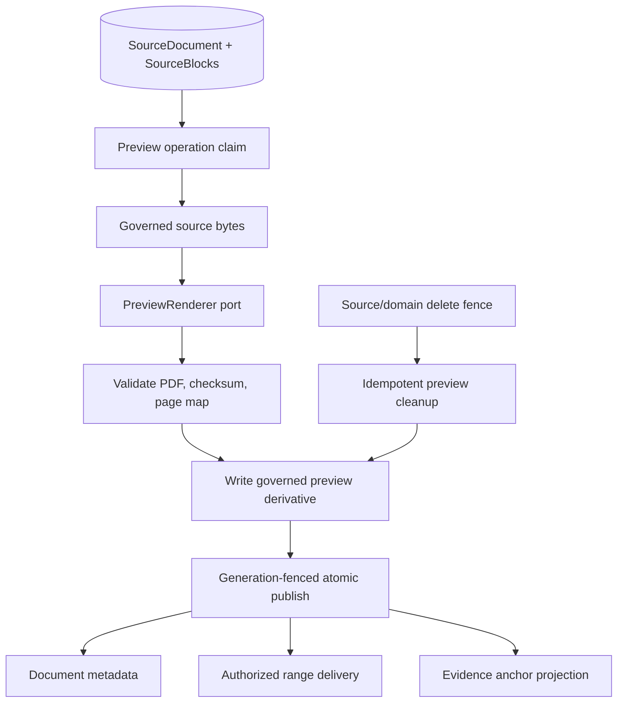

# P10-06 Governed Preview Generation - Plan

## Goal Capsule

- **Objective:** Close P10-06 by generating deterministic governed PDF previews for supported non-PDF sources and publishing preview bytes, page maps, anchor metadata, and versions atomically under the existing source lifecycle.
- **Authority:** `docs/contracts/document-and-evidence-contract.md`; `docs/architecture/data-and-lifecycle.md`; `docs/frontend/document-viewer-spec.md`; P4-05/P9-03 evidence; `docs/master-build-plan.md` P10-06.
- **Execution profile:** Inventory-first renderer port and worker integration; PostgreSQL + governed object-store proof; browser consumes only the existing authorized PDF contract.
- **Stop conditions:** Stop if a renderer cannot provide deterministic page mapping, if source content would be exposed through a new endpoint, if browser code would receive original non-PDF bytes or object-store URLs, or if preview replacement cannot preserve/degrade anchors safely.
- **Tail ownership:** P12-04 backup/restore; P12-06 renderer/image pin and SBOM; P12-07 deployed browser and cache/privacy proof.

---

## Product Contract

### Summary

PDF uploads may use their validated original bytes as the governed preview. Supported DOCX, Markdown, and text uploads require a deterministic server-generated PDF representation before `previewKind=pdf`; the browser never renders the original format inline.

Product Contract preservation: unchanged; this plan implements the existing governed-preview requirement.

### Problem Frame

The current document service reports `previewKind=pdf` only for PDF uploads and serves original PDF bytes. Prepared non-PDF sources remain `previewKind=unavailable`, despite the approved contract requiring a governed PDF preview with private renderer version, source hash, page mapping, checksum, and preview version. P4-05 can project normalized regions, but those anchors are useful for non-PDF documents only after a deterministic preview/page-map boundary exists.

### Actors

- A1. Administrator uploads and prepares a supported source without selecting a renderer or storage target.
- A2. Member opens only the authorized governed PDF representation and safe Evidence anchors.
- A3. Worker generates, validates, publishes, replaces, and deletes preview derivatives under leases/generations.
- A4. Operator packages and pins the renderer and proves recovery.

### Key Flows

- F1. Prepared supported source → preview operation claim → renderer consumes governed source bytes → validates bounded PDF + page map → writes derived object → atomically publishes preview metadata/version.
- F2. Authorized document metadata/content reads resolve the committed preview generation and retain existing private no-store, range, abort, and opaque ETag behavior.
- F3. Preview replacement maps current block anchors to the new preview; an unprovable exact region degrades to section/page fallback rather than guessing.
- F4. Source/domain deletion fences reads first, then removes preview and mapping derivatives idempotently with recoverable cleanup.

### Requirements

- R1. Inventory current preview, object-store, source-generation, region-anchor, content-range, and delete/recovery seams.
- R2. Define a private typed preview-renderer port with bounded input/output, deterministic renderer identity, safe errors, cancellation/timeout, and no authorization or persistence authority.
- R3. Persist private preview object identity, checksum, version, page count, renderer version, source hash, and page-map generation without exposing storage paths or private IDs.
- R4. Publish preview bytes, page map, and anchor metadata atomically for one current source preparation generation; readers see the prior complete generation or the new complete generation.
- R5. Keep validated PDF originals as governed previews where permitted; generate previews only for approved non-PDF kinds.
- R6. Preserve the existing document metadata/content/location DTOs and range semantics; `previewKind` becomes `pdf` only after committed preview readiness.
- R7. Reproject current Evidence anchors through the committed page map and degrade unprovable region/section mappings explicitly.
- R8. Fence preview reads during source/domain deletion and perform repeatable object/page-map cleanup with reconciliation.
- R9. Package and pin the renderer separately from browser code; default CI uses deterministic fixtures while a production-profile smoke proves a real conversion.
- R10. Record evidence and update the master tracker without claiming non-PDF kinds whose renderer/mapping is unproven.

### Acceptance Examples

- AE1. A prepared DOCX fixture generates a valid PDF preview with deterministic checksum, page count, renderer version, and page mapping; authorized metadata reports `previewKind=pdf`.
- AE2. Markdown/text fixtures produce stable previews across identical retries, while changed source generations produce a new opaque version and ETag.
- AE3. A member requests full and single-range PDF bytes through the existing route and receives no object key, path, presigned URL, or original DOCX/Markdown/text bytes.
- AE4. Figure/table/text Evidence opens the mapped page/region when proven; an unavailable exact map degrades to the contracted fallback without fabricated page 1 or coordinates.
- AE5. A stale renderer completion cannot replace a newer preparation generation; failed object publication leaves the prior complete preview visible.
- AE6. Delete immediately makes metadata/content/location unavailable and eventually removes preview/page-map objects idempotently.

### Scope Boundaries

#### In scope

- DOCX, Markdown, and text to governed PDF for formats already approved by upload contracts
- Renderer port, persistence, worker lifecycle, object-store publication, page mapping, authorized delivery, deletion, packaging, and evidence

#### Deferred to Follow-Up Work

- PPT and other non-approved source formats
- OCR, editable HTML previews, multimodal embedding, and preview annotation authoring
- Re-preparing historical corpora solely to improve anchors

#### Outside this product's identity

- Browser-side conversion, original-office-file inline rendering, presigned object-store delivery, user-selected renderer, or provider/runtime paths in public DTOs

---

## Planning Contract

### Key Technical Decisions

- KTD1. **Preview generation is a private outbound port.** The renderer accepts governed bytes plus frozen content type and returns a bounded PDF/page-map result; services retain lifecycle authority.
- KTD2. **Preview publication is generation-atomic.** Metadata never points at an object/page map until all validation and writes succeed for the current preparation generation.
- KTD3. **Original PDF is an explicit adapter case.** A validated PDF may be referenced as the governed preview without needless re-rendering, while every non-PDF browser response is generated PDF.
- KTD4. **Page maps translate semantic anchors, not authorization.** Source Blocks remain canonical; page/region output is emitted only when the current committed map proves it.
- KTD5. **Object cleanup is reconciled.** Failed post-fence deletion remains retryable and never restores member access.
- KTD6. **Renderer support is evidence-gated.** Packaging or import success is not production support; deterministic fixture and production-profile smoke are both required.

### High-Level Technical Design

### Risks and Dependencies

- Renderer output drift can move anchors; pin renderer versions and require deterministic page-map fixtures.
- Large or malformed source files can exhaust conversion resources; reuse upload bounds and enforce renderer CPU/time/output/page limits.
- Object writes can succeed before database publication; record private cleanup intent and reconcile orphan derivatives.
- A preview swap can race an open viewer; retain opaque version/ETag and client generation fences, and never mix map generations.
- P10-04 governed object storage must supply integrity, range, delete, and reconciliation behavior before production closure.

---

## Implementation Units

### U1. Preview inventory and frozen contract

**Goal:** Freeze current delivery, anchor, storage, generation, and delete seams before implementation.

**Requirements:** R1

**Dependencies:** None

**Files:**
- Create: `docs/_scratch/p10-06-governed-preview-inventory.md`

**Approach:** Record retain/modify/add/defer dispositions for PDF-original delivery, non-PDF unavailable state, source generations, region projector, object storage, worker registration, and delete cleanup.

**Patterns to follow:** P4-05 and P10-04 inventories.

**Test scenarios:**
- Test expectation: none -- inventory artifact.

**Verification:** Every preview read/write/delete seam and contract field has an owner and disposition.

---

### U2. Renderer port and deterministic adapters

**Goal:** Produce validated PDF/page-map results behind a bounded private port.

**Requirements:** R2, R5, R9, AE1, AE2

**Dependencies:** U1

**Files:**
- Add: preview renderer port/adapters under `app/context_engine/adapters/`
- Modify: `app/pyproject.toml`
- Modify: `app/Dockerfile`
- Add: deterministic renderer fixtures under `app/tests/fixtures/documents/`
- Add: renderer adapter tests under `app/tests/`

**Approach:** Implement explicit PDF-pass-through and approved non-PDF conversion adapters. Run conversion in a killable bounded process, validate output magic/size/page count/checksum and page-map shape, and return typed safe failures without raw renderer output.

**Execution note:** Characterize and pin real renderer output before writing production-profile expectations.

**Patterns to follow:** parser adapter safe-error boundary and P10-05 killable local parser execution.

**Test scenarios:**
- Covers AE1. DOCX fixture produces valid deterministic PDF and complete map metadata.
- Covers AE2. Identical Markdown/text input and renderer version produce identical checksums/maps.
- Error: timeout, crash, malformed PDF, excessive pages/output, invalid map, and unsupported content type fail closed with cleanup.
- Privacy: temporary paths, source text, renderer command, and raw stderr never cross public/log/audit boundaries.

**Verification:** Packaged adapter passes fixture determinism, bounds, cleanup, and smoke evidence.

---

### U3. Preview schema and atomic publication worker

**Goal:** Persist and publish one complete governed preview generation under leases and source-generation fences.

**Requirements:** R3, R4, R6, AE2, AE5

**Dependencies:** U2, P10-04

**Files:**
- Modify: `docs/database-schema.txt`
- Add: Alembic migration under `app/migrations/versions/`
- Modify: `app/context_engine/models.py`
- Modify: `app/context_engine/services/sources.py`
- Modify: `app/context_engine/worker.py`
- Add: PostgreSQL preview publication/race tests under `app/tests/`

**Approach:** Add private preview metadata and operation/lease state using existing generation conventions. Commit operation intent before conversion, run external work outside transactions, write derived objects, then compare-and-swap publish only for the current source generation. Preserve the prior complete preview on failed/stale replacement and reconcile orphan writes.

**Test scenarios:**
- Covers AE5. Stale generation, lost lease, and cancelled operation cannot publish.
- Happy: committed preview exposes internally consistent object/checksum/version/page-map metadata.
- Error: renderer succeeds but object write fails; no partial metadata publishes.
- Error: object write succeeds but database CAS loses; orphan cleanup/reconciliation is queued safely.
- PostgreSQL race: two workers cannot claim or publish the same active generation.

**Verification:** Fresh/upgrade migration and real PostgreSQL race proofs pass; previous-version rollback notes cover app-before-schema ordering.

---

### U4. Authorized delivery and anchor mapping

**Goal:** Serve only committed governed PDF bytes and current mapped anchors through existing contracts.

**Requirements:** R6, R7, AE1–AE4

**Dependencies:** U3

**Files:**
- Modify: `app/context_engine/services/documents.py`
- Modify: shared persisted Evidence anchor projector
- Modify: document/evidence HTTP and service tests under `app/tests/`
- Modify: generated contracts only if an existing closed schema must be corrected

**Approach:** Resolve preview readiness/version inside existing authorization checks. Preserve full/single-range responses, private no-store headers, abort behavior, and opaque ETags. Project region/section/page only from the matching committed page-map generation; otherwise degrade explicitly.

**Test scenarios:**
- Covers AE3. Authorized 200/206/416 delivery returns generated PDF bytes and required headers without source-format leakage.
- Covers AE4. Region, section, page, and unavailable mappings follow the exact fallback ladder.
- Error: unknown/unauthorized/deleting source and stale Evidence share contracted safe failures and expose no preview metadata.
- Concurrency: a late location response from an old preview version cannot replace the current viewer anchor.

**Verification:** HTTP/schema/frontend contract regressions pass with PDF and generated-preview fixtures.

---

### U5. Delete/recovery, evidence, and tracker

**Goal:** Make preview cleanup recoverable and close P10-06 with honest supported-format evidence.

**Requirements:** R8–R10, AE6

**Dependencies:** U3, U4

**Files:**
- Modify: source/domain delete cleanup services and tests
- Modify: `docs/operations/compose-stack-runbook.md`
- Create: `docs/_scratch/p10-06-governed-preview-evidence.md`
- Modify: `docs/master-build-plan.md`

**Approach:** Fence reads before cleanup, delete preview/page-map derivatives idempotently, retain retry/reconciliation state on failure, document supported formats and renderer artifact, and assign backup/SBOM/browser residuals to P12.

**Test scenarios:**
- Covers AE6. Delete makes metadata/content/location unavailable before object cleanup and repeated cleanup converges.
- Error: partial preview/page-map deletion records recoverable failure without restoring access.
- Recovery: restart/reclaim completes expired cleanup lease.
- Privacy: success/failure evidence and logs contain no object keys, temporary paths, source content, or renderer payloads.

**Verification:** Deletion/recovery tests and evidence pass; tracker marks only proven formats supported.

---

## Verification Contract

- Renderer fixture determinism, bounds, timeout, cleanup, and privacy tests pass.
- PostgreSQL migration, claim, stale-completion, atomic publication, replacement, and reconciliation tests pass.
- Existing document metadata/content/location contracts remain closed and range tests pass for generated previews.
- Production-profile smoke proves each supported non-PDF format without entering default no-network CI.
- Root backend/frontend/contract/privacy gates remain green.

## Definition of Done

R1–R10 and AE1–AE6 are satisfied; supported non-PDF sources receive deterministic governed PDF previews; preview/page-map publication and deletion are generation-safe and recoverable; original non-PDF bytes and private renderer/storage details never cross the browser boundary; unsupported formats remain explicitly unavailable; P10-06 is DONE.

## Sources & Research

- `docs/contracts/document-and-evidence-contract.md`
- `docs/architecture/data-and-lifecycle.md`
- `docs/frontend/document-viewer-spec.md`
- `docs/_scratch/p4-05-region-provenance-evidence.md`
- `docs/plans/2026-07-28-011-feat-p10-04-minio-object-store-plan.md`
- `docs/master-build-plan.md` P10-06
